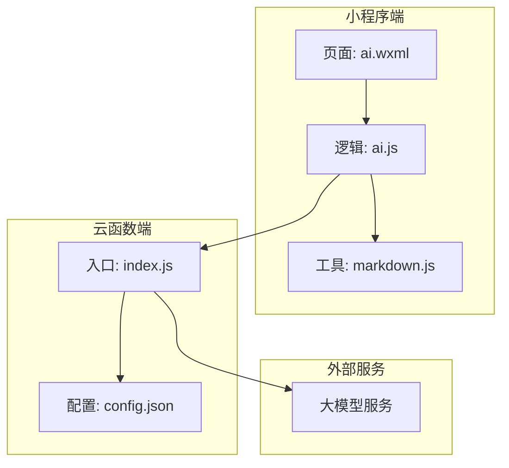
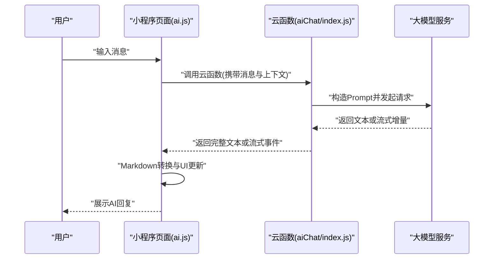
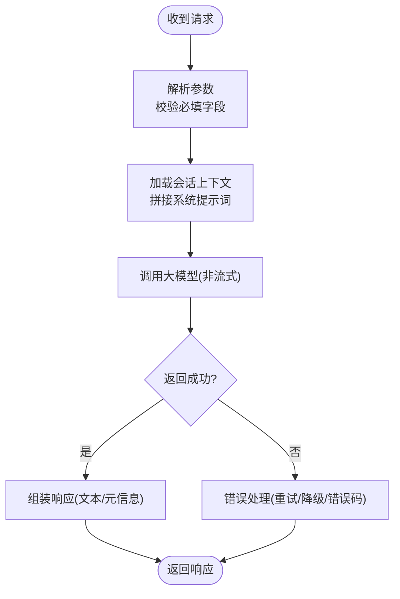
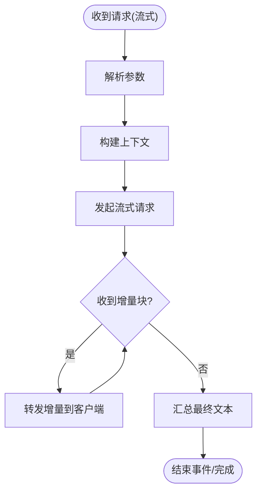
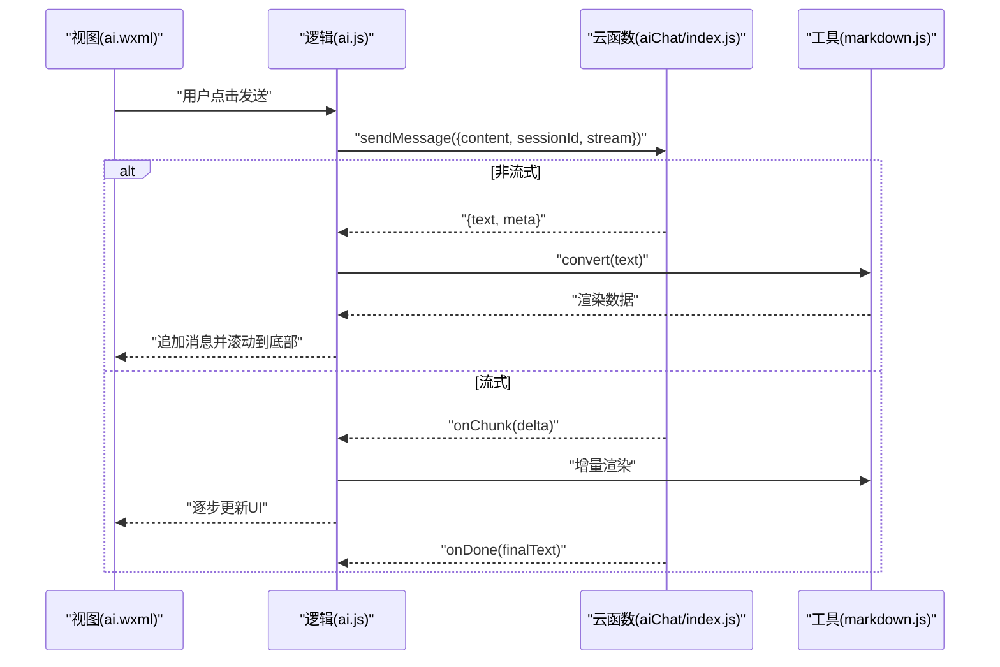
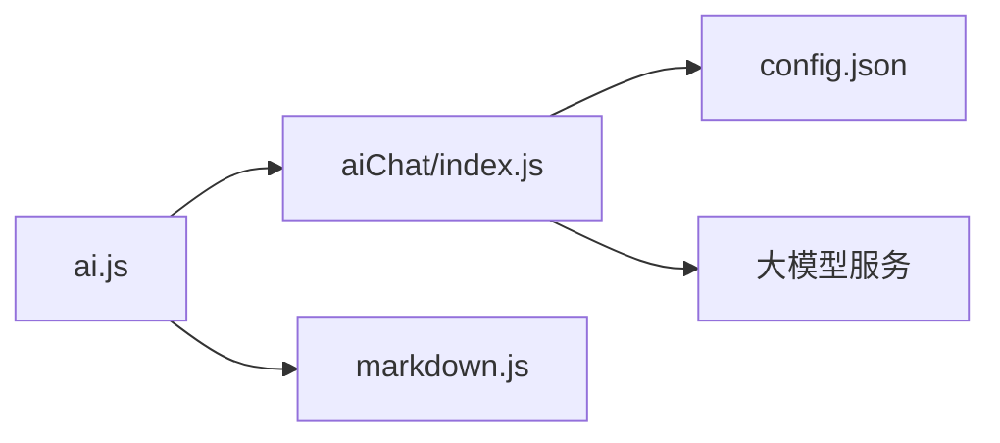
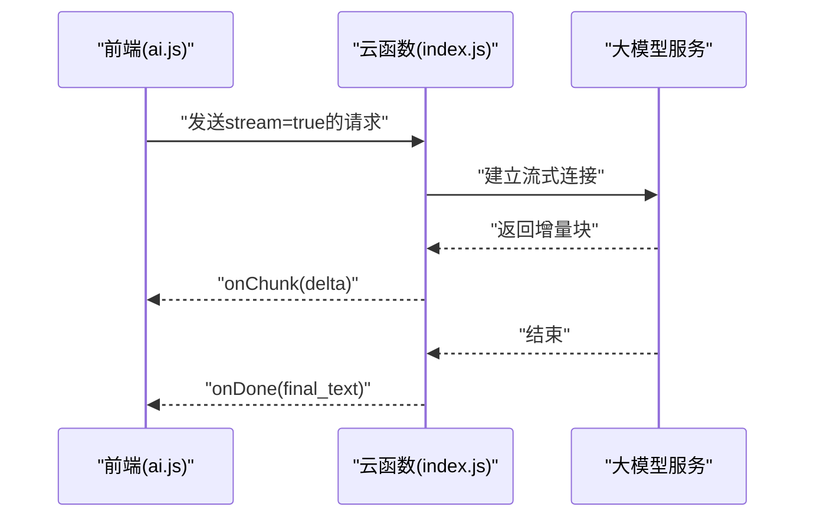
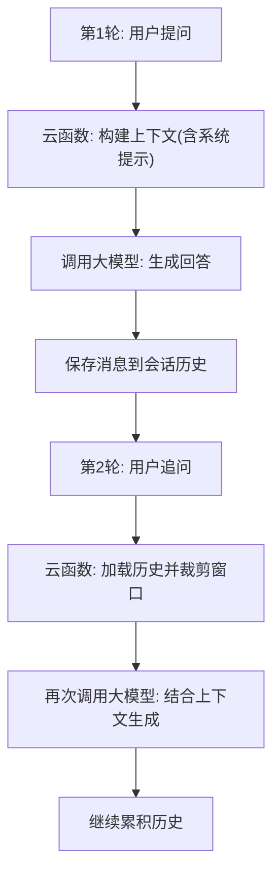

# AI对话API

<cite>
**本文引用的文件**   
- [cloudfunctions/aiChat/index.js](file://cloudfunctions/aiChat/index.js)
- [cloudfunctions/aiChat/config.json](file://cloudfunctions/aiChat/config.json)
- [miniprogram/pages/ai/ai.js](file://miniprogram/pages/ai/ai.js)
- [miniprogram/pages/ai/ai.wxml](file://miniprogram/pages/ai/ai.wxml)
- [miniprogram/utils/markdown.js](file://miniprogram/utils/markdown.js)
</cite>

## 目录
1. [简介](#简介)
2. [项目结构](#项目结构)
3. [核心组件](#核心组件)
4. [架构总览](#架构总览)
5. [详细组件分析](#详细组件分析)
6. [依赖关系分析](#依赖关系分析)
7. [性能与可靠性](#性能与可靠性)
8. [故障排查指南](#故障排查指南)
9. [结论](#结论)
10. [附录：接口规范](#附录接口规范)

## 简介
本文件面向AI智能助手对话系统的API接口文档，覆盖消息发送、接收、上下文管理、多轮对话、流式响应、超时控制、重试机制、错误处理、限流与监控等关键主题。文档基于云函数端与小程序端的实现进行梳理，帮助开发者快速理解并集成AI对话能力。

## 项目结构
本项目采用“小程序前端 + 云函数后端”的常见架构。AI对话相关的关键位置如下：
- 云函数端：负责调用大模型服务、维护会话上下文、返回文本或流式增量数据
- 小程序端：负责用户交互、消息渲染（含Markdown）、调用云函数、处理流式输出与错误

图表来源
- [cloudfunctions/aiChat/index.js](file://cloudfunctions/aiChat/index.js)
- [cloudfunctions/aiChat/config.json](file://cloudfunctions/aiChat/config.json)
- [miniprogram/pages/ai/ai.js](file://miniprogram/pages/ai/ai.js)
- [miniprogram/pages/ai/ai.wxml](file://miniprogram/pages/ai/ai.wxml)
- [miniprogram/utils/markdown.js](file://miniprogram/utils/markdown.js)

章节来源
- [cloudfunctions/aiChat/index.js](file://cloudfunctions/aiChat/index.js)
- [cloudfunctions/aiChat/config.json](file://cloudfunctions/aiChat/config.json)
- [miniprogram/pages/ai/ai.js](file://miniprogram/pages/ai/ai.js)
- [miniprogram/pages/ai/ai.wxml](file://miniprogram/pages/ai/ai.wxml)
- [miniprogram/utils/markdown.js](file://miniprogram/utils/markdown.js)

## 核心组件
- 云函数入口：统一接收请求参数、鉴权与会话上下文解析、调用大模型、组装响应（支持流式）
- 小程序对话页：组织消息列表、渲染Markdown、发起调用、处理流式增量与错误提示
- Markdown工具：将大模型返回的Markdown文本转换为小程序可渲染的内容

章节来源
- [cloudfunctions/aiChat/index.js](file://cloudfunctions/aiChat/index.js)
- [miniprogram/pages/ai/ai.js](file://miniprogram/pages/ai/ai.js)
- [miniprogram/utils/markdown.js](file://miniprogram/utils/markdown.js)

## 架构总览
下图展示了从用户输入到AI回复的端到端流程，包括流式响应的增量推送与前端渲染。

图表来源
- [cloudfunctions/aiChat/index.js](file://cloudfunctions/aiChat/index.js)
- [miniprogram/pages/ai/ai.js](file://miniprogram/pages/ai/ai.js)
- [miniprogram/utils/markdown.js](file://miniprogram/utils/markdown.js)

## 详细组件分析

### 云函数端：aiChat/index.js
职责
- 解析请求体：用户ID、消息内容、会话标识、是否启用流式等
- 上下文管理：读取历史消息、合并系统提示词、裁剪窗口长度
- 调用大模型：根据配置选择模型与参数；支持流式与非流式
- 响应封装：统一返回格式、错误码、耗时统计、日志埋点

关键流程（非流式）

关键流程（流式）

章节来源
- [cloudfunctions/aiChat/index.js](file://cloudfunctions/aiChat/index.js)

### 小程序端：ai.js
职责
- 消息状态管理：本地消息队列、滚动定位、加载态
- 调用云函数：支持同步返回与流式回调
- Markdown渲染：调用markdown工具将结果转为可渲染内容
- 错误与重试：网络异常、超时、业务错误的提示与重试策略

典型交互序列

章节来源
- [miniprogram/pages/ai/ai.js](file://miniprogram/pages/ai/ai.js)
- [miniprogram/pages/ai/ai.wxml](file://miniprogram/pages/ai/ai.wxml)
- [miniprogram/utils/markdown.js](file://miniprogram/utils/markdown.js)

### Markdown工具：markdown.js
职责
- 将大模型返回的Markdown文本转换为小程序可用的结构化数据
- 提供基础的安全过滤与样式兼容处理

章节来源
- [miniprogram/utils/markdown.js](file://miniprogram/utils/markdown.js)

## 依赖关系分析
- 小程序页面依赖云函数进行AI推理与上下文管理
- 云函数依赖外部大模型服务与配置文件
- 小程序侧Markdown工具仅用于渲染，不参与业务逻辑

图表来源
- [miniprogram/pages/ai/ai.js](file://miniprogram/pages/ai/ai.js)
- [cloudfunctions/aiChat/index.js](file://cloudfunctions/aiChat/index.js)
- [cloudfunctions/aiChat/config.json](file://cloudfunctions/aiChat/config.json)
- [miniprogram/utils/markdown.js](file://miniprogram/utils/markdown.js)

章节来源
- [miniprogram/pages/ai/ai.js](file://miniprogram/pages/ai/ai.js)
- [cloudfunctions/aiChat/index.js](file://cloudfunctions/aiChat/index.js)
- [cloudfunctions/aiChat/config.json](file://cloudfunctions/aiChat/config.json)
- [miniprogram/utils/markdown.js](file://miniprogram/utils/markdown.js)

## 性能与可靠性
- 流式响应
  - 建议开启流式以减少首字延迟，提升用户体验
  - 前端对增量进行节流渲染，避免频繁重绘
- 超时控制
  - 为长文本生成设置合理超时阈值，并在前端显示等待提示
  - 云函数层对大模型调用增加超时保护
- 重试机制
  - 针对网络抖动与瞬时失败，采用指数退避重试
  - 幂等性：通过会话ID与消息序号保证重复请求不产生副作用
- 限流控制
  - 前端限制用户连续发送频率
  - 云函数侧按用户或会话维度做QPS限制
- 缓存与记忆
  - 会话上下文按会话ID持久化，支持跨轮次保持
  - 对热点问答可做短期缓存，降低重复请求成本
- 监控与埋点
  - 记录请求耗时、错误率、流式增量数量、Token用量（若可用）
  - 告警阈值：错误率、P95/P99延迟、大模型服务可用性

[本节为通用指导，无需代码来源]

## 故障排查指南
常见问题与定位步骤
- 无法连接云函数
  - 检查小程序端调用路径与权限配置
  - 查看云函数日志与错误码
- 流式无响应或中断
  - 确认服务端是否返回增量事件
  - 检查前端增量处理与UI渲染链路
- 超长文本导致卡顿
  - 使用流式增量渲染
  - 对Markdown转换进行分片处理
- 上下文丢失
  - 核对会话ID传递是否正确
  - 检查上下文裁剪策略是否过短

章节来源
- [cloudfunctions/aiChat/index.js](file://cloudfunctions/aiChat/index.js)
- [miniprogram/pages/ai/ai.js](file://miniprogram/pages/ai/ai.js)

## 结论
本API以云函数为核心编排AI推理与上下文管理，配合小程序端的流式渲染与Markdown处理，形成完整的AI对话体验。建议在接入时优先启用流式响应、完善超时与重试策略，并结合限流与监控保障稳定性与性能。

[本节为总结性内容，无需代码来源]

## 附录：接口规范

### 通用约定
- 协议：HTTPS
- 编码：UTF-8
- 认证：由平台鉴权体系负责（如小程序登录态）
- 时间与时区：UTC+8
- 分页与游标：适用于历史消息查询

### 消息发送接口
- 方法：POST /api/chat/send
- 说明：发送单条消息，返回AI回复（支持流式）
- 请求体
  - user_id: string，用户标识
  - session_id: string，会话标识
  - content: string，消息正文
  - stream: boolean，是否启用流式
  - options: object，可选参数（如温度、最大长度等）
- 响应体（非流式）
  - code: number，状态码
  - data: object
    - text: string，AI回复文本
    - meta: object，元信息（如耗时、token计数等）
  - message: string，提示信息
- 响应体（流式）
  - event: string，事件类型
    - chunk: 增量文本
    - done: 完成信号
  - data: object
    - delta: string，增量片段
    - final_text: string，完成后的完整文本
- 错误码
  - 400: 参数错误
  - 401: 未授权
  - 429: 限流
  - 500: 内部错误
  - 503: 上游服务不可用

章节来源
- [cloudfunctions/aiChat/index.js](file://cloudfunctions/aiChat/index.js)

### 获取对话历史接口
- 方法：GET /api/chat/history
- 说明：按会话ID拉取历史消息
- 查询参数
  - session_id: string，会话标识
  - limit: number，返回条数上限
  - cursor: string，分页游标
- 响应体
  - code: number
  - data: array，消息列表
    - role: string，角色（user/assistant/system）
    - content: string，消息内容
    - created_at: string，创建时间
  - next_cursor: string，下一页游标
- 错误码
  - 400: 参数错误
  - 404: 会话不存在

章节来源
- [cloudfunctions/aiChat/index.js](file://cloudfunctions/aiChat/index.js)

### 上下文管理接口
- 方法：PUT /api/chat/context
- 说明：更新或重置会话上下文
- 请求体
  - session_id: string
  - system_prompt: string，系统提示词
  - history_window: number，保留最近N轮
  - reset: boolean，是否清空历史
- 响应体
  - code: number
  - data: object
    - session_id: string
    - context_size: number，当前上下文大小
- 错误码
  - 400: 参数错误
  - 404: 会话不存在

章节来源
- [cloudfunctions/aiChat/index.js](file://cloudfunctions/aiChat/index.js)

### 消息类型识别接口
- 方法：POST /api/chat/classify
- 说明：识别消息意图或类型，便于路由与模板匹配
- 请求体
  - content: string
  - session_id: string
- 响应体
  - code: number
  - data: object
    - type: string，类型标签
    - confidence: number，置信度
    - slots: object，槽位信息
- 错误码
  - 400: 参数错误

章节来源
- [cloudfunctions/aiChat/index.js](file://cloudfunctions/aiChat/index.js)

### 流式响应处理示例（概念流程）

图表来源
- [cloudfunctions/aiChat/index.js](file://cloudfunctions/aiChat/index.js)
- [miniprogram/pages/ai/ai.js](file://miniprogram/pages/ai/ai.js)

### 多轮对话与上下文保持示例（概念流程）

图表来源
- [cloudfunctions/aiChat/index.js](file://cloudfunctions/aiChat/index.js)

### 错误处理与重试最佳实践
- 前端
  - 网络错误：自动重试一次，失败后提示用户
  - 超时：显示等待提示，允许取消
  - 流式中途中断：尝试恢复连接或回退为非流式
- 云函数
  - 指数退避重试：最大重试次数与间隔可配置
  - 熔断与降级：上游不可用时返回友好提示
  - 限流：按用户/会话维度限制并发与QPS

章节来源
- [cloudfunctions/aiChat/index.js](file://cloudfunctions/aiChat/index.js)
- [miniprogram/pages/ai/ai.js](file://miniprogram/pages/ai/ai.js)

### 限流与监控指标
- 限流
  - 前端：按钮防抖、最小发送间隔
  - 云函数：令牌桶或滑动窗口限流
- 监控
  - 请求量、成功率、P95/P99延迟
  - 流式增量数量、平均增量时长
  - 错误分布与Top错误原因

[本节为通用指导，无需代码来源]