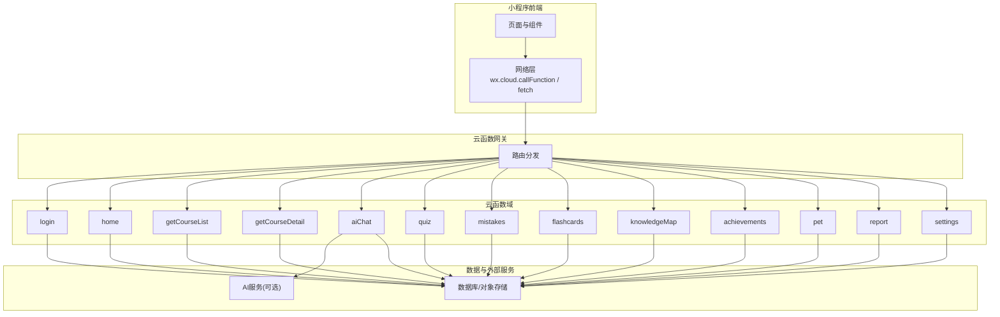
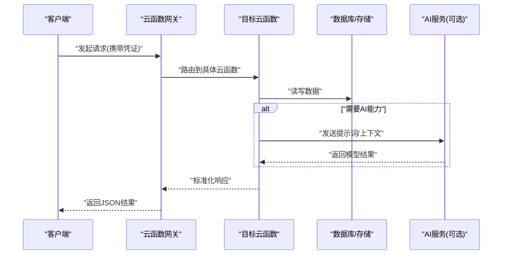

</think>

<docs>
# API接口文档

<cite>
**本文档引用的文件**   
- [cloudfunctions/login/index.js](file://cloudfunctions/login/index.js)
- [cloudfunctions/home/index.js](file://cloudfunctions/home/index.js)
- [cloudfunctions/getCourseList/index.js](file://cloudfunctions/getCourseList/index.js)
- [cloudfunctions/getCourseDetail/index.js](file://cloudfunctions/getCourseDetail/index.js)
- [cloudfunctions/aiChat/index.js](file://cloudfunctions/aiChat/index.js)
- [cloudfunctions/quiz/index.js](file://cloudfunctions/quiz/index.js)
- [cloudfunctions/mistakes/index.js](file://cloudfunctions/mistakes/index.js)
- [cloudfunctions/flashcards/index.js](file://cloudfunctions/flashcards/index.js)
- [cloudfunctions/knowledgeMap/index.js](file://cloudfunctions/knowledgeMap/index.js)
- [cloudfunctions/achievements/index.js](file://cloudfunctions/achievements/index.js)
- [cloudfunctions/pet/index.js](file://cloudfunctions/pet/index.js)
- [cloudfunctions/report/index.js](file://cloudfunctions/report/index.js)
- [cloudfunctions/settings/index.js](file://cloudfunctions/settings/index.js)
</cite>

## 目录
1. [简介](#简介)
2. [项目结构](#项目结构)
3. [核心组件](#核心组件)
4. [架构总览](#架构总览)
5. [详细组件分析](#详细组件分析)
6. [依赖分析](#依赖分析)
7. [性能考虑](#性能考虑)
8. [故障排查指南](#故障排查指南)
9. [结论](#结论)
10. [附录](#附录) 

## 简介
本文件为云函数提供的RESTful风格API接口文档，覆盖用户认证、课程管理、AI对话、测验系统、错题管理、学习卡片、知识图谱、成就与宠物、报告与设置等模块。每个接口均包含URL路径、HTTP方法、请求参数、响应格式、错误码与调用示例说明，并给出最佳实践、错误处理策略与性能优化建议，帮助开发者准确理解和使用所有可用接口。

## 项目结构
本项目采用“按功能域划分”的云函数组织方式，每个云函数对应一个业务能力或一组相关接口。前端小程序通过统一网关（如微信云开发云函数调用）访问这些云函数，实现跨端一致的API契约。

图表来源 
- [cloudfunctions/login/index.js](file://cloudfunctions/login/index.js)
- [cloudfunctions/home/index.js](file://cloudfunctions/home/index.js)
- [cloudfunctions/getCourseList/index.js](file://cloudfunctions/getCourseList/index.js)
- [cloudfunctions/getCourseDetail/index.js](file://cloudfunctions/getCourseDetail/index.js)
- [cloudfunctions/aiChat/index.js](file://cloudfunctions/aiChat/index.js)
- [cloudfunctions/quiz/index.js](file://cloudfunctions/quiz/index.js)
- [cloudfunctions/mistakes/index.js](file://cloudfunctions/mistakes/index.js)
- [cloudfunctions/flashcards/index.js](file://cloudfunctions/flashcards/index.js)
- [cloudfunctions/knowledgeMap/index.js](file://cloudfunctions/knowledgeMap/index.js)
- [cloudfunctions/achievements/index.js](file://cloudfunctions/achievements/index.js)
- [cloudfunctions/pet/index.js](file://cloudfunctions/pet/index.js)
- [cloudfunctions/report/index.js](file://cloudfunctions/report/index.js)
- [cloudfunctions/settings/index.js](file://cloudfunctions/settings/index.js)

章节来源
- [cloudfunctions/login/index.js](file://cloudfunctions/login/index.js)
- [cloudfunctions/home/index.js](file://cloudfunctions/home/index.js)
- [cloudfunctions/getCourseList/index.js](file://cloudfunctions/getCourseList/index.js)
- [cloudfunctions/getCourseDetail/index.js](file://cloudfunctions/getCourseDetail/index.js)
- [cloudfunctions/aiChat/index.js](file://cloudfunctions/aiChat/index.js)
- [cloudfunctions/quiz/index.js](file://cloudfunctions/quiz/index.js)
- [cloudfunctions/mistakes/index.js](file://cloudfunctions/mistakes/index.js)
- [cloudfunctions/flashcards/index.js](file://cloudfunctions/flashcards/index.js)
- [cloudfunctions/knowledgeMap/index.js](file://cloudfunctions/knowledgeMap/index.js)
- [cloudfunctions/achievements/index.js](file://cloudfunctions/achievements/index.js)
- [cloudfunctions/pet/index.js](file://cloudfunctions/pet/index.js)
- [cloudfunctions/report/index.js](file://cloudfunctions/report/index.js)
- [cloudfunctions/settings/index.js](file://cloudfunctions/settings/index.js)

## 核心组件
- 认证与会话：登录、鉴权、会话维持
- 课程中心：课程列表、课程详情
- AI助手：多轮对话、上下文管理
- 测验系统：创建、提交、评分、统计
- 错题管理：收集、复习、掌握度
- 学习卡片：闪卡生成、记忆曲线
- 知识图谱：知识点关联、导航
- 成就与宠物：激励体系、成长状态
- 报告与设置：学习报告、个性化配置

章节来源
- [cloudfunctions/login/index.js](file://cloudfunctions/login/index.js)
- [cloudfunctions/home/index.js](file://cloudfunctions/home/index.js)
- [cloudfunctions/getCourseList/index.js](file://cloudfunctions/getCourseList/index.js)
- [cloudfunctions/getCourseDetail/index.js](file://cloudfunctions/getCourseDetail/index.js)
- [cloudfunctions/aiChat/index.js](file://cloudfunctions/aiChat/index.js)
- [cloudfunctions/quiz/index.js](file://cloudfunctions/quiz/index.js)
- [cloudfunctions/mistakes/index.js](file://cloudfunctions/mistakes/index.js)
- [cloudfunctions/flashcards/index.js](file://cloudfunctions/flashcards/index.js)
- [cloudfunctions/knowledgeMap/index.js](file://cloudfunctions/knowledgeMap/index.js)
- [cloudfunctions/achievements/index.js](file://cloudfunctions/achievements/index.js)
- [cloudfunctions/pet/index.js](file://cloudfunctions/pet/index.js)
- [cloudfunctions/report/index.js](file://cloudfunctions/report/index.js)
- [cloudfunctions/settings/index.js](file://cloudfunctions/settings/index.js)

## 架构总览
下图展示从客户端到云函数再到数据层的典型调用流程。

图表来源 
- [cloudfunctions/aiChat/index.js](file://cloudfunctions/aiChat/index.js)
- [cloudfunctions/quiz/index.js](file://cloudfunctions/quiz/index.js)
- [cloudfunctions/mistakes/index.js](file://cloudfunctions/mistakes/index.js)
- [cloudfunctions/getCourseList/index.js](file://cloudfunctions/getCourseList/index.js)
- [cloudfunctions/getCourseDetail/index.js](file://cloudfunctions/getCourseDetail/index.js)

## 详细组件分析

### 用户认证
- 接口名称：登录
- URL路径：/login
- HTTP方法：POST
- 请求参数
  - body.username: string, 必填
  - body.password: string, 必填
  - body.captchaCode?: string, 选填
- 响应格式
  - success: boolean
  - data.token: string
  - data.user: object
  - message: string
- 错误码
  - 400: 参数缺失或格式错误
  - 401: 用户名或密码错误
  - 403: 验证码错误
  - 500: 服务器内部错误
- 调用示例
  - 请求体示例：{"username":"user","password":"pass"}
  - 成功响应示例：{"success":true,"data":{"token":"...","user":{}},"message":"登录成功"}
- 注意事项
  - 令牌有效期与刷新策略由服务端定义
  - 后续请求需在Header中携带Authorization

章节来源
- [cloudfunctions/login/index.js](file://cloudfunctions/login/index.js)

### 首页聚合
- 接口名称：首页数据
- URL路径：/home
- HTTP方法：GET
- 请求参数
  - query.userId: string, 必填
- 响应格式
  - success: boolean
  - data: object (包含推荐课程、最近学习、待完成任务等)
  - message: string
- 错误码
  - 400: 缺少userId
  - 500: 服务器内部错误
- 调用示例
  - GET /home?userId=xxx
  - 成功响应示例：{"success":true,"data":{},"message":"获取成功"}

章节来源
- [cloudfunctions/home/index.js](file://cloudfunctions/home/index.js)

### 课程管理
- 接口名称：课程列表
- URL路径：/course/list
- HTTP方法：GET
- 请求参数
  - query.page: number, 默认1
  - query.pageSize: number, 默认20
  - query.keyword?: string, 选填
  - query.categoryId?: string, 选填
- 响应格式
  - success: boolean
  - data.list: array
  - data.total: number
  - message: string
- 错误码
  - 400: 分页参数非法
  - 500: 服务器内部错误
- 调用示例
  - GET /course/list?page=1&pageSize=20&keyword=生物
  - 成功响应示例：{"success":true,"data":{"list":[],"total":0},"message":"获取成功"}

- 接口名称：课程详情
- URL路径：/course/detail
- HTTP方法：GET
- 请求参数
  - query.courseId: string, 必填
- 响应格式
  - success: boolean
  - data: object (课程基本信息、章节、资源等)
  - message: string
- 错误码
  - 400: 缺少courseId
  - 404: 课程不存在
  - 500: 服务器内部错误
- 调用示例
  - GET /course/detail?courseId=xxx
  - 成功响应示例：{"success":true,"data":{},"message":"获取成功"}

章节来源
- [cloudfunctions/getCourseList/index.js](file://cloudfunctions/getCourseList/index.js)
- [cloudfunctions/getCourseDetail/index.js](file://cloudfunctions/getCourseDetail/index.js)

### AI对话
- 接口名称：AI对话
- URL路径：/ai/chat
- HTTP方法：POST
- 请求参数
  - body.userId: string, 必填
  - body.message: string, 必填
  - body.conversationId?: string, 选填
  - body.context?: object, 选填
- 响应格式
  - success: boolean
  - data.reply: string
  - data.conversationId: string
  - data.suggestions: array<string>, 选填
  - message: string
- 错误码
  - 400: 参数缺失或格式错误
  - 429: 请求过于频繁
  - 500: 服务器内部错误
- 调用示例
  - 请求体示例：{"userId":"u1","message":"解释光合作用","conversationId":"c1"}
  - 成功响应示例：{"success":true,"data":{"reply":"...","conversationId":"c1"},"message":"成功"}
- 注意事项
  - 长上下文建议分页或摘要压缩
  - 建议客户端实现重试与退避

章节来源
- [cloudfunctions/aiChat/index.js](file://cloudfunctions/aiChat/index.js)

### 测验系统
- 接口名称：创建测验
- URL路径：/quiz/create
- HTTP方法：POST
- 请求参数
  - body.userId: string, 必填
  - body.courseId: string, 必填
  - body.questionIds: array<string>, 必填
- 响应格式
  - success: boolean
  - data.quizId: string
  - message: string
- 错误码
  - 400: 参数缺失或题目不存在
  - 500: 服务器内部错误
- 调用示例
  - 请求体示例：{"userId":"u1","courseId":"c1","questionIds":["q1","q2"]}
  - 成功响应示例：{"success":true,"data":{"quizId":"z1"},"message":"创建成功"}

- 接口名称：提交答案
- URL路径：/quiz/submit
- HTTP方法：POST
- 请求参数
  - body.quizId: string, 必填
  - body.answers: object, 必填
- 响应格式
  - success: boolean
  - data.score: number
  - data.feedback: array<object>, 选填
  - message: string
- 错误码
  - 400: 参数缺失或测验不存在
  - 404: 测验不存在
  - 500: 服务器内部错误
- 调用示例
  - 请求体示例：{"quizId":"z1","answers":{"q1":"A","q2":"B"}}
  - 成功响应示例：{"success":true,"data":{"score":80,"feedback":[]},"message":"提交成功"}

- 接口名称：测验记录
- URL路径：/quiz/records
- HTTP方法：GET
- 请求参数
  - query.userId: string, 必填
  - query.page: number, 默认1
  - query.pageSize: number, 默认20
- 响应格式
  - success: boolean
  - data.list: array
  - data.total: number
  - message: string
- 错误码
  - 400: 分页参数非法
  - 500: 服务器内部错误
- 调用示例
  - GET /quiz/records?userId=u1&page=1&pageSize=20
  - 成功响应示例：{"success":true,"data":{"list":[],"total":0},"message":"获取成功"}

章节来源
- [cloudfunctions/quiz/index.js](file://cloudfunctions/quiz/index.js)

### 错题管理
- 接口名称：添加错题
- URL路径：/mistakes/add
- HTTP方法：POST
- 请求参数
  - body.userId: string, 必填
  - body.questionId: string, 必填
  - body.reason?: string, 选填
- 响应格式
  - success: boolean
  - data.mistakeId: string
  - message: string
- 错误码
  - 400: 参数缺失
  - 500: 服务器内部错误
- 调用示例
  - 请求体示例：{"userId":"u1","questionId":"q1","reason":"概念不清"}
  - 成功响应示例：{"success":true,"data":{"m