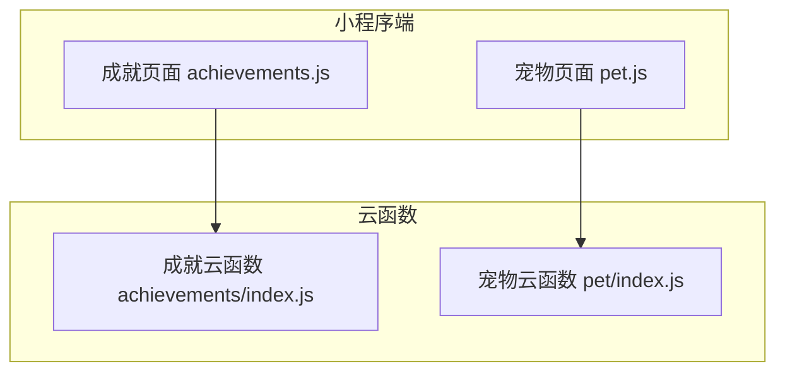
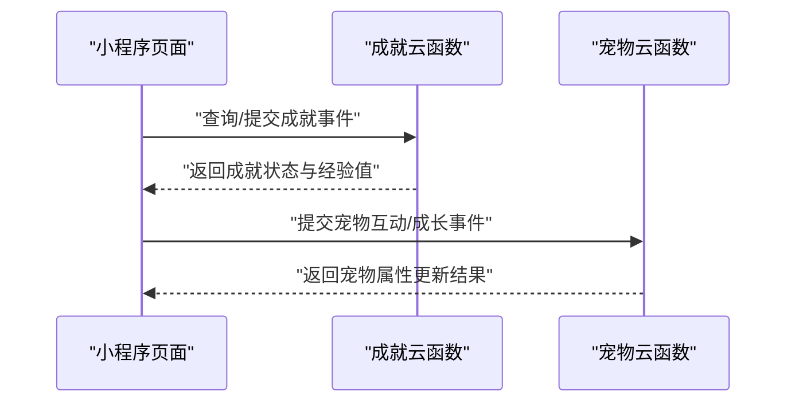
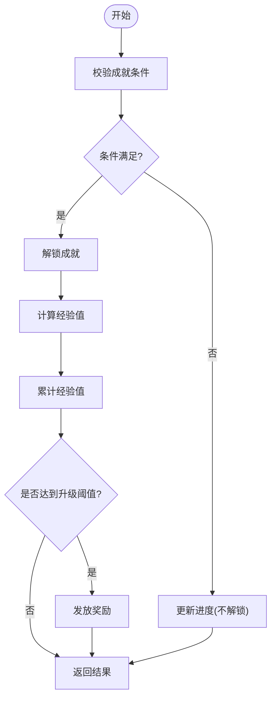
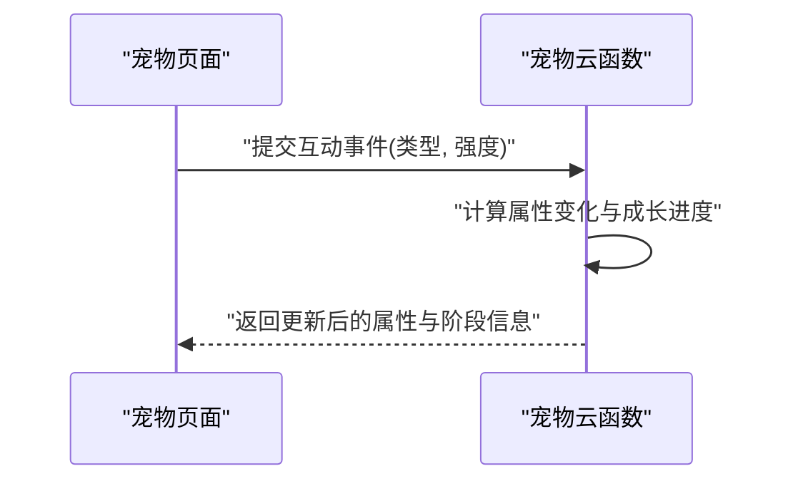
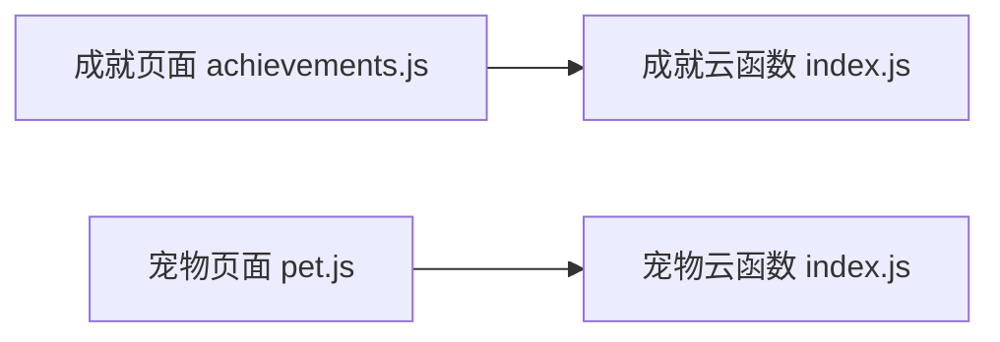

# 成就与宠物API

<cite>
**本文引用的文件**   
- [cloudfunctions/achievements/index.js](file://cloudfunctions/achievements/index.js)
- [cloudfunctions/pet/index.js](file://cloudfunctions/pet/index.js)
- [miniprogram/pages/achievements/achievements.js](file://miniprogram/pages/achievements/achievements.js)
- [miniprogram/pages/pet/pet.js](file://miniprogram/pages/pet/pet.js)
</cite>

## 目录
1. [简介](#简介)
2. [项目结构](#项目结构)
3. [核心组件](#核心组件)
4. [架构总览](#架构总览)
5. [详细组件分析](#详细组件分析)
6. [依赖关系分析](#依赖关系分析)
7. [性能考虑](#性能考虑)
8. [故障排查指南](#故障排查指南)
9. [结论](#结论)
10. [附录](#附录)

## 简介
本文件面向“成就系统”和“宠物养成系统”的API接口文档，覆盖以下能力：
- 成就解锁、等级提升、经验值计算、进度追踪与奖励发放
- 宠物成长、属性管理、互动反馈
- 排行榜、社交分享、数据同步等高级功能（概念性说明）

为便于理解，文档同时提供架构图、时序图与流程图，并给出前端调用示例路径。

## 项目结构
本项目采用小程序 + 云函数架构：
- 小程序端页面负责用户交互与调用云函数
- 云函数实现业务逻辑与数据持久化

图表来源
- [miniprogram/pages/achievements/achievements.js](file://miniprogram/pages/achievements/achievements.js)
- [miniprogram/pages/pet/pet.js](file://miniprogram/pages/pet/pet.js)
- [cloudfunctions/achievements/index.js](file://cloudfunctions/achievements/index.js)
- [cloudfunctions/pet/index.js](file://cloudfunctions/pet/index.js)

章节来源
- [miniprogram/pages/achievements/achievements.js](file://miniprogram/pages/achievements/achievements.js)
- [miniprogram/pages/pet/pet.js](file://miniprogram/pages/pet/pet.js)
- [cloudfunctions/achievements/index.js](file://cloudfunctions/achievements/index.js)
- [cloudfunctions/pet/index.js](file://cloudfunctions/pet/index.js)

## 核心组件
- 成就云函数：提供成就查询、条件判定、经验值累计、等级提升、奖励发放等能力
- 宠物云函数：提供宠物属性读写、成长阶段推进、互动反馈、状态同步等能力
- 小程序页面：封装云函数调用，处理UI展示与用户操作

章节来源
- [cloudfunctions/achievements/index.js](file://cloudfunctions/achievements/index.js)
- [cloudfunctions/pet/index.js](file://cloudfunctions/pet/index.js)
- [miniprogram/pages/achievements/achievements.js](file://miniprogram/pages/achievements/achievements.js)
- [miniprogram/pages/pet/pet.js](file://miniprogram/pages/pet/pet.js)

## 架构总览
整体交互流程如下：小程序页面通过云开发调用对应云函数，云函数执行业务逻辑后返回结果给前端渲染。

图表来源
- [miniprogram/pages/achievements/achievements.js](file://miniprogram/pages/achievements/achievements.js)
- [miniprogram/pages/pet/pet.js](file://miniprogram/pages/pet/pet.js)
- [cloudfunctions/achievements/index.js](file://cloudfunctions/achievements/index.js)
- [cloudfunctions/pet/index.js](file://cloudfunctions/pet/index.js)

## 详细组件分析

### 成就系统API
- 主要职责
  - 成就列表与详情查询
  - 成就条件判断与解锁
  - 经验值累计与等级提升
  - 奖励发放与记录
- 关键流程
  - 条件判断：根据用户行为或学习进度触发成就检查
  - 经验值计算：依据任务难度、完成质量等规则计算
  - 等级提升：当累计经验达到阈值时升级，并发放奖励
  - 进度追踪：维护已解锁成就、未解锁目标与进度百分比

图表来源
- [cloudfunctions/achievements/index.js](file://cloudfunctions/achievements/index.js)

章节来源
- [cloudfunctions/achievements/index.js](file://cloudfunctions/achievements/index.js)
- [miniprogram/pages/achievements/achievements.js](file://miniprogram/pages/achievements/achievements.js)

#### 使用示例（路径）
- 查看成就列表与详情：[miniprogram/pages/achievements/achievements.js](file://miniprogram/pages/achievements/achievements.js)
- 提交成就事件并刷新状态：[miniprogram/pages/achievements/achievements.js](file://miniprogram/pages/achievements/achievements.js)

### 宠物养成系统API
- 主要职责
  - 宠物属性管理（如健康、快乐、智力等）
  - 成长阶段推进（幼年期、成长期、成熟期等）
  - 互动反馈（喂食、训练、玩耍等行为对属性的影响）
  - 状态同步（多端一致性与增量更新）
- 关键流程
  - 互动事件：用户操作触发属性变化与成长进度
  - 成长判定：根据属性阈值与时间衰减模型推进阶段
  - 反馈输出：返回新属性值、阶段变更与动画提示数据

图表来源
- [miniprogram/pages/pet/pet.js](file://miniprogram/pages/pet/pet.js)
- [cloudfunctions/pet/index.js](file://cloudfunctions/pet/index.js)

章节来源
- [cloudfunctions/pet/index.js](file://cloudfunctions/pet/index.js)
- [miniprogram/pages/pet/pet.js](file://miniprogram/pages/pet/pet.js)

#### 使用示例（路径）
- 查看宠物当前属性与阶段：[miniprogram/pages/pet/pet.js](file://miniprogram/pages/pet/pet.js)
- 执行互动操作（喂食/训练/玩耍）：[miniprogram/pages/pet/pet.js](file://miniprogram/pages/pet/pet.js)

### 游戏化激励机制与进度追踪
- 机制要点
  - 经验值与等级：通过连续学习与互动积累经验，达到阈值升级
  - 成就里程碑：将复杂目标拆解为可量化的子目标
  - 即时反馈：每次操作均返回明确的数值变化与阶段提示
- 进度追踪
  - 维护“已完成/进行中/未解锁”三类状态
  - 提供百分比进度与剩余目标描述

章节来源
- [cloudfunctions/achievements/index.js](file://cloudfunctions/achievements/index.js)
- [cloudfunctions/pet/index.js](file://cloudfunctions/pet/index.js)

### 排行榜、社交分享、数据同步（高级功能）
- 排行榜
  - 基于经验值或等级进行排序，支持按日/周/月维度聚合
  - 注意并发写入与去重策略
- 社交分享
  - 生成分享卡片数据（包含成就徽章、宠物形象、邀请码等）
  - 分享回调用于统计与奖励发放
- 数据同步
  - 客户端缓存与云端一致性校验
  - 增量同步与冲突解决（以服务端为准）

[本节为概念性说明，不直接分析具体文件]

## 依赖关系分析
- 小程序页面依赖对应的云函数入口
- 云函数内部可能依赖数据库、配置与第三方服务（如AI聊天、测验等），但本文件聚焦成就与宠物两条主线

图表来源
- [miniprogram/pages/achievements/achievements.js](file://miniprogram/pages/achievements/achievements.js)
- [miniprogram/pages/pet/pet.js](file://miniprogram/pages/pet/pet.js)
- [cloudfunctions/achievements/index.js](file://cloudfunctions/achievements/index.js)
- [cloudfunctions/pet/index.js](file://cloudfunctions/pet/index.js)

章节来源
- [miniprogram/pages/achievements/achievements.js](file://miniprogram/pages/achievements/achievements.js)
- [miniprogram/pages/pet/pet.js](file://miniprogram/pages/pet/pet.js)
- [cloudfunctions/achievements/index.js](file://cloudfunctions/achievements/index.js)
- [cloudfunctions/pet/index.js](file://cloudfunctions/pet/index.js)

## 性能考虑
- 批量操作：合并多次互动为一次请求，减少网络往返
- 幂等设计：同一事件重复提交应得到相同结果
- 缓存策略：前端短期缓存成就与宠物状态，配合增量更新
- 限流与重试：对高频操作进行限流，失败自动重试与退避

[本节提供通用建议，不直接分析具体文件]

## 故障排查指南
- 常见问题
  - 权限不足：确认用户登录态与云函数访问权限
  - 参数错误：检查必填字段与取值范围
  - 网络异常：重试机制与降级策略
- 定位方法
  - 查看云函数日志与错误堆栈
  - 对比前后端数据结构差异
  - 复现最小用例并逐步缩小范围

章节来源
- [cloudfunctions/achievements/index.js](file://cloudfunctions/achievements/index.js)
- [cloudfunctions/pet/index.js](file://cloudfunctions/pet/index.js)

## 结论
成就与宠物系统通过清晰的云函数边界与小程序页面协作，实现了游戏化激励与持续成长的闭环。建议在后续迭代中完善排行榜、社交分享与数据同步的高级能力，并加强幂等、限流与监控指标，以提升稳定性与用户体验。

[本节为总结性内容，不直接分析具体文件]

## 附录
- 术语
  - 成就：用户达成特定目标后获得的标识与奖励
  - 经验值：衡量用户成长的核心数值
  - 宠物属性：影响宠物状态与成长的关键指标
- 参考路径
  - 成就相关：[miniprogram/pages/achievements/achievements.js](file://miniprogram/pages/achievements/achievements.js)、[cloudfunctions/achievements/index.js](file://cloudfunctions/achievements/index.js)
  - 宠物相关：[miniprogram/pages/pet/pet.js](file://miniprogram/pages/pet/pet.js)、[cloudfunctions/pet/index.js](file://cloudfunctions/pet/index.js)