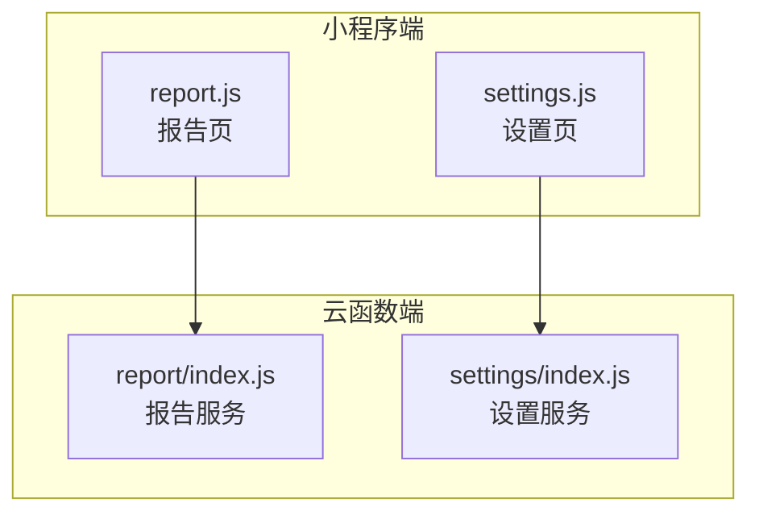
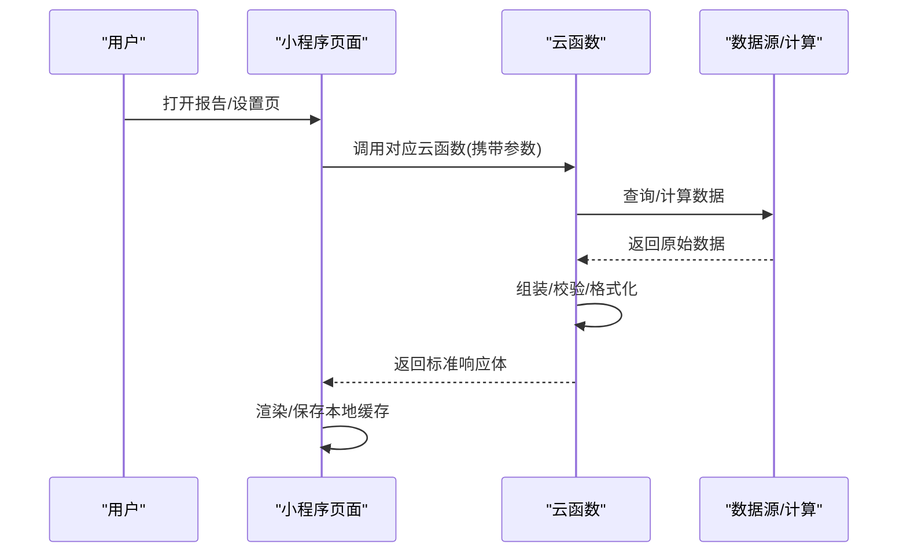
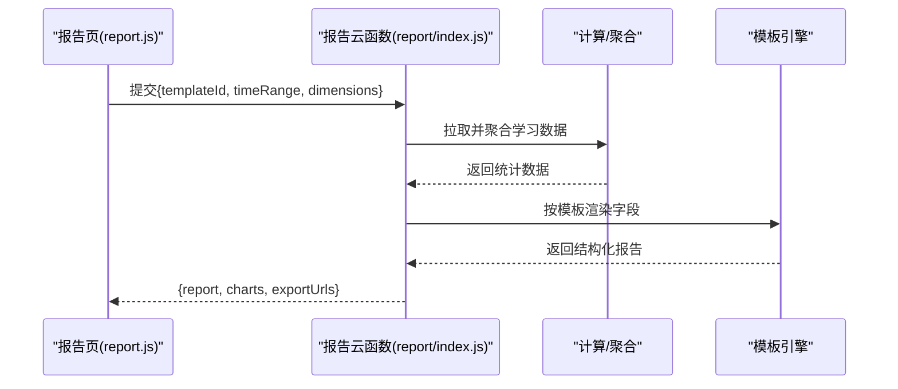
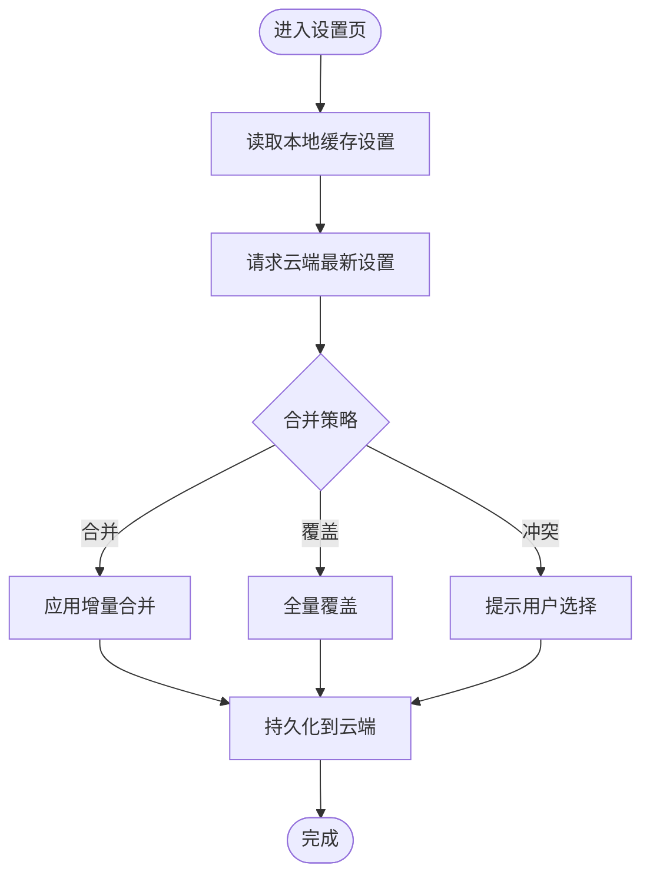
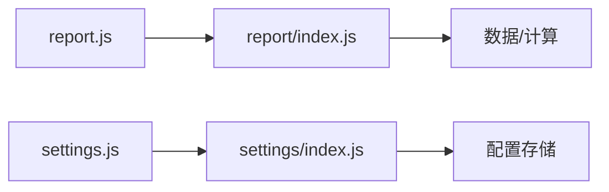

# 报告与设置API

<cite>
**本文引用的文件**   
- [cloudfunctions/report/index.js](file://cloudfunctions/report/index.js)
- [cloudfunctions/settings/index.js](file://cloudfunctions/settings/index.js)
- [miniprogram/pages/report/report.js](file://miniprogram/pages/report/report.js)
- [miniprogram/pages/settings/settings.js](file://miniprogram/pages/settings/settings.js)
</cite>

## 目录
1. [简介](#简介)
2. [项目结构](#项目结构)
3. [核心组件](#核心组件)
4. [架构总览](#架构总览)
5. [详细组件分析](#详细组件分析)
6. [依赖分析](#依赖分析)
7. [性能考虑](#性能考虑)
8. [故障排查指南](#故障排查指南)
9. [结论](#结论)
10. [附录](#附录)

## 简介
本文件为“学习报告与用户设置”的云端函数与小程序端交互的接口文档，覆盖以下能力：
- 学习数据分析与报告生成：学习行为统计、成绩趋势分析、能力评估等
- 用户偏好设置管理：主题、通知、隐私开关等
- 数据同步与导出：备份/恢复、导出格式说明
- 高级特性：隐私保护、数据安全、版本兼容

为保证可读性，本文以“接口契约 + 调用流程 + 数据结构约定 + 示例路径”的方式组织内容，避免直接粘贴代码。

## 项目结构
本项目采用“云函数（后端）+ 小程序页面（前端）”的分层结构。与本报告相关的核心位置如下：
- 云函数
  - report：学习报告相关逻辑
  - settings：用户设置相关逻辑
- 小程序页面
  - pages/report：报告查看页
  - pages/settings：设置管理页

图表来源
- [cloudfunctions/report/index.js](file://cloudfunctions/report/index.js)
- [cloudfunctions/settings/index.js](file://cloudfunctions/settings/index.js)
- [miniprogram/pages/report/report.js](file://miniprogram/pages/report/report.js)
- [miniprogram/pages/settings/settings.js](file://miniprogram/pages/settings/settings.js)

章节来源
- [cloudfunctions/report/index.js](file://cloudfunctions/report/index.js)
- [cloudfunctions/settings/index.js](file://cloudfunctions/settings/index.js)
- [miniprogram/pages/report/report.js](file://miniprogram/pages/report/report.js)
- [miniprogram/pages/settings/settings.js](file://miniprogram/pages/settings/settings.js)

## 核心组件
- 报告服务（report）
  - 负责聚合学习行为、成绩、能力维度指标，按模板渲染报告数据，支持导出。
- 设置服务（settings）
  - 负责用户偏好读写、默认值管理、增量同步、版本兼容处理。
- 报告页（report.js）
  - 发起获取报告请求、展示图表数据、触发导出。
- 设置页（settings.js）
  - 读取/更新用户设置、处理同步与冲突策略。

章节来源
- [cloudfunctions/report/index.js](file://cloudfunctions/report/index.js)
- [cloudfunctions/settings/index.js](file://cloudfunctions/settings/index.js)
- [miniprogram/pages/report/report.js](file://miniprogram/pages/report/report.js)
- [miniprogram/pages/settings/settings.js](file://miniprogram/pages/settings/settings.js)

## 架构总览
整体调用链路遵循“小程序页面 -> 云函数 -> 数据源/计算模块 -> 返回结构化结果”。

图表来源
- [cloudfunctions/report/index.js](file://cloudfunctions/report/index.js)
- [cloudfunctions/settings/index.js](file://cloudfunctions/settings/index.js)
- [miniprogram/pages/report/report.js](file://miniprogram/pages/report/report.js)
- [miniprogram/pages/settings/settings.js](file://miniprogram/pages/settings/settings.js)

## 详细组件分析

### 报告服务接口（report）
- 功能范围
  - 学习行为统计：学习时长、频次、连续天数、最近活跃时间
  - 成绩趋势分析：周期内得分曲线、分科/知识点维度对比
  - 能力评估：知识掌握度、薄弱点识别、建议项
  - 报告模板：按模板ID选择字段集与布局
  - 图表数据：折线、柱状、雷达等序列数据
  - 导出格式：JSON/PDF/图片（由服务端或客户端实现决定）
- 典型接口定义（概念性）
  - 获取报告
    - 方法：POST
    - 路径：/cloudfunctions/report
    - 请求体关键字段：templateId、timeRange、dimensions
    - 响应体关键字段：code、message、data.report、data.charts、data.exportUrls
  - 导出报告
    - 方法：POST
    - 路径：/cloudfunctions/report/export
    - 请求体关键字段：templateId、format、filters
    - 响应体关键字段：code、message、data.downloadUrl、data.expiresAt
- 数据结构约定（节选）
  - timeRange：开始/结束时间戳或相对周期标识
  - dimensions：学科/知识点/题型等维度列表
  - charts：包含类型、标题、数据集、单位等元信息
  - exportUrls：各格式下载链接及过期时间
- 错误码约定（示例）
  - 400：参数缺失或非法
  - 404：模板不存在
  - 500：内部计算异常
- 使用示例（路径）
  - 报告页调用入口：[miniprogram/pages/report/report.js](file://miniprogram/pages/report/report.js)
  - 云函数实现入口：[cloudfunctions/report/index.js](file://cloudfunctions/report/index.js)

章节来源
- [cloudfunctions/report/index.js](file://cloudfunctions/report/index.js)
- [miniprogram/pages/report/report.js](file://miniprogram/pages/report/report.js)

#### 报告生成时序图

图表来源
- [cloudfunctions/report/index.js](file://cloudfunctions/report/index.js)
- [miniprogram/pages/report/report.js](file://miniprogram/pages/report/report.js)

### 设置服务接口（settings）
- 功能范围
  - 偏好设置：主题、字体、通知、隐私开关、语言等
  - 数据同步：增量合并、冲突解决、全量覆盖
  - 版本兼容：向后兼容旧版字段、迁移脚本
  - 安全与隐私：敏感字段加密、最小权限访问
- 典型接口定义（概念性）
  - 获取设置
    - 方法：GET
    - 路径：/cloudfunctions/settings
    - 响应体关键字段：code、message、data.settings、data.version
  - 更新设置
    - 方法：PUT
    - 路径：/cloudfunctions/settings
    - 请求体关键字段：settings.patch、strategy、version
    - 响应体关键字段：code、message、data.settings、data.conflicts
  - 导出/导入备份
    - 方法：POST
    - 路径：/cloudfunctions/settings/backup
    - 请求体关键字段：action、scope、format
    - 响应体关键字段：code、message、data.url、data.expiresAt
- 数据结构约定（节选）
  - settings：键值对集合，含分组与默认值
  - strategy：merge/overwrite/conflict-resolve
  - version：当前配置版本号，用于迁移与兼容
- 错误码约定（示例）
  - 400：参数不合法或版本不兼容
  - 409：配置冲突需人工确认
  - 500：存储/序列化失败
- 使用示例（路径）
  - 设置页调用入口：[miniprogram/pages/settings/settings.js](file://miniprogram/pages/settings/settings.js)
  - 云函数实现入口：[cloudfunctions/settings/index.js](file://cloudfunctions/settings/index.js)

章节来源
- [cloudfunctions/settings/index.js](file://cloudfunctions/settings/index.js)
- [miniprogram/pages/settings/settings.js](file://miniprogram/pages/settings/settings.js)

#### 设置同步流程图

图表来源
- [cloudfunctions/settings/index.js](file://cloudfunctions/settings/index.js)
- [miniprogram/pages/settings/settings.js](file://miniprogram/pages/settings/settings.js)

### 报告模板与图表数据
- 模板体系
  - templateId：唯一标识，控制输出字段与布局
  - fields：字段白名单，用于按需裁剪
  - layout：区块顺序与可见性
- 图表数据
  - type：line/bar/radar/pie 等
  - series：多系列数据数组
  - meta：单位、阈值、标注等元信息
- 导出格式
  - json：结构化数据，便于二次加工
  - pdf：打印友好，适合归档
  - image：PNG/JPG，便于分享
- 参考实现位置
  - 报告云函数：[cloudfunctions/report/index.js](file://cloudfunctions/report/index.js)
  - 报告页渲染：[miniprogram/pages/report/report.js](file://miniprogram/pages/report/report.js)

章节来源
- [cloudfunctions/report/index.js](file://cloudfunctions/report/index.js)
- [miniprogram/pages/report/report.js](file://miniprogram/pages/report/report.js)

### 隐私保护、数据安全与版本兼容
- 隐私保护
  - 最小化采集：仅返回必要字段
  - 敏感字段脱敏：如姓名、联系方式等
  - 传输安全：HTTPS/TLS（由平台保障）
- 数据安全
  - 输入校验：严格类型与边界检查
  - 幂等设计：导出/备份接口支持重试
  - 审计日志：关键操作记录（可选）
- 版本兼容
  - 向后兼容：旧版字段在新版中保留映射
  - 迁移脚本：在设置服务中统一执行
  - 版本协商：通过version字段进行兼容性判断
- 参考实现位置
  - 设置云函数：[cloudfunctions/settings/index.js](file://cloudfunctions/settings/index.js)
  - 设置页处理：[miniprogram/pages/settings/settings.js](file://miniprogram/pages/settings/settings.js)

章节来源
- [cloudfunctions/settings/index.js](file://cloudfunctions/settings/index.js)
- [miniprogram/pages/settings/settings.js](file://miniprogram/pages/settings/settings.js)

## 依赖分析
- 前端依赖
  - 报告页依赖报告云函数
  - 设置页依赖设置云函数
- 后端依赖
  - 报告云函数可能依赖数据聚合/模板引擎
  - 设置云函数可能依赖配置存储/迁移脚本
- 耦合关系
  - 前后端通过标准化响应体解耦
  - 模板与图表数据通过schema约束降低耦合

图表来源
- [cloudfunctions/report/index.js](file://cloudfunctions/report/index.js)
- [cloudfunctions/settings/index.js](file://cloudfunctions/settings/index.js)
- [miniprogram/pages/report/report.js](file://miniprogram/pages/report/report.js)
- [miniprogram/pages/settings/settings.js](file://miniprogram/pages/settings/settings.js)

章节来源
- [cloudfunctions/report/index.js](file://cloudfunctions/report/index.js)
- [cloudfunctions/settings/index.js](file://cloudfunctions/settings/index.js)
- [miniprogram/pages/report/report.js](file://miniprogram/pages/report/report.js)
- [miniprogram/pages/settings/settings.js](file://miniprogram/pages/settings/settings.js)

## 性能考虑
- 报告生成
  - 分页/懒加载：大报告分块渲染
  - 缓存策略：短期缓存热点报告，减少重复计算
  - 异步导出：长任务走异步队列，返回下载链接
- 设置同步
  - 增量同步：仅传输变更字段
  - 冲突检测：快速定位差异，减少往返
  - 批量写入：合并多次更新为一次事务
- 网络优化
  - 压缩传输：启用Gzip/Brotli
  - 连接复用：保持长连接（视平台能力）

## 故障排查指南
- 常见问题
  - 参数缺失/类型错误：检查请求体字段与类型
  - 模板不存在：确认templateId是否有效
  - 配置冲突：根据conflicts提示选择合并策略
  - 导出失败：检查存储空间与权限
- 定位步骤
  - 查看云函数日志：定位具体异常堆栈
  - 复现最小用例：精简参数缩小范围
  - 对比版本：确认是否因版本不兼容导致
- 参考实现位置
  - 报告云函数：[cloudfunctions/report/index.js](file://cloudfunctions/report/index.js)
  - 设置云函数：[cloudfunctions/settings/index.js](file://cloudfunctions/settings/index.js)

章节来源
- [cloudfunctions/report/index.js](file://cloudfunctions/report/index.js)
- [cloudfunctions/settings/index.js](file://cloudfunctions/settings/index.js)

## 结论
本报告与设置API围绕“数据可观测、体验可配置、数据可迁移”的目标构建。通过标准化的接口契约、清晰的模板与图表数据模型、完善的同步与兼容机制，既满足日常学习与复盘需求，也为后续扩展（如个性化推荐、跨端同步）奠定基础。

## 附录
- 术语
  - 报告模板：控制报告结构与字段的配置单元
  - 图表数据：用于可视化展示的序列型数据
  - 增量同步：仅同步变更的配置项
- 参考路径
  - 报告云函数：[cloudfunctions/report/index.js](file://cloudfunctions/report/index.js)
  - 设置云函数：[cloudfunctions/settings/index.js](file://cloudfunctions/settings/index.js)
  - 报告页：[miniprogram/pages/report/report.js](file://miniprogram/pages/report/report.js)
  - 设置页：[miniprogram/pages/settings/settings.js](file://miniprogram/pages/settings/settings.js)