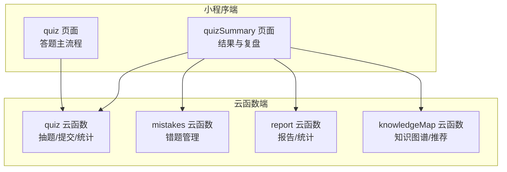
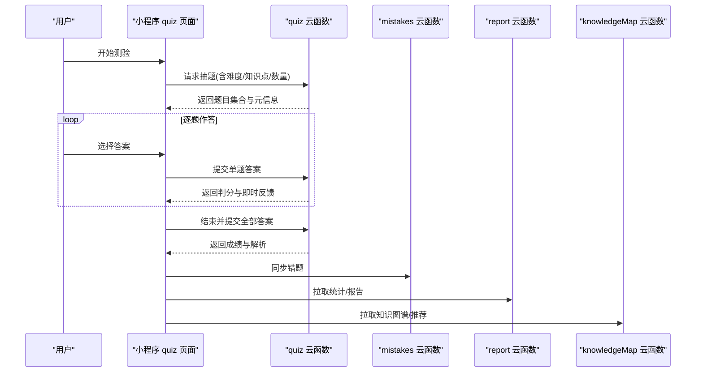
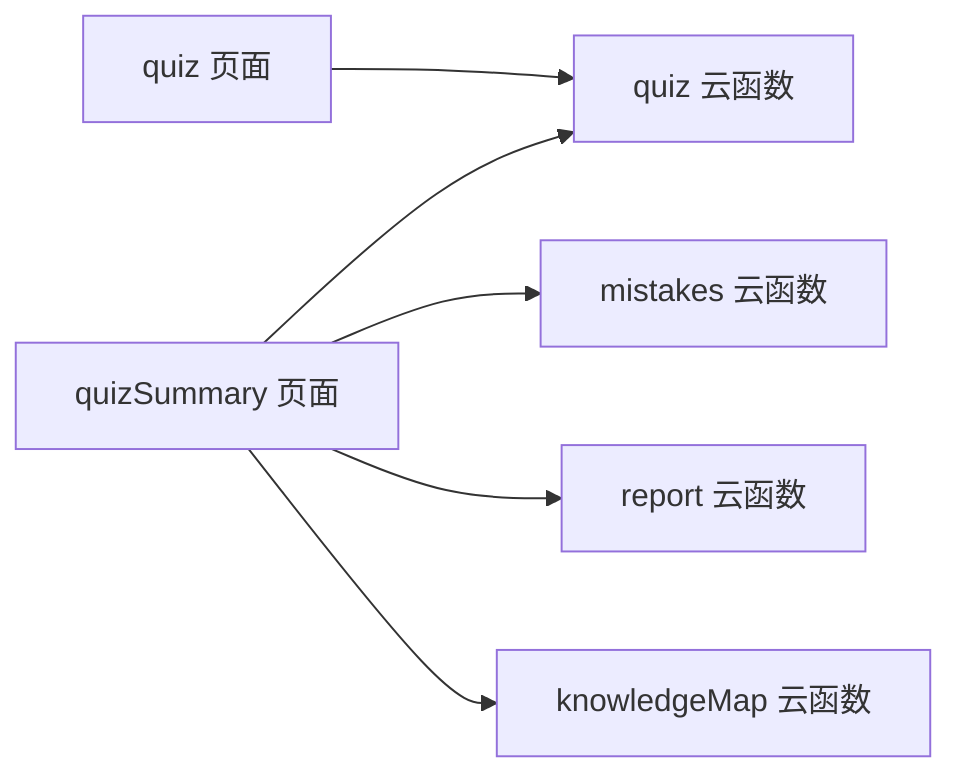
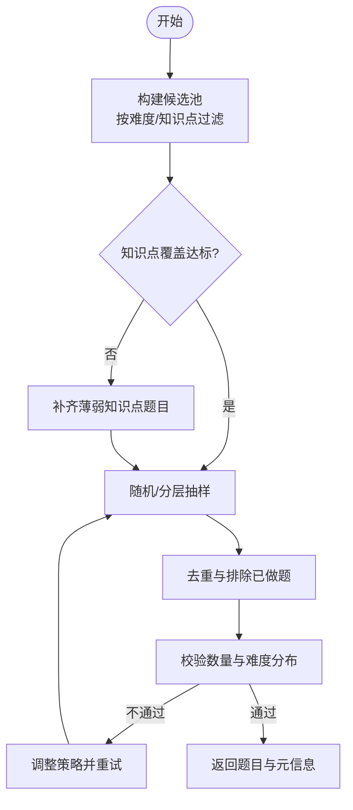
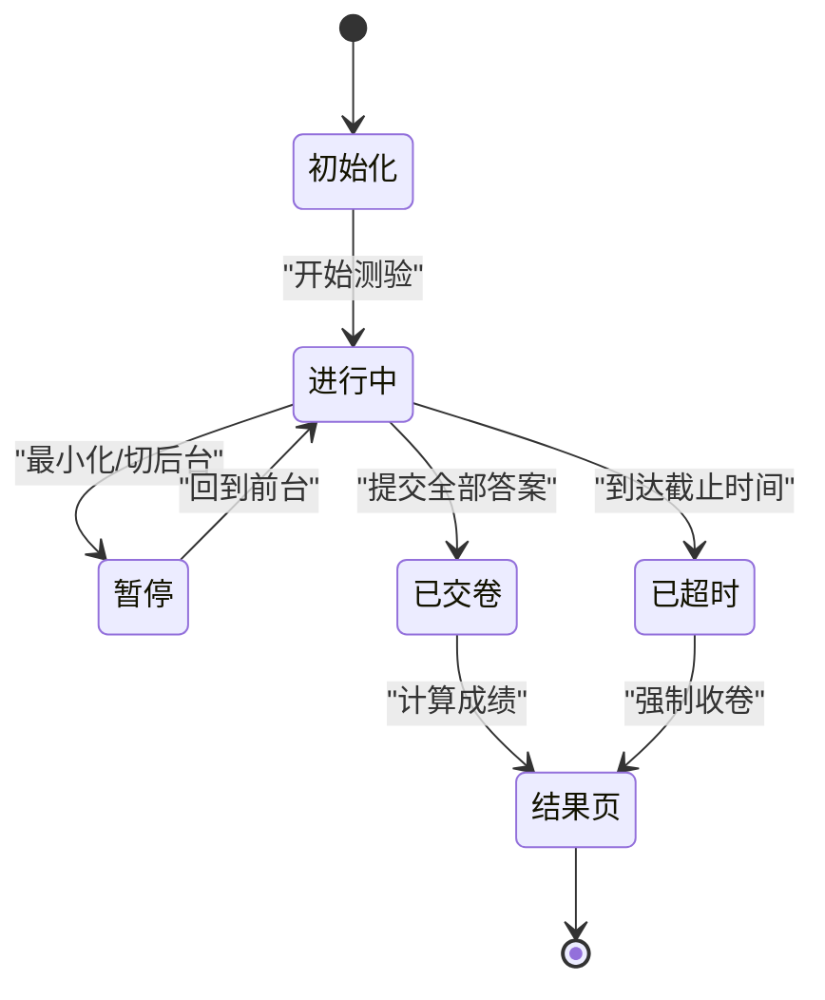

# 测验系统API

<cite>
**本文引用的文件**   
- [cloudfunctions/quiz/index.js](file://cloudfunctions/quiz/index.js)
- [cloudfunctions/quiz/config.json](file://cloudfunctions/quiz/config.json)
- [miniprogram/pages/quiz/quiz.js](file://miniprogram/pages/quiz/quiz.js)
- [miniprogram/pages/quizSummary/quizSummary.js](file://miniprogram/pages/quizSummary/quizSummary.js)
- [cloudfunctions/mistakes/index.js](file://cloudfunctions/mistakes/index.js)
- [cloudfunctions/report/index.js](file://cloudfunctions/report/index.js)
- [cloudfunctions/knowledgeMap/index.js](file://cloudfunctions/knowledgeMap/index.js)
</cite>

## 目录
1. [简介](#简介)
2. [项目结构](#项目结构)
3. [核心组件](#核心组件)
4. [架构总览](#架构总览)
5. [详细接口说明](#详细接口说明)
6. [依赖分析](#依赖分析)
7. [性能考虑](#性能考虑)
8. [故障排查指南](#故障排查指南)
9. [结论](#结论)
10. [附录](#附录)

## 简介
本文件面向开发者与产品人员，系统化梳理“测验系统”的云端能力与小程序端交互流程，覆盖题目获取、答案提交、成绩计算、统计分析等关键接口；并给出智能出题（随机抽题、难度匹配、知识点覆盖）、答题状态管理、时间控制、防作弊机制、批量答题、即时反馈、错题标记、学习分析与个性化推荐等高级能力的接口约定与使用示例。文档以仓库中实际存在的云函数与页面为依据进行归纳与抽象，便于快速对接与扩展。

## 项目结构
本项目采用“小程序前端 + 云函数后端”的常见分层：
- 小程序端负责用户交互、答题状态管理、计时器与本地缓存、错误提示与结果展示。
- 云函数提供题目抽取、答案校验、成绩统计、错题记录、知识图谱与报告生成等能力。

图表来源
- [miniprogram/pages/quiz/quiz.js](file://miniprogram/pages/quiz/quiz.js)
- [miniprogram/pages/quizSummary/quizSummary.js](file://miniprogram/pages/quizSummary/quizSummary.js)
- [cloudfunctions/quiz/index.js](file://cloudfunctions/quiz/index.js)
- [cloudfunctions/mistakes/index.js](file://cloudfunctions/mistakes/index.js)
- [cloudfunctions/report/index.js](file://cloudfunctions/report/index.js)
- [cloudfunctions/knowledgeMap/index.js](file://cloudfunctions/knowledgeMap/index.js)

章节来源
- [cloudfunctions/quiz/index.js](file://cloudfunctions/quiz/index.js)
- [cloudfunctions/quiz/config.json](file://cloudfunctions/quiz/config.json)
- [miniprogram/pages/quiz/quiz.js](file://miniprogram/pages/quiz/quiz.js)
- [miniprogram/pages/quizSummary/quizSummary.js](file://miniprogram/pages/quizSummary/quizSummary.js)
- [cloudfunctions/mistakes/index.js](file://cloudfunctions/mistakes/index.js)
- [cloudfunctions/report/index.js](file://cloudfunctions/report/index.js)
- [cloudfunctions/knowledgeMap/index.js](file://cloudfunctions/knowledgeMap/index.js)

## 核心组件
- 题目抽取与作答服务（quiz 云函数）
  - 职责：按策略随机抽题、难度与知识点约束、提交答案、即时判分、生成试卷快照、返回统计摘要。
- 错题管理（mistakes 云函数）
  - 职责：记录错题、去重、按知识点/难度聚合、支持导出与复习列表构建。
- 报告与统计（report 云函数）
  - 职责：汇总成绩趋势、正确率、耗时分布、知识点掌握度、生成学习报告。
- 知识图谱与推荐（knowledgeMap 云函数）
  - 职责：维护知识点关系、薄弱点识别、个性化推荐题目或练习路径。

章节来源
- [cloudfunctions/quiz/index.js](file://cloudfunctions/quiz/index.js)
- [cloudfunctions/mistakes/index.js](file://cloudfunctions/mistakes/index.js)
- [cloudfunctions/report/index.js](file://cloudfunctions/report/index.js)
- [cloudfunctions/knowledgeMap/index.js](file://cloudfunctions/knowledgeMap/index.js)

## 架构总览
整体调用时序如下：小程序端发起请求至对应云函数，云函数完成业务逻辑后返回结构化数据，小程序端更新UI与本地状态。

图表来源
- [miniprogram/pages/quiz/quiz.js](file://miniprogram/pages/quiz/quiz.js)
- [cloudfunctions/quiz/index.js](file://cloudfunctions/quiz/index.js)
- [cloudfunctions/mistakes/index.js](file://cloudfunctions/mistakes/index.js)
- [cloudfunctions/report/index.js](file://cloudfunctions/report/index.js)
- [cloudfunctions/knowledgeMap/index.js](file://cloudfunctions/knowledgeMap/index.js)

## 详细接口说明

### 通用约定
- 通信方式：小程序通过云函数调用后端能力。
- 鉴权：由平台统一处理登录态，云函数内可基于上下文获取用户标识。
- 幂等性：提交类接口建议携带唯一会话ID，避免重复提交导致重复计分。
- 超时与重试：网络异常时前端应做指数退避重试；云函数需对长耗时操作设置合理超时。

章节来源
- [cloudfunctions/quiz/index.js](file://cloudfunctions/quiz/index.js)
- [cloudfunctions/quiz/config.json](file://cloudfunctions/quiz/config.json)

### 1) 获取题目（智能出题）
- 功能：根据难度、知识点、数量、题型等条件随机抽题，保证知识点覆盖与难度均衡。
- 输入参数（示例字段）
  - difficulty: 难度等级或范围
  - knowledgePoints: 知识点标签集合
  - count: 题目数量
  - types: 题型过滤（如单选/多选/判断）
  - excludeIds: 排除已做过的题目ID
  - seed: 可选随机种子，用于复现实验结果
- 输出字段（示例字段）
  - questions: 题目数组
  - meta: 元信息（本次抽题策略、难度分布、知识点覆盖度等）
  - sessionId: 本次测验会话ID
- 算法要点
  - 随机抽题：在满足约束条件下进行加权随机或分层抽样。
  - 难度匹配：按目标难度区间分配比例，避免过难/过易集中。
  - 知识点覆盖：确保每个指定知识点至少出现一次，再填充剩余名额。
  - 去重：结合 excludeIds 与历史作答记录避免重复。
- 使用示例
  - 场景：为初学者生成10道中等难度的单选题，覆盖“细胞结构”和“遗传基础”。
  - 步骤：构造入参 -> 调用接口 -> 渲染题目 -> 启动计时器。

章节来源
- [cloudfunctions/quiz/index.js](file://cloudfunctions/quiz/index.js)

### 2) 提交答案（即时反馈）
- 功能：逐题提交答案，服务端即时判分并返回解析与提示。
- 输入参数（示例字段）
  - sessionId: 会话ID
  - questionId: 题目ID
  - answer: 用户答案
  - timestamp: 提交时间戳
- 输出字段（示例字段）
  - correct: 是否正确
  - score: 本题得分
  - explanation: 解析
  - hint: 提示（可选）
  - timeCost: 用时（秒）
- 防作弊与一致性
  - 校验提交时间与答题开始时间的差值是否合理。
  - 校验答案格式与合法性，拒绝非法或越界提交。
  - 同一题目多次提交仅保留最后一次有效提交。
- 使用示例
  - 场景：用户在第3题选择答案后，立即收到“正确/错误+解析”，并可继续下一题。

章节来源
- [cloudfunctions/quiz/index.js](file://cloudfunctions/quiz/index.js)

### 3) 结束测验与成绩计算
- 功能：提交全部答案，计算总分、正确率、用时、知识点掌握度等，并持久化结果。
- 输入参数（示例字段）
  - sessionId: 会话ID
  - answers: 全部答案集合
  - endTime: 结束时间
- 输出字段（示例字段）
  - totalScore: 总分
  - accuracy: 正确率
  - totalTime: 总用时
  - breakdown: 按知识点/难度维度的得分明细
  - reportId: 报告ID（供后续查询详情）
- 成绩计算规则
  - 权重：可按题型或知识点赋予不同权重。
  - 扣分：支持答错扣分或空题不扣分策略。
  - 封顶：总分上限与单项上限。
- 使用示例
  - 场景：用户点击“交卷”，前端等待后端返回成绩与解析，跳转结果页。

章节来源
- [cloudfunctions/quiz/index.js](file://cloudfunctions/quiz/index.js)

### 4) 错题管理与复习
- 功能：自动收集错题，支持按知识点/难度筛选、导出、加入复习计划。
- 输入参数（示例字段）
  - action: add/update/query/export
  - filters: {knowledgePoints, difficulty, dateRange}
  - ids: 指定题目ID集合
- 输出字段（示例字段）
  - mistakes: 错题列表
  - stats: 错题统计（总数、近N日新增、薄弱知识点TopN）
- 使用示例
  - 场景：从结果页一键将本次错题加入“错题本”，并按知识点分组显示。

章节来源
- [cloudfunctions/mistakes/index.js](file://cloudfunctions/mistakes/index.js)

### 5) 报告与统计分析
- 功能：生成个人学习报告，包含趋势、正确率、耗时分布、知识点雷达图等。
- 输入参数（示例字段）
  - reportId: 报告ID
  - range: 时间范围（如最近7天/30天）
  - dimensions: 维度（按知识点/难度/题型）
- 输出字段（示例字段）
  - summary: 总体概览
  - trends: 趋势数据
  - insights: 洞察与建议
- 使用示例
  - 场景：在“我的学习”页面查看近30天的正确率曲线与薄弱知识点。

章节来源
- [cloudfunctions/report/index.js](file://cloudfunctions/report/index.js)

### 6) 知识图谱与个性化推荐
- 功能：基于知识图谱与历史表现，推荐下一步学习内容与题目。
- 输入参数（示例字段）
  - userId: 用户ID
  - focus: 关注领域（如“遗传学”）
  - mode: 模式（巩固/拓展/冲刺）
- 输出字段（示例字段）
  - recommendedQuestions: 推荐题目
  - learningPath: 学习路径（知识点序列）
  - rationale: 推荐理由
- 使用示例
  - 场景：系统检测到“细胞分裂”薄弱，推送相关微课与针对性练习题。

章节来源
- [cloudfunctions/knowledgeMap/index.js](file://cloudfunctions/knowledgeMap/index.js)

### 7) 批量答题与进度恢复
- 功能：支持一次性提交多题答案，或在中断后恢复答题进度。
- 输入参数（示例字段）
  - sessionId: 会话ID
  - batchAnswers: 批量答案数组
  - resume: 是否恢复上次进度
- 输出字段（示例字段）
  - results: 批量判分结果
  - progress: 当前进度（已完成/剩余）
- 使用示例
  - 场景：离线环境下先缓存答案，联网后批量提交；或中途退出后重新进入继续作答。

章节来源
- [cloudfunctions/quiz/index.js](file://cloudfunctions/quiz/index.js)

### 8) 时间控制与防作弊
- 时间控制
  - 全局倒计时：服务端下发限时，客户端倒计时与心跳保活。
  - 单题限时：超过单题时限自动跳过并记录。
- 防作弊机制
  - 切屏检测：前端监听应用切换事件，累计警告次数达到阈值触发警告或终止测验。
  - 复制粘贴限制：禁用文本复制粘贴，降低外部辅助可能。
  - 提交指纹：记录设备、网络、行为特征，异常时标记复核。
  - 乱序与选项打乱：每次加载题目与选项顺序随机，减少共享答案风险。
- 使用示例
  - 场景：检测到频繁切屏，弹出警示；达到上限则提前收卷并标注异常。

章节来源
- [miniprogram/pages/quiz/quiz.js](file://miniprogram/pages/quiz/quiz.js)
- [cloudfunctions/quiz/index.js](file://cloudfunctions/quiz/index.js)

## 依赖分析
- 模块耦合
  - quiz 云函数为核心，被 quiz 与 quizSummary 页面共同调用。
  - mistakes、report、knowledgeMap 作为支撑服务，在结果页与个人中心被调用。
- 外部依赖
  - 数据库/存储：用于持久化题目、作答记录、错题与报告。
  - 缓存：热点题目与统计结果可缓存以提升响应速度。
- 潜在循环依赖
  - 各云函数之间无直接相互调用，均通过小程序端编排，避免循环依赖。

图表来源
- [miniprogram/pages/quiz/quiz.js](file://miniprogram/pages/quiz/quiz.js)
- [miniprogram/pages/quizSummary/quizSummary.js](file://miniprogram/pages/quizSummary/quizSummary.js)
- [cloudfunctions/quiz/index.js](file://cloudfunctions/quiz/index.js)
- [cloudfunctions/mistakes/index.js](file://cloudfunctions/mistakes/index.js)
- [cloudfunctions/report/index.js](file://cloudfunctions/report/index.js)
- [cloudfunctions/knowledgeMap/index.js](file://cloudfunctions/knowledgeMap/index.js)

章节来源
- [cloudfunctions/quiz/index.js](file://cloudfunctions/quiz/index.js)
- [cloudfunctions/mistakes/index.js](file://cloudfunctions/mistakes/index.js)
- [cloudfunctions/report/index.js](file://cloudfunctions/report/index.js)
- [cloudfunctions/knowledgeMap/index.js](file://cloudfunctions/knowledgeMap/index.js)

## 性能考虑
- 抽题优化
  - 预计算候选集：按难度/知识点建立索引，减少实时过滤开销。
  - 分页与懒加载：大批量题目分批返回，首屏优先。
- 提交优化
  - 合并提交：批量答案合并为一次请求，降低网络往返。
  - 增量更新：仅传输差异字段，减少载荷大小。
- 缓存策略
  - 静态题目与解析缓存，热点数据TTL合理设置。
  - 统计结果缓存，定期刷新。
- 超时与降级
  - 长耗时操作异步化，前端轮询或回调通知。
  - 非关键功能（如推荐）失败时降级为默认策略。

[本节为通用指导，无需特定文件引用]

## 故障排查指南
- 常见问题
  - 抽题结果为空：检查难度/知识点过滤条件是否过于严格；确认题库中存在匹配题目。
  - 提交判分不一致：核对答案格式、评分规则版本与会话一致性。
  - 错题未入库：确认错题写入权限与幂等键；检查去重逻辑。
  - 报告数据缺失：确认统计任务执行成功与数据源完整性。
- 定位方法
  - 开启调试日志：在云函数中打印关键入参与中间结果。
  - 前端埋点：记录请求/响应、错误码与耗时。
  - 回放与会话追踪：通过 sessionId 串联全流程。
- 恢复策略
  - 断网续传：本地缓存答案，网络恢复后批量补交。
  - 幂等重试：对提交类接口实现幂等键与重试机制。

章节来源
- [cloudfunctions/quiz/index.js](file://cloudfunctions/quiz/index.js)
- [cloudfunctions/mistakes/index.js](file://cloudfunctions/mistakes/index.js)
- [cloudfunctions/report/index.js](file://cloudfunctions/report/index.js)

## 结论
本测验系统以“抽题-作答-判分-统计-推荐”为主线，形成闭环的学习体验。通过智能出题、即时反馈、错题管理与学习报告，帮助学习者高效查漏补缺；借助知识图谱与个性化推荐，进一步提升学习效率。建议在后续迭代中持续完善防作弊、性能优化与数据分析能力，为用户提供更稳定、安全、个性化的学习服务。

[本节为总结性内容，无需特定文件引用]

## 附录

### A. 智能出题流程图

图表来源
- [cloudfunctions/quiz/index.js](file://cloudfunctions/quiz/index.js)

### B. 答题状态机

图表来源
- [miniprogram/pages/quiz/quiz.js](file://miniprogram/pages/quiz/quiz.js)
- [cloudfunctions/quiz/index.js](file://cloudfunctions/quiz/index.js)