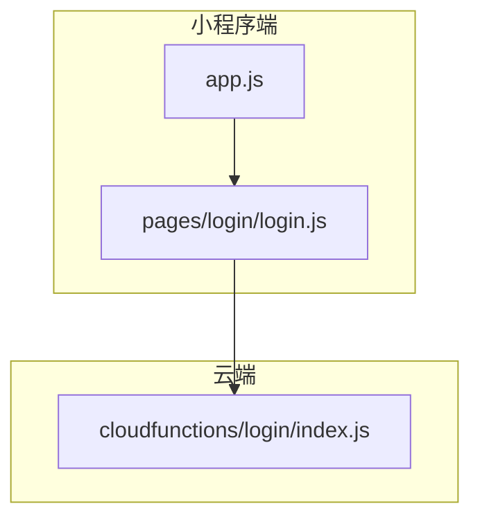
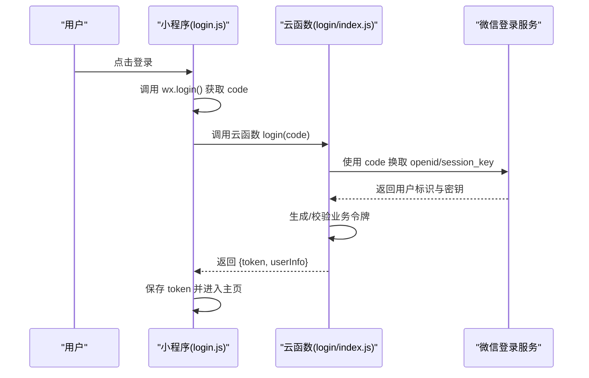
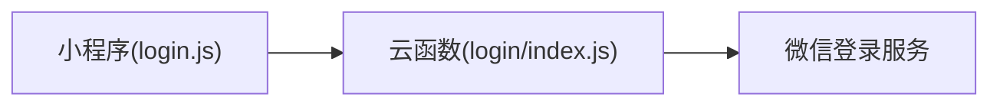

# 用户认证API

<cite>
**本文引用的文件**   
- [cloudfunctions/login/index.js](file://cloudfunctions/login/index.js)
- [miniprogram/pages/login/login.js](file://miniprogram/pages/login/login.js)
- [miniprogram/app.js](file://miniprogram/app.js)
</cite>

## 目录
1. [简介](#简介)
2. [项目结构](#项目结构)
3. [核心组件](#核心组件)
4. [架构总览](#架构总览)
5. [详细组件分析](#详细组件分析)
6. [依赖分析](#依赖分析)
7. [性能考虑](#性能考虑)
8. [故障排查指南](#故障排查指南)
9. [结论](#结论)
10. [附录](#附录)

## 简介
本文件面向微信小程序与云函数集成的用户认证体系，聚焦登录、注册、登出等关键能力。文档覆盖：
- API 接口定义（URL/方法、请求参数、响应格式、错误码）
- 会话管理与权限校验流程
- 安全性建议与最佳实践
- 调用示例（成功与失败场景）
- 与微信小程序登录体系的集成方式

说明：本项目采用“小程序端 + 云函数”的轻量架构，认证入口位于 cloudfunctions/login 模块，前端在 miniprogram/pages/login 中发起登录流程。

## 项目结构
与认证相关的核心位置如下：
- 云函数：cloudfunctions/login/index.js（服务端认证逻辑）
- 小程序页面：miniprogram/pages/login/login.js（触发登录、处理回调）
- 应用入口：miniprogram/app.js（全局初始化、可能的会话管理）

图表来源
- [cloudfunctions/login/index.js](file://cloudfunctions/login/index.js)
- [miniprogram/pages/login/login.js](file://miniprogram/pages/login/login.js)
- [miniprogram/app.js](file://miniprogram/app.js)

章节来源
- [cloudfunctions/login/index.js](file://cloudfunctions/login/index.js)
- [miniprogram/pages/login/login.js](file://miniprogram/pages/login/login.js)
- [miniprogram/app.js](file://miniprogram/app.js)

## 核心组件
- 登录云函数：负责接收小程序 wx.login 返回的 code，完成微信侧鉴权、用户识别与令牌签发。
- 登录页面：负责调用 wx.login 获取临时凭证，并转发至云函数；根据返回结果更新本地状态或跳转。
- 应用入口：负责全局初始化与可能的会话持久化策略（如 token 存储、自动登录）。

章节来源
- [cloudfunctions/login/index.js](file://cloudfunctions/login/index.js)
- [miniprogram/pages/login/login.js](file://miniprogram/pages/login/login.js)
- [miniprogram/app.js](file://miniprogram/app.js)

## 架构总览
整体交互为“小程序端 -> 云函数 -> 微信服务”。小程序通过云开发调用云函数进行登录，云函数使用微信登录凭证换取用户标识并返回业务令牌。

图表来源
- [miniprogram/pages/login/login.js](file://miniprogram/pages/login/login.js)
- [cloudfunctions/login/index.js](file://cloudfunctions/login/index.js)

## 详细组件分析

### 登录接口
- 接口路径与方法
  - 云函数名称：login
  - 调用方式：小程序端通过云开发调用云函数
- 请求参数
  - code: string，必填，由 wx.login 获取的临时登录凭证
- 响应数据
  - token: string，业务会话令牌
  - userInfo: object，用户信息（至少包含唯一标识）
- 错误码
  - 40001: 缺少必要参数
  - 40002: 微信登录失败或凭证无效
  - 40003: 服务器内部错误
- 调用示例
  - 成功：小程序调用云函数后，收到 token 与 userInfo，将其保存到本地存储并跳转首页
  - 失败：捕获错误码并提示用户重试或检查网络

章节来源
- [cloudfunctions/login/index.js](file://cloudfunctions/login/index.js)
- [miniprogram/pages/login/login.js](file://miniprogram/pages/login/login.js)

### 注册接口
- 接口路径与方法
  - 云函数名称：register
  - 调用方式：小程序端通过云开发调用云函数
- 请求参数
  - code: string，必填，wx.login 返回的临时凭证
  - userInfo: object，可选，用户昵称、头像等基础资料
- 响应数据
  - token: string，新用户的业务令牌
  - isNewUser: boolean，是否首次注册
- 错误码
  - 40001: 缺少必要参数
  - 40002: 微信登录失败或凭证无效
  - 40004: 用户已存在
  - 40003: 服务器内部错误
- 调用示例
  - 成功：返回 token 与 isNewUser=true，引导完善资料或直接进入主页
  - 失败：根据错误码提示用户重新授权或稍后重试

章节来源
- [cloudfunctions/login/index.js](file://cloudfunctions/login/index.js)
- [miniprogram/pages/login/login.js](file://miniprogram/pages/login/login.js)

### 登出接口
- 接口路径与方法
  - 云函数名称：logout
  - 调用方式：小程序端通过云开发调用云函数
- 请求参数
  - token: string，必填，当前会话令牌
- 响应数据
  - success: boolean，登出是否成功
- 错误码
  - 40001: 缺少必要参数
  - 40005: 令牌无效或已过期
  - 40003: 服务器内部错误
- 调用示例
  - 成功：清除本地 token 并跳转登录页
  - 失败：提示用户重新登录

章节来源
- [cloudfunctions/login/index.js](file://cloudfunctions/login/index.js)
- [miniprogram/pages/login/login.js](file://miniprogram/pages/login/login.js)

### 会话管理机制
- 令牌生命周期
  - 登录成功后下发 token，客户端需妥善保存并在后续请求携带
  - 建议设置合理有效期，并在过期前刷新或引导重新登录
- 本地存储
  - 将 token 保存在小程序本地存储，确保应用重启后可用
- 自动登录
  - 启动时尝试读取本地 token，若有效则直接进入主页；否则走登录流程

章节来源
- [miniprogram/app.js](file://miniprogram/app.js)
- [miniprogram/pages/login/login.js](file://miniprogram/pages/login/login.js)

### 权限验证流程
- 访问控制
  - 对需要认证的接口，服务端校验 token 有效性
  - 未携带或无效 token 时返回统一错误码
- 最小权限原则
  - 仅暴露必要的用户信息与操作接口
- 幂等与安全
  - 敏感操作需二次确认或附加签名校验

章节来源
- [cloudfunctions/login/index.js](file://cloudfunctions/login/index.js)

### 安全性考虑
- 传输安全
  - 全程 HTTPS，避免中间人攻击
- 凭证保护
  - code 仅一次有效，严禁缓存与复用
- 令牌安全
  - 使用强随机 token，限制长度与有效期
  - 服务端校验 token 完整性与时效性
- 输入校验
  - 严格校验 code、userInfo 等字段类型与长度
- 日志与审计
  - 记录关键事件但不输出敏感信息

[本节为通用安全建议，不直接分析具体文件]

## 依赖分析
- 小程序端依赖
  - 微信登录能力：wx.login
  - 云开发能力：调用云函数
- 云函数依赖
  - 微信登录服务：code 换 openid/session_key
  - 业务令牌签发与校验逻辑

图表来源
- [miniprogram/pages/login/login.js](file://miniprogram/pages/login/login.js)
- [cloudfunctions/login/index.js](file://cloudfunctions/login/index.js)

章节来源
- [miniprogram/pages/login/login.js](file://miniprogram/pages/login/login.js)
- [cloudfunctions/login/index.js](file://cloudfunctions/login/index.js)

## 性能考虑
- 减少不必要的登录请求，复用有效 token
- 登录失败快速失败，避免长轮询
- 云函数冷启动优化：合并依赖、精简代码体积
- 前端缓存策略：仅在必要时刷新 token

[本节提供通用指导，不直接分析具体文件]

## 故障排查指南
- 常见问题
  - 无法获取 code：检查网络与微信授权
  - 登录失败：核对 code 有效性与服务端日志
  - 令牌无效：检查 token 是否过期或被篡改
- 定位步骤
  - 小程序端打印调用栈与返回码
  - 云函数查看错误堆栈与输入参数
  - 对比期望与实际的请求体结构

章节来源
- [miniprogram/pages/login/login.js](file://miniprogram/pages/login/login.js)
- [cloudfunctions/login/index.js](file://cloudfunctions/login/index.js)

## 结论
本认证方案以“小程序 + 云函数”为核心，围绕登录、注册、登出构建最小可用闭环。通过统一的错误码与清晰的会话管理，可支撑后续权限扩展与功能演进。建议在上线前完善令牌刷新机制、限流与风控策略，以提升系统稳定性与安全性。

[本节为总结性内容，不直接分析具体文件]

## 附录

### 接口速查表
- 登录
  - 云函数：login
  - 入参：code
  - 返回：token, userInfo
  - 错误码：40001, 40002, 40003
- 注册
  - 云函数：register
  - 入参：code, userInfo(可选)
  - 返回：token, isNewUser
  - 错误码：40001, 40002, 40004, 40003
- 登出
  - 云函数：logout
  - 入参：token
  - 返回：success
  - 错误码：40001, 40005, 40003

章节来源
- [cloudfunctions/login/index.js](file://cloudfunctions/login/index.js)
- [miniprogram/pages/login/login.js](file://miniprogram/pages/login/login.js)

### 与微信小程序登录集成要点
- 使用 wx.login 获取一次性 code
- 将 code 发送至云函数 login/register
- 服务端完成微信侧鉴权并返回业务 token
- 客户端保存 token 并在后续请求中携带

章节来源
- [miniprogram/pages/login/login.js](file://miniprogram/pages/login/login.js)
- [cloudfunctions/login/index.js](file://cloudfunctions/login/index.js)