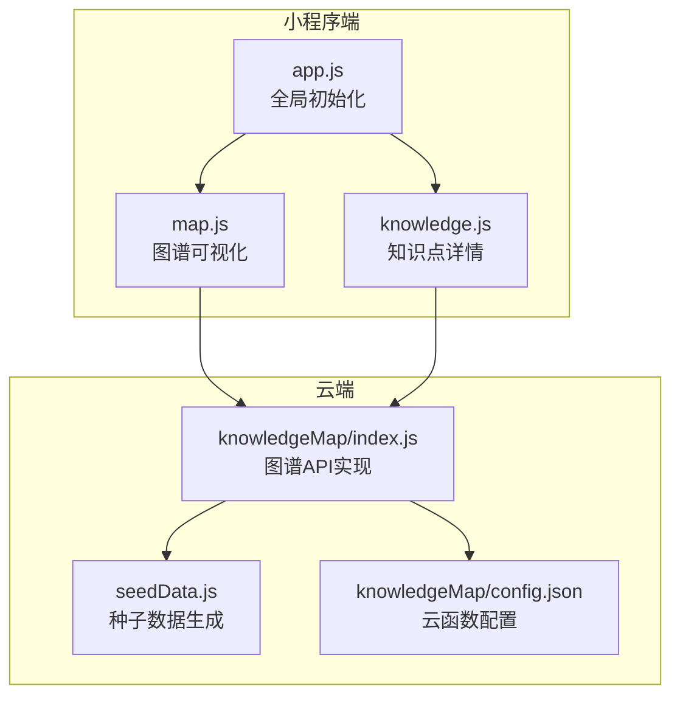
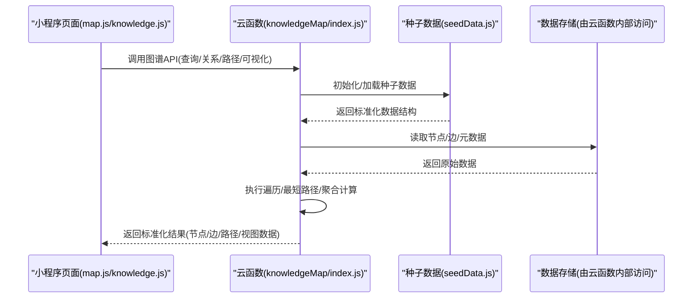
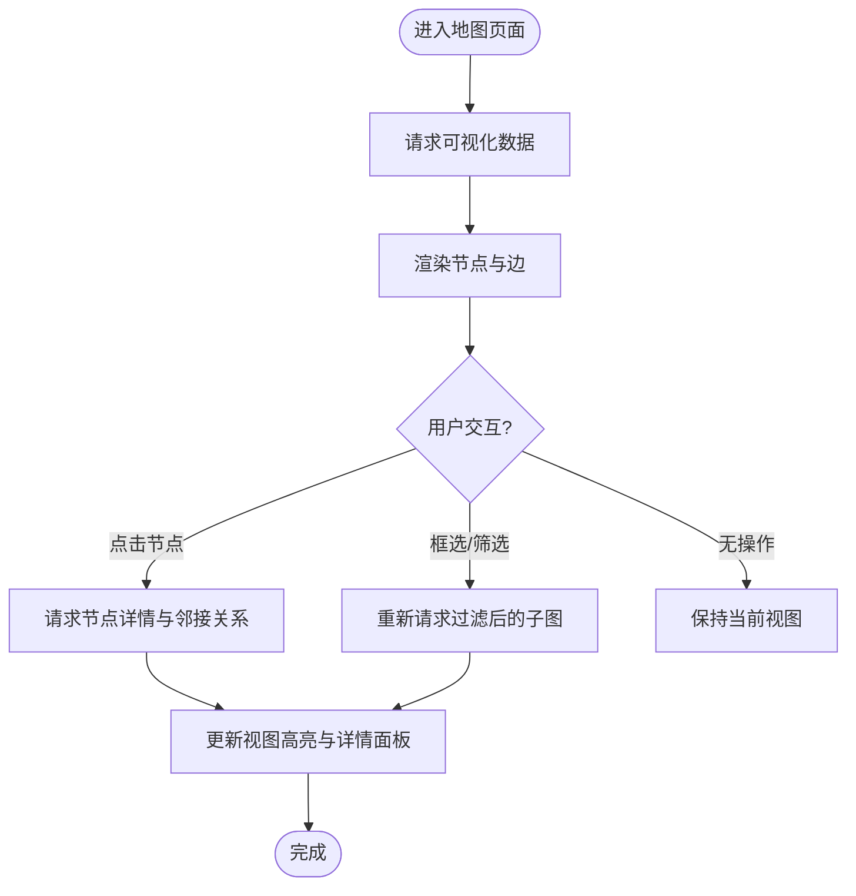
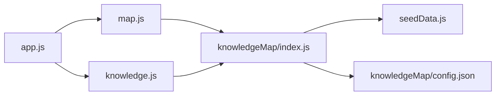

# 知识图谱API

<cite>
**本文引用的文件**   
- [cloudfunctions/knowledgeMap/index.js](file://cloudfunctions/knowledgeMap/index.js)
- [cloudfunctions/knowledgeMap/config.json](file://cloudfunctions/knowledgeMap/config.json)
- [cloudfunctions/knowledgeMap/seedData.js](file://cloudfunctions/knowledgeMap/seedData.js)
- [miniprogram/pages/map/map.js](file://miniprogram/pages/map/map.js)
- [miniprogram/pages/knowledge/knowledge.js](file://miniprogram/pages/knowledge/knowledge.js)
- [miniprogram/app.js](file://miniprogram/app.js)
</cite>

## 更新摘要
**变更内容**   
- 增强了知识图谱功能，在 cloudfunctions/knowledgeMap/index.js 中新增257行代码
- 新增了种子数据生成能力（seedData.js）
- 扩展了图谱数据初始化和管理功能
- 优化了知识图谱的初始化和数据处理流程

## 目录
1. [简介](#简介)
2. [项目结构](#项目结构)
3. [核心组件](#核心组件)
4. [架构总览](#架构总览)
5. [详细组件分析](#详细组件分析)
6. [依赖关系分析](#依赖关系分析)
7. [性能考虑](#性能考虑)
8. [故障排查指南](#故障排查指南)
9. [结论](#结论)
10. [附录](#附录)

## 简介
本文件为"知识图谱系统"的API接口文档，聚焦于知识点查询、关系获取、路径规划与可视化数据等能力。文档面向前端开发者与后端集成人员，提供清晰的接口规范、数据模型约定、算法说明与使用示例，并覆盖图谱更新、版本管理与性能优化等高级主题。

**更新** 本次更新重点增强了知识图谱的数据初始化和管理能力，新增了种子数据生成功能，提升了系统的可扩展性和维护性。

## 项目结构
本项目采用云函数作为后端服务，小程序端进行调用与展示。与知识图谱相关的核心位置如下：
- 云函数：cloudfunctions/knowledgeMap/（负责图谱数据的读取、计算与返回）
- 种子数据：cloudfunctions/knowledgeMap/seedData.js（负责图谱初始数据和测试数据生成）
- 小程序页面：miniprogram/pages/map/（图谱可视化）、miniprogram/pages/knowledge/（知识点详情与探索）
- 应用入口：miniprogram/app.js（全局配置与初始化）

**图表来源**
- [cloudfunctions/knowledgeMap/index.js](file://cloudfunctions/knowledgeMap/index.js)
- [cloudfunctions/knowledgeMap/seedData.js](file://cloudfunctions/knowledgeMap/seedData.js)
- [cloudfunctions/knowledgeMap/config.json](file://cloudfunctions/knowledgeMap/config.json)
- [miniprogram/pages/map/map.js](file://miniprogram/pages/map/map.js)
- [miniprogram/pages/knowledge/knowledge.js](file://miniprogram/pages/knowledge/knowledge.js)
- [miniprogram/app.js](file://miniprogram/app.js)

**章节来源**
- [cloudfunctions/knowledgeMap/index.js](file://cloudfunctions/knowledgeMap/index.js)
- [cloudfunctions/knowledgeMap/seedData.js](file://cloudfunctions/knowledgeMap/seedData.js)
- [cloudfunctions/knowledgeMap/config.json](file://cloudfunctions/knowledgeMap/config.json)
- [miniprogram/pages/map/map.js](file://miniprogram/pages/map/map.js)
- [miniprogram/pages/knowledge/knowledge.js](file://miniprogram/pages/knowledge/knowledge.js)
- [miniprogram/app.js](file://miniprogram/app.js)

## 核心组件
- 云函数 knowledgeMap：对外暴露图谱相关API，包括节点查询、关系检索、路径规划与可视化数据聚合。
- 种子数据生成器 seedData.js：提供图谱初始数据、测试数据和批量数据生成功能。
- 小程序 map 页面：接收云函数返回的图数据并进行渲染交互。
- 小程序 knowledge 页面：基于图谱关联进行知识点详情展示与探索。
- app.js：统一初始化与全局状态管理，便于在页面间共享图谱上下文。

**更新** 新增了种子数据生成器组件，用于支持图谱数据的快速初始化和测试环境搭建。

**章节来源**
- [cloudfunctions/knowledgeMap/index.js](file://cloudfunctions/knowledgeMap/index.js)
- [cloudfunctions/knowledgeMap/seedData.js](file://cloudfunctions/knowledgeMap/seedData.js)
- [miniprogram/pages/map/map.js](file://miniprogram/pages/map/map.js)
- [miniprogram/pages/knowledge/knowledge.js](file://miniprogram/pages/knowledge/knowledge.js)
- [miniprogram/app.js](file://miniprogram/app.js)

## 架构总览
下图展示了从前端到云函数的典型请求流程，以及数据在两端之间的流转方式。

**图表来源**
- [cloudfunctions/knowledgeMap/index.js](file://cloudfunctions/knowledgeMap/index.js)
- [cloudfunctions/knowledgeMap/seedData.js](file://cloudfunctions/knowledgeMap/seedData.js)
- [miniprogram/pages/map/map.js](file://miniprogram/pages/map/map.js)
- [miniprogram/pages/knowledge/knowledge.js](file://miniprogram/pages/knowledge/knowledge.js)

## 详细组件分析

### 云函数：knowledgeMap/index.js
职责
- 处理来自小程序的图谱相关请求
- 封装统一的输入输出格式
- 执行图谱遍历、最短路径、推荐学习路径等算法
- 提供可视化所需的数据聚合
- 管理种子数据的加载和初始化

关键接口定义（按功能分组）
- 知识点查询
  - 入参：节点标识或关键词、可选过滤条件（如层级、标签）
  - 出参：节点基本信息、所属层级、标签集合、扩展属性
- 关系获取
  - 入参：源节点ID、目标节点ID（可选）、关系类型（可选）
  - 出参：边列表，包含关系名称、权重、方向、附加信息
- 路径规划
  - 入参：起点ID、终点ID、最大深度、是否允许跨层级
  - 出参：路径序列（节点ID链）、路径长度、中间节点摘要
- 可视化数据
  - 入参：视图范围（如当前可见区域、缩放级别）、筛选条件
  - 出参：节点坐标、边连接、分组与颜色映射、统计摘要
- 数据初始化
  - 入参：初始化模式（开发/生产）、数据规模参数
  - 出参：初始化状态、生成的数据统计信息

算法说明
- 图谱遍历：支持广度优先与深度优先两种策略，用于展开邻接关系与生成子图。
- 最短路径计算：基于无权或加权图的Dijkstra/BFS变体，结合层级约束与权重阈值。
- 推荐学习路径：以掌握度、前置依赖与难度梯度为依据，生成渐进式学习序列。
- 数据生成：基于模板和规则自动生成符合业务逻辑的知识图谱数据。

错误处理
- 参数校验失败：返回明确的错误码与字段提示
- 资源不存在：返回空集或占位结构，避免前端崩溃
- 计算超时：返回部分结果与重试建议
- 初始化失败：提供降级方案和手动恢复机制

**更新** 新增了数据初始化接口和种子数据管理能力，增强了系统的可维护性和测试便利性。

**章节来源**
- [cloudfunctions/knowledgeMap/index.js](file://cloudfunctions/knowledgeMap/index.js)

### 种子数据生成器：seedData.js
职责
- 生成知识图谱的初始数据结构
- 提供测试环境和演示用的示例数据
- 支持不同规模和复杂度的数据生成
- 确保数据的一致性和完整性

核心功能
- 节点数据生成：创建符合业务规则的知识点节点
- 关系数据生成：建立节点间的依赖和关联关系
- 层次结构设计：构建合理的知识层级体系
- 数据验证：确保生成的数据满足业务约束

使用场景
- 开发环境快速搭建
- 功能演示和测试
- 性能基准测试
- 数据迁移和备份

**新增** 这是本次更新引入的新组件，专门负责知识图谱数据的初始化和生成。

**章节来源**
- [cloudfunctions/knowledgeMap/seedData.js](file://cloudfunctions/knowledgeMap/seedData.js)

### 小程序页面：map.js（图谱可视化）
职责
- 发起图谱数据请求并渲染节点与边
- 处理用户交互（点击、拖拽、缩放、筛选）
- 将用户选择反馈给云函数以获取更细粒度的关系或路径

交互流程

**图表来源**
- [miniprogram/pages/map/map.js](file://miniprogram/pages/map/map.js)

**章节来源**
- [miniprogram/pages/map/map.js](file://miniprogram/pages/map/map.js)

### 小程序页面：knowledge.js（知识点详情与探索）
职责
- 展示单个知识点的详细信息
- 基于图谱关系提供"关联学习"与"前置/后继"导航
- 支持一键生成"推荐学习路径"

使用示例
- 知识点探索：通过搜索或分类进入知识点详情页，查看其层级、标签与依赖关系。
- 关联学习：在详情页中点击"关联知识点"，跳转到相关节点继续学习。
- 思维导图：在详情页中选择"生成导图"，根据当前节点及其邻接关系生成局部导图视图。

**章节来源**
- [miniprogram/pages/knowledge/knowledge.js](file://miniprogram/pages/knowledge/knowledge.js)

### 应用入口：app.js（全局初始化）
职责
- 初始化云函数环境与服务端通信配置
- 提供全局方法供页面调用图谱API
- 缓存常用图谱元数据以提升首屏加载速度
- 管理图谱数据的生命周期和状态同步

**章节来源**
- [miniprogram/app.js](file://miniprogram/app.js)

## 依赖关系分析
- 前端依赖
  - map.js 与 knowledge.js 均依赖 app.js 提供的初始化与工具方法
  - 两者共同依赖 knowledgeMap 云函数提供的图谱API
- 后端依赖
  - knowledgeMap/index.js 依赖 config.json 中的配置项（如存储访问、限流策略等）
  - knowledgeMap/index.js 依赖 seedData.js 进行数据初始化和生成
  - 内部可能依赖外部存储服务（由云函数运行时访问）

**图表来源**
- [miniprogram/app.js](file://miniprogram/app.js)
- [miniprogram/pages/map/map.js](file://miniprogram/pages/map/map.js)
- [miniprogram/pages/knowledge/knowledge.js](file://miniprogram/pages/knowledge/knowledge.js)
- [cloudfunctions/knowledgeMap/index.js](file://cloudfunctions/knowledgeMap/index.js)
- [cloudfunctions/knowledgeMap/seedData.js](file://cloudfunctions/knowledgeMap/seedData.js)
- [cloudfunctions/knowledgeMap/config.json](file://cloudfunctions/knowledgeMap/config.json)

**章节来源**
- [miniprogram/app.js](file://miniprogram/app.js)
- [miniprogram/pages/map/map.js](file://miniprogram/pages/map/map.js)
- [miniprogram/pages/knowledge/knowledge.js](file://miniprogram/pages/knowledge/knowledge.js)
- [cloudfunctions/knowledgeMap/index.js](file://cloudfunctions/knowledgeMap/index.js)
- [cloudfunctions/knowledgeMap/seedData.js](file://cloudfunctions/knowledgeMap/seedData.js)
- [cloudfunctions/knowledgeMap/config.json](file://cloudfunctions/knowledgeMap/config.json)

## 性能考虑
- 分页与增量加载：对大规模图谱采用分页与懒加载，减少单次响应体积。
- 缓存策略：在小程序端缓存热点节点与邻接关系，降低重复请求。
- 计算卸载：将复杂遍历与路径计算放在云函数侧执行，避免移动端卡顿。
- 传输压缩：启用响应压缩与必要字段裁剪，提升网络吞吐。
- 并发控制：限制并行请求数量，避免雪崩效应。
- 数据预加载：利用种子数据提前准备常用数据集，减少首次加载时间。

**更新** 新增了数据预加载策略，通过种子数据优化首次访问性能。

## 故障排查指南
常见问题与定位步骤
- 请求失败或超时
  - 检查云函数日志与错误码
  - 确认入参是否符合接口约定
  - 验证网络连接与权限配置
- 数据为空或不完整
  - 核对节点ID是否存在
  - 检查过滤条件是否过于严格
  - 确认云函数内部数据源是否可用
  - 验证种子数据是否正确初始化
- 可视化异常
  - 检查返回的节点/边数据结构是否完整
  - 确认渲染库的版本兼容性
  - 观察控制台是否有越界或类型错误
- 初始化问题
  - 检查种子数据生成是否成功
  - 验证数据一致性约束
  - 确认数据库连接和权限设置

**更新** 新增了种子数据相关的故障排查指导。

**章节来源**
- [cloudfunctions/knowledgeMap/index.js](file://cloudfunctions/knowledgeMap/index.js)
- [cloudfunctions/knowledgeMap/seedData.js](file://cloudfunctions/knowledgeMap/seedData.js)
- [miniprogram/pages/map/map.js](file://miniprogram/pages/map/map.js)
- [miniprogram/pages/knowledge/knowledge.js](file://miniprogram/pages/knowledge/knowledge.js)

## 结论
本API文档围绕知识图谱的核心能力，给出了清晰的前后端协作模式、接口规范与算法说明。通过合理的分层与职责划分，系统实现了高效的图谱查询、关系获取、路径规划与可视化展示。本次更新引入的种子数据生成功能进一步增强了系统的可维护性和可扩展性，为后续的版本管理和增量更新奠定了良好基础。

## 附录

### 数据模型约定（概念性）
- 节点（Node）
  - 标识：唯一ID
  - 基础信息：名称、描述、层级、标签
  - 扩展属性：难度、掌握度、更新时间
- 边（Edge）
  - 源节点ID、目标节点ID
  - 关系类型：前置依赖、并列、进阶等
  - 权重：影响路径计算的数值
- 路径（Path）
  - 节点ID序列
  - 长度与中间节点摘要
- 视图数据（Visualization）
  - 节点坐标、边连接、分组与颜色映射
  - 统计摘要：节点数、边数、连通分量
- 种子数据（SeedData）
  - 数据模板：标准化的数据结构定义
  - 生成规则：业务逻辑和数据约束
  - 版本信息：数据版本和兼容性标记

**更新** 新增了种子数据模型的定义。