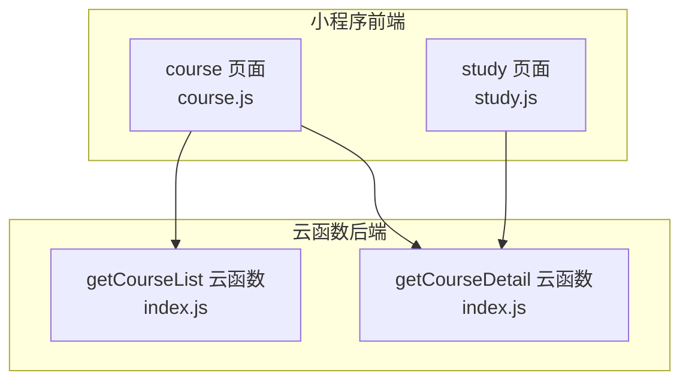
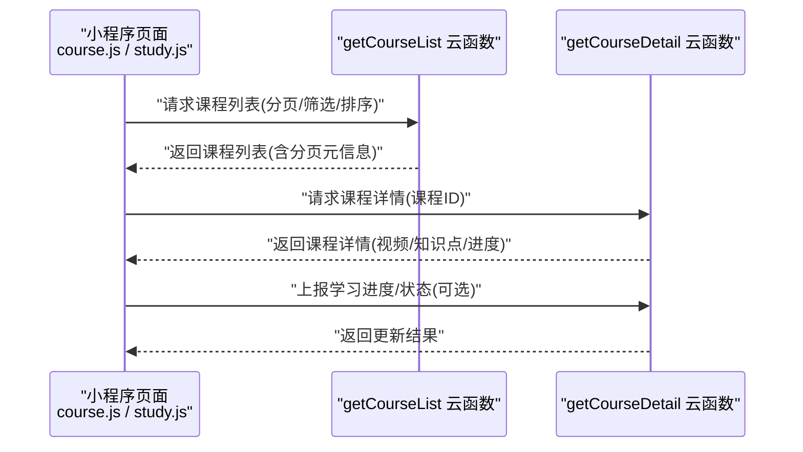
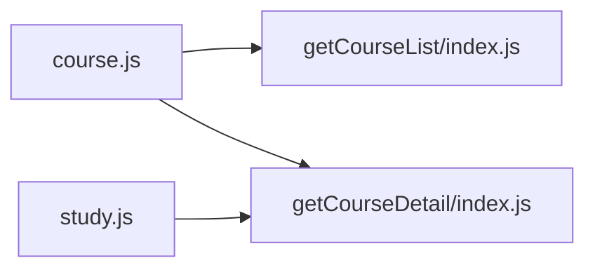

# 课程管理API

<cite>
**本文引用的文件**   
- [cloudfunctions/getCourseList/index.js](file://cloudfunctions/getCourseList/index.js)
- [cloudfunctions/getCourseDetail/index.js](file://cloudfunctions/getCourseDetail/index.js)
- [miniprogram/pages/course/course.js](file://miniprogram/pages/course/course.js)
- [miniprogram/pages/study/study.js](file://miniprogram/pages/study/study.js)
- [docs/courselist.md](file://docs/courselist.md)
</cite>

## 目录
1. [简介](#简介)
2. [项目结构](#项目结构)
3. [核心组件](#核心组件)
4. [架构总览](#架构总览)
5. [详细接口说明](#详细接口说明)
6. [依赖分析](#依赖分析)
7. [性能与缓存建议](#性能与缓存建议)
8. [故障排查指南](#故障排查指南)
9. [结论](#结论)

## 简介
本文件为课程管理系统的API接口文档，覆盖以下能力：
- 课程列表获取（分页、筛选、排序）
- 课程详情查询（视频信息、知识点关联等）
- 学习进度跟踪与同步（学习状态更新、进度上报）
- 高级功能（批量更新、增量同步、幂等控制）
- 缓存策略与性能优化建议

## 项目结构
本项目采用“小程序前端 + 云函数后端”的架构。课程相关的前端页面位于 miniprogram/pages，后端逻辑通过 cloudfunctions 下的独立云函数提供。

图表来源
- [miniprogram/pages/course/course.js](file://miniprogram/pages/course/course.js)
- [miniprogram/pages/study/study.js](file://miniprogram/pages/study/study.js)
- [cloudfunctions/getCourseList/index.js](file://cloudfunctions/getCourseList/index.js)
- [cloudfunctions/getCourseDetail/index.js](file://cloudfunctions/getCourseDetail/index.js)

章节来源
- [miniprogram/pages/course/course.js](file://miniprogram/pages/course/course.js)
- [miniprogram/pages/study/study.js](file://miniprogram/pages/study/study.js)
- [cloudfunctions/getCourseList/index.js](file://cloudfunctions/getCourseList/index.js)
- [cloudfunctions/getCourseDetail/index.js](file://cloudfunctions/getCourseDetail/index.js)

## 核心组件
- 课程列表云函数：负责按条件分页返回课程集合，支持筛选与排序。
- 课程详情云函数：返回单门课程完整信息，包括视频清单、知识点关联、学习进度等。
- 前端 course 页面：调用列表与详情接口，展示课程卡片与详情视图。
- 前端 study 页面：用于学习过程中上报进度与状态。

章节来源
- [cloudfunctions/getCourseList/index.js](file://cloudfunctions/getCourseList/index.js)
- [cloudfunctions/getCourseDetail/index.js](file://cloudfunctions/getCourseDetail/index.js)
- [miniprogram/pages/course/course.js](file://miniprogram/pages/course/course.js)
- [miniprogram/pages/study/study.js](file://miniprogram/pages/study/study.js)

## 架构总览
下图展示了从前端到云函数的典型请求流程，以及数据在前后端的流转关系。

图表来源
- [miniprogram/pages/course/course.js](file://miniprogram/pages/course/course.js)
- [miniprogram/pages/study/study.js](file://miniprogram/pages/study/study.js)
- [cloudfunctions/getCourseList/index.js](file://cloudfunctions/getCourseList/index.js)
- [cloudfunctions/getCourseDetail/index.js](file://cloudfunctions/getCourseDetail/index.js)

## 详细接口说明

### 通用约定
- 认证方式：基于小程序登录态（由调用方在云函数上下文中获取用户标识）。
- 错误码：统一使用 code/message/data 结构；code=0 表示成功，非0表示失败。
- 时间格式：ISO 8601 字符串或 Unix 秒级时间戳（以具体字段为准）。
- 分页参数：page（页码，默认1）、pageSize（每页数量，默认20）。
- 排序选项：sortBy（如 createTime、updateTime、hotScore 等）、order（asc/desc）。
- 筛选条件：category、level、status、keyword 等（按需支持）。

章节来源
- [cloudfunctions/getCourseList/index.js](file://cloudfunctions/getCourseList/index.js)
- [cloudfunctions/getCourseDetail/index.js](file://cloudfunctions/getCourseDetail/index.js)

### 课程列表
- 接口名称：获取课程列表
- 调用入口：getCourseList 云函数
- 请求参数
  - page: 整数，默认1
  - pageSize: 整数，默认20
  - sortBy: 字符串，可选值见排序选项
  - order: 字符串，asc 或 desc
  - category: 字符串，可选
  - level: 字符串，可选
  - status: 字符串，可选
  - keyword: 字符串，可选
- 响应数据
  - list: 课程数组
  - total: 总数
  - page, pageSize: 当前分页信息
- 注意事项
  - 当未指定排序时，默认按创建时间倒序
  - 关键词匹配范围：课程名、简介

章节来源
- [cloudfunctions/getCourseList/index.js](file://cloudfunctions/getCourseList/index.js)

### 课程详情
- 接口名称：获取课程详情
- 调用入口：getCourseDetail 云函数
- 请求参数
  - courseId: 字符串，必填
- 响应数据
  - id: 课程ID
  - title: 课程标题
  - description: 课程描述
  - cover: 封面图URL
  - category: 分类
  - level: 难度等级
  - status: 上架状态
  - videos: 视频清单（见下方视频数据结构）
  - knowledgePoints: 知识点关联（见下方知识点数据结构）
  - progress: 学习进度（见下方进度数据结构）
- 注意事项
  - 若课程不存在，返回对应错误码
  - 仅返回当前用户可见的课程内容

章节来源
- [cloudfunctions/getCourseDetail/index.js](file://cloudfunctions/getCourseDetail/index.js)

### 学习进度与状态
- 接口名称：更新学习进度/状态
- 调用入口：getCourseDetail 云函数（复用同一云函数，按 action 区分）
- 请求参数
  - courseId: 字符串，必填
  - action: 字符串，取值示例：
    - updateProgress: 更新观看进度
    - syncStatus: 同步学习状态
  - data: 对象，随 action 不同包含不同字段
    - updateProgress: { videoId, currentTime, duration }
    - syncStatus: { status, lastStudyAt }
- 响应数据
  - success: 布尔
  - message: 提示信息
  - data: 更新后的进度/状态快照（可选）
- 注意事项
  - 建议客户端实现幂等键（如 requestId），避免重复上报导致抖动
  - 服务端应做去重与合并策略

章节来源
- [cloudfunctions/getCourseDetail/index.js](file://cloudfunctions/getCourseDetail/index.js)
- [miniprogram/pages/study/study.js](file://miniprogram/pages/study/study.js)

### 数据结构定义

#### 课程对象
- id: 字符串
- title: 字符串
- description: 字符串
- cover: 字符串
- category: 字符串
- level: 字符串
- status: 字符串
- createdAt: 时间
- updatedAt: 时间

章节来源
- [cloudfunctions/getCourseList/index.js](file://cloudfunctions/getCourseList/index.js)
- [cloudfunctions/getCourseDetail/index.js](file://cloudfunctions/getCourseDetail/index.js)

#### 视频对象
- id: 字符串
- title: 字符串
- duration: 数字（秒）
- url: 字符串
- thumbnail: 字符串
- orderNo: 数字
- status: 字符串

章节来源
- [cloudfunctions/getCourseDetail/index.js](file://cloudfunctions/getCourseDetail/index.js)

#### 知识点对象
- id: 字符串
- name: 字符串
- tags: 字符串数组
- difficulty: 数字
- relatedVideoIds: 字符串数组

章节来源
- [cloudfunctions/getCourseDetail/index.js](file://cloudfunctions/getCourseDetail/index.js)

#### 学习进度对象
- courseId: 字符串
- currentVideoId: 字符串
- currentTime: 数字（秒）
- duration: 数字（秒）
- status: 字符串（如 notStarted/inProgress/completed）
- lastStudyAt: 时间
- completedVideos: 字符串数组

章节来源
- [cloudfunctions/getCourseDetail/index.js](file://cloudfunctions/getCourseDetail/index.js)
- [miniprogram/pages/study/study.js](file://miniprogram/pages/study/study.js)

### 分页与筛选示例
- 分页：page=1&pageSize=20
- 筛选：category=编程&level=入门&status=published
- 排序：sortBy=createTime&order=desc

章节来源
- [cloudfunctions/getCourseList/index.js](file://cloudfunctions/getCourseList/index.js)

### 高级功能
- 批量更新：支持一次提交多个视频的进度，减少网络往返
- 增量同步：仅上报差异字段，降低带宽占用
- 离线缓存：本地保存最近学习的课程进度，网络恢复后自动同步
- 幂等控制：通过 requestId 保证重复上报不产生副作用

章节来源
- [cloudfunctions/getCourseDetail/index.js](file://cloudfunctions/getCourseDetail/index.js)
- [miniprogram/pages/study/study.js](file://miniprogram/pages/study/study.js)

## 依赖分析
- 前端依赖
  - course 页面依赖 getCourseList 与 getCourseDetail 两个云函数
  - study 页面主要依赖 getCourseDetail 进行进度上报
- 后端依赖
  - getCourseList 与 getCourseDetail 各自独立，职责清晰
  - 可通过统一错误处理与日志记录提升可观测性

图表来源
- [miniprogram/pages/course/course.js](file://miniprogram/pages/course/course.js)
- [miniprogram/pages/study/study.js](file://miniprogram/pages/study/study.js)
- [cloudfunctions/getCourseList/index.js](file://cloudfunctions/getCourseList/index.js)
- [cloudfunctions/getCourseDetail/index.js](file://cloudfunctions/getCourseDetail/index.js)

章节来源
- [miniprogram/pages/course/course.js](file://miniprogram/pages/course/course.js)
- [miniprogram/pages/study/study.js](file://miniprogram/pages/study/study.js)
- [cloudfunctions/getCourseList/index.js](file://cloudfunctions/getCourseList/index.js)
- [cloudfunctions/getCourseDetail/index.js](file://cloudfunctions/getCourseDetail/index.js)

## 性能与缓存建议
- 列表缓存
  - 对热门课程列表进行短期缓存（如5分钟），减少数据库压力
  - 使用 ETag/Last-Modified 机制，支持条件请求
- 详情缓存
  - 课程详情变更频率低，可缓存较长时间（如1小时）
  - 结合版本号或哈希值，确保缓存失效一致性
- 进度上报
  - 合并上报：将多次短时间内的进度变化合并为一次上报
  - 节流策略：限制上报频率（如每5秒最多一次）
- 图片与媒体
  - 使用CDN加速视频与封面图加载
  - 预加载下一节视频的关键帧与缩略图
- 连接与重试
  - 指数退避重试，避免雪崩
  - 设置合理的超时与降级策略

[本节为通用性能建议，无需代码来源]

## 故障排查指南
- 常见问题
  - 课程不存在：检查 courseId 是否正确，确认课程状态为已发布
  - 权限不足：确认当前用户具备访问该课程的权限
  - 进度未更新：检查上报参数是否完整，确认 action 与 data 结构正确
- 定位方法
  - 查看云函数日志，关注错误码与堆栈信息
  - 对比前后端数据结构，确保字段一致
  - 使用抓包工具验证请求参数与响应体
- 快速修复
  - 清理本地缓存并重新拉取最新数据
  - 增加重试与容错逻辑，提升鲁棒性

章节来源
- [cloudfunctions/getCourseList/index.js](file://cloudfunctions/getCourseList/index.js)
- [cloudfunctions/getCourseDetail/index.js](file://cloudfunctions/getCourseDetail/index.js)
- [miniprogram/pages/study/study.js](file://miniprogram/pages/study/study.js)

## 结论
本课程管理API围绕“列表-详情-进度”三大核心场景设计，结构清晰、扩展性强。通过合理的分页、筛选、排序与缓存策略，可在保证用户体验的同时提升系统性能。建议在后续迭代中完善批量与增量同步能力，并引入更完善的监控与告警体系。