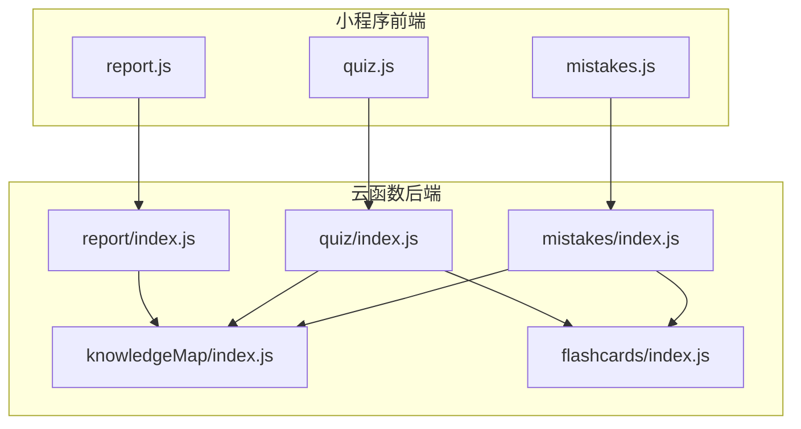
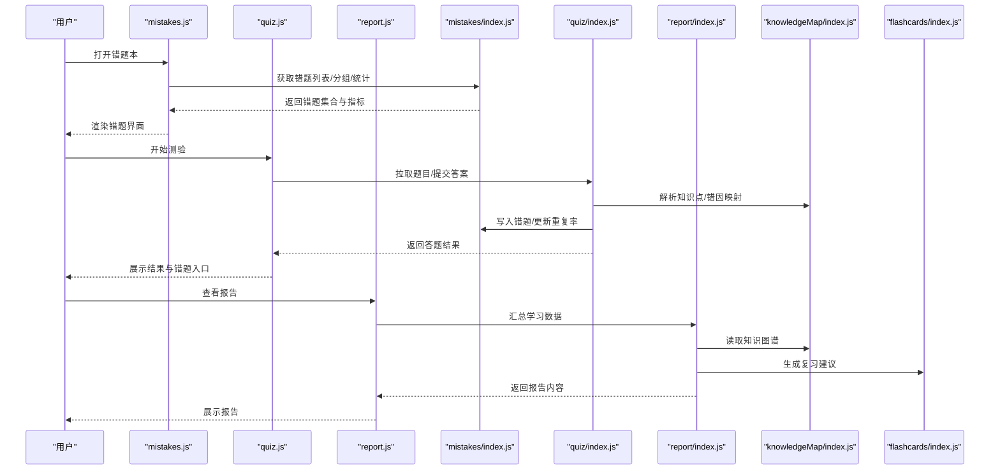
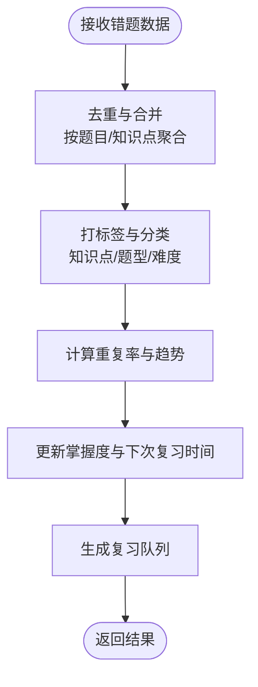
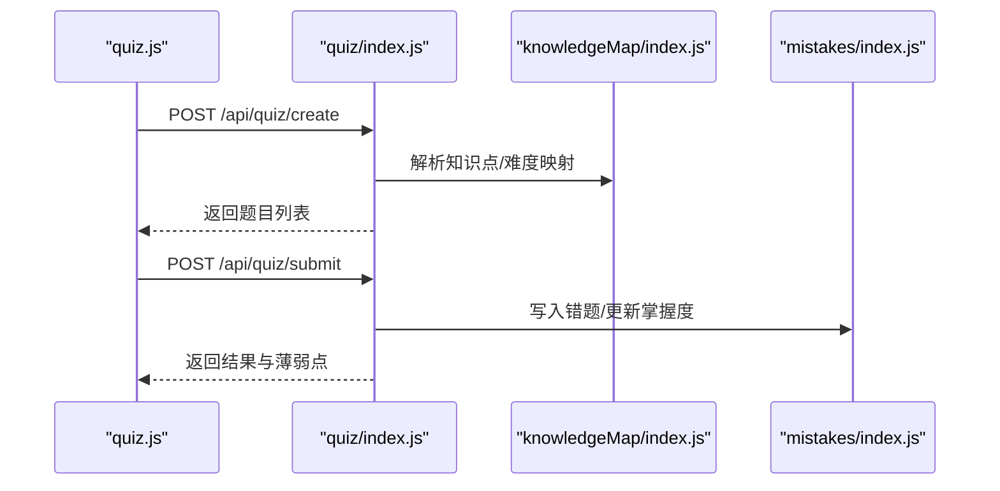
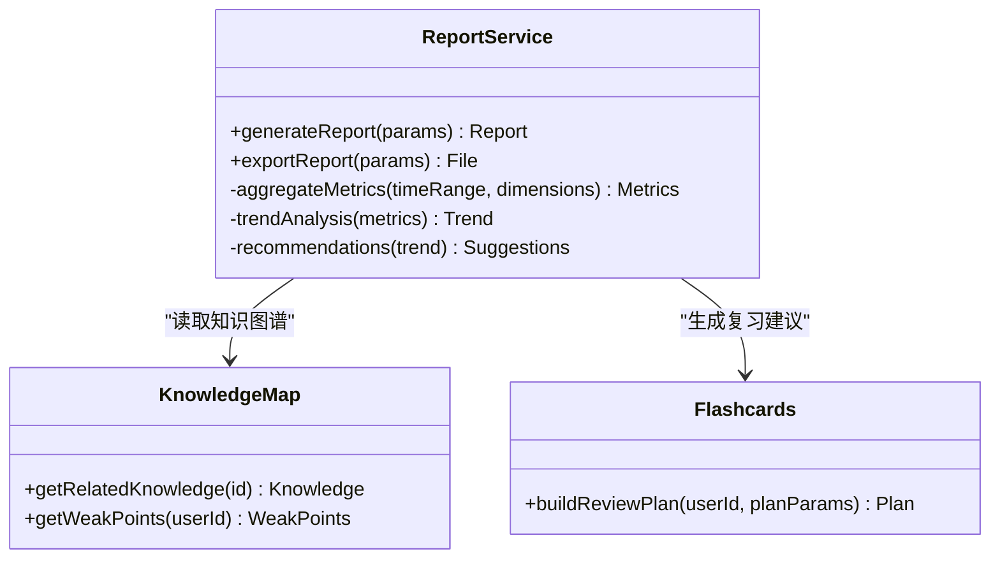
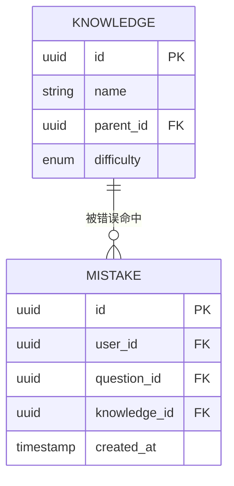
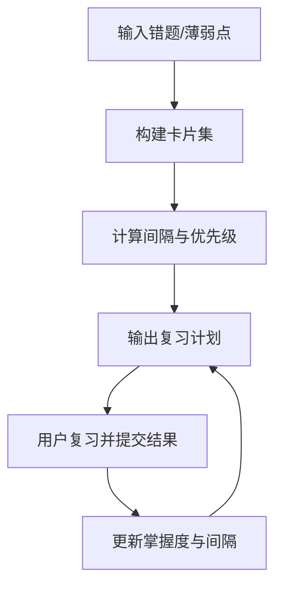
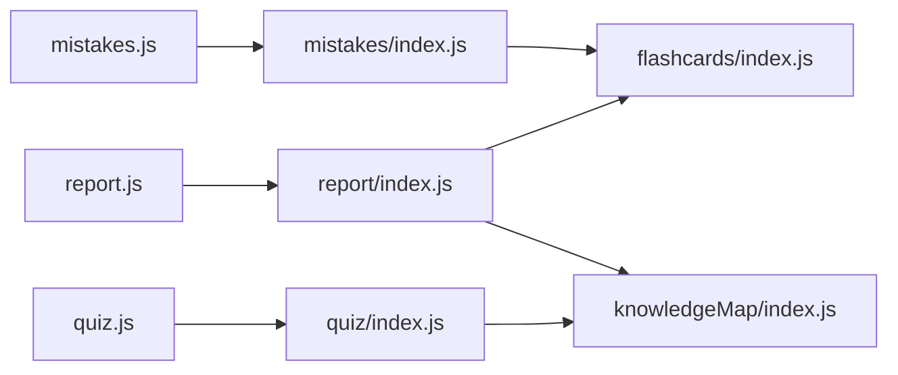
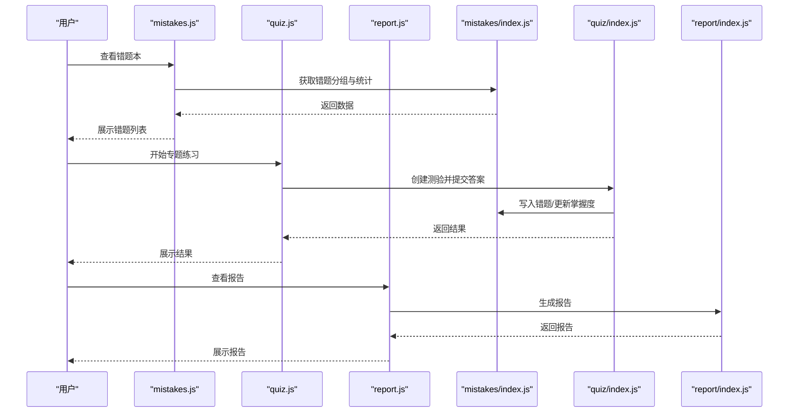

# 错题管理API

<cite>
**本文引用的文件**   
- [cloudfunctions/mistakes/index.js](file://cloudfunctions/mistakes/index.js)
- [cloudfunctions/quiz/index.js](file://cloudfunctions/quiz/index.js)
- [cloudfunctions/report/index.js](file://cloudfunctions/report/index.js)
- [cloudfunctions/knowledgeMap/index.js](file://cloudfunctions/knowledgeMap/index.js)
- [cloudfunctions/flashcards/index.js](file://cloudfunctions/flashcards/index.js)
- [miniprogram/pages/mistakes/mistakes.js](file://miniprogram/pages/mistakes/mistakes.js)
- [miniprogram/pages/quiz/quiz.js](file://miniprogram/pages/quiz/quiz.js)
- [miniprogram/pages/report/report.js](file://miniprogram/pages/report/report.js)
</cite>

## 目录
1. [简介](#简介)
2. [项目结构](#项目结构)
3. [核心组件](#核心组件)
4. [架构总览](#架构总览)
5. [详细组件分析](#详细组件分析)
6. [依赖分析](#依赖分析)
7. [性能考虑](#性能考虑)
8. [故障排查指南](#故障排查指南)
9. [结论](#结论)
10. [附录](#附录)

## 简介
本文件为“错题管理系统”的API接口文档，覆盖错题收集、分类整理、复习推送、掌握度评估等核心能力，并给出数据模型、错误原因分析、重复率统计、个性化复习计划生成、智能推送算法与遗忘曲线应用的技术说明。同时提供错题本管理、专题练习、强化训练的使用示例，以及学习进度追踪、效果评估、报告生成等高级功能的接口说明。

## 项目结构
本项目采用小程序前端 + 云函数后端的分层架构：
- 前端页面负责用户交互与调用云函数
- 云函数实现业务逻辑、数据聚合与算法计算
- 关键模块包括：错题（mistakes）、测验（quiz）、报告（report）、知识图谱（knowledgeMap）、闪卡（flashcards）

**图示来源** 
- [cloudfunctions/mistakes/index.js](file://cloudfunctions/mistakes/index.js)
- [cloudfunctions/quiz/index.js](file://cloudfunctions/quiz/index.js)
- [cloudfunctions/report/index.js](file://cloudfunctions/report/index.js)
- [cloudfunctions/knowledgeMap/index.js](file://cloudfunctions/knowledgeMap/index.js)
- [cloudfunctions/flashcards/index.js](file://cloudfunctions/flashcards/index.js)
- [miniprogram/pages/mistakes/mistakes.js](file://miniprogram/pages/mistakes/mistakes.js)
- [miniprogram/pages/quiz/quiz.js](file://miniprogram/pages/quiz/quiz.js)
- [miniprogram/pages/report/report.js](file://miniprogram/pages/report/report.js)

**章节来源**
- [cloudfunctions/mistakes/index.js](file://cloudfunctions/mistakes/index.js)
- [cloudfunctions/quiz/index.js](file://cloudfunctions/quiz/index.js)
- [cloudfunctions/report/index.js](file://cloudfunctions/report/index.js)
- [cloudfunctions/knowledgeMap/index.js](file://cloudfunctions/knowledgeMap/index.js)
- [cloudfunctions/flashcards/index.js](file://cloudfunctions/flashcards/index.js)
- [miniprogram/pages/mistakes/mistakes.js](file://miniprogram/pages/mistakes/mistakes.js)
- [miniprogram/pages/quiz/quiz.js](file://miniprogram/pages/quiz/quiz.js)
- [miniprogram/pages/report/report.js](file://miniprogram/pages/report/report.js)

## 核心组件
- 错题服务（mistakes）：负责错题采集、去重、标签化、分组、复习队列构建、重复率统计、错误原因归因等
- 测验服务（quiz）：负责题目下发、作答记录、结果回写、薄弱点识别、与错题系统联动
- 报告服务（report）：汇总学习行为与表现，输出个人报告、趋势分析与效果评估
- 知识图谱（knowledgeMap）：知识点关系建模，支撑错因分析与个性化推荐
- 闪卡（flashcards）：基于间隔重复（Ebbinghaus）的复习卡片生成与调度

**章节来源**
- [cloudfunctions/mistakes/index.js](file://cloudfunctions/mistakes/index.js)
- [cloudfunctions/quiz/index.js](file://cloudfunctions/quiz/index.js)
- [cloudfunctions/report/index.js](file://cloudfunctions/report/index.js)
- [cloudfunctions/knowledgeMap/index.js](file://cloudfunctions/knowledgeMap/index.js)
- [cloudfunctions/flashcards/index.js](file://cloudfunctions/flashcards/index.js)

## 架构总览
整体流程：前端触发操作 → 路由到对应云函数 → 云函数执行业务逻辑（含算法与聚合）→ 返回结构化结果给前端展示或继续后续流程。

**图示来源** 
- [miniprogram/pages/mistakes/mistakes.js](file://miniprogram/pages/mistakes/mistakes.js)
- [miniprogram/pages/quiz/quiz.js](file://miniprogram/pages/quiz/quiz.js)
- [miniprogram/pages/report/report.js](file://miniprogram/pages/report/report.js)
- [cloudfunctions/mistakes/index.js](file://cloudfunctions/mistakes/index.js)
- [cloudfunctions/quiz/index.js](file://cloudfunctions/quiz/index.js)
- [cloudfunctions/report/index.js](file://cloudfunctions/report/index.js)
- [cloudfunctions/knowledgeMap/index.js](file://cloudfunctions/knowledgeMap/index.js)
- [cloudfunctions/flashcards/index.js](file://cloudfunctions/flashcards/index.js)

## 详细组件分析

### 错题服务（mistakes）
职责
- 错题收集：从测验结果中抽取错题，合并去重，建立错题条目
- 分类整理：按知识点、难度、错误类型进行分组与标签化
- 复习推送：根据遗忘曲线与掌握度生成每日复习队列
- 掌握度评估：基于历史作答序列计算掌握概率与下次复习时间
- 重复率统计：统计同一知识点/题型的重复出错次数与趋势

典型接口（概念性定义）
- 新增错题
  - 方法：POST /api/mistakes/add
  - 请求体字段：题目ID、用户ID、知识点ID、错误类型、作答详情、时间戳
  - 响应：错题ID、是否首次出现、关联知识点
- 获取错题列表
  - 方法：GET /api/mistakes/list
  - 查询参数：分页、筛选（知识点、错误类型、最近N天）、排序
  - 响应：错题条目数组、总数、分页信息
- 错题分组与统计
  - 方法：GET /api/mistakes/group
  - 查询参数：维度（知识点/题型/难度）
  - 响应：分组计数、重复率、趋势指标
- 复习队列生成
  - 方法：GET /api/mistakes/reviewQueue
  - 查询参数：目标数量、策略（遗忘曲线/薄弱优先）
  - 响应：待复习错题ID列表、优先级、预计耗时
- 掌握度更新
  - 方法：POST /api/mistakes/masteryUpdate
  - 请求体字段：错题ID、本次作答正确与否、置信度
  - 响应：新掌握度、下次复习时间

数据模型（核心字段）
- 错题条目：id、userId、questionId、knowledgeId、errorType、history[]、mastery、nextReviewAt、repeatCount、tags[]
- 知识点：id、name、parentId、difficulty、relatedErrors[]
- 复习任务：reviewId、questionId、priority、dueAt、strategy

算法要点
- 遗忘曲线：基于艾宾浩斯间隔，结合掌握度动态调整复习间隔
- 重复率：对相同知识点/题型的错题进行频次统计，支持滑动窗口趋势
- 错因分析：将错误类型映射到知识薄弱点，辅助个性化推荐

**图示来源** 
- [cloudfunctions/mistakes/index.js](file://cloudfunctions/mistakes/index.js)

**章节来源**
- [cloudfunctions/mistakes/index.js](file://cloudfunctions/mistakes/index.js)

### 测验服务（quiz）
职责
- 题目下发：按知识点、难度、错因分布生成试卷
- 作答处理：校验答案、记录作答轨迹、判定正误
- 结果回写：触发错题入库、更新掌握度、刷新复习队列
- 薄弱点识别：基于作答表现定位薄弱知识点，联动知识图谱

典型接口（概念性定义）
- 创建测验
  - 方法：POST /api/quiz/create
  - 请求体字段：用户ID、范围（知识点/题型）、题量、难度分布
  - 响应：测验ID、题目列表、预计时长
- 提交答案
  - 方法：POST /api/quiz/submit
  - 请求体字段：测验ID、答案序列、用时
  - 响应：得分、错题清单、薄弱点提示
- 获取测验详情
  - 方法：GET /api/quiz/detail
  - 查询参数：测验ID
  - 响应：题目、选项、正确答案、解析、用户作答

**图示来源** 
- [miniprogram/pages/quiz/quiz.js](file://miniprogram/pages/quiz/quiz.js)
- [cloudfunctions/quiz/index.js](file://cloudfunctions/quiz/index.js)
- [cloudfunctions/knowledgeMap/index.js](file://cloudfunctions/knowledgeMap/index.js)
- [cloudfunctions/mistakes/index.js](file://cloudfunctions/mistakes/index.js)

**章节来源**
- [cloudfunctions/quiz/index.js](file://cloudfunctions/quiz/index.js)
- [miniprogram/pages/quiz/quiz.js](file://miniprogram/pages/quiz/quiz.js)

### 报告服务（report）
职责
- 学习进度追踪：统计学习时长、完成题量、正确率趋势
- 效果评估：对比不同阶段表现，识别提升显著/停滞领域
- 报告生成：输出可视化图表与文字总结，包含错题热点、薄弱点、复习建议

典型接口（概念性定义）
- 生成报告
  - 方法：GET /api/report/generate
  - 查询参数：时间范围、维度（日/周/月）、指标选择
  - 响应：指标摘要、趋势图数据、改进建议
- 导出报告
  - 方法：POST /api/report/export
  - 请求体字段：格式（PDF/JSON）、范围
  - 响应：下载链接或文件内容

**图示来源** 
- [cloudfunctions/report/index.js](file://cloudfunctions/report/index.js)
- [cloudfunctions/knowledgeMap/index.js](file://cloudfunctions/knowledgeMap/index.js)
- [cloudfunctions/flashcards/index.js](file://cloudfunctions/flashcards/index.js)

**章节来源**
- [cloudfunctions/report/index.js](file://cloudfunctions/report/index.js)
- [miniprogram/pages/report/report.js](file://miniprogram/pages/report/report.js)

### 知识图谱（knowledgeMap）
职责
- 知识点建模：节点（知识点）、边（父子/先修/相关）
- 错因映射：将错误类型与知识点关联，形成错因路径
- 个性化推荐：基于图谱拓扑与用户表现推荐复习内容

典型接口（概念性定义）
- 获取知识点详情
  - 方法：GET /api/knowledge/detail
  - 查询参数：知识点ID
  - 响应：基本信息、关联错题、相关知识点
- 获取薄弱点
  - 方法：GET /api/knowledge/weakPoints
  - 查询参数：用户ID、阈值
  - 响应：薄弱知识点列表与强度评分

**图示来源** 
- [cloudfunctions/knowledgeMap/index.js](file://cloudfunctions/knowledgeMap/index.js)

**章节来源**
- [cloudfunctions/knowledgeMap/index.js](file://cloudfunctions/knowledgeMap/index.js)

### 闪卡（flashcards）
职责
- 间隔重复：依据遗忘曲线与掌握度生成复习卡片
- 复习计划：按日/周计划组织复习任务，支持批量导入错题
- 强化训练：针对高频错题与薄弱知识点生成专项卡片

典型接口（概念性定义）
- 生成复习计划
  - 方法：GET /api/flashcards/plan
  - 查询参数：用户ID、时间窗、策略
  - 响应：计划项（卡片ID、复习时间、优先级）
- 提交复习结果
  - 方法：POST /api/flashcards/result
  - 请求体字段：卡片ID、掌握评分、用时
  - 响应：下次复习时间、计划更新

**图示来源** 
- [cloudfunctions/flashcards/index.js](file://cloudfunctions/flashcards/index.js)

**章节来源**
- [cloudfunctions/flashcards/index.js](file://cloudfunctions/flashcards/index.js)

## 依赖分析
- 前端依赖
  - mistakes.js 调用 mistakes 云函数
  - quiz.js 调用 quiz 云函数
  - report.js 调用 report 云函数
- 后端依赖
  - quiz 依赖 knowledgeMap 进行知识点解析与错因映射
  - report 依赖 knowledgeMap 与 flashcards 生成报告与建议
  - mistakes 可依赖 flashcards 生成复习队列

**图示来源** 
- [miniprogram/pages/mistakes/mistakes.js](file://miniprogram/pages/mistakes/mistakes.js)
- [miniprogram/pages/quiz/quiz.js](file://miniprogram/pages/quiz/quiz.js)
- [miniprogram/pages/report/report.js](file://miniprogram/pages/report/report.js)
- [cloudfunctions/mistakes/index.js](file://cloudfunctions/mistakes/index.js)
- [cloudfunctions/quiz/index.js](file://cloudfunctions/quiz/index.js)
- [cloudfunctions/report/index.js](file://cloudfunctions/report/index.js)
- [cloudfunctions/knowledgeMap/index.js](file://cloudfunctions/knowledgeMap/index.js)
- [cloudfunctions/flashcards/index.js](file://cloudfunctions/flashcards/index.js)

**章节来源**
- [miniprogram/pages/mistakes/mistakes.js](file://miniprogram/pages/mistakes/mistakes.js)
- [miniprogram/pages/quiz/quiz.js](file://miniprogram/pages/quiz/quiz.js)
- [miniprogram/pages/report/report.js](file://miniprogram/pages/report/report.js)
- [cloudfunctions/mistakes/index.js](file://cloudfunctions/mistakes/index.js)
- [cloudfunctions/quiz/index.js](file://cloudfunctions/quiz/index.js)
- [cloudfunctions/report/index.js](file://cloudfunctions/report/index.js)
- [cloudfunctions/knowledgeMap/index.js](file://cloudfunctions/knowledgeMap/index.js)
- [cloudfunctions/flashcards/index.js](file://cloudfunctions/flashcards/index.js)

## 性能考虑
- 批量操作：错题入库与掌握度更新建议使用批量接口，减少网络往返
- 缓存策略：知识图谱与热门错题分组结果可短期缓存，降低重复计算
- 分页与过滤：列表接口默认分页，避免一次性返回大量数据
- 异步任务：报告生成与大规模复习计划生成可异步执行，前端轮询状态
- 索引优化：按用户ID、知识点ID、时间戳建立索引，提高查询效率

[本节为通用指导，不直接分析具体文件]

## 故障排查指南
- 常见错误码
  - 400：请求参数缺失或格式错误（检查必填字段与类型）
  - 401：未登录或令牌失效（重新登录或刷新令牌）
  - 404：资源不存在（确认ID有效）
  - 500：服务端异常（查看云函数日志）
- 排查步骤
  - 核对请求参数与接口定义一致
  - 检查云函数日志中的异常堆栈
  - 验证知识图谱与错题数据的完整性
  - 复现最小用例，逐步缩小问题范围

**章节来源**
- [cloudfunctions/mistakes/index.js](file://cloudfunctions/mistakes/index.js)
- [cloudfunctions/quiz/index.js](file://cloudfunctions/quiz/index.js)
- [cloudfunctions/report/index.js](file://cloudfunctions/report/index.js)

## 结论
本API体系围绕错题全生命周期展开，通过知识图谱与间隔重复算法实现个性化复习与掌握度评估。前端以简洁的页面交互驱动后端复杂逻辑，形成闭环的学习提升路径。建议在上线前完善监控与日志，持续优化算法与数据结构，以提升用户体验与系统稳定性。

[本节为总结性内容，不直接分析具体文件]

## 附录

### 使用示例（端到端流程）
- 错题本管理
  - 打开错题本页面，调用错题列表接口，按知识点分组展示
  - 点击某错题进入详情，查看错因分析与复习建议
- 专题练习
  - 创建测验时指定知识点范围与难度，系统自动组卷
  - 提交答案后，系统回写错题并更新掌握度
- 强化训练
  - 基于薄弱点与重复率生成专项复习计划
  - 用户按计划完成复习，系统动态调整下次复习时间

**图示来源** 
- [miniprogram/pages/mistakes/mistakes.js](file://miniprogram/pages/mistakes/mistakes.js)
- [miniprogram/pages/quiz/quiz.js](file://miniprogram/pages/quiz/quiz.js)
- [miniprogram/pages/report/report.js](file://miniprogram/pages/report/report.js)
- [cloudfunctions/mistakes/index.js](file://cloudfunctions/mistakes/index.js)
- [cloudfunctions/quiz/index.js](file://cloudfunctions/quiz/index.js)
- [cloudfunctions/report/index.js](file://cloudfunctions/report/index.js)