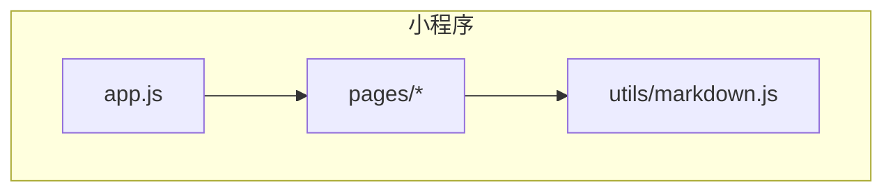
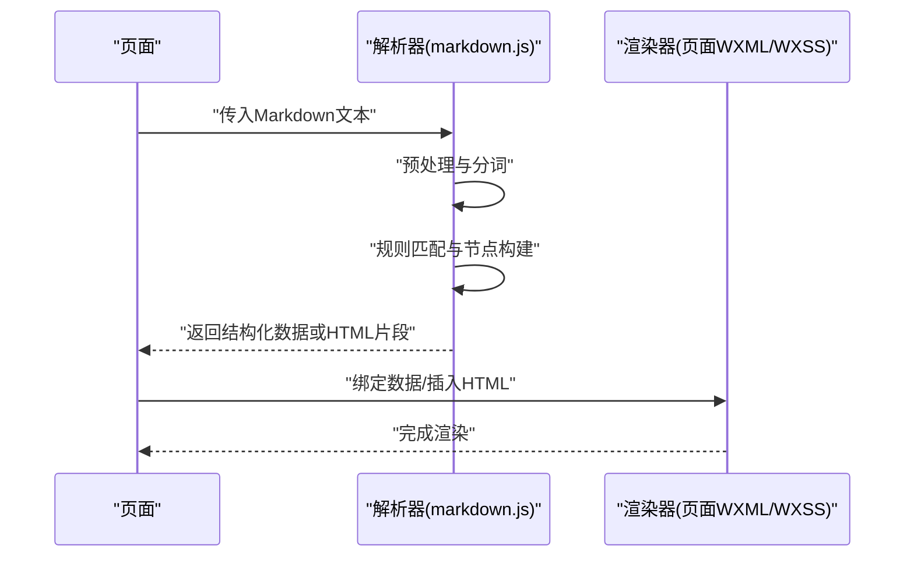
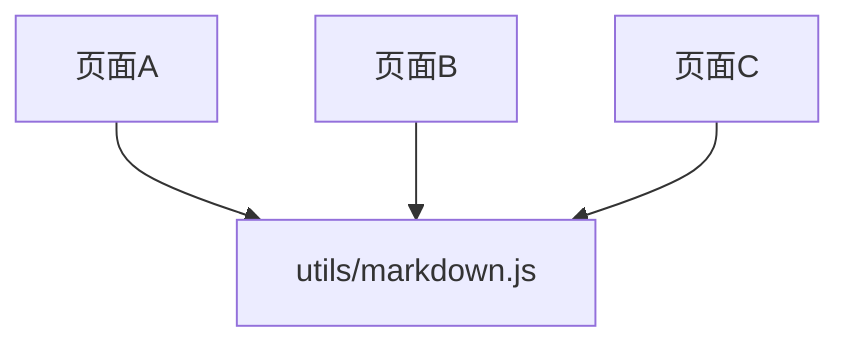

# Markdown解析器

<cite>
**本文引用的文件**   
- [markdown.js](file://miniprogram/utils/markdown.js)
</cite>

## 目录
1. [简介](#简介)
2. [项目结构](#项目结构)
3. [核心组件](#核心组件)
4. [架构总览](#架构总览)
5. [详细组件分析](#详细组件分析)
6. [依赖分析](#依赖分析)
7. [性能考虑](#性能考虑)
8. [故障排查指南](#故障排查指南)
9. [结论](#结论)
10. [附录](#附录)

## 简介
本仓库包含一个面向微信小程序的Markdown解析与渲染方案，核心实现位于小程序工具模块中。该解析器负责将Markdown文本转换为小程序可渲染的结构或HTML片段，并支持常见的文本格式化、链接处理、图片展示等能力。文档将围绕其功能范围、语法支持、渲染规则、API接口、配置项、使用示例以及扩展机制进行说明，并结合生物学科常见内容（如化学方程式、生物图表）给出适配建议。

## 项目结构
本项目为微信小程序工程，Markdown解析逻辑集中在小程序工具目录下的单一文件中，便于在多个页面复用。整体结构如下：
- 小程序入口与页面：miniprogram/pages/*
- 公共样式与资源：miniprogram/app.*、miniprogram/images/*
- 工具库：miniprogram/utils/markdown.js（解析与渲染核心）
- 云函数：cloudfunctions/*（与解析器无直接耦合）

图示来源
- [markdown.js](file://miniprogram/utils/markdown.js)

章节来源
- [markdown.js](file://miniprogram/utils/markdown.js)

## 核心组件
- 解析器入口：提供统一的解析方法，接收原始Markdown字符串，返回可用于渲染的数据结构或HTML片段。
- 文本格式化：支持标题、段落、粗体、斜体、列表、引用、分割线等基础语法。
- 代码块与行内代码：识别代码块与行内代码，提供可选的高亮策略（例如按语言分类）。
- 链接与图片：转换相对/绝对链接与图片路径，适配小程序环境。
- 生物学科增强：对化学方程式、生物图表等提供占位符或自定义节点，以便后续渲染。

章节来源
- [markdown.js](file://miniprogram/utils/markdown.js)

## 架构总览
解析流程从页面调用工具方法开始，进入解析器执行分词与规则匹配，生成中间AST或HTML片段，再由页面层进行渲染。

图示来源
- [markdown.js](file://miniprogram/utils/markdown.js)

## 详细组件分析

### 解析器API与配置
- API方法
  - parse(markdown, options?)：将Markdown文本解析为可渲染结果。
  - render(nodeOrHtml, options?)：将解析结果或HTML片段渲染到目标容器。
- 配置选项
  - enableHighlight：是否启用代码高亮。
  - codeLangClassPrefix：代码语言类名前缀。
  - imageBasePath：图片基础路径，用于相对路径拼接。
  - linkTarget：链接打开策略（当前页/新窗口/小程序跳转）。
  - customRules：自定义规则集合，用于扩展解析行为。
  - bioExtensions：生物学科扩展开关（如化学方程式、生物图表）。
- 返回值
  - 结构化节点树（推荐）或HTML片段（兼容模式）。

章节来源
- [markdown.js](file://miniprogram/utils/markdown.js)

### 文本格式化与语法支持
- 标题：支持多级标题，映射为对应层级标签。
- 段落与换行：自动识别段落边界与换行。
- 强调：粗体、斜体、删除线。
- 列表：有序与无序列表，支持嵌套。
- 引用与分割线：引用块与水平分割线。
- 表格：基础表格解析与样式化。

章节来源
- [markdown.js](file://miniprogram/utils/markdown.js)

### 代码高亮与行内代码
- 代码块：通过语言标识选择高亮策略；若无高亮库，则降级为纯文本。
- 行内代码：包裹为行内元素，保持样式一致。
- 高亮策略：可按语言前缀添加类名，交由WXSS控制外观。

章节来源
- [markdown.js](file://miniprogram/utils/markdown.js)

### 图片处理与链接转换
- 图片：支持相对路径与绝对URL；可配置基础路径以统一资源定位。
- 链接：根据linkTarget策略决定跳转方式；外部链接在新窗口打开，内部链接走小程序路由。
- 安全过滤：对协议与域名进行白名单校验，防止不安全跳转。

章节来源
- [markdown.js](file://miniprogram/utils/markdown.js)

### 生物学科特有内容格式
- 化学方程式
  - 输入形式：使用特定占位符或自定义语法标记。
  - 解析策略：识别占位符并生成专用节点，保留原始表达式供渲染器处理。
  - 渲染策略：在小程序端使用数学公式渲染组件或SVG绘制。
- 生物图表
  - 输入形式：通过图片链接或Mermaid/PlantUML占位符。
  - 解析策略：提取图表源地址或源码，生成图表节点。
  - 渲染策略：调用小程序图表组件或在线渲染服务，返回可交互图表。

章节来源
- [markdown.js](file://miniprogram/utils/markdown.js)

### 错误处理与兼容性
- 异常捕获：对非法Markdown或未知语法进行容错处理，避免崩溃。
- 降级策略：当高亮或图表渲染不可用时，回退为文本或静态图片。
- 兼容性：确保在不同微信版本与设备上的稳定表现。

章节来源
- [markdown.js](file://miniprogram/utils/markdown.js)

### 扩展解析规则与自定义渲染
- 自定义规则
  - 新增规则类型：定义正则或状态机匹配模式。
  - 节点映射：将匹配到的内容映射为自定义节点。
  - 渲染钩子：在渲染阶段注入自定义逻辑。
- 插件机制
  - 注册插件：集中管理扩展规则与渲染器。
  - 优先级控制：解决规则冲突与覆盖顺序。
- 最佳实践
  - 规则粒度：尽量细粒度，避免过度匹配。
  - 性能优化：缓存高频规则与结果。

章节来源
- [markdown.js](file://miniprogram/utils/markdown.js)

## 依赖分析
解析器为独立工具模块，被各页面按需引入，降低耦合度。

图示来源
- [markdown.js](file://miniprogram/utils/markdown.js)

章节来源
- [markdown.js](file://miniprogram/utils/markdown.js)

## 性能考虑
- 增量解析：对长文档采用分段解析与懒加载，减少首屏压力。
- 结果缓存：对相同输入进行缓存，避免重复计算。
- 规则优化：优先匹配高频规则，减少回溯。
- 渲染优化：批量更新DOM，避免频繁重排。
- 资源预取：图片与图表提前请求，提升加载速度。

[本节为通用指导，不直接分析具体文件]

## 故障排查指南
- 常见问题
  - 图片无法显示：检查imageBasePath与网络权限。
  - 链接跳转失败：确认linkTarget与小程序路由配置。
  - 代码高亮无效：确认enableHighlight与语言类名是否正确。
  - 生物图表不渲染：检查图表源地址或在线服务可用性。
- 调试建议
  - 输出中间AST：便于定位解析问题。
  - 打印规则匹配日志：辅助排查匹配顺序与冲突。
  - 使用小程序开发者工具的断点与网络面板。

章节来源
- [markdown.js](file://miniprogram/utils/markdown.js)

## 结论
本解析器以模块化设计为核心，提供灵活的API与配置项，满足通用Markdown渲染需求，并通过扩展机制支持生物学科特殊内容。建议在工程中统一接入解析器，结合页面渲染层实现一致的视觉体验与良好的性能表现。

[本节为总结性内容，不直接分析具体文件]

## 附录
- 使用示例
  - 基本解析：调用parse方法传入Markdown文本，获取结构化结果后在页面渲染。
  - 配置高亮：设置enableHighlight与codeLangClassPrefix，并在WXSS中定义样式。
  - 图片与链接：配置imageBasePath与linkTarget，确保资源与跳转正确。
  - 生物扩展：开启bioExtensions，使用占位符插入化学方程式与生物图表。
- 参考路径
  - 解析器实现：[markdown.js](file://miniprogram/utils/markdown.js)

章节来源
- [markdown.js](file://miniprogram/utils/markdown.js)