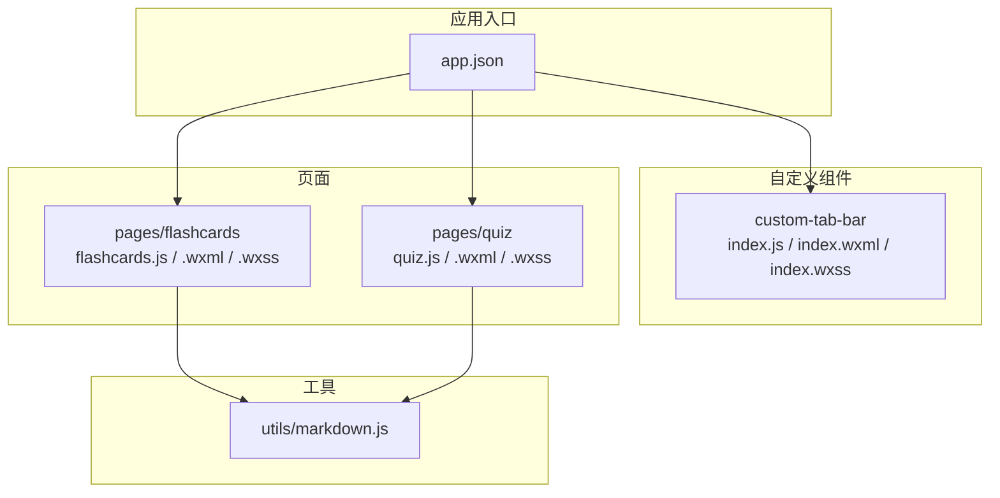
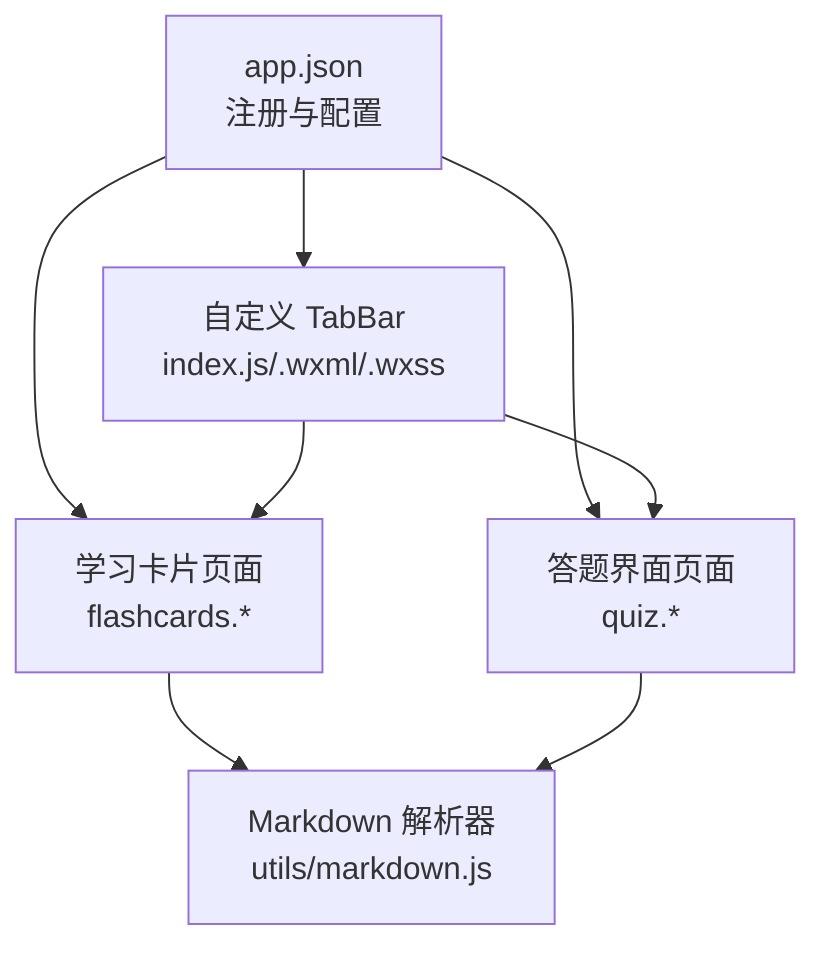
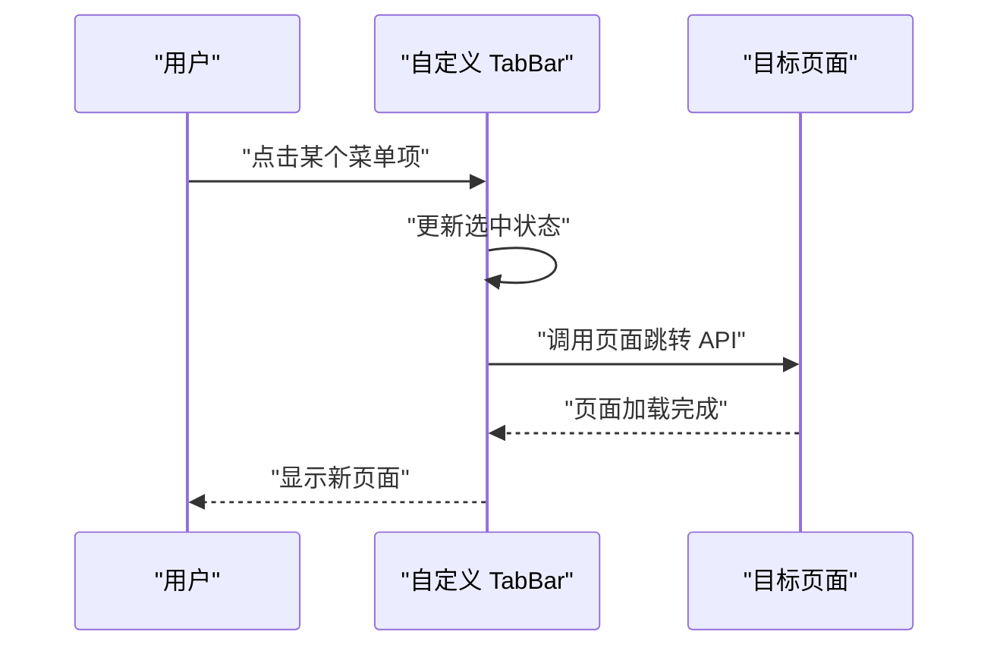
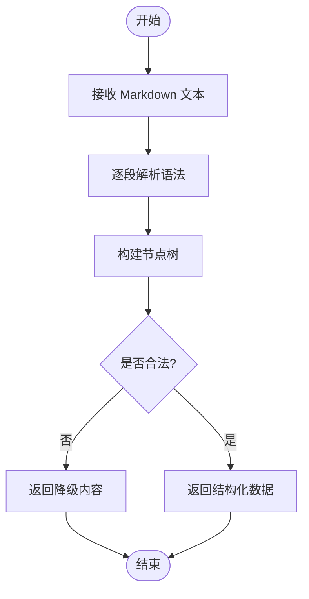
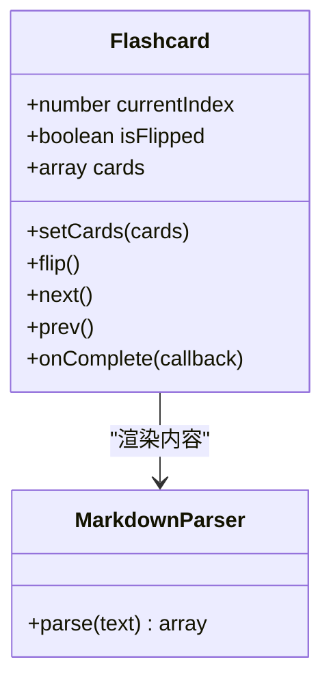
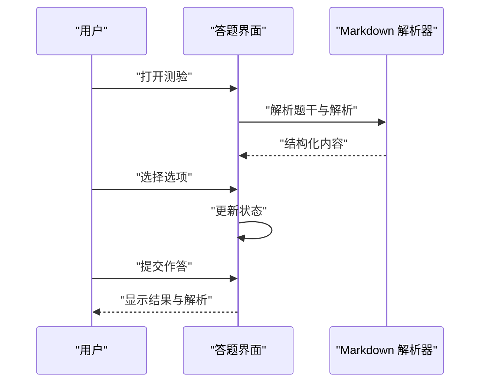
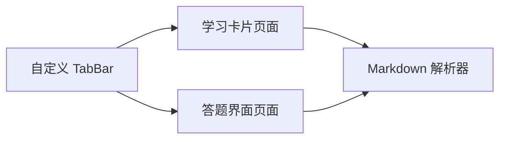

# UI组件库

<cite>
**本文引用的文件**   
- [app.json](file://miniprogram/app.json)
- [custom-tab-bar/index.js](file://miniprogram/custom-tab-bar/index.js)
- [custom-tab-bar/index.wxml](file://miniprogram/custom-tab-bar/index.wxml)
- [custom-tab-bar/index.wxss](file://miniprogram/custom-tab-bar/index.wxss)
- [markdown.js](file://miniprogram/utils/markdown.js)
- [flashcards/flashcards.js](file://miniprogram/pages/flashcards/flashcards.js)
- [flashcards/flashcards.wxml](file://miniprogram/pages/flashcards/flashcards.wxml)
- [flashcards/flashcards.wxss](file://miniprogram/pages/flashcards/flashcards.wxss)
- [quiz/quiz.js](file://miniprogram/pages/quiz/quiz.js)
- [quiz/quiz.wxml](file://miniprogram/pages/quiz/quiz.wxml)
- [quiz/quiz.wxss](file://miniprogram/pages/quiz/quiz.wxss)
</cite>

## 目录
1. [简介](#简介)
2. [项目结构](#项目结构)
3. [核心组件](#核心组件)
4. [架构总览](#架构总览)
5. [详细组件分析](#详细组件分析)
6. [依赖分析](#依赖分析)
7. [性能考虑](#性能考虑)
8. [故障排查指南](#故障排查指南)
9. [结论](#结论)
10. [附录](#附录)

## 简介
本文件为项目的UI组件库文档，聚焦于以下自定义组件与能力：
- 底部导航栏（自定义 TabBar）
- Markdown 解析器（工具模块）
- 学习卡片（闪卡）
- 答题界面（测验）

文档涵盖各组件的属性配置、事件处理、样式定制、响应式设计与无障碍支持建议、性能优化策略，并提供使用示例与最佳实践，帮助开发者在项目中复用和扩展这些组件，确保界面一致性与可维护性。

## 项目结构
本项目采用小程序工程结构，页面与组件位于 miniprogram 目录下。其中：
- 自定义底部导航栏位于 custom-tab-bar 目录
- Markdown 解析器位于 utils/markdown.js
- 学习卡片与答题界面分别位于 pages/flashcards 与 pages/quiz

图表来源
- [app.json](file://miniprogram/app.json)
- [custom-tab-bar/index.js](file://miniprogram/custom-tab-bar/index.js)
- [custom-tab-bar/index.wxml](file://miniprogram/custom-tab-bar/index.wxml)
- [custom-tab-bar/index.wxss](file://miniprogram/custom-tab-bar/index.wxss)
- [markdown.js](file://miniprogram/utils/markdown.js)
- [flashcards/flashcards.js](file://miniprogram/pages/flashcards/flashcards.js)
- [flashcards/flashcards.wxml](file://miniprogram/pages/flashcards/flashcards.wxml)
- [flashcards/flashcards.wxss](file://miniprogram/pages/flashcards/flashcards.wxss)
- [quiz/quiz.js](file://miniprogram/pages/quiz/quiz.js)
- [quiz/quiz.wxml](file://miniprogram/pages/quiz/quiz.wxml)
- [quiz/quiz.wxss](file://miniprogram/pages/quiz/quiz.wxss)

章节来源
- [app.json](file://miniprogram/app.json)
- [custom-tab-bar/index.js](file://miniprogram/custom-tab-bar/index.js)
- [custom-tab-bar/index.wxml](file://miniprogram/custom-tab-bar/index.wxml)
- [custom-tab-bar/index.wxss](file://miniprogram/custom-tab-bar/index.wxss)
- [markdown.js](file://miniprogram/utils/markdown.js)
- [flashcards/flashcards.js](file://miniprogram/pages/flashcards/flashcards.js)
- [flashcards/flashcards.wxml](file://miniprogram/pages/flashcards/flashcards.wxml)
- [flashcards/flashcards.wxss](file://miniprogram/pages/flashcards/flashcards.wxss)
- [quiz/quiz.js](file://miniprogram/pages/quiz/quiz.js)
- [quiz/quiz.wxml](file://miniprogram/pages/quiz/quiz.wxml)
- [quiz/quiz.wxss](file://miniprogram/pages/quiz/quiz.wxss)

## 核心组件
本节概述四大核心组件的职责与交互边界：
- 底部导航栏：负责全局页面切换与选中态管理，提供主题与图标等外观配置点
- Markdown 解析器：将 Markdown 文本转换为小程序可用的富文本节点或结构化数据
- 学习卡片：展示知识卡片，支持翻转、滑动、进度反馈等交互
- 答题界面：承载题目渲染、选项交互、提交与结果统计

章节来源
- [custom-tab-bar/index.js](file://miniprogram/custom-tab-bar/index.js)
- [custom-tab-bar/index.wxml](file://miniprogram/custom-tab-bar/index.wxml)
- [custom-tab-bar/index.wxss](file://miniprogram/custom-tab-bar/index.wxss)
- [markdown.js](file://miniprogram/utils/markdown.js)
- [flashcards/flashcards.js](file://miniprogram/pages/flashcards/flashcards.js)
- [flashcards/flashcards.wxml](file://miniprogram/pages/flashcards/flashcards.wxml)
- [flashcards/flashcards.wxss](file://miniprogram/pages/flashcards/flashcards.wxss)
- [quiz/quiz.js](file://miniprogram/pages/quiz/quiz.js)
- [quiz/quiz.wxml](file://miniprogram/pages/quiz/quiz.wxml)
- [quiz/quiz.wxss](file://miniprogram/pages/quiz/quiz.wxss)

## 架构总览
下图展示了组件间的调用关系与数据流向：页面通过 app.json 注册并引入自定义 TabBar；学习卡片与答题界面均依赖 Markdown 解析器进行内容渲染；TabBar 作为全局导航协调页面跳转。

图表来源
- [app.json](file://miniprogram/app.json)
- [custom-tab-bar/index.js](file://miniprogram/custom-tab-bar/index.js)
- [custom-tab-bar/index.wxml](file://miniprogram/custom-tab-bar/index.wxml)
- [custom-tab-bar/index.wxss](file://miniprogram/custom-tab-bar/index.wxss)
- [flashcards/flashcards.js](file://miniprogram/pages/flashcards/flashcards.js)
- [flashcards/flashcards.wxml](file://miniprogram/pages/flashcards/flashcards.wxml)
- [quiz/quiz.js](file://miniprogram/pages/quiz/quiz.js)
- [quiz/quiz.wxml](file://miniprogram/pages/quiz/quiz.wxml)
- [markdown.js](file://miniprogram/utils/markdown.js)

## 详细组件分析

### 底部导航栏（自定义 TabBar）
- 职责
  - 管理当前选中页签
  - 触发页面切换
  - 提供主题与图标等外观配置
- 关键实现要点
  - 通过 app.json 启用自定义 TabBar
  - 在组件内部维护选中状态与菜单项列表
  - 根据选中状态更新样式与图标
- 属性与配置
  - 菜单项列表：包含标签文案、图标路径、目标页面路径等
  - 主题色与激活态颜色：用于高亮当前页签
  - 图标尺寸与间距：控制视觉密度
- 事件处理
  - 点击菜单项时触发页面跳转
  - 监听外部状态变化以同步选中态
- 样式定制
  - 背景色、分割线、阴影、圆角等
  - 适配不同屏幕宽度与高度
- 响应式设计
  - 使用相对单位与媒体查询适配多设备
  - 图标与文字在不同字号下的可读性保障
- 无障碍支持
  - 为每个按钮设置 aria-label 或 role
  - 键盘可达性与焦点顺序合理
- 性能优化
  - 避免频繁 setData，合并状态更新
  - 图标资源按需加载与缓存
- 使用示例与最佳实践
  - 在 app.json 中正确声明自定义 TabBar 的根节点与清单
  - 将菜单项集中配置，便于统一维护
  - 对长文案做截断或换行处理，保证布局稳定

图表来源
- [custom-tab-bar/index.js](file://miniprogram/custom-tab-bar/index.js)
- [custom-tab-bar/index.wxml](file://miniprogram/custom-tab-bar/index.wxml)
- [custom-tab-bar/index.wxss](file://miniprogram/custom-tab-bar/index.wxss)
- [app.json](file://miniprogram/app.json)

章节来源
- [custom-tab-bar/index.js](file://miniprogram/custom-tab-bar/index.js)
- [custom-tab-bar/index.wxml](file://miniprogram/custom-tab-bar/index.wxml)
- [custom-tab-bar/index.wxss](file://miniprogram/custom-tab-bar/index.wxss)
- [app.json](file://miniprogram/app.json)

### Markdown 解析器（工具模块）
- 职责
  - 将 Markdown 文本解析为小程序可用的富文本节点或结构化数据
- 关键实现要点
  - 识别标题、段落、列表、链接、图片等语法
  - 输出符合小程序渲染的数据结构
- 接口约定
  - 输入：Markdown 字符串
  - 输出：节点数组或树形结构，供视图层直接渲染
- 错误处理
  - 对非法或不支持的语法给出降级方案（如保留原始文本）
  - 记录解析异常以便定位问题
- 性能优化
  - 对重复内容进行缓存
  - 分块解析大文档，避免主线程阻塞
- 使用示例与最佳实践
  - 在页面初始化时预解析常用模板
  - 对动态内容增量解析，减少一次性计算量
  - 结合安全过滤，防止注入风险

图表来源
- [markdown.js](file://miniprogram/utils/markdown.js)

章节来源
- [markdown.js](file://miniprogram/utils/markdown.js)

### 学习卡片（闪卡）
- 职责
  - 展示知识点卡片，支持翻转、滑动翻页、进度提示
- 关键实现要点
  - 维护当前索引、翻转状态、动画过渡
  - 与 Markdown 解析器协作渲染卡片内容
- 属性与配置
  - 卡片数据源：题面、答案、元信息（难度、标签等）
  - 动画时长与缓动函数
  - 是否允许手势操作
- 事件处理
  - 翻转事件：切换正反面
  - 翻页事件：前进/后退
  - 完成事件：通知父级更新进度
- 样式定制
  - 卡片尺寸、圆角、阴影、背景渐变
  - 正反面差异化样式
- 响应式设计
  - 基于视口自适应卡片宽高
  - 在小屏设备上优化触控区域
- 无障碍支持
  - 为翻转按钮添加语义化标签
  - 朗读模式下的内容顺序与描述
- 性能优化
  - 使用 transform 与 opacity 提升动画性能
  - 预加载下一张卡片数据
- 使用示例与最佳实践
  - 将卡片数据与视图分离，便于测试与复用
  - 对长文本进行分页或折叠展示
  - 结合本地缓存减少网络请求

图表来源
- [flashcards/flashcards.js](file://miniprogram/pages/flashcards/flashcards.js)
- [flashcards/flashcards.wxml](file://miniprogram/pages/flashcards/flashcards.wxml)
- [flashcards/flashcards.wxss](file://miniprogram/pages/flashcards/flashcards.wxss)
- [markdown.js](file://miniprogram/utils/markdown.js)

章节来源
- [flashcards/flashcards.js](file://miniprogram/pages/flashcards/flashcards.js)
- [flashcards/flashcards.wxml](file://miniprogram/pages/flashcards/flashcards.wxml)
- [flashcards/flashcards.wxss](file://miniprogram/pages/flashcards/flashcards.wxss)
- [markdown.js](file://miniprogram/utils/markdown.js)

### 答题界面（测验）
- 职责
  - 渲染题目与选项，收集用户作答，提交并统计结果
- 关键实现要点
  - 维护题目列表、当前题号、已选答案、计时器等
  - 与 Markdown 解析器协作渲染题干与解析
- 属性与配置
  - 题目数据结构：题干、选项、正确答案、解析
  - 交卷方式：即时提交或批量提交
  - 是否显示倒计时与提示
- 事件处理
  - 选择选项：更新状态并校验合法性
  - 提交作答：汇总结果并回调
  - 退出/暂停：保存进度
- 样式定制
  - 选项样式（单选/多选）、正确/错误反馈色
  - 进度条与得分展示
- 响应式设计
  - 在大屏上横向排列选项，小屏纵向堆叠
  - 触控热区与字体大小适配
- 无障碍支持
  - 为选项组设置 role 与 aria-checked
  - 读屏模式下清晰播报题目与选项
- 性能优化
  - 延迟渲染非当前题目
  - 对大量题目进行分页加载
- 使用示例与最佳实践
  - 将题目数据与逻辑解耦，便于单元测试
  - 对提交结果进行幂等处理，防止重复提交
  - 结合本地存储恢复未完成的测验

图表来源
- [quiz/quiz.js](file://miniprogram/pages/quiz/quiz.js)
- [quiz/quiz.wxml](file://miniprogram/pages/quiz/quiz.wxml)
- [quiz/quiz.wxss](file://miniprogram/pages/quiz/quiz.wxss)
- [markdown.js](file://miniprogram/utils/markdown.js)

章节来源
- [quiz/quiz.js](file://miniprogram/pages/quiz/quiz.js)
- [quiz/quiz.wxml](file://miniprogram/pages/quiz/quiz.wxml)
- [quiz/quiz.wxss](file://miniprogram/pages/quiz/quiz.wxss)
- [markdown.js](file://miniprogram/utils/markdown.js)

## 依赖分析
- 组件耦合
  - 学习卡片与答题界面均依赖 Markdown 解析器，形成“页面→工具”的单向依赖
  - 自定义 TabBar 与页面之间通过路由机制通信，保持松耦合
- 外部依赖
  - 小程序原生 API（页面跳转、setData、动画等）
  - 可选的网络请求与本地存储用于数据持久化
- 潜在循环依赖
  - 当前结构中未发现循环引用，页面与工具模块职责清晰

图表来源
- [custom-tab-bar/index.js](file://miniprogram/custom-tab-bar/index.js)
- [flashcards/flashcards.js](file://miniprogram/pages/flashcards/flashcards.js)
- [quiz/quiz.js](file://miniprogram/pages/quiz/quiz.js)
- [markdown.js](file://miniprogram/utils/markdown.js)

章节来源
- [custom-tab-bar/index.js](file://miniprogram/custom-tab-bar/index.js)
- [flashcards/flashcards.js](file://miniprogram/pages/flashcards/flashcards.js)
- [quiz/quiz.js](file://miniprogram/pages/quiz/quiz.js)
- [markdown.js](file://miniprogram/utils/markdown.js)

## 性能考虑
- 渲染优化
  - 使用 transform 与 opacity 进行动画，避免重排重绘
  - 对长列表与大图进行懒加载与压缩
- 数据更新
  - 合并多次 setData 调用，减少通信开销
  - 对静态内容使用常量或缓存
- 解析优化
  - 对 Markdown 解析结果进行缓存，避免重复计算
  - 对超大文档进行分片解析与增量渲染
- 内存管理
  - 及时释放不再使用的对象与定时器
  - 避免闭包持有过大引用导致泄漏

[本节为通用指导，不直接分析具体文件]

## 故障排查指南
- 自定义 TabBar 无法显示
  - 检查 app.json 是否正确启用自定义 TabBar 并配置根节点与清单
  - 确认菜单项路径与页面路径一致
- Markdown 解析异常
  - 查看解析器对不支持语法的降级处理
  - 对输入文本进行最小复现，定位非法字符或嵌套层级过深
- 学习卡片动画卡顿
  - 检查是否使用了昂贵的布局属性
  - 确认是否预加载了下一张卡片数据
- 答题界面提交失败
  - 检查提交前的数据完整性与幂等保护
  - 查看网络请求与本地存储的错误日志

章节来源
- [app.json](file://miniprogram/app.json)
- [custom-tab-bar/index.js](file://miniprogram/custom-tab-bar/index.js)
- [markdown.js](file://miniprogram/utils/markdown.js)
- [flashcards/flashcards.js](file://miniprogram/pages/flashcards/flashcards.js)
- [quiz/quiz.js](file://miniprogram/pages/quiz/quiz.js)

## 结论
本组件库围绕底部导航栏、Markdown 解析器、学习卡片与答题界面四个核心能力展开，强调清晰的职责边界、良好的可扩展性与一致的交互体验。通过合理的属性配置、事件处理与样式定制，配合响应式设计与无障碍支持，可在多端设备上提供稳定且友好的用户体验。建议在团队内建立统一的组件规范与示例库，持续沉淀最佳实践，提升整体可维护性与开发效率。

[本节为总结性内容，不直接分析具体文件]

## 附录
- 术语说明
  - 自定义 TabBar：由开发者实现的底部导航栏组件
  - Markdown 解析器：将 Markdown 文本转换为小程序可用结构的工具
  - 学习卡片：用于复习与记忆的知识卡片组件
  - 答题界面：承载测验流程与结果展示的页面
- 参考路径
  - 底部导航栏：[custom-tab-bar/index.js](file://miniprogram/custom-tab-bar/index.js)、[custom-tab-bar/index.wxml](file://miniprogram/custom-tab-bar/index.wxml)、[custom-tab-bar/index.wxss](file://miniprogram/custom-tab-bar/index.wxss)
  - Markdown 解析器：[markdown.js](file://miniprogram/utils/markdown.js)
  - 学习卡片：[flashcards/flashcards.js](file://miniprogram/pages/flashcards/flashcards.js)、[flashcards/flashcards.wxml](file://miniprogram/pages/flashcards/flashcards.wxml)、[flashcards/flashcards.wxss](file://miniprogram/pages/flashcards/flashcards.wxss)
  - 答题界面：[quiz/quiz.js](file://miniprogram/pages/quiz/quiz.js)、[quiz/quiz.wxml](file://miniprogram/pages/quiz/quiz.wxml)、[quiz/quiz.wxss](file://miniprogram/pages/quiz/quiz.wxss)