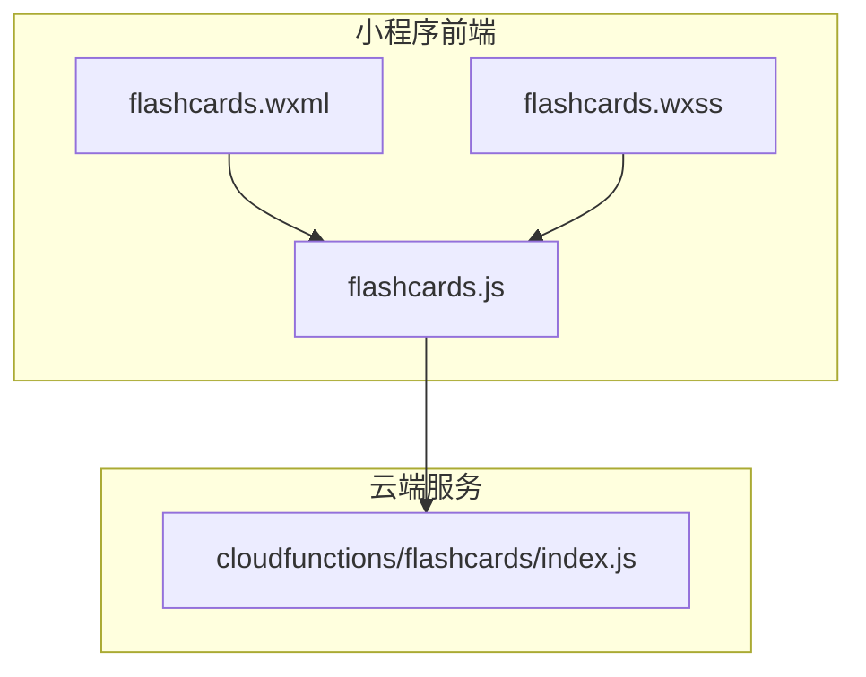
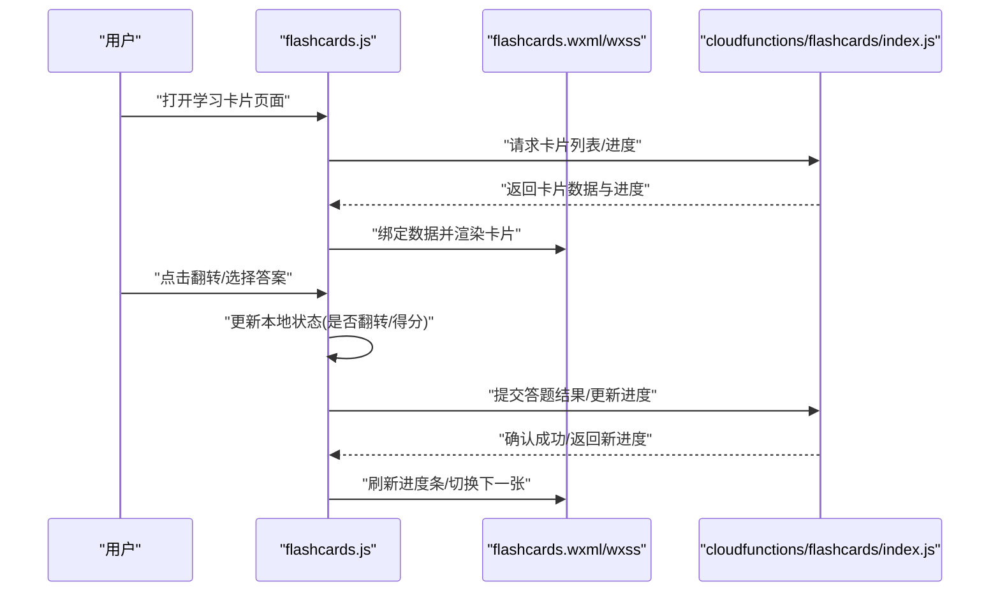
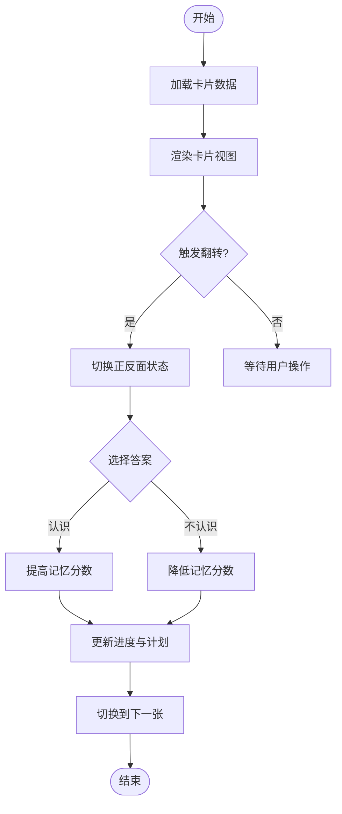
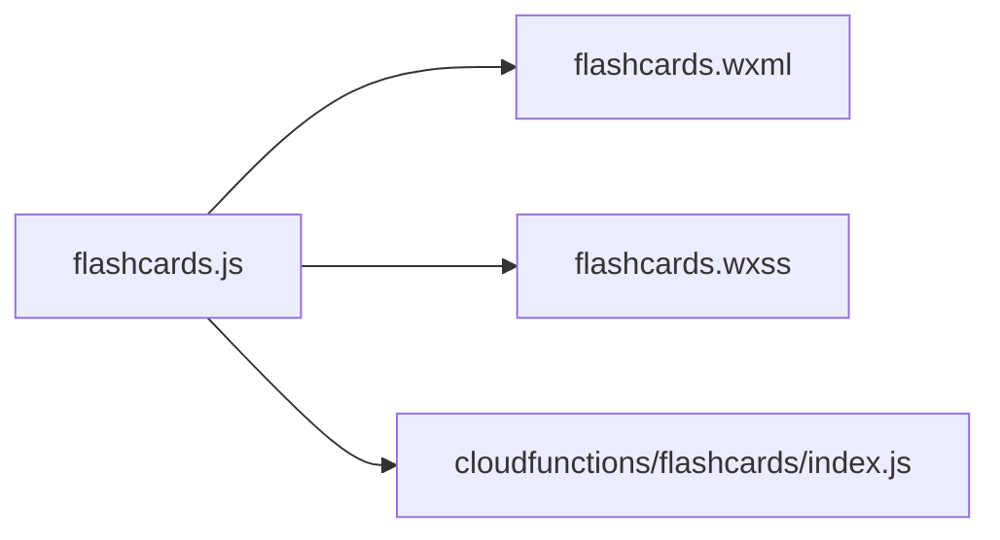

# 学习卡片组件

<cite>
**本文引用的文件**   
- [miniprogram/pages/flashcards/flashcards.js](file://miniprogram/pages/flashcards/flashcards.js)
- [miniprogram/pages/flashcards/flashcards.wxml](file://miniprogram/pages/flashcards/flashcards.wxml)
- [miniprogram/pages/flashcards/flashcards.wxss](file://miniprogram/pages/flashcards/flashcards.wxss)
- [cloudfunctions/flashcards/index.js](file://cloudfunctions/flashcards/index.js)
</cite>

## 目录
1. [简介](#简介)
2. [项目结构](#项目结构)
3. [核心组件](#核心组件)
4. [架构总览](#架构总览)
5. [详细组件分析](#详细组件分析)
6. [依赖关系分析](#依赖关系分析)
7. [性能与体验优化](#性能与体验优化)
8. [故障排查指南](#故障排查指南)
9. [结论](#结论)
10. [附录：扩展与定制](#附录扩展与定制)

## 简介
本文件围绕“学习卡片”功能，系统梳理其展示模式、翻转动画、交互逻辑、数据绑定、进度跟踪与记忆算法集成方式，并提供属性配置、事件处理、样式定制以及多内容类型（文字、图片、视频）的展示方案。同时给出动画性能优化、内存管理与用户体验改进的最佳实践，并指导如何自定义卡片模板与数据接口以适配不同业务场景。

## 项目结构
学习卡片相关的前端页面位于小程序 pages/flashcards 目录，后端云函数位于 cloudfunctions/flashcards。整体采用前后端分离的轻量架构：前端负责渲染、交互与本地状态管理，后端提供卡片列表、答题结果上报与进度同步等能力。

图表来源
- [miniprogram/pages/flashcards/flashcards.js](file://miniprogram/pages/flashcards/flashcards.js)
- [miniprogram/pages/flashcards/flashcards.wxml](file://miniprogram/pages/flashcards/flashcards.wxml)
- [miniprogram/pages/flashcards/flashcards.wxss](file://miniprogram/pages/flashcards/flashcards.wxss)
- [cloudfunctions/flashcards/index.js](file://cloudfunctions/flashcards/index.js)

章节来源
- [miniprogram/pages/flashcards/flashcards.js](file://miniprogram/pages/flashcards/flashcards.js)
- [miniprogram/pages/flashcards/flashcards.wxml](file://miniprogram/pages/flashcards/flashcards.wxml)
- [miniprogram/pages/flashcards/flashcards.wxss](file://miniprogram/pages/flashcards/flashcards.wxss)
- [cloudfunctions/flashcards/index.js](file://cloudfunctions/flashcards/index.js)

## 核心组件
- 卡片容器：承载正面与背面的布局容器，支持点击或滑动触发翻转。
- 正面视图：显示题目/提示内容，可包含文本、图片、音频或视频封面。
- 背面视图：显示答案/解析，支持富文本、图片、视频播放入口。
- 进度条：展示当前卡片序号与总量，支持跳转与刷新。
- 操作按钮：如“认识/不认识”、“下一张”、“收藏/错题本”等。
- 动画层：通过 CSS transform 实现 3D 翻转效果。

章节来源
- [miniprogram/pages/flashcards/flashcards.wxml](file://miniprogram/pages/flashcards/flashcards.wxml)
- [miniprogram/pages/flashcards/flashcards.wxss](file://miniprogram/pages/flashcards/flashcards.wxss)

## 架构总览
学习卡片的数据流遵循“加载 → 渲染 → 交互 → 上报 → 更新”的闭环。前端在页面初始化时请求云函数获取卡片队列；用户交互后记录本地状态并上报结果；云函数持久化进度与记忆分数；前端根据返回结果更新 UI 与进度。

图表来源
- [miniprogram/pages/flashcards/flashcards.js](file://miniprogram/pages/flashcards/flashcards.js)
- [miniprogram/pages/flashcards/flashcards.wxml](file://miniprogram/pages/flashcards/flashcards.wxml)
- [miniprogram/pages/flashcards/flashcards.wxss](file://miniprogram/pages/flashcards/flashcards.wxss)
- [cloudfunctions/flashcards/index.js](file://cloudfunctions/flashcards/index.js)

## 详细组件分析

### 展示模式与布局
- 单卡模式：一次仅展示一张卡片，适合专注记忆。
- 列表模式：批量预览，便于快速浏览与筛选。
- 混合模式：默认单卡，支持从列表快速进入单卡复习。

章节来源
- [miniprogram/pages/flashcards/flashcards.wxml](file://miniprogram/pages/flashcards/flashcards.wxml)
- [miniprogram/pages/flashcards/flashcards.wxss](file://miniprogram/pages/flashcards/flashcards.wxss)

### 翻转动画效果
- 使用 3D 变换实现正反面切换，正面与背面分别置于同一容器内，通过类名控制旋转角度。
- 建议开启硬件加速以提升流畅度，避免在动画期间进行重排重绘。
- 动画时长与缓动曲线可按主题配置，保证一致的用户体验。

章节来源
- [miniprogram/pages/flashcards/flashcards.wxss](file://miniprogram/pages/flashcards/flashcards.wxss)

### 交互逻辑
- 点击卡片区域触发翻转；左右滑动可切换上一张/下一张。
- 底部操作区提供“认识/不认识”反馈，用于记忆算法评分。
- 进度条点击可跳转到指定卡片；支持键盘快捷键（桌面调试）。

章节来源
- [miniprogram/pages/flashcards/flashcards.js](file://miniprogram/pages/flashcards/flashcards.js)
- [miniprogram/pages/flashcards/flashcards.wxml](file://miniprogram/pages/flashcards/flashcards.wxml)

### 数据绑定与渲染
- 卡片数据模型包含：ID、题型、正反面内容、媒体资源、难度、标签、上次复习时间、记忆分数等。
- 页面初始化时从云函数拉取数据，并在本地维护当前索引、翻转状态、已答集合。
- 渲染层通过数据驱动更新视图，避免直接操作 DOM。

章节来源
- [miniprogram/pages/flashcards/flashcards.js](file://miniprogram/pages/flashcards/flashcards.js)
- [miniprogram/pages/flashcards/flashcards.wxml](file://miniprogram/pages/flashcards/flashcards.wxml)

### 进度跟踪机制
- 本地缓存：记录当前索引、已答集合、本次会话得分，提升离线可用性。
- 云端同步：每次答题后上报结果，服务端累计正确率、间隔复习次数与下次复习时间。
- 进度可视化：顶部进度条显示完成百分比，支持点击跳转。

章节来源
- [miniprogram/pages/flashcards/flashcards.js](file://miniprogram/pages/flashcards/flashcards.js)
- [cloudfunctions/flashcards/index.js](file://cloudfunctions/flashcards/index.js)

### 记忆算法集成
- 基于间隔重复策略，结合用户反馈（认识/不认识）动态调整下次复习间隔。
- 关键参数：难度系数、记忆强度、遗忘曲线衰减因子、最小/最大间隔限制。
- 服务端计算：根据历史表现与全局策略生成下一次复习计划，前端按队列顺序呈现。

章节来源
- [cloudfunctions/flashcards/index.js](file://cloudfunctions/flashcards/index.js)
- [miniprogram/pages/flashcards/flashcards.js](file://miniprogram/pages/flashcards/flashcards.js)

### 属性配置与事件处理
- 属性配置项（示例）：
  - showProgress：是否显示进度条
  - autoFlip：是否自动翻转
  - flipDuration：翻转动画时长
  - swipeEnabled：是否启用滑动切换
  - theme：主题色与字体大小
- 事件回调：
  - onFlip：翻转事件
  - onNext/onPrev：切换卡片
  - onAnswer：回答反馈（认识/不认识）
  - onProgressChange：进度变化

章节来源
- [miniprogram/pages/flashcards/flashcards.js](file://miniprogram/pages/flashcards/flashcards.js)
- [miniprogram/pages/flashcards/flashcards.wxml](file://miniprogram/pages/flashcards/flashcards.wxml)

### 样式定制方法
- 通过 wxss 覆盖容器、正反面、进度条、按钮等样式变量。
- 支持主题切换：主色、背景、字体、圆角、阴影等。
- 响应式适配：在不同屏幕尺寸下调整字号与间距。

章节来源
- [miniprogram/pages/flashcards/flashcards.wxss](file://miniprogram/pages/flashcards/flashcards.wxss)

### 多内容类型展示
- 文字：支持富文本与行高、段落间距配置。
- 图片：懒加载与占位图，支持缩放与长按保存。
- 视频：封面图+播放入口，播放时暂停其他媒体，避免并发占用。
- 音频：播放控件与波形进度条（可选）。

章节来源
- [miniprogram/pages/flashcards/flashcards.wxml](file://miniprogram/pages/flashcards/flashcards.wxml)
- [miniprogram/pages/flashcards/flashcards.wxss](file://miniprogram/pages/flashcards/flashcards.wxss)

#### 流程图：翻转与答题流程

图表来源
- [miniprogram/pages/flashcards/flashcards.js](file://miniprogram/pages/flashcards/flashcards.js)
- [cloudfunctions/flashcards/index.js](file://cloudfunctions/flashcards/index.js)

## 依赖关系分析
- 前端依赖：
  - 页面逻辑：flashcards.js
  - 视图模板：flashcards.wxml
  - 样式定义：flashcards.wxss
- 后端依赖：
  - 云函数：cloudfunctions/flashcards/index.js
- 外部依赖：
  - 网络请求与云开发 API（由小程序框架提供）
  - 媒体播放器（图片/视频/音频）

图表来源
- [miniprogram/pages/flashcards/flashcards.js](file://miniprogram/pages/flashcards/flashcards.js)
- [miniprogram/pages/flashcards/flashcards.wxml](file://miniprogram/pages/flashcards/flashcards.wxml)
- [miniprogram/pages/flashcards/flashcards.wxss](file://miniprogram/pages/flashcards/flashcards.wxss)
- [cloudfunctions/flashcards/index.js](file://cloudfunctions/flashcards/index.js)

章节来源
- [miniprogram/pages/flashcards/flashcards.js](file://miniprogram/pages/flashcards/flashcards.js)
- [miniprogram/pages/flashcards/flashcards.wxml](file://miniprogram/pages/flashcards/flashcards.wxml)
- [miniprogram/pages/flashcards/flashcards.wxss](file://miniprogram/pages/flashcards/flashcards.wxss)
- [cloudfunctions/flashcards/index.js](file://cloudfunctions/flashcards/index.js)

## 性能与体验优化
- 动画性能
  - 使用 transform 与 opacity 进行动画，避免触发布局重排。
  - 合理设置 will-change 与 backface-visibility，减少 GPU 压力。
  - 控制动画时长与帧率，低端设备降级为简单过渡。
- 内存管理
  - 大图片与视频采用懒加载与缩略图，释放不可见资源的引用。
  - 及时解绑事件监听器，防止内存泄漏。
  - 分页加载卡片队列，避免一次性加载过多数据。
- 用户体验
  - 提供清晰的视觉反馈（翻转、选中、错误提示）。
  - 支持手势与键盘快捷操作，提升效率。
  - 弱网环境下显示骨架屏与重试机制。

[本节为通用指导，不直接分析具体文件]

## 故障排查指南
- 常见问题
  - 翻转卡顿：检查是否使用了影响布局的属性；确认动画属性与硬件加速。
  - 进度不同步：核对本地缓存与服务端返回的进度字段；确保上报接口调用成功。
  - 媒体无法加载：校验资源 URL 权限与格式；检查网络状态与代理设置。
- 定位步骤
  - 查看控制台日志与网络请求详情。
  - 复现路径：清空缓存 → 重新登录 → 重现问题 → 收集日志。
  - 对比不同设备与网络环境的表现差异。

章节来源
- [miniprogram/pages/flashcards/flashcards.js](file://miniprogram/pages/flashcards/flashcards.js)
- [cloudfunctions/flashcards/index.js](file://cloudfunctions/flashcards/index.js)

## 结论
学习卡片组件通过清晰的数据绑定与稳定的交互流程，实现了高效的记忆训练体验。借助间隔重复算法与云端同步，用户可获得个性化的复习计划。配合良好的动画性能与样式定制能力，该组件可在多种内容与设备上保持一致的高质量体验。

[本节为总结性内容，不直接分析具体文件]

## 附录：扩展与定制
- 自定义卡片模板
  - 在 wxml 中新增插槽或条件渲染分支，适配新的题型与布局。
  - 在 wxss 中定义主题变量，统一风格与可访问性。
- 数据接口扩展
  - 在云函数中增加新的字段与计算逻辑（如标签权重、知识点关联）。
  - 前端按需订阅增量数据，避免全量刷新。
- 记忆算法调优
  - 调整难度系数与遗忘曲线参数，平衡复习频率与记忆效果。
  - 引入 A/B 测试评估不同策略的学习成效。
- 多端适配
  - 针对平板与桌面端优化触控与键盘交互。
  - 提供无障碍支持（读屏、焦点管理）。

章节来源
- [miniprogram/pages/flashcards/flashcards.wxml](file://miniprogram/pages/flashcards/flashcards.wxml)
- [miniprogram/pages/flashcards/flashcards.wxss](file://miniprogram/pages/flashcards/flashcards.wxss)
- [miniprogram/pages/flashcards/flashcards.js](file://miniprogram/pages/flashcards/flashcards.js)
- [cloudfunctions/flashcards/index.js](file://cloudfunctions/flashcards/index.js)