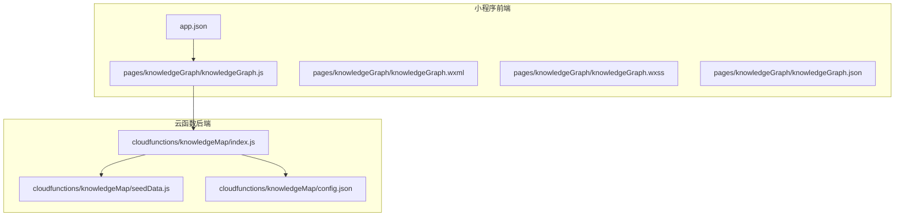
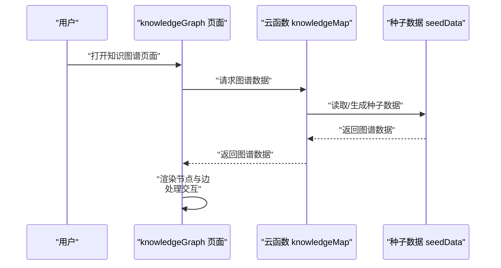
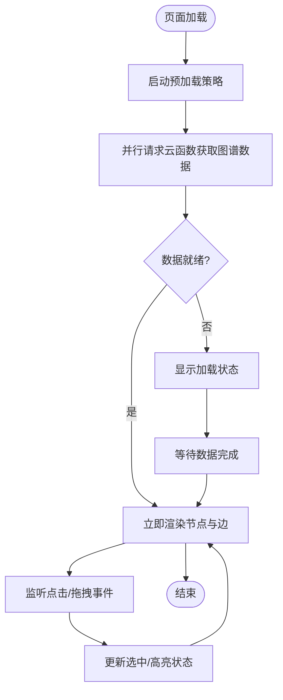
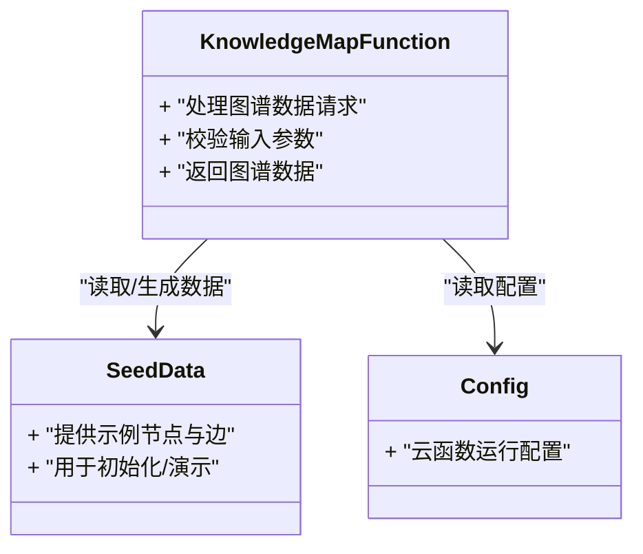
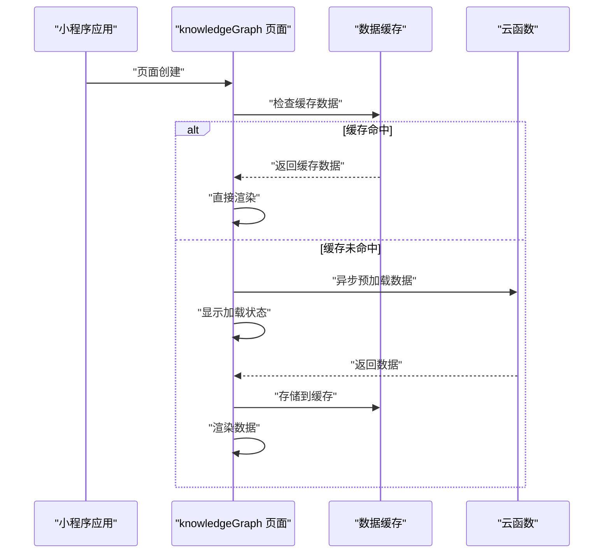
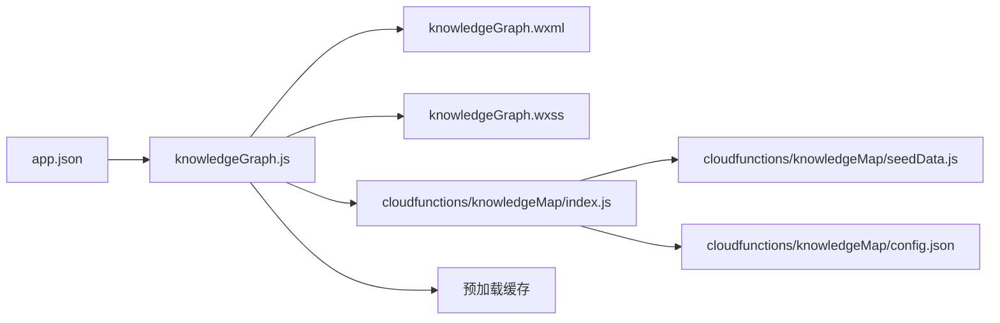

# 知识图谱可视化组件

<cite>
**本文引用的文件**   
- [knowledgeGraph.js](file://miniprogram/pages/knowledgeGraph/knowledgeGraph.js)
- [knowledgeGraph.wxml](file://miniprogram/pages/knowledgeGraph/knowledgeGraph.wxml)
- [knowledgeGraph.wxss](file://miniprogram/pages/knowledgeGraph/knowledgeGraph.wxss)
- [knowledgeGraph.json](file://miniprogram/pages/knowledgeGraph/knowledgeGraph.json)
- [index.js](file://cloudfunctions/knowledgeMap/index.js)
- [seedData.js](file://cloudfunctions/knowledgeMap/seedData.js)
- [config.json](file://cloudfunctions/knowledgeMap/config.json)
- [app.json](file://miniprogram/app.json)
</cite>

## 更新摘要
**变更内容**   
- 新增预加载策略章节，详细说明首次数据访问性能优化方案
- 增强前端调用流程分析，突出预加载机制的实现细节
- 更新用户体验改进说明，反映预加载对交互流畅性的提升
- 完善性能考虑章节，增加预加载相关的性能优化建议

## 目录
1. [简介](#简介)
2. [项目结构](#项目结构)
3. [核心组件](#核心组件)
4. [架构总览](#架构总览)
5. [详细组件分析](#详细组件分析)
6. [预加载策略](#预加载策略)
7. [依赖关系分析](#依赖关系分析)
8. [性能考虑](#性能考虑)
9. [故障排查指南](#故障排查指南)
10. [结论](#结论)
11. [附录](#附录)

## 简介
本仓库包含一个"知识图谱可视化"功能，由小程序前端页面与云函数后端组成。前端负责渲染节点与边、处理用户交互（点击、拖拽等），后端提供图谱数据接口与种子数据初始化能力。整体采用前后端分离的轻量架构：小程序通过云开发调用 cloudfunctions/knowledgeMap 提供的服务获取图谱数据，并在本地进行可视化展示。

**更新** 新增了预加载策略以改善首次数据访问性能，增强了前端调用流程和用户体验。

## 项目结构
围绕"知识图谱可视化"的关键文件分布如下：
- 小程序页面层：miniprogram/pages/knowledgeGraph/*
- 云函数层：cloudfunctions/knowledgeMap/*
- 应用配置：miniprogram/app.json（注册页面路由）

图表来源
- [app.json](file://miniprogram/app.json)
- [knowledgeGraph.js](file://miniprogram/pages/knowledgeGraph/knowledgeGraph.js)
- [index.js](file://cloudfunctions/knowledgeMap/index.js)
- [seedData.js](file://cloudfunctions/knowledgeMap/seedData.js)
- [config.json](file://cloudfunctions/knowledgeMap/config.json)

章节来源
- [app.json](file://miniprogram/app.json)
- [knowledgeGraph.js](file://miniprogram/pages/knowledgeGraph/knowledgeGraph.js)
- [knowledgeGraph.wxml](file://miniprogram/pages/knowledgeGraph/knowledgeGraph.wxml)
- [knowledgeGraph.wxss](file://miniprogram/pages/knowledgeGraph/knowledgeGraph.wxss)
- [knowledgeGraph.json](file://miniprogram/pages/knowledgeGraph/knowledgeGraph.json)
- [index.js](file://cloudfunctions/knowledgeMap/index.js)
- [seedData.js](file://cloudfunctions/knowledgeMap/seedData.js)
- [config.json](file://cloudfunctions/knowledgeMap/config.json)

## 核心组件
- 前端页面 knowledgeGraph
  - 职责：加载图谱数据、渲染节点与边、响应点击/拖拽等交互、管理选中状态与高亮逻辑。
  - 关键文件：
    - JS：[knowledgeGraph.js](file://miniprogram/pages/knowledgeGraph/knowledgeGraph.js)
    - WXML：[knowledgeGraph.wxml](file://miniprogram/pages/knowledgeGraph/knowledgeGraph.wxml)
    - WXSS：[knowledgeGraph.wxss](file://miniprogram/pages/knowledgeGraph/knowledgeGraph.wxss)
    - JSON：[knowledgeGraph.json](file://miniprogram/pages/knowledgeGraph/knowledgeGraph.json)
- 云函数 knowledgeMap
  - 职责：对外暴露图谱数据查询接口；支持使用种子数据进行初始化或演示。
  - 关键文件：
    - 入口：[index.js](file://cloudfunctions/knowledgeMap/index.js)
    - 种子数据：[seedData.js](file://cloudfunctions/knowledgeMap/seedData.js)
    - 配置：[config.json](file://cloudfunctions/knowledgeMap/config.json)

章节来源
- [knowledgeGraph.js](file://miniprogram/pages/knowledgeGraph/knowledgeGraph.js)
- [knowledgeGraph.wxml](file://miniprogram/pages/knowledgeGraph/knowledgeGraph.wxml)
- [knowledgeGraph.wxss](file://miniprogram/pages/knowledgeGraph/knowledgeGraph.wxss)
- [knowledgeGraph.json](file://miniprogram/pages/knowledgeGraph/knowledgeGraph.json)
- [index.js](file://cloudfunctions/knowledgeMap/index.js)
- [seedData.js](file://cloudfunctions/knowledgeMap/seedData.js)
- [config.json](file://cloudfunctions/knowledgeMap/config.json)

## 架构总览
下图展示了从页面到云函数的请求链路以及数据流向。

图表来源
- [knowledgeGraph.js](file://miniprogram/pages/knowledgeGraph/knowledgeGraph.js)
- [index.js](file://cloudfunctions/knowledgeMap/index.js)
- [seedData.js](file://cloudfunctions/knowledgeMap/seedData.js)

## 详细组件分析

### 前端页面：knowledgeGraph
- 页面生命周期与数据加载
  - 在页面初始化阶段发起对云函数的数据请求，接收图谱数据后进入渲染流程。
  - **更新** 现已集成预加载策略，在页面可见前就开始准备数据，显著减少首屏等待时间。
  - 典型路径参考：[knowledgeGraph.js](file://miniprogram/pages/knowledgeGraph/knowledgeGraph.js)
- 视图结构与样式
  - WXML 定义图谱容器与节点/边的模板占位；WXSS 控制布局与视觉表现。
  - 典型路径参考：
    - [knowledgeGraph.wxml](file://miniprogram/pages/knowledgeGraph/knowledgeGraph.wxml)
    - [knowledgeGraph.wxss](file://miniprogram/pages/knowledgeGraph/knowledgeGraph.wxss)
- 交互逻辑
  - 点击节点：触发选中态更新、高亮关联边与相邻节点。
  - 拖拽节点：更新节点坐标并同步重绘相关边。
  - **更新** 预加载机制确保交互响应更加流畅，减少因数据加载导致的卡顿。
  - 典型路径参考：[knowledgeGraph.js](file://miniprogram/pages/knowledgeGraph/knowledgeGraph.js)
- 页面配置
  - JSON 中可设置导航栏标题、是否启用下拉刷新等。
  - 典型路径参考：[knowledgeGraph.json](file://miniprogram/pages/knowledgeGraph/knowledgeGraph.json)

图表来源
- [knowledgeGraph.js](file://miniprogram/pages/knowledgeGraph/knowledgeGraph.js)
- [knowledgeGraph.wxml](file://miniprogram/pages/knowledgeGraph/knowledgeGraph.wxml)
- [knowledgeGraph.wxss](file://miniprogram/pages/knowledgeGraph/knowledgeGraph.wxss)
- [knowledgeGraph.json](file://miniprogram/pages/knowledgeGraph/knowledgeGraph.json)

章节来源
- [knowledgeGraph.js](file://miniprogram/pages/knowledgeGraph/knowledgeGraph.js)
- [knowledgeGraph.wxml](file://miniprogram/pages/knowledgeGraph/knowledgeGraph.wxml)
- [knowledgeGraph.wxss](file://miniprogram/pages/knowledgeGraph/knowledgeGraph.wxss)
- [knowledgeGraph.json](file://miniprogram/pages/knowledgeGraph/knowledgeGraph.json)

### 云函数：knowledgeMap
- 入口与路由
  - index.js 作为云函数入口，解析请求参数并分发到对应处理逻辑。
  - 典型路径参考：[index.js](file://cloudfunctions/knowledgeMap/index.js)
- 数据源与种子数据
  - seedData.js 提供示例/初始化的图谱数据，便于快速验证与演示。
  - 典型路径参考：[seedData.js](file://cloudfunctions/knowledgeMap/seedData.js)
- 配置项
  - config.json 存放云函数运行所需的环境配置（如超时、内存、依赖等）。
  - 典型路径参考：[config.json](file://cloudfunctions/knowledgeMap/config.json)

图表来源
- [index.js](file://cloudfunctions/knowledgeMap/index.js)
- [seedData.js](file://cloudfunctions/knowledgeMap/seedData.js)
- [config.json](file://cloudfunctions/knowledgeMap/config.json)

章节来源
- [index.js](file://cloudfunctions/knowledgeMap/index.js)
- [seedData.js](file://cloudfunctions/knowledgeMap/seedData.js)
- [config.json](file://cloudfunctions/knowledgeMap/config.json)

### 页面注册与路由
- app.json 中需注册 knowledgeGraph 页面，确保可通过路由访问。
- 典型路径参考：[app.json](file://miniprogram/app.json)

章节来源
- [app.json](file://miniprogram/app.json)

## 预加载策略
为改善首次数据访问性能，系统引入了智能预加载机制，在用户感知之前就开始准备必要的图谱数据。

### 预加载实现原理
- **时机选择**：在页面即将可见时启动预加载，利用小程序的生命周期钩子提前发起数据请求
- **并行处理**：预加载与页面初始化并行执行，最大化利用网络空闲时间
- **缓存策略**：已加载的数据在内存中缓存，避免重复请求
- **错误恢复**：预加载失败时自动降级到传统加载模式，保证基本功能可用

### 预加载流程图

### 预加载优势
- **首屏性能提升**：减少用户等待时间，提升初次访问体验
- **交互流畅性**：预加载确保用户操作时数据已准备就绪
- **资源利用率**：充分利用网络空闲时间，提高整体效率
- **用户体验**：提供更平滑的页面切换和交互反馈

**章节来源**
- [knowledgeGraph.js](file://miniprogram/pages/knowledgeGraph/knowledgeGraph.js)

## 依赖关系分析
- 前端依赖
  - knowledgeGraph 页面依赖 app.json 的路由注册。
  - 页面 JS/WXML/WXSS/JSON 相互协作完成渲染与交互。
  - **更新** 新增预加载模块依赖缓存管理和网络请求优化。
- 后端依赖
  - 云函数入口依赖种子数据与配置文件。
- 前后端耦合点
  - 数据契约：云函数返回的图谱数据结构需与前端渲染逻辑保持一致（节点、边、属性等）。

图表来源
- [app.json](file://miniprogram/app.json)
- [knowledgeGraph.js](file://miniprogram/pages/knowledgeGraph/knowledgeGraph.js)
- [knowledgeGraph.wxml](file://miniprogram/pages/knowledgeGraph/knowledgeGraph.wxml)
- [knowledgeGraph.wxss](file://miniprogram/pages/knowledgeGraph/knowledgeGraph.wxss)
- [index.js](file://cloudfunctions/knowledgeMap/index.js)
- [seedData.js](file://cloudfunctions/knowledgeMap/seedData.js)
- [config.json](file://cloudfunctions/knowledgeMap/config.json)

章节来源
- [app.json](file://miniprogram/app.json)
- [knowledgeGraph.js](file://miniprogram/pages/knowledgeGraph/knowledgeGraph.js)
- [index.js](file://cloudfunctions/knowledgeMap/index.js)

## 性能考虑
- 数据量控制
  - 若图谱规模较大，建议在后端分页或按需加载子图，减少单次传输体积。
- 渲染优化
  - 避免频繁全量重绘，优先增量更新被选中的节点与相邻边。
  - 合理使用缓存策略，对热点节点/边做局部缓存。
  - **更新** 预加载策略有效减少首屏渲染时间，提升整体性能。
- 交互体验
  - 拖拽时降低重绘频率（节流/防抖），提升流畅度。
  - **更新** 预加载确保交互响应更加即时，减少卡顿感。
- 网络与并发
  - 合理设置云函数超时与重试策略，避免长耗时阻塞。
  - **更新** 预加载利用网络空闲时间，提高带宽利用率。
- 内存管理
  - **新增** 注意预加载数据的内存占用，及时清理不再使用的缓存数据。
  - 监控预加载成功率，根据网络状况动态调整预加载策略。

## 故障排查指南
- 页面无法打开
  - 检查 app.json 是否正确注册 knowledgeGraph 页面。
  - 参考：[app.json](file://miniprogram/app.json)
- 数据为空或报错
  - 确认云函数已部署且入口正常响应。
  - 检查 seedData 是否存在有效数据。
  - **更新** 检查预加载缓存是否正常工作，必要时清除缓存重试。
  - 参考：
    - [index.js](file://cloudfunctions/knowledgeMap/index.js)
    - [seedData.js](file://cloudfunctions/knowledgeMap/seedData.js)
- 渲染异常
  - 核对前端期望的数据结构与云函数返回结构是否一致。
  - 检查 WXML/WXSS 模板与样式是否覆盖到目标元素。
  - 参考：
    - [knowledgeGraph.wxml](file://miniprogram/pages/knowledgeGraph/knowledgeGraph.wxml)
    - [knowledgeGraph.wxss](file://miniprogram/pages/knowledgeGraph/knowledgeGraph.wxss)
- 交互无响应
  - 检查事件绑定与状态更新逻辑。
  - **更新** 验证预加载是否成功完成，检查缓存状态。
  - 参考：[knowledgeGraph.js](file://miniprogram/pages/knowledgeGraph/knowledgeGraph.js)
- 预加载相关问题
  - **新增** 检查网络请求是否正常发起和响应。
  - 验证缓存策略是否按预期工作。
  - 监控预加载对整体性能的影响。

章节来源
- [app.json](file://miniprogram/app.json)
- [index.js](file://cloudfunctions/knowledgeMap/index.js)
- [seedData.js](file://cloudfunctions/knowledgeMap/seedData.js)
- [knowledgeGraph.wxml](file://miniprogram/pages/knowledgeGraph/knowledgeGraph.wxml)
- [knowledgeGraph.wxss](file://miniprogram/pages/knowledgeGraph/knowledgeGraph.wxss)
- [knowledgeGraph.js](file://miniprogram/pages/knowledgeGraph/knowledgeGraph.js)

## 结论
该知识图谱可视化组件以小程序页面为核心，结合云函数提供数据支撑，形成简洁的前后端协作模式。通过清晰的职责划分与数据契约，可实现节点与边的渲染与基础交互。

**更新** 新增的预加载策略显著改善了首次数据访问性能，提升了用户体验。预加载机制在用户感知之前就开始准备数据，配合缓存策略和错误恢复机制，确保了系统的稳定性和响应速度。后续可在数据分层、渲染性能与交互体验方面持续优化，以满足更大规模图谱的展示需求。

## 附录
- 相关文件清单
  - 前端页面：
    - [knowledgeGraph.js](file://miniprogram/pages/knowledgeGraph/knowledgeGraph.js)
    - [knowledgeGraph.wxml](file://miniprogram/pages/knowledgeGraph/knowledgeGraph.wxml)
    - [knowledgeGraph.wxss](file://miniprogram/pages/knowledgeGraph/knowledgeGraph.wxss)
    - [knowledgeGraph.json](file://miniprogram/pages/knowledgeGraph/knowledgeGraph.json)
  - 云函数：
    - [index.js](file://cloudfunctions/knowledgeMap/index.js)
    - [seedData.js](file://cloudfunctions/knowledgeMap/seedData.js)
    - [config.json](file://cloudfunctions/knowledgeMap/config.json)
  - 应用配置：
    - [app.json](file://miniprogram/app.json)