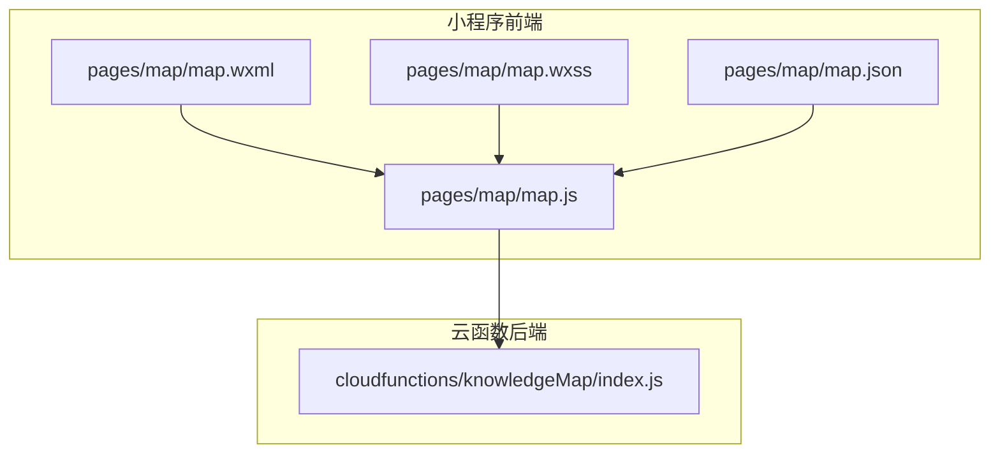
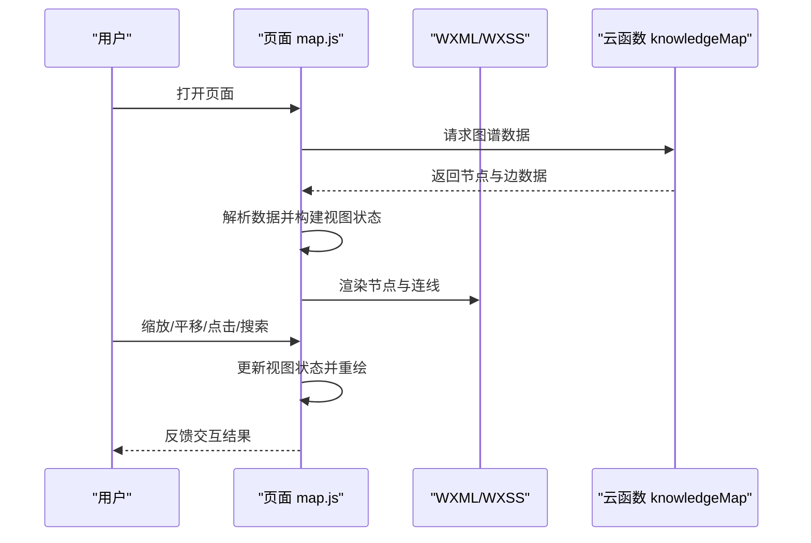
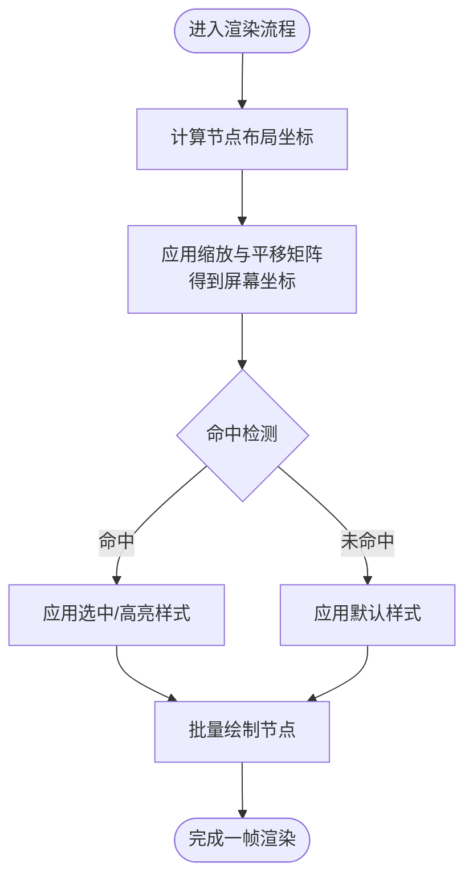
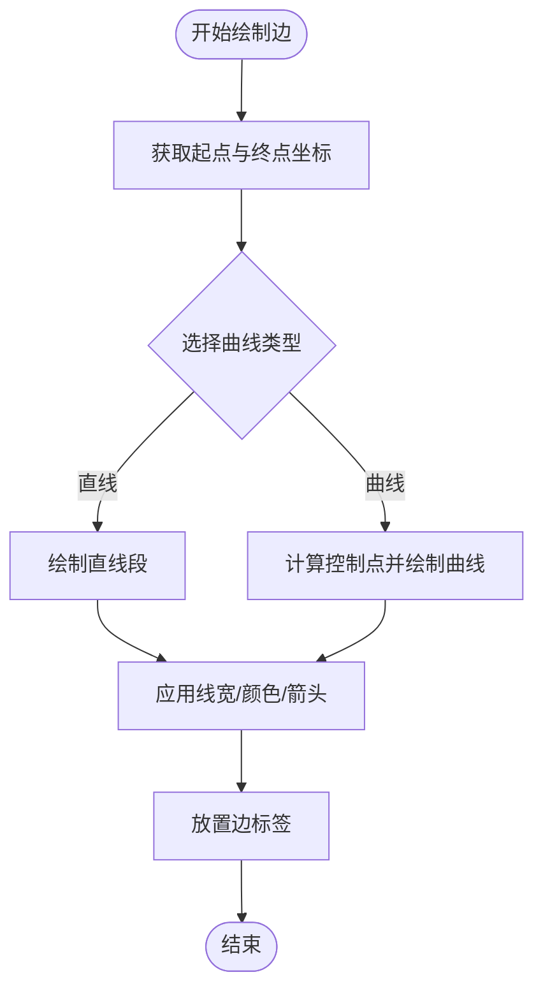
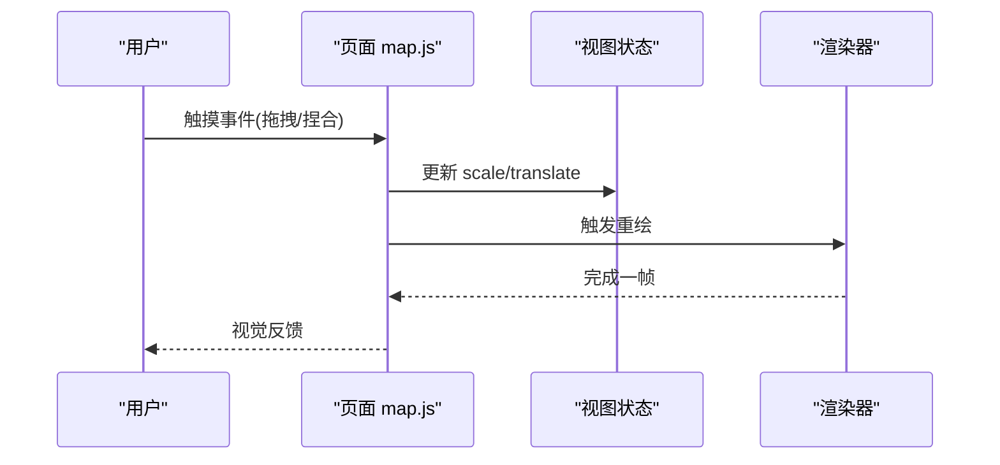
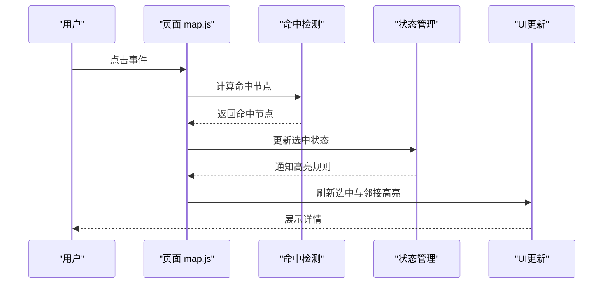
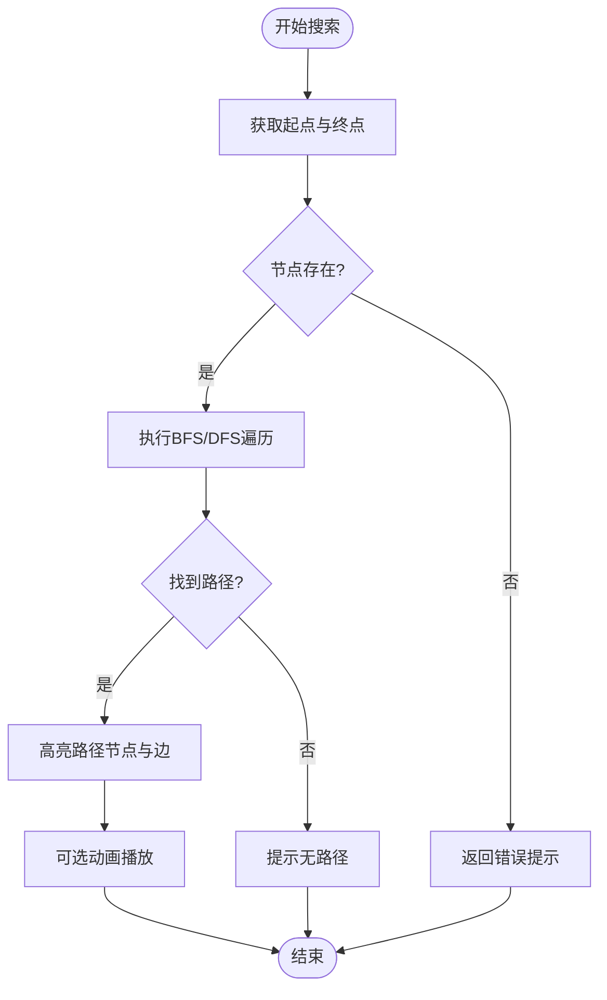
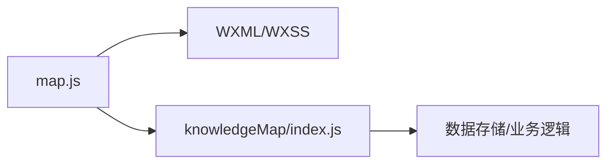

# 知识图谱可视化组件

<cite>
**本文引用的文件**   
- [cloudfunctions/knowledgeMap/index.js](file://cloudfunctions/knowledgeMap/index.js)
- [miniprogram/pages/map/map.js](file://miniprogram/pages/map/map.js)
- [miniprogram/pages/map/map.json](file://miniprogram/pages/map/map.json)
- [miniprogram/pages/map/map.wxml](file://miniprogram/pages/map/map.wxml)
- [miniprogram/pages/map/map.wxss](file://miniprogram/pages/map/map.wxss)
</cite>

## 目录
1. [简介](#简介)
2. [项目结构](#项目结构)
3. [核心组件](#核心组件)
4. [架构总览](#架构总览)
5. [详细组件分析](#详细组件分析)
6. [依赖关系分析](#依赖关系分析)
7. [性能考虑](#性能考虑)
8. [故障排查指南](#故障排查指南)
9. [结论](#结论)
10. [附录](#附录)

## 简介
本文件面向“知识图谱可视化组件”的开发者与使用者，系统性说明该组件的数据结构、节点渲染算法、连线绘制逻辑、缩放平移操作、节点点击交互、路径搜索功能；并提供配置参数、事件处理、样式定制方法；同时给出动态数据更新、性能优化、移动端适配策略，以及复杂图谱渲染、内存管理与用户体验优化的实践建议。文档还包含自定义节点样式与交互行为的扩展指导，帮助快速集成与二次开发。

## 项目结构
本项目为微信小程序工程，知识图谱相关的前端页面位于 pages/map，后端云函数提供图谱数据接口。关键文件如下：
- 前端页面：map.js、map.wxml、map.wxss、map.json
- 后端云函数：knowledgeMap/index.js

图表来源
- [miniprogram/pages/map/map.js](file://miniprogram/pages/map/map.js)
- [miniprogram/pages/map/map.wxml](file://miniprogram/pages/map/map.wxml)
- [miniprogram/pages/map/map.wxss](file://miniprogram/pages/map/map.wxss)
- [miniprogram/pages/map/map.json](file://miniprogram/pages/map/map.json)
- [cloudfunctions/knowledgeMap/index.js](file://cloudfunctions/knowledgeMap/index.js)

章节来源
- [miniprogram/pages/map/map.js](file://miniprogram/pages/map/map.js)
- [miniprogram/pages/map/map.wxml](file://miniprogram/pages/map/map.wxml)
- [miniprogram/pages/map/map.wxss](file://miniprogram/pages/map/map.wxss)
- [miniprogram/pages/map/map.json](file://miniprogram/pages/map/map.json)
- [cloudfunctions/knowledgeMap/index.js](file://cloudfunctions/knowledgeMap/index.js)

## 核心组件
- 数据层
  - 节点集合：包含唯一标识、名称、类型、位置等字段
  - 边集合：包含起点、终点、标签、权重等字段
  - 视图状态：包含缩放级别、平移偏移、选中节点、高亮路径等
- 渲染层
  - 节点渲染：根据节点类型选择形状/图标，计算布局坐标，应用样式
  - 连线绘制：按边集合生成路径，支持直线或曲线，支持箭头与标签
- 交互层
  - 缩放平移：手势识别与事件绑定，更新视图矩阵
  - 点击选择：节点命中检测，触发选中与详情展示
  - 路径搜索：基于图遍历（如 BFS/DFS）计算最短路径并高亮
- 配置与事件
  - 配置项：节点尺寸、颜色主题、连线样式、动画时长、是否启用拖拽等
  - 事件回调：onNodeClick、onPathFound、onZoomChange、onPanChange 等

章节来源
- [miniprogram/pages/map/map.js](file://miniprogram/pages/map/map.js)
- [miniprogram/pages/map/map.wxml](file://miniprogram/pages/map/map.wxml)
- [miniprogram/pages/map/map.wxss](file://miniprogram/pages/map/map.wxss)
- [cloudfunctions/knowledgeMap/index.js](file://cloudfunctions/knowledgeMap/index.js)

## 架构总览
前后端通过云函数进行数据交互，前端负责渲染与交互，后端提供图谱数据查询与聚合。

图表来源
- [miniprogram/pages/map/map.js](file://miniprogram/pages/map/map.js)
- [miniprogram/pages/map/map.wxml](file://miniprogram/pages/map/map.wxml)
- [miniprogram/pages/map/map.wxss](file://miniprogram/pages/map/map.wxss)
- [cloudfunctions/knowledgeMap/index.js](file://cloudfunctions/knowledgeMap/index.js)

## 详细组件分析

### 数据结构设计
- 节点模型
  - id：唯一标识
  - label：显示文本
  - type：节点类型（用于区分样式与行为）
  - x/y：屏幕坐标或逻辑坐标
  - meta：扩展属性（如图片、描述、权重）
- 边模型
  - source：起点 id
  - target：终点 id
  - label：关系标签
  - weight：权重（影响连线粗细或颜色）
- 视图状态
  - scale：缩放比例
  - translateX/translateY：平移偏移
  - selectedNodeId：当前选中节点
  - highlightPath：高亮路径节点/边序列
- 配置对象
  - nodeSize：节点半径或宽高
  - colors：主题色板
  - edgeStyle：连线样式（线宽、虚线、箭头）
  - animationDuration：过渡动画时长
  - enableDrag：是否允许拖拽
  - enablePinch：是否允许双指缩放
  - enableSearch：是否启用路径搜索

章节来源
- [miniprogram/pages/map/map.js](file://miniprogram/pages/map/map.js)
- [miniprogram/pages/map/map.wxml](file://miniprogram/pages/map/map.wxml)
- [miniprogram/pages/map/map.wxss](file://miniprogram/pages/map/map.wxss)

### 节点渲染算法
- 布局策略
  - 初始布局：可采用力导向或网格布局，将节点均匀分布到可视区域
  - 坐标映射：逻辑坐标到屏幕坐标的变换由缩放和平移矩阵决定
- 命中检测
  - 圆形节点：点到圆心距离小于半径即命中
  - 矩形节点：点在矩形边界内判定
- 样式应用
  - 根据节点类型选择形状与颜色
  - 选中态与高亮态切换
- 重绘优化
  - 增量更新：仅重绘变化节点与边
  - 批量绘制：合并多次变更，减少渲染次数

图表来源
- [miniprogram/pages/map/map.js](file://miniprogram/pages/map/map.js)
- [miniprogram/pages/map/map.wxml](file://miniprogram/pages/map/map.wxml)
- [miniprogram/pages/map/map.wxss](file://miniprogram/pages/map/map.wxss)

章节来源
- [miniprogram/pages/map/map.js](file://miniprogram/pages/map/map.js)
- [miniprogram/pages/map/map.wxml](file://miniprogram/pages/map/map.wxml)
- [miniprogram/pages/map/map.wxss](file://miniprogram/pages/map/map.wxss)

### 连线绘制逻辑
- 路径生成
  - 直线：两点间线段
  - 曲线：使用贝塞尔曲线或弧线，避免重叠遮挡
- 样式与标注
  - 线宽、颜色、虚线模式
  - 箭头方向与标签位置
- 性能优化
  - 按需绘制：仅绘制可见区域内的边
  - 缓存路径：对静态边缓存路径点集

图表来源
- [miniprogram/pages/map/map.js](file://miniprogram/pages/map/map.js)
- [miniprogram/pages/map/map.wxml](file://miniprogram/pages/map/map.wxml)
- [miniprogram/pages/map/map.wxss](file://miniprogram/pages/map/map.wxss)

章节来源
- [miniprogram/pages/map/map.js](file://miniprogram/pages/map/map.js)
- [miniprogram/pages/map/map.wxml](file://miniprogram/pages/map/map.wxml)
- [miniprogram/pages/map/map.wxss](file://miniprogram/pages/map/map.wxss)

### 缩放与平移操作
- 手势识别
  - 单指拖拽实现平移
  - 双指捏合实现缩放
- 矩阵变换
  - 维护缩放比例与平移偏移，统一应用到所有节点与边
- 边界约束
  - 限制最小/最大缩放级别
  - 防止平移超出可视范围
- 交互反馈
  - 平滑过渡动画
  - 缩放中心跟随手指位置

图表来源
- [miniprogram/pages/map/map.js](file://miniprogram/pages/map/map.js)
- [miniprogram/pages/map/map.wxml](file://miniprogram/pages/map/map.wxml)
- [miniprogram/pages/map/map.wxss](file://miniprogram/pages/map/map.wxss)

章节来源
- [miniprogram/pages/map/map.js](file://miniprogram/pages/map/map.js)
- [miniprogram/pages/map/map.wxml](file://miniprogram/pages/map/map.wxml)
- [miniprogram/pages/map/map.wxss](file://miniprogram/pages/map/map.wxss)

### 节点点击交互
- 命中检测
  - 在触摸事件中计算点击坐标与节点几何的相交关系
- 选中态管理
  - 清除旧选中，设置新选中节点
  - 联动高亮相邻节点与边
- 详情展示
  - 弹出面板或侧栏显示节点元信息
- 事件回调
  - onNodeClick(nodeId, event)

图表来源
- [miniprogram/pages/map/map.js](file://miniprogram/pages/map/map.js)
- [miniprogram/pages/map/map.wxml](file://miniprogram/pages/map/map.wxml)
- [miniprogram/pages/map/map.wxss](file://miniprogram/pages/map/map.wxss)

章节来源
- [miniprogram/pages/map/map.js](file://miniprogram/pages/map/map.js)
- [miniprogram/pages/map/map.wxml](file://miniprogram/pages/map/map.wxml)
- [miniprogram/pages/map/map.wxss](file://miniprogram/pages/map/map.wxss)

### 路径搜索功能
- 搜索入口
  - 输入起始节点与目标节点
- 图遍历
  - 广度优先搜索（BFS）求最短路径
  - 深度优先搜索（DFS）用于探索性路径
- 高亮展示
  - 将路径上的节点与边置高亮
  - 可选动画逐步展示路径
- 事件回调
  - onPathFound(pathNodes, pathEdges)

图表来源
- [miniprogram/pages/map/map.js](file://miniprogram/pages/map/map.js)
- [miniprogram/pages/map/map.wxml](file://miniprogram/pages/map/map.wxml)
- [miniprogram/pages/map/map.wxss](file://miniprogram/pages/map/map.wxss)

章节来源
- [miniprogram/pages/map/map.js](file://miniprogram/pages/map/map.js)
- [miniprogram/pages/map/map.wxml](file://miniprogram/pages/map/map.wxml)
- [miniprogram/pages/map/map.wxss](file://miniprogram/pages/map/map.wxss)

### 配置参数与事件处理
- 配置参数
  - 节点尺寸、颜色主题、连线样式、动画时长、是否启用拖拽/缩放/搜索
- 事件处理
  - onNodeClick、onPathFound、onZoomChange、onPanChange、onDataReady
- 生命周期
  - onLoad：初始化配置与加载数据
  - onShow：恢复视图状态
  - onHide：释放资源
  - onUnload：清理定时器与监听

章节来源
- [miniprogram/pages/map/map.js](file://miniprogram/pages/map/map.js)
- [miniprogram/pages/map/map.json](file://miniprogram/pages/map/map.json)

### 样式定制方法
- 主题变量
  - 定义节点主色、次色、背景色、文字色
- 节点样式
  - 形状、边框、阴影、选中态样式
- 连线样式
  - 线宽、颜色、虚线、箭头
- 响应式适配
  - 根据屏幕尺寸调整节点大小与间距

章节来源
- [miniprogram/pages/map/map.wxss](file://miniprogram/pages/map/map.wxss)
- [miniprogram/pages/map/map.wxml](file://miniprogram/pages/map/map.wxml)

### 动态数据更新
- 增量更新
  - 新增/删除节点与边时，仅更新受影响区域
- 数据同步
  - 监听后端推送或定时拉取，合并差异数据
- 状态一致性
  - 保持视图状态与数据一致，必要时重置缩放与平移

章节来源
- [miniprogram/pages/map/map.js](file://miniprogram/pages/map/map.js)
- [cloudfunctions/knowledgeMap/index.js](file://cloudfunctions/knowledgeMap/index.js)

### 移动端适配
- 触控优化
  - 合理设置触摸阈值，避免误触
- 性能调优
  - 降低节点数量与复杂度，启用按需渲染
- 可访问性
  - 提供键盘导航与读屏支持（如适用）

章节来源
- [miniprogram/pages/map/map.js](file://miniprogram/pages/map/map.js)
- [miniprogram/pages/map/map.wxss](file://miniprogram/pages/map/map.wxss)

### 复杂图谱渲染策略
- 分层渲染
  - 先绘制边，再绘制节点，确保层级正确
- 视口裁剪
  - 仅渲染可视区域内的元素
- 虚拟节点
  - 对大量相似节点采用占位符，点击后展开

章节来源
- [miniprogram/pages/map/map.js](file://miniprogram/pages/map/map.js)
- [miniprogram/pages/map/map.wxml](file://miniprogram/pages/map/map.wxml)

### 内存管理
- 对象池
  - 复用节点与边对象，减少 GC 压力
- 资源释放
  - 页面卸载时清理定时器、事件监听与缓存
- 大数据量
  - 分页加载与懒加载，避免一次性载入全部数据

章节来源
- [miniprogram/pages/map/map.js](file://miniprogram/pages/map/map.js)

### 用户交互体验优化
- 即时反馈
  - 点击与拖拽提供视觉与触觉反馈
- 平滑动画
  - 使用缓动函数提升观感
- 容错处理
  - 无效输入与异常路径友好提示

章节来源
- [miniprogram/pages/map/map.js](file://miniprogram/pages/map/map.js)
- [miniprogram/pages/map/map.wxss](file://miniprogram/pages/map/map.wxss)

### 自定义节点样式与交互扩展
- 扩展点
  - 节点渲染钩子：根据类型返回不同样式与行为
  - 交互钩子：自定义点击、长按、双击行为
- 插件机制
  - 注册自定义节点类型与处理器
- 示例流程
  - 定义新节点类型 -> 注册样式与事件 -> 在数据中标注类型 -> 渲染器自动应用

章节来源
- [miniprogram/pages/map/map.js](file://miniprogram/pages/map/map.js)
- [miniprogram/pages/map/map.wxml](file://miniprogram/pages/map/map.wxml)
- [miniprogram/pages/map/map.wxss](file://miniprogram/pages/map/map.wxss)

## 依赖关系分析
- 前端依赖
  - 页面脚本与模板样式
  - 系统 API（触摸事件、画布或视图容器）
- 后端依赖
  - 云函数提供图谱数据接口
- 耦合度
  - 前后端通过约定数据格式解耦
  - 前端内部模块职责清晰，便于替换与扩展

图表来源
- [miniprogram/pages/map/map.js](file://miniprogram/pages/map/map.js)
- [miniprogram/pages/map/map.wxml](file://miniprogram/pages/map/map.wxml)
- [miniprogram/pages/map/map.wxss](file://miniprogram/pages/map/map.wxss)
- [cloudfunctions/knowledgeMap/index.js](file://cloudfunctions/knowledgeMap/index.js)

章节来源
- [miniprogram/pages/map/map.js](file://miniprogram/pages/map/map.js)
- [cloudfunctions/knowledgeMap/index.js](file://cloudfunctions/knowledgeMap/index.js)

## 性能考虑
- 渲染优化
  - 批量更新、增量重绘、视口裁剪
- 算法优化
  - 使用高效数据结构（邻接表）加速路径搜索
- 资源管理
  - 对象池、缓存路径、延迟加载大图
- 移动端特性
  - 降低动画复杂度，合理使用硬件加速

[本节为通用性能建议，不直接分析具体文件]

## 故障排查指南
- 常见问题
  - 节点不显示：检查坐标映射与视口裁剪
  - 连线错位：确认起点与终点坐标及曲线控制点
  - 点击无响应：验证命中检测逻辑与事件绑定
  - 路径搜索失败：检查图连通性与遍历终止条件
- 调试技巧
  - 打印视图状态与命中坐标
  - 临时禁用动画以定位卡顿点
  - 使用控制台日志跟踪数据流

章节来源
- [miniprogram/pages/map/map.js](file://miniprogram/pages/map/map.js)

## 结论
本组件围绕“数据—渲染—交互—配置”四层架构，提供了完整的知识图谱可视化能力。通过合理的布局与绘制策略、完善的交互与事件体系、灵活的配置与样式定制，能够满足从简单到复杂的图谱展示需求。结合动态更新、性能优化与移动端适配，可在实际项目中稳定运行并持续演进。

## 附录
- 术语
  - 节点：图中的实体对象
  - 边：节点之间的关系
  - 视图状态：缩放、平移、选中、高亮等界面状态
- 参考
  - 小程序官方文档（事件、样式、生命周期）
  - 云函数开发指南