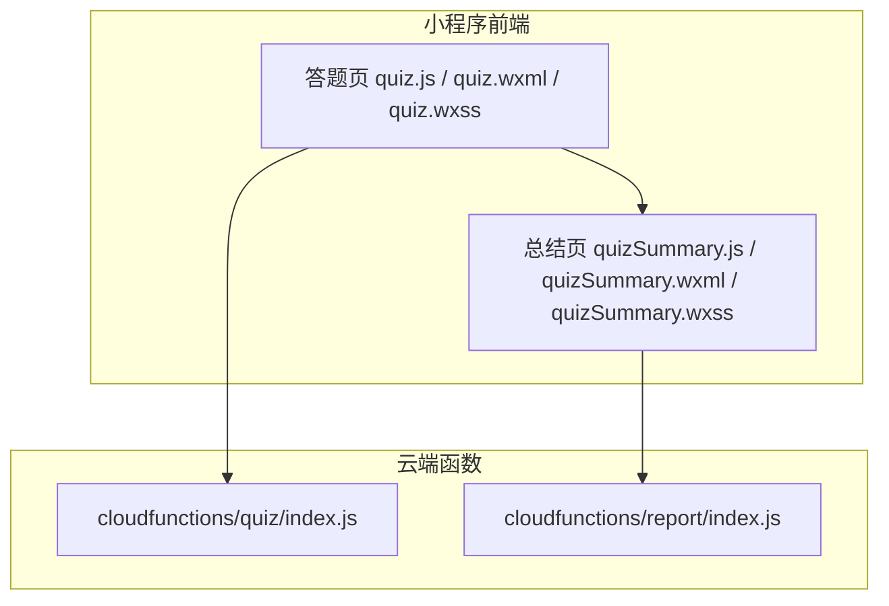
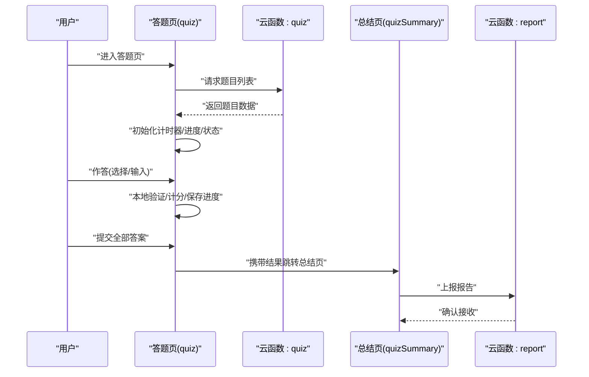
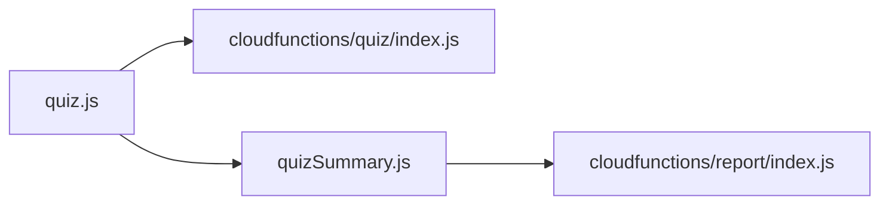

# 答题界面组件

<cite>
**本文引用的文件**   
- [quiz.js](file://miniprogram/pages/quiz/quiz.js)
- [quiz.wxml](file://miniprogram/pages/quiz/quiz.wxml)
- [quiz.wxss](file://miniprogram/pages/quiz/quiz.wxss)
- [quizSummary.js](file://miniprogram/pages/quizSummary/quizSummary.js)
- [quizSummary.wxml](file://miniprogram/pages/quizSummary/quizSummary.wxml)
- [quizSummary.wxss](file://miniprogram/pages/quizSummary/quizSummary.wxss)
- [cloudfunctions/quiz/index.js](file://cloudfunctions/quiz/index.js)
- [cloudfunctions/report/index.js](file://cloudfunctions/report/index.js)
</cite>

## 目录
1. [简介](#简介)
2. [项目结构](#项目结构)
3. [核心组件](#核心组件)
4. [架构总览](#架构总览)
5. [详细组件分析](#详细组件分析)
6. [依赖关系分析](#依赖关系分析)
7. [性能考虑](#性能考虑)
8. [故障排查指南](#故障排查指南)
9. [结论](#结论)
10. [附录](#附录)

## 简介
本文件面向开发者，系统化说明“答题界面组件”的实现与扩展方法。内容覆盖题目加载机制、选项渲染逻辑、用户交互处理、计时器功能、答案验证算法与得分计算规则、配置项与事件回调、状态管理方法、多题型通用支持（单选、多选、填空）、答题进度保存与异常恢复、以及用户体验优化策略。同时提供自定义题型与评分规则的扩展指导，帮助快速集成与二次开发。

## 项目结构
答题相关的前端页面位于 miniprogram/pages/quiz 与 miniprogram/pages/quizSummary，云端函数位于 cloudfunctions/quiz 与 cloudfunctions/report。整体采用“前端页面 + 云函数”的轻量架构：前端负责渲染与交互，云端负责题目分发、结果上报与报告生成。

图表来源
- [quiz.js](file://miniprogram/pages/quiz/quiz.js)
- [quiz.wxml](file://miniprogram/pages/quiz/quiz.wxml)
- [quiz.wxss](file://miniprogram/pages/quiz/quiz.wxss)
- [quizSummary.js](file://miniprogram/pages/quizSummary/quizSummary.js)
- [quizSummary.wxml](file://miniprogram/pages/quizSummary/quizSummary.wxml)
- [quizSummary.wxss](file://miniprogram/pages/quizSummary/quizSummary.wxss)
- [cloudfunctions/quiz/index.js](file://cloudfunctions/quiz/index.js)
- [cloudfunctions/report/index.js](file://cloudfunctions/report/index.js)

章节来源
- [quiz.js](file://miniprogram/pages/quiz/quiz.js)
- [quiz.wxml](file://miniprogram/pages/quiz/quiz.wxml)
- [quiz.wxss](file://miniprogram/pages/quiz/quiz.wxss)
- [quizSummary.js](file://miniprogram/pages/quizSummary/quizSummary.js)
- [quizSummary.wxml](file://miniprogram/pages/quizSummary/quizSummary.wxml)
- [quizSummary.wxss](file://miniprogram/pages/quizSummary/quizSummary.wxss)
- [cloudfunctions/quiz/index.js](file://cloudfunctions/quiz/index.js)
- [cloudfunctions/report/index.js](file://cloudfunctions/report/index.js)

## 核心组件
- 答题页（quiz）
  - 职责：加载题目、渲染题型、处理用户选择/输入、计时控制、提交答案、保存进度、跳转总结页。
  - 关键能力：
    - 题目加载：从云端获取题集，按顺序或随机策略组织。
    - 选项渲染：根据题型动态渲染单选、多选、填空等 UI。
    - 交互处理：监听点击、输入、切换题目等操作。
    - 计时器：倒计时显示与超时自动提交当前题。
    - 答案验证与计分：在本地预校验并记录得分，最终汇总。
    - 进度保存：定时或关键节点持久化，支持断点续答。
    - 异常恢复：网络失败、数据缺失时的降级与提示。
- 总结页（quizSummary）
  - 职责：展示答题结果、错题回顾、用时统计、导出报告。
  - 关键能力：
    - 结果聚合：总分、正确率、用时分布。
    - 错题解析：逐题反馈与知识点关联。
    - 报告上报：将结果写入云端报告服务。

章节来源
- [quiz.js](file://miniprogram/pages/quiz/quiz.js)
- [quiz.wxml](file://miniprogram/pages/quiz/quiz.wxml)
- [quiz.wxss](file://miniprogram/pages/quiz/quiz.wxss)
- [quizSummary.js](file://miniprogram/pages/quizSummary/quizSummary.js)
- [quizSummary.wxml](file://miniprogram/pages/quizSummary/quizSummary.wxml)
- [quizSummary.wxss](file://miniprogram/pages/quizSummary/quizSummary.wxss)

## 架构总览
答题流程由前端页面驱动，通过云函数完成题目下发与结果上报。总结页负责结果可视化与报告生成。

图表来源
- [quiz.js](file://miniprogram/pages/quiz/quiz.js)
- [cloudfunctions/quiz/index.js](file://cloudfunctions/quiz/index.js)
- [quizSummary.js](file://miniprogram/pages/quizSummary/quizSummary.js)
- [cloudfunctions/report/index.js](file://cloudfunctions/report/index.js)

## 详细组件分析

### 题目加载机制
- 数据来源
  - 通过调用云端函数获取题目集合，包含题干、选项、题型、分值、正确答案等信息。
- 加载流程
  - 进入答题页后发起请求；成功则初始化题目队列与索引；失败则重试或降级为缓存数据。
- 数据结构要点
  - 题目对象需包含：唯一标识、题型标记、题干文本、选项数组、标准答案、分值、难度等字段。
- 错误处理
  - 网络异常时进行指数退避重试；若仍失败，提示用户检查网络并允许离线继续已缓存的题目。

章节来源
- [quiz.js](file://miniprogram/pages/quiz/quiz.js)
- [cloudfunctions/quiz/index.js](file://cloudfunctions/quiz/index.js)

### 选项渲染逻辑
- 题型适配
  - 单选题：渲染互斥的单选按钮组。
  - 多选题：渲染可复选的复选框组，限制最少/最多选择数量。
  - 填空题：渲染输入框，支持正则或关键词匹配。
- 渲染策略
  - 基于题型字段动态选择模板；对富文本或图片题干做安全过滤与占位符替换。
- 样式与无障碍
  - 使用语义化标签与 aria 属性提升可访问性；高对比度与键盘导航支持。

章节来源
- [quiz.wxml](file://miniprogram/pages/quiz/quiz.wxml)
- [quiz.wxss](file://miniprogram/pages/quiz/quiz.wxss)

### 用户交互处理
- 事件绑定
  - 选项点击、输入变更、题目切换、上一题/下一题、提交确认等事件统一派发。
- 即时反馈
  - 选择后立即更新选中态；非法操作给出提示；填空题实时校验格式。
- 防抖与节流
  - 输入与滚动场景采用节流减少重绘；提交前防抖避免重复提交。

章节来源
- [quiz.js](file://miniprogram/pages/quiz/quiz.js)
- [quiz.wxml](file://miniprogram/pages/quiz/quiz.wxml)

### 计时器功能
- 模式
  - 全局倒计时：整卷限时；单题倒计时：每题限时。
- 行为
  - 到达阈值时视觉提醒；超时自动提交当前题或整卷；暂停/恢复支持。
- 精度与一致性
  - 使用系统时间校准；跨页面保持时钟同步；网络延迟不影响本地计时。

章节来源
- [quiz.js](file://miniprogram/pages/quiz/quiz.js)

### 答案验证算法与得分计算规则
- 验证策略
  - 单选题：严格匹配标准答案。
  - 多选题：集合等价比较，忽略顺序。
  - 填空题：大小写不敏感、去除多余空白、支持同义词或正则匹配。
- 计分规则
  - 基础分=题目分值×正确系数；可选惩罚分用于错选；未答不计分。
  - 总分=各题得分之和；正确率=正确题数/总题数。
- 边界情况
  - 空答案、部分正确、超范围输入的处理与提示。

章节来源
- [quiz.js](file://miniprogram/pages/quiz/quiz.js)

### 配置选项、事件回调与状态管理
- 配置项（示例）
  - 题目来源、是否启用计时、每道题时长、是否允许回看、是否显示解析、主题风格等。
- 事件回调
  - onAnswerChange、onQuestionSwitch、onSubmit、onTimerTick、onError 等。
- 状态管理
  - 集中维护：当前题号、已答集合、计时状态、得分快照、进度持久化键名。
  - 状态变更触发视图更新与副作用（如保存进度）。

章节来源
- [quiz.js](file://miniprogram/pages/quiz/quiz.js)

### 多题型通用支持（单选、多选、填空）
- 抽象层设计
  - 以“题型枚举 + 渲染器 + 验证器 + 计分器”组合实现多题型统一接入。
- 扩展方式
  - 新增题型只需注册渲染器与验证器，无需改动主流程。
- 兼容性
  - 旧数据兼容：未知题型降级为“仅展示”，不参与计分。

章节来源
- [quiz.wxml](file://miniprogram/pages/quiz/quiz.wxml)
- [quiz.js](file://miniprogram/pages/quiz/quiz.js)

### 答题进度保存、异常恢复与用户体验优化
- 进度保存
  - 关键节点（切换题目、提交答案、离开页面）持久化到本地存储；支持增量更新。
- 异常恢复
  - 断网时继续本地作答；恢复后合并差异；云端冲突时以服务端为准。
- 体验优化
  - 骨架屏与懒加载；大题库分页；动画过渡；错误友好提示；一键重试。

章节来源
- [quiz.js](file://miniprogram/pages/quiz/quiz.js)

### 总结页与报告上报
- 结果聚合
  - 汇总得分、用时、正确率、错题清单与解析。
- 报告上报
  - 将结构化结果发送至云端报告函数，便于后续分析与导出。
- 交互
  - 支持分享、导出、重新练习错题等功能入口。

章节来源
- [quizSummary.js](file://miniprogram/pages/quizSummary/quizSummary.js)
- [quizSummary.wxml](file://miniprogram/pages/quizSummary/quizSummary.wxml)
- [cloudfunctions/report/index.js](file://cloudfunctions/report/index.js)

## 依赖关系分析
- 模块耦合
  - 答题页依赖云函数 quiz 获取题目；总结页依赖 report 上报结果。
- 外部依赖
  - 小程序原生 API（网络、存储、路由、定时器）；云开发环境。
- 潜在循环
  - 前后端单向依赖，无循环引用风险。

图表来源
- [quiz.js](file://miniprogram/pages/quiz/quiz.js)
- [quizSummary.js](file://miniprogram/pages/quizSummary/quizSummary.js)
- [cloudfunctions/quiz/index.js](file://cloudfunctions/quiz/index.js)
- [cloudfunctions/report/index.js](file://cloudfunctions/report/index.js)

章节来源
- [quiz.js](file://miniprogram/pages/quiz/quiz.js)
- [quizSummary.js](file://miniprogram/pages/quizSummary/quizSummary.js)
- [cloudfunctions/quiz/index.js](file://cloudfunctions/quiz/index.js)
- [cloudfunctions/report/index.js](file://cloudfunctions/report/index.js)

## 性能考虑
- 渲染优化
  - 列表虚拟滚动或分页加载；按需渲染选项；减少不必要的 setData 次数。
- 内存管理
  - 及时释放定时器与事件监听；大对象复用与浅拷贝优先。
- 网络优化
  - 请求压缩与缓存；失败重试与降级；弱网提示。
- 计时器精度
  - 使用高精度时间源；避免频繁刷新导致掉帧。

[本节为通用建议，不涉及具体文件]

## 故障排查指南
- 常见问题
  - 题目无法加载：检查网络权限与云函数部署状态；查看控制台日志。
  - 计时不同步：核对系统时间与设备时区；避免后台被杀进程。
  - 答案校验异常：确认题型与验证器匹配；检查输入清洗逻辑。
  - 进度丢失：检查本地存储配额与权限；确保关键节点持久化。
- 定位手段
  - 在关键路径埋点打印耗时与状态快照；开启调试模式输出详细日志。
  - 使用模拟器回放与真机对比，定位平台差异。

章节来源
- [quiz.js](file://miniprogram/pages/quiz/quiz.js)
- [quizSummary.js](file://miniprogram/pages/quizSummary/quizSummary.js)

## 结论
该答题界面组件以“题型抽象 + 渲染/验证/计分解耦”的方式实现了单选、多选、填空的通用支持，并通过云端函数完成题目分发与报告上报。配合完善的进度保存、异常恢复与性能优化策略，可提供稳定且良好的用户体验。开发者可通过注册新题型与自定义评分规则快速扩展能力。

[本节为总结性内容，不涉及具体文件]

## 附录

### 扩展指导：自定义题型与评分规则
- 新增题型步骤
  - 定义题型枚举值与元数据（最小/最大选择数、输入约束）。
  - 实现渲染器：根据元数据生成对应 UI。
  - 实现验证器：将用户答案与标准答案比对，返回布尔与解释。
  - 实现计分器：依据分值与规则计算得分。
  - 注册到统一调度器，使主流程透明支持。
- 评分规则扩展
  - 支持加权、惩罚、阶梯得分、部分得分等策略。
  - 提供规则 DSL 或配置表，便于运营调整。
- 测试与回归
  - 针对边界用例编写单元测试；进行端到端自动化测试。
  - 灰度发布与 A/B 评估评分策略对用户表现的影响。

[本节为概念性指导，不涉及具体文件]