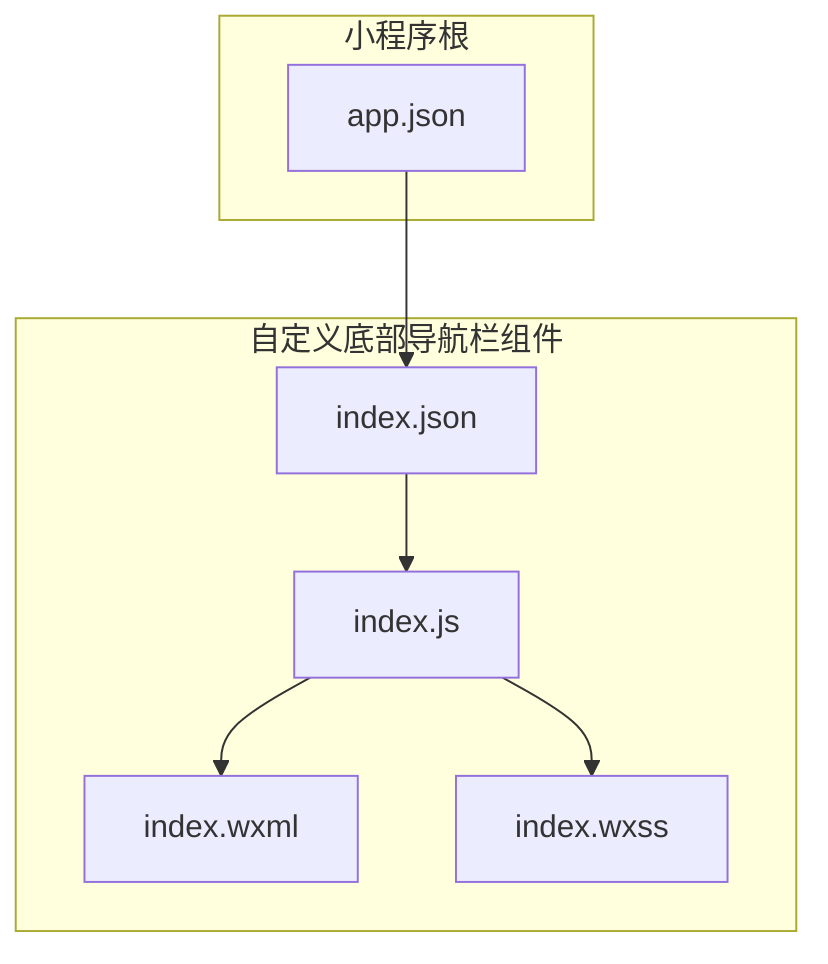
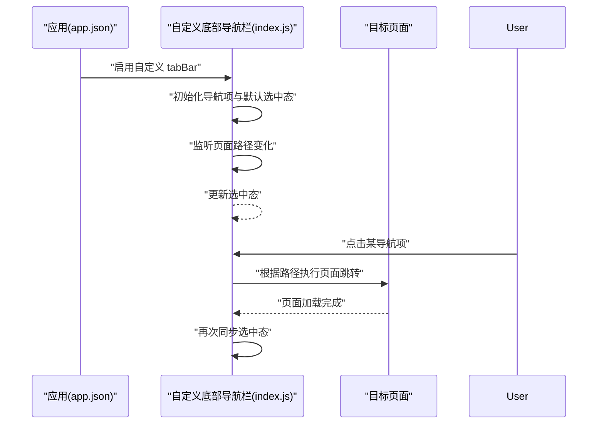
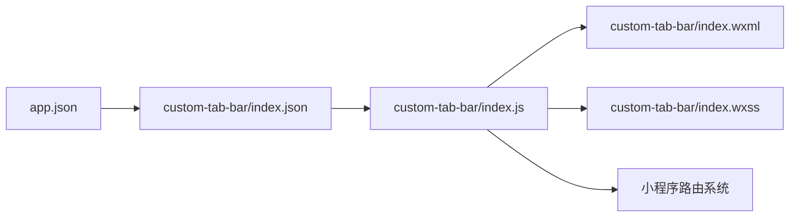

# 自定义底部导航栏

<cite>
**本文引用的文件**   
- [miniprogram/custom-tab-bar/index.js](file://miniprogram/custom-tab-bar/index.js)
- [miniprogram/custom-tab-bar/index.json](file://miniprogram/custom-tab-bar/index.json)
- [miniprogram/custom-tab-bar/index.wxml](file://miniprogram/custom-tab-bar/index.wxml)
- [miniprogram/custom-tab-bar/index.wxss](file://miniprogram/custom-tab-bar/index.wxss)
- [miniprogram/app.json](file://miniprogram/app.json)
</cite>

## 目录
1. [简介](#简介)
2. [项目结构](#项目结构)
3. [核心组件](#核心组件)
4. [架构总览](#架构总览)
5. [详细组件分析](#详细组件分析)
6. [依赖关系分析](#依赖关系分析)
7. [性能考虑](#性能考虑)
8. [故障排查指南](#故障排查指南)
9. [结论](#结论)
10. [附录](#附录)

## 简介
本文件围绕“自定义底部导航栏”组件，系统阐述其实现原理、配置项与样式定制方法，覆盖动态配置、图标切换逻辑、选中状态管理、页面跳转处理等关键能力。文档同时提供属性定义、事件回调说明、使用示例、扩展方式（新增导航项、自定义图标样式、响应式适配）、性能优化建议以及常见问题解决方案，帮助开发者快速集成并高效维护该组件。

## 项目结构
本项目采用小程序工程结构，自定义底部导航栏位于 miniprogram/custom-tab-bar 目录下，包含组件的 JS、JSON、WXML、WXSS 四个核心文件；应用级路由与 tabBar 开关在 app.json 中统一配置。

图表来源
- [miniprogram/app.json](file://miniprogram/app.json)
- [miniprogram/custom-tab-bar/index.json](file://miniprogram/custom-tab-bar/index.json)
- [miniprogram/custom-tab-bar/index.js](file://miniprogram/custom-tab-bar/index.js)
- [miniprogram/custom-tab-bar/index.wxml](file://miniprogram/custom-tab-bar/index.wxml)
- [miniprogram/custom-tab-bar/index.wxss](file://miniprogram/custom-tab-bar/index.wxss)

章节来源
- [miniprogram/custom-tab-bar/index.js](file://miniprogram/custom-tab-bar/index.js)
- [miniprogram/custom-tab-bar/index.json](file://miniprogram/custom-tab-bar/index.json)
- [miniprogram/custom-tab-bar/index.wxml](file://miniprogram/custom-tab-bar/index.wxml)
- [miniprogram/custom-tab-bar/index.wxss](file://miniprogram/custom-tab-bar/index.wxss)
- [miniprogram/app.json](file://miniprogram/app.json)

## 核心组件
自定义底部导航栏由以下文件组成：
- index.js：组件生命周期、数据绑定、点击事件处理、页面跳转与选中态同步。
- index.json：组件注册与本地依赖声明。
- index.wxml：导航项列表渲染、图标与文字展示、选中态样式类绑定。
- index.wxss：布局、尺寸、颜色、间距、选中态样式等视觉表现。

章节来源
- [miniprogram/custom-tab-bar/index.js](file://miniprogram/custom-tab-bar/index.js)
- [miniprogram/custom-tab-bar/index.json](file://miniprogram/custom-tab-bar/index.json)
- [miniprogram/custom-tab-bar/index.wxml](file://miniprogram/custom-tab-bar/index.wxml)
- [miniprogram/custom-tab-bar/index.wxss](file://miniprogram/custom-tab-bar/index.wxss)

## 架构总览
组件通过 app.json 启用自定义 tabBar，并在组件内部监听当前页面路径变化，以驱动选中态更新。点击导航项时，根据目标路径执行页面跳转，随后同步选中态。

图表来源
- [miniprogram/app.json](file://miniprogram/app.json)
- [miniprogram/custom-tab-bar/index.js](file://miniprogram/custom-tab-bar/index.js)

## 详细组件分析

### 组件结构与职责
- 数据层
  - 导航项列表：用于渲染每个导航按钮的文本、图标路径、是否选中等信息。
  - 当前选中索引：用于高亮当前激活的导航项。
- 视图层
  - 导航容器：固定底部、横向排列、均分宽度。
  - 导航项：图标 + 文字，按选中态切换样式。
- 交互层
  - 点击事件：根据点击项的目标路径进行页面跳转。
  - 路径监听：当外部页面切换时，自动更新选中态。

章节来源
- [miniprogram/custom-tab-bar/index.wxml](file://miniprogram/custom-tab-bar/index.wxml)
- [miniprogram/custom-tab-bar/index.wxss](file://miniprogram/custom-tab-bar/index.wxss)
- [miniprogram/custom-tab-bar/index.js](file://miniprogram/custom-tab-bar/index.js)

### 属性定义（Props）
以下为组件对外暴露的属性建议（实际字段名以源码为准）：
- list：数组类型，描述导航项集合。每项通常包含：
  - text：显示文本
  - iconPath：未选中图标路径
  - selectedIconPath：选中图标路径
  - pagePath：目标页面路径
- activeIndex：数字类型，表示当前选中的导航项索引
- theme：对象或字符串，控制主题色、背景色、字体色等
- responsive：布尔或对象，控制不同屏幕下的布局策略（如字号、间距、图标尺寸）

章节来源
- [miniprogram/custom-tab-bar/index.json](file://miniprogram/custom-tab-bar/index.json)
- [miniprogram/custom-tab-bar/index.js](file://miniprogram/custom-tab-bar/index.js)

### 事件回调（Events）
- onTabChange：当用户点击导航项或选中态发生变化时触发，返回当前选中索引与对应导航项信息，便于父组件记录状态或埋点。
- onNavigate：当发生页面跳转前/后触发，可用于拦截或统计。

章节来源
- [miniprogram/custom-tab-bar/index.js](file://miniprogram/custom-tab-bar/index.js)

### 动态配置与图标切换逻辑
- 动态配置
  - 通过 list 属性传入导航项，支持运行时修改，组件将重新渲染。
  - 可结合业务数据（如权限、角色）动态过滤或排序导航项。
- 图标切换
  - 根据 activeIndex 与当前项索引比较，决定使用 iconPath 还是 selectedIconPath。
  - 建议在 WXSS 中为选中态提供差异化样式（颜色、阴影、缩放等）。

章节来源
- [miniprogram/custom-tab-bar/index.wxml](file://miniprogram/custom-tab-bar/index.wxml)
- [miniprogram/custom-tab-bar/index.wxss](file://miniprogram/custom-tab-bar/index.wxss)
- [miniprogram/custom-tab-bar/index.js](file://miniprogram/custom-tab-bar/index.js)

### 选中状态管理与页面跳转处理
- 选中状态管理
  - 初始值来自 activeIndex 或默认第一项。
  - 监听页面路径变化，计算匹配到的导航项索引并更新 activeIndex。
- 页面跳转处理
  - 点击导航项时，读取该项的 pagePath，调用小程序路由 API 进行跳转。
  - 若目标页已在栈顶，避免重复跳转。

章节来源
- [miniprogram/custom-tab-bar/index.js](file://miniprogram/custom-tab-bar/index.js)

### 样式定制方法
- 基础布局
  - 容器高度、内边距、背景色、分隔线等。
- 导航项样式
  - 图标尺寸、行高、字号、字重、颜色、选中态颜色、动画过渡。
- 主题化
  - 通过 theme 属性注入 CSS 变量或类名，实现明暗主题切换。
- 响应式适配
  - 基于 rpx 或媒体查询，针对不同屏幕调整字号、间距、图标大小。
  - 在小屏设备上减少文字长度或隐藏次要信息。

章节来源
- [miniprogram/custom-tab-bar/index.wxss](file://miniprogram/custom-tab-bar/index.wxss)

### 使用示例
- 在页面中使用组件
  - 在页面的 JSON 中引入组件。
  - 在 WXML 中放置组件标签，传入 list、activeIndex 等属性。
  - 监听 onTabChange 事件，同步父组件状态。
- 在应用层启用自定义 tabBar
  - 在 app.json 中设置 custom 为 true，并指定自定义 tabBar 的入口文件。

章节来源
- [miniprogram/custom-tab-bar/index.json](file://miniprogram/custom-tab-bar/index.json)
- [miniprogram/app.json](file://miniprogram/app.json)

### 扩展新导航项
- 在 list 中添加新项，确保包含 text、iconPath、selectedIconPath、pagePath。
- 若需要特殊行为（如弹窗、登录校验），可在 onTabChange 中拦截并处理。
- 如需独立样式，可为特定项添加 class 或通过 theme 映射。

章节来源
- [miniprogram/custom-tab-bar/index.js](file://miniprogram/custom-tab-bar/index.js)
- [miniprogram/custom-tab-bar/index.wxml](file://miniprogram/custom-tab-bar/index.wxml)

### 自定义图标样式
- 替换图标资源：更新 iconPath 与 selectedIconPath 指向新的图片。
- 矢量图标：可使用小程序支持的矢量格式或 SVG 转译方案。
- 动效增强：在选中态增加缩放、旋转、渐变色等过渡效果。

章节来源
- [miniprogram/custom-tab-bar/index.wxss](file://miniprogram/custom-tab-bar/index.wxss)
- [miniprogram/custom-tab-bar/index.wxml](file://miniprogram/custom-tab-bar/index.wxml)

### 响应式适配
- 使用 rpx 单位保证在不同设备上的相对比例。
- 针对小屏设备：
  - 缩小图标与字号
  - 缩短文本或使用单字符缩写
  - 调整间距与容器高度
- 针对大屏设备：
  - 增大图标与字号
  - 增加间距提升可读性

章节来源
- [miniprogram/custom-tab-bar/index.wxss](file://miniprogram/custom-tab-bar/index.wxss)

## 依赖关系分析
- 组件注册与引用
  - index.json 声明组件自身及可能的本地依赖。
  - 页面或 app.json 引用组件或启用自定义 tabBar。
- 路由与页面
  - 组件通过 pagePath 与小程序路由系统协作，完成页面切换。
- 样式与主题
  - index.wxss 提供默认样式，可通过 theme 或外部样式覆盖。

图表来源
- [miniprogram/app.json](file://miniprogram/app.json)
- [miniprogram/custom-tab-bar/index.json](file://miniprogram/custom-tab-bar/index.json)
- [miniprogram/custom-tab-bar/index.js](file://miniprogram/custom-tab-bar/index.js)
- [miniprogram/custom-tab-bar/index.wxml](file://miniprogram/custom-tab-bar/index.wxml)
- [miniprogram/custom-tab-bar/index.wxss](file://miniprogram/custom-tab-bar/index.wxss)

章节来源
- [miniprogram/custom-tab-bar/index.json](file://miniprogram/custom-tab-bar/index.json)
- [miniprogram/custom-tab-bar/index.js](file://miniprogram/custom-tab-bar/index.js)
- [miniprogram/app.json](file://miniprogram/app.json)

## 性能考虑
- 列表渲染优化
  - 合理拆分导航项，避免过多复杂节点。
  - 使用 key 稳定标识，减少不必要的重绘。
- 事件节流
  - 对频繁触发的路径监听或点击事件进行节流，降低主线程压力。
- 资源加载
  - 图标资源按需加载，优先使用雪碧图或缓存策略。
- 样式计算
  - 尽量使用 CSS 变量与类名切换，减少 JS 直接操作样式。
- 路由去重
  - 跳转前判断目标页是否已在栈顶，避免重复入栈。

[本节为通用性能建议，不直接分析具体文件]

## 故障排查指南
- 无法显示自定义 tabBar
  - 检查 app.json 是否正确启用 custom 模式，并确保入口文件路径正确。
- 点击无响应
  - 确认 pagePath 是否有效，目标页面是否存在且已注册。
  - 检查点击事件绑定与路由调用是否正确。
- 选中态不同步
  - 确认路径监听逻辑是否覆盖所有页面切换场景。
  - 核对 activeIndex 与导航项索引的映射关系。
- 样式错乱
  - 检查 WXSS 选择器优先级与命名冲突。
  - 确认主题变量是否被正确注入。
- 图标不显示
  - 验证图片路径与格式是否受小程序支持。
  - 检查网络资源是否可访问或是否需本地打包。

章节来源
- [miniprogram/app.json](file://miniprogram/app.json)
- [miniprogram/custom-tab-bar/index.js](file://miniprogram/custom-tab-bar/index.js)
- [miniprogram/custom-tab-bar/index.wxss](file://miniprogram/custom-tab-bar/index.wxss)

## 结论
自定义底部导航栏通过清晰的组件边界与数据驱动的方式，实现了灵活的动态配置、稳定的选中态管理与可靠的页面跳转。借助主题与响应式策略，可快速适配多端与多主题需求。遵循本文的性能建议与排障步骤，可进一步提升用户体验与维护效率。

[本节为总结性内容，不直接分析具体文件]

## 附录
- 最佳实践
  - 将导航项配置集中管理，便于统一维护与权限控制。
  - 为重要导航项添加埋点与错误上报，便于问题定位。
  - 在大型项目中，将主题与样式抽离为独立模块，提高复用性。
- 版本兼容
  - 关注小程序基础库版本差异，必要时做降级处理。
  - 对不支持的图标格式提供替代方案。

[本节为补充性内容，不直接分析具体文件]