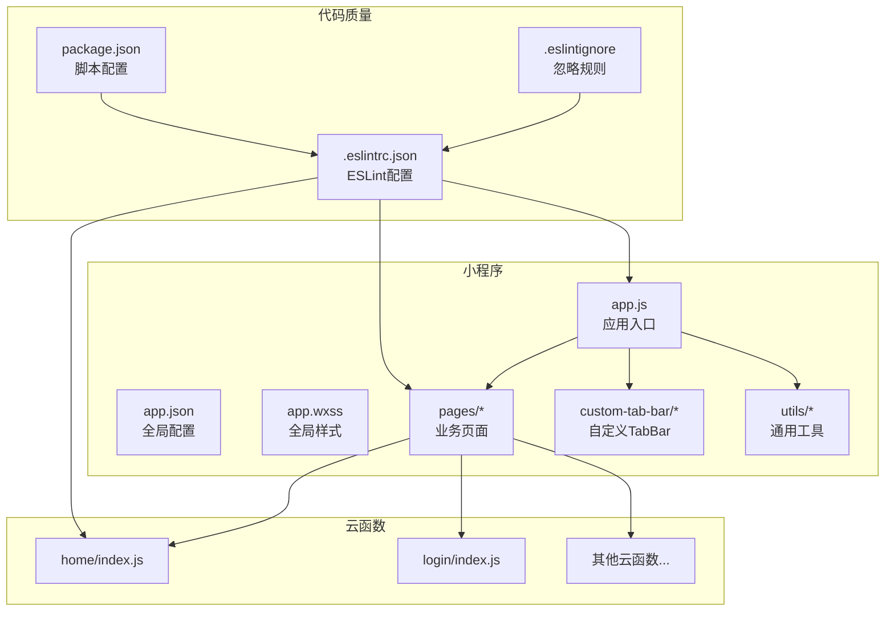
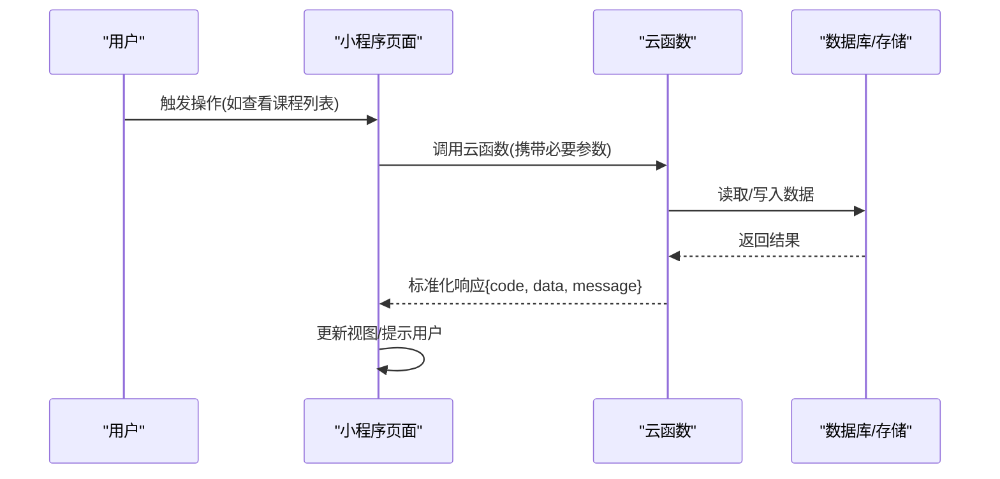
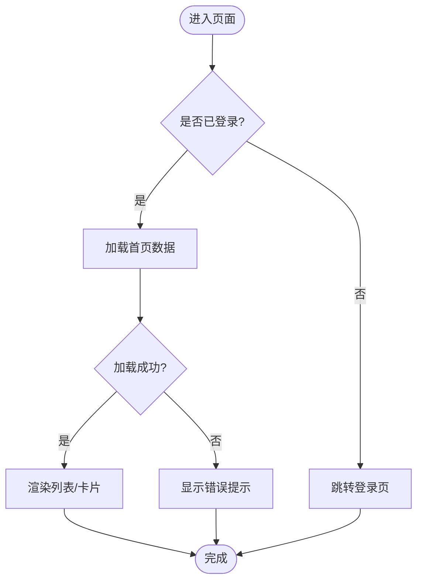
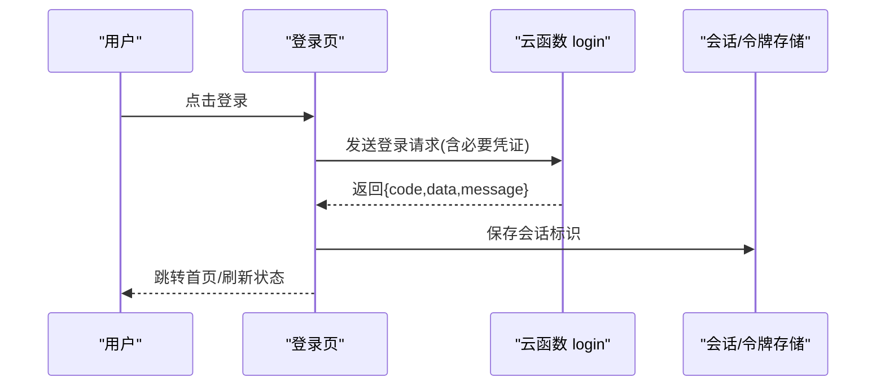
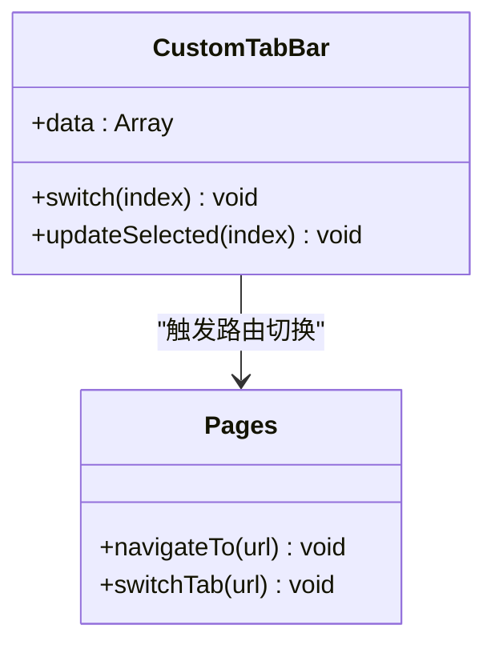
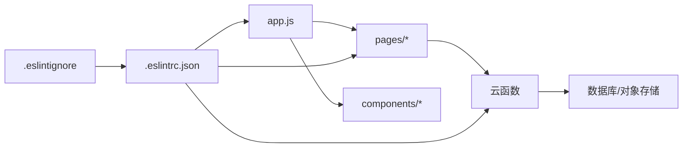

# 代码规范

<cite>
**本文引用的文件**   
- [project.config.json](file://project.config.json)
- [miniprogram/app.js](file://miniprogram/app.js)
- [miniprogram/app.json](file://miniprogram/app.json)
- [miniprogram/app.wxss](file://miniprogram/app.wxss)
- [miniprogram/pages/home/home.js](file://miniprogram/pages/home/home.js)
- [miniprogram/pages/home/home.wxml](file://miniprogram/pages/home/home.wxml)
- [miniprogram/pages/home/home.wxss](file://miniprogram/pages/home/home.wxss)
- [miniprogram/pages/login/login.js](file://miniprogram/pages/login/login.js)
- [miniprogram/custom-tab-bar/index.js](file://miniprogram/custom-tab-bar/index.js)
- [cloudfunctions/home/index.js](file://cloudfunctions/home/index.js)
- [cloudfunctions/login/index.js](file://cloudfunctions/login/index.js)
- [.eslintrc.json](file://.eslintrc.json)
- [.eslintignore](file://.eslintignore)
- [package.json](file://package.json)
</cite>

## 更新摘要
**变更内容**   
- 新增全面的ESLint配置章节，包含ES6+语法支持和项目级代码质量标准
- 添加ESLint忽略模式配置说明，涵盖依赖目录和构建产物
- 更新代码质量检查工具配置部分，集成ESLint规则详解
- 补充自动化代码检查流程与CI/CD集成指南

## 目录
1. [引言](#引言)
2. [项目结构](#项目结构)
3. [核心组件](#核心组件)
4. [架构总览](#架构总览)
5. [详细组件分析](#详细组件分析)
6. [依赖分析](#依赖分析)
7. [性能考虑](#性能考虑)
8. [故障排查指南](#故障排查指南)
9. [结论](#结论)
10. [附录](#附录)

## 引言
本规范旨在统一团队在微信小程序与云函数开发中的编码风格、工程组织与质量保障实践，覆盖以下方面：
- JavaScript 编码约定（变量命名、函数定义、注释格式、错误处理、日志记录）
- 微信小程序开发规范（WXML 模板语法、WXSS 样式组织、JSON 配置）
- 云函数编写标准（API 设计、错误码、日志、幂等与超时）
- **新增** ESLint代码质量检查配置与ES6+语法支持
- 代码质量检查工具配置与自动化测试要求
- 可维护性与一致性保障策略

目标读者包括前端工程师、小程序开发者、后端/云函数开发者以及技术负责人。

## 项目结构
仓库采用"小程序 + 云函数"的常见分层结构：
- miniprogram：小程序客户端，包含页面、自定义组件、全局样式与入口配置
- cloudfunctions：按功能域划分的云函数集合，每个函数独立目录并自带 package.json 与 config.json
- docs：产品与设计文档
- prototype：原型页面
- project.config.json：微信开发者工具工程配置
- **.eslintrc.json：ESLint代码质量检查配置文件**
- **.eslintignore：ESLint忽略规则配置文件**

**图表来源**
- [miniprogram/app.js](file://miniprogram/app.js)
- [miniprogram/app.json](file://miniprogram/app.json)
- [miniprogram/app.wxss](file://miniprogram/app.wxss)
- [miniprogram/pages/home/home.js](file://miniprogram/pages/home/home.js)
- [miniprogram/custom-tab-bar/index.js](file://miniprogram/custom-tab-bar/index.js)
- [cloudfunctions/home/index.js](file://cloudfunctions/home/index.js)
- [cloudfunctions/login/index.js](file://cloudfunctions/login/index.js)
- [.eslintrc.json](file://.eslintrc.json)
- [.eslintignore](file://.eslintignore)
- [package.json](file://package.json)

**章节来源**
- [project.config.json](file://project.config.json)
- [miniprogram/app.js](file://miniprogram/app.js)
- [miniprogram/app.json](file://miniprogram/app.json)
- [miniprogram/app.wxss](file://miniprogram/app.wxss)
- [.eslintrc.json](file://.eslintrc.json)
- [.eslintignore](file://.eslintignore)

## 核心组件
本节聚焦小程序与云函数的关键入口与职责边界，明确各模块的职责与交互契约。

- 小程序入口 app.js
  - 负责应用生命周期初始化、全局状态管理、路由与登录态校验
  - 建议将网络请求、鉴权、埋点等能力抽象为工具或单例服务
- 全局配置 app.json
  - 定义页面路由、窗口外观、底部 TabBar、分包与权限声明
  - 建议将公共样式与字体引入放在 app.wxss
- 页面 home
  - 作为首页示例，展示数据加载、列表渲染与用户交互的基本模式
  - 建议遵循"视图层只负责展示，逻辑层负责数据处理"的原则
- 自定义 TabBar custom-tab-bar
  - 通过自定义组件实现更灵活的导航控制
  - 注意与 pages 的路由联动与选中态同步
- 云函数 home 与 login
  - 提供数据查询与登录认证等后端能力
  - 需遵循统一的入参出参规范、错误码与日志格式

**章节来源**
- [miniprogram/app.js](file://miniprogram/app.js)
- [miniprogram/app.json](file://miniprogram/app.json)
- [miniprogram/pages/home/home.js](file://miniprogram/pages/home/home.js)
- [miniprogram/custom-tab-bar/index.js](file://miniprogram/custom-tab-bar/index.js)
- [cloudfunctions/home/index.js](file://cloudfunctions/home/index.js)
- [cloudfunctions/login/index.js](file://cloudfunctions/login/index.js)

## 架构总览
小程序与云函数之间的典型调用流程如下：

**图表来源**
- [miniprogram/pages/home/home.js](file://miniprogram/pages/home/home.js)
- [cloudfunctions/home/index.js](file://cloudfunctions/home/index.js)
- [cloudfunctions/login/index.js](file://cloudfunctions/login/index.js)

## 详细组件分析

### 小程序页面 home 分析
- 职责
  - 发起数据请求、处理分页与空状态、绑定事件与导航跳转
- 建议
  - 使用 Promise 或 async/await 管理异步流程
  - 对接口失败进行兜底与重试策略
  - 避免在 WXML 中写复杂表达式，尽量在 JS 中预处理数据

**图表来源**
- [miniprogram/pages/home/home.js](file://miniprogram/pages/home/home.js)
- [miniprogram/pages/home/home.wxml](file://miniprogram/pages/home/home.wxml)
- [miniprogram/pages/home/home.wxss](file://miniprogram/pages/home/home.wxss)

**章节来源**
- [miniprogram/pages/home/home.js](file://miniprogram/pages/home/home.js)
- [miniprogram/pages/home/home.wxml](file://miniprogram/pages/home/home.wxml)
- [miniprogram/pages/home/home.wxss](file://miniprogram/pages/home/home.wxss)

### 登录流程分析
- 职责
  - 小程序端获取用户信息并调用云函数完成登录态建立
- 建议
  - 敏感信息不落地本地缓存，必要时加密存储
  - 云函数侧校验签名与时间戳，防止重放攻击

**图表来源**
- [miniprogram/pages/login/login.js](file://miniprogram/pages/login/login.js)
- [cloudfunctions/login/index.js](file://cloudfunctions/login/index.js)

**章节来源**
- [miniprogram/pages/login/login.js](file://miniprogram/pages/login/login.js)
- [cloudfunctions/login/index.js](file://cloudfunctions/login/index.js)

### 自定义 TabBar 组件分析
- 职责
  - 统一管理底部导航项、选中态与路由跳转
- 建议
  - 与 app.json 的 tabBar 配置保持一致
  - 对外暴露切换方法供页面主动更新

**图表来源**
- [miniprogram/custom-tab-bar/index.js](file://miniprogram/custom-tab-bar/index.js)

**章节来源**
- [miniprogram/custom-tab-bar/index.js](file://miniprogram/custom-tab-bar/index.js)

## 依赖分析
- 小程序内部依赖
  - 页面依赖全局配置与自定义组件
  - 页面之间通过路由机制通信，避免直接耦合
- 小程序与云函数依赖
  - 通过云开发 API 调用云函数，保持前后端解耦
  - 接口契约以 JSON 形式约定，便于联调与回归
- **新增** 代码质量检查依赖
  - ESLint配置确保代码风格一致性
  - 忽略规则排除第三方库和构建产物

**图表来源**
- [miniprogram/app.js](file://miniprogram/app.js)
- [miniprogram/pages/home/home.js](file://miniprogram/pages/home/home.js)
- [cloudfunctions/home/index.js](file://cloudfunctions/home/index.js)
- [.eslintrc.json](file://.eslintrc.json)
- [.eslintignore](file://.eslintignore)

**章节来源**
- [miniprogram/app.js](file://miniprogram/app.js)
- [miniprogram/pages/home/home.js](file://miniprogram/pages/home/home.js)
- [cloudfunctions/home/index.js](file://cloudfunctions/home/index.js)
- [.eslintrc.json](file://.eslintrc.json)
- [.eslintignore](file://.eslintignore)

## 性能考虑
- 首屏优化
  - 按需加载与分包，减少主包体积
  - 图片资源压缩与懒加载
- 渲染优化
  - 避免在 WXML 中使用复杂计算，提前在 JS 中处理
  - 合理使用 wx:key 提升列表渲染性能
- 网络优化
  - 合并请求、缓存热点数据、合理设置过期策略
  - 云函数侧增加索引与分页，减少不必要的数据传输
- 内存与稳定性
  - 及时释放定时器与监听器
  - 长列表使用虚拟滚动或分页加载

[本节为通用指导，无需源码引用]

## 故障排查指南
- 常见问题定位
  - 页面空白：检查路由配置与数据加载异常分支
  - 登录失败：核对云函数返回码与小程序端错误提示
  - 样式错乱：确认 WXSS 作用域与类名冲突
- 日志与调试
  - 小程序端使用 console 输出关键路径与参数
  - 云函数侧记录入参、耗时与异常堆栈，便于追踪
- **新增** 代码质量问题排查
  - ESLint报错：根据错误提示修复代码风格问题
  - 忽略规则失效：检查.eslintignore配置是否正确
  - 构建失败：确认ESLint配置与项目环境兼容
- 回滚与降级
  - 接口失败时提供默认数据或友好提示
  - 关键链路具备开关与降级策略

**章节来源**
- [miniprogram/pages/home/home.js](file://miniprogram/pages/home/home.js)
- [cloudfunctions/home/index.js](file://cloudfunctions/home/index.js)
- [cloudfunctions/login/index.js](file://cloudfunctions/login/index.js)
- [.eslintrc.json](file://.eslintrc.json)
- [.eslintignore](file://.eslintignore)

## 结论
通过统一的编码规范、清晰的模块边界与完善的错误处理机制，可显著提升小程序与云函数的可维护性与团队协作效率。**新增的ESLint配置确保了代码风格的一致性和ES6+语法的支持**。建议在 CI 中集成代码检查与基础测试，持续保障代码质量。

[本节为总结性内容，无需源码引用]

## 附录

### JavaScript 编码约定
- 变量命名
  - 常量全大写加下划线；普通变量使用小驼峰；布尔值以 is/has/can 前缀
- 函数定义
  - 优先使用箭头函数表达简洁逻辑；复杂逻辑使用具名函数
  - 参数与返回值类型在注释中说明，保持单一职责
- 注释格式
  - 文件头注释说明用途与作者；函数级 JSDoc 描述入参、返回值与异常
- 错误处理
  - 统一错误码与消息结构；捕获并记录上下文信息
- 日志记录
  - 分级输出（info/warn/error），包含时间、模块、traceId

[本节为通用指导，无需源码引用]

### 微信小程序开发规范
- WXML 模板语法
  - 条件渲染使用 wx:if/wx:elif/wx:else；列表渲染使用 wx:for 并指定 wx:key
  - 事件绑定使用 bind/catch，避免过度嵌套
- WXSS 样式组织
  - 使用 rpx 适配不同屏幕；模块化拆分样式文件，避免全局污染
  - 类名采用语义化命名，避免硬编码颜色与尺寸
- JSON 配置文件
  - app.json 集中管理路由、窗口与权限；页面级 json 仅覆盖必要配置
  - 分包与预加载策略在 app.json 中声明

**章节来源**
- [miniprogram/app.json](file://miniprogram/app.json)
- [miniprogram/pages/home/home.wxml](file://miniprogram/pages/home/home.wxml)
- [miniprogram/pages/home/home.wxss](file://miniprogram/pages/home/home.wxss)

### 云函数编写标准
- API 设计规范
  - 统一入参出参结构：{ code, data, message, traceId }
  - 幂等设计：支持重复调用不产生副作用
- 错误处理标准
  - 区分业务错误与系统错误；返回具体错误码与可读消息
  - 记录异常堆栈与关键上下文，便于线上排查
- 日志记录规范
  - 结构化日志，包含时间、级别、模块、traceId、耗时
  - 敏感信息脱敏，避免泄露用户隐私

**章节来源**
- [cloudfunctions/home/index.js](file://cloudfunctions/home/index.js)
- [cloudfunctions/login/index.js](file://cloudfunctions/login/index.js)

### 代码质量检查工具配置
- **ESLint配置**
  - **新增** 启用ES6+语法支持，包含现代JavaScript特性规则
  - **新增** 微信小程序插件集成，支持小程序特定语法
  - **新增** Node.js环境规则集，适用于云函数开发
  - 强制分号、缩进、行宽、未使用变量检测
  - 配置严格模式，禁止隐式全局变量
- **ESLint忽略规则**
  - **新增** 忽略node_modules依赖目录
  - **新增** 忽略dist、build等构建产物目录
  - **新增** 忽略第三方库和自动生成文件
  - **新增** 忽略测试文件和mock数据
- **Stylelint**
  - 统一 WXSS 缩进、引号、属性顺序与单位规范
- **Commit 钩子**
  - 提交前执行 lint 与格式化，阻止不规范代码入库
- **CI/CD集成**
  - **新增** 在GitHub Actions中集成ESLint检查
  - **新增** 自动阻断不符合规范的代码提交

**章节来源**
- [.eslintrc.json](file://.eslintrc.json)
- [.eslintignore](file://.eslintignore)
- [package.json](file://package.json)

### 自动化测试要求
- 单元测试
  - 对纯函数与工具方法进行覆盖率考核（建议≥80%）
- 集成测试
  - 对关键接口进行端到端验证，模拟登录、数据加载与异常场景
- 持续集成
  - 每次 PR 触发构建、lint 与测试，失败阻断合并
- **新增** 代码质量门禁
  - **新增** ESLint检查作为合并前置条件
  - **新增** 代码覆盖率阈值要求
  - **新增** 安全扫描与依赖漏洞检查

[本节为通用指导，无需源码引用]

### ESLint配置详解
- **ES6+语法支持**
  - 启用const、let、箭头函数、模板字符串等现代语法
  - 支持async/await异步编程模式
  - 启用解构赋值、展开运算符等高级特性
- **代码风格规则**
  - 强制使用单引号，禁止双引号
  - 统一缩进为2个空格
  - 限制行宽为100字符
  - 强制使用分号结尾
- **最佳实践规则**
  - 禁止使用eval()和with语句
  - 要求所有变量在使用前声明
  - 禁止未使用的变量和函数
  - 要求Promise错误处理
- **微信小程序特定规则**
  - 支持小程序API调用
  - 验证WXML模板语法
  - 检查WXSS样式规范

**章节来源**
- [.eslintrc.json](file://.eslintrc.json)
- [.eslintignore](file://.eslintignore)
- [package.json](file://package.json)