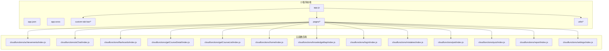
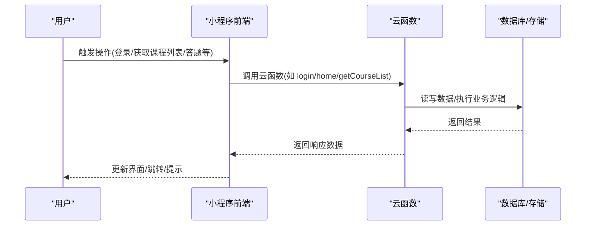
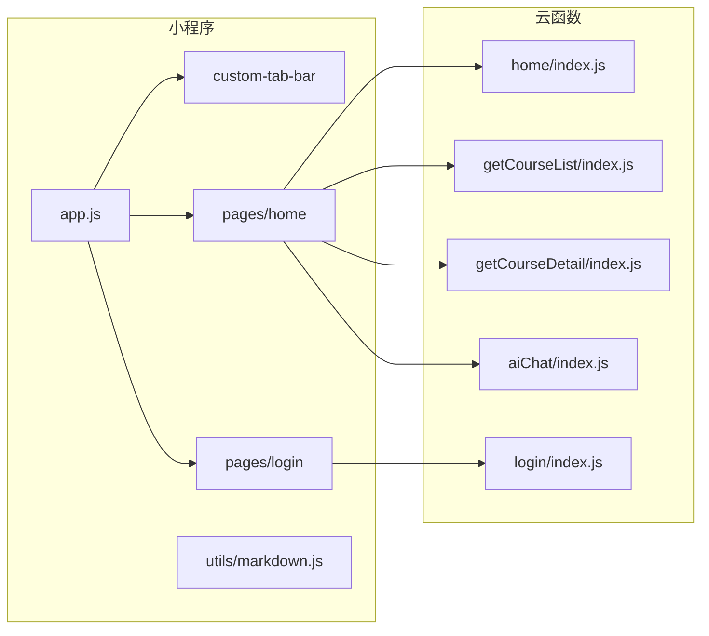

# 开发指南

<cite>
**本文引用的文件**   
- [project.config.json](file://project.config.json)
- [project.private.config.json](file://project.private.config.json)
- [.gitignore](file://.gitignore)
- [miniprogram/app.js](file://miniprogram/app.js)
- [miniprogram/app.json](file://miniprogram/app.json)
- [miniprogram/app.wxss](file://miniprogram/app.wxss)
- [miniprogram/custom-tab-bar/index.js](file://miniprogram/custom-tab-bar/index.js)
- [miniprogram/custom-tab-bar/index.json](file://miniprogram/custom-tab-bar/index.json)
- [miniprogram/custom-tab-bar/index.wxml](file://miniprogram/custom-tab-bar/index.wxml)
- [miniprogram/custom-tab-bar/index.wxss](file://miniprogram/custom-tab-bar/index.wxss)
- [miniprogram/pages/home/home.js](file://miniprogram/pages/home/home.js)
- [miniprogram/pages/login/login.js](file://miniprogram/pages/login/login.js)
- [miniprogram/utils/markdown.js](file://miniprogram/utils/markdown.js)
- [cloudfunctions/achievements/index.js](file://cloudfunctions/achievements/index.js)
- [cloudfunctions/aiChat/index.js](file://cloudfunctions/aiChat/index.js)
- [cloudfunctions/flashcards/index.js](file://cloudfunctions/flashcards/index.js)
- [cloudfunctions/getCourseDetail/index.js](file://cloudfunctions/getCourseDetail/index.js)
- [cloudfunctions/getCourseList/index.js](file://cloudfunctions/getCourseList/index.js)
- [cloudfunctions/home/index.js](file://cloudfunctions/home/index.js)
- [cloudfunctions/knowledgeMap/index.js](file://cloudfunctions/knowledgeMap/index.js)
- [cloudfunctions/login/index.js](file://cloudfunctions/login/index.js)
- [cloudfunctions/mistakes/index.js](file://cloudfunctions/mistakes/index.js)
- [cloudfunctions/pet/index.js](file://cloudfunctions/pet/index.js)
- [cloudfunctions/quiz/index.js](file://cloudfunctions/quiz/index.js)
- [cloudfunctions/report/index.js](file://cloudfunctions/report/index.js)
- [cloudfunctions/settings/index.js](file://cloudfunctions/settings/index.js)
</cite>

## 目录
1. [简介](#简介)
2. [项目结构](#项目结构)
3. [核心组件](#核心组件)
4. [架构总览](#架构总览)
5. [详细组件分析](#详细组件分析)
6. [依赖分析](#依赖分析)
7. [性能考虑](#性能考虑)
8. [故障排查指南](#故障排查指南)
9. [结论](#结论)
10. [附录](#附录)

## 简介
本指南面向贡献者，旨在统一代码风格、文件组织与命名规范，明确 Git 工作流与提交规范，并给出添加新功能、修改现有代码、编写测试用例、进行代码审查的实操流程。同时提供调试技巧、性能优化建议、常见问题解决方案以及配置文件与环境变量管理说明，确保团队协作高效、代码质量一致。

## 项目结构
本项目为微信小程序 + 云函数（CloudBase）形态：
- miniprogram：小程序前端，包含页面、自定义 TabBar、全局样式与工具方法
- cloudfunctions：按功能划分的云函数集合，每个子目录对应一个独立云函数
- docs：产品与设计文档
- prototype：原型页面
- 根级配置：project.config.json、project.private.config.json、.gitignore

图表来源
- [miniprogram/app.js](file://miniprogram/app.js)
- [miniprogram/app.json](file://miniprogram/app.json)
- [miniprogram/custom-tab-bar/index.js](file://miniprogram/custom-tab-bar/index.js)
- [miniprogram/pages/home/home.js](file://miniprogram/pages/home/home.js)
- [miniprogram/pages/login/login.js](file://miniprogram/pages/login/login.js)
- [cloudfunctions/home/index.js](file://cloudfunctions/home/index.js)
- [cloudfunctions/login/index.js](file://cloudfunctions/login/index.js)

章节来源
- [project.config.json](file://project.config.json)
- [project.private.config.json](file://project.private.config.json)
- [.gitignore](file://.gitignore)
- [miniprogram/app.js](file://miniprogram/app.js)
- [miniprogram/app.json](file://miniprogram/app.json)
- [miniprogram/custom-tab-bar/index.js](file://miniprogram/custom-tab-bar/index.js)
- [miniprogram/pages/home/home.js](file://miniprogram/pages/home/home.js)
- [miniprogram/pages/login/login.js](file://miniprogram/pages/login/login.js)

## 核心组件
- 应用入口与生命周期
  - app.js：初始化应用、注册全局状态、启动必要逻辑
  - app.json：全局路由、窗口样式、TabBar 配置等
  - app.wxss：全局样式基线
- 自定义 TabBar
  - custom-tab-bar/*：实现底部导航栏的交互与样式
- 页面模块
  - pages/*：按业务域划分页面，每个页面包含 .js/.json/.wxml/.wxss
- 工具库
  - utils/*：通用工具方法，如 markdown.js 用于渲染 Markdown
- 云函数
  - cloudfunctions/*：每个子目录为一个云函数，对外暴露统一的调用接口

章节来源
- [miniprogram/app.js](file://miniprogram/app.js)
- [miniprogram/app.json](file://miniprogram/app.json)
- [miniprogram/app.wxss](file://miniprogram/app.wxss)
- [miniprogram/custom-tab-bar/index.js](file://miniprogram/custom-tab-bar/index.js)
- [miniprogram/custom-tab-bar/index.json](file://miniprogram/custom-tab-bar/index.json)
- [miniprogram/custom-tab-bar/index.wxml](file://miniprogram/custom-tab-bar/index.wxml)
- [miniprogram/custom-tab-bar/index.wxss](file://miniprogram/custom-tab-bar/index.wxss)
- [miniprogram/pages/home/home.js](file://miniprogram/pages/home/home.js)
- [miniprogram/pages/login/login.js](file://miniprogram/pages/login/login.js)
- [miniprogram/utils/markdown.js](file://miniprogram/utils/markdown.js)

## 架构总览
整体采用“小程序前端 + 云函数后端”的解耦架构。前端通过页面与组件发起请求，云函数处理业务逻辑与数据访问，前后端通过云开发 API 或 HTTP 方式通信。

图表来源
- [miniprogram/pages/login/login.js](file://miniprogram/pages/login/login.js)
- [miniprogram/pages/home/home.js](file://miniprogram/pages/home/home.js)
- [cloudfunctions/login/index.js](file://cloudfunctions/login/index.js)
- [cloudfunctions/home/index.js](file://cloudfunctions/home/index.js)
- [cloudfunctions/getCourseList/index.js](file://cloudfunctions/getCourseList/index.js)

## 详细组件分析

### 应用入口与全局配置
- app.js
  - 负责应用初始化、全局状态管理、错误捕获与埋点
  - 建议在 onLaunch 中完成必要的鉴权与基础资源加载
- app.json
  - 集中管理页面路由、窗口行为、TabBar 配置
  - 新增页面需在 pages 数组中登记，避免运行时路由异常
- app.wxss
  - 定义全局 CSS 变量、基础布局与主题色，保证 UI 一致性

章节来源
- [miniprogram/app.js](file://miniprogram/app.js)
- [miniprogram/app.json](file://miniprogram/app.json)
- [miniprogram/app.wxss](file://miniprogram/app.wxss)

### 自定义 TabBar
- 职责
  - 控制底部导航项的选中态、图标切换与页面跳转
- 关键点
  - index.js 中维护当前选中页路径与切换逻辑
  - index.json 声明为自定义 TabBar 组件
  - index.wxml/index.wxss 负责结构与样式
- 扩展建议
  - 新增 Tab 时同步更新配置与页面路由，保持前后一致

章节来源
- [miniprogram/custom-tab-bar/index.js](file://miniprogram/custom-tab-bar/index.js)
- [miniprogram/custom-tab-bar/index.json](file://miniprogram/custom-tab-bar/index.json)
- [miniprogram/custom-tab-bar/index.wxml](file://miniprogram/custom-tab-bar/index.wxml)
- [miniprogram/custom-tab-bar/index.wxss](file://miniprogram/custom-tab-bar/index.wxss)

### 页面模块（以首页与登录为例）
- home.js
  - 负责首页数据拉取、列表渲染、分页与错误处理
  - 建议将网络请求封装在工具层，页面仅做展示与交互
- login.js
  - 负责登录流程、授权回调、错误提示与跳转
  - 建议对敏感信息做最小化处理，避免日志泄露

章节来源
- [miniprogram/pages/home/home.js](file://miniprogram/pages/home/home.js)
- [miniprogram/pages/login/login.js](file://miniprogram/pages/login/login.js)

### 工具库（Markdown 渲染）
- utils/markdown.js
  - 提供 Markdown 文本到小程序可渲染结构的转换能力
  - 建议增加缓存策略与错误降级，避免渲染阻塞主线程

章节来源
- [miniprogram/utils/markdown.js](file://miniprogram/utils/markdown.js)

### 云函数（按功能域拆分）
- achievements/index.js：成就系统相关逻辑
- aiChat/index.js：AI 对话接口
- flashcards/index.js：闪卡学习逻辑
- getCourseDetail/index.js：课程详情查询
- getCourseList/index.js：课程列表查询
- home/index.js：首页聚合数据
- knowledgeMap/index.js：知识图谱相关
- login/index.js：登录认证
- mistakes/index.js：错题记录
- pet/index.js：宠物系统
- quiz/index.js：测验与答题
- report/index.js：报告生成
- settings/index.js：设置管理

章节来源
- [cloudfunctions/achievements/index.js](file://cloudfunctions/achievements/index.js)
- [cloudfunctions/aiChat/index.js](file://cloudfunctions/aiChat/index.js)
- [cloudfunctions/flashcards/index.js](file://cloudfunctions/flashcards/index.js)
- [cloudfunctions/getCourseDetail/index.js](file://cloudfunctions/getCourseDetail/index.js)
- [cloudfunctions/getCourseList/index.js](file://cloudfunctions/getCourseList/index.js)
- [cloudfunctions/home/index.js](file://cloudfunctions/home/index.js)
- [cloudfunctions/knowledgeMap/index.js](file://cloudfunctions/knowledgeMap/index.js)
- [cloudfunctions/login/index.js](file://cloudfunctions/login/index.js)
- [cloudfunctions/mistakes/index.js](file://cloudfunctions/mistakes/index.js)
- [cloudfunctions/pet/index.js](file://cloudfunctions/pet/index.js)
- [cloudfunctions/quiz/index.js](file://cloudfunctions/quiz/index.js)
- [cloudfunctions/report/index.js](file://cloudfunctions/report/index.js)
- [cloudfunctions/settings/index.js](file://cloudfunctions/settings/index.js)

## 依赖分析
- 前端依赖
  - 小程序原生框架与组件
  - 自定义 TabBar 组件
  - 工具库（markdown.js）
- 后端依赖
  - 各云函数独立运行，彼此解耦
  - 通过云开发数据库/对象存储等基础设施进行数据持久化
- 外部集成
  - AI 对话可能依赖第三方服务（由 aiChat 云函数封装）

图表来源
- [miniprogram/app.js](file://miniprogram/app.js)
- [miniprogram/custom-tab-bar/index.js](file://miniprogram/custom-tab-bar/index.js)
- [miniprogram/pages/home/home.js](file://miniprogram/pages/home/home.js)
- [miniprogram/pages/login/login.js](file://miniprogram/pages/login/login.js)
- [cloudfunctions/home/index.js](file://cloudfunctions/home/index.js)
- [cloudfunctions/login/index.js](file://cloudfunctions/login/index.js)
- [cloudfunctions/getCourseList/index.js](file://cloudfunctions/getCourseList/index.js)
- [cloudfunctions/getCourseDetail/index.js](file://cloudfunctions/getCourseDetail/index.js)
- [cloudfunctions/aiChat/index.js](file://cloudfunctions/aiChat/index.js)

## 性能考虑
- 前端
  - 减少不必要的 setData 调用，合并数据更新
  - 图片与静态资源按需加载，使用合适的尺寸与格式
  - 长列表使用虚拟滚动或分页加载
  - 避免在主线程执行耗时计算，必要时使用 WebWorker
- 云函数
  - 合理设计数据库索引，避免全表扫描
  - 批量操作优于循环单条写入
  - 对第三方 API 调用增加超时与重试策略
  - 输出数据裁剪，只返回必要字段
- 通用
  - 启用压缩与缓存策略
  - 监控关键指标（首屏时间、接口耗时、错误率）

[本节为通用指导，不直接分析具体文件]

## 故障排查指南
- 小程序端
  - 打开开发者工具的 Console 与 Network，定位报错与慢请求
  - 检查 app.json 路由配置是否正确，避免页面未注册
  - 自定义 TabBar 切换无效时，核对选中路径与页面栈
- 云函数端
  - 查看云函数日志，关注异常堆栈与超时
  - 校验入参合法性，避免空指针与类型错误
  - 数据库权限与索引问题会导致查询缓慢或失败
- 常见错误
  - 跨域或域名白名单配置错误
  - 环境变量缺失导致第三方服务调用失败
  - 本地与云端环境不一致导致的差异

章节来源
- [miniprogram/app.json](file://miniprogram/app.json)
- [miniprogram/custom-tab-bar/index.js](file://miniprogram/custom-tab-bar/index.js)
- [cloudfunctions/login/index.js](file://cloudfunctions/login/index.js)
- [cloudfunctions/home/index.js](file://cloudfunctions/home/index.js)

## 结论
遵循本指南的规范与实践，有助于提升团队效率与代码质量。建议在新功能开发与迭代过程中持续完善文档与示例，形成可复用的最佳实践库。

[本节为总结性内容，不直接分析具体文件]

## 附录

### 代码风格约定
- JavaScript
  - 使用 ES6+ 语法；优先 const/let；箭头函数简洁表达
  - 缩进 2 空格；行尾分号可选但需统一
  - 函数与变量使用小驼峰；常量使用大写加下划线
  - 错误处理显式 try/catch 或 Promise 链式 catch
- WXML/WXSS
  - 类名使用短横线分隔（BEM 风格推荐）
  - 样式尽量模块化，避免全局污染
- 注释
  - 复杂逻辑必须注释；公共 API 需说明参数与返回值

[本节为通用指导，不直接分析具体文件]

### 文件组织结构
- 页面：pages/<feature>/<feature>.{js,json,wxml,wxss}
- 组件：components/<component>/<component>.{js,json,wxml,wxss}
- 工具：utils/<tool>.js
- 云函数：cloudfunctions/<function>/index.js
- 配置：根目录 project.config.json 与私有配置 project.private.config.json

章节来源
- [miniprogram/pages/home/home.js](file://miniprogram/pages/home/home.js)
- [miniprogram/utils/markdown.js](file://miniprogram/utils/markdown.js)
- [cloudfunctions/home/index.js](file://cloudfunctions/home/index.js)
- [project.config.json](file://project.config.json)
- [project.private.config.json](file://project.private.config.json)

### 命名规范
- 文件与目录：小写英文，单词间用短横线分隔
- JS 标识符：小驼峰；常量：大写加下划线
- 组件与页面：语义化名称，避免缩写
- 云函数：动词+名词组合，体现功能意图

[本节为通用指导，不直接分析具体文件]

### Git 工作流与提交规范
- 分支模型
  - main：稳定版本
  - develop：开发主干
  - feature/*：功能分支
  - hotfix/*：紧急修复
- 提交信息
  - 格式：<type>(<scope>): <subject>
  - type：feat/fix/docs/style/refactor/test/chore
  - subject：简明扼要，动词开头，不超过 50 字符
- 变更范围
  - 每次提交聚焦单一职责，便于回滚与审查

[本节为通用指导，不直接分析具体文件]

### 如何添加新功能
- 前端
  - 在 pages 下新建页面目录与文件，并在 app.json 中注册路由
  - 如需新 Tab，更新 custom-tab-bar 配置与逻辑
- 后端
  - 在 cloudfunctions 下新增云函数目录，实现 index.js 并部署
- 联调
  - 本地调试小程序与云函数，确认接口契约与错误处理
- 提交与评审
  - 创建 feature 分支，提交后发起 Pull Request，等待审查与合并

章节来源
- [miniprogram/app.json](file://miniprogram/app.json)
- [miniprogram/custom-tab-bar/index.js](file://miniprogram/custom-tab-bar/index.js)
- [cloudfunctions/home/index.js](file://cloudfunctions/home/index.js)

### 如何修改现有代码
- 定位影响范围
  - 通过搜索引用与依赖关系，评估改动面
- 渐进式重构
  - 先抽取公共逻辑，再替换调用方，逐步降低耦合
- 回归验证
  - 覆盖关键路径与边界条件，确保无退化

[本节为通用指导，不直接分析具体文件]

### 编写测试用例
- 单元测试
  - 对工具方法与纯函数编写断言，覆盖正常与异常路径
- 集成测试
  - 模拟云函数调用，验证端到端流程
- 自动化
  - 在 CI 中执行测试，阻断不合格提交

[本节为通用指导，不直接分析具体文件]

### 代码审查清单
- 正确性：逻辑是否完备，边界与异常是否处理
- 可读性：命名清晰、结构合理、注释充分
- 可维护性：低耦合高内聚，避免重复代码
- 安全性：敏感信息不落地、输入校验严格
- 性能：是否存在明显瓶颈与优化空间

[本节为通用指导，不直接分析具体文件]

### 调试技巧
- 小程序端
  - 使用 console.log/warn/error 分级输出
  - 利用开发者工具的 Performance 面板分析耗时
- 云函数端
  - 打印关键步骤日志，标注上下文 ID 便于追踪
  - 对第三方调用增加超时与重试日志

[本节为通用指导，不直接分析具体文件]

### 性能优化方法
- 前端
  - 减少重绘重排，合理使用 wxs 与缓存
  - 图片懒加载与预加载结合
- 云函数
  - 数据库查询条件精准，避免 SELECT *
  - 大对象分片传输与压缩

[本节为通用指导，不直接分析具体文件]

### 常见问题解决方案
- 路由无法跳转
  - 检查 app.json 的 pages 配置与路径拼写
- TabBar 不生效
  - 确认自定义组件声明与路径正确
- 云函数调用失败
  - 核对权限、环境变量与网络白名单

章节来源
- [miniprogram/app.json](file://miniprogram/app.json)
- [miniprogram/custom-tab-bar/index.js](file://miniprogram/custom-tab-bar/index.js)
- [cloudfunctions/login/index.js](file://cloudfunctions/login/index.js)

### 项目配置文件说明与环境变量管理
- project.config.json
  - 项目基础配置，包含项目名称、AppID、编译选项等
- project.private.config.json
  - 本地私有配置，不应提交至仓库
- .gitignore
  - 忽略 node_modules、构建产物与敏感文件
- 环境变量
  - 云函数侧通过 process.env 读取配置
  - 敏感信息建议使用密钥管理服务，避免硬编码

章节来源
- [project.config.json](file://project.config.json)
- [project.private.config.json](file://project.private.config.json)
- [.gitignore](file://.gitignore)