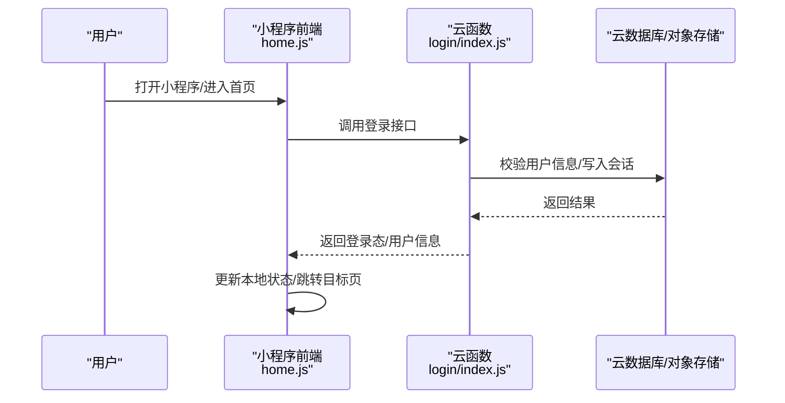
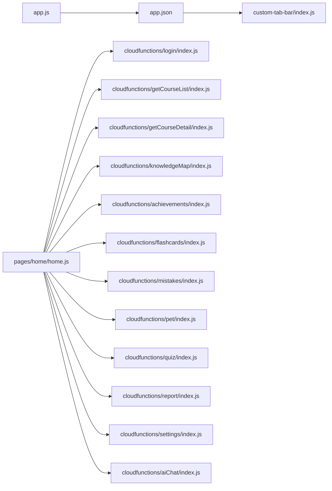

# 开发流程

<cite>
**本文引用的文件**   
- [project.config.json](file://project.config.json)
- [miniprogram/app.js](file://miniprogram/app.js)
- [miniprogram/app.json](file://miniprogram/app.json)
- [miniprogram/custom-tab-bar/index.js](file://miniprogram/custom-tab-bar/index.js)
- [miniprogram/pages/home/home.js](file://miniprogram/pages/home/home.js)
- [cloudfunctions/login/index.js](file://cloudfunctions/login/index.js)
- [cloudfunctions/achievements/index.js](file://cloudfunctions/achievements/index.js)
- [cloudfunctions/flashcards/index.js](file://cloudfunctions/flashcards/index.js)
- [cloudfunctions/getCourseList/index.js](file://cloudfunctions/getCourseList/index.js)
- [cloudfunctions/getCourseDetail/index.js](file://cloudfunctions/getCourseDetail/index.js)
- [cloudfunctions/knowledgeMap/index.js](file://cloudfunctions/knowledgeMap/index.js)
- [cloudfunctions/mistakes/index.js](file://cloudfunctions/mistakes/index.js)
- [cloudfunctions/pet/index.js](file://cloudfunctions/pet/index.js)
- [cloudfunctions/quiz/index.js](file://cloudfunctions/quiz/index.js)
- [cloudfunctions/report/index.js](file://cloudfunctions/report/index.js)
- [cloudfunctions/settings/index.js](file://cloudfunctions/settings/index.js)
- [cloudfunctions/aiChat/index.js](file://cloudfunctions/aiChat/index.js)
- [docs/superpowers/plans/2026-07-17-course-video-knowledge.md](file://docs/superpowers/plans/2026-07-17-course-video-knowledge.md)
- [docs/superpowers/specs/2026-07-17-course-video-knowledge-design.md](file://docs/superpowers/specs/2026-07-17-course-video-knowledge-design.md)
</cite>

## 目录
1. [简介](#简介)
2. [项目结构](#项目结构)
3. [核心组件](#核心组件)
4. [架构总览](#架构总览)
5. [详细组件分析](#详细组件分析)
6. [依赖分析](#依赖分析)
7. [性能考虑](#性能考虑)
8. [故障排查指南](#故障排查指南)
9. [结论](#结论)
10. [附录](#附录)

## 简介
本文件面向团队制定统一的开发工作流程与规范，覆盖Git分支管理、版本控制、代码提交流程、新功能开发步骤、代码审查与合并策略；同时给出项目初始化配置、依赖管理与环境搭建指南；并说明如何添加新页面、新组件与新云函数。文档还包含功能规划文档编写规范与技术设计文档模板，旨在提升团队协作效率与代码质量。

## 项目结构
本项目为微信小程序 + 云开发（CloudBase）的混合工程：
- miniprogram：小程序前端，包含应用入口、全局配置、自定义TabBar与各业务页面。
- cloudfunctions：云函数集合，按业务域划分目录，每个云函数独立package.json与config.json。
- docs：产品与设计文档，包含计划与规格说明。
- prototype：原型文件。
- project.config.json：微信开发者工具工程配置。

```mermaid
graph TB
subgraph "小程序前端"
APP["app.js"]
APPJSON["app.json"]
TABBAR["custom-tab-bar/index.js"]
HOME["pages/home/home.js"]
end
subgraph "云函数"
CF_LOGIN["cloudfunctions/login/index.js"]
CF_ACH["cloudfunctions/achievements/index.js"]
CF_FLASH["cloudfunctions/flashcards/index.js"]
CF_COURSE_LIST["cloudfunctions/getCourseList/index.js"]
CF_COURSE_DETAIL["cloudfunctions/getCourseDetail/index.js"]
CF_KMAP["cloudfunctions/knowledgeMap/index.js"]
CF_MISTAKES["cloudfunctions/mistakes/index.js"]
CF_PET["cloudfunctions/pet/index.js"]
CF_QUIZ["cloudfunctions/quiz/index.js"]
CF_REPORT["cloudfunctions/report/index.js"]
CF_SETTINGS["cloudfunctions/settings/index.js"]
CF_AI["cloudfunctions/aiChat/index.js"]
end
APP --> TABBAR
APP --> HOME
HOME --> CF_LOGIN
HOME --> CF_COURSE_LIST
HOME --> CF_COURSE_DETAIL
HOME --> CF_KMAP
HOME --> CF_ACH
HOME --> CF_FLASH
HOME --> CF_MISTAKES
HOME --> CF_PET
HOME --> CF_QUIZ
HOME --> CF_REPORT
HOME --> CF_SETTINGS
HOME --> CF_AI
```

图表来源
- [miniprogram/app.js](file://miniprogram/app.js)
- [miniprogram/app.json](file://miniprogram/app.json)
- [miniprogram/custom-tab-bar/index.js](file://miniprogram/custom-tab-bar/index.js)
- [miniprogram/pages/home/home.js](file://miniprogram/pages/home/home.js)
- [cloudfunctions/login/index.js](file://cloudfunctions/login/index.js)
- [cloudfunctions/achievements/index.js](file://cloudfunctions/achievements/index.js)
- [cloudfunctions/flashcards/index.js](file://cloudfunctions/flashcards/index.js)
- [cloudfunctions/getCourseList/index.js](file://cloudfunctions/getCourseList/index.js)
- [cloudfunctions/getCourseDetail/index.js](file://cloudfunctions/getCourseDetail/index.js)
- [cloudfunctions/knowledgeMap/index.js](file://cloudfunctions/knowledgeMap/index.js)
- [cloudfunctions/mistakes/index.js](file://cloudfunctions/mistakes/index.js)
- [cloudfunctions/pet/index.js](file://cloudfunctions/pet/index.js)
- [cloudfunctions/quiz/index.js](file://cloudfunctions/quiz/index.js)
- [cloudfunctions/report/index.js](file://cloudfunctions/report/index.js)
- [cloudfunctions/settings/index.js](file://cloudfunctions/settings/index.js)
- [cloudfunctions/aiChat/index.js](file://cloudfunctions/aiChat/index.js)

章节来源
- [project.config.json](file://project.config.json)
- [miniprogram/app.js](file://miniprogram/app.js)
- [miniprogram/app.json](file://miniprogram/app.json)
- [miniprogram/custom-tab-bar/index.js](file://miniprogram/custom-tab-bar/index.js)
- [miniprogram/pages/home/home.js](file://miniprogram/pages/home/home.js)

## 核心组件
- 小程序应用入口与全局配置
  - app.js：应用生命周期与全局状态初始化。
  - app.json：路由、窗口样式、TabBar等全局配置。
  - custom-tab-bar：自定义底部导航逻辑。
- 首页与路由
  - pages/home/home.js：首页逻辑，作为主要跳转入口，调用各云函数完成数据交互。
- 云函数（按业务域）
  - login：登录鉴权相关。
  - achievements：成就系统。
  - flashcards：闪卡学习。
  - getCourseList / getCourseDetail：课程列表与详情。
  - knowledgeMap：知识图谱。
  - mistakes：错题集。
  - pet：宠物系统。
  - quiz：测验。
  - report：报告。
  - settings：设置。
  - aiChat：AI对话。

章节来源
- [miniprogram/app.js](file://miniprogram/app.js)
- [miniprogram/app.json](file://miniprogram/app.json)
- [miniprogram/custom-tab-bar/index.js](file://miniprogram/custom-tab-bar/index.js)
- [miniprogram/pages/home/home.js](file://miniprogram/pages/home/home.js)
- [cloudfunctions/login/index.js](file://cloudfunctions/login/index.js)
- [cloudfunctions/achievements/index.js](file://cloudfunctions/achievements/index.js)
- [cloudfunctions/flashcards/index.js](file://cloudfunctions/flashcards/index.js)
- [cloudfunctions/getCourseList/index.js](file://cloudfunctions/getCourseList/index.js)
- [cloudfunctions/getCourseDetail/index.js](file://cloudfunctions/getCourseDetail/index.js)
- [cloudfunctions/knowledgeMap/index.js](file://cloudfunctions/knowledgeMap/index.js)
- [cloudfunctions/mistakes/index.js](file://cloudfunctions/mistakes/index.js)
- [cloudfunctions/pet/index.js](file://cloudfunctions/pet/index.js)
- [cloudfunctions/quiz/index.js](file://cloudfunctions/quiz/index.js)
- [cloudfunctions/report/index.js](file://cloudfunctions/report/index.js)
- [cloudfunctions/settings/index.js](file://cloudfunctions/settings/index.js)
- [cloudfunctions/aiChat/index.js](file://cloudfunctions/aiChat/index.js)

## 架构总览
整体采用“小程序前端 + 云函数后端”的解耦架构。小程序通过云开发SDK调用对应云函数，云函数负责业务逻辑与数据访问。

图表来源
- [miniprogram/pages/home/home.js](file://miniprogram/pages/home/home.js)
- [cloudfunctions/login/index.js](file://cloudfunctions/login/index.js)

## 详细组件分析

### Git分支管理策略
- 主分支
  - main：稳定发布分支，仅接受来自release或hotfix的合并。
- 发布分支
  - release/vX.Y.Z：用于预发布与测试，冻结非关键变更。
- 修复分支
  - hotfix/*：针对线上紧急问题修复，快速合并至main与release。
- 功能分支
  - feature/*：所有新功能在此分支开发，完成后发起PR/MR。
- 命名规范
  - 分支名使用小写英文与短横线，语义清晰，如 feature/add-flashcard-page。

### 版本控制规范
- 提交信息格式
  - <type>(<scope>): <subject>
  - type：feat, fix, docs, style, refactor, test, chore
  - scope：模块或云函数名，如 home, login, flashcards
  - subject：简洁描述变更目的
- 示例
  - feat(home): 新增课程列表展示
  - fix(login): 修复登录态过期处理
  - chore(flashcards): 升级依赖包

### 代码提交流程
- 拉取最新main分支
- 创建feature分支进行开发
- 自测通过后推送并提交PR/MR
- 至少一名Reviewer审核通过
- 合并到main或release（视发布节奏）
- 打Tag并发布

### 新功能开发步骤
- 需求确认与任务拆分
- 在feature分支实现前后端（小程序页面/组件 + 云函数）
- 本地联调与单元测试
- 提交PR/MR并等待评审
- 合并后验证回归用例

### 代码审查流程
- 必须包含变更影响范围说明
- 检查点
  - 正确性：逻辑与边界条件
  - 可读性：命名、注释、结构
  - 可维护性：模块化与复用
  - 安全性：鉴权、输入校验、敏感信息
  - 性能：避免重复请求、合理缓存
- 评审通过后合并

### 合并策略
- main：保护分支，禁止直接推送
- release：阶段性集成，用于预发布
- hotfix：紧急修复，合并后同步至main与release
- 合并前需通过CI检查（若启用）

### 项目初始化配置
- 使用微信开发者工具导入工程
- 在project.config.json中配置AppID、云开发环境ID、基础库版本等
- 首次运行确保已开通云开发并绑定当前环境

章节来源
- [project.config.json](file://project.config.json)

### 依赖管理
- 云函数依赖
  - 每个云函数目录含package.json与package-lock.json，建议锁定版本
  - 新增依赖需在对应云函数目录执行安装命令并更新锁文件
- 小程序依赖
  - 第三方库优先使用npm构建，保持最小化引入
  - 避免在多个页面重复引入相同逻辑，抽取公共utils

章节来源
- [cloudfunctions/login/package.json](file://cloudfunctions/login/package.json)
- [cloudfunctions/achievements/package.json](file://cloudfunctions/achievements/package.json)
- [cloudfunctions/flashcards/package.json](file://cloudfunctions/flashcards/package.json)
- [cloudfunctions/getCourseList/package.json](file://cloudfunctions/getCourseList/package.json)
- [cloudfunctions/getCourseDetail/package.json](file://cloudfunctions/getCourseDetail/package.json)
- [cloudfunctions/knowledgeMap/package.json](file://cloudfunctions/knowledgeMap/package.json)
- [cloudfunctions/mistakes/package.json](file://cloudfunctions/mistakes/package.json)
- [cloudfunctions/pet/package.json](file://cloudfunctions/pet/package.json)
- [cloudfunctions/quiz/package.json](file://cloudfunctions/quiz/package.json)
- [cloudfunctions/report/package.json](file://cloudfunctions/report/package.json)
- [cloudfunctions/settings/package.json](file://cloudfunctions/settings/package.json)
- [cloudfunctions/aiChat/package.json](file://cloudfunctions/aiChat/package.json)

### 环境搭建指南
- 安装微信开发者工具并登录
- 在project.config.json中配置云开发环境ID
- 在开发者工具中开启云开发并选择对应环境
- 首次部署云函数：右键云函数目录 -> 上传并部署：云端安装依赖

章节来源
- [project.config.json](file://project.config.json)

### 如何添加新页面
- 在miniprogram/pages下新建页面目录，包含js/json/wxml/wxss
- 在app.json的pages数组中添加路由
- 如需加入TabBar，在app.json的tabBar.list中注册
- 在custom-tab-bar中维护选中态与跳转逻辑

章节来源
- [miniprogram/app.json](file://miniprogram/app.json)
- [miniprogram/custom-tab-bar/index.js](file://miniprogram/custom-tab-bar/index.js)

### 如何添加新组件
- 在miniprogram/components下新建组件目录，包含同名js/json/wxml/wxss
- 在页面json中引用组件
- 定义props、methods与事件，保证高内聚低耦合

[本节为通用指导，不直接分析具体文件]

### 如何添加新云函数
- 在cloudfunctions下新建云函数目录，包含index.js、config.json、package.json
- 在index.js中实现API逻辑，遵循统一错误码与返回结构
- 在小程序侧通过云开发SDK调用该云函数
- 部署云函数并在开发者工具中测试

章节来源
- [cloudfunctions/login/index.js](file://cloudfunctions/login/index.js)
- [cloudfunctions/achievements/index.js](file://cloudfunctions/achievements/index.js)
- [cloudfunctions/flashcards/index.js](file://cloudfunctions/flashcards/index.js)
- [cloudfunctions/getCourseList/index.js](file://cloudfunctions/getCourseList/index.js)
- [cloudfunctions/getCourseDetail/index.js](file://cloudfunctions/getCourseDetail/index.js)
- [cloudfunctions/knowledgeMap/index.js](file://cloudfunctions/knowledgeMap/index.js)
- [cloudfunctions/mistakes/index.js](file://cloudfunctions/mistakes/index.js)
- [cloudfunctions/pet/index.js](file://cloudfunctions/pet/index.js)
- [cloudfunctions/quiz/index.js](file://cloudfunctions/quiz/index.js)
- [cloudfunctions/report/index.js](file://cloudfunctions/report/index.js)
- [cloudfunctions/settings/index.js](file://cloudfunctions/settings/index.js)
- [cloudfunctions/aiChat/index.js](file://cloudfunctions/aiChat/index.js)

### 功能规划文档编写规范
- 文档存放位置：docs/superpowers/plans
- 命名规则：YYYY-MM-DD-主题.md
- 内容要点
  - 背景与目标
  - 用户故事与验收标准
  - 范围与约束
  - 里程碑与排期
  - 风险与应对
  - 指标与度量

章节来源
- [docs/superpowers/plans/2026-07-17-course-video-knowledge.md](file://docs/superpowers/plans/2026-07-17-course-video-knowledge.md)

### 技术设计文档模板
- 文档存放位置：docs/superpowers/specs
- 命名规则：YYYY-MM-DD-主题-design.md
- 内容要点
  - 概述与范围
  - 架构与模块划分
  - 接口定义（请求/响应）
  - 数据模型与关系
  - 安全与权限
  - 性能与容量评估
  - 测试策略
  - 上线与回滚方案

章节来源
- [docs/superpowers/specs/2026-07-17-course-video-knowledge-design.md](file://docs/superpowers/specs/2026-07-17-course-video-knowledge-design.md)

## 依赖分析
- 前端依赖
  - 小程序入口与路由由app.js与app.json管理
  - 自定义TabBar由custom-tab-bar/index.js维护
  - 页面间跳转与数据获取集中在home.js作为示例入口
- 后端依赖
  - 各云函数独立部署，彼此无直接依赖，通过小程序统一调用
  - 云函数内部依赖通过各自package.json声明

图表来源
- [miniprogram/app.js](file://miniprogram/app.js)
- [miniprogram/app.json](file://miniprogram/app.json)
- [miniprogram/custom-tab-bar/index.js](file://miniprogram/custom-tab-bar/index.js)
- [miniprogram/pages/home/home.js](file://miniprogram/pages/home/home.js)
- [cloudfunctions/login/index.js](file://cloudfunctions/login/index.js)
- [cloudfunctions/getCourseList/index.js](file://cloudfunctions/getCourseList/index.js)
- [cloudfunctions/getCourseDetail/index.js](file://cloudfunctions/getCourseDetail/index.js)
- [cloudfunctions/knowledgeMap/index.js](file://cloudfunctions/knowledgeMap/index.js)
- [cloudfunctions/achievements/index.js](file://cloudfunctions/achievements/index.js)
- [cloudfunctions/flashcards/index.js](file://cloudfunctions/flashcards/index.js)
- [cloudfunctions/mistakes/index.js](file://cloudfunctions/mistakes/index.js)
- [cloudfunctions/pet/index.js](file://cloudfunctions/pet/index.js)
- [cloudfunctions/quiz/index.js](file://cloudfunctions/quiz/index.js)
- [cloudfunctions/report/index.js](file://cloudfunctions/report/index.js)
- [cloudfunctions/settings/index.js](file://cloudfunctions/settings/index.js)
- [cloudfunctions/aiChat/index.js](file://cloudfunctions/aiChat/index.js)

## 性能考虑
- 减少不必要的网络请求，合并接口或引入缓存
- 云函数幂等设计与重试策略
- 图片与静态资源压缩与CDN加速
- 小程序分包加载与按需引入
- 避免长事务与阻塞操作，异步化处理耗时任务

[本节为通用指导，不直接分析具体文件]

## 故障排查指南
- 常见问题定位
  - 云函数未部署或权限不足：检查云开发环境与函数部署状态
  - 小程序调用失败：核对接口路径、参数与返回结构
  - 路由异常：检查app.json的pages与tabBar配置
- 日志与调试
  - 使用开发者工具控制台查看网络请求与错误堆栈
  - 在云函数中输出必要日志以便追踪
- 回滚与应急
  - 保留最近可用版本标签，必要时回滚至上一稳定版本

[本节为通用指导，不直接分析具体文件]

## 结论
通过统一的分支策略、提交规范、审查流程与文档模板，结合清晰的架构与依赖关系，可有效提升团队协作效率与代码质量。建议在后续迭代中持续完善自动化检查与发布流水线，进一步降低人为失误与回归风险。

## 附录
- 术语表
  - PR/MR：Pull Request / Merge Request
  - CI/CD：持续集成/持续交付
  - 云函数：Serverless函数，承载后端逻辑
- 参考链接
  - 微信开发者工具文档
  - 云开发官方文档

[本节为通用指导，不直接分析具体文件]