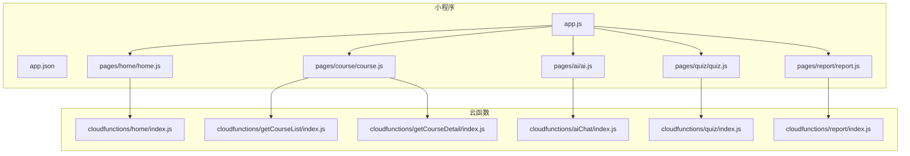
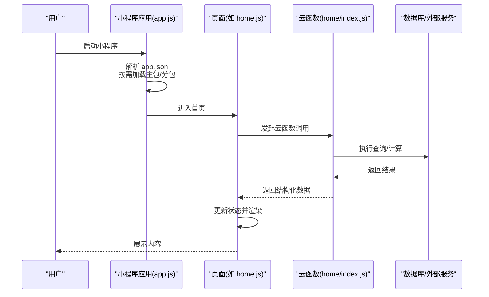
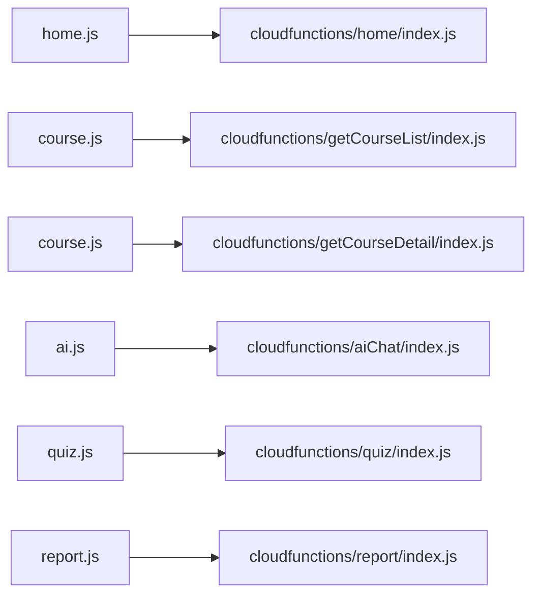

# 性能优化

<cite>
**本文引用的文件**   
- [app.js](file://miniprogram/app.js)
- [app.json](file://miniprogram/app.json)
- [home.js](file://miniprogram/pages/home/home.js)
- [course.js](file://miniprogram/pages/course/course.js)
- [ai.js](file://miniprogram/pages/ai/ai.js)
- [quiz.js](file://miniprogram/pages/quiz/quiz.js)
- [report.js](file://miniprogram/pages/report/report.js)
- [index.js](file://cloudfunctions/home/index.js)
- [index.js](file://cloudfunctions/getCourseList/index.js)
- [index.js](file://cloudfunctions/getCourseDetail/index.js)
- [index.js](file://cloudfunctions/aiChat/index.js)
- [index.js](file://cloudfunctions/quiz/index.js)
- [index.js](file://cloudfunctions/report/index.js)
</cite>

## 目录
1. [简介](#简介)
2. [项目结构](#项目结构)
3. [核心组件](#核心组件)
4. [架构总览](#架构总览)
5. [详细组件分析](#详细组件分析)
6. [依赖分析](#依赖分析)
7. [性能考虑](#性能考虑)
8. [故障排查指南](#故障排查指南)
9. [结论](#结论)
10. [附录](#附录)

## 简介
本指南面向小程序与云函数协同的“学习/课程/测验/报告”类应用，围绕加载速度、渲染性能、内存管理、图片资源、分包与懒加载、云函数与数据库查询、缓存策略、网络请求与压缩、CDN 使用、性能监控与瓶颈定位、用户体验优化等方面，提供可落地的优化建议与实践路径。目标是在保证功能完整性的前提下，显著提升首屏体验、交互流畅度与资源利用率。

## 项目结构
本项目采用“小程序前端 + 云函数后端”的典型架构：
- 小程序端包含多个页面（首页、课程、AI、测验、报告等），以及自定义 TabBar 与通用工具。
- 云函数按业务域拆分（首页、课程列表/详情、AI 对话、测验、报告等），每个云函数独立配置与入口。

图表来源
- [app.js](file://miniprogram/app.js)
- [app.json](file://miniprogram/app.json)
- [home.js](file://miniprogram/pages/home/home.js)
- [course.js](file://miniprogram/pages/course/course.js)
- [ai.js](file://miniprogram/pages/ai/ai.js)
- [quiz.js](file://miniprogram/pages/quiz/quiz.js)
- [report.js](file://miniprogram/pages/report/report.js)
- [index.js](file://cloudfunctions/home/index.js)
- [index.js](file://cloudfunctions/getCourseList/index.js)
- [index.js](file://cloudfunctions/getCourseDetail/index.js)
- [index.js](file://cloudfunctions/aiChat/index.js)
- [index.js](file://cloudfunctions/quiz/index.js)
- [index.js](file://cloudfunctions/report/index.js)

章节来源
- [app.js](file://miniprogram/app.js)
- [app.json](file://miniprogram/app.json)

## 核心组件
- 应用启动与全局配置：负责初始化、路由与基础能力注册，影响冷启动时间与首屏资源加载。
- 页面模块：首页、课程、AI、测验、报告等，各自承担数据获取、渲染与交互逻辑。
- 云函数：按领域拆分的服务端逻辑，承载数据聚合、计算与外部服务调用。

章节来源
- [app.js](file://miniprogram/app.js)
- [home.js](file://miniprogram/pages/home/home.js)
- [course.js](file://miniprogram/pages/course/course.js)
- [ai.js](file://miniprogram/pages/ai/ai.js)
- [quiz.js](file://miniprogram/pages/quiz/quiz.js)
- [report.js](file://miniprogram/pages/report/report.js)

## 架构总览
下图展示从用户打开小程序到页面渲染的关键链路，包括分包加载、云函数调用与数据返回流程。

图表来源
- [app.js](file://miniprogram/app.js)
- [app.json](file://miniprogram/app.json)
- [home.js](file://miniprogram/pages/home/home.js)
- [index.js](file://cloudfunctions/home/index.js)

## 详细组件分析

### 首页模块（home）
- 职责：聚合首页所需数据，控制列表/卡片渲染，处理分页与滚动加载。
- 性能要点：
  - 列表虚拟化或分片渲染，避免一次性渲染过多节点。
  - 图片懒加载与占位图，减少首屏带宽占用。
  - 云函数侧做必要的数据裁剪与排序过滤，降低传输体积。
  - 本地缓存热点数据，缩短二次访问时延。

章节来源
- [home.js](file://miniprogram/pages/home/home.js)
- [index.js](file://cloudfunctions/home/index.js)

### 课程模块（course）
- 职责：课程列表与详情页的数据获取、缓存与展示。
- 性能要点：
  - 列表页仅拉取摘要字段，详情页再按需拉取富文本/视频元信息。
  - 对课程封面进行尺寸适配与 WebP/AVIF 格式优先。
  - 使用 CDN 加速静态资源，开启缓存头。
  - 长列表使用虚拟滚动或分页加载。

章节来源
- [course.js](file://miniprogram/pages/course/course.js)
- [index.js](file://cloudfunctions/getCourseList/index.js)
- [index.js](file://cloudfunctions/getCourseDetail/index.js)

### AI 对话模块（ai）
- 职责：发起对话请求、流式/分段接收响应、增量渲染消息。
- 性能要点：
  - 将大段文本分块渲染，避免阻塞 UI 线程。
  - 对历史会话做本地持久化与增量同步。
  - 云函数侧限制单次上下文长度，必要时做摘要压缩。

章节来源
- [ai.js](file://miniprogram/pages/ai/ai.js)
- [index.js](file://cloudfunctions/aiChat/index.js)

### 测验模块（quiz）
- 职责：题目加载、作答记录、提交与结果统计。
- 性能要点：
  - 预取下一题以减少等待。
  - 批量提交答案，减少网络往返。
  - 云函数侧聚合统计，避免在客户端重复计算。

章节来源
- [quiz.js](file://miniprogram/pages/quiz/quiz.js)
- [index.js](file://cloudfunctions/quiz/index.js)

### 报告模块（report）
- 职责：汇总学习数据、生成可视化报表。
- 性能要点：
  - 服务端聚合指标，客户端只负责展示。
  - 大数据量图表采用分页/抽样渲染。
  - 导出文件走异步任务与回调通知。

章节来源
- [report.js](file://miniprogram/pages/report/report.js)
- [index.js](file://cloudfunctions/report/index.js)

## 依赖分析
- 小程序与云函数通过 API 网关/云开发 SDK 通信，耦合点集中在各页面的数据获取逻辑与对应云函数入口。
- 潜在风险：
  - 页面与云函数一一对应可能导致调用链过长，需关注超时与重试策略。
  - 大量并发请求可能触发限流，需要合并与去抖。

图表来源
- [home.js](file://miniprogram/pages/home/home.js)
- [course.js](file://miniprogram/pages/course/course.js)
- [ai.js](file://miniprogram/pages/ai/ai.js)
- [quiz.js](file://miniprogram/pages/quiz/quiz.js)
- [report.js](file://miniprogram/pages/report/report.js)
- [index.js](file://cloudfunctions/home/index.js)
- [index.js](file://cloudfunctions/getCourseList/index.js)
- [index.js](file://cloudfunctions/getCourseDetail/index.js)
- [index.js](file://cloudfunctions/aiChat/index.js)
- [index.js](file://cloudfunctions/quiz/index.js)
- [index.js](file://cloudfunctions/report/index.js)

## 性能考虑

### 小程序加载优化
- 分包与懒加载
  - 将非首屏页面放入分包，主包仅保留首页与关键路由。
  - 使用条件编译与延迟初始化，避免不必要的插件/库加载。
  - 对大型第三方库按需引入，或使用轻量替代方案。
- 首屏渲染
  - 骨架屏与占位图提升感知速度。
  - 首屏数据并行获取，失败降级为默认内容。
- 资源体积
  - 移除未使用的样式与脚本。
  - 启用小程序构建压缩与 Tree-shaking。

章节来源
- [app.json](file://miniprogram/app.json)
- [app.js](file://miniprogram/app.js)

### 渲染性能提升
- 列表与长页面
  - 使用虚拟列表/分页加载，减少 DOM 节点数量。
  - 避免频繁 setData 大对象，尽量增量更新。
- 动画与交互
  - 优先使用 CSS 动画与原生组件，减少 JS 驱动重排。
  - 节流/防抖高频事件（滚动、输入）。
- 图片与媒体
  - 使用合适尺寸与格式（WebP/AVIF），按需加载与懒加载。
  - 视频/音频使用流式播放与预缓冲策略。

章节来源
- [home.js](file://miniprogram/pages/home/home.js)
- [course.js](file://miniprogram/pages/course/course.js)

### 内存管理最佳实践
- 及时释放
  - 页面卸载时清理定时器、监听器与缓存引用。
  - 避免闭包持有大对象引用导致无法回收。
- 数据结构
  - 使用弱引用集合保存临时对象。
  - 避免循环引用与过深的嵌套结构。
- 大图与媒体
  - 解码后及时释放原始 Buffer。
  - 控制同时在线的高清媒体数量。

章节来源
- [ai.js](file://miniprogram/pages/ai/ai.js)
- [quiz.js](file://miniprogram/pages/quiz/quiz.js)

### 图片资源优化
- 格式与尺寸
  - 优先 WebP/AVIF，提供回退 PNG/JPG。
  - 根据设备像素比输出多分辨率图，避免过度缩放。
- 传输与缓存
  - 使用 CDN 并设置合理缓存头。
  - 启用 HTTP/2 与 Brotli/Gzip 压缩。
- 加载策略
  - 懒加载、渐进式加载与占位图。
  - 视口外图片延迟下载。

章节来源
- [course.js](file://miniprogram/pages/course/course.js)

### 代码分包策略
- 按页面/功能域划分分包，确保主包小于平台限制。
- 公共逻辑下沉至 utils 或子包共享目录，避免重复打包。
- 动态导入与按需加载，减少初始体积。

章节来源
- [app.json](file://miniprogram/app.json)

### 懒加载实现
- 路由级懒加载：进入页面再加载资源。
- 组件级懒加载：可视区域再挂载重型组件。
- 数据级懒加载：先展示骨架，再逐步填充。

章节来源
- [home.js](file://miniprogram/pages/home/home.js)
- [course.js](file://miniprogram/pages/course/course.js)

### 云函数性能调优
- 代码层面
  - 减少不必要的 I/O 与外部调用；批量化操作。
  - 复用连接与实例，避免重复初始化。
  - 使用索引与投影，缩小返回字段。
- 运行时
  - 合理设置内存与超时，避免冷启动抖动。
  - 预热与常驻实例策略（结合平台能力）。
- 错误与重试
  - 幂等设计，指数退避重试，熔断与降级。

章节来源
- [index.js](file://cloudfunctions/home/index.js)
- [index.js](file://cloudfunctions/getCourseList/index.js)
- [index.js](file://cloudfunctions/getCourseDetail/index.js)
- [index.js](file://cloudfunctions/aiChat/index.js)
- [index.js](file://cloudfunctions/quiz/index.js)
- [index.js](file://cloudfunctions/report/index.js)

### 数据库查询优化
- 索引与筛选
  - 为常用查询字段建立复合索引。
  - 使用投影仅返回必要字段。
- 分页与游标
  - 基于游标的分页避免深翻页。
  - 限制单页大小，避免大事务。
- 聚合与缓存
  - 复杂统计在服务端聚合，客户端只消费结果。
  - 热点数据加缓存层（Redis/内存表）。

章节来源
- [index.js](file://cloudfunctions/getCourseList/index.js)
- [index.js](file://cloudfunctions/getCourseDetail/index.js)
- [index.js](file://cloudfunctions/report/index.js)

### 缓存策略设计
- 多级缓存
  - 本地缓存（短期）、云端缓存（中期）、源站（长期）。
- 失效与一致性
  - 基于版本号/时间戳的强一致策略。
  - 写扩散与读扩散权衡，必要时采用旁路缓存。
- 命中率与容量
  - 监控命中率与淘汰率，调整 TTL 与容量上限。

章节来源
- [home.js](file://miniprogram/pages/home/home.js)
- [course.js](file://miniprogram/pages/course/course.js)

### 网络请求优化
- 合并与去抖
  - 合并多次小请求为大请求。
  - 输入与滚动事件去抖节流。
- 重试与降级
  - 指数退避重试，失败快速降级为离线/默认数据。
- 协议与压缩
  - 启用 HTTP/2、Gzip/Brotli。
  - 使用 JSON 最小化与字段裁剪。

章节来源
- [ai.js](file://miniprogram/pages/ai/ai.js)
- [quiz.js](file://miniprogram/pages/quiz/quiz.js)

### 数据压缩与传输
- 序列化
  - 使用更紧凑的编码（如 MessagePack）用于内部通道。
- 传输
  - 开启服务端压缩，客户端解压。
  - 对大文档分块传输与断点续传。

章节来源
- [report.js](file://miniprogram/pages/report/report.js)

### CDN 使用建议
- 静态资源统一上 CDN，开启边缘缓存与版本化 URL。
- 针对图片/视频启用自适应码率与转码。
- 配合浏览器/小程序缓存头，提高命中。

章节来源
- [course.js](file://miniprogram/pages/course/course.js)

### 性能监控指标
- 启动与首屏
  - 冷/热启动耗时、首屏渲染时间、FCP/LCP。
- 交互与渲染
  - 帧率、掉帧率、JS 执行时长、布局抖动。
- 资源与网络
  - 请求数、带宽、缓存命中率、错误率。
- 云函数与数据库
  - 冷启动次数、平均/尾延迟、吞吐、错误码分布。

章节来源
- [app.js](file://miniprogram/app.js)
- [home.js](file://miniprogram/pages/home/home.js)

### 瓶颈分析方法
- 分层定位
  - 前端：Performance/Waterfall、内存快照、堆差异。
  - 网络：抓包分析握手、TTFB、传输耗时。
  - 后端：云函数日志、慢查询、锁竞争。
- 压测与回归
  - 构造典型场景压测，对比优化前后指标。
  - 建立性能基线与告警阈值。

章节来源
- [ai.js](file://miniprogram/pages/ai/ai.js)
- [index.js](file://cloudfunctions/aiChat/index.js)

### 用户体验优化技巧
- 反馈与进度
  - 骨架屏、进度条、空态引导。
- 容错与离线
  - 网络异常提示与重试按钮，离线可用核心功能。
- 无障碍与可读性
  - 字体与对比度、键盘导航、屏幕阅读器支持。

章节来源
- [home.js](file://miniprogram/pages/home/home.js)
- [report.js](file://miniprogram/pages/report/report.js)

## 故障排查指南
- 常见问题
  - 首屏卡顿：检查首屏数据量与渲染复杂度，启用分页与懒加载。
  - 内存泄漏：排查定时器/监听器未清理、闭包引用大对象。
  - 云函数超时：优化查询与外部调用，增加重试与降级。
  - 图片加载慢：确认 CDN 配置与缓存头，启用压缩与多分辨率。
- 诊断步骤
  - 收集指标：启动时间、TTFB、LCP、错误率。
  - 复现场景：最小化用例复现，隔离问题范围。
  - 验证修复：A/B 对比，回归测试覆盖关键路径。

章节来源
- [home.js](file://miniprogram/pages/home/home.js)
- [course.js](file://miniprogram/pages/course/course.js)
- [ai.js](file://miniprogram/pages/ai/ai.js)
- [quiz.js](file://miniprogram/pages/quiz/quiz.js)
- [report.js](file://miniprogram/pages/report/report.js)
- [index.js](file://cloudfunctions/home/index.js)
- [index.js](file://cloudfunctions/getCourseList/index.js)
- [index.js](file://cloudfunctions/getCourseDetail/index.js)
- [index.js](file://cloudfunctions/aiChat/index.js)
- [index.js](file://cloudfunctions/quiz/index.js)
- [index.js](file://cloudfunctions/report/index.js)

## 结论
通过系统化的加载优化、渲染提速、内存治理、资源与网络优化、云函数与数据库调优、缓存设计与监控体系，可显著提升小程序的整体性能与用户体验。建议在迭代中持续度量关键指标，建立性能基线与回归机制，确保优化成果稳定落地。

## 附录
- 术语
  - LCP：最大内容绘制
  - TTFB：首字节时间
  - FC/FP：首次/可见绘制
- 参考清单
  - 分包与懒加载配置
  - 云函数超时与内存参数
  - CDN 缓存策略模板
  - 性能埋点字段定义