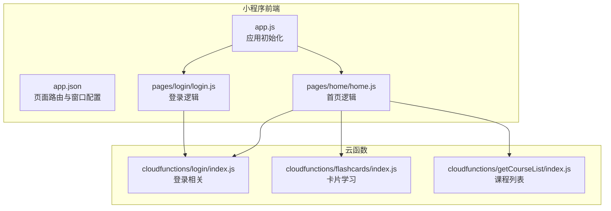
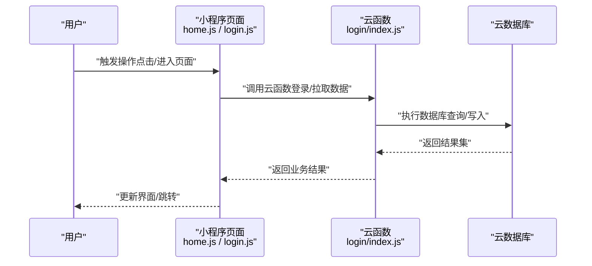
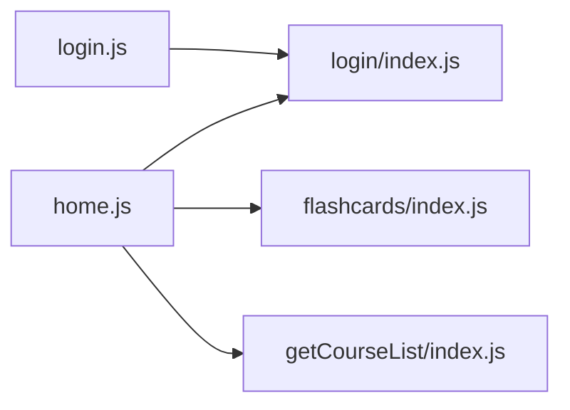

# 调试指南

<cite>
**本文引用的文件**   
- [project.config.json](file://project.config.json)
- [miniprogram/app.js](file://miniprogram/app.js)
- [miniprogram/app.json](file://miniprogram/app.json)
- [miniprogram/pages/home/home.js](file://miniprogram/pages/home/home.js)
- [miniprogram/pages/login/login.js](file://miniprogram/pages/login/login.js)
- [cloudfunctions/login/index.js](file://cloudfunctions/login/index.js)
- [cloudfunctions/flashcards/index.js](file://cloudfunctions/flashcards/index.js)
- [cloudfunctions/getCourseList/index.js](file://cloudfunctions/getCourseList/index.js)
</cite>

## 目录
1. [简介](#简介)
2. [项目结构](#项目结构)
3. [核心组件](#核心组件)
4. [架构总览](#架构总览)
5. [详细组件分析](#详细组件分析)
6. [依赖分析](#依赖分析)
7. [性能考虑](#性能考虑)
8. [故障排查指南](#故障排查指南)
9. [结论](#结论)
10. [附录](#附录)

## 简介
本指南面向小程序开发者，围绕“开发者工具使用、云函数调试、网络请求调试、日志与错误监控、数据库查询优化、API 调用与第三方服务集成调试、移动端兼容性与真机调试、性能分析与内存泄漏检测”等主题，提供系统化、可操作的实践方法。文档结合当前仓库中的小程序前端与云函数入口，给出基于实际代码结构的定位思路与排障路径。

## 项目结构
本项目采用典型的小程序 + 云开发（云函数）结构：
- miniprogram：小程序前端页面与全局配置
- cloudfunctions：按功能划分的云函数目录，每个函数包含 index.js、package.json、config.json 等
- docs、prototype：设计与原型资料
- project.config.json：项目级配置（如基础库版本、调试开关等）

图表来源
- [miniprogram/app.js:1-200](file://miniprogram/app.js#L1-L200)
- [miniprogram/app.json:1-200](file://miniprogram/app.json#L1-L200)
- [miniprogram/pages/home/home.js:1-200](file://miniprogram/pages/home/home.js#L1-L200)
- [miniprogram/pages/login/login.js:1-200](file://miniprogram/pages/login/login.js#L1-L200)
- [cloudfunctions/login/index.js:1-200](file://cloudfunctions/login/index.js#L1-L200)
- [cloudfunctions/flashcards/index.js:1-200](file://cloudfunctions/flashcards/index.js#L1-L200)
- [cloudfunctions/getCourseList/index.js:1-200](file://cloudfunctions/getCourseList/index.js#L1-L200)

章节来源
- [project.config.json:1-200](file://project.config.json#L1-L200)
- [miniprogram/app.js:1-200](file://miniprogram/app.js#L1-L200)
- [miniprogram/app.json:1-200](file://miniprogram/app.json#L1-L200)

## 核心组件
- 应用初始化与生命周期
  - app.js：负责应用启动、全局状态、插件/能力初始化、异常捕获与上报入口。
  - app.json：定义页面路由、窗口样式、底部 tab 栏等，影响页面加载顺序与渲染行为。
- 关键页面
  - home.js：首页业务逻辑，通常作为数据聚合与导航入口，涉及多模块云函数调用。
  - login.js：登录流程，常与云函数 login 协作完成鉴权与会话建立。
- 云函数
  - login/index.js：处理登录、用户信息获取或会话管理。
  - flashcards/index.js：卡片学习相关的数据读写与计算。
  - getCourseList/index.js：课程列表查询与分页/过滤。

章节来源
- [miniprogram/app.js:1-200](file://miniprogram/app.js#L1-L200)
- [miniprogram/app.json:1-200](file://miniprogram/app.json#L1-L200)
- [miniprogram/pages/home/home.js:1-200](file://miniprogram/pages/home/home.js#L1-L200)
- [miniprogram/pages/login/login.js:1-200](file://miniprogram/pages/login/login.js#L1-L200)
- [cloudfunctions/login/index.js:1-200](file://cloudfunctions/login/index.js#L1-L200)
- [cloudfunctions/flashcards/index.js:1-200](file://cloudfunctions/flashcards/index.js#L1-L200)
- [cloudfunctions/getCourseList/index.js:1-200](file://cloudfunctions/getCourseList/index.js#L1-L200)

## 架构总览
下图展示从页面到云函数的典型调用链，便于理解调试切入点与日志落点。

图表来源
- [miniprogram/pages/home/home.js:1-200](file://miniprogram/pages/home/home.js#L1-L200)
- [miniprogram/pages/login/login.js:1-200](file://miniprogram/pages/login/login.js#L1-L200)
- [cloudfunctions/login/index.js:1-200](file://cloudfunctions/login/index.js#L1-L200)

## 详细组件分析

### 小程序开发者工具使用技巧
- 控制台与断点
  - 在 Pages 的 .js 文件中设置断点，观察变量变化与调用栈。
  - 使用 Console 面板查看日志输出与错误堆栈；注意区分 warn/error/fatal。
- 网络面板
  - 查看 wx.request 或云函数调用的请求头、响应体、耗时与错误码。
  - 对失败请求进行重放与参数对比，快速定位前后端不一致问题。
- 性能面板
  - 使用 Performance 面板录制首屏与交互过程，关注长任务、布局抖动与渲染耗时。
  - 结合 Memory 面板进行快照对比，识别未释放引用导致的内存增长。
- 模拟器与真机
  - 优先在真机上复现 UI 与性能问题；开启“不校验合法域名”仅用于本地调试。
  - 使用“预览/体验版”覆盖不同微信版本与设备类型，验证兼容性。

章节来源
- [miniprogram/app.js:1-200](file://miniprogram/app.js#L1-L200)
- [miniprogram/pages/home/home.js:1-200](file://miniprogram/pages/home/home.js#L1-L200)
- [miniprogram/pages/login/login.js:1-200](file://miniprogram/pages/login/login.js#L1-L200)

### 云函数调试方法
- 本地调试
  - 使用开发者工具的“云开发”面板选择对应云函数，传入模拟事件进行单步调试。
  - 通过 console.log 输出关键参数与中间结果，配合断点检查执行路径。
- 远程调试
  - 部署后在云函数运行日志中检索关键字，结合小程序侧的请求 ID 关联两端日志。
- 常见问题
  - 权限不足：检查云函数 role 与集合权限策略。
  - 超时：拆分复杂逻辑、增加索引、减少不必要字段读取。
  - 依赖缺失：确认 package.json 与 node_modules 同步。

章节来源
- [cloudfunctions/login/index.js:1-200](file://cloudfunctions/login/index.js#L1-L200)
- [cloudfunctions/flashcards/index.js:1-200](file://cloudfunctions/flashcards/index.js#L1-L200)
- [cloudfunctions/getCourseList/index.js:1-200](file://cloudfunctions/getCourseList/index.js#L1-L200)

### 网络请求调试
- 统一封装
  - 建议在 utils 层封装请求拦截器，集中记录入参、出参与耗时，并统一错误处理。
- 抓包与回放
  - 使用开发者工具 Network 面板导出请求，核对签名、时间戳、token 等安全字段。
- 重试与降级
  - 对幂等接口实现指数退避重试；非关键链路增加降级策略与缓存兜底。

章节来源
- [miniprogram/pages/home/home.js:1-200](file://miniprogram/pages/home/home.js#L1-L200)
- [miniprogram/pages/login/login.js:1-200](file://miniprogram/pages/login/login.js#L1-L200)

### 日志记录最佳实践
- 分级与上下文
  - 将日志分为 debug/info/warn/error，附带 traceId、userId、page、action 等上下文。
- 脱敏与采样
  - 避免记录敏感信息；高频日志采用采样策略，降低存储与传输成本。
- 集中收集
  - 将错误与关键指标上报至统一平台，便于告警与趋势分析。

章节来源
- [miniprogram/app.js:1-200](file://miniprogram/app.js#L1-L200)

### 错误监控方案
- 全局捕获
  - 在应用启动时注册全局错误捕获，汇总 Promise 未处理拒绝与运行时异常。
- 上报与回溯
  - 上报内容包含错误堆栈、环境信息、最近操作序列；支持按 traceId 串联前后端日志。
- 告警与回滚
  - 设定阈值触发告警；重大缺陷具备灰度发布与快速回滚能力。

章节来源
- [miniprogram/app.js:1-200](file://miniprogram/app.js#L1-L200)

### 问题定位技巧
- 二分法缩小范围
  - 通过注释/开关逐步关闭无关逻辑，快速定位根因模块。
- 最小复现
  - 构造最小用例与输入，确保每次变更都能稳定复现。
- 证据链
  - 保留请求 ID、时间戳、前后端日志片段，形成完整证据链。

[本节为通用方法论，不直接分析具体文件]

### 数据库查询优化
- 索引设计
  - 为常用查询条件建立复合索引；避免全表扫描。
- 字段裁剪
  - 只返回必要字段，减少数据传输与序列化开销。
- 分页与游标
  - 大数据量场景使用分页或游标，避免一次性加载过多数据。
- 聚合与缓存
  - 热点数据引入缓存层；复杂统计使用聚合管道，但需评估执行成本。

章节来源
- [cloudfunctions/getCourseList/index.js:1-200](file://cloudfunctions/getCourseList/index.js#L1-L200)
- [cloudfunctions/flashcards/index.js:1-200](file://cloudfunctions/flashcards/index.js#L1-L200)

### API 调用调试
- 契约校验
  - 明确接口版本、字段类型与必填项；前后端共同维护契约文档。
- 幂等与重试
  - 对写操作保证幂等；网络抖动场景合理重试并去抖。
- 超时与熔断
  - 设置合理超时；下游不稳定时启用熔断与降级。

章节来源
- [miniprogram/pages/home/home.js:1-200](file://miniprogram/pages/home/home.js#L1-L200)
- [miniprogram/pages/login/login.js:1-200](file://miniprogram/pages/login/login.js#L1-L200)

### 第三方服务集成调试
- 沙箱与白名单
  - 使用沙箱账号与 IP 白名单隔离测试流量。
- 回调与幂等
  - 对异步回调做幂等处理；记录回调报文以便对账。
- 限流与降级
  - 遵循第三方限流策略；失败时走本地缓存或离线模式。

[本节为通用方法论，不直接分析具体文件]

### 移动端兼容性与真机调试
- 版本矩阵
  - 覆盖主流微信版本与 iOS/Android 机型，关注差异 API 与渲染表现。
- 真机联调
  - 使用“真机调试”实时查看日志与性能；必要时抓取系统日志辅助定位。
- 适配要点
  - 注意刘海屏、安全区域、字体缩放与深色模式下的显示一致性。

章节来源
- [miniprogram/app.json:1-200](file://miniprogram/app.json#L1-L200)

### 性能分析与内存泄漏检测
- 性能分析
  - 使用 Performance 面板录制关键路径，关注主线程阻塞与频繁重绘。
- 内存泄漏
  - 使用 Memory 面板进行 Heap Snapshot 对比，查找未被释放的对象与闭包引用。
- 优化建议
  - 减少 setData 频率与数据体积；按需加载与懒渲染；避免在循环中创建大对象。

章节来源
- [miniprogram/pages/home/home.js:1-200](file://miniprogram/pages/home/home.js#L1-L200)

## 依赖分析
- 前端依赖
  - 页面逻辑依赖全局配置与公共工具；云函数调用集中在业务页面中。
- 云函数依赖
  - 各云函数独立部署，依赖各自 package.json 声明的第三方包。
- 潜在耦合
  - 若多处页面重复封装相同请求逻辑，建议抽取至公共模块以降低耦合。

图表来源
- [miniprogram/pages/home/home.js:1-200](file://miniprogram/pages/home/home.js#L1-L200)
- [miniprogram/pages/login/login.js:1-200](file://miniprogram/pages/login/login.js#L1-L200)
- [cloudfunctions/login/index.js:1-200](file://cloudfunctions/login/index.js#L1-L200)
- [cloudfunctions/flashcards/index.js:1-200](file://cloudfunctions/flashcards/index.js#L1-L200)
- [cloudfunctions/getCourseList/index.js:1-200](file://cloudfunctions/getCourseList/index.js#L1-L200)

章节来源
- [miniprogram/pages/home/home.js:1-200](file://miniprogram/pages/home/home.js#L1-L200)
- [miniprogram/pages/login/login.js:1-200](file://miniprogram/pages/login/login.js#L1-L200)
- [cloudfunctions/login/index.js:1-200](file://cloudfunctions/login/index.js#L1-L200)
- [cloudfunctions/flashcards/index.js:1-200](file://cloudfunctions/flashcards/index.js#L1-L200)
- [cloudfunctions/getCourseList/index.js:1-200](file://cloudfunctions/getCourseList/index.js#L1-L200)

## 性能考虑
- 首屏优化
  - 预加载关键资源；延迟非关键脚本与图片；骨架屏提升感知速度。
- 渲染优化
  - 控制 setData 粒度与频率；合理使用虚拟列表与分页。
- 网络优化
  - 合并请求、启用压缩与缓存；CDN 加速静态资源。
- 后端优化
  - 云函数冷启动优化（精简依赖、按需引入）；数据库查询加索引与投影。

[本节为通用指导，不直接分析具体文件]

## 故障排查指南
- 登录失败
  - 检查小程序端 token 传递与有效期；核对云函数鉴权逻辑与数据库用户状态。
- 数据为空或异常
  - 核对云函数返回结构与前端解析逻辑；检查数据库权限与索引命中情况。
- 性能劣化
  - 通过 Performance/Memory 面板定位瓶颈；结合云函数运行日志分析慢查询。
- 第三方服务异常
  - 查看回调与签名校验；在沙箱环境复现并比对报文差异。

章节来源
- [miniprogram/pages/login/login.js:1-200](file://miniprogram/pages/login/login.js#L1-L200)
- [cloudfunctions/login/index.js:1-200](file://cloudfunctions/login/index.js#L1-L200)
- [cloudfunctions/getCourseList/index.js:1-200](file://cloudfunctions/getCourseList/index.js#L1-L200)

## 结论
通过规范化的日志与错误监控、完善的性能分析与内存检测、以及针对云函数与数据库的优化策略，可以显著提升问题定位效率与线上稳定性。建议将上述实践沉淀为团队规范，并在 CI/CD 中加入自动化检查与回归用例，持续保障质量。

[本节为总结性内容，不直接分析具体文件]

## 附录
- 常用命令与快捷键
  - 断点、步进、查看调用栈、表达式求值等。
- 参考链接
  - 开发者工具文档、云开发文档、性能分析指南。

[本节为补充信息，不直接分析具体文件]