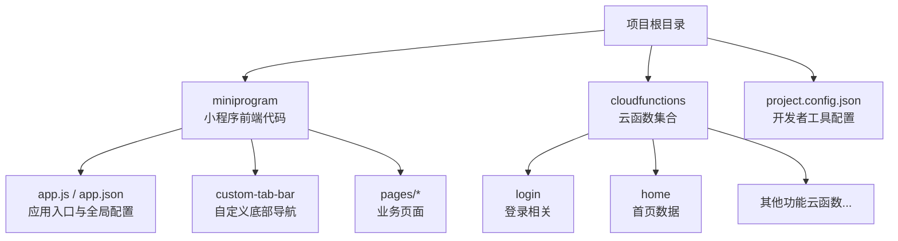
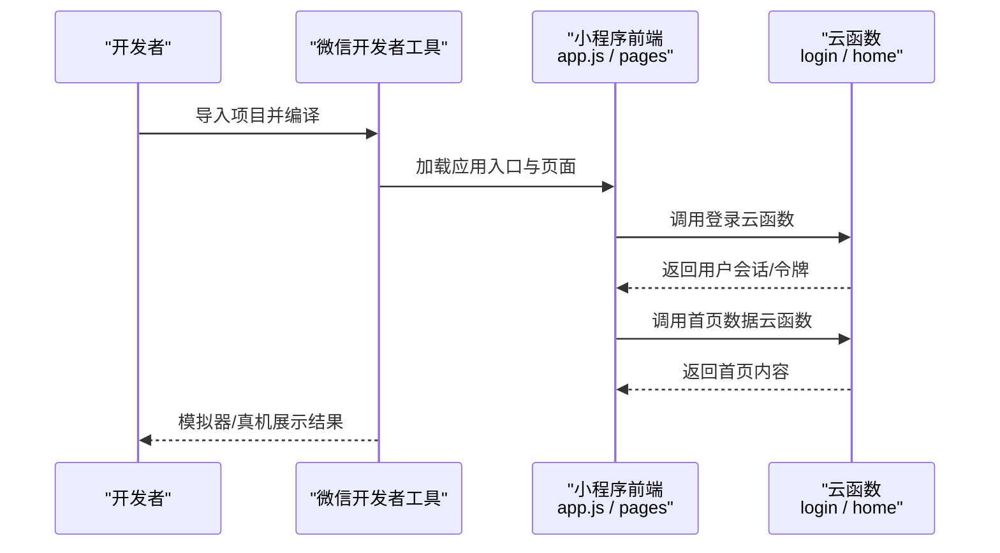

# 快速开始

<cite>
**本文引用的文件**   
- [project.config.json](file://project.config.json)
- [miniprogram/app.js](file://miniprogram/app.js)
- [miniprogram/app.json](file://miniprogram/app.json)
- [miniprogram/custom-tab-bar/index.js](file://miniprogram/custom-tab-bar/index.js)
- [cloudfunctions/login/index.js](file://cloudfunctions/login/index.js)
- [cloudfunctions/home/index.js](file://cloudfunctions/home/index.js)
</cite>

## 目录
1. [简介](#简介)
2. [项目结构](#项目结构)
3. [环境准备](#环境准备)
4. [克隆与配置](#克隆与配置)
5. [云开发初始化](#云开发初始化)
6. [本地调试与运行](#本地调试与运行)
7. [常见问题与故障排除](#常见问题与故障排除)
8. [结论](#结论)

## 简介
本指南面向首次接触“生物学习小程序”的开发者，目标是帮助你在最短时间内完成环境准备、项目克隆、云开发初始化与本地调试，并理解小程序的基本结构与关键入口。文档同时提供常见问题的排查建议，确保你能够顺利运行项目并进行二次开发。

## 项目结构
本项目采用微信小程序标准工程结构，包含前端页面与自定义 TabBar，以及多个云函数模块（如登录、首页、错题、测验等）。核心要点：
- 小程序根目录位于 miniprogram，包含 app.js、app.json、pages 与 components 等标准目录。
- 自定义底部导航栏位于 miniprogram/custom-tab-bar。
- 云函数位于 cloudfunctions，每个功能对应一个子目录，内含 index.js、package.json 与 config.json。
- 项目级配置文件为 project.config.json，用于微信开发者工具的项目设置。

图表来源
- [project.config.json](file://project.config.json)
- [miniprogram/app.js](file://miniprogram/app.js)
- [miniprogram/app.json](file://miniprogram/app.json)
- [miniprogram/custom-tab-bar/index.js](file://miniprogram/custom-tab-bar/index.js)
- [cloudfunctions/login/index.js](file://cloudfunctions/login/index.js)
- [cloudfunctions/home/index.js](file://cloudfunctions/home/index.js)

章节来源
- [project.config.json](file://project.config.json)
- [miniprogram/app.js](file://miniprogram/app.js)
- [miniprogram/app.json](file://miniprogram/app.json)
- [miniprogram/custom-tab-bar/index.js](file://miniprogram/custom-tab-bar/index.js)
- [cloudfunctions/login/index.js](file://cloudfunctions/login/index.js)
- [cloudfunctions/home/index.js](file://cloudfunctions/home/index.js)

## 环境准备
- 安装微信开发者工具
  - 下载并安装最新稳定版微信开发者工具。
  - 启动后使用微信扫码登录，并确保已创建或选择正确的“小程序”项目类型。
- Node.js 版本要求
  - 若需要本地构建或管理云函数依赖，建议使用 Node.js LTS 版本（例如 v16.x 或更高）。
  - 在终端执行 node -v 确认版本；如需切换版本，可使用 nvm 等版本管理工具。
- 网络与权限
  - 确保网络可访问微信云服务。
  - 首次使用需在开发者工具中开启“云开发”能力并授权。

[本节为通用环境说明，不直接分析具体文件]

## 克隆与配置
- 克隆仓库
  - 将项目克隆到本地工作目录。
- 使用开发者工具打开项目
  - 打开微信开发者工具，选择“导入项目”，指向项目根目录。
  - 工具会自动读取 project.config.json 中的项目信息。
- 基础配置检查
  - 在 project.config.json 中确认 AppID、项目名称、编译选项等是否与你创建的微信小程一致。
  - 若未填写 AppID，请在开发者工具中绑定你的小程序 AppID。

章节来源
- [project.config.json](file://project.config.json)

## 云开发初始化
- 在开发者工具中启用云开发
  - 打开“云开发”面板，按提示完成环境创建或选择已有环境。
  - 记录环境 ID，后续云函数部署与调用需使用该环境。
- 上传并部署云函数
  - 在开发者工具中选择 cloudfunctions 目录，右键选择“上传并部署：云端安装依赖”。
  - 等待所有云函数上传成功。
- 校验云函数可用性
  - 可在小程序端调用示例云函数进行验证，如登录与首页数据接口。

章节来源
- [cloudfunctions/login/index.js](file://cloudfunctions/login/index.js)
- [cloudfunctions/home/index.js](file://cloudfunctions/home/index.js)

## 本地调试与运行
- 启动预览与真机调试
  - 点击开发者工具的“编译”按钮，即可在模拟器中运行。
  - 使用“真机调试”可在真实设备上测试登录与云函数调用。
- 关键入口与流程
  - 小程序应用入口：miniprogram/app.js
  - 全局配置与页面注册：miniprogram/app.json
  - 自定义底部导航：miniprogram/custom-tab-bar/index.js
  - 登录流程通常先调用登录云函数，成功后再请求首页数据。

图表来源
- [miniprogram/app.js](file://miniprogram/app.js)
- [miniprogram/app.json](file://miniprogram/app.json)
- [miniprogram/custom-tab-bar/index.js](file://miniprogram/custom-tab-bar/index.js)
- [cloudfunctions/login/index.js](file://cloudfunctions/login/index.js)
- [cloudfunctions/home/index.js](file://cloudfunctions/home/index.js)

章节来源
- [miniprogram/app.js](file://miniprogram/app.js)
- [miniprogram/app.json](file://miniprogram/app.json)
- [miniprogram/custom-tab-bar/index.js](file://miniprogram/custom-tab-bar/index.js)
- [cloudfunctions/login/index.js](file://cloudfunctions/login/index.js)
- [cloudfunctions/home/index.js](file://cloudfunctions/home/index.js)

## 常见问题与故障排除
- 无法连接云开发
  - 检查开发者工具是否已启用云开发并选择了正确环境。
  - 确认网络可用且未受防火墙限制。
- 云函数上传失败
  - 确认 Node.js 版本满足依赖要求。
  - 重新执行“上传并部署：云端安装依赖”，观察控制台错误日志。
- 登录失败或无权限
  - 检查登录云函数是否正确部署。
  - 确认小程序 AppID 与云环境绑定关系正确。
- 页面空白或白屏
  - 查看 app.json 中页面路径是否正确注册。
  - 检查自定义 TabBar 的配置与样式是否正常加载。
- 真机调试异常
  - 确认手机与电脑在同一网络下。
  - 在开发者工具中查看“调试器”的网络与云函数调用日志。

[本节为通用问题排查建议，不直接分析具体文件]

## 结论
通过本指南，你已完成环境准备、项目克隆、云开发初始化与本地调试，并对小程序的关键入口与基本结构有了清晰认识。接下来可以基于现有页面与云函数进行功能扩展与优化。建议在开发过程中充分利用开发者工具的调试能力，关注云函数日志与网络请求，以便快速定位与解决问题。