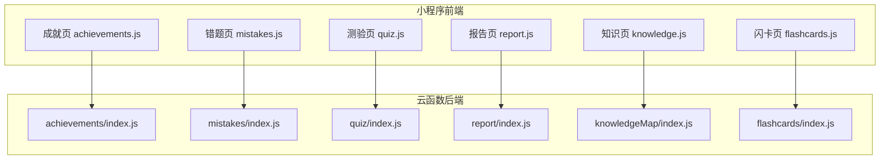
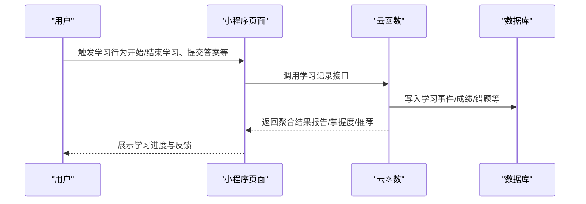
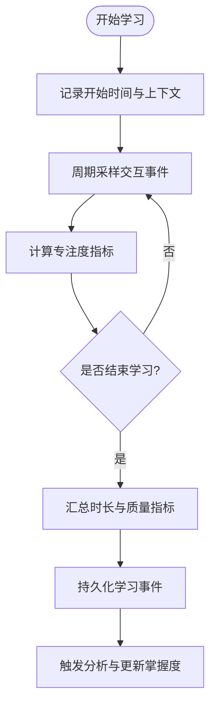
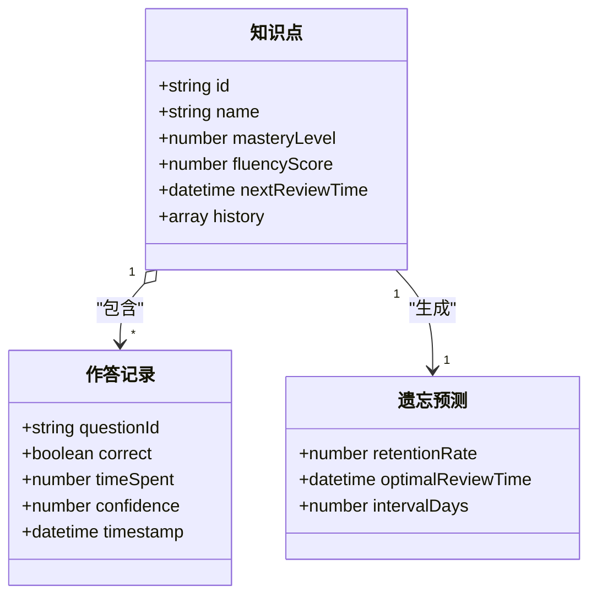
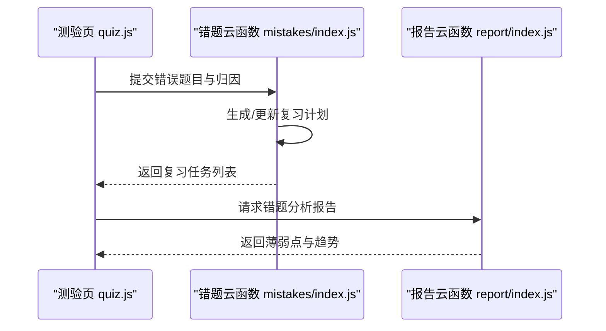
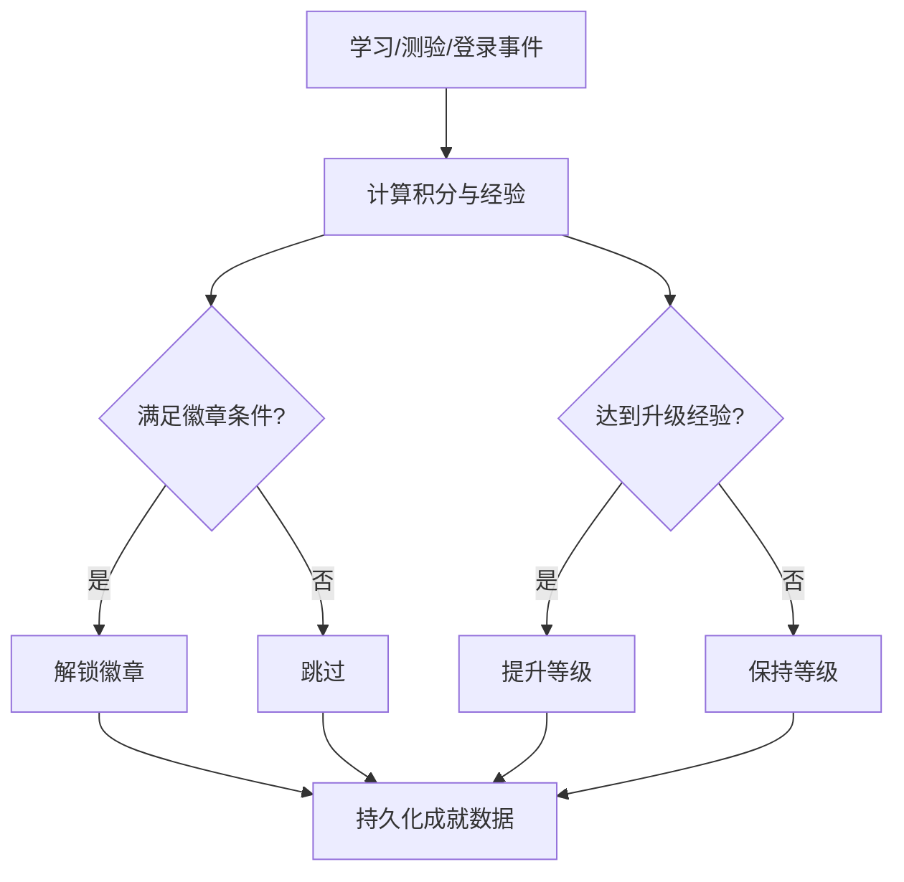
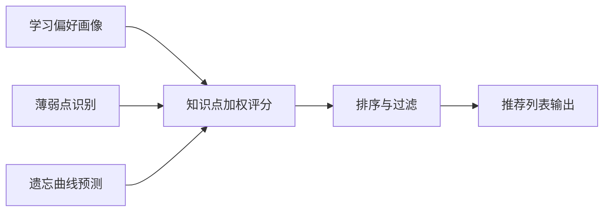
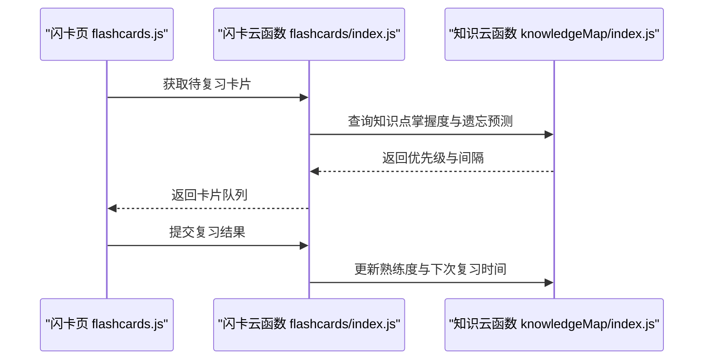
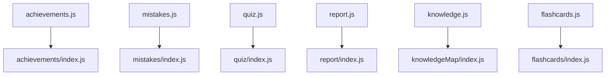

# 学习进度数据模型

<cite>
**本文引用的文件**   
- [cloudfunctions/achievements/index.js](file://cloudfunctions/achievements/index.js)
- [cloudfunctions/mistakes/index.js](file://cloudfunctions/mistakes/index.js)
- [cloudfunctions/quiz/index.js](file://cloudfunctions/quiz/index.js)
- [cloudfunctions/report/index.js](file://cloudfunctions/report/index.js)
- [cloudfunctions/knowledgeMap/index.js](file://cloudfunctions/knowledgeMap/index.js)
- [cloudfunctions/flashcards/index.js](file://cloudfunctions/flashcards/index.js)
- [miniprogram/pages/achievements/achievements.js](file://miniprogram/pages/achievements/achievements.js)
- [miniprogram/pages/mistakes/mistakes.js](file://miniprogram/pages/mistakes/mistakes.js)
- [miniprogram/pages/quiz/quiz.js](file://miniprogram/pages/quiz/quiz.js)
- [miniprogram/pages/report/report.js](file://miniprogram/pages/report/report.js)
- [miniprogram/pages/knowledge/knowledge.js](file://miniprogram/pages/knowledge/knowledge.js)
- [miniprogram/pages/flashcards/flashcards.js](file://miniprogram/pages/flashcards/flashcards.js)
- [miniprogram/app.json](file://miniprogram/app.json)
</cite>

## 目录
1. [简介](#简介)
2. [项目结构](#项目结构)
3. [核心组件](#核心组件)
4. [架构总览](#架构总览)
5. [详细组件分析](#详细组件分析)
6. [依赖关系分析](#依赖关系分析)
7. [性能考虑](#性能考虑)
8. [故障排查指南](#故障排查指南)
9. [结论](#结论)
10. [附录](#附录)

## 简介
本文件围绕“学习进度数据模型”进行系统化说明，覆盖以下关键领域：
- 学习行为记录的数据结构：学习时间、学习时长、学习频率、专注度指标等
- 知识掌握度评估模型：知识点掌握等级、熟练度曲线、遗忘曲线预测
- 错题本数据结构：错误题目关联、错误原因分析、复习计划安排
- 学习成就系统的数据模型：徽章解锁条件、等级提升规则、积分累计机制
- 个性化推荐算法的数据基础：学习偏好分析、薄弱环节识别
- 面向开发者的实现指导：学习数据分析、趋势预测与智能推荐的落地建议

## 项目结构
本项目采用小程序前端 + 云函数后端的分层组织方式。与学习进度相关的主要模块包括：
- 成就系统（achievements）
- 错题本（mistakes）
- 测验与答题（quiz）
- 学习报告与分析（report）
- 知识图谱/地图（knowledgeMap）
- 闪卡记忆（flashcards）
- 对应的前端页面用于展示与交互

图表来源
- [miniprogram/pages/achievements/achievements.js](file://miniprogram/pages/achievements/achievements.js)
- [miniprogram/pages/mistakes/mistakes.js](file://miniprogram/pages/mistakes/mistakes.js)
- [miniprogram/pages/quiz/quiz.js](file://miniprogram/pages/quiz/quiz.js)
- [miniprogram/pages/report/report.js](file://miniprogram/pages/report/report.js)
- [miniprogram/pages/knowledge/knowledge.js](file://miniprogram/pages/knowledge/knowledge.js)
- [miniprogram/pages/flashcards/flashcards.js](file://miniprogram/pages/flashcards/flashcards.js)
- [cloudfunctions/achievements/index.js](file://cloudfunctions/achievements/index.js)
- [cloudfunctions/mistakes/index.js](file://cloudfunctions/mistakes/index.js)
- [cloudfunctions/quiz/index.js](file://cloudfunctions/quiz/index.js)
- [cloudfunctions/report/index.js](file://cloudfunctions/report/index.js)
- [cloudfunctions/knowledgeMap/index.js](file://cloudfunctions/knowledgeMap/index.js)
- [cloudfunctions/flashcards/index.js](file://cloudfunctions/flashcards/index.js)

章节来源
- [miniprogram/app.json](file://miniprogram/app.json)

## 核心组件
本节聚焦学习进度相关的核心数据模型与处理逻辑，按功能域划分：
- 学习行为记录：时间戳、学习时长、频次统计、专注度指标
- 知识掌握度评估：掌握等级、熟练度曲线、遗忘曲线预测
- 错题本：错误题目关联、错误原因、复习计划
- 成就系统：徽章、等级、积分
- 个性化推荐：偏好画像、薄弱点识别、推荐策略输入

章节来源
- [cloudfunctions/achievements/index.js](file://cloudfunctions/achievements/index.js)
- [cloudfunctions/mistakes/index.js](file://cloudfunctions/mistakes/index.js)
- [cloudfunctions/quiz/index.js](file://cloudfunctions/quiz/index.js)
- [cloudfunctions/report/index.js](file://cloudfunctions/report/index.js)
- [cloudfunctions/knowledgeMap/index.js](file://cloudfunctions/knowledgeMap/index.js)
- [cloudfunctions/flashcards/index.js](file://cloudfunctions/flashcards/index.js)

## 架构总览
整体数据流从前端页面发起请求到云函数，云函数负责持久化与计算，再返回聚合结果供前端渲染。

图表来源
- [cloudfunctions/report/index.js](file://cloudfunctions/report/index.js)
- [cloudfunctions/quiz/index.js](file://cloudfunctions/quiz/index.js)
- [cloudfunctions/mistakes/index.js](file://cloudfunctions/mistakes/index.js)
- [cloudfunctions/achievements/index.js](file://cloudfunctions/achievements/index.js)

## 详细组件分析

### 学习行为记录数据模型
- 学习目标：记录每次学习会话的起止时间、学习时长、学习内容维度（课程/知识点）、学习频率与专注度指标，为后续分析与推荐提供基础。
- 关键字段建议：
  - 时间类：开始时间、结束时间、时区、设备信息
  - 时长类：学习时长（秒/分钟）、有效学习时长（剔除中断）
  - 频次类：日/周/月活跃天数、连续学习天数
  - 专注度类：交互密度（点击/滑动/作答次数）、分心事件计数、注意力评分
  - 内容类：课程ID、知识点ID、题型、难度标签
- 典型流程：
  - 开始学习：记录开始时间与上下文
  - 过程采样：周期性上报交互事件，用于计算专注度
  - 结束学习：汇总时长与质量指标，落库并触发后续分析

图表来源
- [cloudfunctions/report/index.js](file://cloudfunctions/report/index.js)
- [cloudfunctions/quiz/index.js](file://cloudfunctions/quiz/index.js)

章节来源
- [cloudfunctions/report/index.js](file://cloudfunctions/report/index.js)
- [cloudfunctions/quiz/index.js](file://cloudfunctions/quiz/index.js)

### 知识掌握度评估模型
- 目标：基于测验与练习结果，量化知识点掌握程度，支持可视化熟练度曲线与遗忘预测。
- 核心概念：
  - 掌握等级：如未接触、初学、熟悉、掌握、精通等离散等级
  - 熟练度曲线：随时间衰减与巩固的连续值，受复习间隔影响
  - 遗忘曲线预测：根据艾宾浩斯或自适应间隔，预测下次最佳复习时机
- 数据要点：
  - 知识点ID、历史作答序列、正确率、用时、置信度
  - 最近一次掌握等级、熟练度得分、下次复习时间
- 更新策略：
  - 答对且用时短：提升熟练度与掌握等级
  - 答错或用时过长：降低熟练度，触发复习计划
  - 间隔重复：依据遗忘曲线动态调整复习间隔

图表来源
- [cloudfunctions/knowledgeMap/index.js](file://cloudfunctions/knowledgeMap/index.js)
- [cloudfunctions/quiz/index.js](file://cloudfunctions/quiz/index.js)

章节来源
- [cloudfunctions/knowledgeMap/index.js](file://cloudfunctions/knowledgeMap/index.js)
- [cloudfunctions/quiz/index.js](file://cloudfunctions/quiz/index.js)

### 错题本数据结构
- 目标：结构化记录错误题目、错误原因与复习计划，形成闭环改进路径。
- 关键字段：
  - 题目关联：题目ID、所属知识点、难度、题型
  - 错误原因：概念不清、粗心、审题失误、方法不当等分类
  - 复习计划：首次错误时间、已复习次数、下次复习时间、复习状态
  - 表现指标：错误耗时、重试正确率、进步趋势
- 流程要点：
  - 错误捕获：在答题过程中标记错误并归因
  - 计划生成：基于遗忘曲线与错误严重度设定复习间隔
  - 复习追踪：记录每次复习结果，动态调整计划优先级

图表来源
- [cloudfunctions/mistakes/index.js](file://cloudfunctions/mistakes/index.js)
- [cloudfunctions/report/index.js](file://cloudfunctions/report/index.js)
- [miniprogram/pages/quiz/quiz.js](file://miniprogram/pages/quiz/quiz.js)
- [miniprogram/pages/mistakes/mistakes.js](file://miniprogram/pages/mistakes/mistakes.js)

章节来源
- [cloudfunctions/mistakes/index.js](file://cloudfunctions/mistakes/index.js)
- [cloudfunctions/report/index.js](file://cloudfunctions/report/index.js)
- [miniprogram/pages/quiz/quiz.js](file://miniprogram/pages/quiz/quiz.js)
- [miniprogram/pages/mistakes/mistakes.js](file://miniprogram/pages/mistakes/mistakes.js)

### 学习成就系统数据模型
- 目标：通过徽章、等级与积分激励持续学习，增强用户粘性。
- 核心要素：
  - 徽章：类型、名称、图标、解锁条件（学习时长、连续天数、正确率阈值等）
  - 等级：经验值累计、升级所需经验、等级特权
  - 积分：来源（完成学习、正确作答、坚持打卡）、消耗（兑换奖励）
- 更新机制：
  - 事件驱动：学习完成、测验通过、连续登录等事件触发积分与徽章判定
  - 批量结算：定时任务汇总当日数据，更新等级与徽章状态

图表来源
- [cloudfunctions/achievements/index.js](file://cloudfunctions/achievements/index.js)

章节来源
- [cloudfunctions/achievements/index.js](file://cloudfunctions/achievements/index.js)
- [miniprogram/pages/achievements/achievements.js](file://miniprogram/pages/achievements/achievements.js)

### 个性化推荐算法的数据基础
- 目标：基于学习偏好与薄弱点识别，提供精准的学习内容与复习建议。
- 数据基础：
  - 学习偏好：高频主题、难度分布、题型偏好、时段偏好
  - 薄弱点：低掌握等级知识点、高错误率题目、长耗时题目
  - 兴趣信号：收藏、重复练习、主动搜索关键词
- 推荐策略输入：
  - 知识点权重：结合掌握度与遗忘预测
  - 题目难度匹配：略高于当前水平以促成长
  - 多样性约束：避免单一主题过度集中

图表来源
- [cloudfunctions/knowledgeMap/index.js](file://cloudfunctions/knowledgeMap/index.js)
- [cloudfunctions/report/index.js](file://cloudfunctions/report/index.js)

章节来源
- [cloudfunctions/knowledgeMap/index.js](file://cloudfunctions/knowledgeMap/index.js)
- [cloudfunctions/report/index.js](file://cloudfunctions/report/index.js)

### 闪卡与间隔重复的数据支撑
- 目标：利用闪卡强化记忆，配合间隔重复优化复习效率。
- 数据要点：
  - 卡片ID、正反面内容、关联知识点
  - 记忆状态：易记/需复习/困难，下次复习时间
  - 复习历史：作答结果、用时、主观难度评分
- 与掌握度联动：
  - 闪卡复习结果反馈至知识点熟练度
  - 遗忘预测决定下一次推送时机

图表来源
- [cloudfunctions/flashcards/index.js](file://cloudfunctions/flashcards/index.js)
- [cloudfunctions/knowledgeMap/index.js](file://cloudfunctions/knowledgeMap/index.js)
- [miniprogram/pages/flashcards/flashcards.js](file://miniprogram/pages/flashcards/flashcards.js)

章节来源
- [cloudfunctions/flashcards/index.js](file://cloudfunctions/flashcards/index.js)
- [cloudfunctions/knowledgeMap/index.js](file://cloudfunctions/knowledgeMap/index.js)
- [miniprogram/pages/flashcards/flashcards.js](file://miniprogram/pages/flashcards/flashcards.js)

## 依赖关系分析
- 前端页面与云函数的耦合：
  - 成就页依赖成就云函数
  - 错题页依赖错题云函数
  - 测验页依赖测验云函数
  - 报告页依赖报告云函数
  - 知识页依赖知识云函数
  - 闪卡页依赖闪卡云函数
- 数据一致性：
  - 学习事件统一由报告云函数聚合，确保指标口径一致
  - 掌握度与遗忘预测由知识云函数维护，作为推荐与复习的依据

图表来源
- [miniprogram/pages/achievements/achievements.js](file://miniprogram/pages/achievements/achievements.js)
- [miniprogram/pages/mistakes/mistakes.js](file://miniprogram/pages/mistakes/mistakes.js)
- [miniprogram/pages/quiz/quiz.js](file://miniprogram/pages/quiz/quiz.js)
- [miniprogram/pages/report/report.js](file://miniprogram/pages/report/report.js)
- [miniprogram/pages/knowledge/knowledge.js](file://miniprogram/pages/knowledge/knowledge.js)
- [miniprogram/pages/flashcards/flashcards.js](file://miniprogram/pages/flashcards/flashcards.js)
- [cloudfunctions/achievements/index.js](file://cloudfunctions/achievements/index.js)
- [cloudfunctions/mistakes/index.js](file://cloudfunctions/mistakes/index.js)
- [cloudfunctions/quiz/index.js](file://cloudfunctions/quiz/index.js)
- [cloudfunctions/report/index.js](file://cloudfunctions/report/index.js)
- [cloudfunctions/knowledgeMap/index.js](file://cloudfunctions/knowledgeMap/index.js)
- [cloudfunctions/flashcards/index.js](file://cloudfunctions/flashcards/index.js)

章节来源
- [miniprogram/app.json](file://miniprogram/app.json)

## 性能考虑
- 数据聚合与缓存：
  - 报告与掌握度指标可引入短期缓存，减少重复计算
  - 批量写入学习事件，降低频繁IO开销
- 间隔重复调度：
  - 使用延迟任务或定时任务触发复习提醒，避免实时计算压力
- 推荐排序优化：
  - 预计算知识点权重，在线仅做轻量排序与过滤
- 前端渲染优化：
  - 分页加载错题与报告详情，避免一次性拉取大量数据

[本节为通用性能建议，不直接分析具体文件]

## 故障排查指南
- 常见问题定位：
  - 学习事件缺失：检查开始/结束记录与周期采样上报链路
  - 掌握度异常：核对作答记录与熟练度更新逻辑
  - 错题计划未生效：确认错误归因与复习间隔计算
  - 成就未解锁：验证事件触发与条件判定
- 日志与监控：
  - 在云函数中增加关键步骤日志，便于问题回溯
  - 对关键指标设置告警阈值（如正确率骤降、复习逾期率上升）

章节来源
- [cloudfunctions/report/index.js](file://cloudfunctions/report/index.js)
- [cloudfunctions/quiz/index.js](file://cloudfunctions/quiz/index.js)
- [cloudfunctions/mistakes/index.js](file://cloudfunctions/mistakes/index.js)
- [cloudfunctions/achievements/index.js](file://cloudfunctions/achievements/index.js)

## 结论
本模型将学习行为、掌握度评估、错题管理、成就系统与个性化推荐有机整合，形成闭环的学习数据分析体系。通过规范化的数据结构与清晰的流程设计，开发者可实现高效的学习进度追踪、趋势预测与智能推荐，持续提升学习效果与用户体验。

[本节为总结性内容，不直接分析具体文件]

## 附录
- 字段命名约定：
  - 使用小驼峰命名，时间字段统一带时间戳与时区
  - 枚举值使用字符串常量，避免硬编码
- 版本演进建议：
  - 为数据模型增加版本号，兼容历史数据迁移
  - 新增字段时保持向后兼容，逐步淘汰旧字段

[本节为通用规范建议，不直接分析具体文件]