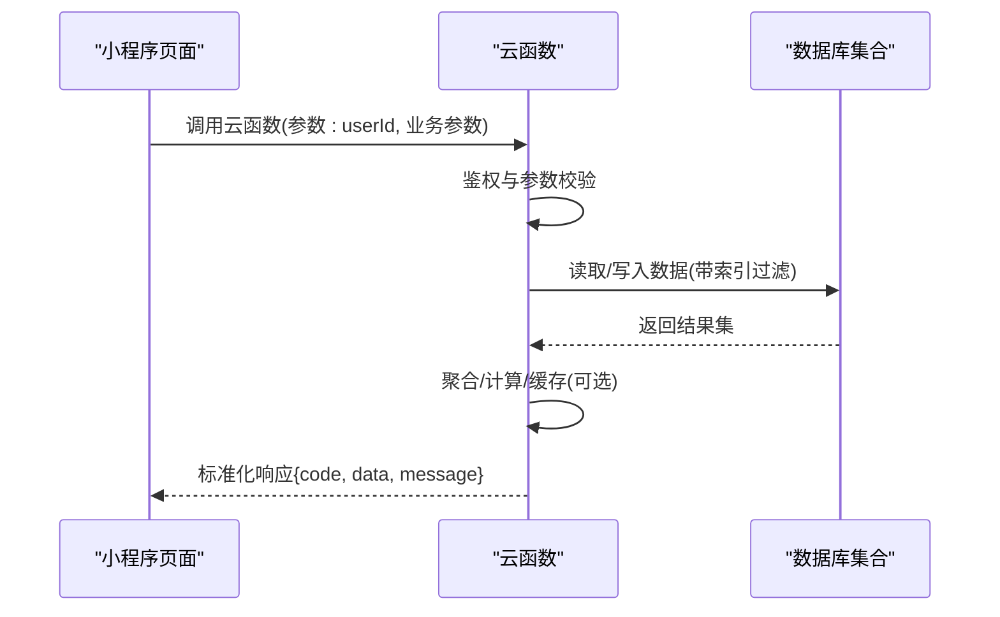
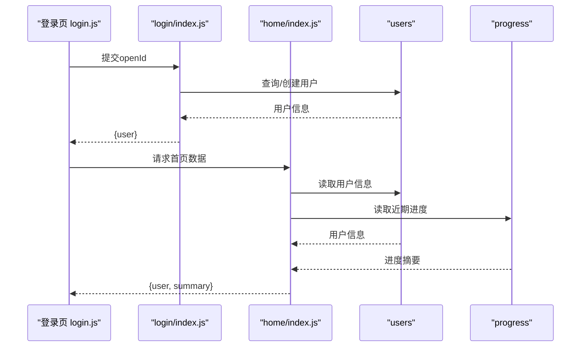
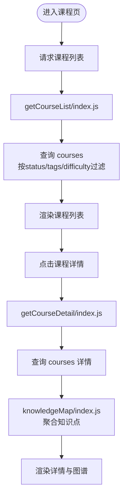
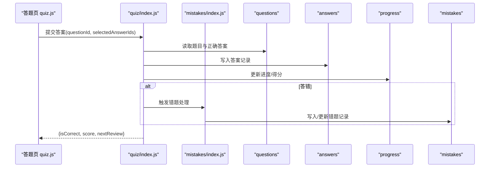
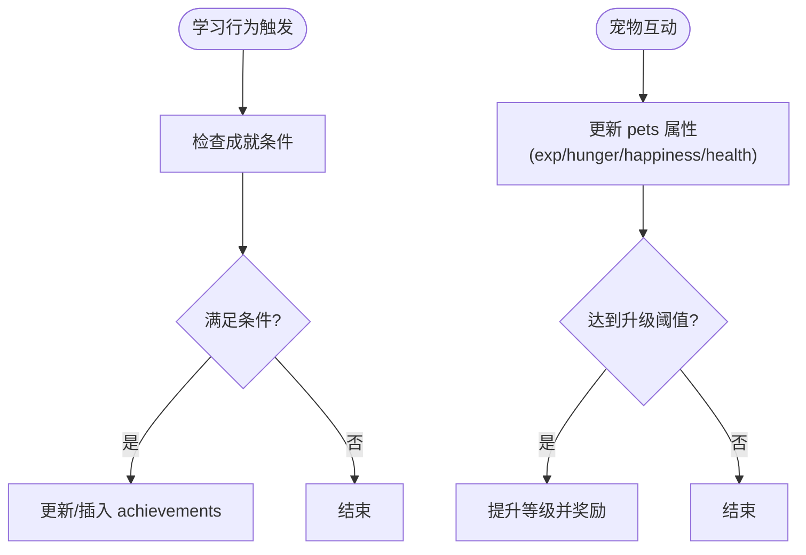
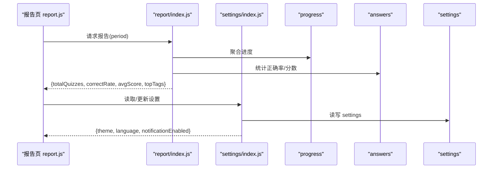
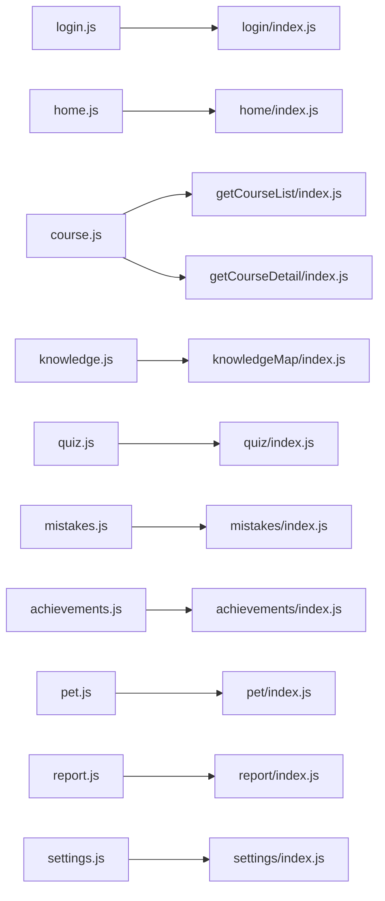
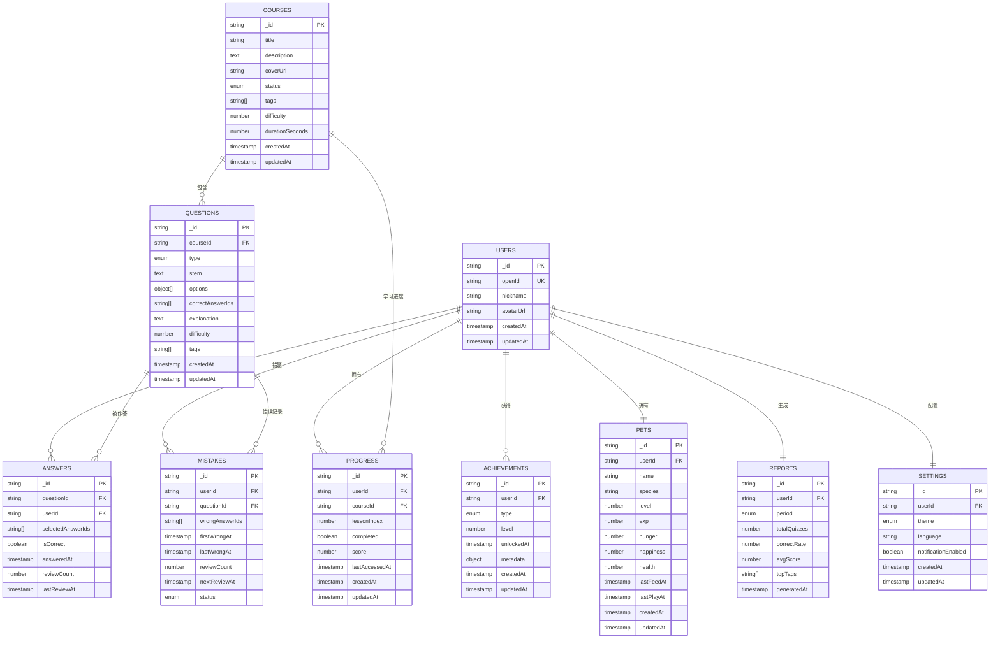

# 数据模型

<cite>
**本文引用的文件**   
- [cloudfunctions/achievements/index.js](file://cloudfunctions/achievements/index.js)
- [cloudfunctions/pet/index.js](file://cloudfunctions/pet/index.js)
- [cloudfunctions/quiz/index.js](file://cloudfunctions/quiz/index.js)
- [cloudfunctions/mistakes/index.js](file://cloudfunctions/mistakes/index.js)
- [cloudfunctions/getCourseList/index.js](file://cloudfunctions/getCourseList/index.js)
- [cloudfunctions/getCourseDetail/index.js](file://cloudfunctions/getCourseDetail/index.js)
- [cloudfunctions/knowledgeMap/index.js](file://cloudfunctions/knowledgeMap/index.js)
- [cloudfunctions/login/index.js](file://cloudfunctions/login/index.js)
- [cloudfunctions/home/index.js](file://cloudfunctions/home/index.js)
- [cloudfunctions/report/index.js](file://cloudfunctions/report/index.js)
- [cloudfunctions/settings/index.js](file://cloudfunctions/settings/index.js)
- [miniprogram/pages/achievements/achievements.js](file://miniprogram/pages/achievements/achievements.js)
- [miniprogram/pages/pet/pet.js](file://miniprogram/pages/pet/pet.js)
- [miniprogram/pages/quiz/quiz.js](file://miniprogram/pages/quiz/quiz.js)
- [miniprogram/pages/mistakes/mistakes.js](file://miniprogram/pages/mistakes/mistakes.js)
- [miniprogram/pages/course/course.js](file://miniprogram/pages/course/course.js)
- [miniprogram/pages/knowledge/knowledge.js](file://miniprogram/pages/knowledge/knowledge.js)
- [miniprogram/pages/login/login.js](file://miniprogram/pages/login/login.js)
- [miniprogram/pages/home/home.js](file://miniprogram/pages/home/home.js)
- [miniprogram/pages/report/report.js](file://miniprogram/pages/report/report.js)
- [miniprogram/pages/settings/settings.js](file://miniprogram/pages/settings/settings.js)
</cite>

## 目录
1. [简介](#简介)
2. [项目结构](#项目结构)
3. [核心组件](#核心组件)
4. [架构总览](#架构总览)
5. [详细组件分析](#详细组件分析)
6. [依赖分析](#依赖分析)
7. [性能考虑](#性能考虑)
8. [故障排查指南](#故障排查指南)
9. [结论](#结论)
10. [附录](#附录)

## 简介
本数据模型文档面向生物学习小程序，系统化梳理用户信息、课程内容、题目答案、学习进度、成就等级、宠物属性等核心实体的结构与关系。文档基于云函数与小程序页面的实际调用约定，抽象出数据库集合（表）设计、字段类型与约束、索引策略、查询优化、数据流向与迁移版本管理建议，为开发者提供完整的数据访问指导与最佳实践。

## 项目结构
本项目采用“小程序前端 + 云函数后端”的架构：
- 小程序页面负责交互与展示，通过云函数接口获取或更新数据。
- 云函数作为业务入口，封装对数据库集合的读写逻辑，并返回标准化结果给前端。

```mermaid
graph TB
subgraph "小程序"
P_Achievements["成就页 achievements.js"]
P_Pet["宠物页 pet.js"]
P_Quiz["答题页 quiz.js"]
P_Mistakes["错题页 mistakes.js"]
P_Course["课程页 course.js"]
P_Knowledge["知识图谱 knowledge.js"]
P_Login["登录页 login.js"]
P_Home["首页 home.js"]
P_Report["报告页 report.js"]
P_Settings["设置页 settings.js"]
end
subgraph "云函数"
CF_Achievements["achievements/index.js"]
CF_Pet["pet/index.js"]
CF_Quiz["quiz/index.js"]
CF_Mistakes["mistakes/index.js"]
CF_GetCourseList["getCourseList/index.js"]
CF_GetCourseDetail["getCourseDetail/index.js"]
CF_KnowledgeMap["knowledgeMap/index.js"]
CF_Login["login/index.js"]
CF_Home["home/index.js"]
CF_Report["report/index.js"]
CF_Settings["settings/index.js"]
end
subgraph "数据库集合"
DB_User["users"]
DB_Course["courses"]
DB_Question["questions"]
DB_Answer["answers"]
DB_Progress["progress"]
DB_Achievement["achievements"]
DB_Pet["pets"]
DB_Mistake["mistakes"]
DB_Report["reports"]
DB_Settings["settings"]
end
P_Achievements --> CF_Achievements
P_Pet --> CF_Pet
P_Quiz --> CF_Quiz
P_Mistakes --> CF_Mistakes
P_Course --> CF_GetCourseList
P_Course --> CF_GetCourseDetail
P_Knowledge --> CF_KnowledgeMap
P_Login --> CF_Login
P_Home --> CF_Home
P_Report --> CF_Report
P_Settings --> CF_Settings
CF_Achievements --> DB_Achievement
CF_Pet --> DB_Pet
CF_Quiz --> DB_Question
CF_Quiz --> DB_Answer
CF_Quiz --> DB_Progress
CF_Mistakes --> DB_Mistake
CF_GetCourseList --> DB_Course
CF_GetCourseDetail --> DB_Course
CF_KnowledgeMap --> DB_Course
CF_Login --> DB_User
CF_Home --> DB_User
CF_Home --> DB_Progress
CF_Report --> DB_Progress
CF_Settings --> DB_Settings
```

图表来源
- [cloudfunctions/achievements/index.js](file://cloudfunctions/achievements/index.js)
- [cloudfunctions/pet/index.js](file://cloudfunctions/pet/index.js)
- [cloudfunctions/quiz/index.js](file://cloudfunctions/quiz/index.js)
- [cloudfunctions/mistakes/index.js](file://cloudfunctions/mistakes/index.js)
- [cloudfunctions/getCourseList/index.js](file://cloudfunctions/getCourseList/index.js)
- [cloudfunctions/getCourseDetail/index.js](file://cloudfunctions/getCourseDetail/index.js)
- [cloudfunctions/knowledgeMap/index.js](file://cloudfunctions/knowledgeMap/index.js)
- [cloudfunctions/login/index.js](file://cloudfunctions/login/index.js)
- [cloudfunctions/home/index.js](file://cloudfunctions/home/index.js)
- [cloudfunctions/report/index.js](file://cloudfunctions/report/index.js)
- [cloudfunctions/settings/index.js](file://cloudfunctions/settings/index.js)
- [miniprogram/pages/achievements/achievements.js](file://miniprogram/pages/achievements/achievements.js)
- [miniprogram/pages/pet/pet.js](file://miniprogram/pages/pet/pet.js)
- [miniprogram/pages/quiz/quiz.js](file://miniprogram/pages/quiz/quiz.js)
- [miniprogram/pages/mistakes/mistakes.js](file://miniprogram/pages/mistakes/mistakes.js)
- [miniprogram/pages/course/course.js](file://miniprogram/pages/course/course.js)
- [miniprogram/pages/knowledge/knowledge.js](file://miniprogram/pages/knowledge/knowledge.js)
- [miniprogram/pages/login/login.js](file://miniprogram/pages/login/login.js)
- [miniprogram/pages/home/home.js](file://miniprogram/pages/home/home.js)
- [miniprogram/pages/report/report.js](file://miniprogram/pages/report/report.js)
- [miniprogram/pages/settings/settings.js](file://miniprogram/pages/settings/settings.js)

章节来源
- [cloudfunctions/achievements/index.js](file://cloudfunctions/achievements/index.js)
- [cloudfunctions/pet/index.js](file://cloudfunctions/pet/index.js)
- [cloudfunctions/quiz/index.js](file://cloudfunctions/quiz/index.js)
- [cloudfunctions/mistakes/index.js](file://cloudfunctions/mistakes/index.js)
- [cloudfunctions/getCourseList/index.js](file://cloudfunctions/getCourseList/index.js)
- [cloudfunctions/getCourseDetail/index.js](file://cloudfunctions/getCourseDetail/index.js)
- [cloudfunctions/knowledgeMap/index.js](file://cloudfunctions/knowledgeMap/index.js)
- [cloudfunctions/login/index.js](file://cloudfunctions/login/index.js)
- [cloudfunctions/home/index.js](file://cloudfunctions/home/index.js)
- [cloudfunctions/report/index.js](file://cloudfunctions/report/index.js)
- [cloudfunctions/settings/index.js](file://cloudfunctions/settings/index.js)
- [miniprogram/pages/achievements/achievements.js](file://miniprogram/pages/achievements/achievements.js)
- [miniprogram/pages/pet/pet.js](file://miniprogram/pages/pet/pet.js)
- [miniprogram/pages/quiz/quiz.js](file://miniprogram/pages/quiz/quiz.js)
- [miniprogram/pages/mistakes/mistakes.js](file://miniprogram/pages/mistakes/mistakes.js)
- [miniprogram/pages/course/course.js](file://miniprogram/pages/course/course.js)
- [miniprogram/pages/knowledge/knowledge.js](file://miniprogram/pages/knowledge/knowledge.js)
- [miniprogram/pages/login/login.js](file://miniprogram/pages/login/login.js)
- [miniprogram/pages/home/home.js](file://miniprogram/pages/home/home.js)
- [miniprogram/pages/report/report.js](file://miniprogram/pages/report/report.js)
- [miniprogram/pages/settings/settings.js](file://miniprogram/pages/settings/settings.js)

## 核心组件
本节定义核心数据实体（集合）及其字段、约束与业务含义。所有集合均以用户维度进行隔离，主键包含用户标识以支持多租户与权限控制。

- 用户 users
  - 字段
    - _id: 字符串，唯一，系统生成
    - openId: 字符串，唯一，微信开放标识
    - nickname: 字符串，可选
    - avatarUrl: 字符串，可选
    - createdAt: 时间戳，创建时间
    - updatedAt: 时间戳，更新时间
  - 约束
    - openId 唯一
    - 必填校验在云函数层完成
  - 索引
    - openId 唯一索引
    - createdAt 降序索引（用于最近活动排序）

- 课程 courses
  - 字段
    - _id: 字符串，唯一
    - title: 字符串，标题
    - description: 文本，描述
    - coverUrl: 字符串，封面图
    - status: 枚举，发布状态
    - tags: 字符串数组，标签
    - difficulty: 数值，难度等级
    - durationSeconds: 数值，时长
    - createdAt: 时间戳
    - updatedAt: 时间戳
  - 约束
    - title 非空
    - status 取值受限
  - 索引
    - status 索引
    - tags 全文索引（按平台能力）
    - difficulty 索引

- 题目 questions
  - 字段
    - _id: 字符串，唯一
    - courseId: 字符串，外键引用 courses._id
    - type: 枚举，题型
    - stem: 文本，题干
    - options: 对象数组，选项
    - correctAnswerIds: 字符串数组，正确答案ID
    - explanation: 文本，解析
    - difficulty: 数值
    - tags: 字符串数组
    - createdAt: 时间戳
    - updatedAt: 时间戳
  - 约束
    - courseId 存在性校验
    - correctAnswerIds 非空且与 options 对应
  - 索引
    - courseId 索引
    - tags 索引
    - difficulty 索引

- 答案 answers
  - 字段
    - _id: 字符串，唯一
    - questionId: 字符串，外键引用 questions._id
    - userId: 字符串，外键引用 users._id
    - selectedAnswerIds: 字符串数组，用户选择
    - isCorrect: 布尔，是否正确
    - answeredAt: 时间戳
    - reviewCount: 数值，复习次数
    - lastReviewAt: 时间戳
  - 约束
    - questionId、userId 存在性校验
    - selectedAnswerIds 非空
  - 索引
    - questionId 索引
    - userId 索引
    - isCorrect 索引
    - reviewedAt 复合索引（userId, isCorrect）

- 学习进度 progress
  - 字段
    - _id: 字符串，唯一
    - userId: 字符串，外键引用 users._id
    - courseId: 字符串，外键引用 courses._id
    - lessonIndex: 数值，课时序号
    - completed: 布尔，是否完成
    - score: 数值，得分
    - lastAccessedAt: 时间戳
    - createdAt: 时间戳
    - updatedAt: 时间戳
  - 约束
    - userId、courseId 联合唯一
  - 索引
    - userId 索引
    - courseId 索引
    - (userId, courseId) 复合唯一索引

- 成就 achievements
  - 字段
    - _id: 字符串，唯一
    - userId: 字符串，外键引用 users._id
    - type: 枚举，成就类型
    - level: 数值，等级
    - unlockedAt: 时间戳
    - metadata: 对象，扩展信息
    - createdAt: 时间戳
    - updatedAt: 时间戳
  - 约束
    - userId、type 组合唯一（同一类型仅保留最高记录）
  - 索引
    - userId 索引
    - type 索引
    - unlockedAt 索引

- 宠物 pets
  - 字段
    - _id: 字符串，唯一
    - userId: 字符串，外键引用 users._id
    - name: 字符串，昵称
    - species: 字符串，物种
    - level: 数值，等级
    - exp: 数值，经验值
    - hunger: 数值，饥饿度
    - happiness: 数值，快乐度
    - health: 数值，健康值
    - lastFeedAt: 时间戳
    - lastPlayAt: 时间戳
    - createdAt: 时间戳
    - updatedAt: 时间戳
  - 约束
    - userId 唯一（每用户一只宠物）
  - 索引
    - userId 唯一索引
    - level 索引
    - exp 索引

- 错题 mistakes
  - 字段
    - _id: 字符串，唯一
    - userId: 字符串，外键引用 users._id
    - questionId: 字符串，外键引用 questions._id
    - wrongAnswerIds: 字符串数组
    - firstWrongAt: 时间戳
    - lastWrongAt: 时间戳
    - reviewCount: 数值
    - nextReviewAt: 时间戳
    - status: 枚举，掌握状态
  - 约束
    - userId、questionId 组合唯一
  - 索引
    - userId 索引
    - questionId 索引
    - status 索引
    - nextReviewAt 索引

- 报告 reports
  - 字段
    - _id: 字符串，唯一
    - userId: 字符串，外键引用 users._id
    - period: 枚举，统计周期
    - totalQuizzes: 数值
    - correctRate: 数值
    - avgScore: 数值
    - topTags: 字符串数组
    - generatedAt: 时间戳
  - 约束
    - userId、period 组合唯一
  - 索引
    - userId 索引
    - period 索引
    - generatedAt 索引

- 设置 settings
  - 字段
    - _id: 字符串，唯一
    - userId: 字符串，外键引用 users._id
    - theme: 枚举，主题
    - language: 字符串，语言
    - notificationEnabled: 布尔
    - createdAt: 时间戳
    - updatedAt: 时间戳
  - 约束
    - userId 唯一
  - 索引
    - userId 唯一索引

章节来源
- [cloudfunctions/achievements/index.js](file://cloudfunctions/achievements/index.js)
- [cloudfunctions/pet/index.js](file://cloudfunctions/pet/index.js)
- [cloudfunctions/quiz/index.js](file://cloudfunctions/quiz/index.js)
- [cloudfunctions/mistakes/index.js](file://cloudfunctions/mistakes/index.js)
- [cloudfunctions/getCourseList/index.js](file://cloudfunctions/getCourseList/index.js)
- [cloudfunctions/getCourseDetail/index.js](file://cloudfunctions/getCourseDetail/index.js)
- [cloudfunctions/knowledgeMap/index.js](file://cloudfunctions/knowledgeMap/index.js)
- [cloudfunctions/login/index.js](file://cloudfunctions/login/index.js)
- [cloudfunctions/home/index.js](file://cloudfunctions/home/index.js)
- [cloudfunctions/report/index.js](file://cloudfunctions/report/index.js)
- [cloudfunctions/settings/index.js](file://cloudfunctions/settings/index.js)

## 架构总览
下图展示了从页面到云函数再到数据库集合的整体数据流，强调读多写少的场景与幂等写入策略。

图表来源
- [cloudfunctions/home/index.js](file://cloudfunctions/home/index.js)
- [cloudfunctions/getCourseList/index.js](file://cloudfunctions/getCourseList/index.js)
- [cloudfunctions/getCourseDetail/index.js](file://cloudfunctions/getCourseDetail/index.js)
- [cloudfunctions/quiz/index.js](file://cloudfunctions/quiz/index.js)
- [cloudfunctions/mistakes/index.js](file://cloudfunctions/mistakes/index.js)
- [cloudfunctions/achievements/index.js](file://cloudfunctions/achievements/index.js)
- [cloudfunctions/pet/index.js](file://cloudfunctions/pet/index.js)
- [cloudfunctions/report/index.js](file://cloudfunctions/report/index.js)
- [cloudfunctions/settings/index.js](file://cloudfunctions/settings/index.js)

## 详细组件分析

### 用户与登录
- 目标
  - 建立用户身份，绑定 openId，初始化默认数据（如宠物、设置）。
- 关键流程
  - 登录云函数根据 openId 查找或创建用户，返回用户基本信息。
  - 首页云函数聚合用户基础信息与学习进度摘要。
- 数据流向
  - 登录 -> users
  - 首页 -> users, progress

图表来源
- [cloudfunctions/login/index.js](file://cloudfunctions/login/index.js)
- [cloudfunctions/home/index.js](file://cloudfunctions/home/index.js)
- [miniprogram/pages/login/login.js](file://miniprogram/pages/login/login.js)
- [miniprogram/pages/home/home.js](file://miniprogram/pages/home/home.js)

章节来源
- [cloudfunctions/login/index.js](file://cloudfunctions/login/index.js)
- [cloudfunctions/home/index.js](file://cloudfunctions/home/index.js)
- [miniprogram/pages/login/login.js](file://miniprogram/pages/login/login.js)
- [miniprogram/pages/home/home.js](file://miniprogram/pages/home/home.js)

### 课程与知识图谱
- 目标
  - 提供课程列表与详情，支撑知识图谱导航。
- 关键流程
  - 课程列表云函数按标签、难度、状态筛选。
  - 课程详情云函数返回课程元数据与关联知识点。
  - 知识图谱云函数聚合课程与题目分布。
- 数据流向
  - getCourseList -> courses
  - getCourseDetail -> courses
  - knowledgeMap -> courses, questions

图表来源
- [cloudfunctions/getCourseList/index.js](file://cloudfunctions/getCourseList/index.js)
- [cloudfunctions/getCourseDetail/index.js](file://cloudfunctions/getCourseDetail/index.js)
- [cloudfunctions/knowledgeMap/index.js](file://cloudfunctions/knowledgeMap/index.js)
- [miniprogram/pages/course/course.js](file://miniprogram/pages/course/course.js)
- [miniprogram/pages/knowledge/knowledge.js](file://miniprogram/pages/knowledge/knowledge.js)

章节来源
- [cloudfunctions/getCourseList/index.js](file://cloudfunctions/getCourseList/index.js)
- [cloudfunctions/getCourseDetail/index.js](file://cloudfunctions/getCourseDetail/index.js)
- [cloudfunctions/knowledgeMap/index.js](file://cloudfunctions/knowledgeMap/index.js)
- [miniprogram/pages/course/course.js](file://miniprogram/pages/course/course.js)
- [miniprogram/pages/knowledge/knowledge.js](file://miniprogram/pages/knowledge/knowledge.js)

### 答题与错题
- 目标
  - 处理题目作答、正确率统计、错题收集与复习计划。
- 关键流程
  - 答题云函数校验答案、更新 answers 与 progress，必要时写入 mistakes。
  - 错题云函数按用户与题目维度维护错误记录与复习间隔。
- 数据流向
  - quiz -> questions, answers, progress, mistakes
  - mistakes -> mistakes

图表来源
- [cloudfunctions/quiz/index.js](file://cloudfunctions/quiz/index.js)
- [cloudfunctions/mistakes/index.js](file://cloudfunctions/mistakes/index.js)
- [miniprogram/pages/quiz/quiz.js](file://miniprogram/pages/quiz/quiz.js)
- [miniprogram/pages/mistakes/mistakes.js](file://miniprogram/pages/mistakes/mistakes.js)

章节来源
- [cloudfunctions/quiz/index.js](file://cloudfunctions/quiz/index.js)
- [cloudfunctions/mistakes/index.js](file://cloudfunctions/mistakes/index.js)
- [miniprogram/pages/quiz/quiz.js](file://miniprogram/pages/quiz/quiz.js)
- [miniprogram/pages/mistakes/mistakes.js](file://miniprogram/pages/mistakes/mistakes.js)

### 成就与宠物
- 目标
  - 成就系统激励学习行为；宠物系统提供情感化反馈。
- 关键流程
  - 成就云函数根据学习行为解锁/升级成就。
  - 宠物云函数维护属性（经验、饥饿、快乐、健康）与互动事件。
- 数据流向
  - achievements -> achievements
  - pet -> pets

图表来源
- [cloudfunctions/achievements/index.js](file://cloudfunctions/achievements/index.js)
- [cloudfunctions/pet/index.js](file://cloudfunctions/pet/index.js)
- [miniprogram/pages/achievements/achievements.js](file://miniprogram/pages/achievements/achievements.js)
- [miniprogram/pages/pet/pet.js](file://miniprogram/pages/pet/pet.js)

章节来源
- [cloudfunctions/achievements/index.js](file://cloudfunctions/achievements/index.js)
- [cloudfunctions/pet/index.js](file://cloudfunctions/pet/index.js)
- [miniprogram/pages/achievements/achievements.js](file://miniprogram/pages/achievements/achievements.js)
- [miniprogram/pages/pet/pet.js](file://miniprogram/pages/pet/pet.js)

### 报告与设置
- 目标
  - 生成学习报告；管理用户偏好设置。
- 关键流程
  - 报告云函数汇总答题与进度数据，输出指标。
  - 设置云函数读写用户配置。
- 数据流向
  - report -> progress, answers
  - settings -> settings

图表来源
- [cloudfunctions/report/index.js](file://cloudfunctions/report/index.js)
- [cloudfunctions/settings/index.js](file://cloudfunctions/settings/index.js)
- [miniprogram/pages/report/report.js](file://miniprogram/pages/report/report.js)
- [miniprogram/pages/settings/settings.js](file://miniprogram/pages/settings/settings.js)

章节来源
- [cloudfunctions/report/index.js](file://cloudfunctions/report/index.js)
- [cloudfunctions/settings/index.js](file://cloudfunctions/settings/index.js)
- [miniprogram/pages/report/report.js](file://miniprogram/pages/report/report.js)
- [miniprogram/pages/settings/settings.js](file://miniprogram/pages/settings/settings.js)

## 依赖分析
- 耦合关系
  - 云函数与集合强耦合：每个云函数明确操作一个或多个集合，职责单一。
  - 页面与云函数松耦合：通过统一接口契约交互，便于替换实现。
- 外部依赖
  - 微信小程序登录体系（openId）
  - 云数据库集合与索引能力
- 潜在循环依赖
  - 当前无直接循环依赖；若引入跨集合事务需避免双向调用。

图表来源
- [miniprogram/pages/login/login.js](file://miniprogram/pages/login/login.js)
- [miniprogram/pages/home/home.js](file://miniprogram/pages/home/home.js)
- [miniprogram/pages/course/course.js](file://miniprogram/pages/course/course.js)
- [miniprogram/pages/knowledge/knowledge.js](file://miniprogram/pages/knowledge/knowledge.js)
- [miniprogram/pages/quiz/quiz.js](file://miniprogram/pages/quiz/quiz.js)
- [miniprogram/pages/mistakes/mistakes.js](file://miniprogram/pages/mistakes/mistakes.js)
- [miniprogram/pages/achievements/achievements.js](file://miniprogram/pages/achievements/achievements.js)
- [miniprogram/pages/pet/pet.js](file://miniprogram/pages/pet/pet.js)
- [miniprogram/pages/report/report.js](file://miniprogram/pages/report/report.js)
- [miniprogram/pages/settings/settings.js](file://miniprogram/pages/settings/settings.js)
- [cloudfunctions/login/index.js](file://cloudfunctions/login/index.js)
- [cloudfunctions/home/index.js](file://cloudfunctions/home/index.js)
- [cloudfunctions/getCourseList/index.js](file://cloudfunctions/getCourseList/index.js)
- [cloudfunctions/getCourseDetail/index.js](file://cloudfunctions/getCourseDetail/index.js)
- [cloudfunctions/knowledgeMap/index.js](file://cloudfunctions/knowledgeMap/index.js)
- [cloudfunctions/quiz/index.js](file://cloudfunctions/quiz/index.js)
- [cloudfunctions/mistakes/index.js](file://cloudfunctions/mistakes/index.js)
- [cloudfunctions/achievements/index.js](file://cloudfunctions/achievements/index.js)
- [cloudfunctions/pet/index.js](file://cloudfunctions/pet/index.js)
- [cloudfunctions/report/index.js](file://cloudfunctions/report/index.js)
- [cloudfunctions/settings/index.js](file://cloudfunctions/settings/index.js)

章节来源
- [cloudfunctions/achievements/index.js](file://cloudfunctions/achievements/index.js)
- [cloudfunctions/pet/index.js](file://cloudfunctions/pet/index.js)
- [cloudfunctions/quiz/index.js](file://cloudfunctions/quiz/index.js)
- [cloudfunctions/mistakes/index.js](file://cloudfunctions/mistakes/index.js)
- [cloudfunctions/getCourseList/index.js](file://cloudfunctions/getCourseList/index.js)
- [cloudfunctions/getCourseDetail/index.js](file://cloudfunctions/getCourseDetail/index.js)
- [cloudfunctions/knowledgeMap/index.js](file://cloudfunctions/knowledgeMap/index.js)
- [cloudfunctions/login/index.js](file://cloudfunctions/login/index.js)
- [cloudfunctions/home/index.js](file://cloudfunctions/home/index.js)
- [cloudfunctions/report/index.js](file://cloudfunctions/report/index.js)
- [cloudfunctions/settings/index.js](file://cloudfunctions/settings/index.js)
- [miniprogram/pages/achievements/achievements.js](file://miniprogram/pages/achievements/achievements.js)
- [miniprogram/pages/pet/pet.js](file://miniprogram/pages/pet/pet.js)
- [miniprogram/pages/quiz/quiz.js](file://miniprogram/pages/quiz/quiz.js)
- [miniprogram/pages/mistakes/mistakes.js](file://miniprogram/pages/mistakes/mistakes.js)
- [miniprogram/pages/course/course.js](file://miniprogram/pages/course/course.js)
- [miniprogram/pages/knowledge/knowledge.js](file://miniprogram/pages/knowledge/knowledge.js)
- [miniprogram/pages/login/login.js](file://miniprogram/pages/login/login.js)
- [miniprogram/pages/home/home.js](file://miniprogram/pages/home/home.js)
- [miniprogram/pages/report/report.js](file://miniprogram/pages/report/report.js)
- [miniprogram/pages/settings/settings.js](file://miniprogram/pages/settings/settings.js)

## 性能考虑
- 索引设计
  - 高频查询字段建立单列索引：users.openId、courses.status、questions.courseId、answers.userId、progress.userId、achievements.userId、pets.userId、mistakes.userId、reports.userId、settings.userId。
  - 复合索引覆盖常见过滤条件：progress(userId, courseId)、mistakes(userId, questionId)、answers(userId, isCorrect)。
- 查询优化
  - 分页与投影：只返回必要字段，限制返回条数。
  - 批量聚合：在云函数侧合并多次查询，减少往返。
  - 冷热分离：热点课程与题目可缓存至云函数内存或缓存服务。
- 写入优化
  - 幂等写入：使用唯一约束防止重复记录（如 progress、mistakes、settings）。
  - 原子更新：使用增量更新字段（如 exp、reviewCount）降低竞争。
- 容量规划
  - 大字段（stem、explanation、description）存储于对象存储，集合中仅保存 URL。
  - 定期归档历史报告与旧错题记录。

[本节为通用性能建议，不直接分析具体文件]

## 故障排查指南
- 常见问题
  - 未登录或 openId 无效：检查登录云函数返回与用户是否存在。
  - 权限不足：确认云函数鉴权逻辑与用户集合访问规则。
  - 数据不一致：核对 progress 与 answers 的一致性，确保答题后同步更新。
  - 索引缺失导致慢查询：查看慢日志并补充索引。
- 定位步骤
  - 在云函数中增加结构化日志（入参、出参、耗时）。
  - 使用数据库控制台查看慢查询与索引命中情况。
  - 针对幂等写入失败，检查唯一约束冲突。

章节来源
- [cloudfunctions/login/index.js](file://cloudfunctions/login/index.js)
- [cloudfunctions/home/index.js](file://cloudfunctions/home/index.js)
- [cloudfunctions/quiz/index.js](file://cloudfunctions/quiz/index.js)
- [cloudfunctions/mistakes/index.js](file://cloudfunctions/mistakes/index.js)
- [cloudfunctions/achievements/index.js](file://cloudfunctions/achievements/index.js)
- [cloudfunctions/pet/index.js](file://cloudfunctions/pet/index.js)
- [cloudfunctions/report/index.js](file://cloudfunctions/report/index.js)
- [cloudfunctions/settings/index.js](file://cloudfunctions/settings/index.js)

## 结论
本数据模型围绕用户中心展开，覆盖课程、题目、答案、进度、成就、宠物、错题、报告与设置等核心领域。通过明确的集合设计、索引策略与云函数边界，实现了高内聚、低耦合的数据访问模式。建议在后续迭代中持续完善数据验证、幂等性与监控告警，保障数据一致性与系统稳定性。

[本节为总结性内容，不直接分析具体文件]

## 附录

### 实体关系图（ERD）

图表来源
- [cloudfunctions/achievements/index.js](file://cloudfunctions/achievements/index.js)
- [cloudfunctions/pet/index.js](file://cloudfunctions/pet/index.js)
- [cloudfunctions/quiz/index.js](file://cloudfunctions/quiz/index.js)
- [cloudfunctions/mistakes/index.js](file://cloudfunctions/mistakes/index.js)
- [cloudfunctions/getCourseList/index.js](file://cloudfunctions/getCourseList/index.js)
- [cloudfunctions/getCourseDetail/index.js](file://cloudfunctions/getCourseDetail/index.js)
- [cloudfunctions/knowledgeMap/index.js](file://cloudfunctions/knowledgeMap/index.js)
- [cloudfunctions/login/index.js](file://cloudfunctions/login/index.js)
- [cloudfunctions/home/index.js](file://cloudfunctions/home/index.js)
- [cloudfunctions/report/index.js](file://cloudfunctions/report/index.js)
- [cloudfunctions/settings/index.js](file://cloudfunctions/settings/index.js)

### 数据迁移与版本管理策略
- 版本命名
  - 使用语义化版本号：v1.0.0、v1.1.0、v2.0.0。
- 迁移脚本
  - 新增集合：初始化默认数据与索引。
  - 变更字段：添加新字段并提供默认值；删除字段前标记废弃并保留一段时间。
  - 数据修复：批量修正历史数据，保证一致性。
- 回滚策略
  - 变更前备份集合快照；回滚时恢复快照并重建索引。
- 灰度发布
  - 小流量验证迁移脚本，观察错误率与性能指标后再全量。

[本节为通用策略，不直接分析具体文件]

### 数据访问最佳实践
- 统一响应格式
  - 所有云函数返回标准结构：{code, data, message}，便于前端统一处理。
- 参数校验
  - 在云函数入口处校验必填字段与取值范围，拒绝非法输入。
- 幂等与去重
  - 使用唯一约束与幂等键避免重复写入。
- 安全与权限
  - 严格校验 userId/openId，禁止越权访问其他用户数据。
- 日志与监控
  - 记录关键路径日志与耗时，结合错误码快速定位问题。

[本节为通用实践，不直接分析具体文件]