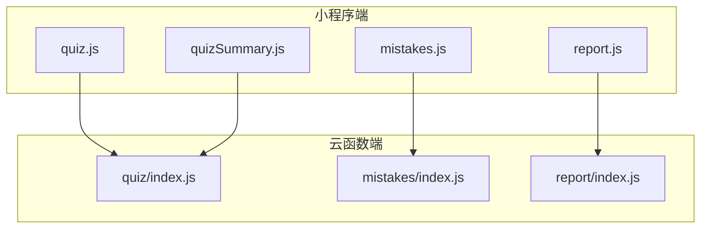
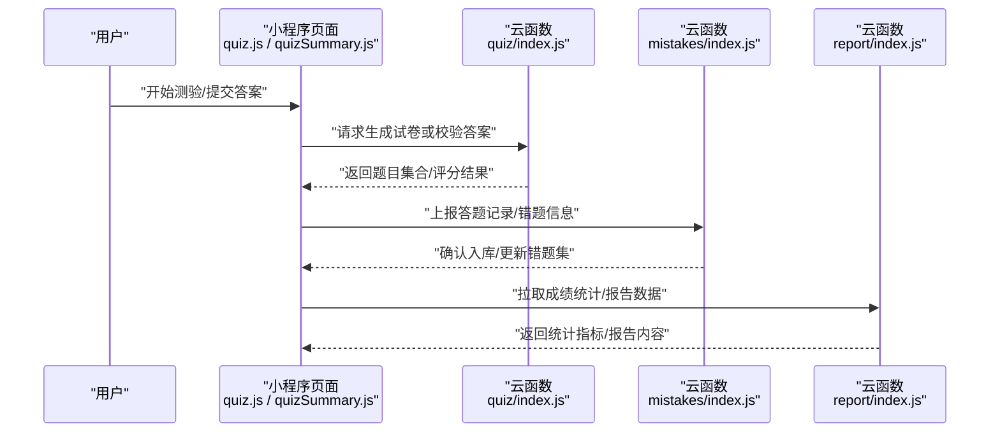
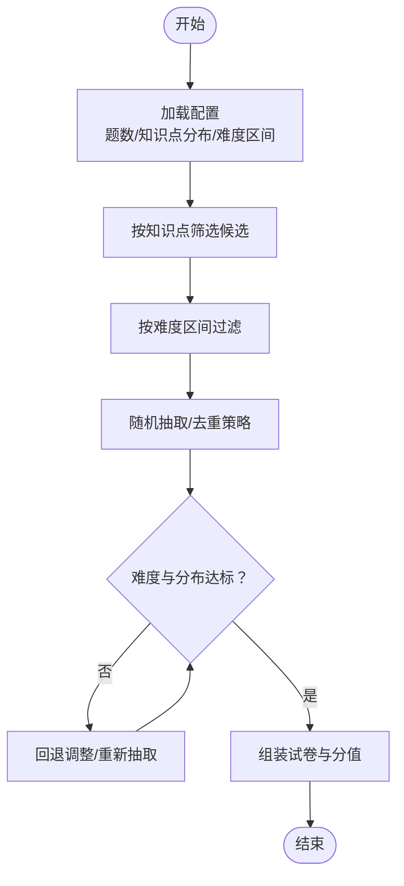
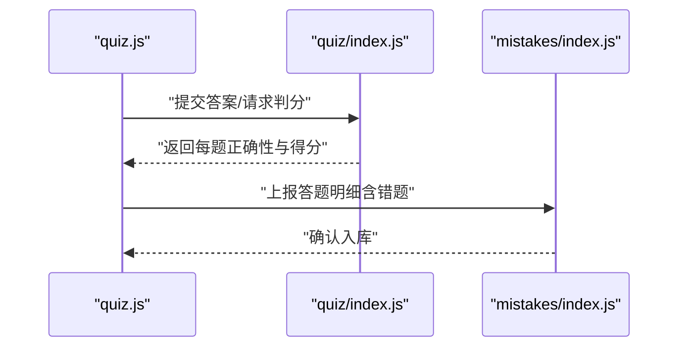
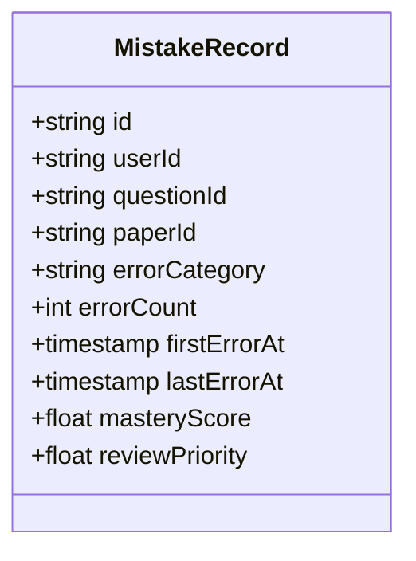
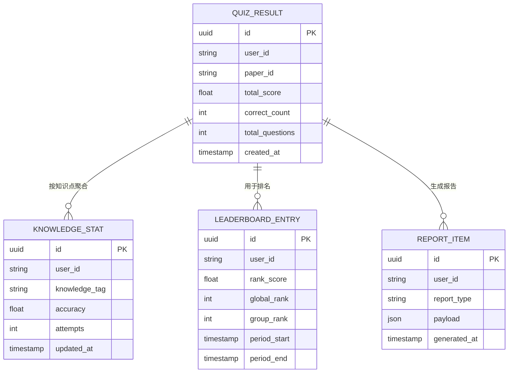
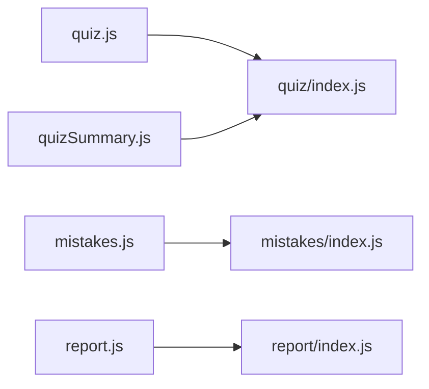

# 测验数据模型

<cite>
**本文引用的文件**   
- [cloudfunctions/quiz/index.js](file://cloudfunctions/quiz/index.js)
- [cloudfunctions/mistakes/index.js](file://cloudfunctions/mistakes/index.js)
- [cloudfunctions/report/index.js](file://cloudfunctions/report/index.js)
- [miniprogram/pages/quiz/quiz.js](file://miniprogram/pages/quiz/quiz.js)
- [miniprogram/pages/quizSummary/quizSummary.js](file://miniprogram/pages/quizSummary/quizSummary.js)
- [miniprogram/pages/mistakes/mistakes.js](file://miniprogram/pages/mistakes/mistakes.js)
- [miniprogram/pages/report/report.js](file://miniprogram/pages/report/report.js)
</cite>

## 目录
1. [简介](#简介)
2. [项目结构](#项目结构)
3. [核心组件](#核心组件)
4. [架构总览](#架构总览)
5. [详细组件分析](#详细组件分析)
6. [依赖关系分析](#依赖关系分析)
7. [性能考虑](#性能考虑)
8. [故障排查指南](#故障排查指南)
9. [结论](#结论)
10. [附录](#附录)

## 简介
本文件围绕“测验数据模型”进行系统化说明，覆盖题目表结构设计、测验卷生成算法的数据依赖与策略、答题记录数据结构、错题收集与分析模型、成绩统计与报告生成的数据结构，以及面向开发者的查询与统计分析方法。文档以云函数与小程序页面为切入点，结合代码路径定位关键实现位置，帮助开发者快速理解并扩展相关能力。

## 项目结构
本项目采用“小程序前端 + 云函数后端”的常见分层：
- 小程序端负责交互与展示（如测验、错题、报告等页面）
- 云函数端承载业务逻辑与数据访问（如出题、错题、报告等）

图表来源
- [miniprogram/pages/quiz/quiz.js](file://miniprogram/pages/quiz/quiz.js)
- [miniprogram/pages/quizSummary/quizSummary.js](file://miniprogram/pages/quizSummary/quizSummary.js)
- [miniprogram/pages/mistakes/mistakes.js](file://miniprogram/pages/mistakes/mistakes.js)
- [miniprogram/pages/report/report.js](file://miniprogram/pages/report/report.js)
- [cloudfunctions/quiz/index.js](file://cloudfunctions/quiz/index.js)
- [cloudfunctions/mistakes/index.js](file://cloudfunctions/mistakes/index.js)
- [cloudfunctions/report/index.js](file://cloudfunctions/report/index.js)

章节来源
- [miniprogram/pages/quiz/quiz.js](file://miniprogram/pages/quiz/quiz.js)
- [miniprogram/pages/quizSummary/quizSummary.js](file://miniprogram/pages/quizSummary/quizSummary.js)
- [miniprogram/pages/mistakes/mistakes.js](file://miniprogram/pages/mistakes/mistakes.js)
- [miniprogram/pages/report/report.js](file://miniprogram/pages/report/report.js)
- [cloudfunctions/quiz/index.js](file://cloudfunctions/quiz/index.js)
- [cloudfunctions/mistakes/index.js](file://cloudfunctions/mistakes/index.js)
- [cloudfunctions/report/index.js](file://cloudfunctions/report/index.js)

## 核心组件
本节聚焦与测验数据模型直接相关的核心模块：
- 题目与选项模型：用于描述题型、题干、选项数组、正确答案、解析、难度系数等
- 测验卷生成：基于知识点分布、难度平衡与随机抽取策略组合出试卷
- 答题记录：记录用户答案、用时、正确性、得分等
- 错题模型：错误原因分类、重复率统计、掌握度评估
- 成绩统计与报告：聚合分数、排名、薄弱点分析与可视化数据

章节来源
- [cloudfunctions/quiz/index.js](file://cloudfunctions/quiz/index.js)
- [cloudfunctions/mistakes/index.js](file://cloudfunctions/mistakes/index.js)
- [cloudfunctions/report/index.js](file://cloudfunctions/report/index.js)
- [miniprogram/pages/quiz/quiz.js](file://miniprogram/pages/quiz/quiz.js)
- [miniprogram/pages/quizSummary/quizSummary.js](file://miniprogram/pages/quizSummary/quizSummary.js)
- [miniprogram/pages/mistakes/mistakes.js](file://miniprogram/pages/mistakes/mistakes.js)
- [miniprogram/pages/report/report.js](file://miniprogram/pages/report/report.js)

## 架构总览
下图展示了从“发起测验”到“生成报告”的整体数据流与调用关系。

图表来源
- [miniprogram/pages/quiz/quiz.js](file://miniprogram/pages/quiz/quiz.js)
- [miniprogram/pages/quizSummary/quizSummary.js](file://miniprogram/pages/quizSummary/quizSummary.js)
- [cloudfunctions/quiz/index.js](file://cloudfunctions/quiz/index.js)
- [cloudfunctions/mistakes/index.js](file://cloudfunctions/mistakes/index.js)
- [cloudfunctions/report/index.js](file://cloudfunctions/report/index.js)

## 详细组件分析

### 题目与选项数据模型
- 字段建议
  - 题目ID：唯一标识
  - 题型：单选、多选、判断、填空等
  - 题干内容：文本或富文本
  - 选项数组：包含选项文本、是否正确答案标记等
  - 正确答案：与题型匹配的正确答案表达
  - 解析说明：题后解释
  - 难度系数：数值型，便于难度控制与平衡
  - 知识点标签：用于按知识点分布抽题
  - 元数据：创建时间、更新时间、版本等
- 设计要点
  - 选项数组应支持多题型（单选/多选/判断）
  - 正确答案需与题型一致（例如多选为数组）
  - 难度系数参与试卷生成时的权重计算
  - 知识点标签用于分布控制与个性化推荐

章节来源
- [cloudfunctions/quiz/index.js](file://cloudfunctions/quiz/index.js)
- [miniprogram/pages/quiz/quiz.js](file://miniprogram/pages/quiz/quiz.js)

### 测验卷生成算法与数据依赖
- 输入参数
  - 目标题数、知识点分布比例、难度区间与目标平均难度
  - 随机种子或去重策略（避免重复历史题目）
- 处理流程
  - 按知识点分组筛选候选题库
  - 在每组内按难度区间过滤
  - 使用随机抽取策略组合最终试卷
  - 校验整体难度与分布是否达标，必要时回退调整
- 输出
  - 题目序列（含顺序打乱）、每题分值、总分上限
- 复杂度与优化
  - 主要开销在候选集筛选与排序；可通过索引与缓存提升性能
  - 对大规模题库可采用预分桶与抽样加速

图表来源
- [cloudfunctions/quiz/index.js](file://cloudfunctions/quiz/index.js)

章节来源
- [cloudfunctions/quiz/index.js](file://cloudfunctions/quiz/index.js)
- [miniprogram/pages/quiz/quiz.js](file://miniprogram/pages/quiz/quiz.js)

### 答题记录数据模型
- 字段建议
  - 记录ID：唯一标识
  - 用户ID：关联用户
  - 试卷ID：关联本次测验
  - 题目ID：逐题记录
  - 用户答案：与题型匹配的答案结构
  - 标准答案：用于判分
  - 是否正确：布尔值
  - 耗时：秒级计时
  - 得分：本题得分
  - 提交时间戳：用于统计与回溯
- 计分规则
  - 单选题/判断题：答对得满分，答错不得分
  - 多选题：全对得满分，部分正确按比例或固定规则计分
  - 填空题：按关键词匹配或模糊匹配规则计分
- 数据来源与流向
  - 小程序端采集用户答案与用时
  - 云函数端完成判分与持久化

图表来源
- [miniprogram/pages/quiz/quiz.js](file://miniprogram/pages/quiz/quiz.js)
- [cloudfunctions/quiz/index.js](file://cloudfunctions/quiz/index.js)
- [cloudfunctions/mistakes/index.js](file://cloudfunctions/mistakes/index.js)

章节来源
- [miniprogram/pages/quiz/quiz.js](file://miniprogram/pages/quiz/quiz.js)
- [cloudfunctions/quiz/index.js](file://cloudfunctions/quiz/index.js)
- [cloudfunctions/mistakes/index.js](file://cloudfunctions/mistakes/index.js)

### 错题收集与分析数据模型
- 字段建议
  - 错题ID：唯一标识
  - 用户ID、题目ID、试卷ID
  - 错误原因分类：概念不清、审题失误、记忆偏差、粗心等
  - 首次错误时间、最近错误时间、错误次数
  - 掌握度评估：基于错误频率与间隔的指数衰减或滑动窗口
  - 复习优先级：综合错误次数、最近错误时间、掌握度计算
- 分析维度
  - 重复率统计：单位时间内错误次数/总尝试次数
  - 薄弱知识点：按知识点聚合的错误占比
  - 趋势分析：近N次测验的正确率变化

图表来源
- [cloudfunctions/mistakes/index.js](file://cloudfunctions/mistakes/index.js)
- [miniprogram/pages/mistakes/mistakes.js](file://miniprogram/pages/mistakes/mistakes.js)

章节来源
- [cloudfunctions/mistakes/index.js](file://cloudfunctions/mistakes/index.js)
- [miniprogram/pages/mistakes/mistakes.js](file://miniprogram/pages/mistakes/mistakes.js)

### 成绩统计、排名与报告数据模型
- 成绩统计
  - 用户总分、平均分、最高分、最低分
  - 各知识点正确率、难度分布命中率
  - 时间维度趋势（日/周/月）
- 排名计算
  - 基于总分或加权分（难度系数、正确率）
  - 同组/同班/全局排名
- 报告生成
  - 总体表现概览
  - 薄弱知识点清单与推荐练习
  - 错题回顾与掌握度曲线
  - 可导出格式（JSON/CSV）

图表来源
- [cloudfunctions/report/index.js](file://cloudfunctions/report/index.js)
- [miniprogram/pages/report/report.js](file://miniprogram/pages/report/report.js)

章节来源
- [cloudfunctions/report/index.js](file://cloudfunctions/report/index.js)
- [miniprogram/pages/report/report.js](file://miniprogram/pages/report/report.js)

## 依赖关系分析
- 模块耦合
  - 小程序页面通过云函数接口获取试卷、判分、错题与报告数据
  - 云函数之间相对独立，分别承担出题、错题、报告职责
- 外部依赖
  - 数据库/集合：存储题目、答题记录、错题、统计与报告
  - 可选：缓存层用于热点题目与统计结果加速
- 潜在循环依赖
  - 当前云函数间无直接互相调用，耦合度低

图表来源
- [miniprogram/pages/quiz/quiz.js](file://miniprogram/pages/quiz/quiz.js)
- [miniprogram/pages/quizSummary/quizSummary.js](file://miniprogram/pages/quizSummary/quizSummary.js)
- [miniprogram/pages/mistakes/mistakes.js](file://miniprogram/pages/mistakes/mistakes.js)
- [miniprogram/pages/report/report.js](file://miniprogram/pages/report/report.js)
- [cloudfunctions/quiz/index.js](file://cloudfunctions/quiz/index.js)
- [cloudfunctions/mistakes/index.js](file://cloudfunctions/mistakes/index.js)
- [cloudfunctions/report/index.js](file://cloudfunctions/report/index.js)

章节来源
- [miniprogram/pages/quiz/quiz.js](file://miniprogram/pages/quiz/quiz.js)
- [miniprogram/pages/quizSummary/quizSummary.js](file://miniprogram/pages/quizSummary/quizSummary.js)
- [miniprogram/pages/mistakes/mistakes.js](file://miniprogram/pages/mistakes/mistakes.js)
- [miniprogram/pages/report/report.js](file://miniprogram/pages/report/report.js)
- [cloudfunctions/quiz/index.js](file://cloudfunctions/quiz/index.js)
- [cloudfunctions/mistakes/index.js](file://cloudfunctions/mistakes/index.js)
- [cloudfunctions/report/index.js](file://cloudfunctions/report/index.js)

## 性能考虑
- 题库检索
  - 建立知识点与难度索引，减少全表扫描
  - 使用分页与游标避免一次性加载大量数据
- 随机抽取
  - 采用蓄水池抽样或预分桶策略降低随机成本
- 判分与写入
  - 批量写入答题记录，减少网络往返
  - 异步上报错题与统计，避免阻塞主流程
- 缓存
  - 热点题目与统计结果短期缓存，提高响应速度
- 并发与限流
  - 云函数侧限制并发与重试策略，防止雪崩

[本节为通用指导，不直接分析具体文件]

## 故障排查指南
- 常见问题
  - 题目缺失或选项不完整：检查题目入库校验与必填字段
  - 判分异常：核对题型与答案结构一致性
  - 错题未更新：确认上报时机与幂等处理
  - 报告数据不一致：检查统计聚合任务执行状态与数据源
- 定位步骤
  - 查看小程序控制台日志与云函数运行日志
  - 核对入参结构与边界条件（空答案、超时、断网重试）
  - 验证统计任务的幂等与补偿机制

章节来源
- [cloudfunctions/quiz/index.js](file://cloudfunctions/quiz/index.js)
- [cloudfunctions/mistakes/index.js](file://cloudfunctions/mistakes/index.js)
- [cloudfunctions/report/index.js](file://cloudfunctions/report/index.js)
- [miniprogram/pages/quiz/quiz.js](file://miniprogram/pages/quiz/quiz.js)
- [miniprogram/pages/mistakes/mistakes.js](file://miniprogram/pages/mistakes/mistakes.js)
- [miniprogram/pages/report/report.js](file://miniprogram/pages/report/report.js)

## 结论
本文件系统梳理了测验数据模型的关键要素：题目与选项结构、试卷生成策略、答题记录、错题分析与成绩报告的数据模型与流程。通过明确的字段定义、流程图与类图，帮助开发者快速落地并扩展功能。建议在工程实践中完善索引与缓存、强化幂等与容错，以提升稳定性与性能。

[本节为总结性内容，不直接分析具体文件]

## 附录
- 术语
  - 知识点标签：用于组织题目并按主题聚合
  - 难度系数：衡量题目难度的量化指标
  - 掌握度：基于错误频率与间隔的学习效果评估
- 最佳实践
  - 统一数据契约：前后端共享字段命名与类型
  - 明确边界条件：空答案、超时、网络异常的处理
  - 可观测性：埋点关键事件，便于问题定位与优化

[本节为补充说明，不直接分析具体文件]