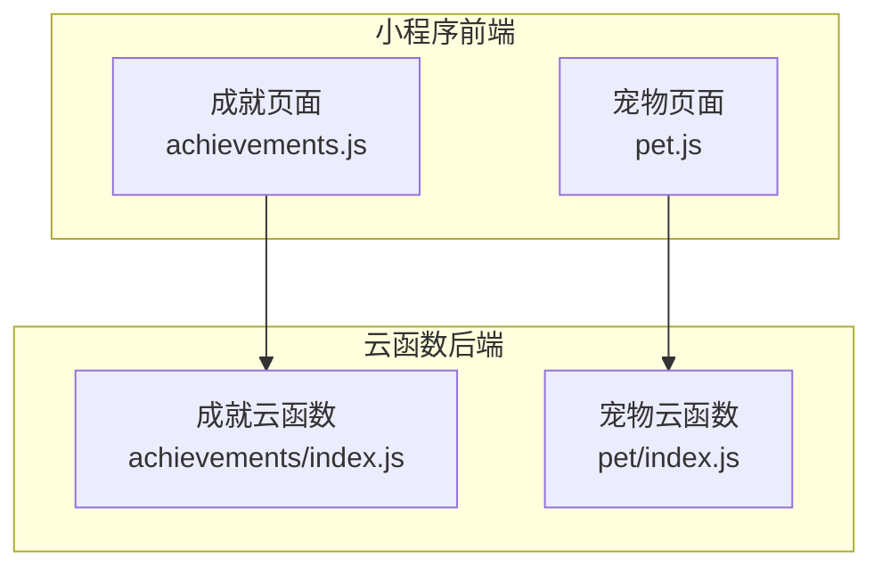
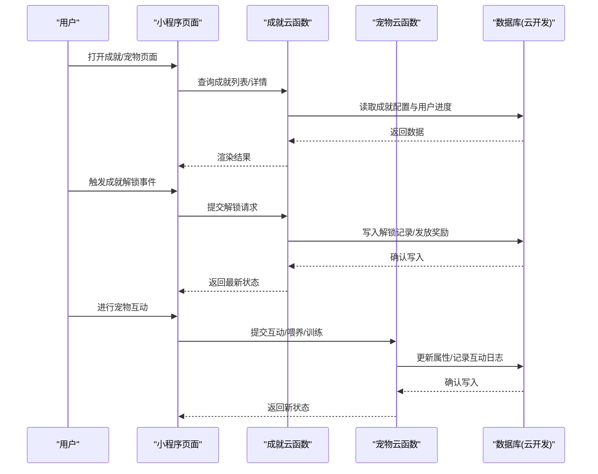
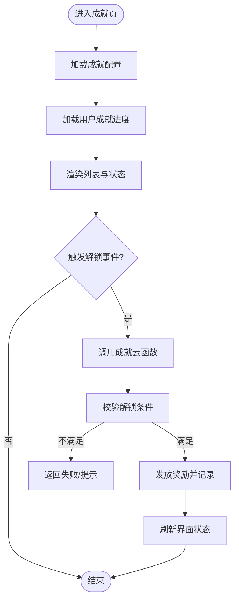
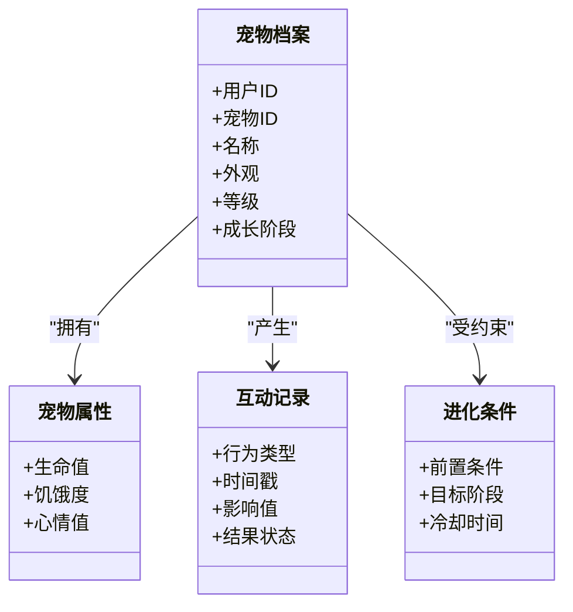
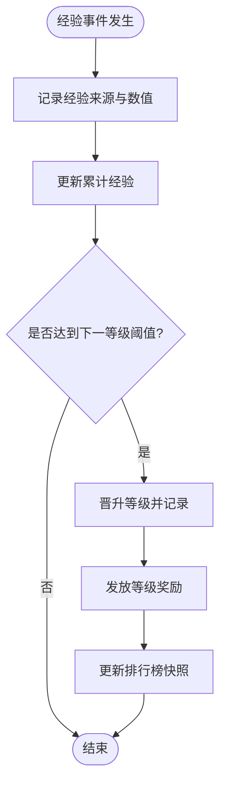
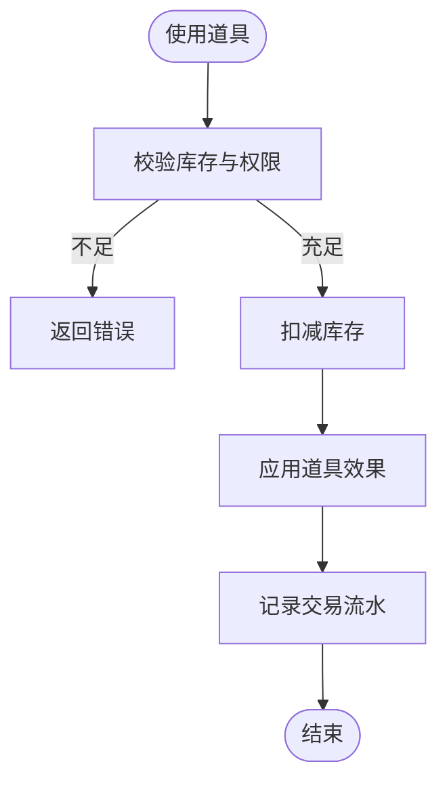
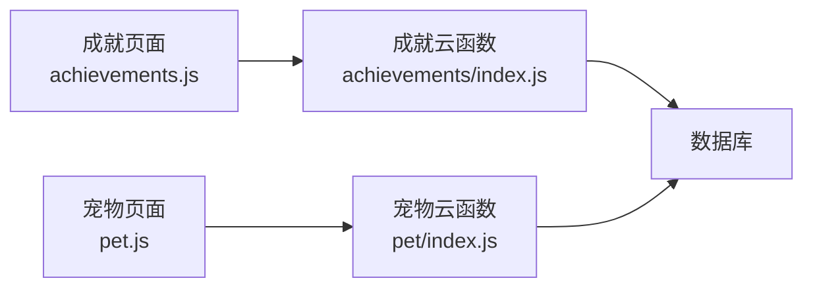

# 游戏化数据模型

<cite>
**本文引用的文件**   
- [cloudfunctions/achievements/index.js](file://cloudfunctions/achievements/index.js)
- [cloudfunctions/pet/index.js](file://cloudfunctions/pet/index.js)
- [miniprogram/pages/achievements/achievements.js](file://miniprogram/pages/achievements/achievements.js)
- [miniprogram/pages/pet/pet.js](file://miniprogram/pages/pet/pet.js)
</cite>

## 目录
1. [简介](#简介)
2. [项目结构](#项目结构)
3. [核心组件](#核心组件)
4. [架构总览](#架构总览)
5. [详细组件分析](#详细组件分析)
6. [依赖分析](#依赖分析)
7. [性能考虑](#性能考虑)
8. [故障排查指南](#故障排查指南)
9. [结论](#结论)
10. [附录](#附录)

## 简介
本文件围绕“游戏化数据模型”展开，聚焦成就系统、宠物养成系统、积分与等级体系、激励数据分析以及虚拟物品管理的数据设计与实现要点。文档以代码仓库中的云函数与小程序页面为依据，提炼出可落地的数据结构、字段定义、处理流程与扩展建议，帮助开发者快速理解并迭代相关功能。

## 项目结构
本项目采用“小程序前端 + 云函数后端”的常见架构。与游戏化相关的核心目录包括：
- cloudfunctions/achievements：成就系统的服务端逻辑入口
- cloudfunctions/pet：宠物养成系统的服务端逻辑入口
- miniprogram/pages/achievements：成就列表与详情的前端交互
- miniprogram/pages/pet：宠物状态展示与互动的前端交互

图表来源
- [cloudfunctions/achievements/index.js](file://cloudfunctions/achievements/index.js)
- [cloudfunctions/pet/index.js](file://cloudfunctions/pet/index.js)
- [miniprogram/pages/achievements/achievements.js](file://miniprogram/pages/achievements/achievements.js)
- [miniprogram/pages/pet/pet.js](file://miniprogram/pages/pet/pet.js)

章节来源
- [cloudfunctions/achievements/index.js](file://cloudfunctions/achievements/index.js)
- [cloudfunctions/pet/index.js](file://cloudfunctions/pet/index.js)
- [miniprogram/pages/achievements/achievements.js](file://miniprogram/pages/achievements/achievements.js)
- [miniprogram/pages/pet/pet.js](file://miniprogram/pages/pet/pet.js)

## 核心组件
本节从数据模型角度梳理以下模块：
- 成就系统：成就ID、名称、描述、解锁条件、奖励类型、稀有度等级等核心字段
- 宠物养成：生命值、饥饿度、心情值、成长阶段、互动记录、进化条件
- 积分与等级：经验值获取规则、等级晋升条件、排行榜计算逻辑
- 激励数据分析：用户参与度统计、留存率分析、激励机制效果评估
- 虚拟物品管理：道具使用、库存管理、交易记录

说明：由于当前仓库未提供数据库集合定义或完整API契约，本节基于云函数与页面的职责边界进行抽象建模，便于后续落地到具体数据库（如云开发数据库）时直接映射。

章节来源
- [cloudfunctions/achievements/index.js](file://cloudfunctions/achievements/index.js)
- [cloudfunctions/pet/index.js](file://cloudfunctions/pet/index.js)
- [miniprogram/pages/achievements/achievements.js](file://miniprogram/pages/achievements/achievements.js)
- [miniprogram/pages/pet/pet.js](file://miniprogram/pages/pet/pet.js)

## 架构总览
下图展示了游戏化相关的前后端交互与数据流向。小程序页面通过云函数调用完成数据的读取与更新；云函数负责校验、业务计算与持久化。

图表来源
- [cloudfunctions/achievements/index.js](file://cloudfunctions/achievements/index.js)
- [cloudfunctions/pet/index.js](file://cloudfunctions/pet/index.js)
- [miniprogram/pages/achievements/achievements.js](file://miniprogram/pages/achievements/achievements.js)
- [miniprogram/pages/pet/pet.js](file://miniprogram/pages/pet/pet.js)

## 详细组件分析

### 成就系统数据模型
- 目标：定义成就的配置与用户进度，支持按条件解锁与奖励发放。
- 关键实体
  - 成就配置：包含成就ID、名称、描述、解锁条件、奖励类型、稀有度等级等
  - 用户成就进度：记录用户已解锁的成就、解锁时间、是否重复解锁等
- 字段建议
  - 成就配置
    - 成就ID：唯一标识
    - 名称：显示名
    - 描述：说明文字
    - 解锁条件：结构化条件（如累计学习时长、完成测验次数等）
    - 奖励类型：经验值、道具、徽章等
    - 稀有度等级：普通、稀有、史诗、传说等
  - 用户成就进度
    - 用户ID：关联用户
    - 成就ID：关联成就配置
    - 解锁时间：首次解锁时间戳
    - 状态：未解锁/已解锁/已领取
- 业务流程
  - 查询：根据用户ID拉取已解锁成就与待解锁提示
  - 解锁判定：在云函数中校验条件是否满足，避免前端伪造
  - 奖励发放：根据奖励类型执行相应操作（加经验、发道具等）
  - 幂等性：同一成就对同一用户仅解锁一次

图表来源
- [cloudfunctions/achievements/index.js](file://cloudfunctions/achievements/index.js)
- [miniprogram/pages/achievements/achievements.js](file://miniprogram/pages/achievements/achievements.js)

章节来源
- [cloudfunctions/achievements/index.js](file://cloudfunctions/achievements/index.js)
- [miniprogram/pages/achievements/achievements.js](file://miniprogram/pages/achievements/achievements.js)

### 宠物养成系统数据模型
- 目标：维护宠物的基础属性、成长阶段、互动记录与进化条件。
- 关键实体
  - 宠物档案：用户ID、宠物ID、名称、外观、等级、成长阶段等
  - 宠物属性：生命值、饥饿度、心情值等
  - 互动记录：喂养、训练、玩耍等行为的时间戳与结果
  - 进化条件：达到某属性阈值或累计互动次数后触发
- 字段建议
  - 宠物档案
    - 用户ID、宠物ID、名称、外观、等级、成长阶段
  - 宠物属性
    - 生命值、饥饿度、心情值（范围与衰减策略由业务决定）
  - 互动记录
    - 行为类型、时间戳、影响值（如+饥饿度）、结果状态
  - 进化条件
    - 前置条件（属性阈值、累计次数）、目标阶段、冷却时间
- 业务流程
  - 状态同步：每次互动后更新属性并落库
  - 阶段判断：根据属性与累计记录判定是否进入下一阶段
  - 进化触发：满足条件则升级阶段并记录日志

图表来源
- [cloudfunctions/pet/index.js](file://cloudfunctions/pet/index.js)
- [miniprogram/pages/pet/pet.js](file://miniprogram/pages/pet/pet.js)

章节来源
- [cloudfunctions/pet/index.js](file://cloudfunctions/pet/index.js)
- [miniprogram/pages/pet/pet.js](file://miniprogram/pages/pet/pet.js)

### 积分与等级体系数据模型
- 目标：定义经验值获取规则、等级晋升条件与排行榜计算逻辑。
- 关键实体
  - 用户经验：用户ID、累计经验、最近获取来源、时间戳
  - 等级配置：等级号、所需经验阈值、特权/解锁内容
  - 排行榜快照：排名、分数/经验、更新时间
- 设计要点
  - 经验获取：来自成就解锁、测验完成、连续学习等事件
  - 等级晋升：当累计经验超过阈值时自动晋升，并触发奖励
  - 排行榜：按经验或综合评分排序，定期刷新或实时增量更新

图表来源
- [cloudfunctions/achievements/index.js](file://cloudfunctions/achievements/index.js)
- [cloudfunctions/pet/index.js](file://cloudfunctions/pet/index.js)

章节来源
- [cloudfunctions/achievements/index.js](file://cloudfunctions/achievements/index.js)
- [cloudfunctions/pet/index.js](file://cloudfunctions/pet/index.js)

### 游戏化激励数据分析模型
- 目标：量化用户参与度、留存率与激励机制效果，为运营决策提供依据。
- 指标建议
  - 参与度：日活/周活、任务完成率、成就解锁率、宠物互动频次
  - 留存率：次日/7日/30日留存，按渠道/活动分层
  - 激励效果：不同奖励类型对转化率与留存的影响
- 数据源
  - 成就解锁事件、宠物互动日志、经验获取事件、登录与活跃埋点
- 分析方法
  - 漏斗分析：从曝光到解锁/互动的转化
  - 同期群分析：观察不同批次用户的长期留存
  - A/B测试：对比不同激励策略的效果差异

[本节为概念性说明，无需列出具体文件来源]

### 虚拟物品管理系统数据模型
- 目标：管理道具的使用、库存与交易记录，确保一致性与可追溯性。
- 关键实体
  - 道具配置：道具ID、名称、类型、效果、稀有度
  - 用户库存：用户ID、道具ID、数量、获得时间、过期时间
  - 交易记录：用户ID、道具ID、数量、动作（获得/消耗/交易）、时间戳、来源
- 一致性要求
  - 扣减库存与发放效果需在同一事务内完成
  - 防重放与幂等：同一交易ID仅处理一次

图表来源
- [cloudfunctions/achievements/index.js](file://cloudfunctions/achievements/index.js)
- [cloudfunctions/pet/index.js](file://cloudfunctions/pet/index.js)

章节来源
- [cloudfunctions/achievements/index.js](file://cloudfunctions/achievements/index.js)
- [cloudfunctions/pet/index.js](file://cloudfunctions/pet/index.js)

## 依赖分析
- 前端依赖
  - 成就页面依赖成就云函数接口
  - 宠物页面依赖宠物云函数接口
- 后端依赖
  - 云函数依赖数据库读写能力
  - 各云函数之间保持低耦合，通过统一的事件或消息机制扩展（可选）

图表来源
- [cloudfunctions/achievements/index.js](file://cloudfunctions/achievements/index.js)
- [cloudfunctions/pet/index.js](file://cloudfunctions/pet/index.js)
- [miniprogram/pages/achievements/achievements.js](file://miniprogram/pages/achievements/achievements.js)
- [miniprogram/pages/pet/pet.js](file://miniprogram/pages/pet/pet.js)

章节来源
- [cloudfunctions/achievements/index.js](file://cloudfunctions/achievements/index.js)
- [cloudfunctions/pet/index.js](file://cloudfunctions/pet/index.js)
- [miniprogram/pages/achievements/achievements.js](file://miniprogram/pages/achievements/achievements.js)
- [miniprogram/pages/pet/pet.js](file://miniprogram/pages/pet/pet.js)

## 性能考虑
- 批量读取与分页：成就列表与宠物历史应支持分页，减少单次响应体积
- 缓存策略：热点配置（如成就配置、等级阈值）可在云函数层做短期缓存
- 幂等与去重：解锁与交易需保证幂等，避免重复发放
- 异步与批处理：非关键路径（如排行榜快照）可采用定时任务批量更新
- 索引优化：按用户ID、时间戳建立索引，提升查询效率

[本节为通用指导，无需列出具体文件来源]

## 故障排查指南
- 常见问题定位
  - 解锁失败：检查云函数中的条件校验逻辑与返回值
  - 属性异常：核对宠物互动记录的数值变化与边界处理
  - 排行榜不准：确认更新时机与排序字段是否正确
- 日志与监控
  - 在云函数中记录关键步骤日志（输入参数、中间结果、最终状态）
  - 对异常分支增加告警与重试策略
- 回滚与补偿
  - 对涉及多步写操作的流程，提供补偿脚本或回滚方案

章节来源
- [cloudfunctions/achievements/index.js](file://cloudfunctions/achievements/index.js)
- [cloudfunctions/pet/index.js](file://cloudfunctions/pet/index.js)

## 结论
本文件基于现有云函数与页面职责，抽象出游戏化相关的数据模型与流程，覆盖成就、宠物、积分等级、激励分析与虚拟物品管理等核心领域。建议在落地数据库时严格遵循字段命名与约束，并在云函数中强化校验、幂等与日志记录，以保证系统稳定与可观测性。

## 附录
- 扩展建议
  - 引入事件总线：将成就解锁、宠物互动、经验获取等事件标准化，便于跨模块联动
  - 配置驱动：将稀有度、奖励类型、等级阈值等放入配置表，降低硬编码
  - 安全加固：所有敏感计算在服务端完成，前端仅负责展示与交互
- 参考实现位置
  - 成就云函数入口：[cloudfunctions/achievements/index.js](file://cloudfunctions/achievements/index.js)
  - 宠物云函数入口：[cloudfunctions/pet/index.js](file://cloudfunctions/pet/index.js)
  - 成就页面交互：[miniprogram/pages/achievements/achievements.js](file://miniprogram/pages/achievements/achievements.js)
  - 宠物页面交互：[miniprogram/pages/pet/pet.js](file://miniprogram/pages/pet/pet.js)