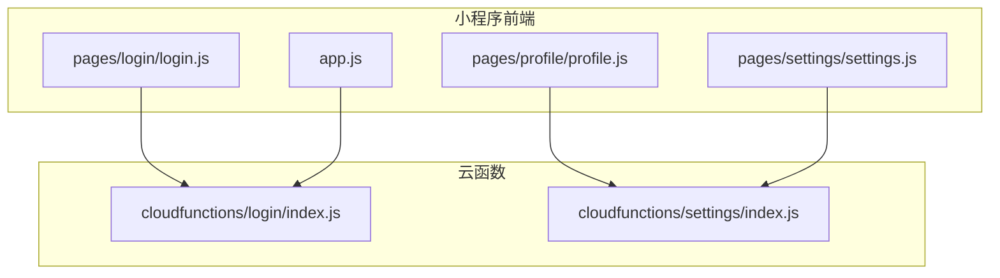
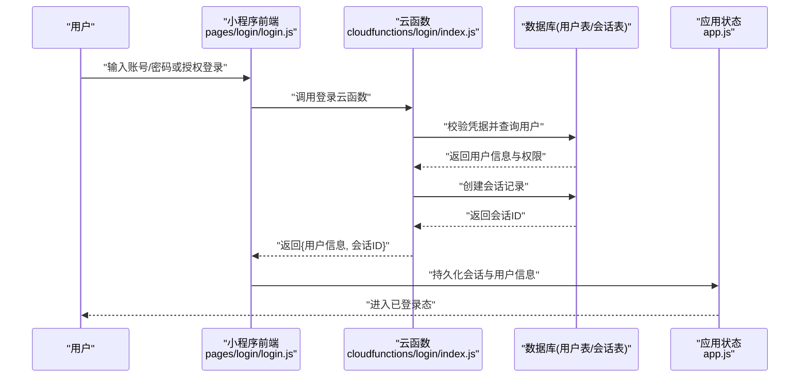
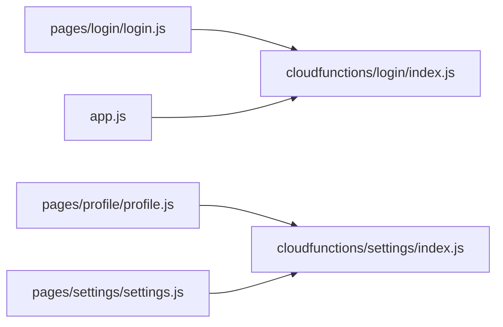

# 用户数据模型

<cite>
**本文引用的文件**   
- [cloudfunctions/login/index.js](file://cloudfunctions/login/index.js)
- [cloudfunctions/settings/index.js](file://cloudfunctions/settings/index.js)
- [miniprogram/pages/login/login.js](file://miniprogram/pages/login/login.js)
- [miniprogram/pages/profile/profile.js](file://miniprogram/pages/profile/profile.js)
- [miniprogram/pages/settings/settings.js](file://miniprogram/pages/settings/settings.js)
- [miniprogram/app.js](file://miniprogram/app.js)
</cite>

## 目录
1. [简介](#简介)
2. [项目结构](#项目结构)
3. [核心组件](#核心组件)
4. [架构总览](#架构总览)
5. [详细组件分析](#详细组件分析)
6. [依赖分析](#依赖分析)
7. [性能考虑](#性能考虑)
8. [故障排查指南](#故障排查指南)
9. [结论](#结论)
10. [附录](#附录)

## 简介
本文件围绕“用户数据模型”展开，聚焦以下目标：
- 用户信息表结构设计（用户ID、昵称、头像、注册时间、学习等级、经验值等）
- 权限体系与角色类型、访问控制规则
- 用户设置偏好、隐私配置与个人信息的存储结构
- 数据验证规则、必填字段约束与完整性检查
- 会话管理、登录状态持久化与安全策略
- 面向开发者的CRUD操作示例与最佳实践

说明：本项目为微信小程序 + 云函数架构。当前仓库未提供数据库Schema定义或后端服务代码，因此本节文档基于现有云函数与小程序页面逻辑进行归纳与抽象，给出可落地的模型设计与实现建议。

## 项目结构
从仓库结构看，与用户数据相关的核心位置包括：
- 云函数层：login（登录）、settings（设置）
- 小程序前端：pages/login（登录页）、pages/profile（个人资料页）、pages/settings（设置页）、app.js（应用级状态）

图表来源
- [cloudfunctions/login/index.js](file://cloudfunctions/login/index.js)
- [cloudfunctions/settings/index.js](file://cloudfunctions/settings/index.js)
- [miniprogram/pages/login/login.js](file://miniprogram/pages/login/login.js)
- [miniprogram/pages/profile/profile.js](file://miniprogram/pages/profile/profile.js)
- [miniprogram/pages/settings/settings.js](file://miniprogram/pages/settings/settings.js)
- [miniprogram/app.js](file://miniprogram/app.js)

章节来源
- [cloudfunctions/login/index.js](file://cloudfunctions/login/index.js)
- [cloudfunctions/settings/index.js](file://cloudfunctions/settings/index.js)
- [miniprogram/pages/login/login.js](file://miniprogram/pages/login/login.js)
- [miniprogram/pages/profile/profile.js](file://miniprogram/pages/profile/profile.js)
- [miniprogram/pages/settings/settings.js](file://miniprogram/pages/settings/settings.js)
- [miniprogram/app.js](file://miniprogram/app.js)

## 核心组件
- 用户信息实体（User）
  - 标识与基础信息：用户ID、昵称、头像、注册时间
  - 成长属性：学习等级、经验值
  - 扩展字段：邮箱/手机号（可选）、语言、主题、通知开关等
- 用户设置与隐私（Settings & Privacy）
  - 偏好：主题、字体大小、消息提醒、学习模式
  - 隐私：资料可见范围、是否允许被搜索、是否展示在线状态
- 会话与会话凭证（Session）
  - 会话ID、关联用户ID、创建时间、过期时间、设备指纹、IP（可选）
- 权限与角色（Role & Permission）
  - 角色：普通用户、管理员、内容运营等
  - 权限：读/写/管理资源集合的细粒度控制

以上为概念性设计，便于后续在数据库与云函数中落地。

## 架构总览
下图展示了登录与设置相关的数据流，以及前后端交互边界。

图表来源
- [miniprogram/pages/login/login.js](file://miniprogram/pages/login/login.js)
- [cloudfunctions/login/index.js](file://cloudfunctions/login/index.js)
- [miniprogram/app.js](file://miniprogram/app.js)

## 详细组件分析

### 用户信息表（users）
- 设计要点
  - 主键：用户ID（唯一）
  - 基础字段：昵称、头像URL、注册时间
  - 成长字段：学习等级、经验值
  - 可选字段：联系方式、地区、签名等
- 索引建议
  - 用户ID为主键索引
  - 昵称可建唯一索引（如需防重复注册）
  - 注册时间用于排序与统计
- 变更审计
  - 建议增加更新时间戳字段，便于增量同步与缓存失效

章节来源
- [cloudfunctions/login/index.js](file://cloudfunctions/login/index.js)
- [miniprogram/pages/profile/profile.js](file://miniprogram/pages/profile/profile.js)

### 用户设置与隐私（user_settings）
- 设计要点
  - 一对一关联用户ID
  - 偏好项：主题、字体、通知开关、学习模式
  - 隐私项：资料可见范围、是否允许被搜索、是否展示在线状态
- 默认值
  - 所有布尔型开关需有明确默认值，避免空值导致UI异常
- 版本兼容
  - 新增字段时保持向后兼容，旧客户端忽略未知字段

章节来源
- [cloudfunctions/settings/index.js](file://cloudfunctions/settings/index.js)
- [miniprogram/pages/settings/settings.js](file://miniprogram/pages/settings/settings.js)

### 会话与会话凭证（sessions）
- 设计要点
  - 会话ID（主键）、用户ID（外键）、创建时间、过期时间
  - 设备指纹、IP地址（可选）
  - 状态：活跃/过期/吊销
- 安全策略
  - 短生命周期+刷新机制
  - 绑定设备指纹，异常设备触发二次验证
  - 服务端校验过期时间与状态

章节来源
- [cloudfunctions/login/index.js](file://cloudfunctions/login/index.js)
- [miniprogram/app.js](file://miniprogram/app.js)

### 权限与角色（roles / permissions）
- 角色类型
  - 普通用户、管理员、内容运营等
- 权限模型
  - 资源维度：用户资料、课程、错题集、成就等
  - 操作维度：读、写、删除、审核、导出
- 访问控制
  - 基于角色的访问控制（RBAC）
  - 最小权限原则，按需授予

章节来源
- [cloudfunctions/login/index.js](file://cloudfunctions/login/index.js)

### 数据验证规则与完整性检查
- 必填字段
  - 用户ID、昵称、注册时间
- 格式校验
  - 头像URL必须为合法URL
  - 昵称长度限制与字符集限制
- 业务约束
  - 经验值非负；等级随经验阈值递增
  - 会话过期时间晚于创建时间
- 一致性
  - 事务保证：登录成功后再写入会话
  - 幂等：同一请求多次提交不产生重复会话

章节来源
- [cloudfunctions/login/index.js](file://cloudfunctions/login/index.js)
- [cloudfunctions/settings/index.js](file://cloudfunctions/settings/index.js)

### 会话管理与登录状态持久化
- 流程
  - 前端发起登录 -> 云函数校验 -> 生成会话 -> 返回给前端 -> 前端持久化
- 持久化
  - 本地缓存会话ID与用户信息
  - 应用启动时自动恢复会话
- 安全
  - 敏感信息不落盘明文
  - 定期刷新会话，防止长期有效

章节来源
- [miniprogram/pages/login/login.js](file://miniprogram/pages/login/login.js)
- [miniprogram/app.js](file://miniprogram/app.js)

### 用户数据的CRUD操作与最佳实践
- 读取（Read）
  - 通过用户ID获取个人信息与设置
  - 使用缓存减少重复查询
- 创建（Create）
  - 新用户注册时初始化用户信息与默认设置
  - 校验必填字段与格式
- 更新（Update）
  - 仅允许本人修改自身资料与设置
  - 对关键字段（如昵称）增加变更频率限制
- 删除（Delete）
  - 软删除优先，保留审计日志
  - 注销账户前完成数据清理与确认流程
- 最佳实践
  - 统一错误码与提示
  - 全链路日志与监控
  - 灰度发布与回滚预案

章节来源
- [cloudfunctions/settings/index.js](file://cloudfunctions/settings/index.js)
- [miniprogram/pages/profile/profile.js](file://miniprogram/pages/profile/profile.js)
- [miniprogram/pages/settings/settings.js](file://miniprogram/pages/settings/settings.js)

## 依赖分析
- 前端到云函数的调用关系
  - pages/login/login.js 依赖 cloudfunctions/login/index.js
  - pages/profile/profile.js 与 cloudfunctions/settings/index.js 协作
  - pages/settings/settings.js 依赖 cloudfunctions/settings/index.js
  - app.js 负责全局会话恢复与状态维护
- 潜在耦合点
  - 登录成功后的用户信息结构变化会影响前端多处消费
  - 设置接口字段变更需保持向后兼容

图表来源
- [miniprogram/pages/login/login.js](file://miniprogram/pages/login/login.js)
- [cloudfunctions/login/index.js](file://cloudfunctions/login/index.js)
- [miniprogram/pages/profile/profile.js](file://miniprogram/pages/profile/profile.js)
- [cloudfunctions/settings/index.js](file://cloudfunctions/settings/index.js)
- [miniprogram/pages/settings/settings.js](file://miniprogram/pages/settings/settings.js)
- [miniprogram/app.js](file://miniprogram/app.js)

章节来源
- [miniprogram/pages/login/login.js](file://miniprogram/pages/login/login.js)
- [cloudfunctions/login/index.js](file://cloudfunctions/login/index.js)
- [miniprogram/pages/profile/profile.js](file://miniprogram/pages/profile/profile.js)
- [cloudfunctions/settings/index.js](file://cloudfunctions/settings/index.js)
- [miniprogram/pages/settings/settings.js](file://miniprogram/pages/settings/settings.js)
- [miniprogram/app.js](file://miniprogram/app.js)

## 性能考虑
- 缓存策略
  - 用户资料与设置采用短时缓存，配合版本号或时间戳失效
- 批量操作
  - 合并多次设置更新为一次请求，降低网络开销
- 分页与懒加载
  - 列表类数据（如成就、错题）采用分页与懒加载
- 连接复用
  - 云函数冷启动优化，合理复用数据库连接

[本节为通用指导，无需特定文件引用]

## 故障排查指南
- 登录失败
  - 检查凭据是否正确、用户是否存在、会话是否已过期
  - 查看云函数日志与数据库返回码
- 设置保存失败
  - 校验字段格式与必填项
  - 检查权限与数据一致性
- 会话异常
  - 核对设备指纹与IP变化
  - 确认会话过期时间与刷新逻辑

章节来源
- [cloudfunctions/login/index.js](file://cloudfunctions/login/index.js)
- [cloudfunctions/settings/index.js](file://cloudfunctions/settings/index.js)

## 结论
本文基于现有小程序与云函数代码，抽象出用户数据模型的设计方案，涵盖用户信息、设置与隐私、会话与权限、验证与完整性、CRUD最佳实践等关键方面。建议在后续迭代中补充数据库Schema与接口契约，确保前后端一致性与可演进性。

[本节为总结性内容，无需特定文件引用]

## 附录

### 用户信息表字段参考（概念）
- 用户ID：唯一标识
- 昵称：显示名称
- 头像：图片URL
- 注册时间：首次注册的时间戳
- 学习等级：数值型等级
- 经验值：累计经验值

章节来源
- [cloudfunctions/login/index.js](file://cloudfunctions/login/index.js)
- [miniprogram/pages/profile/profile.js](file://miniprogram/pages/profile/profile.js)

### 用户设置与隐私字段参考（概念）
- 主题：浅色/深色
- 字体大小：数值
- 通知开关：布尔
- 资料可见范围：公开/好友/私密
- 允许被搜索：布尔
- 展示在线状态：布尔

章节来源
- [cloudfunctions/settings/index.js](file://cloudfunctions/settings/index.js)
- [miniprogram/pages/settings/settings.js](file://miniprogram/pages/settings/settings.js)

### 会话字段参考（概念）
- 会话ID：唯一标识
- 用户ID：关联用户
- 创建时间：会话建立时间
- 过期时间：会话失效时间
- 设备指纹：设备特征
- IP地址：可选

章节来源
- [cloudfunctions/login/index.js](file://cloudfunctions/login/index.js)
- [miniprogram/app.js](file://miniprogram/app.js)