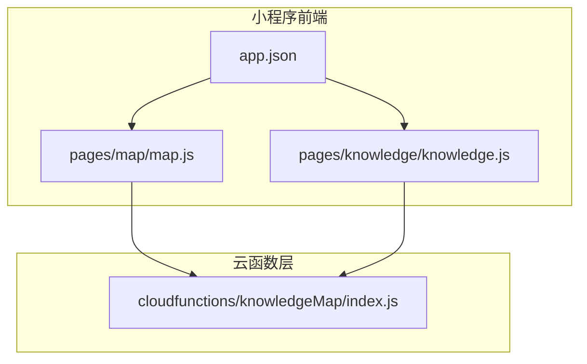
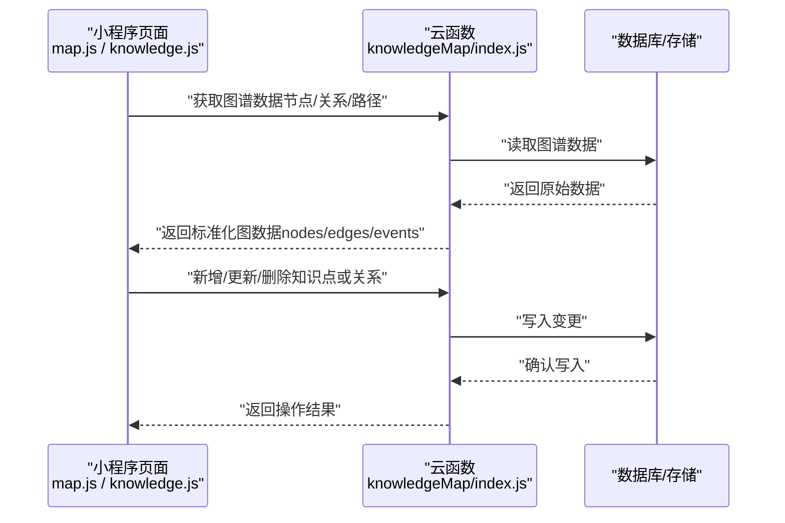
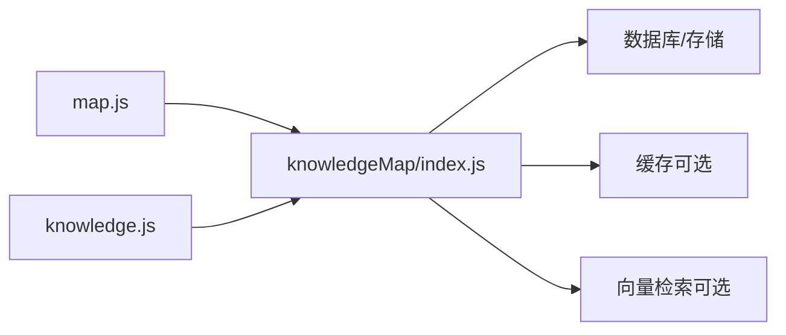

# 知识图谱数据模型

<cite>
**本文引用的文件**   
- [cloudfunctions/knowledgeMap/index.js](file://cloudfunctions/knowledgeMap/index.js)
- [miniprogram/pages/map/map.js](file://miniprogram/pages/map/map.js)
- [miniprogram/pages/knowledge/knowledge.js](file://miniprogram/pages/knowledge/knowledge.js)
- [miniprogram/app.json](file://miniprogram/app.json)
</cite>

## 目录
1. [简介](#简介)
2. [项目结构](#项目结构)
3. [核心组件](#核心组件)
4. [架构总览](#架构总览)
5. [详细组件分析](#详细组件分析)
6. [依赖分析](#依赖分析)
7. [性能考虑](#性能考虑)
8. [故障排查指南](#故障排查指南)
9. [结论](#结论)
10. [附录](#附录)

## 简介
本文件面向开发者，系统化定义并说明“知识图谱”的数据模型与实现要点。内容覆盖：
- 知识点实体数据结构（ID、名称、描述、层级关系、关联知识点等）
- 知识关系的类型与权重（前置、并列、递进、依赖等）
- 构建算法的数据基础（语义相似度计算、概念聚类、路径发现）
- 可视化展示的数据格式（节点坐标、连线样式、交互事件）
- 知识导航的数据模型（学习路径规划、推荐算法、探索轨迹记录）
- 增删改查操作、关系维护与性能优化指导

为保证可落地性，文档同时给出与仓库中现有云函数和小程序页面相关的映射与参考路径，便于在既有工程基础上扩展与集成。

## 项目结构
围绕知识图谱功能，仓库中与知识图谱相关的关键位置包括：
- 云函数层：knowledgeMap 云函数作为后端入口，负责图谱数据的读写与查询
- 小程序前端：map 页面用于图谱可视化；knowledge 页面用于知识点详情与编辑
- 应用配置：app.json 注册页面路由，确保 map 与 knowledge 页面可用

图表来源
- [cloudfunctions/knowledgeMap/index.js](file://cloudfunctions/knowledgeMap/index.js)
- [miniprogram/pages/map/map.js](file://miniprogram/pages/map/map.js)
- [miniprogram/pages/knowledge/knowledge.js](file://miniprogram/pages/knowledge/knowledge.js)
- [miniprogram/app.json](file://miniprogram/app.json)

章节来源
- [cloudfunctions/knowledgeMap/index.js](file://cloudfunctions/knowledgeMap/index.js)
- [miniprogram/pages/map/map.js](file://miniprogram/pages/map/map.js)
- [miniprogram/pages/knowledge/knowledge.js](file://miniprogram/pages/knowledge/knowledge.js)
- [miniprogram/app.json](file://miniprogram/app.json)

## 核心组件
本节从数据模型角度定义知识图谱的核心实体与关系，并提供前后端交互的约定建议。

- 知识点实体（Node）
  - 字段建议：id、name、description、level、tags、metadata、createdAt、updatedAt
  - 说明：id 为全局唯一标识；level 表示层级（如学科/课程/章节/知识点）；tags 用于检索与聚合；metadata 可扩展属性（难度、来源、版本等）

- 知识关系（Edge）
  - 字段建议：sourceId、targetId、type、weight、metadata、createdAt、updatedAt
  - type 枚举建议：prerequisite（前置）、parallel（并列）、progressive（递进）、dependency（依赖）
  - weight 数值范围建议：[0,1]，越大表示关联越强或优先级越高

- 可视化渲染对象（RenderGraph）
  - nodes: 数组，包含 id、x、y、label、color、size 等
  - edges: 数组，包含 sourceId、targetId、style、label、weight 等
  - events: 交互事件回调键值对，如 onClick、onDrag、onZoom

- 导航与推荐（Navigation）
  - learningPath: 有序节点序列，含 step、reason、estimatedTime
  - recommendation: 候选节点列表，含 score、reason、filters
  - explorationTrail: 用户探索轨迹，含 nodeId、timestamp、action、context

章节来源
- [cloudfunctions/knowledgeMap/index.js](file://cloudfunctions/knowledgeMap/index.js)
- [miniprogram/pages/map/map.js](file://miniprogram/pages/map/map.js)
- [miniprogram/pages/knowledge/knowledge.js](file://miniprogram/pages/knowledge/knowledge.js)

## 架构总览
下图展示了知识图谱在小程序与云函数之间的整体交互流程：前端发起请求，云函数处理图谱数据的增删改查与查询，返回结构化结果供前端渲染与导航使用。

图表来源
- [cloudfunctions/knowledgeMap/index.js](file://cloudfunctions/knowledgeMap/index.js)
- [miniprogram/pages/map/map.js](file://miniprogram/pages/map/map.js)
- [miniprogram/pages/knowledge/knowledge.js](file://miniprogram/pages/knowledge/knowledge.js)

## 详细组件分析

### 云函数：knowledgeMap/index.js
职责与建议
- 提供图谱数据的统一接口：创建、更新、删除、查询节点与关系
- 支持按条件过滤（如 level、tags、type）与分页
- 返回标准化的图数据格式，便于前端渲染与导航

关键能力
- 节点 CRUD：根据 id 进行单点操作，批量操作需保证事务一致性
- 关系维护：校验 sourceId/targetId 存在性，避免悬挂边
- 查询优化：对常用查询字段建立索引（如 level、tags、type）

章节来源
- [cloudfunctions/knowledgeMap/index.js](file://cloudfunctions/knowledgeMap/index.js)

### 小程序页面：map.js
职责与建议
- 接收云函数返回的 nodes/edges，转换为可视化所需的数据结构
- 管理交互事件（点击、拖拽、缩放），将事件回传给云函数以持久化布局或状态
- 支持局部加载与增量更新，提升大图渲染性能

关键能力
- 坐标系统：将逻辑坐标映射到画布坐标，支持缩放与平移
- 样式映射：根据 edge.type 与 weight 决定连线样式（虚线/实线、粗细、颜色）
- 事件绑定：onClick 打开详情，onDrag 更新节点位置，onZoom 触发懒加载

章节来源
- [miniprogram/pages/map/map.js](file://miniprogram/pages/map/map.js)

### 小程序页面：knowledge.js
职责与建议
- 展示单个知识点的详细信息与上下文关系
- 提供编辑界面，支持修改 name、description、level、tags 等元信息
- 联动 map 页面，点击跳转后高亮对应节点

关键能力
- 详情组装：合并节点与相邻关系，生成上下文视图
- 表单校验：必填字段、长度限制、标签规范化
- 状态同步：保存成功后刷新 map 页面中的节点状态

章节来源
- [miniprogram/pages/knowledge/knowledge.js](file://miniprogram/pages/knowledge/knowledge.js)

### 应用配置：app.json
职责与建议
- 注册 map 与 knowledge 页面路由，确保导航可用
- 配置 tabbar 或导航栏标题，提升用户体验

章节来源
- [miniprogram/app.json](file://miniprogram/app.json)

## 依赖分析
- 前端依赖
  - map.js 依赖 knowledgeMap 云函数提供的图谱数据接口
  - knowledge.js 依赖 knowledgeMap 云函数提供的单点详情与编辑接口
- 后端依赖
  - knowledgeMap 云函数依赖底层数据库/存储，需保证读写一致性与并发安全
- 外部依赖
  - 可选：向量检索服务（用于语义相似度计算）
  - 可选：缓存服务（热点节点/关系缓存）

图表来源
- [cloudfunctions/knowledgeMap/index.js](file://cloudfunctions/knowledgeMap/index.js)
- [miniprogram/pages/map/map.js](file://miniprogram/pages/map/map.js)
- [miniprogram/pages/knowledge/knowledge.js](file://miniprogram/pages/knowledge/knowledge.js)

章节来源
- [cloudfunctions/knowledgeMap/index.js](file://cloudfunctions/knowledgeMap/index.js)
- [miniprogram/pages/map/map.js](file://miniprogram/pages/map/map.js)
- [miniprogram/pages/knowledge/knowledge.js](file://miniprogram/pages/knowledge/knowledge.js)

## 性能考虑
- 数据分层加载
  - 首屏仅加载当前层级与相邻关系，滚动或缩放时按需加载下一层
- 增量更新
  - 对频繁变更的节点/关系采用增量推送，减少全量传输
- 索引与查询优化
  - 对 level、tags、type 等高频查询字段建立索引
  - 使用分页与游标避免大结果集一次性返回
- 缓存策略
  - 热点节点与关系短期缓存，设置合理 TTL
- 渲染优化
  - 前端对节点去重与合并，避免重复绘制
  - 使用虚拟列表或分片渲染大图

## 故障排查指南
- 常见问题
  - 节点不存在：检查 sourceId/targetId 是否存在于图谱
  - 关系循环：检测环状依赖，必要时阻断写入或提示用户
  - 权限错误：确认调用方身份与权限
- 日志与追踪
  - 记录关键操作的入参与出参，便于定位问题
  - 为慢查询添加耗时统计与告警
- 恢复策略
  - 失败重试与幂等设计，避免重复写入
  - 数据快照与回滚机制，保障一致性

章节来源
- [cloudfunctions/knowledgeMap/index.js](file://cloudfunctions/knowledgeMap/index.js)
- [miniprogram/pages/map/map.js](file://miniprogram/pages/map/map.js)
- [miniprogram/pages/knowledge/knowledge.js](file://miniprogram/pages/knowledge/knowledge.js)

## 结论
通过明确的知识图谱数据模型与前后端协作约定，可在现有工程中快速落地可视化与导航能力。建议在后续迭代中引入语义相似度计算、概念聚类与路径发现算法，以提升知识组织与个性化推荐的质量。

## 附录

### 数据模型规范（建议）
- 节点（Node）
  - id: 字符串，全局唯一
  - name: 字符串，显示名称
  - description: 字符串，详细描述
  - level: 整数或枚举，层级（如 1=学科，2=课程，3=章节，4=知识点）
  - tags: 字符串数组，标签集合
  - metadata: 对象，扩展属性（难度、来源、版本等）
  - createdAt: 时间戳
  - updatedAt: 时间戳

- 关系（Edge）
  - sourceId: 字符串，起始节点 ID
  - targetId: 字符串，目标节点 ID
  - type: 枚举，取值 {prerequisite, parallel, progressive, dependency}
  - weight: 浮点数，范围 [0,1]
  - metadata: 对象，扩展属性（理由、证据、置信度等）
  - createdAt: 时间戳
  - updatedAt: 时间戳

- 可视化渲染对象（RenderGraph）
  - nodes: 数组，元素包含 id、x、y、label、color、size
  - edges: 数组，元素包含 sourceId、targetId、style、label、weight
  - events: 对象，键名如 onClick、onDrag、onZoom，值为回调函数引用

- 导航与推荐（Navigation）
  - learningPath: 数组，元素包含 step、nodeId、reason、estimatedTime
  - recommendation: 数组，元素包含 nodeId、score、reason、filters
  - explorationTrail: 数组，元素包含 nodeId、timestamp、action、context

### 构建算法数据基础（建议）
- 语义相似度计算
  - 输入：节点文本（name/description/tags）
  - 方法：词向量/句向量 + 余弦相似度
  - 输出：相似度分数，用于阈值筛选与排序
- 概念聚类
  - 输入：相似度矩阵或特征向量
  - 方法：层次聚类或 KMeans
  - 输出：簇标签，用于分组展示与导航
- 路径发现
  - 输入：起点/终点、约束（最大步数、类型过滤）
  - 方法：BFS/DFS 或带权最短路径（Dijkstra/A*）
  - 输出：有序节点序列与路径评分

### 可视化展示数据格式（建议）
- 节点坐标
  - x、y 为画布坐标，支持缩放与平移变换
- 连线样式
  - style 可为 {lineWidth, dashArray, color}
  - label 可显示关系类型或权重
- 交互事件
  - onClick(nodeId): 打开详情或高亮
  - onDrag(nodeId, position): 更新节点位置
  - onZoom(level): 触发层级加载

### 知识导航数据模型（建议）
- 学习路径规划
  - 依据 prerequisite/progressive 关系生成顺序路径
  - 结合用户掌握度与难度动态调整
- 推荐算法
  - 基于探索轨迹与历史成绩，计算候选节点得分
  - 引入多样性与新颖性因子
- 探索轨迹记录
  - 记录每次访问的时间、动作与上下文，用于分析与回溯

### 增删改查与关系维护（建议）
- 增
  - 创建节点：校验必填字段与唯一性
  - 创建关系：校验两端节点存在且无重复边
- 删
  - 删除节点：级联删除或标记软删除，避免悬挂边
  - 删除关系：记录审计日志
- 改
  - 更新节点元信息：保留版本与更新时间
  - 更新关系权重：支持灰度与回滚
- 查
  - 条件查询：按 level、tags、type 组合过滤
  - 分页与游标：避免大结果集
- 事务与一致性
  - 批量操作使用事务，失败回滚
  - 并发写冲突采用乐观锁或版本号

### 性能优化清单（建议）
- 后端
  - 索引：level、tags、type、sourceId、targetId
  - 缓存：热点节点/关系短 TTL 缓存
  - 限流：防止恶意刷接口
- 前端
  - 懒加载：按需加载子层级
  - 增量更新：只传输变更部分
  - 渲染优化：去重、分片、虚拟列表