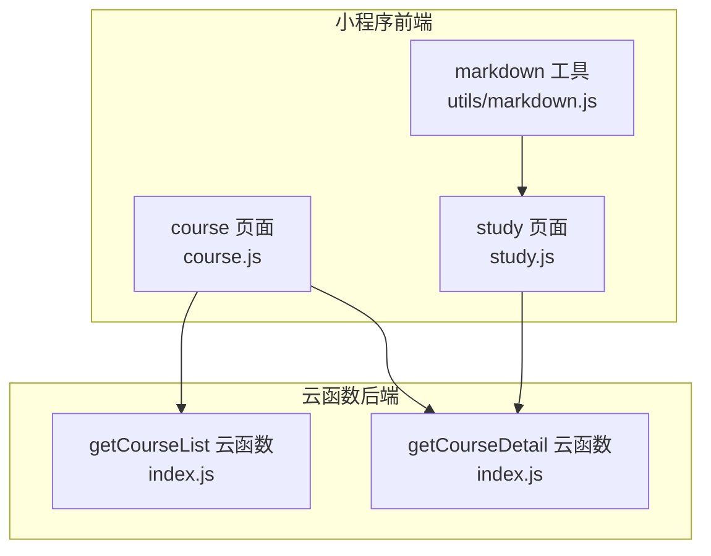
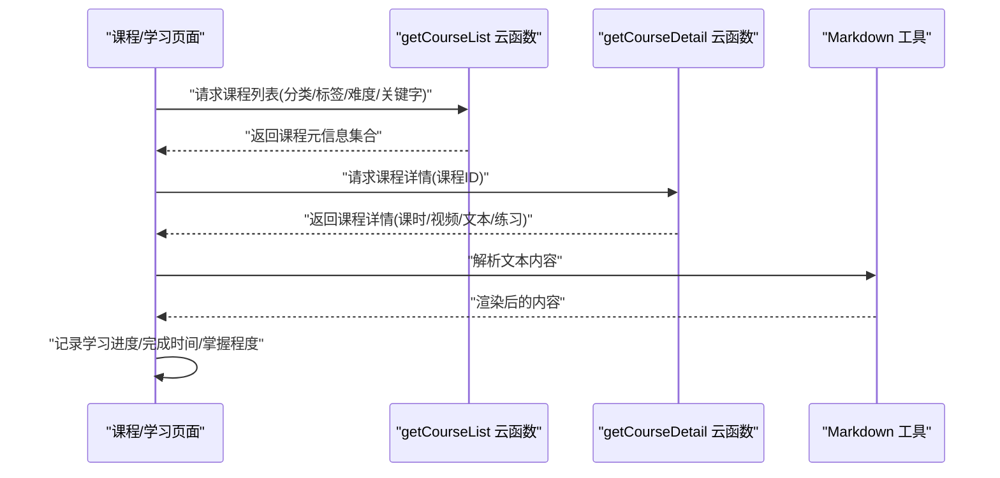
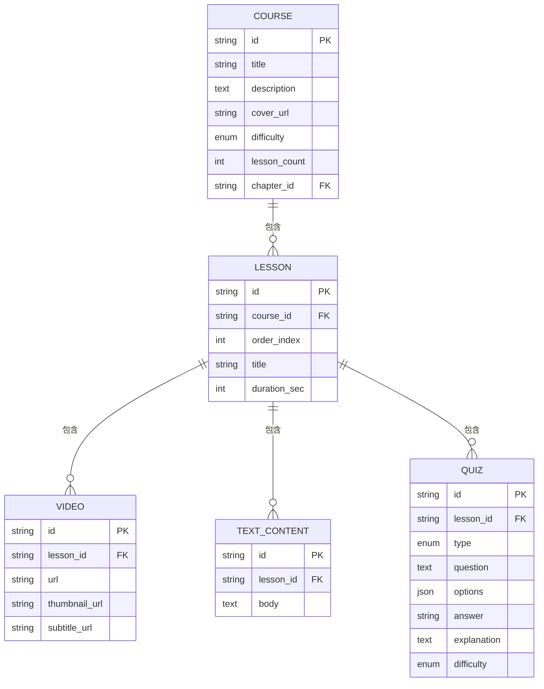
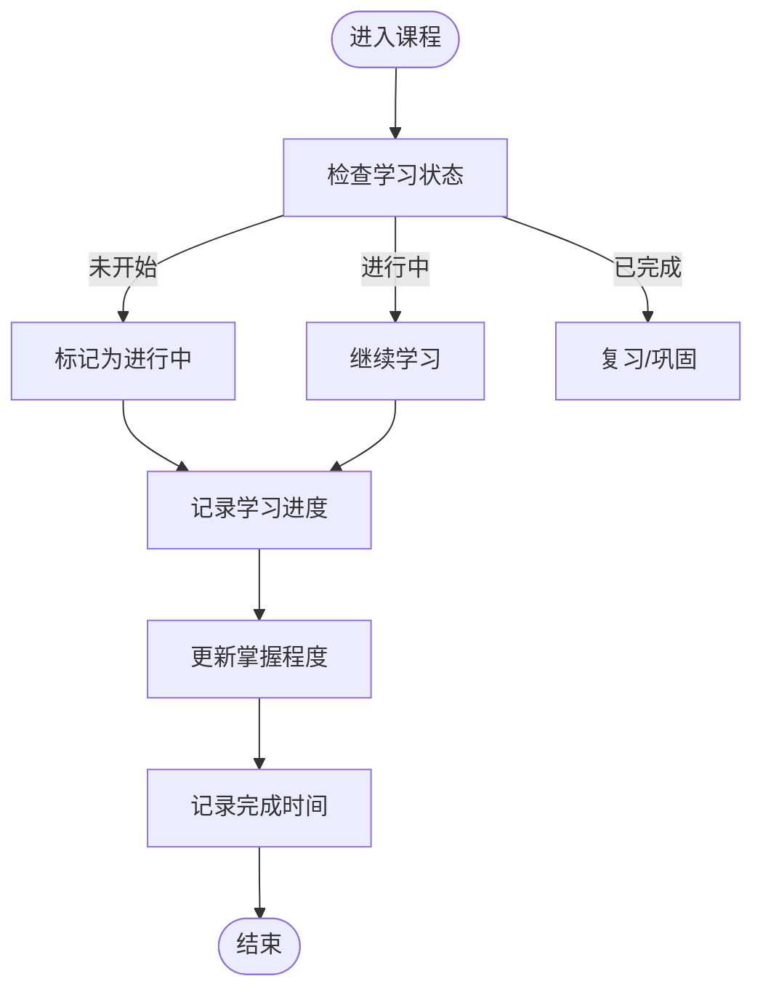
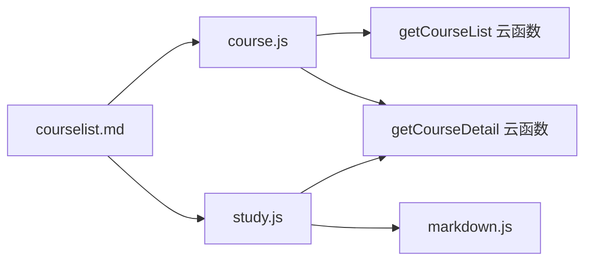

# 课程数据模型

<cite>
**本文引用的文件**   
- [cloudfunctions/getCourseList/index.js](file://cloudfunctions/getCourseList/index.js)
- [cloudfunctions/getCourseDetail/index.js](file://cloudfunctions/getCourseDetail/index.js)
- [miniprogram/pages/course/course.js](file://miniprogram/pages/course/course.js)
- [miniprogram/pages/study/study.js](file://miniprogram/pages/study/study.js)
- [miniprogram/utils/markdown.js](file://miniprogram/utils/markdown.js)
- [docs/courselist.md](file://docs/courselist.md)
</cite>

## 目录
1. [简介](#简介)
2. [项目结构](#项目结构)
3. [核心组件](#核心组件)
4. [架构总览](#架构总览)
5. [详细组件分析](#详细组件分析)
6. [依赖分析](#依赖分析)
7. [性能考虑](#性能考虑)
8. [故障排查指南](#故障排查指南)
9. [结论](#结论)
10. [附录](#附录)

## 简介
本文件围绕“课程数据模型”展开，结合云函数与小程序前端的实际实现，系统化梳理课程表结构设计、课程内容数据结构、分类与标签体系、搜索索引设计、学习进度跟踪、版本管理与更新机制、缓存策略，以及查询优化与批量操作最佳实践。目标是帮助开发者快速理解并高效扩展课程相关的数据结构与业务逻辑。

## 项目结构
本项目采用“小程序前端 + 云函数后端”的架构：
- 小程序端负责页面渲染、用户交互与本地状态管理。
- 云函数提供课程列表与详情等数据接口，承担数据聚合与返回职责。
- 文档目录包含课程清单说明与设计规划。

图表来源
- [miniprogram/pages/course/course.js](file://miniprogram/pages/course/course.js)
- [miniprogram/pages/study/study.js](file://miniprogram/pages/study/study.js)
- [miniprogram/utils/markdown.js](file://miniprogram/utils/markdown.js)
- [cloudfunctions/getCourseList/index.js](file://cloudfunctions/getCourseList/index.js)
- [cloudfunctions/getCourseDetail/index.js](file://cloudfunctions/getCourseDetail/index.js)

章节来源
- [cloudfunctions/getCourseList/index.js](file://cloudfunctions/getCourseList/index.js)
- [cloudfunctions/getCourseDetail/index.js](file://cloudfunctions/getCourseDetail/index.js)
- [miniprogram/pages/course/course.js](file://miniprogram/pages/course/course.js)
- [miniprogram/pages/study/study.js](file://miniprogram/pages/study/study.js)
- [miniprogram/utils/markdown.js](file://miniprogram/utils/markdown.js)
- [docs/courselist.md](file://docs/courselist.md)

## 核心组件
- 课程列表接口（云函数）：负责按条件筛选、分页、排序，返回课程元信息集合。
- 课程详情接口（云函数）：负责返回单门课程完整内容，包括课时、视频资源、文本内容与练习题关联。
- 课程学习页（小程序）：负责加载课程详情、渲染内容、记录学习进度与掌握程度。
- Markdown 工具（小程序）：用于解析文本内容，支撑富文本展示。

章节来源
- [cloudfunctions/getCourseList/index.js](file://cloudfunctions/getCourseList/index.js)
- [cloudfunctions/getCourseDetail/index.js](file://cloudfunctions/getCourseDetail/index.js)
- [miniprogram/pages/course/course.js](file://miniprogram/pages/course/course.js)
- [miniprogram/pages/study/study.js](file://miniprogram/pages/study/study.js)
- [miniprogram/utils/markdown.js](file://miniprogram/utils/markdown.js)

## 架构总览
课程数据在前后端的流转如下：
- 前端调用 getCourseList 获取课程列表，支持分类、标签、难度、关键字等过滤。
- 前端调用 getCourseDetail 获取课程详情，包含课时、视频、文本与练习。
- 学习页维护学习进度、完成时间与掌握程度，并在必要时持久化到云端或本地存储。

图表来源
- [cloudfunctions/getCourseList/index.js](file://cloudfunctions/getCourseList/index.js)
- [cloudfunctions/getCourseDetail/index.js](file://cloudfunctions/getCourseDetail/index.js)
- [miniprogram/pages/course/course.js](file://miniprogram/pages/course/course.js)
- [miniprogram/pages/study/study.js](file://miniprogram/pages/study/study.js)
- [miniprogram/utils/markdown.js](file://miniprogram/utils/markdown.js)

## 详细组件分析

### 课程表结构设计
- 课程ID：唯一标识课程，作为主键。
- 标题：课程名称，用于列表展示与搜索。
- 描述：课程简介，用于摘要展示。
- 封面图片：课程封面URL，用于列表与详情页展示。
- 难度等级：如入门、进阶、高级，用于筛选与排序。
- 课时数量：课程包含的课时总数，用于统计与进度计算。
- 所属章节：课程所属的知识章节或知识图谱节点，用于组织与导航。

建议字段类型与约束：
- 课程ID：字符串或数字，非空且唯一。
- 标题/描述：字符串，长度限制与敏感词过滤。
- 封面图片：URL格式，校验域名白名单。
- 难度等级：枚举值，限定范围。
- 课时数量：整数，大于等于0。
- 所属章节：字符串或外键引用章节表。

章节来源
- [cloudfunctions/getCourseList/index.js](file://cloudfunctions/getCourseList/index.js)
- [cloudfunctions/getCourseDetail/index.js](file://cloudfunctions/getCourseDetail/index.js)
- [docs/courselist.md](file://docs/courselist.md)

### 课程内容数据结构
- 课时：每个课时的基本信息（序号、标题、时长、顺序）。
- 视频资源：视频URL、缩略图、清晰度选项、字幕文件。
- 文本内容：Markdown或HTML片段，支持富文本渲染。
- 练习题：题目类型（单选、多选、填空）、题干、选项、答案、解析、难度。
- 关联关系：课时与视频/文本/练习为一对多或多对一；课程与课时为一对多。

图表来源
- [cloudfunctions/getCourseDetail/index.js](file://cloudfunctions/getCourseDetail/index.js)
- [miniprogram/pages/study/study.js](file://miniprogram/pages/study/study.js)
- [miniprogram/utils/markdown.js](file://miniprogram/utils/markdown.js)

章节来源
- [cloudfunctions/getCourseDetail/index.js](file://cloudfunctions/getCourseDetail/index.js)
- [miniprogram/pages/study/study.js](file://miniprogram/pages/study/study.js)
- [miniprogram/utils/markdown.js](file://miniprogram/utils/markdown.js)

### 课程分类体系、标签系统与搜索索引设计
- 分类体系：一级分类（如学科）、二级分类（如知识点），用于层级筛选与导航。
- 标签系统：自由标签（如“重点”、“易错”、“实战”），用于细粒度检索与推荐。
- 搜索索引：基于标题、描述、标签、章节名构建倒排索引或全文索引，支持关键词匹配、模糊搜索与权重排序。

设计要点：
- 分类与标签可独立维护，避免耦合课程实体。
- 搜索索引需定期重建或增量更新，保证一致性。
- 支持组合查询（分类+标签+难度+关键字）。

章节来源
- [cloudfunctions/getCourseList/index.js](file://cloudfunctions/getCourseList/index.js)
- [docs/courselist.md](file://docs/courselist.md)

### 课程进度跟踪数据模型
- 学习状态：未开始、进行中、已完成。
- 完成时间：最后完成时间戳。
- 掌握程度：百分比或等级（如初识、熟悉、精通）。
- 最近学习时间：最后一次学习的时间戳。
- 错题记录：与练习题关联的错误题号与错误次数。

图表来源
- [miniprogram/pages/study/study.js](file://miniprogram/pages/study/study.js)

章节来源
- [miniprogram/pages/study/study.js](file://miniprogram/pages/study/study.js)

### 课程版本管理与内容更新机制
- 版本号：语义化版本（主版本.次版本.修订号），用于控制兼容性与回滚。
- 变更日志：记录新增、修改、删除的内容与影响范围。
- 发布流程：草稿→审核→灰度→全量发布，确保稳定性。
- 回滚策略：保留历史版本快照，支持一键回滚。

章节来源
- [cloudfunctions/getCourseDetail/index.js](file://cloudfunctions/getCourseDetail/index.js)
- [docs/courselist.md](file://docs/courselist.md)

### 缓存策略
- 列表缓存：课程列表结果按查询条件缓存，设置合理过期时间。
- 详情缓存：课程详情按课程ID缓存，减少重复查询。
- CDN缓存：静态资源（封面、视频缩略图）通过CDN缓存提升加载速度。
- 失效策略：内容更新时主动失效相关缓存，保证一致性。

章节来源
- [cloudfunctions/getCourseList/index.js](file://cloudfunctions/getCourseList/index.js)
- [cloudfunctions/getCourseDetail/index.js](file://cloudfunctions/getCourseDetail/index.js)

### 查询优化与批量操作最佳实践
- 分页与限流：列表接口默认分页，限制每页大小，防止大结果集。
- 索引优化：对常用筛选字段（分类、标签、难度）建立索引。
- 字段裁剪：按需返回字段，减少网络传输。
- 批量操作：合并多次请求为一次批量接口，降低往返开销。
- 幂等性：批量写入接口具备幂等性，避免重复提交导致数据不一致。

章节来源
- [cloudfunctions/getCourseList/index.js](file://cloudfunctions/getCourseList/index.js)
- [cloudfunctions/getCourseDetail/index.js](file://cloudfunctions/getCourseDetail/index.js)

## 依赖分析
- 前端依赖云函数提供的课程列表与详情接口。
- 学习页依赖 Markdown 工具进行文本渲染。
- 课程清单文档为产品需求与设计依据。

图表来源
- [miniprogram/pages/course/course.js](file://miniprogram/pages/course/course.js)
- [miniprogram/pages/study/study.js](file://miniprogram/pages/study/study.js)
- [miniprogram/utils/markdown.js](file://miniprogram/utils/markdown.js)
- [cloudfunctions/getCourseList/index.js](file://cloudfunctions/getCourseList/index.js)
- [cloudfunctions/getCourseDetail/index.js](file://cloudfunctions/getCourseDetail/index.js)
- [docs/courselist.md](file://docs/courselist.md)

章节来源
- [miniprogram/pages/course/course.js](file://miniprogram/pages/course/course.js)
- [miniprogram/pages/study/study.js](file://miniprogram/pages/study/study.js)
- [miniprogram/utils/markdown.js](file://miniprogram/utils/markdown.js)
- [cloudfunctions/getCourseList/index.js](file://cloudfunctions/getCourseList/index.js)
- [cloudfunctions/getCourseDetail/index.js](file://cloudfunctions/getCourseDetail/index.js)
- [docs/courselist.md](file://docs/courselist.md)

## 性能考虑
- 列表接口使用分页与字段裁剪，减少响应体积。
- 详情接口启用缓存与CDN加速静态资源。
- 前端按需加载内容，避免一次性渲染大量数据。
- 对高频查询建立索引，缩短查询延迟。
- 批量操作合并请求，降低网络往返次数。

## 故障排查指南
- 列表接口异常：检查分类、标签、难度参数是否合法；确认索引是否存在；查看缓存是否失效。
- 详情接口异常：核对课程ID有效性；检查课时、视频、文本、练习数据完整性；验证Markdown解析是否成功。
- 学习进度丢失：确认本地存储与云端同步逻辑；检查幂等写入是否生效。
- 渲染问题：检查Markdown工具输出是否符合预期；确认富文本样式是否正确加载。

章节来源
- [cloudfunctions/getCourseList/index.js](file://cloudfunctions/getCourseList/index.js)
- [cloudfunctions/getCourseDetail/index.js](file://cloudfunctions/getCourseDetail/index.js)
- [miniprogram/pages/study/study.js](file://miniprogram/pages/study/study.js)
- [miniprogram/utils/markdown.js](file://miniprogram/utils/markdown.js)

## 结论
本课程数据模型以清晰的课程表结构与内容数据结构为基础，结合分类、标签与搜索索引，形成完整的课程检索与展示能力。通过学习进度跟踪、版本管理与缓存策略，保障用户体验与系统稳定性。配合查询优化与批量操作最佳实践，可在高并发场景下保持良好性能。

## 附录
- 术语定义：课程、课时、视频资源、文本内容、练习题、分类、标签、搜索索引、学习进度、掌握程度、版本号、缓存策略。
- 参考文档：课程清单说明与设计规划。

章节来源
- [docs/courselist.md](file://docs/courselist.md)