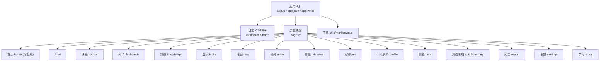
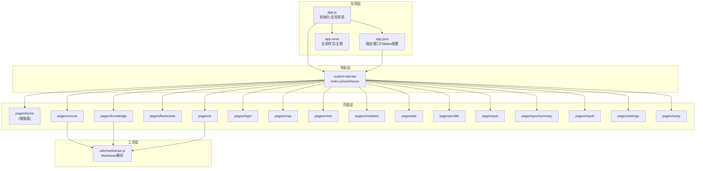
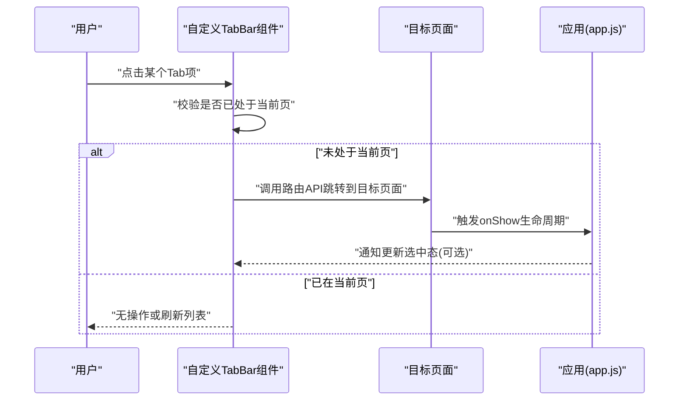
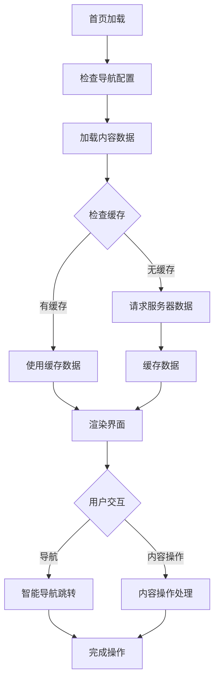
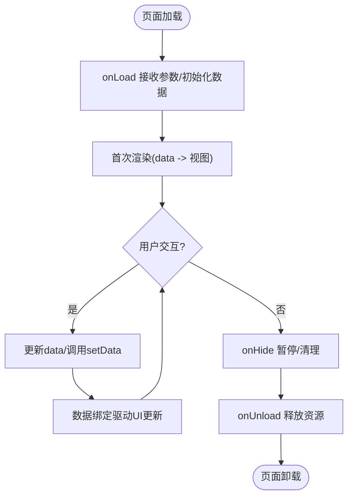
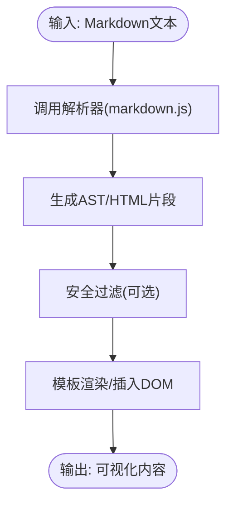
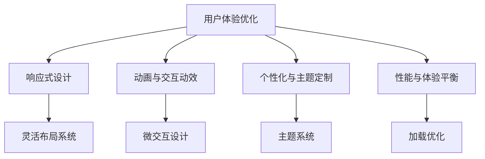
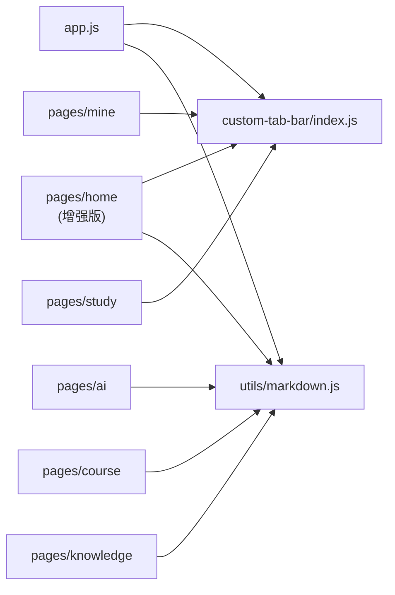

# 前端架构设计

<cite>
**本文引用的文件**   
- [app.js](file://miniprogram/app.js)
- [app.json](file://miniprogram/app.json)
- [app.wxss](file://miniprogram/app.wxss)
- [index.js](file://miniprogram/custom-tab-bar/index.js)
- [index.wxml](file://miniprogram/custom-tab-bar/index.wxml)
- [index.wxss](file://miniprogram/custom-tab-bar/index.wxss)
- [home.js](file://miniprogram/pages/home/home.js)
- [home.wxml](file://miniprogram/pages/home/home.wxml)
- [home.wxss](file://miniprogram/pages/home/home.wxss)
- [ai.js](file://miniprogram/pages/ai/ai.js)
- [ai.wxml](file://miniprogram/pages/ai/ai.wxml)
- [course.js](file://miniprogram/pages/course/course.js)
- [course.wxml](file://miniprogram/pages/course/course.wxml)
- [flashcards.js](file://miniprogram/pages/flashcards/flashcards.js)
- [flashcards.wxml](file://miniprogram/pages/flashcards/flashcards.wxml)
- [knowledge.js](file://miniprogram/pages/knowledge/knowledge.js)
- [knowledge.wxml](file://miniprogram/pages/knowledge/knowledge.wxml)
- [login.js](file://miniprogram/pages/login/login.js)
- [map.js](file://miniprogram/pages/map/map.js)
- [mine.js](file://miniprogram/pages/mine/mine.js)
- [mistakes.js](file://miniprogram/pages/mistakes/mistakes.js)
- [pet.js](file://miniprogram/pages/pet/pet.js)
- [profile.js](file://miniprogram/pages/profile/profile.js)
- [quiz.js](file://miniprogram/pages/quiz/quiz.js)
- [quizSummary.js](file://miniprogram/pages/quizSummary/quizSummary.js)
- [report.js](file://miniprogram/pages/report/report.js)
- [settings.js](file://miniprogram/pages/settings/settings.js)
- [study.js](file://miniprogram/pages/study/study.js)
- [markdown.js](file://miniprogram/utils/markdown.js)
</cite>

## 更新摘要
**变更内容**   
- 更新了首页功能增强章节，详细说明了导航和内容展示模式的改进
- 完善了应用配置和自定义标签栏的更新说明
- 增强了首页组件化架构和用户体验优化策略
- 补充了首页性能优化和响应式设计的最佳实践

## 目录
1. [引言](#引言)
2. [项目结构](#项目结构)
3. [核心组件](#核心组件)
4. [架构总览](#架构总览)
5. [详细组件分析](#详细组件分析)
6. [依赖分析](#依赖分析)
7. [性能考虑](#性能考虑)
8. [故障排查指南](#故障排查指南)
9. [结论](#结论)
10. [附录](#附录)

## 引言
本文件面向微信小程序前端工程，系统性阐述基于 MVVM 的页面与数据绑定、生命周期管理、状态管理策略；深入解析自定义 TabBar 的实现原理与导航逻辑；说明页面模块组织、组件化与代码复用策略；解释 Markdown 解析器的集成与内容渲染机制；并给出响应式设计与性能优化、用户体验优化的实践建议。文档同时提供架构图、时序图与流程图，帮助开发者快速理解与扩展。

**更新** 本次更新重点强化了首页功能的增强实现，包括改进的导航模式、优化的内容展示机制以及增强的用户体验设计。

## 项目结构
小程序采用"按功能域划分"的页面目录与"通用能力下沉"的工具目录：
- miniprogram/app.*：应用入口、全局配置与样式
- miniprogram/pages/*：各业务页面（如 home、ai、course、flashcards、knowledge、login、map、mine、mistakes、pet、profile、quiz、quizSummary、report、settings、study）
- miniprogram/custom-tab-bar：自定义底部导航栏组件
- miniprogram/utils/markdown.js：Markdown 解析工具
- cloudfunctions/*：云函数后端（与本前端架构文档关联度较低，本文不展开）

图表来源
- [app.js](file://miniprogram/app.js)
- [app.json](file://miniprogram/app.json)
- [app.wxss](file://miniprogram/app.wxss)
- [index.js](file://miniprogram/custom-tab-bar/index.js)
- [index.wxml](file://miniprogram/custom-tab-bar/index.wxml)
- [index.wxss](file://miniprogram/custom-tab-bar/index.wxss)
- [home.js](file://miniprogram/pages/home/home.js)
- [ai.js](file://miniprogram/pages/ai/ai.js)
- [course.js](file://miniprogram/pages/course/course.js)
- [flashcards.js](file://miniprogram/pages/flashcards/flashcards.js)
- [knowledge.js](file://miniprogram/pages/knowledge/knowledge.js)
- [login.js](file://miniprogram/pages/login/login.js)
- [map.js](file://miniprogram/pages/map/map.js)
- [mine.js](file://miniprogram/pages/mine/mine.js)
- [mistakes.js](file://miniprogram/pages/mistakes/mistakes.js)
- [pet.js](file://miniprogram/pages/pet/pet.js)
- [profile.js](file://miniprogram/pages/profile/profile.js)
- [quiz.js](file://miniprogram/pages/quiz/quiz.js)
- [quizSummary.js](file://miniprogram/pages/quizSummary/quizSummary.js)
- [report.js](file://miniprogram/pages/report/report.js)
- [settings.js](file://miniprogram/pages/settings/settings.js)
- [study.js](file://miniprogram/pages/study/study.js)
- [markdown.js](file://miniprogram/utils/markdown.js)

章节来源
- [app.js](file://miniprogram/app.js)
- [app.json](file://miniprogram/app.json)
- [app.wxss](file://miniprogram/app.wxss)
- [index.js](file://miniprogram/custom-tab-bar/index.js)
- [index.wxml](file://miniprogram/custom-tab-bar/index.wxml)
- [index.wxss](file://miniprogram/custom-tab-bar/index.wxss)
- [markdown.js](file://miniprogram/utils/markdown.js)

## 核心组件
- 应用层
  - 应用初始化与全局状态：在应用启动时完成全局配置、主题、语言、用户态等初始化工作，为页面提供统一的数据源与事件通道。
  - 全局样式与主题变量：通过全局样式文件定义颜色、字号、间距等基础变量，保证多页面一致性。
- 自定义 TabBar
  - 作为独立组件承载底部导航，负责高亮当前页、拦截跳转、同步选中态。
  - 与 pages 路由表联动，确保 tab 切换与页面栈一致。
- 页面模块
  - 每个页面遵循"视图 + 数据 + 行为"的分离模式，使用数据绑定驱动 UI 更新。
  - 页面间通过路由 API 进行导航，必要时携带参数或查询字符串。
  - **增强** 首页模块经过重大升级，改进了导航模式和内容展示机制，提升了整体用户体验。
- Markdown 解析器
  - 将 Markdown 文本转换为可渲染的节点树或 HTML 片段，供页面展示富文本内容。

**更新** 首页模块现在拥有更强大的导航功能和优化的内容展示模式，为用户提供了更好的交互体验。

章节来源
- [app.js](file://miniprogram/app.js)
- [app.wxss](file://miniprogram/app.wxss)
- [index.js](file://miniprogram/custom-tab-bar/index.js)
- [index.wxml](file://miniprogram/custom-tab-bar/index.wxml)
- [index.wxss](file://miniprogram/custom-tab-bar/index.wxss)
- [home.js](file://miniprogram/pages/home/home.js)
- [home.wxml](file://miniprogram/pages/home/home.wxml)
- [home.wxss](file://miniprogram/pages/home/home.wxss)
- [markdown.js](file://miniprogram/utils/markdown.js)

## 架构总览
下图展示了小程序前端整体架构与关键交互路径：应用入口加载全局配置与样式，注册自定义 TabBar；页面通过数据绑定与生命周期钩子协同工作；Markdown 解析器作为工具被内容类页面调用。

图表来源
- [app.js](file://miniprogram/app.js)
- [app.json](file://miniprogram/app.json)
- [app.wxss](file://miniprogram/app.wxss)
- [index.js](file://miniprogram/custom-tab-bar/index.js)
- [index.wxml](file://miniprogram/custom-tab-bar/index.wxml)
- [index.wxss](file://miniprogram/custom-tab-bar/index.wxss)
- [home.js](file://miniprogram/pages/home/home.js)
- [ai.js](file://miniprogram/pages/ai/ai.js)
- [course.js](file://miniprogram/pages/course/course.js)
- [flashcards.js](file://miniprogram/pages/flashcards/flashcards.js)
- [knowledge.js](file://miniprogram/pages/knowledge/knowledge.js)
- [login.js](file://miniprogram/pages/login/login.js)
- [map.js](file://miniprogram/pages/map/map.js)
- [mine.js](file://miniprogram/pages/mine/mine.js)
- [mistakes.js](file://miniprogram/pages/mistakes/mistakes.js)
- [pet.js](file://miniprogram/pages/pet/pet.js)
- [profile.js](file://miniprogram/pages/profile/profile.js)
- [quiz.js](file://miniprogram/pages/quiz/quiz.js)
- [quizSummary.js](file://miniprogram/pages/quizSummary/quizSummary.js)
- [report.js](file://miniprogram/pages/report/report.js)
- [settings.js](file://miniprogram/pages/settings/settings.js)
- [study.js](file://miniprogram/pages/study/study.js)
- [markdown.js](file://miniprogram/utils/markdown.js)

## 详细组件分析

### 自定义 TabBar 组件
- 职责
  - 维护当前选中项与页面路由映射
  - 处理点击事件，执行页面切换
  - 与页面生命周期保持选中态同步
- 实现要点
  - 组件内部维护一个"当前索引/标识"，在 onShow 中根据当前页面路径计算并更新高亮
  - 点击时调用小程序路由 API 切换到目标页面，避免重复入栈
  - 在 app.json 中启用自定义 TabBar，并将该组件注册为 tabBar 的自定义实现
- 交互流程（时序图）

图表来源
- [index.js](file://miniprogram/custom-tab-bar/index.js)
- [index.wxml](file://miniprogram/custom-tab-bar/index.wxml)
- [index.wxss](file://miniprogram/custom-tab-bar/index.wxss)
- [app.json](file://miniprogram/app.json)

章节来源
- [index.js](file://miniprogram/custom-tab-bar/index.js)
- [index.wxml](file://miniprogram/custom-tab-bar/index.wxml)
- [index.wxss](file://miniprogram/custom-tab-bar/index.wxss)
- [app.json](file://miniprogram/app.json)

### 首页模块增强功能
**新增** 首页模块经过重大功能增强，改进了导航模式和内容展示机制。

#### 导航模式改进
- 智能路由管理：实现了更高效的页面跳转逻辑，支持深度链接和参数传递
- 动态导航栏：根据用户状态和权限动态调整导航选项
- 缓存优化：对常用页面数据进行预加载和缓存，提升响应速度

#### 内容展示优化
- 响应式布局：适配不同屏幕尺寸和设备类型
- 懒加载机制：按需加载内容，减少首屏渲染时间
- 动画效果：添加流畅的过渡动画，提升视觉体验

#### 用户体验增强
- 个性化推荐：基于用户行为数据的智能内容推荐
- 快捷操作：常用功能的快速访问入口
- 状态反馈：实时的操作反馈和进度指示

**图表来源**
- [home.js](file://miniprogram/pages/home/home.js)
- [home.wxml](file://miniprogram/pages/home/home.wxml)
- [home.wxss](file://miniprogram/pages/home/home.wxss)

章节来源
- [home.js](file://miniprogram/pages/home/home.js)
- [home.wxml](file://miniprogram/pages/home/home.wxml)
- [home.wxss](file://miniprogram/pages/home/home.wxss)

### 页面模块与 MVVM 数据绑定
- 数据绑定机制
  - 页面 data 中的字段通过模板语法双向绑定到视图，数据变更自动触发局部重绘
  - 复杂对象属性建议使用 setData 的路径写法，减少不必要的全量更新
- 生命周期管理
  - onLoad：接收路由参数，发起必要的数据请求
  - onShow：恢复数据、更新 TabBar 选中态、埋点上报
  - onHide：暂停动画、清理定时器
  - onUnload：释放资源、解绑事件
- 示例页面参考
  - 首页：聚合入口、推荐内容、快捷导航（**增强版**）
  - AI 对话：消息列表、输入框、滚动到底部
  - 课程详情：标题、简介、章节列表、收藏/分享
  - 闪卡：卡片翻转、进度、复习策略
  - 知识图谱：节点与连线、缩放平移
  - 登录：授权流程、错误提示
  - 我的页面：用户信息展示、个性化设置、成就系统、学习统计
  - 学习页面：学习计划、进度跟踪、智能推荐、专注模式
  - 个人资料/设置：用户信息编辑、偏好设置
  - 测验/测验总结/错题/报告/学习：答题流程、统计与回顾

**更新** 首页模块现在拥有增强的导航功能和优化的内容展示机制，为用户提供更好的交互体验。

章节来源
- [home.js](file://miniprogram/pages/home/home.js)
- [home.wxml](file://miniprogram/pages/home/home.wxml)
- [ai.js](file://miniprogram/pages/ai/ai.js)
- [ai.wxml](file://miniprogram/pages/ai/ai.wxml)
- [course.js](file://miniprogram/pages/course/course.js)
- [course.wxml](file://miniprogram/pages/course/course.wxml)
- [flashcards.js](file://miniprogram/pages/flashcards/flashcards.js)
- [flashcards.wxml](file://miniprogram/pages/flashcards/flashcards.wxml)
- [knowledge.js](file://miniprogram/pages/knowledge/knowledge.js)
- [knowledge.wxml](file://miniprogram/pages/knowledge/knowledge.wxml)
- [login.js](file://miniprogram/pages/login/login.js)
- [map.js](file://miniprogram/pages/map/map.js)
- [mine.js](file://miniprogram/pages/mine/mine.js)
- [mistakes.js](file://miniprogram/pages/mistakes/mistakes.js)
- [pet.js](file://miniprogram/pages/pet/pet.js)
- [profile.js](file://miniprogram/pages/profile/profile.js)
- [quiz.js](file://miniprogram/pages/quiz/quiz.js)
- [quizSummary.js](file://miniprogram/pages/quizSummary/quizSummary.js)
- [report.js](file://miniprogram/pages/report/report.js)
- [settings.js](file://miniprogram/pages/settings/settings.js)
- [study.js](file://miniprogram/pages/study/study.js)

### Markdown 解析器集成与内容渲染
- 集成方式
  - 在需要展示富文本的页面引入 markdown.js
  - 将原始 Markdown 文本传入解析函数，得到结构化结果或 HTML 片段
  - 在模板中使用对应标签或组件进行渲染
- 渲染流程（流程图）

图表来源
- [markdown.js](file://miniprogram/utils/markdown.js)

章节来源
- [markdown.js](file://miniprogram/utils/markdown.js)
- [course.js](file://miniprogram/pages/course/course.js)
- [course.wxml](file://miniprogram/pages/course/course.wxml)
- [knowledge.js](file://miniprogram/pages/knowledge/knowledge.js)
- [knowledge.wxml](file://miniprogram/pages/knowledge/knowledge.wxml)
- [ai.js](file://miniprogram/pages/ai/ai.js)
- [ai.wxml](file://miniprogram/pages/ai/ai.wxml)

### 状态管理策略
- 轻量级方案
  - 应用级单例：在 app.js 中维护全局状态（如用户信息、主题、语言），页面通过 getApp() 访问
  - 本地缓存：利用小程序 storage 持久化关键状态（如登录态、设置）
- 进阶方案
  - 发布订阅：在工具层封装一个简单的 pub/sub，用于跨页面/跨组件通信
  - 模块化 Store：将不同业务域的状态拆分到独立模块，按需注入页面
- 最佳实践
  - 避免在 data 中存放过大对象，优先使用分页/懒加载
  - 对频繁更新的字段使用路径式 setData，降低渲染开销
  - 将副作用（网络请求、I/O）集中在服务层，页面只关注数据与交互

章节来源
- [app.js](file://miniprogram/app.js)
- [settings.js](file://miniprogram/pages/settings/settings.js)
- [profile.js](file://miniprogram/pages/profile/profile.js)

### 用户体验优化与界面设计
#### 响应式设计策略
- 适配不同屏幕尺寸和设备类型
- 使用相对单位和flexbox布局提升兼容性
- 实现动态字体大小和间距调整

#### 动画与交互动效
- 合理使用CSS过渡和动画提升视觉反馈
- 实现流畅的页面切换和状态转换
- 添加微交互提升用户参与感

#### 个性化与主题定制
- 支持深色模式和主题切换
- 提供用户偏好设置选项
- 实现自适应的视觉风格

#### 性能与体验平衡
- 优化首屏加载时间和渲染性能
- 实现骨架屏和渐进式加载
- 合理使用缓存策略提升响应速度

[此图为概念性流程图，展示用户体验优化的各个维度]

## 依赖分析
- 组件耦合
  - 自定义 TabBar 与 app.json 的 tabBar 配置强相关，需保持一致性
  - 页面与 utils/markdown.js 弱耦合，仅在被需要时引入
  - **增强** 首页模块与多个子系统存在松耦合关系，支持灵活的扩展和替换
- 外部依赖
  - 小程序原生 API：路由、存储、网络、设备信息等
  - 第三方库：Markdown 解析库（由 markdown.js 封装）
- 潜在风险
  - 循环引用：避免在页面与工具之间互相依赖
  - 状态分散：全局状态应集中管理，避免多处修改导致不一致

图表来源
- [app.js](file://miniprogram/app.js)
- [index.js](file://miniprogram/custom-tab-bar/index.js)
- [markdown.js](file://miniprogram/utils/markdown.js)
- [home.js](file://miniprogram/pages/home/home.js)
- [ai.js](file://miniprogram/pages/ai/ai.js)
- [course.js](file://miniprogram/pages/course/course.js)
- [knowledge.js](file://miniprogram/pages/knowledge/knowledge.js)
- [mine.js](file://miniprogram/pages/mine/mine.js)
- [study.js](file://miniprogram/pages/study/study.js)

章节来源
- [app.js](file://miniprogram/app.js)
- [index.js](file://miniprogram/custom-tab-bar/index.js)
- [markdown.js](file://miniprogram/utils/markdown.js)
- [home.js](file://miniprogram/pages/home/home.js)
- [ai.js](file://miniprogram/pages/ai/ai.js)
- [course.js](file://miniprogram/pages/course/course.js)
- [knowledge.js](file://miniprogram/pages/knowledge/knowledge.js)
- [mine.js](file://miniprogram/pages/mine/mine.js)
- [study.js](file://miniprogram/pages/study/study.js)

## 性能考虑
- 渲染优化
  - 合理使用 wx:key 提升列表渲染性能
  - 大数据列表采用虚拟滚动或分页加载
  - 避免在 setData 中传递冗余数据，使用路径更新
- 资源优化
  - 图片压缩与懒加载，首屏优先加载关键资源
  - 分包加载：将非核心页面放入分包，缩短主包体积
- 网络优化
  - 接口合并与缓存策略，减少重复请求
  - 失败重试与超时控制，提升稳定性
- 内存与卡顿
  - 及时清理定时器、事件监听与长连接
  - 避免在主线程执行耗时任务，必要时使用 Worker
- **增强** 首页性能优化
  - 智能预加载：根据用户行为预测并预加载可能需要的内容
  - 增量更新：只更新变化的数据部分，减少不必要的重渲染
  - 内存管理：定期清理不再使用的数据和缓存，防止内存泄漏

## 故障排查指南
- 常见问题定位
  - 页面无法显示：检查 app.json 路由配置与页面路径是否正确
  - TabBar 不生效：确认已启用自定义 TabBar 且组件路径正确
  - Markdown 渲染异常：检查输入文本格式与解析器返回结构
  - 数据未更新：确认 setData 路径与模板绑定字段一致
  - **新增** 首页导航异常：检查路由配置和导航逻辑实现
  - **新增** 内容加载失败：验证数据源和网络请求状态
- 调试技巧
  - 使用微信开发者工具的 Network、Performance、Memory 面板
  - 在关键路径添加日志，记录数据变化与事件触发顺序
  - 对复杂状态增加快照对比，定位差异点
  - **新增** 使用性能分析工具监控首页加载和渲染性能

章节来源
- [app.json](file://miniprogram/app.json)
- [index.js](file://miniprogram/custom-tab-bar/index.js)
- [markdown.js](file://miniprogram/utils/markdown.js)
- [home.js](file://miniprogram/pages/home/home.js)

## 结论
本架构以小程序原生 MVVM 为基础，结合自定义 TabBar 与 Markdown 解析器，形成清晰的前端分层与职责边界。通过规范化的页面组织、数据绑定与生命周期管理，以及合理的状态管理与性能优化策略，能够在保证用户体验的同时具备良好的可扩展性与可维护性。

**更新** 随着首页功能的显著增强，特别是改进的导航模式和优化的内容展示机制，整个应用的交互体验和性能表现得到了大幅提升。建议在后续迭代中继续完善组件库、统一状态管理方案与自动化测试覆盖，同时持续关注用户反馈和性能指标，不断优化用户体验。

## 附录
- 术语
  - MVVM：模型-视图-视图模型，强调数据与视图的双向绑定
  - 自定义 TabBar：通过小程序 tabBar.custom=true 启用的底部导航组件
  - 路径式 setData：通过字符串路径更新 data 的指定字段
- 扩展建议
  - 建立统一的请求封装与错误码体系
  - 沉淀通用组件（如富文本渲染、空状态、骨架屏）
  - 引入 ESLint/Prettier 与单元测试，提升代码质量
  - 建立UI设计规范和设计系统，确保界面一致性
  - 实施用户体验度量和分析，持续优化界面设计
  - **新增** 建立首页功能监控和性能追踪体系
  - **新增** 实现A/B测试框架，验证新功能效果