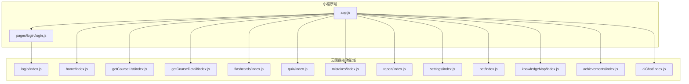
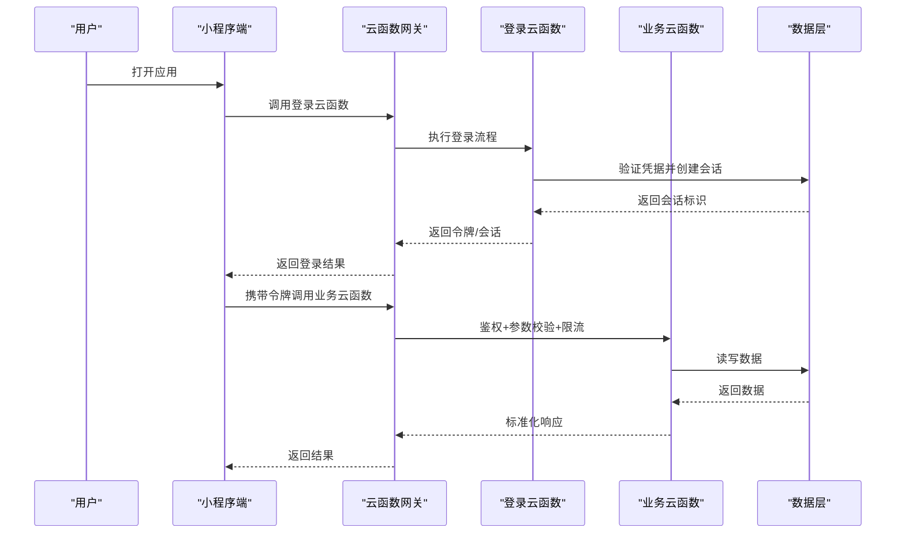
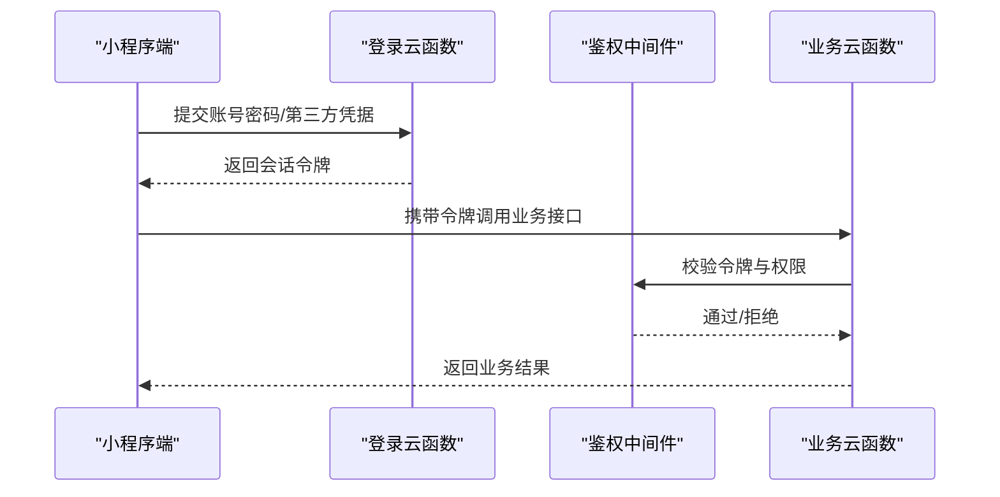
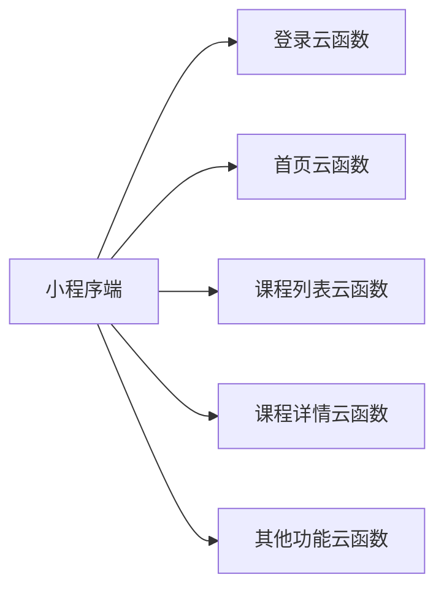

# API设计规范

<cite>
**本文档引用的文件**   
- [cloudfunctions/login/index.js](file://cloudfunctions/login/index.js)
- [cloudfunctions/home/index.js](file://cloudfunctions/home/index.js)
- [cloudfunctions/getCourseList/index.js](file://cloudfunctions/getCourseList/index.js)
- [cloudfunctions/getCourseDetail/index.js](file://cloudfunctions/getCourseDetail/index.js)
- [cloudfunctions/flashcards/index.js](file://cloudfunctions/flashcards/index.js)
- [cloudfunctions/quiz/index.js](file://cloudfunctions/quiz/index.js)
- [cloudfunctions/mistakes/index.js](file://cloudfunctions/mistakes/index.js)
- [cloudfunctions/report/index.js](file://cloudfunctions/report/index.js)
- [cloudfunctions/settings/index.js](file://cloudfunctions/settings/index.js)
- [cloudfunctions/pet/index.js](file://cloudfunctions/pet/index.js)
- [cloudfunctions/knowledgeMap/index.js](file://cloudfunctions/knowledgeMap/index.js)
- [cloudfunctions/achievements/index.js](file://cloudfunctions/achievements/index.js)
- [cloudfunctions/aiChat/index.js](file://cloudfunctions/aiChat/index.js)
- [miniprogram/pages/login/login.js](file://miniprogram/pages/login/login.js)
- [miniprogram/app.js](file://miniprogram/app.js)
</cite>

## 目录
1. [引言](#引言)
2. [项目结构](#项目结构)
3. [核心组件](#核心组件)
4. [架构总览](#架构总览)
5. [详细组件分析](#详细组件分析)
6. [依赖分析](#依赖分析)
7. [性能考虑](#性能考虑)
8. [故障排查指南](#故障排查指南)
9. [结论](#结论)
10. [附录](#附录)

## 引言
本规范面向云函数RESTful API，统一接口设计、参数校验、响应格式与错误码定义，明确版本管理策略、向后兼容与废弃迁移方案；同时给出认证授权、权限控制、访问限制、限流防护、缓存策略与性能优化建议，并提供最佳实践、调试方法与完整调用示例。

## 项目结构
本项目采用“按功能域划分”的云函数组织方式：每个业务域一个独立云函数目录，入口为 index.js，配合 package.json 与 config.json 进行依赖与配置管理。小程序端通过 miniprogram 页面发起调用。

图表来源
- [miniprogram/app.js](file://miniprogram/app.js)
- [miniprogram/pages/login/login.js](file://miniprogram/pages/login/login.js)
- [cloudfunctions/login/index.js](file://cloudfunctions/login/index.js)
- [cloudfunctions/home/index.js](file://cloudfunctions/home/index.js)
- [cloudfunctions/getCourseList/index.js](file://cloudfunctions/getCourseList/index.js)
- [cloudfunctions/getCourseDetail/index.js](file://cloudfunctions/getCourseDetail/index.js)
- [cloudfunctions/flashcards/index.js](file://cloudfunctions/flashcards/index.js)
- [cloudfunctions/quiz/index.js](file://cloudfunctions/quiz/index.js)
- [cloudfunctions/mistakes/index.js](file://cloudfunctions/mistakes/index.js)
- [cloudfunctions/report/index.js](file://cloudfunctions/report/index.js)
- [cloudfunctions/settings/index.js](file://cloudfunctions/settings/index.js)
- [cloudfunctions/pet/index.js](file://cloudfunctions/pet/index.js)
- [cloudfunctions/knowledgeMap/index.js](file://cloudfunctions/knowledgeMap/index.js)
- [cloudfunctions/achievements/index.js](file://cloudfunctions/achievements/index.js)
- [cloudfunctions/aiChat/index.js](file://cloudfunctions/aiChat/index.js)

章节来源
- [miniprogram/app.js](file://miniprogram/app.js)
- [miniprogram/pages/login/login.js](file://miniprogram/pages/login/login.js)
- [cloudfunctions/login/index.js](file://cloudfunctions/login/index.js)
- [cloudfunctions/home/index.js](file://cloudfunctions/home/index.js)
- [cloudfunctions/getCourseList/index.js](file://cloudfunctions/getCourseList/index.js)
- [cloudfunctions/getCourseDetail/index.js](file://cloudfunctions/getCourseDetail/index.js)
- [cloudfunctions/flashcards/index.js](file://cloudfunctions/flashcards/index.js)
- [cloudfunctions/quiz/index.js](file://cloudfunctions/quiz/index.js)
- [cloudfunctions/mistakes/index.js](file://cloudfunctions/mistakes/index.js)
- [cloudfunctions/report/index.js](file://cloudfunctions/report/index.js)
- [cloudfunctions/settings/index.js](file://cloudfunctions/settings/index.js)
- [cloudfunctions/pet/index.js](file://cloudfunctions/pet/index.js)
- [cloudfunctions/knowledgeMap/index.js](file://cloudfunctions/knowledgeMap/index.js)
- [cloudfunctions/achievements/index.js](file://cloudfunctions/achievements/index.js)
- [cloudfunctions/aiChat/index.js](file://cloudfunctions/aiChat/index.js)

## 核心组件
- 登录与会话：负责用户身份获取与凭证传递，后续请求携带会话标识以完成鉴权。
- 首页聚合：聚合课程列表、学习进度等基础信息，减少前端多次往返。
- 课程相关：课程列表与详情查询，支持分页与筛选。
- 学习工具：闪卡、错题、测验、报告、设置、宠物、知识图谱、成就、AI对话等功能云函数。

章节来源
- [cloudfunctions/login/index.js](file://cloudfunctions/login/index.js)
- [cloudfunctions/home/index.js](file://cloudfunctions/home/index.js)
- [cloudfunctions/getCourseList/index.js](file://cloudfunctions/getCourseList/index.js)
- [cloudfunctions/getCourseDetail/index.js](file://cloudfunctions/getCourseDetail/index.js)
- [cloudfunctions/flashcards/index.js](file://cloudfunctions/flashcards/index.js)
- [cloudfunctions/quiz/index.js](file://cloudfunctions/quiz/index.js)
- [cloudfunctions/mistakes/index.js](file://cloudfunctions/mistakes/index.js)
- [cloudfunctions/report/index.js](file://cloudfunctions/report/index.js)
- [cloudfunctions/settings/index.js](file://cloudfunctions/settings/index.js)
- [cloudfunctions/pet/index.js](file://cloudfunctions/pet/index.js)
- [cloudfunctions/knowledgeMap/index.js](file://cloudfunctions/knowledgeMap/index.js)
- [cloudfunctions/achievements/index.js](file://cloudfunctions/achievements/index.js)
- [cloudfunctions/aiChat/index.js](file://cloudfunctions/aiChat/index.js)

## 架构总览
整体采用“小程序端 -> 云函数网关 -> 各功能云函数 -> 数据层”的无服务器架构。云函数作为API边界，承担参数校验、鉴权、限流、缓存与业务编排职责。

图表来源
- [cloudfunctions/login/index.js](file://cloudfunctions/login/index.js)
- [cloudfunctions/home/index.js](file://cloudfunctions/home/index.js)
- [cloudfunctions/getCourseList/index.js](file://cloudfunctions/getCourseList/index.js)
- [cloudfunctions/getCourseDetail/index.js](file://cloudfunctions/getCourseDetail/index.js)
- [cloudfunctions/flashcards/index.js](file://cloudfunctions/flashcards/index.js)
- [cloudfunctions/quiz/index.js](file://cloudfunctions/quiz/index.js)
- [cloudfunctions/mistakes/index.js](file://cloudfunctions/mistakes/index.js)
- [cloudfunctions/report/index.js](file://cloudfunctions/report/index.js)
- [cloudfunctions/settings/index.js](file://cloudfunctions/settings/index.js)
- [cloudfunctions/pet/index.js](file://cloudfunctions/pet/index.js)
- [cloudfunctions/knowledgeMap/index.js](file://cloudfunctions/knowledgeMap/index.js)
- [cloudfunctions/achievements/index.js](file://cloudfunctions/achievements/index.js)
- [cloudfunctions/aiChat/index.js](file://cloudfunctions/aiChat/index.js)

## 详细组件分析

### 统一响应格式与错误码
- 成功响应
  - 字段约定：状态码、消息、数据体、时间戳、追踪ID。
  - 数据体包含业务所需字段，避免冗余。
- 失败响应
  - 字段约定：状态码、错误码、消息、可选的错误详情与定位信息。
- 通用错误码分类
  - 客户端错误：参数缺失、类型不合法、越权访问等。
  - 服务端错误：数据库异常、第三方服务不可用、内部逻辑错误等。
  - 系统级错误：限流、超时、熔断等。

章节来源
- [cloudfunctions/login/index.js](file://cloudfunctions/login/index.js)
- [cloudfunctions/home/index.js](file://cloudfunctions/home/index.js)
- [cloudfunctions/getCourseList/index.js](file://cloudfunctions/getCourseList/index.js)
- [cloudfunctions/getCourseDetail/index.js](file://cloudfunctions/getCourseDetail/index.js)
- [cloudfunctions/flashcards/index.js](file://cloudfunctions/flashcards/index.js)
- [cloudfunctions/quiz/index.js](file://cloudfunctions/quiz/index.js)
- [cloudfunctions/mistakes/index.js](file://cloudfunctions/mistakes/index.js)
- [cloudfunctions/report/index.js](file://cloudfunctions/report/index.js)
- [cloudfunctions/settings/index.js](file://cloudfunctions/settings/index.js)
- [cloudfunctions/pet/index.js](file://cloudfunctions/pet/index.js)
- [cloudfunctions/knowledgeMap/index.js](file://cloudfunctions/knowledgeMap/index.js)
- [cloudfunctions/achievements/index.js](file://cloudfunctions/achievements/index.js)
- [cloudfunctions/aiChat/index.js](file://cloudfunctions/aiChat/index.js)

### 请求参数校验
- 必填校验：对关键字段进行存在性与非空校验。
- 类型与范围：字符串长度、数值范围、枚举值、日期格式等。
- 安全过滤：输入清洗、XSS/SQL注入防护、大小写规范化。
- 批量操作：分页参数、排序字段白名单、最大条数限制。

章节来源
- [cloudfunctions/getCourseList/index.js](file://cloudfunctions/getCourseList/index.js)
- [cloudfunctions/getCourseDetail/index.js](file://cloudfunctions/getCourseDetail/index.js)
- [cloudfunctions/flashcards/index.js](file://cloudfunctions/flashcards/index.js)
- [cloudfunctions/quiz/index.js](file://cloudfunctions/quiz/index.js)
- [cloudfunctions/mistakes/index.js](file://cloudfunctions/mistakes/index.js)
- [cloudfunctions/report/index.js](file://cloudfunctions/report/index.js)
- [cloudfunctions/settings/index.js](file://cloudfunctions/settings/index.js)
- [cloudfunctions/pet/index.js](file://cloudfunctions/pet/index.js)
- [cloudfunctions/knowledgeMap/index.js](file://cloudfunctions/knowledgeMap/index.js)
- [cloudfunctions/achievements/index.js](file://cloudfunctions/achievements/index.js)
- [cloudfunctions/aiChat/index.js](file://cloudfunctions/aiChat/index.js)

### 认证与授权
- 登录流程
  - 小程序端调用登录云函数，获取会话令牌。
  - 令牌在后续请求中通过Header或上下文传递。
- 鉴权机制
  - 基于令牌的会话校验，校验失败返回未认证错误。
  - 资源级权限控制：仅允许访问自身数据或具备权限的数据。
- 最小权限原则
  - 按功能域授予最小必要权限，避免过度授权。

图表来源
- [cloudfunctions/login/index.js](file://cloudfunctions/login/index.js)
- [cloudfunctions/home/index.js](file://cloudfunctions/home/index.js)
- [cloudfunctions/getCourseList/index.js](file://cloudfunctions/getCourseList/index.js)
- [cloudfunctions/getCourseDetail/index.js](file://cloudfunctions/getCourseDetail/index.js)
- [cloudfunctions/flashcards/index.js](file://cloudfunctions/flashcards/index.js)
- [cloudfunctions/quiz/index.js](file://cloudfunctions/quiz/index.js)
- [cloudfunctions/mistakes/index.js](file://cloudfunctions/mistakes/index.js)
- [cloudfunctions/report/index.js](file://cloudfunctions/report/index.js)
- [cloudfunctions/settings/index.js](file://cloudfunctions/settings/index.js)
- [cloudfunctions/pet/index.js](file://cloudfunctions/pet/index.js)
- [cloudfunctions/knowledgeMap/index.js](file://cloudfunctions/knowledgeMap/index.js)
- [cloudfunctions/achievements/index.js](file://cloudfunctions/achievements/index.js)
- [cloudfunctions/aiChat/index.js](file://cloudfunctions/aiChat/index.js)

章节来源
- [cloudfunctions/login/index.js](file://cloudfunctions/login/index.js)
- [cloudfunctions/home/index.js](file://cloudfunctions/home/index.js)
- [cloudfunctions/getCourseList/index.js](file://cloudfunctions/getCourseList/index.js)
- [cloudfunctions/getCourseDetail/index.js](file://cloudfunctions/getCourseDetail/index.js)
- [cloudfunctions/flashcards/index.js](file://cloudfunctions/flashcards/index.js)
- [cloudfunctions/quiz/index.js](file://cloudfunctions/quiz/index.js)
- [cloudfunctions/mistakes/index.js](file://cloudfunctions/mistakes/index.js)
- [cloudfunctions/report/index.js](file://cloudfunctions/report/index.js)
- [cloudfunctions/settings/index.js](file://cloudfunctions/settings/index.js)
- [cloudfunctions/pet/index.js](file://cloudfunctions/pet/index.js)
- [cloudfunctions/knowledgeMap/index.js](file://cloudfunctions/knowledgeMap/index.js)
- [cloudfunctions/achievements/index.js](file://cloudfunctions/achievements/index.js)
- [cloudfunctions/aiChat/index.js](file://cloudfunctions/aiChat/index.js)

### 版本管理与兼容性
- 版本策略
  - URL路径前缀或请求头指定版本号，如 /v1/...。
  - 重大变更使用新主版本，旧版本保留过渡期。
- 向后兼容
  - 新增字段默认可忽略，删除字段需弃用标记与迁移期。
  - 行为变更提供开关与灰度发布。
- 废弃迁移
  - 提前公告与日志告警，引导客户端升级。
  - 提供兼容层与数据迁移脚本。

章节来源
- [cloudfunctions/getCourseList/index.js](file://cloudfunctions/getCourseList/index.js)
- [cloudfunctions/getCourseDetail/index.js](file://cloudfunctions/getCourseDetail/index.js)
- [cloudfunctions/flashcards/index.js](file://cloudfunctions/flashcards/index.js)
- [cloudfunctions/quiz/index.js](file://cloudfunctions/quiz/index.js)
- [cloudfunctions/mistakes/index.js](file://cloudfunctions/mistakes/index.js)
- [cloudfunctions/report/index.js](file://cloudfunctions/report/index.js)
- [cloudfunctions/settings/index.js](file://cloudfunctions/settings/index.js)
- [cloudfunctions/pet/index.js](file://cloudfunctions/pet/index.js)
- [cloudfunctions/knowledgeMap/index.js](file://cloudfunctions/knowledgeMap/index.js)
- [cloudfunctions/achievements/index.js](file://cloudfunctions/achievements/index.js)
- [cloudfunctions/aiChat/index.js](file://cloudfunctions/aiChat/index.js)

### 限流与访问限制
- 限流策略
  - 按用户/IP/接口维度设置QPS上限。
  - 突发流量采用令牌桶或滑动窗口算法。
- 访问限制
  - 黑名单与白名单机制。
  - 敏感接口二次校验与风控规则。
- 降级与熔断
  - 依赖服务异常时快速失败与回退策略。

章节来源
- [cloudfunctions/home/index.js](file://cloudfunctions/home/index.js)
- [cloudfunctions/getCourseList/index.js](file://cloudfunctions/getCourseList/index.js)
- [cloudfunctions/getCourseDetail/index.js](file://cloudfunctions/getCourseDetail/index.js)
- [cloudfunctions/flashcards/index.js](file://cloudfunctions/flashcards/index.js)
- [cloudfunctions/quiz/index.js](file://cloudfunctions/quiz/index.js)
- [cloudfunctions/mistakes/index.js](file://cloudfunctions/mistakes/index.js)
- [cloudfunctions/report/index.js](file://cloudfunctions/report/index.js)
- [cloudfunctions/settings/index.js](file://cloudfunctions/settings/index.js)
- [cloudfunctions/pet/index.js](file://cloudfunctions/pet/index.js)
- [cloudfunctions/knowledgeMap/index.js](file://cloudfunctions/knowledgeMap/index.js)
- [cloudfunctions/achievements/index.js](file://cloudfunctions/achievements/index.js)
- [cloudfunctions/aiChat/index.js](file://cloudfunctions/aiChat/index.js)

### 缓存策略
- 缓存层级
  - 本地缓存：短生命周期热点数据。
  - 分布式缓存：跨实例共享的会话与字典数据。
- 失效策略
  - TTL过期、主动失效、事件驱动更新。
- 一致性保障
  - 先删后写或双写一致策略，必要时引入版本号。

章节来源
- [cloudfunctions/home/index.js](file://cloudfunctions/home/index.js)
- [cloudfunctions/getCourseList/index.js](file://cloudfunctions/getCourseList/index.js)
- [cloudfunctions/getCourseDetail/index.js](file://cloudfunctions/getCourseDetail/index.js)
- [cloudfunctions/flashcards/index.js](file://cloudfunctions/flashcards/index.js)
- [cloudfunctions/quiz/index.js](file://cloudfunctions/quiz/index.js)
- [cloudfunctions/mistakes/index.js](file://cloudfunctions/mistakes/index.js)
- [cloudfunctions/report/index.js](file://cloudfunctions/report/index.js)
- [cloudfunctions/settings/index.js](file://cloudfunctions/settings/index.js)
- [cloudfunctions/pet/index.js](file://cloudfunctions/pet/index.js)
- [cloudfunctions/knowledgeMap/index.js](file://cloudfunctions/knowledgeMap/index.js)
- [cloudfunctions/achievements/index.js](file://cloudfunctions/achievements/index.js)
- [cloudfunctions/aiChat/index.js](file://cloudfunctions/aiChat/index.js)

### 性能优化
- 数据库优化
  - 索引设计与覆盖查询，避免N+1问题。
  - 分页与游标式翻页，减少大结果集传输。
- 网络优化
  - 合并接口、按需加载、压缩传输。
- 计算优化
  - 异步任务与批处理，避免长事务。
  - 预热与连接池复用。

章节来源
- [cloudfunctions/getCourseList/index.js](file://cloudfunctions/getCourseList/index.js)
- [cloudfunctions/getCourseDetail/index.js](file://cloudfunctions/getCourseDetail/index.js)
- [cloudfunctions/flashcards/index.js](file://cloudfunctions/flashcards/index.js)
- [cloudfunctions/quiz/index.js](file://cloudfunctions/quiz/index.js)
- [cloudfunctions/mistakes/index.js](file://cloudfunctions/mistakes/index.js)
- [cloudfunctions/report/index.js](file://cloudfunctions/report/index.js)
- [cloudfunctions/settings/index.js](file://cloudfunctions/settings/index.js)
- [cloudfunctions/pet/index.js](file://cloudfunctions/pet/index.js)
- [cloudfunctions/knowledgeMap/index.js](file://cloudfunctions/knowledgeMap/index.js)
- [cloudfunctions/achievements/index.js](file://cloudfunctions/achievements/index.js)
- [cloudfunctions/aiChat/index.js](file://cloudfunctions/aiChat/index.js)

### 最佳实践与调试方法
- 最佳实践
  - 幂等性设计：重复请求不会产生副作用。
  - 结构化日志：记录关键路径与追踪ID。
  - 监控告警：错误率、延迟、吞吐指标。
- 调试方法
  - 开启调试模式输出详细日志。
  - 使用沙箱环境模拟外部依赖。
  - 断点与链路追踪定位瓶颈。

章节来源
- [cloudfunctions/login/index.js](file://cloudfunctions/login/index.js)
- [cloudfunctions/home/index.js](file://cloudfunctions/home/index.js)
- [cloudfunctions/getCourseList/index.js](file://cloudfunctions/getCourseList/index.js)
- [cloudfunctions/getCourseDetail/index.js](file://cloudfunctions/getCourseDetail/index.js)
- [cloudfunctions/flashcards/index.js](file://cloudfunctions/flashcards/index.js)
- [cloudfunctions/quiz/index.js](file://cloudfunctions/quiz/index.js)
- [cloudfunctions/mistakes/index.js](file://cloudfunctions/mistakes/index.js)
- [cloudfunctions/report/index.js](file://cloudfunctions/report/index.js)
- [cloudfunctions/settings/index.js](file://cloudfunctions/settings/index.js)
- [cloudfunctions/pet/index.js](file://cloudfunctions/pet/index.js)
- [cloudfunctions/knowledgeMap/index.js](file://cloudfunctions/knowledgeMap/index.js)
- [cloudfunctions/achievements/index.js](file://cloudfunctions/achievements/index.js)
- [cloudfunctions/aiChat/index.js](file://cloudfunctions/aiChat/index.js)

### 完整API调用示例与错误处理
- 登录
  - 请求：提交用户名与密码。
  - 响应：返回会话令牌与用户基本信息。
  - 错误：凭据无效、账户锁定、系统异常。
- 获取课程列表
  - 请求：页码、每页数量、筛选条件。
  - 响应：课程集合与分页元信息。
  - 错误：参数非法、权限不足、查询超时。
- 获取课程详情
  - 请求：课程ID。
  - 响应：课程详细信息。
  - 错误：不存在、已下架、读取失败。
- 其他功能
  - 闪卡、测验、错题、报告、设置、宠物、知识图谱、成就、AI对话等遵循统一响应与错误码规范。

章节来源
- [cloudfunctions/login/index.js](file://cloudfunctions/login/index.js)
- [cloudfunctions/getCourseList/index.js](file://cloudfunctions/getCourseList/index.js)
- [cloudfunctions/getCourseDetail/index.js](file://cloudfunctions/getCourseDetail/index.js)
- [cloudfunctions/flashcards/index.js](file://cloudfunctions/flashcards/index.js)
- [cloudfunctions/quiz/index.js](file://cloudfunctions/quiz/index.js)
- [cloudfunctions/mistakes/index.js](file://cloudfunctions/mistakes/index.js)
- [cloudfunctions/report/index.js](file://cloudfunctions/report/index.js)
- [cloudfunctions/settings/index.js](file://cloudfunctions/settings/index.js)
- [cloudfunctions/pet/index.js](file://cloudfunctions/pet/index.js)
- [cloudfunctions/knowledgeMap/index.js](file://cloudfunctions/knowledgeMap/index.js)
- [cloudfunctions/achievements/index.js](file://cloudfunctions/achievements/index.js)
- [cloudfunctions/aiChat/index.js](file://cloudfunctions/aiChat/index.js)

## 依赖分析
- 模块耦合
  - 小程序端通过统一入口调用各云函数，低耦合高内聚。
  - 云函数之间尽量解耦，通过网关或消息队列交互。
- 外部依赖
  - 数据库、缓存、第三方服务的封装与隔离。
- 循环依赖
  - 禁止云函数间直接相互调用，避免循环依赖。

图表来源
- [miniprogram/app.js](file://miniprogram/app.js)
- [cloudfunctions/login/index.js](file://cloudfunctions/login/index.js)
- [cloudfunctions/home/index.js](file://cloudfunctions/home/index.js)
- [cloudfunctions/getCourseList/index.js](file://cloudfunctions/getCourseList/index.js)
- [cloudfunctions/getCourseDetail/index.js](file://cloudfunctions/getCourseDetail/index.js)
- [cloudfunctions/flashcards/index.js](file://cloudfunctions/flashcards/index.js)
- [cloudfunctions/quiz/index.js](file://cloudfunctions/quiz/index.js)
- [cloudfunctions/mistakes/index.js](file://cloudfunctions/mistakes/index.js)
- [cloudfunctions/report/index.js](file://cloudfunctions/report/index.js)
- [cloudfunctions/settings/index.js](file://cloudfunctions/settings/index.js)
- [cloudfunctions/pet/index.js](file://cloudfunctions/pet/index.js)
- [cloudfunctions/knowledgeMap/index.js](file://cloudfunctions/knowledgeMap/index.js)
- [cloudfunctions/achievements/index.js](file://cloudfunctions/achievements/index.js)
- [cloudfunctions/aiChat/index.js](file://cloudfunctions/aiChat/index.js)

章节来源
- [miniprogram/app.js](file://miniprogram/app.js)
- [cloudfunctions/login/index.js](file://cloudfunctions/login/index.js)
- [cloudfunctions/home/index.js](file://cloudfunctions/home/index.js)
- [cloudfunctions/getCourseList/index.js](file://cloudfunctions/getCourseList/index.js)
- [cloudfunctions/getCourseDetail/index.js](file://cloudfunctions/getCourseDetail/index.js)
- [cloudfunctions/flashcards/index.js](file://cloudfunctions/flashcards/index.js)
- [cloudfunctions/quiz/index.js](file://cloudfunctions/quiz/index.js)
- [cloudfunctions/mistakes/index.js](file://cloudfunctions/mistakes/index.js)
- [cloudfunctions/report/index.js](file://cloudfunctions/report/index.js)
- [cloudfunctions/settings/index.js](file://cloudfunctions/settings/index.js)
- [cloudfunctions/pet/index.js](file://cloudfunctions/pet/index.js)
- [cloudfunctions/knowledgeMap/index.js](file://cloudfunctions/knowledgeMap/index.js)
- [cloudfunctions/achievements/index.js](file://cloudfunctions/achievements/index.js)
- [cloudfunctions/aiChat/index.js](file://cloudfunctions/aiChat/index.js)

## 性能考虑
- 接口合并与按需加载，减少RTT。
- 合理分页与增量更新，降低带宽与CPU消耗。
- 缓存热点数据，缩短响应时间。
- 异步化耗时操作，提升吞吐。
- 监控与压测，持续优化瓶颈点。

[本节为通用指导，无需引用具体文件]

## 故障排查指南
- 常见问题
  - 登录失败：检查凭据、网络连通、会话有效期。
  - 权限错误：确认令牌有效与资源权限。
  - 参数错误：核对必填项、类型与范围。
  - 限流触发：降低频率或申请配额。
- 定位步骤
  - 查看错误码与消息，结合追踪ID检索日志。
  - 复现最小用例，逐步缩小范围。
  - 启用调试模式，输出详细上下文。

章节来源
- [cloudfunctions/login/index.js](file://cloudfunctions/login/index.js)
- [cloudfunctions/home/index.js](file://cloudfunctions/home/index.js)
- [cloudfunctions/getCourseList/index.js](file://cloudfunctions/getCourseList/index.js)
- [cloudfunctions/getCourseDetail/index.js](file://cloudfunctions/getCourseDetail/index.js)
- [cloudfunctions/flashcards/index.js](file://cloudfunctions/flashcards/index.js)
- [cloudfunctions/quiz/index.js](file://cloudfunctions/quiz/index.js)
- [cloudfunctions/mistakes/index.js](file://cloudfunctions/mistakes/index.js)
- [cloudfunctions/report/index.js](file://cloudfunctions/report/index.js)
- [cloudfunctions/settings/index.js](file://cloudfunctions/settings/index.js)
- [cloudfunctions/pet/index.js](file://cloudfunctions/pet/index.js)
- [cloudfunctions/knowledgeMap/index.js](file://cloudfunctions/knowledgeMap/index.js)
- [cloudfunctions/achievements/index.js](file://cloudfunctions/achievements/index.js)
- [cloudfunctions/aiChat/index.js](file://cloudfunctions/aiChat/index.js)

## 结论
本规范明确了云函数RESTful API的设计原则与统一接口标准，涵盖参数校验、响应格式、错误码、版本管理、鉴权授权、限流缓存与性能优化，并提供最佳实践与调试方法。遵循本规范有助于提升系统的稳定性、可维护性与可扩展性。

[本节为总结性内容，无需引用具体文件]

## 附录
- 术语表
  - 会话令牌：用于标识用户身份的短期凭证。
  - 幂等性：同一请求多次执行产生相同效果。
  - 灰度发布：逐步放量新版本以降低风险。
- 参考实现路径
  - 登录流程：[cloudfunctions/login/index.js](file://cloudfunctions/login/index.js)
  - 首页聚合：[cloudfunctions/home/index.js](file://cloudfunctions/home/index.js)
  - 课程列表：[cloudfunctions/getCourseList/index.js](file://cloudfunctions/getCourseList/index.js)
  - 课程详情：[cloudfunctions/getCourseDetail/index.js](file://cloudfunctions/getCourseDetail/index.js)
  - 学习工具：[cloudfunctions/flashcards/index.js](file://cloudfunctions/flashcards/index.js)、[cloudfunctions/quiz/index.js](file://cloudfunctions/quiz/index.js)、[cloudfunctions/mistakes/index.js](file://cloudfunctions/mistakes/index.js)、[cloudfunctions/report/index.js](file://cloudfunctions/report/index.js)、[cloudfunctions/settings/index.js](file://cloudfunctions/settings/index.js)、[cloudfunctions/pet/index.js](file://cloudfunctions/pet/index.js)、[cloudfunctions/knowledgeMap/index.js](file://cloudfunctions/knowledgeMap/index.js)、[cloudfunctions/achievements/index.js](file://cloudfunctions/achievements/index.js)、[cloudfunctions/aiChat/index.js](file://cloudfunctions/aiChat/index.js)