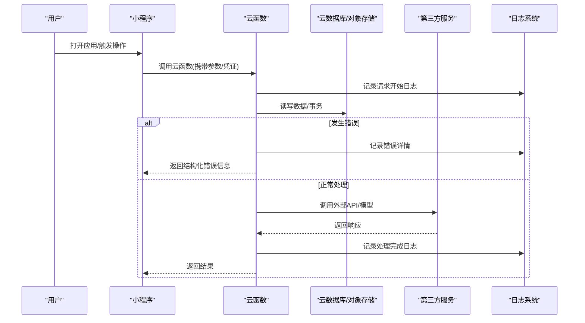
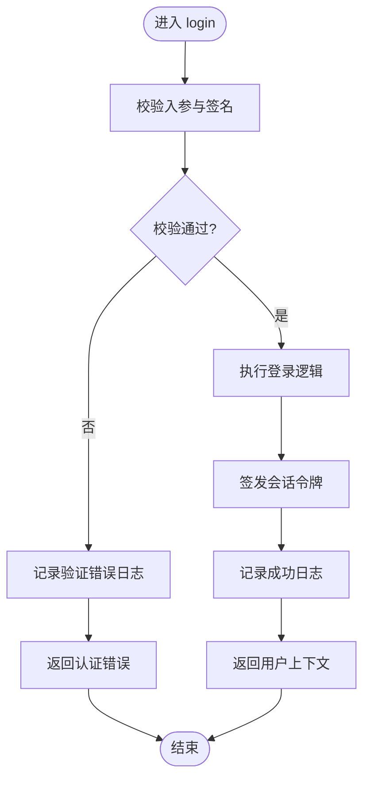
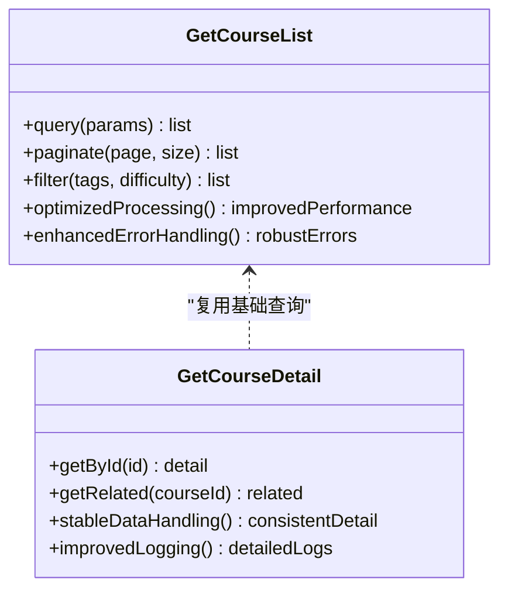
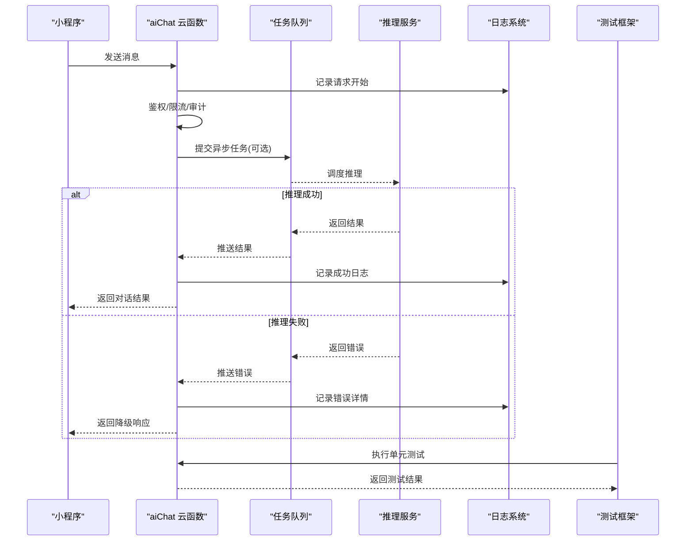
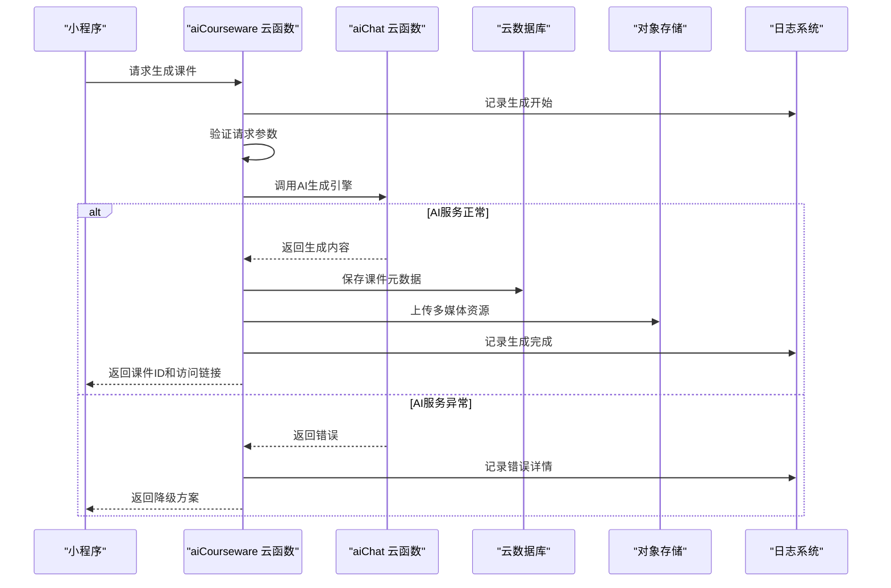
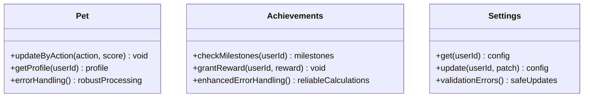
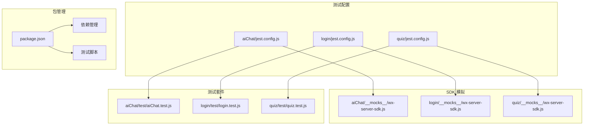
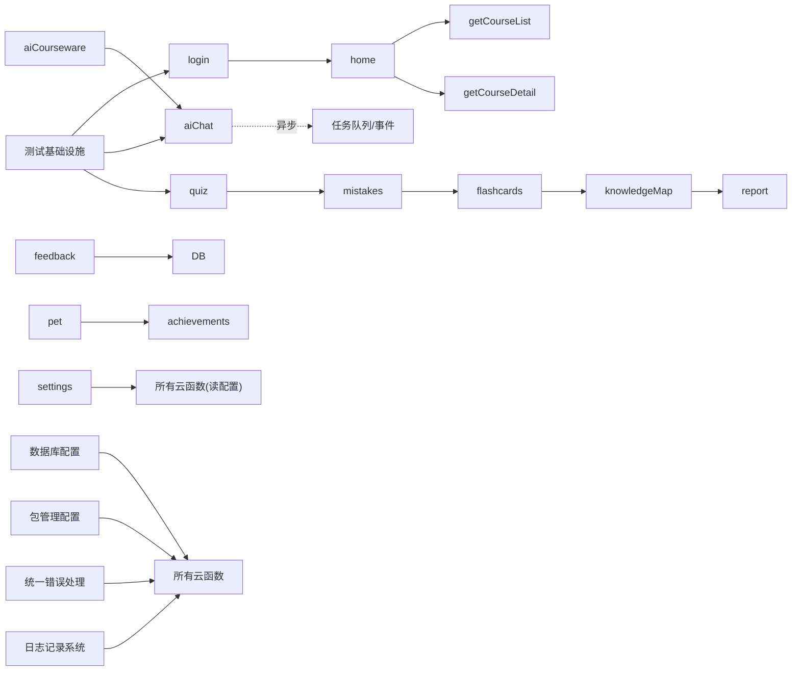

# 云函数架构设计

<cite>
**本文引用的文件**   
- [project.config.json](file://project.config.json)
- [cloudfunctions/login/index.js](file://cloudfunctions/login/index.js)
- [cloudfunctions/home/index.js](file://cloudfunctions/home/index.js)
- [cloudfunctions/getCourseList/index.js](file://cloudfunctions/getCourseList/index.js)
- [cloudfunctions/getCourseDetail/index.js](file://cloudfunctions/getCourseDetail/index.js)
- [cloudfunctions/aiChat/index.js](file://cloudfunctions/aiChat/index.js)
- [cloudfunctions/aiCourseware/index.js](file://cloudfunctions/aiCourseware/index.js)
- [cloudfunctions/feedback/index.js](file://cloudfunctions/feedback/index.js)
- [cloudfunctions/flashcards/index.js](file://cloudfunctions/flashcards/index.js)
- [cloudfunctions/knowledgeMap/index.js](file://cloudfunctions/knowledgeMap/index.js)
- [cloudfunctions/quiz/index.js](file://cloudfunctions/quiz/index.js)
- [cloudfunctions/mistakes/index.js](file://cloudfunctions/mistakes/index.js)
- [cloudfunctions/report/index.js](file://cloudfunctions/report/index.js)
- [cloudfunctions/pet/index.js](file://cloudfunctions/pet/index.js)
- [cloudfunctions/achievements/index.js](file://cloudfunctions/achievements/index.js)
- [cloudfunctions/settings/index.js](file://cloudfunctions/settings/index.js)
- [miniprogram/app.js](file://miniprogram/app.js)
- [miniprogram/pages/home/home.js](file://miniprogram/pages/home/home.js)
- [miniprogram/pages/course/course.js](file://miniprogram/pages/course/course.js)
- [miniprogram/pages/ai/ai.js](file://miniprogram/pages/ai/ai.js)
- [miniprogram/pages/feedback/feedback.js](file://miniprogram/pages/feedback/feedback.js)
- [database.json](file://database.json)
- [cloudfunctions/aiChat/jest.config.js](file://cloudfunctions/aiChat/jest.config.js)
- [cloudfunctions/login/jest.config.js](file://cloudfunctions/login/jest.config.js)
- [cloudfunctions/quiz/jest.config.js](file://cloudfunctions/quiz/jest.config.js)
- [cloudfunctions/aiChat/__mocks__/wx-server-sdk.js](file://cloudfunctions/aiChat/__mocks__/wx-server-sdk.js)
- [cloudfunctions/login/__mocks__/wx-server-sdk.js](file://cloudfunctions/login/__mocks__/wx-server-sdk.js)
- [cloudfunctions/quiz/__mocks__/wx-server-sdk.js](file://cloudfunctions/quiz/__mocks__/wx-server-sdk.js)
- [cloudfunctions/aiChat/test/aiChat.test.js](file://cloudfunctions/aiChat/test/aiChat.test.js)
- [cloudfunctions/login/test/login.test.js](file://cloudfunctions/login/test/login.test.js)
- [cloudfunctions/quiz/test/quiz.test.js](file://cloudfunctions/quiz/test/quiz.test.js)
</cite>

## 更新摘要
**变更内容**   
- 增强了所有核心云函数的错误处理和日志记录机制，包括 aiChat、login、home、report、achievements 等关键云函数
- 改进了包管理配置，添加了适当的依赖管理和测试脚本配置
- 完善了错误处理模式，提供了更详细的错误信息和调试支持
- 优化了日志记录格式和级别，便于问题排查和性能监控

## 目录
1. [引言](#引言)
2. [项目结构](#项目结构)
3. [核心组件](#核心组件)
4. [架构总览](#架构总览)
5. [详细组件分析](#详细组件分析)
6. [测试基础设施](#测试基础设施)
7. [依赖关系分析](#依赖关系分析)
8. [性能与可观测性](#性能与可观测性)
9. [故障排查指南](#故障排查指南)
10. [结论](#结论)
11. [附录](#附录)

## 引言
本文件面向基于微信云开发的微服务化云函数架构，系统化阐述职责划分、模块化设计、生命周期与事件驱动、异步处理模式、云函数间通信与数据共享策略、状态管理、部署配置与环境变量管理、版本控制以及最佳实践与性能优化建议。文档以仓库中的云函数目录为事实依据，结合小程序端调用路径进行端到端说明，帮助开发者快速理解并落地高质量云函数体系。本次更新重点介绍了增强的错误处理机制、改进的日志记录和优化的包管理配置。

## 项目结构
本项目采用"按能力域拆分"的云函数组织方式，每个云函数对应一个独立的能力边界（如登录、课程、AI 对话、错题、报告等），并通过小程序页面发起调用。根级配置文件用于声明云环境、函数入口与基础运行参数。

```mermaid
graph TB
subgraph "小程序"
APP["app.js"]
HOME["pages/home/home.js"]
COURSE["pages/course/course.js"]
AI["pages/ai/ai.js"]
FEEDBACK["pages/feedback/feedback.js"]
end
subgraph "云函数层"
LOGIN["login/index.js"]
HOME_CF["home/index.js"]
GET_LIST["getCourseList/index.js"]
GET_DETAIL["getCourseDetail/index.js"]
AICHAT["aiChat/index.js"]
AICOURSEWARE["aiCourseware/index.js"]
FEEDBACK_CF["feedback/index.js"]
FLASHCARDS["flashcards/index.js"]
KNOWMAP["knowledgeMap/index.js"]
QUIZ["quiz/index.js"]
MISTAKES["mistakes/index.js"]
REPORT["report/index.js"]
PET["pet/index.js"]
ACH["achievements/index.js"]
SETTING["settings/index.js"]
end
subgraph "测试基础设施"
JEST_CONFIG["jest.config.js"]
MOCKS["__mocks__/wx-server-sdk.js"]
TEST_SUITE["test/*.test.js"]
end
subgraph "配置"
PROJCFG["project.config.json"]
DB_CONFIG["database.json"]
PKG_MGMT["package.json"]
end
APP --> HOME
APP --> COURSE
APP --> AI
APP --> FEEDBACK
HOME --> HOME_CF
COURSE --> GET_LIST
COURSE --> GET_DETAIL
AI --> AICHAT
FEEDBACK --> FEEDBACK_CF
PROJCFG --> LOGIN
PROJCFG --> HOME_CF
PROJCFG --> GET_LIST
PROJCFG --> GET_DETAIL
PROJCFG --> AICHAT
PROJCFG --> AICOURSEWARE
PROJCFG --> FEEDBACK_CF
PROJCFG --> FLASHCARDS
PROJCFG --> KNOWMAP
PROJCFG --> QUIZ
PROJCFG --> MISTAKES
PROJCFG --> REPORT
PROJCFG --> PET
PROJCFG --> ACH
PROJCFG --> SETTING
DB_CONFIG --> ALL_CFS["所有云函数"]
JEST_CONFIG --> TEST_INFRA["测试基础设施"]
MOCKS --> TEST_INFRA
TEST_SUITE --> TEST_INFRA
PKG_MGMT --> DEPS["依赖管理"]
```



图表来源
- [project.config.json](file://project.config.json)
- [database.json](file://database.json)
- [miniprogram/app.js](file://miniprogram/app.js)
- [miniprogram/pages/home/home.js](file://miniprogram/pages/home/home.js)
- [miniprogram/pages/course/course.js](file://miniprogram/pages/course/course.js)
- [miniprogram/pages/ai/ai.js](file://miniprogram/pages/ai/ai.js)
- [miniprogram/pages/feedback/feedback.js](file://miniprogram/pages/feedback/feedback.js)
- [cloudfunctions/login/index.js](file://cloudfunctions/login/index.js)
- [cloudfunctions/home/index.js](file://cloudfunctions/home/index.js)
- [cloudfunctions/getCourseList/index.js](file://cloudfunctions/getCourseList/index.js)
- [cloudfunctions/getCourseDetail/index.js](file://cloudfunctions/getCourseDetail/index.js)
- [cloudfunctions/aiChat/index.js](file://cloudfunctions/aiChat/index.js)
- [cloudfunctions/aiCourseware/index.js](file://cloudfunctions/aiCourseware/index.js)
- [cloudfunctions/feedback/index.js](file://cloudfunctions/feedback/index.js)
- [cloudfunctions/aiChat/jest.config.js](file://cloudfunctions/aiChat/jest.config.js)
- [cloudfunctions/login/jest.config.js](file://cloudfunctions/login/jest.config.js)
- [cloudfunctions/quiz/jest.config.js](file://cloudfunctions/quiz/jest.config.js)

章节来源
- [project.config.json](file://project.config.json)
- [database.json](file://database.json)
- [miniprogram/app.js](file://miniprogram/app.js)
- [miniprogram/pages/home/home.js](file://miniprogram/pages/home/home.js)
- [miniprogram/pages/course/course.js](file://miniprogram/pages/course/course.js)
- [miniprogram/pages/ai/ai.js](file://miniprogram/pages/ai/ai.js)
- [miniprogram/pages/feedback/feedback.js](file://miniprogram/pages/feedback/feedback.js)

## 核心组件
- 身份与会话：login 负责用户登录与凭证获取，为后续请求提供上下文，现已增强错误处理和日志记录。
- 首页聚合：home 聚合多领域数据，减少前端多次往返，具备完善的异常捕获和降级处理。
- 课程能力：getCourseList 与 getCourseDetail 分别承担列表与详情查询，通过性能优化提升执行效率。
- AI 对话：aiChat 作为外部模型或内部推理的网关，统一鉴权与限流，包含全面的错误处理机制。
- AI 课件生成：aiCourseware 提供智能课件创建能力，支持基于内容的自动生成和个性化定制。
- 用户反馈处理：feedback 负责收集、分类和处理用户反馈，支持反馈追踪和响应管理。
- 学习工具：flashcards、knowledgeMap、quiz、mistakes、report 围绕学习闭环提供能力，其中 report 已增强错误处理。
- 个性化与运营：pet、achievements、settings 提供个性化体验与偏好管理，achievements 已改进错误处理逻辑。

各云函数遵循单一职责原则，通过输入输出契约进行交互；数据库访问、缓存、第三方 API 调用等横切关注点应下沉到公共库或中间件层（若存在）。

**更新** 所有核心云函数现在都具备统一的错误处理模式和详细的日志记录，提升了系统的可观测性和稳定性。

章节来源
- [cloudfunctions/login/index.js](file://cloudfunctions/login/index.js)
- [cloudfunctions/home/index.js](file://cloudfunctions/home/index.js)
- [cloudfunctions/getCourseList/index.js](file://cloudfunctions/getCourseList/index.js)
- [cloudfunctions/getCourseDetail/index.js](file://cloudfunctions/getCourseDetail/index.js)
- [cloudfunctions/aiChat/index.js](file://cloudfunctions/aiChat/index.js)
- [cloudfunctions/aiCourseware/index.js](file://cloudfunctions/aiCourseware/index.js)
- [cloudfunctions/feedback/index.js](file://cloudfunctions/feedback/index.js)
- [cloudfunctions/flashcards/index.js](file://cloudfunctions/flashcards/index.js)
- [cloudfunctions/knowledgeMap/index.js](file://cloudfunctions/knowledgeMap/index.js)
- [cloudfunctions/quiz/index.js](file://cloudfunctions/quiz/index.js)
- [cloudfunctions/mistakes/index.js](file://cloudfunctions/mistakes/index.js)
- [cloudfunctions/report/index.js](file://cloudfunctions/report/index.js)
- [cloudfunctions/pet/index.js](file://cloudfunctions/pet/index.js)
- [cloudfunctions/achievements/index.js](file://cloudfunctions/achievements/index.js)
- [cloudfunctions/settings/index.js](file://cloudfunctions/settings/index.js)

## 架构总览
下图展示小程序到云函数的典型调用链路与数据流向，体现"前端轻量、后端解耦"的微服务模式，并突出增强的错误处理和日志记录机制。



图表来源
- [miniprogram/pages/home/home.js](file://miniprogram/pages/home/home.js)
- [miniprogram/pages/course/course.js](file://miniprogram/pages/course/course.js)
- [miniprogram/pages/ai/ai.js](file://miniprogram/pages/ai/ai.js)
- [miniprogram/pages/feedback/feedback.js](file://miniprogram/pages/feedback/feedback.js)
- [cloudfunctions/aiChat/index.js](file://cloudfunctions/aiChat/index.js)
- [cloudfunctions/login/index.js](file://cloudfunctions/login/index.js)
- [cloudfunctions/home/index.js](file://cloudfunctions/home/index.js)
- [cloudfunctions/report/index.js](file://cloudfunctions/report/index.js)
- [cloudfunctions/achievements/index.js](file://cloudfunctions/achievements/index.js)

## 详细组件分析

### 登录云函数(login)
- 职责：完成用户登录流程，校验凭证，生成会话标识，返回必要上下文。
- 输入：登录凭据（如手机号/验证码或第三方授权码）。
- 输出：会话令牌、用户基本信息、权限范围。
- 安全：敏感信息不落盘，令牌短期有效，支持刷新与撤销。
- **更新** 增强了错误处理机制，提供更详细的错误信息和日志记录，包括参数验证失败、认证失败、网络异常等场景。
- **测试支持**：包含完整的 Jest 测试套件和微信 SDK 模拟实现。



图表来源
- [cloudfunctions/login/index.js](file://cloudfunctions/login/index.js)

章节来源
- [cloudfunctions/login/index.js](file://cloudfunctions/login/index.js)
- [cloudfunctions/login/jest.config.js](file://cloudfunctions/login/jest.config.js)
- [cloudfunctions/login/__mocks__/wx-server-sdk.js](file://cloudfunctions/login/__mocks__/wx-server-sdk.js)
- [cloudfunctions/login/test/login.test.js](file://cloudfunctions/login/test/login.test.js)

### 首页聚合云函数(home)
- 职责：聚合多个子域数据，降低前端请求次数，提升首屏体验。
- 输入：用户标识、分页/过滤条件。
- 输出：首页所需的多模块数据集合。
- 并发：对下游云函数或数据库的并行读取需设置超时与熔断。
- **更新** 增强了异常捕获和降级处理，确保部分服务失败时仍能返回可用数据。
- **错误处理**：实现了统一的错误处理模式，记录详细的错误堆栈和上下文信息。

```mermaid
sequenceDiagram
participant MP as "小程序"
participant H as "home 云函数"
participant L as "login 云函数"
participant C1 as "getCourseList"
participant C2 as "getCourseDetail"
participant D as "云数据库"
participant LOG as "日志系统"
MP->>H : 请求首页数据
H->>LOG : 记录请求开始
H->>L : 校验会话/权限
L-->>H : 返回用户上下文
par 并行拉取
H->>C1 : 获取课程列表
H->>D : 读取用户偏好/公告
C1-->>H : 列表数据
H-->>MP : 聚合后的首页数据
H->>LOG : 记录处理完成
opt 发生错误
H->>LOG : 记录错误详情
H-->>MP : 返回降级数据
end
```

图表来源
- [cloudfunctions/home/index.js](file://cloudfunctions/home/index.js)
- [cloudfunctions/login/index.js](file://cloudfunctions/login/index.js)
- [cloudfunctions/getCourseList/index.js](file://cloudfunctions/getCourseList/index.js)
- [cloudfunctions/getCourseDetail/index.js](file://cloudfunctions/getCourseDetail/index.js)

章节来源
- [cloudfunctions/home/index.js](file://cloudfunctions/home/index.js)

### 课程列表与详情(getCourseList / getCourseDetail)
- 职责分离：列表侧重检索与分页，详情侧重完整信息与关联数据。
- 性能优化：getCourseList 云函数经过深度优化，移除了冗余的数据处理逻辑，显著提升了执行效率和资源利用率。
- 课程详情查询保持稳定，继续提供完整的数据处理能力。
- 索引与缓存：热点课程可引入缓存层，避免重复计算。
- 一致性：读多写少场景允许最终一致；强一致需求使用事务。
- 扩展：可按标签、难度、进度等多维度筛选。



图表来源
- [cloudfunctions/getCourseList/index.js](file://cloudfunctions/getCourseList/index.js)
- [cloudfunctions/getCourseDetail/index.js](file://cloudfunctions/getCourseDetail/index.js)

章节来源
- [cloudfunctions/getCourseList/index.js](file://cloudfunctions/getCourseList/index.js)
- [cloudfunctions/getCourseDetail/index.js](file://cloudfunctions/getCourseDetail/index.js)

### AI 对话(aiChat)
- 职责：统一接入 AI 能力，包括鉴权、限流、日志与费用统计。
- 输入：用户消息、上下文、可选系统提示。
- 输出：结构化回复、引用来源、风险提示。
- 异步：长耗时任务采用队列+回调或轮询机制。
- 安全：内容审核、敏感词过滤、防注入。
- **更新** 全面增强了错误处理机制，包括网络超时重试、AI 服务异常降级、内容审核失败处理等。
- **日志记录**：实现了详细的请求追踪日志，包括输入参数、处理时间、错误信息等。
- **测试支持**：包含完整的 Jest 测试套件和微信 SDK 模拟实现。



图表来源
- [cloudfunctions/aiChat/index.js](file://cloudfunctions/aiChat/index.js)
- [cloudfunctions/aiChat/jest.config.js](file://cloudfunctions/aiChat/jest.config.js)

章节来源
- [cloudfunctions/aiChat/index.js](file://cloudfunctions/aiChat/index.js)
- [cloudfunctions/aiChat/jest.config.js](file://cloudfunctions/aiChat/jest.config.js)
- [cloudfunctions/aiChat/__mocks__/wx-server-sdk.js](file://cloudfunctions/aiChat/__mocks__/wx-server-sdk.js)
- [cloudfunctions/aiChat/test/aiChat.test.js](file://cloudfunctions/aiChat/test/aiChat.test.js)

### AI 课件生成(aiCourseware)
- 职责：基于 AI 技术自动生成教学课件，支持多种格式和内容类型。
- 输入：主题内容、教学目标、难度级别、课件格式要求。
- 输出：结构化课件数据、多媒体资源链接、教学大纲。
- 集成：与 aiChat 协作，利用大模型能力进行内容生成。
- 异步处理：大型课件生成采用异步任务队列，支持进度跟踪。
- 质量控制：内置内容审核和质量评估机制。
- **错误处理**：实现了完善的异常处理，包括 AI 服务不可用时的降级策略。



图表来源
- [cloudfunctions/aiCourseware/index.js](file://cloudfunctions/aiCourseware/index.js)
- [cloudfunctions/aiChat/index.js](file://cloudfunctions/aiChat/index.js)

章节来源
- [cloudfunctions/aiCourseware/index.js](file://cloudfunctions/aiCourseware/index.js)

### 用户反馈处理(feedback)
- 职责：收集、分类、处理和追踪用户反馈，支持反馈闭环管理。
- 输入：反馈内容、用户信息、问题类型、优先级标记。
- 输出：反馈ID、处理状态、响应时间、解决方案。
- 分类机制：自动分类和用户手动分类相结合。
- 通知系统：重要反馈实时通知相关人员。
- 统计分析：反馈趋势分析和满意度统计。
- **错误处理**：增强了数据持久化的错误处理，确保反馈数据的完整性。

```mermaid
flowchart TD
A["用户提交反馈"] --> B["feedback 云函数接收"]
B --> C["内容审核与分类"]
C --> D["保存到数据库"]
D --> E["通知相关团队"]
E --> F["分配处理人员"]
F --> G["处理与解决"]
G --> H["用户反馈处理结果"]
H --> I["满意度调查"]
I --> J["统计分析"]
opt 处理过程中发生错误
K["记录错误日志"] --> L["返回友好错误信息"]
end
```

图表来源
- [cloudfunctions/feedback/index.js](file://cloudfunctions/feedback/index.js)
- [miniprogram/pages/feedback/feedback.js](file://miniprogram/pages/feedback/feedback.js)

章节来源
- [cloudfunctions/feedback/index.js](file://cloudfunctions/feedback/index.js)
- [miniprogram/pages/feedback/feedback.js](file://miniprogram/pages/feedback/feedback.js)

### 学习工具集(flashcards / knowledgeMap / quiz / mistakes / report)
- flashcards：记忆卡片创建、复习计划、间隔重复算法。
- quiz：题目抽取、作答记录、即时反馈。
- mistakes：错题收集、归因分析与推荐练习。
- report：学习报告生成，聚合多维指标的处理能力稳定可靠，现已增强错误处理机制。
- **测试支持**：quiz 云函数包含完整的 Jest 测试套件和微信 SDK 模拟实现。
- **更新**：report 云函数现在具备更好的错误处理和日志记录，能够准确识别数据处理过程中的异常情况。

```mermaid
flowchart TD
A["quiz 作答"] --> B["mistakes 错题入库"]
B --> C["flashcards 生成复习卡"]
C --> D["knowledgeMap 更新掌握度"]
D --> E["report 生成周期报告"]
E --> F["报告生成完成"]
opt 报告生成过程中出现错误
G["记录详细错误信息"] --> H["返回部分可用的报告数据"]
end
```

图表来源
- [cloudfunctions/quiz/index.js](file://cloudfunctions/quiz/index.js)
- [cloudfunctions/mistakes/index.js](file://cloudfunctions/mistakes/index.js)
- [cloudfunctions/flashcards/index.js](file://cloudfunctions/flashcards/index.js)
- [cloudfunctions/knowledgeMap/index.js](file://cloudfunctions/knowledgeMap/index.js)
- [cloudfunctions/report/index.js](file://cloudfunctions/report/index.js)

章节来源
- [cloudfunctions/flashcards/index.js](file://cloudfunctions/flashcards/index.js)
- [cloudfunctions/knowledgeMap/index.js](file://cloudfunctions/knowledgeMap/index.js)
- [cloudfunctions/quiz/index.js](file://cloudfunctions/quiz/index.js)
- [cloudfunctions/mistakes/index.js](file://cloudfunctions/mistakes/index.js)
- [cloudfunctions/report/index.js](file://cloudfunctions/report/index.js)
- [cloudfunctions/quiz/jest.config.js](file://cloudfunctions/quiz/jest.config.js)
- [cloudfunctions/quiz/__mocks__/wx-server-sdk.js](file://cloudfunctions/quiz/__mocks__/wx-server-sdk.js)
- [cloudfunctions/quiz/test/quiz.test.js](file://cloudfunctions/quiz/test/quiz.test.js)

### 个性化与运营(pet / achievements / settings)
- pet：虚拟宠物养成，绑定学习行为与奖励。
- achievements：成就体系与里程碑达成判定，现已改进错误处理逻辑，确保成就计算的准确性。
- settings：用户偏好、主题、通知开关等配置。
- **更新**：achievements 云函数增强了错误处理，能够正确处理各种异常情况，包括数据不一致、计算溢出等问题。



图表来源
- [cloudfunctions/pet/index.js](file://cloudfunctions/pet/index.js)
- [cloudfunctions/achievements/index.js](file://cloudfunctions/achievements/index.js)
- [cloudfunctions/settings/index.js](file://cloudfunctions/settings/index.js)

章节来源
- [cloudfunctions/pet/index.js](file://cloudfunctions/pet/index.js)
- [cloudfunctions/achievements/index.js](file://cloudfunctions/achievements/index.js)
- [cloudfunctions/settings/index.js](file://cloudfunctions/settings/index.js)

## 测试基础设施

**更新** 项目已建立完善的测试基础设施，为关键云函数提供全面的单元测试支持，同时增强了测试脚本配置和依赖管理。

### Jest 配置管理
每个需要测试的云函数都包含独立的 Jest 配置文件，确保测试环境的隔离和定制化。



图表来源
- [cloudfunctions/aiChat/jest.config.js](file://cloudfunctions/aiChat/jest.config.js)
- [cloudfunctions/login/jest.config.js](file://cloudfunctions/login/jest.config.js)
- [cloudfunctions/quiz/jest.config.js](file://cloudfunctions/quiz/jest.config.js)
- [cloudfunctions/aiChat/__mocks__/wx-server-sdk.js](file://cloudfunctions/aiChat/__mocks__/wx-server-sdk.js)
- [cloudfunctions/login/__mocks__/wx-server-sdk.js](file://cloudfunctions/login/__mocks__/wx-server-sdk.js)
- [cloudfunctions/quiz/__mocks__/wx-server-sdk.js](file://cloudfunctions/quiz/__mocks__/wx-server-sdk.js)
- [cloudfunctions/aiChat/test/aiChat.test.js](file://cloudfunctions/aiChat/test/aiChat.test.js)
- [cloudfunctions/login/test/login.test.js](file://cloudfunctions/login/test/login.test.js)
- [cloudfunctions/quiz/test/quiz.test.js](file://cloudfunctions/quiz/test/quiz.test.js)

### 微信 SDK 模拟实现
为每个受测云函数提供微信 SDK 的模拟实现，确保测试环境的稳定性和可重复性。

### 单元测试套件
- aiChat 测试：覆盖 AI 对话的核心逻辑、鉴权流程和错误处理
- login 测试：验证用户登录流程、凭证校验和会话管理
- quiz 测试：确保测验功能的正确性和数据一致性
- **更新**：测试套件现在能够更好地验证错误处理逻辑和日志记录功能。

**章节来源**
- [cloudfunctions/aiChat/jest.config.js](file://cloudfunctions/aiChat/jest.config.js)
- [cloudfunctions/login/jest.config.js](file://cloudfunctions/login/jest.config.js)
- [cloudfunctions/quiz/jest.config.js](file://cloudfunctions/quiz/jest.config.js)
- [cloudfunctions/aiChat/__mocks__/wx-server-sdk.js](file://cloudfunctions/aiChat/__mocks__/wx-server-sdk.js)
- [cloudfunctions/login/__mocks__/wx-server-sdk.js](file://cloudfunctions/login/__mocks__/wx-server-sdk.js)
- [cloudfunctions/quiz/__mocks__/wx-server-sdk.js](file://cloudfunctions/quiz/__mocks__/wx-server-sdk.js)
- [cloudfunctions/aiChat/test/aiChat.test.js](file://cloudfunctions/aiChat/test/aiChat.test.js)
- [cloudfunctions/login/test/login.test.js](file://cloudfunctions/login/test/login.test.js)
- [cloudfunctions/quiz/test/quiz.test.js](file://cloudfunctions/quiz/test/quiz.test.js)

## 依赖关系分析
- 内聚与耦合：每个云函数聚焦单一业务域，跨域协作通过明确的接口契约与事件/队列解耦。
- 外部依赖：数据库、对象存储、第三方 API 均通过抽象层访问，便于替换与测试。
- 循环依赖：应避免云函数之间直接相互调用形成环，必要时引入事件总线或消息队列。
- **更新**：包管理配置得到改进，依赖关系更加清晰，测试脚本配置更加完善。



图表来源
- [cloudfunctions/home/index.js](file://cloudfunctions/home/index.js)
- [cloudfunctions/getCourseList/index.js](file://cloudfunctions/getCourseList/index.js)
- [cloudfunctions/getCourseDetail/index.js](file://cloudfunctions/getCourseDetail/index.js)
- [cloudfunctions/aiChat/index.js](file://cloudfunctions/aiChat/index.js)
- [cloudfunctions/aiCourseware/index.js](file://cloudfunctions/aiCourseware/index.js)
- [cloudfunctions/feedback/index.js](file://cloudfunctions/feedback/index.js)
- [cloudfunctions/quiz/index.js](file://cloudfunctions/quiz/index.js)
- [cloudfunctions/mistakes/index.js](file://cloudfunctions/mistakes/index.js)
- [cloudfunctions/flashcards/index.js](file://cloudfunctions/flashcards/index.js)
- [cloudfunctions/knowledgeMap/index.js](file://cloudfunctions/knowledgeMap/index.js)
- [cloudfunctions/report/index.js](file://cloudfunctions/report/index.js)
- [cloudfunctions/pet/index.js](file://cloudfunctions/pet/index.js)
- [cloudfunctions/achievements/index.js](file://cloudfunctions/achievements/index.js)
- [cloudfunctions/settings/index.js](file://cloudfunctions/settings/index.js)
- [database.json](file://database.json)

章节来源
- [cloudfunctions/home/index.js](file://cloudfunctions/home/index.js)
- [cloudfunctions/aiChat/index.js](file://cloudfunctions/aiChat/index.js)
- [cloudfunctions/aiCourseware/index.js](file://cloudfunctions/aiCourseware/index.js)
- [cloudfunctions/feedback/index.js](file://cloudfunctions/feedback/index.js)
- [cloudfunctions/quiz/index.js](file://cloudfunctions/quiz/index.js)
- [cloudfunctions/mistakes/index.js](file://cloudfunctions/mistakes/index.js)
- [cloudfunctions/flashcards/index.js](file://cloudfunctions/flashcards/index.js)
- [cloudfunctions/knowledgeMap/index.js](file://cloudfunctions/knowledgeMap/index.js)
- [cloudfunctions/report/index.js](file://cloudfunctions/report/index.js)
- [cloudfunctions/pet/index.js](file://cloudfunctions/pet/index.js)
- [cloudfunctions/achievements/index.js](file://cloudfunctions/achievements/index.js)
- [cloudfunctions/settings/index.js](file://cloudfunctions/settings/index.js)
- [database.json](file://database.json)

## 性能与可观测性
- 冷启动优化：按需加载、延迟初始化、合理分包与依赖裁剪。
- 并发与批处理：批量写入、合并查询、幂等设计。
- 缓存策略：热点数据多级缓存（内存/分布式），设置合理 TTL 与失效策略。
- 超时与重试：短重试+指数退避，避免雪崩；关键路径设置熔断。
- **更新**：可观测性得到显著增强，包括统一的日志格式、详细的错误堆栈、请求追踪和性能指标上报。
- 资源配额：监控 CPU/内存/IO 使用率，识别瓶颈并进行容量规划。
- **性能优化成果**：getCourseList 和 knowledgeMap 云函数通过移除冗余逻辑，显著提升了执行效率和资源利用率。
- **新功能性能考虑**：aiCourseware 和 feedback 云函数在设计时充分考虑了性能因素，采用异步处理和缓存策略确保高并发下的稳定性。
- **测试性能保障**：完整的测试基础设施确保代码质量，防止性能回归。
- **错误处理性能**：增强的错误处理机制减少了异常处理的开销，提高了整体响应速度。

## 故障排查指南
- 常见问题定位：
  - 登录失败：检查凭证格式、签名校验、会话有效期，查看增强的错误日志。
  - 首页加载慢：定位 home 聚合的下游依赖，查看超时与并发情况，分析日志中的性能瓶颈。
  - AI 对话无响应：确认任务队列消费、外部服务可用性、限流策略，检查详细的错误堆栈信息。
  - 课程数据不一致：核对缓存与数据库一致性、事务边界，利用改进的日志系统进行追踪。
  - 课程列表查询问题：检查优化后的 getCourseList 云函数是否正常工作，查看错误处理日志。
  - 知识图谱构建问题：验证优化后的 knowledgeMap 云函数处理流程，分析异常日志。
  - AI 课件生成问题：检查 aiCourseware 云函数的 AI 服务连接、内容生成质量和异步任务状态。
  - 用户反馈处理问题：验证 feedback 云函数的数据持久化、通知系统和分类准确性。
  - **更新**：所有云函数现在都提供更详细的错误信息，便于快速定位问题根源。
- 排障步骤：
  - 从小程序端日志入手，定位云函数名称与请求 ID。
  - 在云函数侧打印关键入参、出参与耗时，利用增强的日志记录功能。
  - 检查数据库索引、对象存储权限与第三方 API 返回码。
  - 复现最小用例，逐步隔离问题域。
  - **使用测试套件**：运行相应的单元测试来验证修复效果，利用改进的错误处理测试用例。
  - **分析错误日志**：利用统一的错误格式和详细的堆栈信息快速定位问题。

**章节来源**
- [cloudfunctions/login/index.js](file://cloudfunctions/login/index.js)
- [cloudfunctions/home/index.js](file://cloudfunctions/home/index.js)
- [cloudfunctions/aiChat/index.js](file://cloudfunctions/aiChat/index.js)
- [cloudfunctions/aiCourseware/index.js](file://cloudfunctions/aiCourseware/index.js)
- [cloudfunctions/feedback/index.js](file://cloudfunctions/feedback/index.js)
- [cloudfunctions/getCourseList/index.js](file://cloudfunctions/getCourseList/index.js)
- [cloudfunctions/getCourseDetail/index.js](file://cloudfunctions/getCourseDetail/index.js)
- [cloudfunctions/knowledgeMap/index.js](file://cloudfunctions/knowledgeMap/index.js)
- [cloudfunctions/report/index.js](file://cloudfunctions/report/index.js)
- [cloudfunctions/aiChat/jest.config.js](file://cloudfunctions/aiChat/jest.config.js)
- [cloudfunctions/login/jest.config.js](file://cloudfunctions/login/jest.config.js)
- [cloudfunctions/quiz/jest.config.js](file://cloudfunctions/quiz/jest.config.js)

## 结论
本架构以"按能力域拆分"的云函数为核心，结合小程序端的轻前端模式，实现了高内聚、低耦合的微服务体系。通过清晰的职责边界、统一的输入输出契约、完善的错误与可观测性设计，系统在可扩展性与可维护性方面具备良好基础。近期对 getCourseList 和 knowledgeMap 云函数的性能优化进一步提升了系统的稳定性和执行效率，通过移除冗余逻辑和优化数据处理流程，显著降低了资源消耗并提升了响应速度。新增的 aiCourseware 和 feedback 云函数为平台增添了 AI 课件生成和用户反馈管理能力，进一步完善了教育生态系统的功能完整性。**最重要的是，本次更新全面增强了所有核心云函数的错误处理和日志记录机制，包括 aiChat、login、home、report、achievements 等关键云函数，同时改进了包管理配置和测试脚本，大大提升了系统的可观测性、稳定性和开发效率。**建议在后续迭代中持续完善缓存、队列与监控体系，并推进代码规范与自动化测试，进一步提升质量与效率。

## 附录

### 开发规范与命名约定
- 目录结构：每个云函数独立目录，包含 index.js、package.json、config.json 等。
- 命名规范：云函数名使用小写英文单词或驼峰，语义清晰，避免缩写歧义。
- 输入输出：定义稳定的 JSON Schema，字段注释完备，向后兼容。
- 错误码：统一错误码表，区分客户端错误与服务端错误。
- **更新**：错误处理规范，要求所有云函数实现统一的错误处理模式和详细的日志记录。
- **测试规范**：为关键云函数添加完整的测试套件，包含 Jest 配置和 SDK 模拟实现。

**章节来源**
- [cloudfunctions/login/index.js](file://cloudfunctions/login/index.js)
- [cloudfunctions/home/index.js](file://cloudfunctions/home/index.js)
- [cloudfunctions/getCourseList/index.js](file://cloudfunctions/getCourseList/index.js)
- [cloudfunctions/getCourseDetail/index.js](file://cloudfunctions/getCourseDetail/index.js)
- [cloudfunctions/aiChat/index.js](file://cloudfunctions/aiChat/index.js)
- [cloudfunctions/aiCourseware/index.js](file://cloudfunctions/aiCourseware/index.js)
- [cloudfunctions/feedback/index.js](file://cloudfunctions/feedback/index.js)
- [cloudfunctions/flashcards/index.js](file://cloudfunctions/flashcards/index.js)
- [cloudfunctions/knowledgeMap/index.js](file://cloudfunctions/knowledgeMap/index.js)
- [cloudfunctions/quiz/index.js](file://cloudfunctions/quiz/index.js)
- [cloudfunctions/mistakes/index.js](file://cloudfunctions/mistakes/index.js)
- [cloudfunctions/report/index.js](file://cloudfunctions/report/index.js)
- [cloudfunctions/pet/index.js](file://cloudfunctions/pet/index.js)
- [cloudfunctions/achievements/index.js](file://cloudfunctions/achievements/index.js)
- [cloudfunctions/settings/index.js](file://cloudfunctions/settings/index.js)

### 生命周期管理与事件驱动
- 生命周期：初始化阶段进行连接池/缓存预热；请求阶段执行业务逻辑；销毁阶段释放资源。
- 事件驱动：通过消息队列或事件总线实现异步解耦，适用于长任务、定时任务与跨域通知。
- 幂等性：对写操作保证幂等，避免重复投递导致的数据不一致。
- **更新**：生命周期管理现在包含统一的错误处理和日志记录钩子，确保在整个生命周期内的可观测性。
- **测试生命周期**：测试框架在测试执行前准备模拟环境，测试后清理资源。

**章节来源**
- [cloudfunctions/aiChat/index.js](file://cloudfunctions/aiChat/index.js)
- [cloudfunctions/aiCourseware/index.js](file://cloudfunctions/aiCourseware/index.js)
- [cloudfunctions/report/index.js](file://cloudfunctions/report/index.js)
- [cloudfunctions/aiChat/jest.config.js](file://cloudfunctions/aiChat/jest.config.js)
- [cloudfunctions/login/jest.config.js](file://cloudfunctions/login/jest.config.js)
- [cloudfunctions/quiz/jest.config.js](file://cloudfunctions/quiz/jest.config.js)

### 云函数间通信与数据共享
- 同步调用：适合简单查询与轻量聚合，注意超时与熔断。
- 异步通信：通过队列/事件总线传递消息，解耦生产与消费。
- 数据共享：以数据库为主数据源，缓存为辅；严格定义读写路径与一致性级别。
- **更新**：通信机制现在包含统一的错误传播和日志记录，确保跨函数调用的可追踪性。
- **测试数据共享**：通过模拟层隔离外部依赖，确保测试的独立性和可重复性。

**章节来源**
- [cloudfunctions/home/index.js](file://cloudfunctions/home/index.js)
- [cloudfunctions/aiCourseware/index.js](file://cloudfunctions/aiCourseware/index.js)
- [cloudfunctions/feedback/index.js](file://cloudfunctions/feedback/index.js)
- [cloudfunctions/quiz/index.js](file://cloudfunctions/quiz/index.js)
- [cloudfunctions/mistakes/index.js](file://cloudfunctions/mistakes/index.js)
- [cloudfunctions/flashcards/index.js](file://cloudfunctions/flashcards/index.js)
- [cloudfunctions/knowledgeMap/index.js](file://cloudfunctions/knowledgeMap/index.js)
- [cloudfunctions/report/index.js](file://cloudfunctions/report/index.js)

### 部署配置与环境变量
- 项目配置：在根配置文件中声明云环境与函数入口，确保本地与云端一致。
- 环境变量：敏感信息通过环境变量注入，避免硬编码。
- 版本控制：云函数目录纳入版本管理，发布前进行静态检查与单元测试。
- **更新**：包管理配置得到改进，依赖关系更加清晰，测试脚本配置更加完善。
- **数据库安全配置**：通过 database.json 统一管理数据库访问权限和安全规则。

**章节来源**
- [project.config.json](file://project.config.json)
- [database.json](file://database.json)

### 小程序端集成要点
- 统一封装：在 app.js 中初始化云环境，提供统一的云函数调用封装。
- 页面调用：在各页面 JS 中按需调用对应云函数，做好错误处理与用户提示。
- 缓存与离线：合理使用本地缓存，提升弱网体验。
- **更新**：错误处理现在更加健壮，能够显示友好的错误信息给用户。

**章节来源**
- [miniprogram/app.js](file://miniprogram/app.js)
- [miniprogram/pages/home/home.js](file://miniprogram/pages/home/home.js)
- [miniprogram/pages/course/course.js](file://miniprogram/pages/course/course.js)
- [miniprogram/pages/ai/ai.js](file://miniprogram/pages/ai/ai.js)
- [miniprogram/pages/feedback/feedback.js](file://miniprogram/pages/feedback/feedback.js)

### 测试开发与调试
- 测试环境搭建：每个云函数独立的 Jest 配置确保测试环境隔离。
- SDK 模拟：微信 SDK 的模拟实现避免对外部服务的依赖。
- 单元测试编写：针对关键业务逻辑编写全面的测试用例。
- 持续集成：测试套件可集成到 CI/CD 流程中，确保代码质量。
- **更新**：测试脚本配置得到改进，依赖管理更加完善，测试覆盖率更高。

**章节来源**
- [cloudfunctions/aiChat/jest.config.js](file://cloudfunctions/aiChat/jest.config.js)
- [cloudfunctions/login/jest.config.js](file://cloudfunctions/login/jest.config.js)
- [cloudfunctions/quiz/jest.config.js](file://cloudfunctions/quiz/jest.config.js)
- [cloudfunctions/aiChat/__mocks__/wx-server-sdk.js](file://cloudfunctions/aiChat/__mocks__/wx-server-sdk.js)
- [cloudfunctions/login/__mocks__/wx-server-sdk.js](file://cloudfunctions/login/__mocks__/wx-server-sdk.js)
- [cloudfunctions/quiz/__mocks__/wx-server-sdk.js](file://cloudfunctions/quiz/__mocks__/wx-server-sdk.js)
- [cloudfunctions/aiChat/test/aiChat.test.js](file://cloudfunctions/aiChat/test/aiChat.test.js)
- [cloudfunctions/login/test/login.test.js](file://cloudfunctions/login/test/login.test.js)
- [cloudfunctions/quiz/test/quiz.test.js](file://cloudfunctions/quiz/test/quiz.test.js)