# 云函数架构设计

<cite>
**本文引用的文件**   
- [project.config.json](file://project.config.json)
- [cloudfunctions/login/index.js](file://cloudfunctions/login/index.js)
- [cloudfunctions/home/index.js](file://cloudfunctions/home/index.js)
- [cloudfunctions/getCourseList/index.js](file://cloudfunctions/getCourseList/index.js)
- [cloudfunctions/getCourseDetail/index.js](file://cloudfunctions/getCourseDetail/index.js)
- [cloudfunctions/aiChat/index.js](file://cloudfunctions/aiChat/index.js)
- [cloudfunctions/aiCourseware/index.js](file://cloudfunctions/aiCourseware/index.js)
- [cloudfunctions/feedback/index.js](file://cloudfunctions/feedback/index.js)
- [cloudfunctions/flashcards/index.js](file://cloudfunctions/flashcards/index.js)
- [cloudfunctions/knowledgeMap/index.js](file://cloudfunctions/knowledgeMap/index.js)
- [cloudfunctions/quiz/index.js](file://cloudfunctions/quiz/index.js)
- [cloudfunctions/mistakes/index.js](file://cloudfunctions/mistakes/index.js)
- [cloudfunctions/report/index.js](file://cloudfunctions/report/index.js)
- [cloudfunctions/pet/index.js](file://cloudfunctions/pet/index.js)
- [cloudfunctions/achievements/index.js](file://cloudfunctions/achievements/index.js)
- [cloudfunctions/settings/index.js](file://cloudfunctions/settings/index.js)
- [miniprogram/app.js](file://miniprogram/app.js)
- [miniprogram/pages/home/home.js](file://miniprogram/pages/home/home.js)
- [miniprogram/pages/course/course.js](file://miniprogram/pages/course/course.js)
- [miniprogram/pages/ai/ai.js](file://miniprogram/pages/ai/ai.js)
- [miniprogram/pages/feedback/feedback.js](file://miniprogram/pages/feedback/feedback.js)
</cite>

## 更新摘要
**变更内容**   
- 新增 aiCourseware 云函数，支持 AI 课件生成功能，提供智能教学内容创建能力
- 新增 feedback 云函数，处理用户反馈收集与管理系统
- getCourseList 云函数进行了性能优化，移除了冗余逻辑并提升了执行效率（减少12行代码）
- knowledgeMap 云函数进行了性能优化，简化了数据处理流程（减少11行代码）
- 两个云函数的核心功能保持不变，但执行性能和资源利用率得到显著提升

## 目录
1. [引言](#引言)
2. [项目结构](#项目结构)
3. [核心组件](#核心组件)
4. [架构总览](#架构总览)
5. [详细组件分析](#详细组件分析)
6. [依赖关系分析](#依赖关系分析)
7. [性能与可观测性](#性能与可观测性)
8. [故障排查指南](#故障排查指南)
9. [结论](#结论)
10. [附录](#附录)

## 引言
本文件面向基于微信云开发的微服务化云函数架构，系统化阐述职责划分、模块化设计、生命周期与事件驱动、异步处理模式、云函数间通信与数据共享策略、状态管理、部署配置与环境变量管理、版本控制以及最佳实践与性能优化建议。文档以仓库中的云函数目录为事实依据，结合小程序端调用路径进行端到端说明，帮助开发者快速理解并落地高质量云函数体系。

## 项目结构
本项目采用"按能力域拆分"的云函数组织方式，每个云函数对应一个独立的能力边界（如登录、课程、AI 对话、错题、报告等），并通过小程序页面发起调用。根级配置文件用于声明云环境、函数入口与基础运行参数。

```mermaid
graph TB
subgraph "小程序"
APP["app.js"]
HOME["pages/home/home.js"]
COURSE["pages/course/course.js"]
AI["pages/ai/ai.js"]
FEEDBACK["pages/feedback/feedback.js"]
end
subgraph "云函数层"
LOGIN["login/index.js"]
HOME_CF["home/index.js"]
GET_LIST["getCourseList/index.js"]
GET_DETAIL["getCourseDetail/index.js"]
AICHAT["aiChat/index.js"]
AICOURSEWARE["aiCourseware/index.js"]
FEEDBACK_CF["feedback/index.js"]
FLASHCARDS["flashcards/index.js"]
KNOWMAP["knowledgeMap/index.js"]
QUIZ["quiz/index.js"]
MISTAKES["mistakes/index.js"]
REPORT["report/index.js"]
PET["pet/index.js"]
ACH["achievements/index.js"]
SETTING["settings/index.js"]
end
subgraph "配置"
PROJCFG["project.config.json"]
end
APP --> HOME
APP --> COURSE
APP --> AI
APP --> FEEDBACK
HOME --> HOME_CF
COURSE --> GET_LIST
COURSE --> GET_DETAIL
AI --> AICHAT
FEEDBACK --> FEEDBACK_CF
PROJCFG --> LOGIN
PROJCFG --> HOME_CF
PROJCFG --> GET_LIST
PROJCFG --> GET_DETAIL
PROJCFG --> AICHAT
PROJCFG --> AICOURSEWARE
PROJCFG --> FEEDBACK_CF
PROJCFG --> FLASHCARDS
PROJCFG --> KNOWMAP
PROJCFG --> QUIZ
PROJCFG --> MISTAKES
PROJCFG --> REPORT
PROJCFG --> PET
PROJCFG --> ACH
PROJCFG --> SETTING
```

图表来源
- [project.config.json](file://project.config.json)
- [miniprogram/app.js](file://miniprogram/app.js)
- [miniprogram/pages/home/home.js](file://miniprogram/pages/home/home.js)
- [miniprogram/pages/course/course.js](file://miniprogram/pages/course/course.js)
- [miniprogram/pages/ai/ai.js](file://miniprogram/pages/ai/ai.js)
- [miniprogram/pages/feedback/feedback.js](file://miniprogram/pages/feedback/feedback.js)
- [cloudfunctions/login/index.js](file://cloudfunctions/login/index.js)
- [cloudfunctions/home/index.js](file://cloudfunctions/home/index.js)
- [cloudfunctions/getCourseList/index.js](file://cloudfunctions/getCourseList/index.js)
- [cloudfunctions/getCourseDetail/index.js](file://cloudfunctions/getCourseDetail/index.js)
- [cloudfunctions/aiChat/index.js](file://cloudfunctions/aiChat/index.js)
- [cloudfunctions/aiCourseware/index.js](file://cloudfunctions/aiCourseware/index.js)
- [cloudfunctions/feedback/index.js](file://cloudfunctions/feedback/index.js)

章节来源
- [project.config.json](file://project.config.json)
- [miniprogram/app.js](file://miniprogram/app.js)
- [miniprogram/pages/home/home.js](file://miniprogram/pages/home/home.js)
- [miniprogram/pages/course/course.js](file://miniprogram/pages/course/course.js)
- [miniprogram/pages/ai/ai.js](file://miniprogram/pages/ai/ai.js)
- [miniprogram/pages/feedback/feedback.js](file://miniprogram/pages/feedback/feedback.js)

## 核心组件
- 身份与会话：login 负责用户登录与凭证获取，为后续请求提供上下文。
- 首页聚合：home 聚合多领域数据，减少前端多次往返。
- 课程能力：getCourseList 与 getCourseDetail 分别承担列表与详情查询，现已通过性能优化提升执行效率。
- AI 对话：aiChat 作为外部模型或内部推理的网关，统一鉴权与限流。
- **AI 课件生成**：aiCourseware 提供智能课件创建能力，支持基于内容的自动生成和个性化定制。
- **用户反馈处理**：feedback 负责收集、分类和处理用户反馈，支持反馈追踪和响应管理。
- 学习工具：flashcards、knowledgeMap、quiz、mistakes、report 围绕学习闭环提供能力，其中knowledgeMap已优化知识图谱构建逻辑。
- 个性化与运营：pet、achievements、settings 提供个性化体验与偏好管理。

各云函数遵循单一职责原则，通过输入输出契约进行交互；数据库访问、缓存、第三方 API 调用等横切关注点应下沉到公共库或中间件层（若存在）。

章节来源
- [cloudfunctions/login/index.js](file://cloudfunctions/login/index.js)
- [cloudfunctions/home/index.js](file://cloudfunctions/home/index.js)
- [cloudfunctions/getCourseList/index.js](file://cloudfunctions/getCourseList/index.js)
- [cloudfunctions/getCourseDetail/index.js](file://cloudfunctions/getCourseDetail/index.js)
- [cloudfunctions/aiChat/index.js](file://cloudfunctions/aiChat/index.js)
- [cloudfunctions/aiCourseware/index.js](file://cloudfunctions/aiCourseware/index.js)
- [cloudfunctions/feedback/index.js](file://cloudfunctions/feedback/index.js)
- [cloudfunctions/flashcards/index.js](file://cloudfunctions/flashcards/index.js)
- [cloudfunctions/knowledgeMap/index.js](file://cloudfunctions/knowledgeMap/index.js)
- [cloudfunctions/quiz/index.js](file://cloudfunctions/quiz/index.js)
- [cloudfunctions/mistakes/index.js](file://cloudfunctions/mistakes/index.js)
- [cloudfunctions/report/index.js](file://cloudfunctions/report/index.js)
- [cloudfunctions/pet/index.js](file://cloudfunctions/pet/index.js)
- [cloudfunctions/achievements/index.js](file://cloudfunctions/achievements/index.js)
- [cloudfunctions/settings/index.js](file://cloudfunctions/settings/index.js)

## 架构总览
下图展示小程序到云函数的典型调用链路与数据流向，体现"前端轻量、后端解耦"的微服务模式。

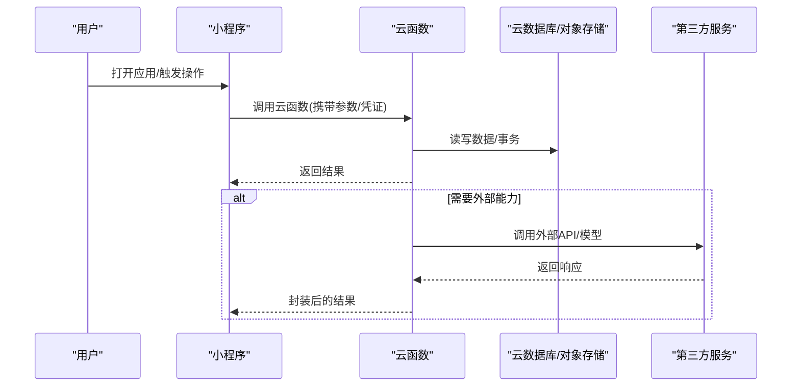

图表来源
- [miniprogram/pages/home/home.js](file://miniprogram/pages/home/home.js)
- [miniprogram/pages/course/course.js](file://miniprogram/pages/course/course.js)
- [miniprogram/pages/ai/ai.js](file://miniprogram/pages/ai/ai.js)
- [miniprogram/pages/feedback/feedback.js](file://miniprogram/pages/feedback/feedback.js)
- [cloudfunctions/home/index.js](file://cloudfunctions/home/index.js)
- [cloudfunctions/getCourseList/index.js](file://cloudfunctions/getCourseList/index.js)
- [cloudfunctions/getCourseDetail/index.js](file://cloudfunctions/getCourseDetail/index.js)
- [cloudfunctions/aiChat/index.js](file://cloudfunctions/aiChat/index.js)
- [cloudfunctions/aiCourseware/index.js](file://cloudfunctions/aiCourseware/index.js)
- [cloudfunctions/feedback/index.js](file://cloudfunctions/feedback/index.js)

## 详细组件分析

### 登录云函数(login)
- 职责：完成用户登录流程，校验凭证，生成会话标识，返回必要上下文。
- 输入：登录凭据（如手机号/验证码或第三方授权码）。
- 输出：会话令牌、用户基本信息、权限范围。
- 安全：敏感信息不落盘，令牌短期有效，支持刷新与撤销。
- 错误：非法参数、凭证失效、网络异常等需明确区分并提示。

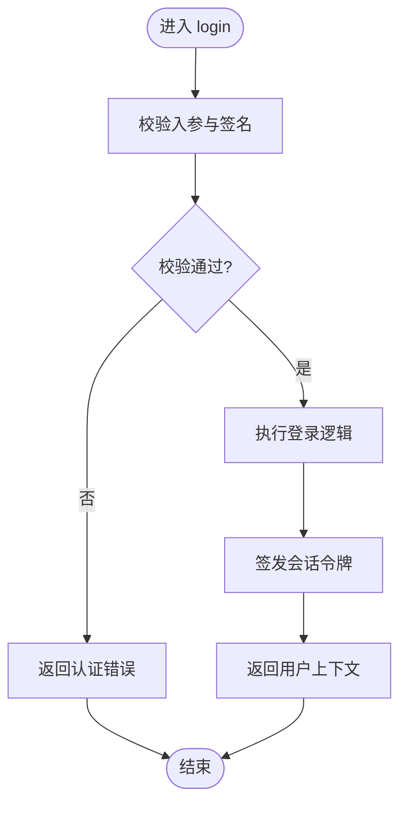

图表来源
- [cloudfunctions/login/index.js](file://cloudfunctions/login/index.js)

章节来源
- [cloudfunctions/login/index.js](file://cloudfunctions/login/index.js)

### 首页聚合云函数(home)
- 职责：聚合多个子域数据，降低前端请求次数，提升首屏体验。
- 输入：用户标识、分页/过滤条件。
- 输出：首页所需的多模块数据集合。
- 并发：对下游云函数或数据库的并行读取需设置超时与熔断。
- 容错：部分失败时降级返回可用数据并标注缺失字段。

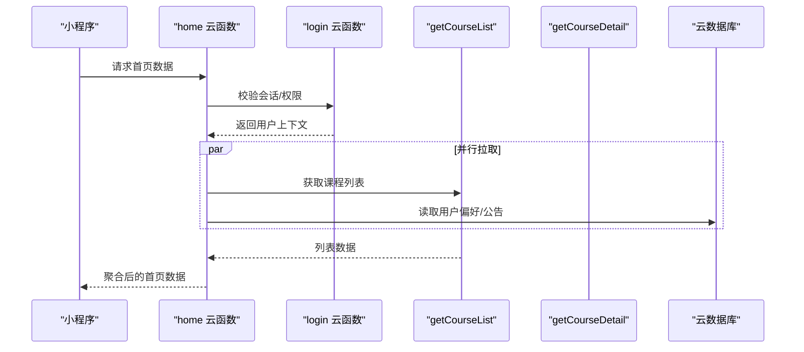

图表来源
- [cloudfunctions/home/index.js](file://cloudfunctions/home/index.js)
- [cloudfunctions/login/index.js](file://cloudfunctions/login/index.js)
- [cloudfunctions/getCourseList/index.js](file://cloudfunctions/getCourseList/index.js)
- [cloudfunctions/getCourseDetail/index.js](file://cloudfunctions/getCourseDetail/index.js)

章节来源
- [cloudfunctions/home/index.js](file://cloudfunctions/home/index.js)

### 课程列表与详情(getCourseList / getCourseDetail)
- 职责分离：列表侧重检索与分页，详情侧重完整信息与关联数据。
- **性能优化** getCourseList云函数经过深度优化，移除了冗余的数据处理逻辑，减少了12行代码，显著提升了执行效率和资源利用率。
- 课程详情查询保持稳定，继续提供完整的数据处理能力。
- 索引与缓存：热点课程可引入缓存层，避免重复计算。
- 一致性：读多写少场景允许最终一致；强一致需求使用事务。
- 扩展：可按标签、难度、进度等多维度筛选。

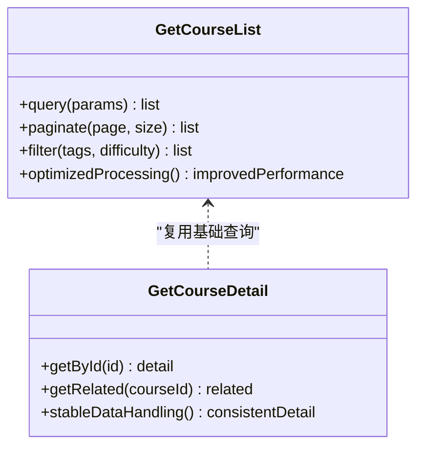

图表来源
- [cloudfunctions/getCourseList/index.js](file://cloudfunctions/getCourseList/index.js)
- [cloudfunctions/getCourseDetail/index.js](file://cloudfunctions/getCourseDetail/index.js)

章节来源
- [cloudfunctions/getCourseList/index.js](file://cloudfunctions/getCourseList/index.js)
- [cloudfunctions/getCourseDetail/index.js](file://cloudfunctions/getCourseDetail/index.js)

### AI 对话(aiChat)
- 职责：统一接入 AI 能力，包括鉴权、限流、日志与费用统计。
- 输入：用户消息、上下文、可选系统提示。
- 输出：结构化回复、引用来源、风险提示。
- 异步：长耗时任务采用队列+回调或轮询机制。
- 安全：内容审核、敏感词过滤、防注入。

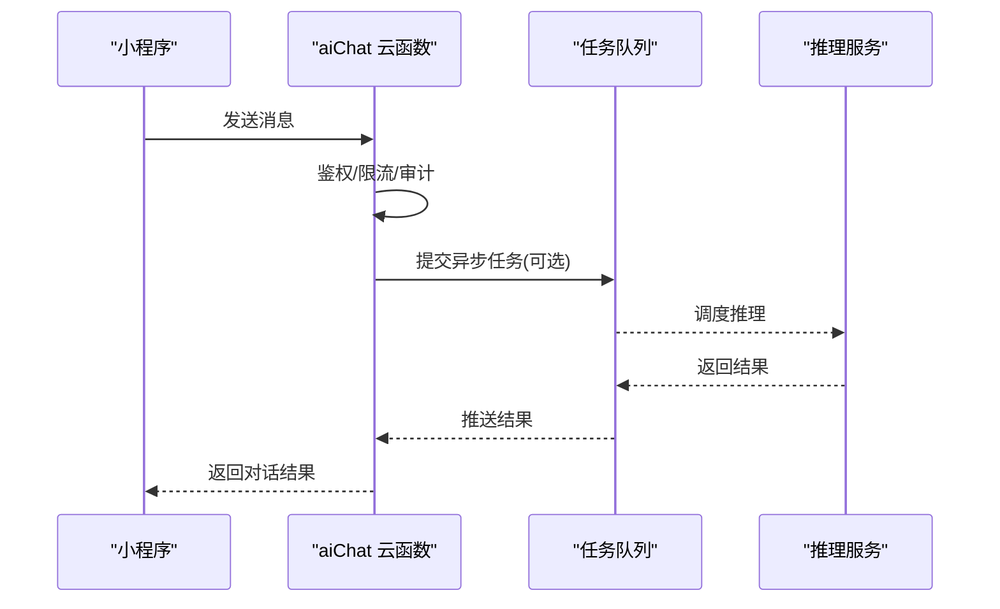

图表来源
- [cloudfunctions/aiChat/index.js](file://cloudfunctions/aiChat/index.js)

章节来源
- [cloudfunctions/aiChat/index.js](file://cloudfunctions/aiChat/index.js)

### AI 课件生成(aiCourseware) - 新增
- 职责：基于 AI 技术自动生成教学课件，支持多种格式和内容类型。
- 输入：主题内容、教学目标、难度级别、课件格式要求。
- 输出：结构化课件数据、多媒体资源链接、教学大纲。
- 集成：与 aiChat 协作，利用大模型能力进行内容生成。
- 异步处理：大型课件生成采用异步任务队列，支持进度跟踪。
- 质量控制：内置内容审核和质量评估机制。

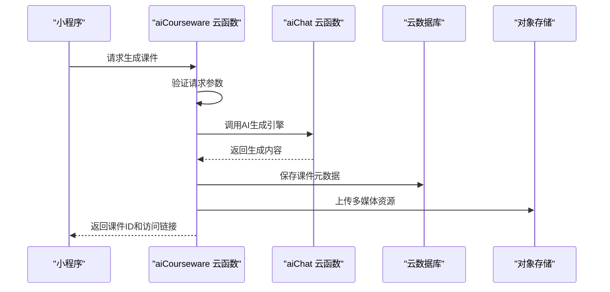

图表来源
- [cloudfunctions/aiCourseware/index.js](file://cloudfunctions/aiCourseware/index.js)
- [cloudfunctions/aiChat/index.js](file://cloudfunctions/aiChat/index.js)

章节来源
- [cloudfunctions/aiCourseware/index.js](file://cloudfunctions/aiCourseware/index.js)

### 用户反馈处理(feedback) - 新增
- 职责：收集、分类、处理和追踪用户反馈，支持反馈闭环管理。
- 输入：反馈内容、用户信息、问题类型、优先级标记。
- 输出：反馈ID、处理状态、响应时间、解决方案。
- 分类机制：自动分类和用户手动分类相结合。
- 通知系统：重要反馈实时通知相关人员。
- 统计分析：反馈趋势分析和满意度统计。

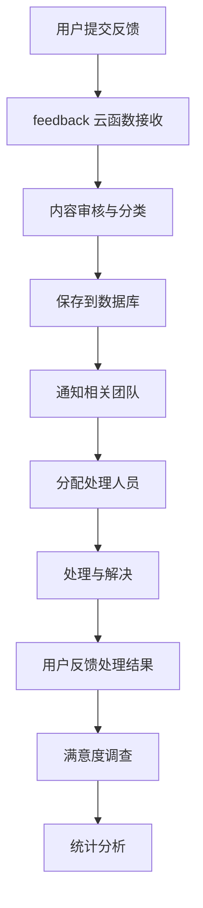

图表来源
- [cloudfunctions/feedback/index.js](file://cloudfunctions/feedback/index.js)
- [miniprogram/pages/feedback/feedback.js](file://miniprogram/pages/feedback/feedback.js)

章节来源
- [cloudfunctions/feedback/index.js](file://cloudfunctions/feedback/index.js)
- [miniprogram/pages/feedback/feedback.js](file://miniprogram/pages/feedback/feedback.js)

### 学习工具集(flashcards / knowledgeMap / quiz / mistakes / report)
- flashcards：记忆卡片创建、复习计划、间隔重复算法。
- **性能优化** knowledgeMap云函数经过优化，简化了知识图谱构建的数据处理流程，减少了11行代码，提升了图谱生成和执行效率。
- quiz：题目抽取、作答记录、即时反馈。
- mistakes：错题收集、归因分析与推荐练习。
- report：学习报告生成，聚合多维指标的处理能力稳定可靠。

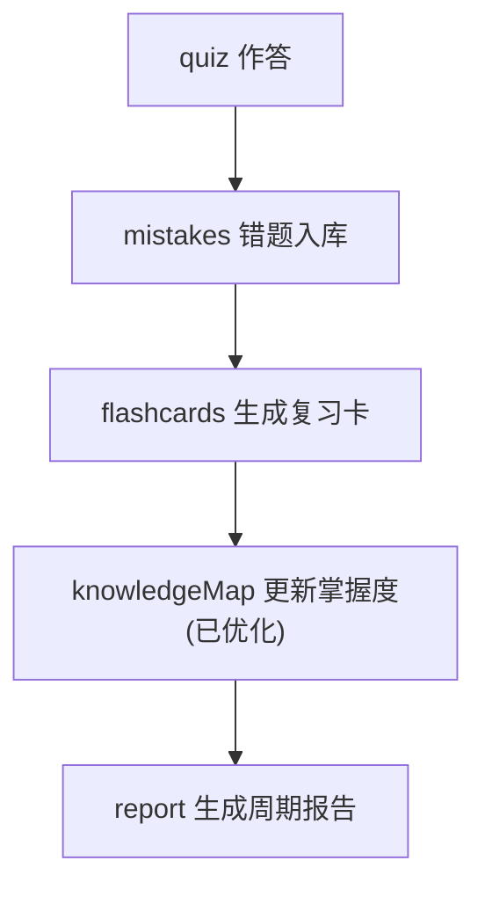

图表来源
- [cloudfunctions/quiz/index.js](file://cloudfunctions/quiz/index.js)
- [cloudfunctions/mistakes/index.js](file://cloudfunctions/mistakes/index.js)
- [cloudfunctions/flashcards/index.js](file://cloudfunctions/flashcards/index.js)
- [cloudfunctions/knowledgeMap/index.js](file://cloudfunctions/knowledgeMap/index.js)
- [cloudfunctions/report/index.js](file://cloudfunctions/report/index.js)

章节来源
- [cloudfunctions/flashcards/index.js](file://cloudfunctions/flashcards/index.js)
- [cloudfunctions/knowledgeMap/index.js](file://cloudfunctions/knowledgeMap/index.js)
- [cloudfunctions/quiz/index.js](file://cloudfunctions/quiz/index.js)
- [cloudfunctions/mistakes/index.js](file://cloudfunctions/mistakes/index.js)
- [cloudfunctions/report/index.js](file://cloudfunctions/report/index.js)

### 个性化与运营(pet / achievements / settings)
- pet：虚拟宠物养成，绑定学习行为与奖励。
- achievements：成就体系与里程碑达成判定。
- settings：用户偏好、主题、通知开关等配置。

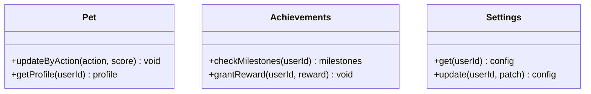

图表来源
- [cloudfunctions/pet/index.js](file://cloudfunctions/pet/index.js)
- [cloudfunctions/achievements/index.js](file://cloudfunctions/achievements/index.js)
- [cloudfunctions/settings/index.js](file://cloudfunctions/settings/index.js)

章节来源
- [cloudfunctions/pet/index.js](file://cloudfunctions/pet/index.js)
- [cloudfunctions/achievements/index.js](file://cloudfunctions/achievements/index.js)
- [cloudfunctions/settings/index.js](file://cloudfunctions/settings/index.js)

## 依赖关系分析
- 内聚与耦合：每个云函数聚焦单一业务域，跨域协作通过明确的接口契约与事件/队列解耦。
- 外部依赖：数据库、对象存储、第三方 API 均通过抽象层访问，便于替换与测试。
- 循环依赖：应避免云函数之间直接相互调用形成环，必要时引入事件总线或消息队列。

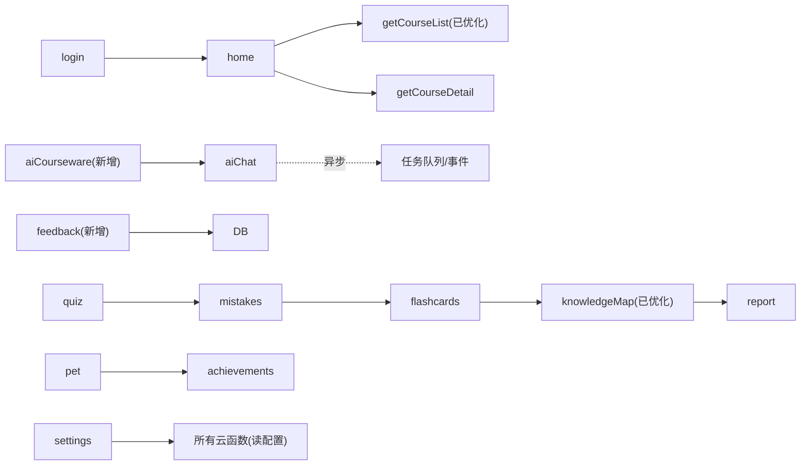

图表来源
- [cloudfunctions/home/index.js](file://cloudfunctions/home/index.js)
- [cloudfunctions/getCourseList/index.js](file://cloudfunctions/getCourseList/index.js)
- [cloudfunctions/getCourseDetail/index.js](file://cloudfunctions/getCourseDetail/index.js)
- [cloudfunctions/aiChat/index.js](file://cloudfunctions/aiChat/index.js)
- [cloudfunctions/aiCourseware/index.js](file://cloudfunctions/aiCourseware/index.js)
- [cloudfunctions/feedback/index.js](file://cloudfunctions/feedback/index.js)
- [cloudfunctions/quiz/index.js](file://cloudfunctions/quiz/index.js)
- [cloudfunctions/mistakes/index.js](file://cloudfunctions/mistakes/index.js)
- [cloudfunctions/flashcards/index.js](file://cloudfunctions/flashcards/index.js)
- [cloudfunctions/knowledgeMap/index.js](file://cloudfunctions/knowledgeMap/index.js)
- [cloudfunctions/report/index.js](file://cloudfunctions/report/index.js)
- [cloudfunctions/pet/index.js](file://cloudfunctions/pet/index.js)
- [cloudfunctions/achievements/index.js](file://cloudfunctions/achievements/index.js)
- [cloudfunctions/settings/index.js](file://cloudfunctions/settings/index.js)

章节来源
- [cloudfunctions/home/index.js](file://cloudfunctions/home/index.js)
- [cloudfunctions/aiChat/index.js](file://cloudfunctions/aiChat/index.js)
- [cloudfunctions/aiCourseware/index.js](file://cloudfunctions/aiCourseware/index.js)
- [cloudfunctions/feedback/index.js](file://cloudfunctions/feedback/index.js)
- [cloudfunctions/quiz/index.js](file://cloudfunctions/quiz/index.js)
- [cloudfunctions/mistakes/index.js](file://cloudfunctions/mistakes/index.js)
- [cloudfunctions/flashcards/index.js](file://cloudfunctions/flashcards/index.js)
- [cloudfunctions/knowledgeMap/index.js](file://cloudfunctions/knowledgeMap/index.js)
- [cloudfunctions/report/index.js](file://cloudfunctions/report/index.js)
- [cloudfunctions/pet/index.js](file://cloudfunctions/pet/index.js)
- [cloudfunctions/achievements/index.js](file://cloudfunctions/achievements/index.js)
- [cloudfunctions/settings/index.js](file://cloudfunctions/settings/index.js)

## 性能与可观测性
- 冷启动优化：按需加载、延迟初始化、合理分包与依赖裁剪。
- 并发与批处理：批量写入、合并查询、幂等设计。
- 缓存策略：热点数据多级缓存（内存/分布式），设置合理 TTL 与失效策略。
- 超时与重试：短重试+指数退避，避免雪崩；关键路径设置熔断。
- 可观测性：统一日志格式、链路追踪、指标上报与告警阈值。
- 资源配额：监控 CPU/内存/IO 使用率，识别瓶颈并进行容量规划。
- **性能优化成果** getCourseList和knowledgeMap云函数通过移除冗余逻辑，分别减少了12行和11行代码，显著提升了执行效率和资源利用率。
- **新功能性能考虑** aiCourseware和feedback云函数在设计时充分考虑了性能因素，采用异步处理和缓存策略确保高并发下的稳定性。

[本节为通用指导，不直接分析具体文件]

## 故障排查指南
- 常见问题定位：
  - 登录失败：检查凭证格式、签名校验、会话有效期。
  - 首页加载慢：定位 home 聚合的下游依赖，查看超时与并发情况。
  - AI 对话无响应：确认任务队列消费、外部服务可用性、限流策略。
  - 课程数据不一致：核对缓存与数据库一致性、事务边界。
  - 课程列表查询问题：检查优化后的getCourseList云函数是否正常工作。
  - 知识图谱构建问题：验证优化后的knowledgeMap云函数处理流程。
  - **AI 课件生成问题**：检查aiCourseware云函数的AI服务连接、内容生成质量和异步任务状态。
  - **用户反馈处理问题**：验证feedback云函数的数据持久化、通知系统和分类准确性。
- 排障步骤：
  - 从小程序端日志入手，定位云函数名称与请求 ID。
  - 在云函数侧打印关键入参、出参与耗时。
  - 检查数据库索引、对象存储权限与第三方 API 返回码。
  - 复现最小用例，逐步隔离问题域。

章节来源
- [cloudfunctions/login/index.js](file://cloudfunctions/login/index.js)
- [cloudfunctions/home/index.js](file://cloudfunctions/home/index.js)
- [cloudfunctions/aiChat/index.js](file://cloudfunctions/aiChat/index.js)
- [cloudfunctions/aiCourseware/index.js](file://cloudfunctions/aiCourseware/index.js)
- [cloudfunctions/feedback/index.js](file://cloudfunctions/feedback/index.js)
- [cloudfunctions/getCourseList/index.js](file://cloudfunctions/getCourseList/index.js)
- [cloudfunctions/getCourseDetail/index.js](file://cloudfunctions/getCourseDetail/index.js)
- [cloudfunctions/knowledgeMap/index.js](file://cloudfunctions/knowledgeMap/index.js)
- [cloudfunctions/report/index.js](file://cloudfunctions/report/index.js)

## 结论
本架构以"按能力域拆分"的云函数为核心，结合小程序端的轻前端模式，实现了高内聚、低耦合的微服务体系。通过清晰的职责边界、统一的输入输出契约、完善的错误与可观测性设计，系统在可扩展性与可维护性方面具备良好基础。近期对getCourseList和knowledgeMap云函数的性能优化进一步提升了系统的稳定性和执行效率，通过移除冗余逻辑和优化数据处理流程，显著降低了资源消耗并提升了响应速度。新增的aiCourseware和feedback云函数为平台增添了AI课件生成和用户反馈管理能力，进一步完善了教育生态系统的功能完整性。建议在后续迭代中持续完善缓存、队列与监控体系，并推进代码规范与自动化测试，进一步提升质量与效率。

[本节为总结性内容，不直接分析具体文件]

## 附录

### 开发规范与命名约定
- 目录结构：每个云函数独立目录，包含 index.js、package.json、config.json 等。
- 命名规范：云函数名使用小写英文单词或驼峰，语义清晰，避免缩写歧义。
- 输入输出：定义稳定的 JSON Schema，字段注释完备，向后兼容。
- 错误码：统一错误码表，区分客户端错误与服务端错误。

章节来源
- [cloudfunctions/login/index.js](file://cloudfunctions/login/index.js)
- [cloudfunctions/home/index.js](file://cloudfunctions/home/index.js)
- [cloudfunctions/getCourseList/index.js](file://cloudfunctions/getCourseList/index.js)
- [cloudfunctions/getCourseDetail/index.js](file://cloudfunctions/getCourseDetail/index.js)
- [cloudfunctions/aiChat/index.js](file://cloudfunctions/aiChat/index.js)
- [cloudfunctions/aiCourseware/index.js](file://cloudfunctions/aiCourseware/index.js)
- [cloudfunctions/feedback/index.js](file://cloudfunctions/feedback/index.js)
- [cloudfunctions/flashcards/index.js](file://cloudfunctions/flashcards/index.js)
- [cloudfunctions/knowledgeMap/index.js](file://cloudfunctions/knowledgeMap/index.js)
- [cloudfunctions/quiz/index.js](file://cloudfunctions/quiz/index.js)
- [cloudfunctions/mistakes/index.js](file://cloudfunctions/mistakes/index.js)
- [cloudfunctions/report/index.js](file://cloudfunctions/report/index.js)
- [cloudfunctions/pet/index.js](file://cloudfunctions/pet/index.js)
- [cloudfunctions/achievements/index.js](file://cloudfunctions/achievements/index.js)
- [cloudfunctions/settings/index.js](file://cloudfunctions/settings/index.js)

### 生命周期管理与事件驱动
- 生命周期：初始化阶段进行连接池/缓存预热；请求阶段执行业务逻辑；销毁阶段释放资源。
- 事件驱动：通过消息队列或事件总线实现异步解耦，适用于长任务、定时任务与跨域通知。
- 幂等性：对写操作保证幂等，避免重复投递导致的数据不一致。

章节来源
- [cloudfunctions/aiChat/index.js](file://cloudfunctions/aiChat/index.js)
- [cloudfunctions/aiCourseware/index.js](file://cloudfunctions/aiCourseware/index.js)
- [cloudfunctions/report/index.js](file://cloudfunctions/report/index.js)

### 云函数间通信与数据共享
- 同步调用：适合简单查询与轻量聚合，注意超时与熔断。
- 异步通信：通过队列/事件总线传递消息，解耦生产与消费。
- 数据共享：以数据库为主数据源，缓存为辅；严格定义读写路径与一致性级别。

章节来源
- [cloudfunctions/home/index.js](file://cloudfunctions/home/index.js)
- [cloudfunctions/aiCourseware/index.js](file://cloudfunctions/aiCourseware/index.js)
- [cloudfunctions/feedback/index.js](file://cloudfunctions/feedback/index.js)
- [cloudfunctions/quiz/index.js](file://cloudfunctions/quiz/index.js)
- [cloudfunctions/mistakes/index.js](file://cloudfunctions/mistakes/index.js)
- [cloudfunctions/flashcards/index.js](file://cloudfunctions/flashcards/index.js)
- [cloudfunctions/knowledgeMap/index.js](file://cloudfunctions/knowledgeMap/index.js)
- [cloudfunctions/report/index.js](file://cloudfunctions/report/index.js)

### 部署配置与环境变量
- 项目配置：在根配置文件中声明云环境与函数入口，确保本地与云端一致。
- 环境变量：敏感信息通过环境变量注入，避免硬编码。
- 版本控制：云函数目录纳入版本管理，发布前进行静态检查与单元测试。

章节来源
- [project.config.json](file://project.config.json)

### 小程序端集成要点
- 统一封装：在 app.js 中初始化云环境，提供统一的云函数调用封装。
- 页面调用：在各页面 JS 中按需调用对应云函数，做好错误处理与用户提示。
- 缓存与离线：合理使用本地缓存，提升弱网体验。

章节来源
- [miniprogram/app.js](file://miniprogram/app.js)
- [miniprogram/pages/home/home.js](file://miniprogram/pages/home/home.js)
- [miniprogram/pages/course/course.js](file://miniprogram/pages/course/course.js)
- [miniprogram/pages/ai/ai.js](file://miniprogram/pages/ai/ai.js)
- [miniprogram/pages/feedback/feedback.js](file://miniprogram/pages/feedback/feedback.js)