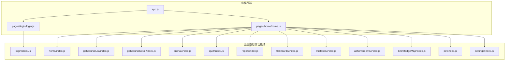
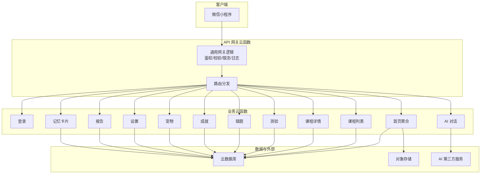
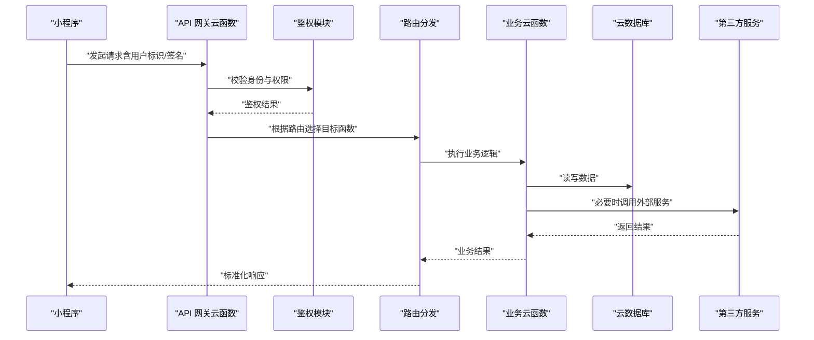
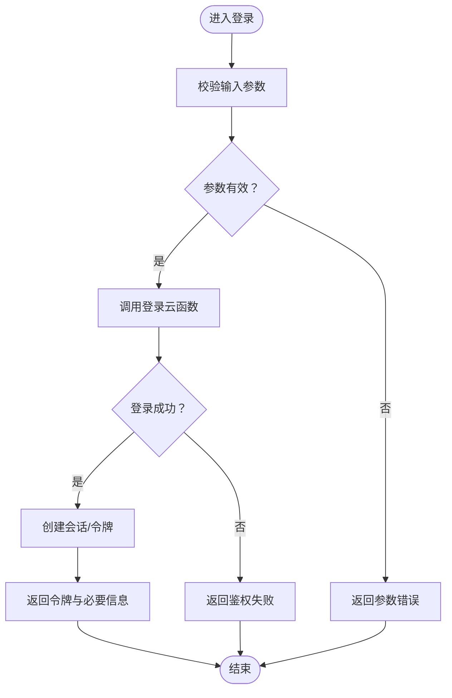
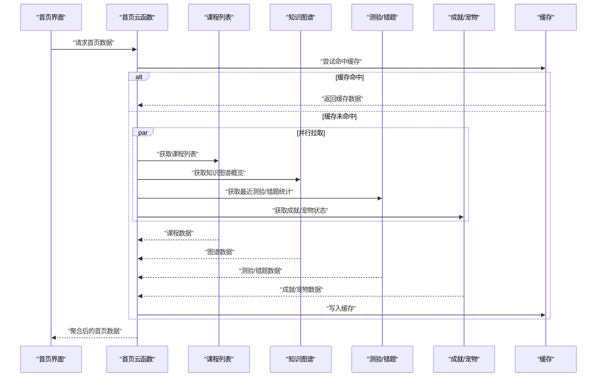
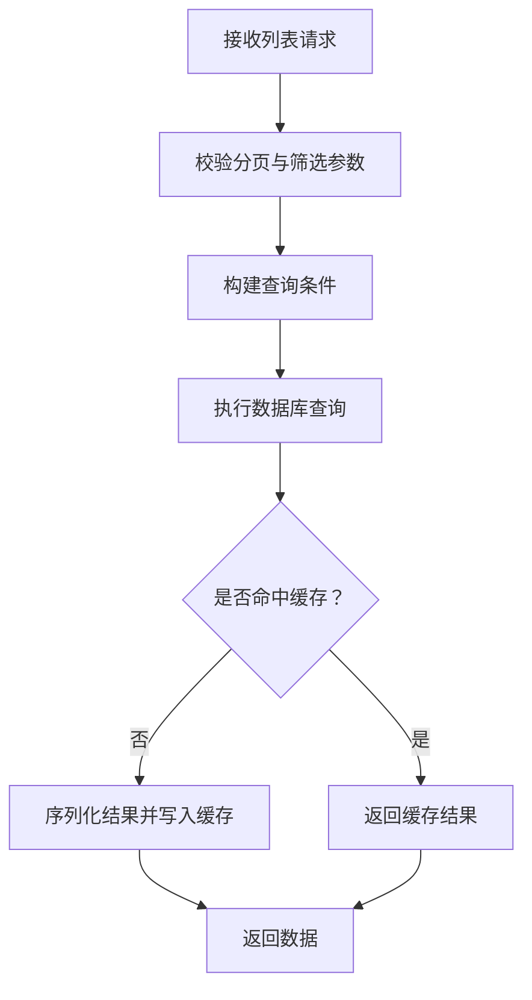
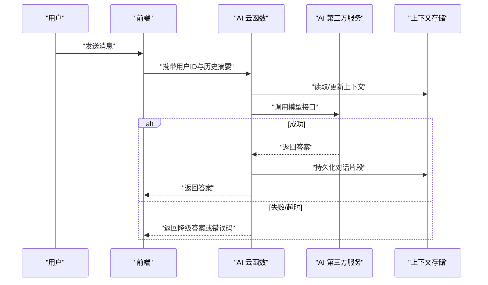
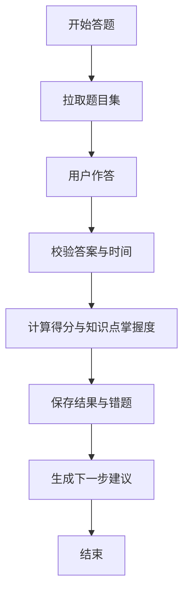
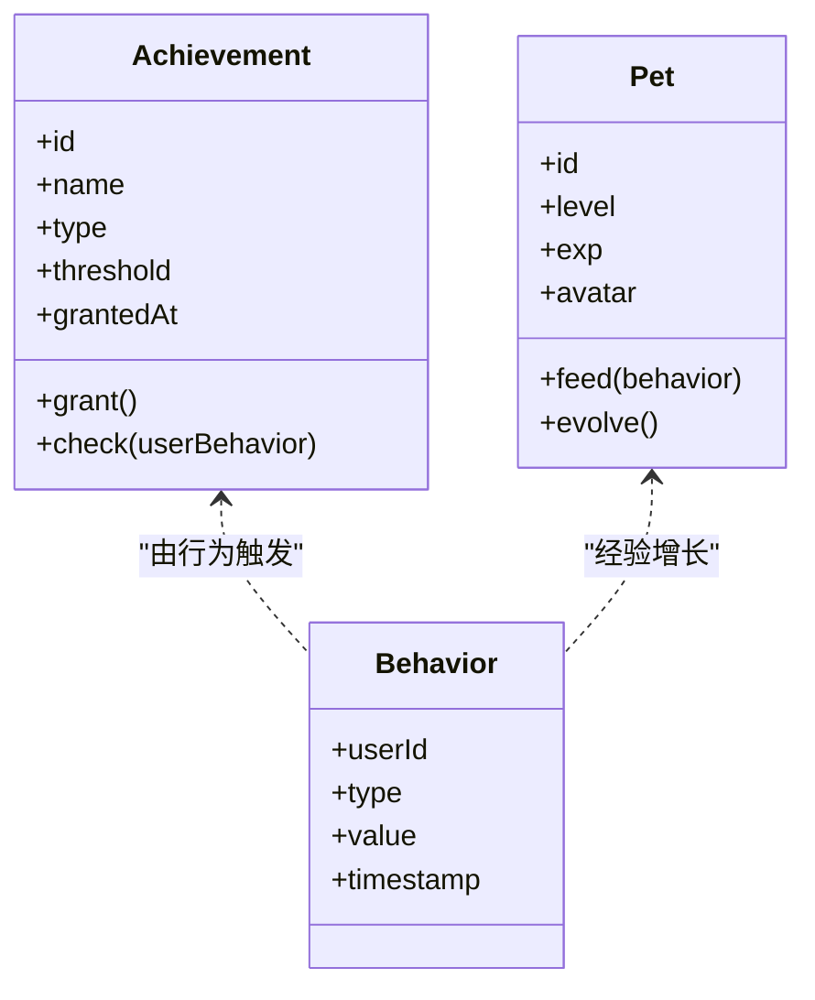
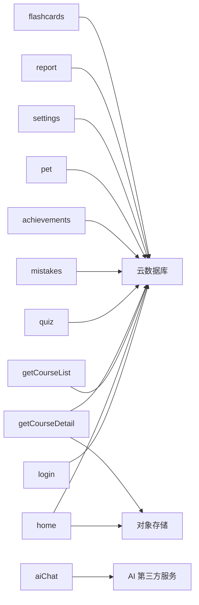

# 后端架构设计

<cite>
**本文引用的文件**   
- [cloudfunctions/achievements/index.js](file://cloudfunctions/achievements/index.js)
- [cloudfunctions/aiChat/index.js](file://cloudfunctions/aiChat/index.js)
- [cloudfunctions/flashcards/index.js](file://cloudfunctions/flashcards/index.js)
- [cloudfunctions/getCourseDetail/index.js](file://cloudfunctions/getCourseDetail/index.js)
- [cloudfunctions/getCourseList/index.js](file://cloudfunctions/getCourseList/index.js)
- [cloudfunctions/home/index.js](file://cloudfunctions/home/index.js)
- [cloudfunctions/knowledgeMap/index.js](file://cloudfunctions/knowledgeMap/index.js)
- [cloudfunctions/login/index.js](file://cloudfunctions/login/index.js)
- [cloudfunctions/mistakes/index.js](file://cloudfunctions/mistakes/index.js)
- [cloudfunctions/pet/index.js](file://cloudfunctions/pet/index.js)
- [cloudfunctions/quiz/index.js](file://cloudfunctions/quiz/index.js)
- [cloudfunctions/report/index.js](file://cloudfunctions/report/index.js)
- [cloudfunctions/settings/index.js](file://cloudfunctions/settings/index.js)
- [miniprogram/pages/home/home.js](file://miniprogram/pages/home/home.js)
- [miniprogram/pages/login/login.js](file://miniprogram/pages/login/login.js)
- [miniprogram/app.js](file://miniprogram/app.js)
</cite>

## 目录
1. [引言](#引言)
2. [项目结构](#项目结构)
3. [核心组件](#核心组件)
4. [架构总览](#架构总览)
5. [详细组件分析](#详细组件分析)
6. [依赖分析](#依赖分析)
7. [性能考虑](#性能考虑)
8. [故障排查指南](#故障排查指南)
9. [结论](#结论)
10. [附录](#附录)

## 引言
本文件面向云函数后端的架构设计与实现规范，围绕微信云开发环境下的微服务模式展开。文档重点包括：
- 基于云函数的微服务职责划分与模块化原则
- API 网关式入口、请求处理流程与错误处理机制
- 云函数间通信、数据共享策略与事务处理建议
- 第三方服务（如 AI 服务）集成与容错设计
- 安全认证、权限控制、限流防护等横切关注点
- 开发者规范与扩展指导

## 项目结构
本项目采用“按功能域拆分云函数”的目录组织方式，每个云函数对应一个独立的服务能力，便于独立部署、测试与扩缩容。小程序前端通过调用各云函数完成业务交互。

图表来源
- [miniprogram/app.js](file://miniprogram/app.js)
- [miniprogram/pages/home/home.js](file://miniprogram/pages/home/home.js)
- [miniprogram/pages/login/login.js](file://miniprogram/pages/login/login.js)
- [cloudfunctions/home/index.js](file://cloudfunctions/home/index.js)
- [cloudfunctions/getCourseList/index.js](file://cloudfunctions/getCourseList/index.js)
- [cloudfunctions/getCourseDetail/index.js](file://cloudfunctions/getCourseDetail/index.js)
- [cloudfunctions/aiChat/index.js](file://cloudfunctions/aiChat/index.js)
- [cloudfunctions/quiz/index.js](file://cloudfunctions/quiz/index.js)
- [cloudfunctions/report/index.js](file://cloudfunctions/report/index.js)
- [cloudfunctions/flashcards/index.js](file://cloudfunctions/flashcards/index.js)
- [cloudfunctions/mistakes/index.js](file://cloudfunctions/mistakes/index.js)
- [cloudfunctions/achievements/index.js](file://cloudfunctions/achievements/index.js)
- [cloudfunctions/knowledgeMap/index.js](file://cloudfunctions/knowledgeMap/index.js)
- [cloudfunctions/pet/index.js](file://cloudfunctions/pet/index.js)
- [cloudfunctions/settings/index.js](file://cloudfunctions/settings/index.js)
- [cloudfunctions/login/index.js](file://cloudfunctions/login/index.js)

章节来源
- [miniprogram/app.js](file://miniprogram/app.js)
- [miniprogram/pages/home/home.js](file://miniprogram/pages/home/home.js)
- [miniprogram/pages/login/login.js](file://miniprogram/pages/login/login.js)

## 核心组件
- 登录与会话管理：负责用户身份获取与基础会话信息维护，为后续鉴权提供依据。
- 首页聚合：聚合课程列表、知识图谱、学习状态等常用数据，减少前端多次往返。
- 课程模块：课程列表与详情查询，支持分页、筛选与缓存策略。
- AI 对话：对接外部 AI 服务，封装提示词、上下文管理与重试/降级逻辑。
- 测验与错题：题目作答、结果统计、错题收集与复习路径生成。
- 成就与宠物：学习行为激励体系，记录进度与奖励发放。
- 设置与报告：用户偏好配置与学习报告导出。
- 记忆卡片：间隔重复算法驱动的复习卡片管理。

章节来源
- [cloudfunctions/login/index.js](file://cloudfunctions/login/index.js)
- [cloudfunctions/home/index.js](file://cloudfunctions/home/index.js)
- [cloudfunctions/getCourseList/index.js](file://cloudfunctions/getCourseList/index.js)
- [cloudfunctions/getCourseDetail/index.js](file://cloudfunctions/getCourseDetail/index.js)
- [cloudfunctions/aiChat/index.js](file://cloudfunctions/aiChat/index.js)
- [cloudfunctions/quiz/index.js](file://cloudfunctions/quiz/index.js)
- [cloudfunctions/mistakes/index.js](file://cloudfunctions/mistakes/index.js)
- [cloudfunctions/achievements/index.js](file://cloudfunctions/achievements/index.js)
- [cloudfunctions/pet/index.js](file://cloudfunctions/pet/index.js)
- [cloudfunctions/settings/index.js](file://cloudfunctions/settings/index.js)
- [cloudfunctions/report/index.js](file://cloudfunctions/report/index.js)
- [cloudfunctions/flashcards/index.js](file://cloudfunctions/flashcards/index.js)

## 架构总览
整体采用“小程序 + 云函数微服务 + 数据库/对象存储 + 可选第三方服务”的分层架构。云函数作为 API 网关式入口，统一承载鉴权、参数校验、路由分发、业务编排与响应封装。

图表来源
- [cloudfunctions/home/index.js](file://cloudfunctions/home/index.js)
- [cloudfunctions/getCourseList/index.js](file://cloudfunctions/getCourseList/index.js)
- [cloudfunctions/getCourseDetail/index.js](file://cloudfunctions/getCourseDetail/index.js)
- [cloudfunctions/aiChat/index.js](file://cloudfunctions/aiChat/index.js)
- [cloudfunctions/quiz/index.js](file://cloudfunctions/quiz/index.js)
- [cloudfunctions/mistakes/index.js](file://cloudfunctions/mistakes/index.js)
- [cloudfunctions/achievements/index.js](file://cloudfunctions/achievements/index.js)
- [cloudfunctions/pet/index.js](file://cloudfunctions/pet/index.js)
- [cloudfunctions/settings/index.js](file://cloudfunctions/settings/index.js)
- [cloudfunctions/report/index.js](file://cloudfunctions/report/index.js)
- [cloudfunctions/flashcards/index.js](file://cloudfunctions/flashcards/index.js)
- [cloudfunctions/login/index.js](file://cloudfunctions/login/index.js)

## 详细组件分析

### API 网关与请求处理流程
- 统一入口：所有云函数遵循一致的入参/出参约定，包含用户标识、操作类型、业务参数与签名信息。
- 鉴权与授权：在入口处校验用户身份与权限范围，拒绝非法访问并返回标准化错误码。
- 参数校验：对必填字段、数据类型、长度与枚举值进行校验，失败即快速返回。
- 限流与熔断：对热点接口实施速率限制，异常时触发熔断或降级策略。
- 日志与追踪：记录关键链路 ID、耗时与错误堆栈，便于问题定位。

图表来源
- [cloudfunctions/home/index.js](file://cloudfunctions/home/index.js)
- [cloudfunctions/login/index.js](file://cloudfunctions/login/index.js)
- [cloudfunctions/aiChat/index.js](file://cloudfunctions/aiChat/index.js)

章节来源
- [cloudfunctions/home/index.js](file://cloudfunctions/home/index.js)
- [cloudfunctions/login/index.js](file://cloudfunctions/login/index.js)

### 登录与会话管理
- 职责：完成用户登录、会话创建与刷新、权限范围下发。
- 关键点：最小化敏感信息暴露；会话令牌有效期与刷新策略；幂等登录。

图表来源
- [cloudfunctions/login/index.js](file://cloudfunctions/login/index.js)

章节来源
- [cloudfunctions/login/index.js](file://cloudfunctions/login/index.js)

### 首页聚合服务
- 职责：聚合课程列表、知识图谱概览、学习进度、成就与宠物状态等，降低前端请求次数。
- 优化：并行读取多源数据；对静态或低频变更数据使用缓存；超时保护与部分返回。

图表来源
- [cloudfunctions/home/index.js](file://cloudfunctions/home/index.js)
- [cloudfunctions/getCourseList/index.js](file://cloudfunctions/getCourseList/index.js)
- [cloudfunctions/knowledgeMap/index.js](file://cloudfunctions/knowledgeMap/index.js)
- [cloudfunctions/quiz/index.js](file://cloudfunctions/quiz/index.js)
- [cloudfunctions/achievements/index.js](file://cloudfunctions/achievements/index.js)
- [cloudfunctions/pet/index.js](file://cloudfunctions/pet/index.js)

章节来源
- [cloudfunctions/home/index.js](file://cloudfunctions/home/index.js)

### 课程模块（列表与详情）
- 列表：支持分页、排序、筛选；结合索引与投影减少 IO。
- 详情：按需加载富媒体资源；图片/视频走对象存储直链。
- 一致性：读多写少场景可接受最终一致；强一致场景使用事务或版本戳。

图表来源
- [cloudfunctions/getCourseList/index.js](file://cloudfunctions/getCourseList/index.js)
- [cloudfunctions/getCourseDetail/index.js](file://cloudfunctions/getCourseDetail/index.js)

章节来源
- [cloudfunctions/getCourseList/index.js](file://cloudfunctions/getCourseList/index.js)
- [cloudfunctions/getCourseDetail/index.js](file://cloudfunctions/getCourseDetail/index.js)

### AI 对话服务
- 职责：封装提示词模板、上下文管理、流式或非流式响应、重试与降级。
- 容错：网络异常重试、超时熔断、回退到本地规则或默认回答。
- 安全：对用户输入进行过滤与脱敏；对外部服务密钥进行安全存储与轮换。

图表来源
- [cloudfunctions/aiChat/index.js](file://cloudfunctions/aiChat/index.js)

章节来源
- [cloudfunctions/aiChat/index.js](file://cloudfunctions/aiChat/index.js)

### 测验与错题
- 测验：题目抽取策略（随机/按知识点）、计时与评分、结果入库。
- 错题：自动收录薄弱知识点，生成复习计划；与记忆卡片联动。
- 一致性：提交结果需幂等，避免重复计分。

图表来源
- [cloudfunctions/quiz/index.js](file://cloudfunctions/quiz/index.js)
- [cloudfunctions/mistakes/index.js](file://cloudfunctions/mistakes/index.js)

章节来源
- [cloudfunctions/quiz/index.js](file://cloudfunctions/quiz/index.js)
- [cloudfunctions/mistakes/index.js](file://cloudfunctions/mistakes/index.js)

### 成就与宠物
- 成就：定义里程碑与奖励规则，累计学习时长、完成测验、连续打卡等行为。
- 宠物：成长等级与外观变化，受学习行为驱动，增强粘性。
- 并发：同一用户的成就/宠物状态更新需加锁或版本号控制。

图表来源
- [cloudfunctions/achievements/index.js](file://cloudfunctions/achievements/index.js)
- [cloudfunctions/pet/index.js](file://cloudfunctions/pet/index.js)

章节来源
- [cloudfunctions/achievements/index.js](file://cloudfunctions/achievements/index.js)
- [cloudfunctions/pet/index.js](file://cloudfunctions/pet/index.js)

### 设置与报告
- 设置：主题、通知、隐私等偏好项，支持热更新。
- 报告：汇总学习数据，生成可视化报表，支持导出与分享。

章节来源
- [cloudfunctions/settings/index.js](file://cloudfunctions/settings/index.js)
- [cloudfunctions/report/index.js](file://cloudfunctions/report/index.js)

### 记忆卡片
- 算法：基于间隔重复（如 SM-2 变体），根据回忆难度调整下次复习时间。
- 数据：卡片元数据、复习历史、难度评分与下次复习时间。
- 调度：批量任务与增量更新结合，保证复习队列稳定。

章节来源
- [cloudfunctions/flashcards/index.js](file://cloudfunctions/flashcards/index.js)

## 依赖分析
- 内聚与耦合：每个云函数聚焦单一职责，低耦合高内聚；跨函数协作通过明确的数据契约与事件/消息模式。
- 外部依赖：数据库、对象存储、AI 第三方服务；通过配置中心管理密钥与端点。
- 循环依赖：避免云函数直接互相调用形成环，必要时引入消息队列或中间表解耦。

图表来源
- [cloudfunctions/login/index.js](file://cloudfunctions/login/index.js)
- [cloudfunctions/home/index.js](file://cloudfunctions/home/index.js)
- [cloudfunctions/getCourseList/index.js](file://cloudfunctions/getCourseList/index.js)
- [cloudfunctions/getCourseDetail/index.js](file://cloudfunctions/getCourseDetail/index.js)
- [cloudfunctions/aiChat/index.js](file://cloudfunctions/aiChat/index.js)
- [cloudfunctions/quiz/index.js](file://cloudfunctions/quiz/index.js)
- [cloudfunctions/mistakes/index.js](file://cloudfunctions/mistakes/index.js)
- [cloudfunctions/achievements/index.js](file://cloudfunctions/achievements/index.js)
- [cloudfunctions/pet/index.js](file://cloudfunctions/pet/index.js)
- [cloudfunctions/settings/index.js](file://cloudfunctions/settings/index.js)
- [cloudfunctions/report/index.js](file://cloudfunctions/report/index.js)
- [cloudfunctions/flashcards/index.js](file://cloudfunctions/flashcards/index.js)

章节来源
- [cloudfunctions/home/index.js](file://cloudfunctions/home/index.js)
- [cloudfunctions/getCourseList/index.js](file://cloudfunctions/getCourseList/index.js)
- [cloudfunctions/getCourseDetail/index.js](file://cloudfunctions/getCourseDetail/index.js)
- [cloudfunctions/aiChat/index.js](file://cloudfunctions/aiChat/index.js)
- [cloudfunctions/quiz/index.js](file://cloudfunctions/quiz/index.js)
- [cloudfunctions/mistakes/index.js](file://cloudfunctions/mistakes/index.js)
- [cloudfunctions/achievements/index.js](file://cloudfunctions/achievements/index.js)
- [cloudfunctions/pet/index.js](file://cloudfunctions/pet/index.js)
- [cloudfunctions/settings/index.js](file://cloudfunctions/settings/index.js)
- [cloudfunctions/report/index.js](file://cloudfunctions/report/index.js)
- [cloudfunctions/flashcards/index.js](file://cloudfunctions/flashcards/index.js)
- [cloudfunctions/login/index.js](file://cloudfunctions/login/index.js)

## 性能考虑
- 缓存策略：首页聚合、课程列表与详情采用多级缓存（内存/分布式），合理设置 TTL 与失效策略。
- 并行与批处理：聚合接口并行拉取子服务数据；批量写入与合并更新减少 IO。
- 连接复用：数据库与 HTTP 客户端保持长连接，减少握手开销。
- 冷启动优化：精简依赖、懒加载模块、预热关键函数。
- 监控与告警：跟踪 P95/P99 延迟、错误率与资源使用，设定阈值告警。

## 故障排查指南
- 常见问题
  - 鉴权失败：检查用户标识、签名与权限范围；核对令牌有效期与刷新逻辑。
  - 参数校验失败：确认必填字段、类型与取值范围；查看错误码与提示。
  - 第三方服务不可用：观察重试与熔断状态；切换降级策略并记录日志。
  - 数据不一致：核查事务边界与幂等性；对比版本号与冲突解决策略。
- 诊断手段
  - 链路追踪：通过唯一请求 ID 串联前后端日志。
  - 指标采集：QPS、延迟、错误率、缓存命中率、外部服务成功率。
  - 慢查询分析：定位数据库热点与缺失索引。
  - 灰度与回滚：发布前压测，出现问题快速回滚。

章节来源
- [cloudfunctions/home/index.js](file://cloudfunctions/home/index.js)
- [cloudfunctions/aiChat/index.js](file://cloudfunctions/aiChat/index.js)
- [cloudfunctions/login/index.js](file://cloudfunctions/login/index.js)

## 结论
本架构以云函数为核心，将业务拆分为高内聚、低耦合的微服务单元，配合统一的网关式入口、标准化的错误处理与完善的监控体系，满足可扩展、易维护与高可用的要求。通过合理的缓存、并发与容错设计，系统可在复杂业务场景下保持稳定与高效。

## 附录

### 开发规范与扩展指导
- 命名与契约
  - 云函数命名遵循“动词+名词”或“领域名”，入参/出参统一结构，包含状态码、消息与数据体。
  - 错误码分层：系统级、业务级、第三方级，便于前端差异化处理。
- 安全与合规
  - 最小权限原则：仅授予必要的数据访问与外部服务调用权限。
  - 敏感信息：密钥与证书通过配置中心管理，禁止硬编码。
  - 输入输出：严格校验与过滤，防止注入与越权。
- 可观测性
  - 结构化日志：包含请求 ID、用户 ID、耗时、关键步骤与异常堆栈。
  - 指标上报：业务指标与系统指标统一采集与展示。
- 扩展实践
  - 新增功能：新建云函数，定义清晰接口契约；在网关中注册路由。
  - 数据迁移：采用增量脚本与双写过渡，确保平滑升级。
  - 灰度发布：按用户比例或白名单逐步放量，观察指标后再全量。