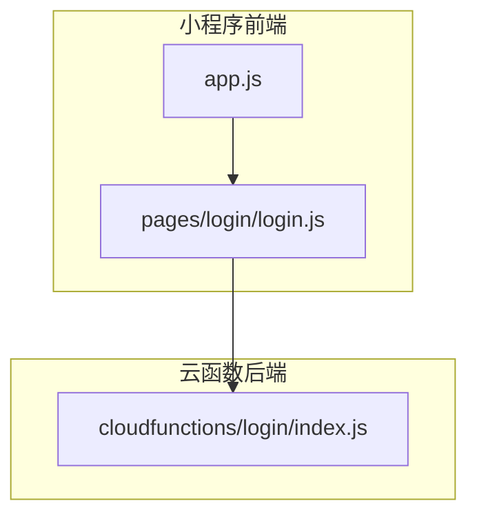
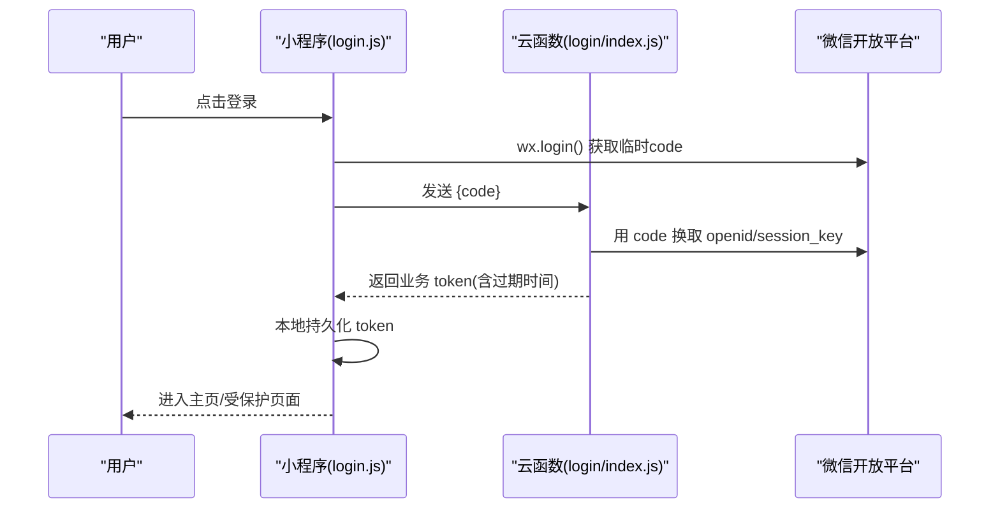
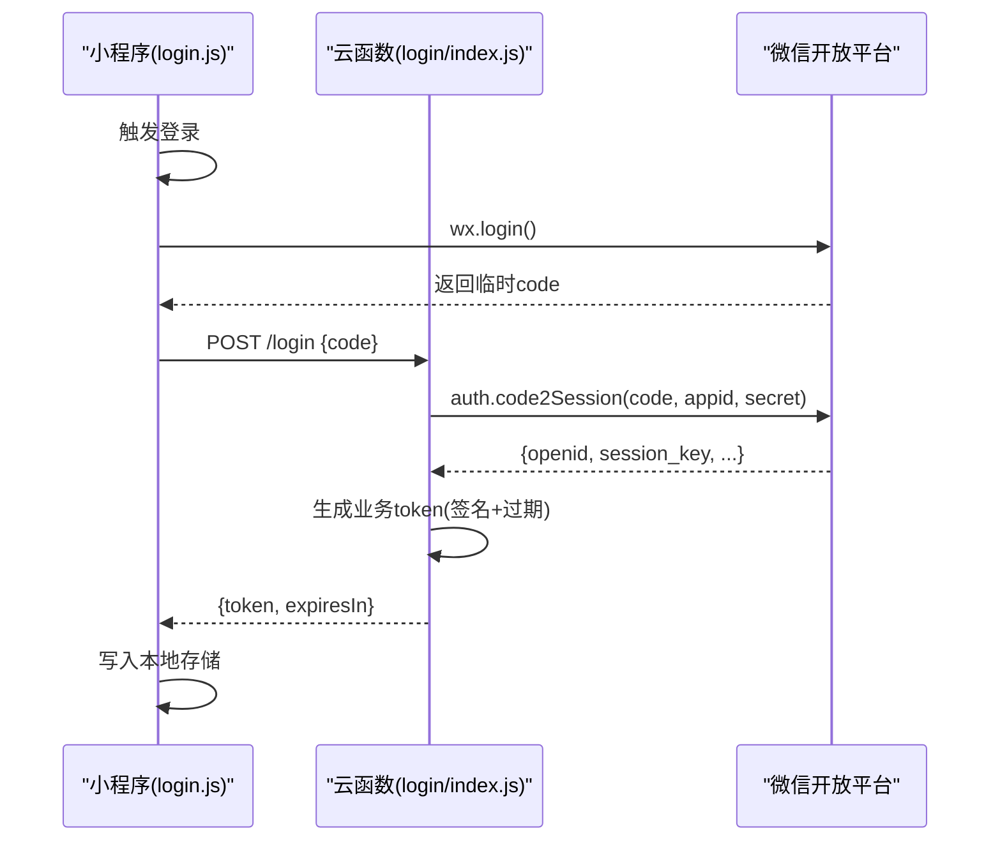
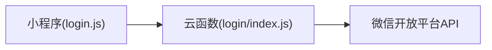

# 安全认证机制

<cite>
**本文引用的文件**   
- [miniprogram/pages/login/login.js](file://miniprogram/pages/login/login.js)
- [cloudfunctions/login/index.js](file://cloudfunctions/login/index.js)
- [miniprogram/app.js](file://miniprogram/app.js)
</cite>

## 目录
1. [简介](#简介)
2. [项目结构](#项目结构)
3. [核心组件](#核心组件)
4. [架构总览](#架构总览)
5. [详细组件分析](#详细组件分析)
6. [依赖关系分析](#依赖关系分析)
7. [性能与安全考量](#性能与安全考量)
8. [故障排查指南](#故障排查指南)
9. [结论](#结论)
10. [附录](#附录)

## 简介
本文件围绕“安全认证机制”展开，聚焦以下目标：
- 用户身份认证流程与会话管理
- 微信登录接口集成与用户信息获取
- 权限控制模型、角色管理与访问策略
- 敏感数据加密存储、传输安全与隐私保护
- API 安全防护、防注入与 XSS 防护
- 安全配置建议、漏洞扫描与安全审计方法
- 安全事件监控告警与应急响应流程

说明：本项目为微信小程序 + 云函数架构。当前仓库中已包含登录相关的前端页面与后端云函数入口，但未见完整的鉴权中间件、RBAC 实现或加密/日志等模块。因此，本文在基于现有代码的基础上，给出可落地的安全方案与最佳实践，并明确哪些能力已在代码中存在、哪些需要补充实现。

## 项目结构
从安全视角看，关键目录与职责如下：
- miniprogram/pages/login：小程序侧登录入口与交互逻辑
- cloudfunctions/login：服务端登录处理（云函数）
- miniprogram/app.js：应用初始化与全局状态（如 token 持久化、登录态维护）

图表来源
- [miniprogram/pages/login/login.js](file://miniprogram/pages/login/login.js)
- [cloudfunctions/login/index.js](file://cloudfunctions/login/index.js)
- [miniprogram/app.js](file://miniprogram/app.js)

章节来源
- [miniprogram/pages/login/login.js](file://miniprogram/pages/login/login.js)
- [cloudfunctions/login/index.js](file://cloudfunctions/login/index.js)
- [miniprogram/app.js](file://miniprogram/app.js)

## 核心组件
- 小程序登录页（login.js）：负责发起微信登录、调用后端云函数、保存会话令牌、跳转受保护页面。
- 登录云函数（index.js）：接收前端凭证，完成微信 code 校验、生成业务会话令牌、返回给前端。
- 应用入口（app.js）：负责全局登录态检查、token 刷新与过期处理、请求拦截与鉴权前置。

章节来源
- [miniprogram/pages/login/login.js](file://miniprogram/pages/login/login.js)
- [cloudfunctions/login/index.js](file://cloudfunctions/login/index.js)
- [miniprogram/app.js](file://miniprogram/app.js)

## 架构总览
整体认证与授权流程分为“登录认证”和“访问控制”两部分：
- 登录认证：小程序通过 wx.login 获取临时 code，提交到云函数；云函数使用微信服务端 API 换取 openid/session_key，签发业务 token 并返回。
- 访问控制：后续请求携带 token，云函数进行签名校验与权限判断，决定是否放行。

图表来源
- [miniprogram/pages/login/login.js](file://miniprogram/pages/login/login.js)
- [cloudfunctions/login/index.js](file://cloudfunctions/login/index.js)

## 详细组件分析

### 小程序登录页（login.js）
- 主要职责
  - 触发微信登录，获取临时 code
  - 将 code 发送至云函数
  - 接收并缓存业务 token
  - 根据登录结果进行路由跳转
- 安全要点
  - 仅在后端完成 code 换 openid 的操作，不在前端暴露任何密钥
  - 对返回的 token 设置合理有效期，并在本地安全存储
  - 网络请求需走 HTTPS（小程序默认强制），避免明文传输

章节来源
- [miniprogram/pages/login/login.js](file://miniprogram/pages/login/login.js)

### 登录云函数（index.js）
- 主要职责
  - 接收前端 code
  - 调用微信服务端接口换取 openid/session_key
  - 生成业务 token（建议采用 JWT 或带签名的会话标识）
  - 返回 token 及必要元信息（如过期时间）
- 安全要点
  - 严格校验 code 的有效性与时效性
  - 使用安全的随机源生成 token
  - 限制登录频率，防止暴力破解与枚举攻击
  - 记录最小化的审计日志（不记录敏感字段）

章节来源
- [cloudfunctions/login/index.js](file://cloudfunctions/login/index.js)

### 应用入口（app.js）
- 主要职责
  - 启动时检查本地 token 是否有效
  - 提供统一的请求封装，自动附加 token
  - 处理 401/403 等鉴权失败场景，引导重新登录
- 安全要点
  - 统一拦截未授权响应，集中处理登出与重定向
  - 支持 token 静默刷新（若后端提供刷新接口）
  - 避免在控制台打印敏感信息

章节来源
- [miniprogram/app.js](file://miniprogram/app.js)

### 登录时序图（细化）

图表来源
- [miniprogram/pages/login/login.js](file://miniprogram/pages/login/login.js)
- [cloudfunctions/login/index.js](file://cloudfunctions/login/index.js)

## 依赖关系分析
- 前端依赖
  - 小程序原生登录能力（wx.login）
  - 云开发/云函数调用能力
- 后端依赖
  - 微信开放平台 API（code2Session）
  - 可选：JWT 库、速率限制、审计日志

图表来源
- [miniprogram/pages/login/login.js](file://miniprogram/pages/login/login.js)
- [cloudfunctions/login/index.js](file://cloudfunctions/login/index.js)

章节来源
- [miniprogram/pages/login/login.js](file://miniprogram/pages/login/login.js)
- [cloudfunctions/login/index.js](file://cloudfunctions/login/index.js)

## 性能与安全考量
- 性能
  - 登录接口应幂等且快速，避免长耗时操作
  - 对高频接口实施限流与缓存（如验证码、短信）
- 安全
  - 全链路 HTTPS，禁止明文传输
  - Token 短生命周期 + 刷新机制
  - 输入校验与输出编码，防范注入与 XSS
  - 最小权限原则与细粒度授权
  - 敏感数据脱敏展示与加密存储
  - 完善的审计日志与异常告警

[本节为通用指导，无需源码引用]

## 故障排查指南
- 常见问题定位
  - 登录失败：检查 code 有效性、网络连通性与云函数日志
  - 401/403：确认 token 是否过期、是否被篡改、权限是否不足
  - 跨域/域名白名单：确保小程序与云函数域名配置正确
- 建议的排障步骤
  - 在前端增加请求/响应日志（脱敏）
  - 在后端增加结构化审计日志（不记录敏感字段）
  - 对关键路径添加超时与重试策略
  - 使用灰度发布与回滚预案

[本节为通用指导，无需源码引用]

## 结论
当前仓库已具备登录认证的基础骨架（小程序登录页与云函数入口）。为确保生产可用，建议尽快补齐：
- 统一的鉴权中间件与 RBAC 权限模型
- 安全的 token 签发与校验、刷新机制
- 输入校验、XSS 防护与 SQL/NoSQL 注入防护
- 敏感数据加密存储与传输加固
- 审计日志、监控告警与应急响应流程

[本节为总结性内容，无需源码引用]

## 附录

### 权限控制模型与访问策略（建议）
- 模型
  - RBAC：用户-角色-资源-操作
  - ABAC（可选）：基于属性的动态策略
- 策略
  - 默认拒绝，显式授权
  - 最小权限与分权制衡
  - 资源级与操作级双重校验

[本节为概念性内容，无需源码引用]

### 敏感数据加密与隐私保护（建议）
- 传输层
  - 强制 HTTPS，启用 HSTS（服务端）
- 存储层
  - 密码使用强哈希算法加盐存储
  - 个人身份信息（PII）加密存储，密钥与数据分离
- 隐私合规
  - 最小化采集、目的限定、可撤回同意
  - 数据保留期限与删除机制

[本节为概念性内容，无需源码引用]

### API 安全防护清单（建议）
- 输入校验与白名单
- 输出编码与 CSP
- 速率限制与账号锁定
- 参数签名与防重放
- 错误信息脱敏与统一错误码

[本节为概念性内容，无需源码引用]

### 安全配置建议（建议）
- 环境变量与密钥管理（KMS/Secrets Manager）
- 最小权限的云函数角色与数据库访问
- 开启云函数运行时的安全沙箱与只读挂载
- 定期更新依赖与补丁

[本节为概念性内容，无需源码引用]

### 漏洞扫描与安全审计（建议）
- SAST/DAST 自动化扫描
- 依赖漏洞检测（SCA）
- 人工代码审计与渗透测试
- 变更评审与基线检查

[本节为概念性内容，无需源码引用]

### 监控告警与应急响应（建议）
- 指标与日志
  - 登录成功率、失败原因分布、异常 IP 与地域
  - 4xx/5xx 比例、慢请求、错误堆栈
- 告警规则
  - 登录失败率突增、疑似撞库、异常地理位置
- 应急流程
  - 一键封禁可疑 IP/账号
  - 快速重置受影响用户会话
  - 事后复盘与修复闭环

[本节为概念性内容，无需源码引用]