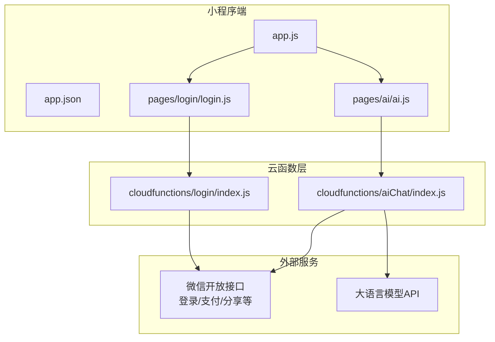
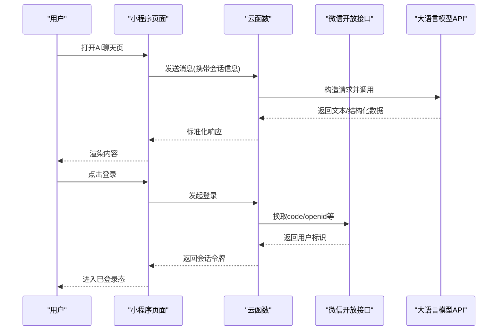
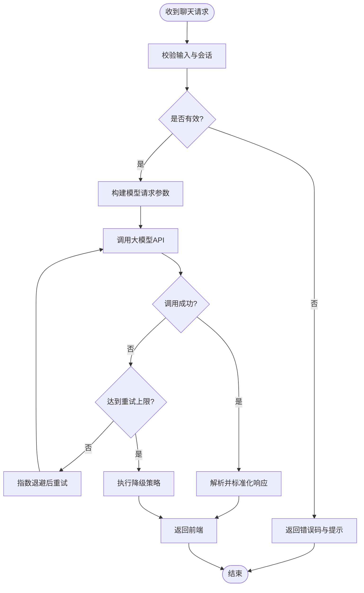
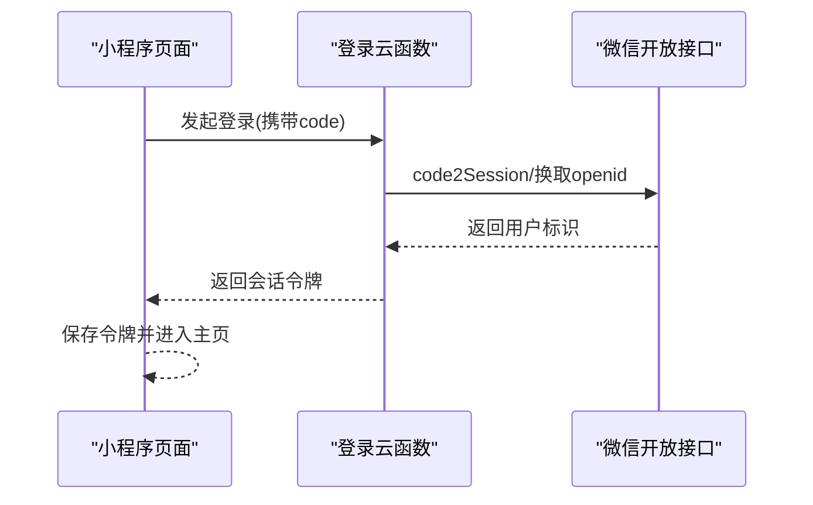
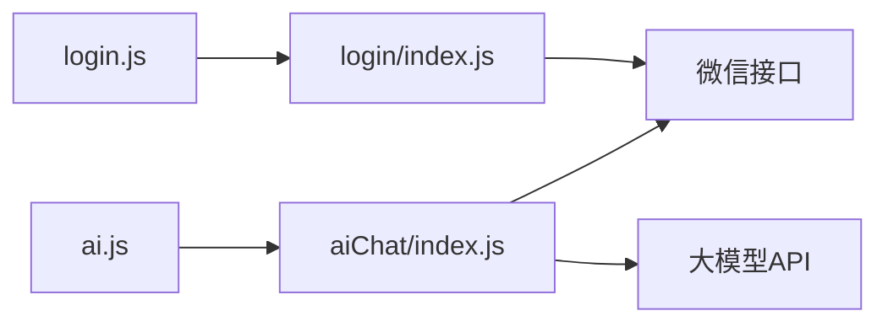

# 服务集成架构

<cite>
**本文引用的文件**   
- [cloudfunctions/aiChat/index.js](file://cloudfunctions/aiChat/index.js)
- [cloudfunctions/login/index.js](file://cloudfunctions/login/index.js)
- [miniprogram/pages/ai/ai.js](file://miniprogram/pages/ai/ai.js)
- [miniprogram/pages/login/login.js](file://miniprogram/pages/login/login.js)
- [miniprogram/app.js](file://miniprogram/app.js)
- [miniprogram/app.json](file://miniprogram/app.json)
</cite>

## 目录
1. [简介](#简介)
2. [项目结构](#项目结构)
3. [核心组件](#核心组件)
4. [架构总览](#架构总览)
5. [详细组件分析](#详细组件分析)
6. [依赖关系分析](#依赖关系分析)
7. [性能考虑](#性能考虑)
8. [故障排查指南](#故障排查指南)
9. [结论](#结论)
10. [附录](#附录)

## 简介
本文件面向“服务集成架构”的设计与实现，聚焦以下目标：
- 第三方服务集成的设计模式与实现策略
- AI 服务集成（大语言模型 API 调用、消息处理、响应解析）的架构设计
- 微信生态服务集成（登录认证、支付、分享等原生能力）的方式与注意事项
- 服务间通信协议、数据转换与格式适配
- 容错机制、重试策略与降级处理
- 监控、日志记录与故障排查方法
- 安全考虑与最佳实践

## 项目结构
本项目采用小程序前端 + 云函数后端的分层结构。关键目录说明：
- miniprogram：小程序前端页面与业务逻辑
- cloudfunctions：云端函数集合，按功能域拆分（如 aiChat、login 等）
- docs、prototype：文档与原型资源

图表来源
- [miniprogram/app.js](file://miniprogram/app.js)
- [miniprogram/app.json](file://miniprogram/app.json)
- [miniprogram/pages/ai/ai.js](file://miniprogram/pages/ai/ai.js)
- [miniprogram/pages/login/login.js](file://miniprogram/pages/login/login.js)
- [cloudfunctions/aiChat/index.js](file://cloudfunctions/aiChat/index.js)
- [cloudfunctions/login/index.js](file://cloudfunctions/login/index.js)

章节来源
- [miniprogram/app.js](file://miniprogram/app.js)
- [miniprogram/app.json](file://miniprogram/app.json)
- [miniprogram/pages/ai/ai.js](file://miniprogram/pages/ai/ai.js)
- [miniprogram/pages/login/login.js](file://miniprogram/pages/login/login.js)
- [cloudfunctions/aiChat/index.js](file://cloudfunctions/aiChat/index.js)
- [cloudfunctions/login/index.js](file://cloudfunctions/login/index.js)

## 核心组件
- 小程序入口与路由配置：负责应用初始化、全局状态与页面注册
- AI 聊天页面：发起对话请求、展示流式或批量响应、错误提示
- 登录页面：触发微信登录流程、获取用户标识并持久化会话
- AI 云函数：封装大模型调用、参数校验、结果解析与返回
- 登录云函数：完成微信登录鉴权、生成会话令牌、返回用户上下文

章节来源
- [miniprogram/app.js](file://miniprogram/app.js)
- [miniprogram/app.json](file://miniprogram/app.json)
- [miniprogram/pages/ai/ai.js](file://miniprogram/pages/ai/ai.js)
- [miniprogram/pages/login/login.js](file://miniprogram/pages/login/login.js)
- [cloudfunctions/aiChat/index.js](file://cloudfunctions/aiChat/index.js)
- [cloudfunctions/login/index.js](file://cloudfunctions/login/index.js)

## 架构总览
整体采用“前端轻量 + 后端托管”的模式：
- 小程序侧仅做交互与必要的数据组装
- 云函数承担鉴权、第三方 API 调用、数据处理与缓存
- 通过统一的服务网关（云函数）屏蔽外部差异，提供稳定接口

图表来源
- [miniprogram/pages/ai/ai.js](file://miniprogram/pages/ai/ai.js)
- [cloudfunctions/aiChat/index.js](file://cloudfunctions/aiChat/index.js)
- [miniprogram/pages/login/login.js](file://miniprogram/pages/login/login.js)
- [cloudfunctions/login/index.js](file://cloudfunctions/login/index.js)

## 详细组件分析

### AI 服务集成（大语言模型）
- 职责边界
  - 小程序侧：收集用户输入、维护历史上下文、展示结果与错误
  - 云函数侧：参数校验、签名与鉴权、调用大模型、结果清洗与格式化、限流与重试
- 关键流程
  - 构建请求体（系统提示词、用户消息、温度/最大长度等参数）
  - 调用大模型 API（支持流式或非流式）
  - 解析响应（文本、工具调用、结构化字段）
  - 返回给前端（统一错误码与消息）
- 数据转换与适配
  - 将不同模型的输出统一为内部标准格式
  - 对富文本/Markdown 进行安全过滤与渲染适配
- 容错与降级
  - 网络异常重试（指数退避）、超时控制
  - 失败降级：返回兜底文案或缓存答案
  - 熔断：连续失败时快速失败，避免雪崩
- 监控与日志
  - 记录请求耗时、Token 用量、错误类型与堆栈
  - 采样上报关键指标（QPS、P95/P99 延迟）

图表来源
- [cloudfunctions/aiChat/index.js](file://cloudfunctions/aiChat/index.js)
- [miniprogram/pages/ai/ai.js](file://miniprogram/pages/ai/ai.js)

章节来源
- [cloudfunctions/aiChat/index.js](file://cloudfunctions/aiChat/index.js)
- [miniprogram/pages/ai/ai.js](file://miniprogram/pages/ai/ai.js)

### 微信生态服务集成（登录、支付、分享）
- 登录认证
  - 小程序端调用登录接口获取临时凭证
  - 云函数使用凭证换取用户标识与会话令牌
  - 服务端签发短期令牌并绑定用户上下文
- 支付能力
  - 由云函数统一下单、计算签名、返回支付参数
  - 小程序端拉起支付，回调更新订单状态
- 分享能力
  - 在页面级配置分享标题、路径与封面图
  - 根据用户权限动态生成分享参数
- 安全要点
  - 所有敏感操作在服务端完成（签名、密钥管理）
  - 严格校验回调签名与幂等性
  - 最小权限原则与参数白名单

图表来源
- [miniprogram/pages/login/login.js](file://miniprogram/pages/login/login.js)
- [cloudfunctions/login/index.js](file://cloudfunctions/login/index.js)

章节来源
- [miniprogram/pages/login/login.js](file://miniprogram/pages/login/login.js)
- [cloudfunctions/login/index.js](file://cloudfunctions/login/index.js)

### 服务间通信协议与数据格式
- 通信协议
  - 小程序到云函数：HTTPS/HTTP 调用，统一 JSON 载荷
  - 云函数到大模型：REST/流式接口，按厂商规范封装
- 数据格式
  - 统一响应结构：包含状态码、消息、数据体与追踪ID
  - 错误码体系：区分客户端错误、服务端错误与第三方错误
- 适配层
  - 对外暴露稳定的内部接口，屏蔽上游差异
  - 对多模型输出进行归一化处理

章节来源
- [miniprogram/app.js](file://miniprogram/app.js)
- [miniprogram/app.json](file://miniprogram/app.json)
- [cloudfunctions/aiChat/index.js](file://cloudfunctions/aiChat/index.js)
- [cloudfunctions/login/index.js](file://cloudfunctions/login/index.js)

### 容错、重试与降级
- 重试策略
  - 针对瞬时错误（网络抖动、限流）进行指数退避重试
  - 设置最大重试次数与单次超时阈值
- 降级策略
  - 当上游不可用时返回缓存或默认答案
  - 限制并发与速率，保护下游
- 熔断与隔离
  - 连续失败触发熔断，快速失败
  - 对不同外部服务进行隔离调用，避免相互影响

章节来源
- [cloudfunctions/aiChat/index.js](file://cloudfunctions/aiChat/index.js)

### 监控、日志与可观测性
- 指标采集
  - QPS、成功率、P95/P99 延迟、Token 用量
- 日志记录
  - 结构化日志：请求ID、用户ID、耗时、错误码、摘要
  - 敏感信息脱敏（手机号、token、密码等）
- 告警与排障
  - 基于阈值与趋势的告警规则
  - 链路追踪贯穿小程序→云函数→第三方

章节来源
- [cloudfunctions/aiChat/index.js](file://cloudfunctions/aiChat/index.js)
- [cloudfunctions/login/index.js](file://cloudfunctions/login/index.js)

### 安全考虑与最佳实践
- 密钥管理
  - 使用环境变量或密钥管理服务，禁止硬编码
- 鉴权与授权
  - 会话令牌校验、签名验证、防重放
- 输入校验与输出净化
  - 严格的参数校验、XSS/注入防护
- 最小权限与审计
  - 按需授权、操作审计与访问日志留存

章节来源
- [cloudfunctions/login/index.js](file://cloudfunctions/login/index.js)
- [cloudfunctions/aiChat/index.js](file://cloudfunctions/aiChat/index.js)

## 依赖关系分析
- 模块耦合
  - 小程序页面依赖对应云函数；云函数依赖外部服务（微信、大模型）
- 外部依赖
  - 微信开放接口、大语言模型 API
- 潜在风险
  - 外部服务不稳定导致级联失败
  - 未做限流与熔断可能引发雪崩

图表来源
- [miniprogram/pages/ai/ai.js](file://miniprogram/pages/ai/ai.js)
- [miniprogram/pages/login/login.js](file://miniprogram/pages/login/login.js)
- [cloudfunctions/aiChat/index.js](file://cloudfunctions/aiChat/index.js)
- [cloudfunctions/login/index.js](file://cloudfunctions/login/index.js)

章节来源
- [miniprogram/pages/ai/ai.js](file://miniprogram/pages/ai/ai.js)
- [miniprogram/pages/login/login.js](file://miniprogram/pages/login/login.js)
- [cloudfunctions/aiChat/index.js](file://cloudfunctions/aiChat/index.js)
- [cloudfunctions/login/index.js](file://cloudfunctions/login/index.js)

## 性能考虑
- 连接复用与超时控制：合理设置连接池与读写超时
- 异步与批处理：合并小请求、减少往返
- 缓存策略：热点数据本地/云端缓存，降低重复调用
- 压缩与分页：传输压缩、列表分页加载
- 资源预热：冷启动优化与实例预热

[本节为通用指导，不直接分析具体文件]

## 故障排查指南
- 常见问题定位
  - 登录失败：检查 code 有效性、会话令牌签发与存储
  - AI 调用失败：查看错误码、重试次数、超时与限流
  - 支付失败：核对签名、金额与商户配置
- 日志与追踪
  - 通过请求ID串联小程序、云函数与第三方日志
  - 关注关键指标突增/突降
- 回滚与恢复
  - 灰度发布与快速回滚
  - 降级开关与熔断恢复

章节来源
- [cloudfunctions/login/index.js](file://cloudfunctions/login/index.js)
- [cloudfunctions/aiChat/index.js](file://cloudfunctions/aiChat/index.js)

## 结论
本架构以云函数为核心，屏蔽第三方差异并提供统一的接入面。通过标准化的数据格式、完善的容错与监控体系，保障 AI 与微信生态服务的稳定集成。后续建议持续完善限流熔断、可观测性与安全加固，提升整体可靠性与可维护性。

[本节为总结性内容，不直接分析具体文件]

## 附录
- 术语表
  - 云函数：无服务器函数，承载后端逻辑
  - 会话令牌：用于维持用户登录态的短期凭证
  - 熔断：在连续失败时快速失败，防止雪崩
- 参考清单
  - 小程序页面与云函数映射关系
  - 外部服务接口清单与版本约束

[本节为补充信息，不直接分析具体文件]