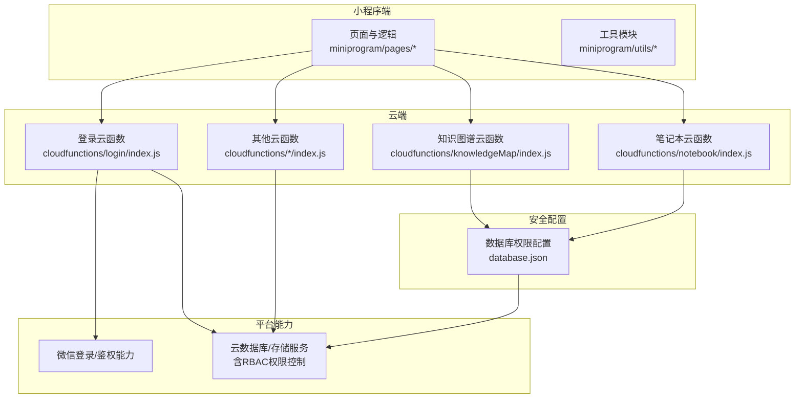
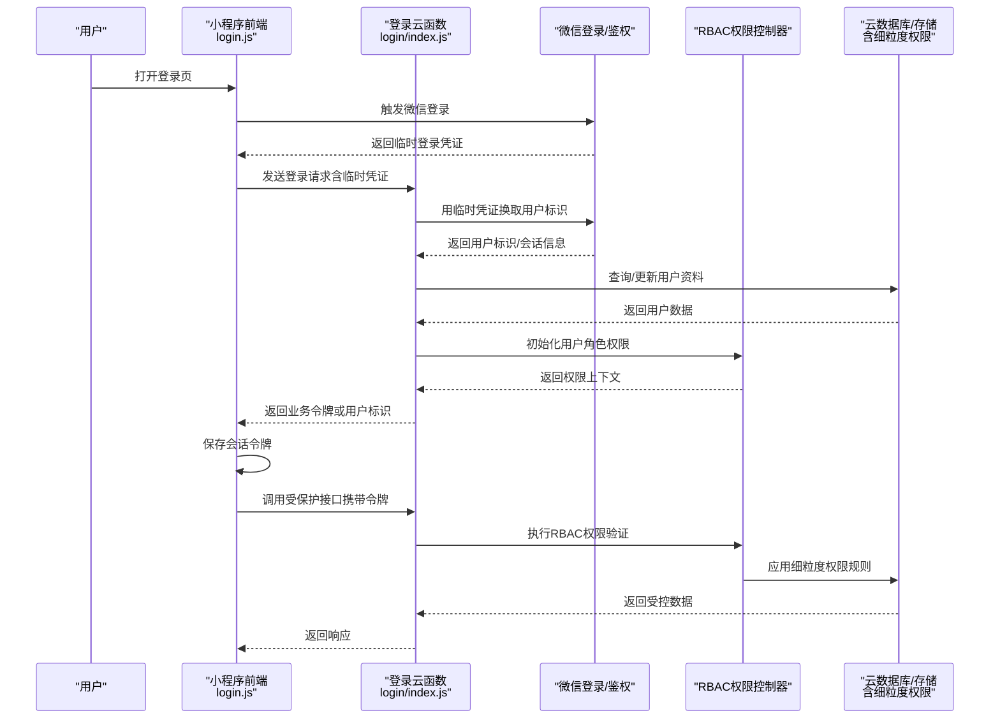
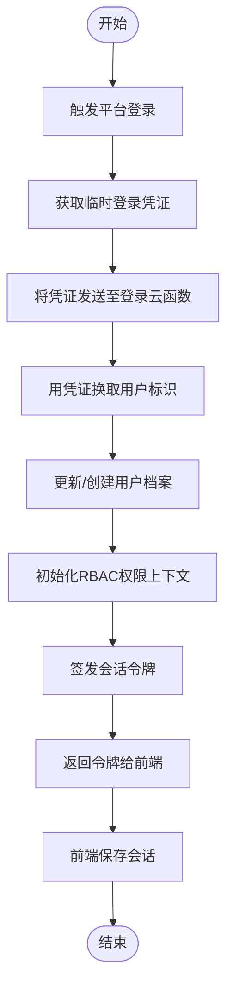
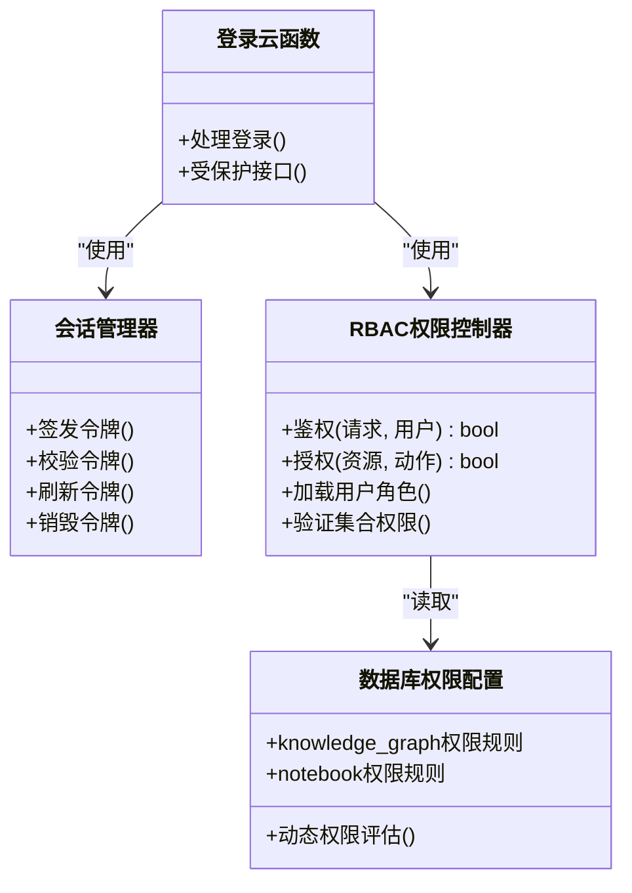
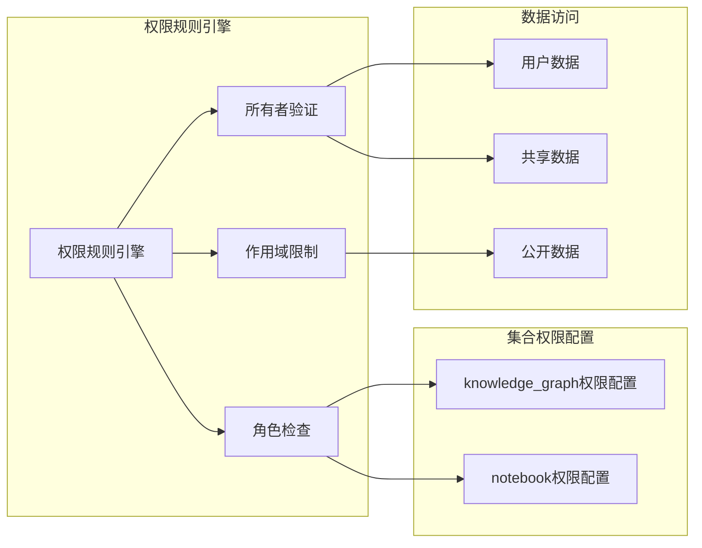
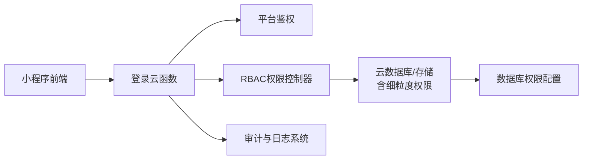

# 安全架构设计

<cite>
**本文引用的文件**   
- [cloudfunctions/login/index.js](file://cloudfunctions/login/index.js)
- [miniprogram/pages/login/login.js](file://miniprogram/pages/login/login.js)
- [project.config.json](file://project.config.json)
- [database.json](file://database.json)
- [cloudfunctions/knowledgeMap/index.js](file://cloudfunctions/knowledgeMap/index.js)
- [cloudfunctions/notebook/index.js](file://cloudfunctions/notebook/index.js)
</cite>

## 更新摘要
**变更内容**   
- 增强了数据库安全机制，为 knowledge_graph 和 notebook 集合实现了细粒度权限规则
- 引入了基于角色的访问控制（RBAC）系统
- 改进了认证流程文档，详细说明了用户身份验证和会话管理
- 更新了权限控制策略，支持更精细的数据访问控制

## 目录
1. [简介](#简介)
2. [项目结构](#项目结构)
3. [核心组件](#核心组件)
4. [架构总览](#架构总览)
5. [详细组件分析](#详细组件分析)
6. [依赖分析](#依赖分析)
7. [性能考虑](#性能考虑)
8. [故障排查指南](#故障排查指南)
9. [结论](#结论)
10. [附录](#附录) 

## 简介
本文件面向"安全架构设计"，聚焦于用户身份认证、会话管理、权限控制、数据传输加密、敏感信息保护、输入验证、API 安全防护、防注入与跨域访问控制、隐私保护与数据脱敏、合规性要求，以及安全审计、日志记录与威胁检测方案。文档同时为开发者提供安全编码规范与漏洞防护指导。

**更新** 本次更新重点增强了数据库安全机制，包括细粒度权限控制和基于角色的访问控制（RBAC）系统。

## 项目结构
本项目采用小程序前端 + 云函数后端的分层架构：
- 小程序端（miniprogram）：负责页面交互、本地状态与调用云函数。
- 云端（cloudfunctions）：按功能拆分为多个云函数，如登录、课程、错题集等。
- 工程配置（project.config.json）：包含小程序基础配置项。
- 数据库配置（database.json）：定义数据库集合的权限规则和访问控制策略。

图表来源
- [cloudfunctions/login/index.js](file://cloudfunctions/login/index.js)
- [cloudfunctions/knowledgeMap/index.js](file://cloudfunctions/knowledgeMap/index.js)
- [cloudfunctions/notebook/index.js](file://cloudfunctions/notebook/index.js)
- [database.json](file://database.json)
- [miniprogram/pages/login/login.js](file://miniprogram/pages/login/login.js)
- [project.config.json](file://project.config.json)

章节来源
- [project.config.json](file://project.config.json)
- [database.json](file://database.json)

## 核心组件
- 登录流程：小程序端发起登录请求，云函数完成身份校验并返回会话凭证或用户标识。
- 会话管理：在小程序端维护登录态（例如 token），并在后续请求中携带。
- 权限控制：基于用户角色或资源归属进行接口级与数据级访问控制，支持RBAC模型。
- 数据安全：传输层使用 HTTPS；服务端对敏感字段进行最小化暴露与脱敏处理。
- 输入验证：前后端均实施严格的参数校验与类型检查，防止注入与越权。
- 审计与日志：关键操作记录审计日志，结合告警与异常监控实现威胁检测。

**更新** 新增了基于角色的访问控制（RBAC）系统和细粒度的数据库权限控制机制。

章节来源
- [cloudfunctions/login/index.js](file://cloudfunctions/login/index.js)
- [miniprogram/pages/login/login.js](file://miniprogram/pages/login/login.js)
- [database.json](file://database.json)

## 架构总览
下图展示从登录到受保护 API 调用的端到端安全路径，包括认证、令牌传递、后端校验与数据访问控制，以及新增的RBAC权限验证流程。

图表来源
- [cloudfunctions/login/index.js](file://cloudfunctions/login/index.js)
- [cloudfunctions/knowledgeMap/index.js](file://cloudfunctions/knowledgeMap/index.js)
- [cloudfunctions/notebook/index.js](file://cloudfunctions/notebook/index.js)
- [database.json](file://database.json)
- [miniprogram/pages/login/login.js](file://miniprogram/pages/login/login.js)

## 详细组件分析

### 登录与认证机制
- 前端登录入口：小程序登录页负责触发平台登录能力，并将临时凭证提交至后端。
- 后端登录处理：云函数接收临时凭证，向平台换取稳定用户标识，建立或更新用户上下文，生成会话令牌并返回给前端。
- 会话令牌：前端在本地安全位置保存令牌，并在后续请求头中携带，用于服务端鉴权。
- **新增** 用户角色初始化：登录成功后自动加载用户的RBAC角色信息和权限集合。

图表来源
- [cloudfunctions/login/index.js](file://cloudfunctions/login/index.js)
- [miniprogram/pages/login/login.js](file://miniprogram/pages/login/login.js)

章节来源
- [cloudfunctions/login/index.js](file://cloudfunctions/login/index.js)
- [miniprogram/pages/login/login.js](file://miniprogram/pages/login/login.js)

### 会话管理与权限控制
- 会话生命周期：令牌有效期、刷新策略、失效与登出清理。
- **新增** RBAC权限模型：基于角色的访问控制，支持管理员、普通用户、编辑者等不同角色。
- **新增** 细粒度权限控制：针对knowledge_graph和notebook集合实现精确的读写权限规则。
- 数据隔离：根据用户标识过滤查询条件，避免水平越权。

图表来源
- [cloudfunctions/login/index.js](file://cloudfunctions/login/index.js)
- [database.json](file://database.json)

章节来源
- [cloudfunctions/login/index.js](file://cloudfunctions/login/index.js)
- [database.json](file://database.json)

### 数据库安全与细粒度权限控制
**新增** 本节详细介绍数据库层面的安全增强措施：

- **集合级权限规则**：为knowledge_graph和notebook集合定义了独立的访问控制策略。
- **操作级权限控制**：支持CRUD操作的细粒度控制，可分别设置创建、读取、更新、删除权限。
- **用户数据隔离**：确保用户只能访问自己的私有数据和授权的共享数据。
- **动态权限评估**：根据用户角色、数据所有者关系和实时权限规则动态计算访问权限。

图表来源
- [database.json](file://database.json)
- [cloudfunctions/knowledgeMap/index.js](file://cloudfunctions/knowledgeMap/index.js)
- [cloudfunctions/notebook/index.js](file://cloudfunctions/notebook/index.js)

章节来源
- [database.json](file://database.json)
- [cloudfunctions/knowledgeMap/index.js](file://cloudfunctions/knowledgeMap/index.js)
- [cloudfunctions/notebook/index.js](file://cloudfunctions/notebook/index.js)

### 数据传输加密与敏感信息保护
- 传输加密：所有网络通信强制使用 HTTPS，禁止明文传输。
- 敏感字段：口令、密钥、个人身份信息（PII）在服务端最小化存储与传输，必要时进行脱敏展示。
- 本地存储：令牌与敏感数据仅保存在安全位置，避免明文持久化。

章节来源
- [project.config.json](file://project.config.json)

### 输入验证与防注入
- 参数校验：对所有入参进行类型、长度、格式与范围校验，拒绝非法输入。
- 防注入：使用参数化查询与白名单过滤，避免 SQL/NoSQL 注入与命令注入。
- 输出编码：对外输出的富文本或 HTML 进行转义与清洗，防止 XSS。

章节来源
- [cloudfunctions/login/index.js](file://cloudfunctions/login/index.js)

### API 安全防护与跨域访问控制
- 速率限制：对登录与敏感接口实施限流，抵御暴力破解与滥用。
- 签名校验：对关键请求增加签名与时间戳校验，防止重放攻击。
- 跨域策略：明确允许的域名与方法，严格设置 CORS 白名单。

章节来源
- [cloudfunctions/login/index.js](file://cloudfunctions/login/index.js)

### 用户隐私保护与合规性
- 最小化收集：仅收集必要个人信息，并提供清晰的隐私政策与同意机制。
- 数据脱敏：列表与日志中对敏感信息进行掩码处理。
- 合规要求：遵循相关法规（如个人信息保护法），提供数据导出与删除能力。

章节来源
- [cloudfunctions/login/index.js](file://cloudfunctions/login/index.js)

### 安全审计、日志与威胁检测
- 审计日志：记录登录成功/失败、权限变更、敏感操作等事件。
- 日志脱敏：确保日志不包含口令、完整卡号等敏感信息。
- 威胁检测：基于异常登录、高频失败、异常 IP 等行为进行告警与封禁。

章节来源
- [cloudfunctions/login/index.js](file://cloudfunctions/login/index.js)

## 依赖分析
- 前端依赖：小程序框架与平台登录能力。
- 后端依赖：云函数运行时、云数据库/存储服务、平台鉴权服务。
- **新增** 权限系统依赖：RBAC权限控制器、数据库权限配置引擎。
- 外部集成：第三方安全服务（可选，如 WAF、风控）。

图表来源
- [cloudfunctions/login/index.js](file://cloudfunctions/login/index.js)
- [miniprogram/pages/login/login.js](file://miniprogram/pages/login/login.js)
- [database.json](file://database.json)

章节来源
- [project.config.json](file://project.config.json)

## 性能考虑
- 减少不必要的敏感数据往返，按需加载与分页。
- 缓存热点只读数据，缩短鉴权链路的延迟。
- 合理设置令牌有效期与刷新策略，降低频繁鉴权开销。
- **新增** 优化RBAC权限缓存：预加载用户角色权限，减少重复权限计算。

## 故障排查指南
- 登录失败：检查临时凭证是否过期、网络连通性与证书有效性。
- 鉴权失败：核对令牌是否有效、是否携带正确请求头、权限是否匹配。
- **新增** 权限问题排查：检查RBAC角色配置、集合权限规则、用户数据隔离设置。
- 数据异常：确认查询条件是否包含用户隔离字段，避免水平越权。
- 日志定位：查看审计日志中的错误码与堆栈，快速定位问题根因。

章节来源
- [cloudfunctions/login/index.js](file://cloudfunctions/login/index.js)

## 结论
通过统一的认证与会话管理、严格的输入验证与权限控制、端到端的数据加密与脱敏、完善的审计与威胁检测，本安全架构能够有效保障用户身份、数据与接口安全，满足合规要求并为持续演进提供坚实基础。

**更新** 本次增强的数据库安全机制和RBAC系统进一步提升了系统的整体安全性，为多用户协作场景提供了可靠的权限控制基础。

## 附录

### 安全编码规范（要点）
- 永远不要在前端硬编码密钥或敏感配置。
- 所有外部输入必须校验与净化，禁止拼接 SQL/命令。
- 使用参数化查询与白名单过滤，避免注入。
- 对敏感数据进行最小化暴露与脱敏展示。
- 为关键接口添加签名、时间戳与限流。
- 统一错误消息，不泄露内部细节。
- 定期轮换密钥与令牌，启用最短必要权限。
- **新增** 实施RBAC权限控制，确保最小权限原则。
- **新增** 为每个数据集合定义明确的访问权限规则。

### 常见漏洞防护清单
- 注入：SQL/NoSQL/命令/模板注入
- 跨站脚本（XSS）：输出编码与内容安全策略
- 跨站请求伪造（CSRF）：同源策略与自定义头部校验
- 越权访问：对象级与资源级鉴权
- 会话劫持：安全传输与令牌绑定设备/IP
- 敏感信息泄露：日志与错误信息脱敏
- **新增** 权限提升：RBAC配置验证与权限边界检查

### RBAC角色定义示例
**新增** 系统支持以下标准角色：

- **管理员（admin）**：拥有所有资源的完全访问权限
- **编辑者（editor）**：可以创建和修改自己拥有的数据
- **普通用户（user）**：只能读取公开数据和访问自己的私有数据
- **访客（guest）**：仅能访问公开资源

### 数据库权限配置最佳实践
**新增** 建议的权限配置模式：

- 为每个集合定义独立的权限规则
- 使用用户ID进行数据所有者验证
- 实施基于角色的操作权限控制
- 定期审查和更新权限配置
- 记录所有权限变更操作