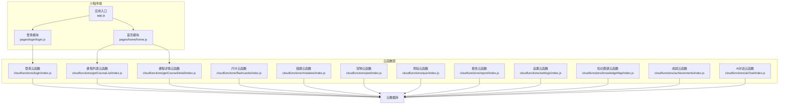
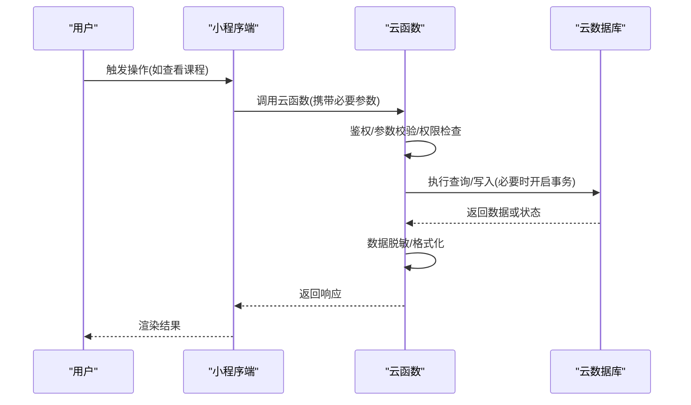
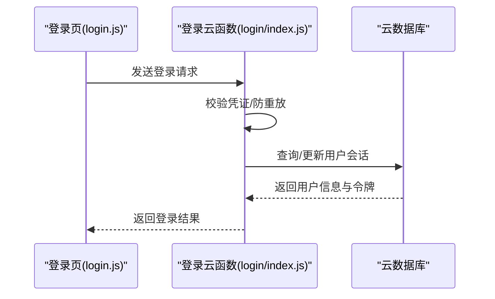
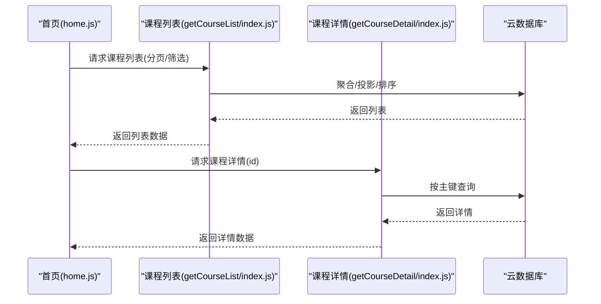
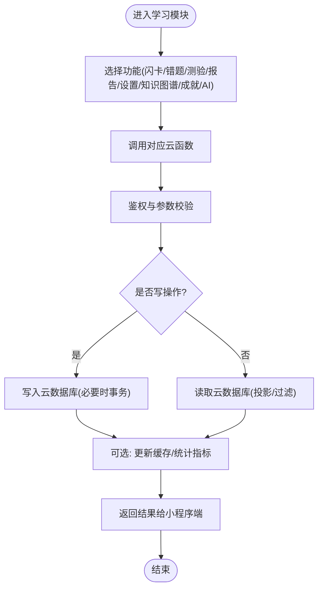
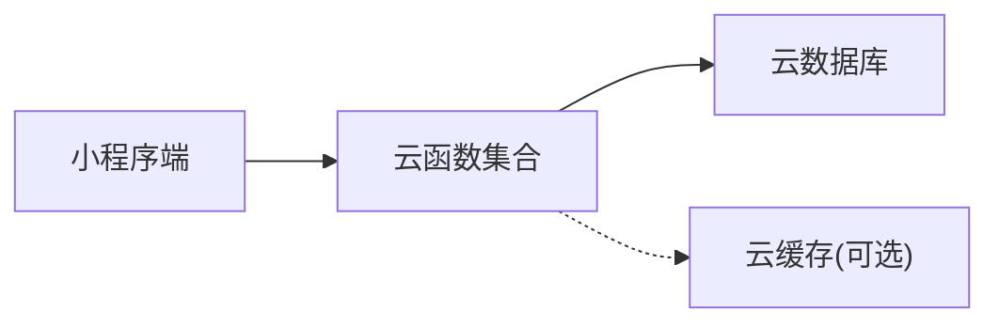
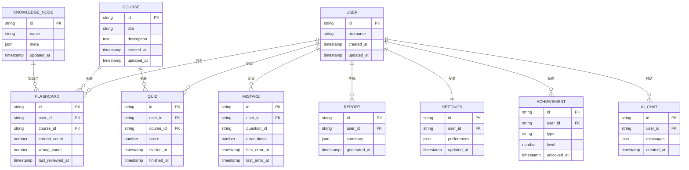

# 数据架构设计

<cite>
**本文引用的文件**   
- [project.config.json](file://project.config.json)
- [app.js](file://miniprogram/app.js)
- [home/home.js](file://miniprogram/pages/home/home.js)
- [login/login.js](file://miniprogram/pages/login/login.js)
- [cloudfunctions/login/index.js](file://cloudfunctions/login/index.js)
- [cloudfunctions/getCourseList/index.js](file://cloudfunctions/getCourseList/index.js)
- [cloudfunctions/getCourseDetail/index.js](file://cloudfunctions/getCourseDetail/index.js)
- [cloudfunctions/flashcards/index.js](file://cloudfunctions/flashcards/index.js)
- [cloudfunctions/mistakes/index.js](file://cloudfunctions/mistakes/index.js)
- [cloudfunctions/pet/index.js](file://cloudfunctions/pet/index.js)
- [cloudfunctions/quiz/index.js](file://cloudfunctions/quiz/index.js)
- [cloudfunctions/report/index.js](file://cloudfunctions/report/index.js)
- [cloudfunctions/settings/index.js](file://cloudfunctions/settings/index.js)
- [cloudfunctions/knowledgeMap/index.js](file://cloudfunctions/knowledgeMap/index.js)
- [cloudfunctions/achievements/index.js](file://cloudfunctions/achievements/index.js)
- [cloudfunctions/aiChat/index.js](file://cloudfunctions/aiChat/index.js)
</cite>

## 目录
1. [引言](#引言)
2. [项目结构](#项目结构)
3. [核心组件](#核心组件)
4. [架构总览](#架构总览)
5. [详细组件分析](#详细组件分析)
6. [依赖关系分析](#依赖关系分析)
7. [性能考虑](#性能考虑)
8. [故障排查指南](#故障排查指南)
9. [结论](#结论)
10. [附录](#附录)

## 引言
本文件面向开发者与架构师，系统化阐述本项目在小程序端与云函数侧的数据架构设计。内容覆盖数据库表结构设计、实体关系模型与约束定义；数据访问层模式、查询优化与缓存策略；数据同步、离线处理与一致性保证；用户隐私保护、加密存储与安全访问控制；备份恢复、版本迁移与性能监控方案；并提供最佳实践与扩展指导。

## 项目结构
本项目采用“小程序前端 + 云函数后端”的轻量级架构：
- 小程序端负责页面交互、本地状态与基础缓存（如本地缓存、内存对象）。
- 云函数作为统一的数据访问入口，封装对云数据库的读写操作，并承载业务逻辑。
- 各功能域以独立云函数为边界，便于按领域拆分与维护。

图表来源
- [app.js](file://miniprogram/app.js)
- [home/home.js](file://miniprogram/pages/home/home.js)
- [login/login.js](file://miniprogram/pages/login/login.js)
- [cloudfunctions/login/index.js](file://cloudfunctions/login/index.js)
- [cloudfunctions/getCourseList/index.js](file://cloudfunctions/getCourseList/index.js)
- [cloudfunctions/getCourseDetail/index.js](file://cloudfunctions/getCourseDetail/index.js)
- [cloudfunctions/flashcards/index.js](file://cloudfunctions/flashcards/index.js)
- [cloudfunctions/mistakes/index.js](file://cloudfunctions/mistakes/index.js)
- [cloudfunctions/pet/index.js](file://cloudfunctions/pet/index.js)
- [cloudfunctions/quiz/index.js](file://cloudfunctions/quiz/index.js)
- [cloudfunctions/report/index.js](file://cloudfunctions/report/index.js)
- [cloudfunctions/settings/index.js](file://cloudfunctions/settings/index.js)
- [cloudfunctions/knowledgeMap/index.js](file://cloudfunctions/knowledgeMap/index.js)
- [cloudfunctions/achievements/index.js](file://cloudfunctions/achievements/index.js)
- [cloudfunctions/aiChat/index.js](file://cloudfunctions/aiChat/index.js)

章节来源
- [project.config.json](file://project.config.json)
- [app.js](file://miniprogram/app.js)

## 核心组件
- 应用入口与全局配置
  - 应用初始化、环境配置、全局状态与生命周期管理。
  - 参考路径：[应用入口](file://miniprogram/app.js)
- 登录流程
  - 小程序端调用登录云函数完成身份校验与会话建立。
  - 参考路径：[登录页](file://miniprogram/pages/login/login.js)、[登录云函数](file://cloudfunctions/login/index.js)
- 课程数据访问
  - 列表与详情通过对应云函数获取，遵循最小权限与按需加载原则。
  - 参考路径：[首页](file://miniprogram/pages/home/home.js)、[课程列表云函数](file://cloudfunctions/getCourseList/index.js)、[课程详情云函数](file://cloudfunctions/getCourseDetail/index.js)
- 学习相关数据
  - 闪卡、错题、测验、报告、设置、知识图谱、成就、AI对话等均由各自云函数提供数据能力。
  - 参考路径：见“详细组件分析”中各子节

章节来源
- [app.js](file://miniprogram/app.js)
- [login/login.js](file://miniprogram/pages/login/login.js)
- [cloudfunctions/login/index.js](file://cloudfunctions/login/index.js)
- [home/home.js](file://miniprogram/pages/home/home.js)
- [cloudfunctions/getCourseList/index.js](file://cloudfunctions/getCourseList/index.js)
- [cloudfunctions/getCourseDetail/index.js](file://cloudfunctions/getCourseDetail/index.js)

## 架构总览
整体数据流遵循“前端请求 -> 云函数鉴权与校验 -> 云数据库读写 -> 返回结果”的模式。云函数作为唯一数据出口，集中实现权限控制、输入校验、事务与幂等性保障。

图表来源
- [cloudfunctions/getCourseList/index.js](file://cloudfunctions/getCourseList/index.js)
- [cloudfunctions/getCourseDetail/index.js](file://cloudfunctions/getCourseDetail/index.js)
- [cloudfunctions/login/index.js](file://cloudfunctions/login/index.js)

## 详细组件分析

### 登录与认证
- 职责
  - 小程序端发起登录，云函数完成身份校验并返回会话令牌或用户标识。
- 关键流程
  - 小程序端调用登录云函数，传递必要的登录凭证。
  - 云函数校验凭证、生成会话信息并落库或更新用户状态。
  - 返回令牌供后续请求使用。
- 安全要点
  - 仅暴露最小必要字段，敏感信息不落盘或进行加密存储。
  - 令牌具备有效期与刷新机制。

图表来源
- [login/login.js](file://miniprogram/pages/login/login.js)
- [cloudfunctions/login/index.js](file://cloudfunctions/login/index.js)

章节来源
- [login/login.js](file://miniprogram/pages/login/login.js)
- [cloudfunctions/login/index.js](file://cloudfunctions/login/index.js)

### 课程数据访问
- 职责
  - 提供课程列表与详情查询，支持分页、过滤与排序。
- 关键流程
  - 小程序端根据场景选择列表或详情接口。
  - 云函数执行查询，必要时进行数据裁剪与脱敏。
- 优化建议
  - 列表接口支持分页与索引字段过滤。
  - 详情接口避免返回冗余大字段。

图表来源
- [home/home.js](file://miniprogram/pages/home/home.js)
- [cloudfunctions/getCourseList/index.js](file://cloudfunctions/getCourseList/index.js)
- [cloudfunctions/getCourseDetail/index.js](file://cloudfunctions/getCourseDetail/index.js)

章节来源
- [home/home.js](file://miniprogram/pages/home/home.js)
- [cloudfunctions/getCourseList/index.js](file://cloudfunctions/getCourseList/index.js)
- [cloudfunctions/getCourseDetail/index.js](file://cloudfunctions/getCourseDetail/index.js)

### 学习相关数据（闪卡、错题、测验、报告、设置、知识图谱、成就、AI对话）
- 职责
  - 分别由对应云函数提供增删改查能力，支撑学习闭环。
- 通用设计
  - 每个云函数聚焦单一领域，保持高内聚低耦合。
  - 统一鉴权与输入校验，确保数据一致性与安全性。
  - 针对高频读场景可引入缓存层（如云缓存），降低数据库压力。
- 典型流程（以闪卡为例）
  - 小程序端提交学习进度或卡片状态。
  - 云函数校验并持久化，必要时触发统计或成就计算。

图表来源
- [cloudfunctions/flashcards/index.js](file://cloudfunctions/flashcards/index.js)
- [cloudfunctions/mistakes/index.js](file://cloudfunctions/mistakes/index.js)
- [cloudfunctions/quiz/index.js](file://cloudfunctions/quiz/index.js)
- [cloudfunctions/report/index.js](file://cloudfunctions/report/index.js)
- [cloudfunctions/settings/index.js](file://cloudfunctions/settings/index.js)
- [cloudfunctions/knowledgeMap/index.js](file://cloudfunctions/knowledgeMap/index.js)
- [cloudfunctions/achievements/index.js](file://cloudfunctions/achievements/index.js)
- [cloudfunctions/aiChat/index.js](file://cloudfunctions/aiChat/index.js)

章节来源
- [cloudfunctions/flashcards/index.js](file://cloudfunctions/flashcards/index.js)
- [cloudfunctions/mistakes/index.js](file://cloudfunctions/mistakes/index.js)
- [cloudfunctions/quiz/index.js](file://cloudfunctions/quiz/index.js)
- [cloudfunctions/report/index.js](file://cloudfunctions/report/index.js)
- [cloudfunctions/settings/index.js](file://cloudfunctions/settings/index.js)
- [cloudfunctions/knowledgeMap/index.js](file://cloudfunctions/knowledgeMap/index.js)
- [cloudfunctions/achievements/index.js](file://cloudfunctions/achievements/index.js)
- [cloudfunctions/aiChat/index.js](file://cloudfunctions/aiChat/index.js)

## 依赖关系分析
- 模块耦合
  - 小程序端仅依赖云函数提供的稳定接口，避免直接访问数据库。
  - 云函数之间尽量解耦，通过事件或消息队列（如需）进行异步协作。
- 外部依赖
  - 云数据库为唯一持久化存储，所有读写均经云函数中转。
  - 可选引入云缓存用于热点数据加速。

图表来源
- [cloudfunctions/getCourseList/index.js](file://cloudfunctions/getCourseList/index.js)
- [cloudfunctions/getCourseDetail/index.js](file://cloudfunctions/getCourseDetail/index.js)
- [cloudfunctions/login/index.js](file://cloudfunctions/login/index.js)

章节来源
- [cloudfunctions/getCourseList/index.js](file://cloudfunctions/getCourseList/index.js)
- [cloudfunctions/getCourseDetail/index.js](file://cloudfunctions/getCourseDetail/index.js)
- [cloudfunctions/login/index.js](file://cloudfunctions/login/index.js)

## 性能考虑
- 查询优化
  - 列表接口启用分页、投影与过滤，减少网络传输与数据库扫描。
  - 为常用查询字段建立索引，避免全表扫描。
- 缓存策略
  - 对热点只读数据（如课程列表、知识图谱节点）引入缓存，设置合理过期时间。
  - 写后失效或延迟双写，保证最终一致性。
- 连接与并发
  - 云函数无状态，利用弹性扩容应对突发流量。
  - 批量操作合并，减少往返次数。
- 资源成本
  - 限制单次返回数据量，按需加载大图或富文本。
  - 对日志与调试输出进行分级与采样，避免影响性能。

## 故障排查指南
- 常见问题定位
  - 登录失败：检查小程序端传参与云函数鉴权逻辑，确认用户状态与令牌有效性。
  - 数据不一致：核查云函数事务边界与幂等性设计，确认是否存在并发写冲突。
  - 性能问题：关注慢查询与未命中缓存的请求，结合索引与分页策略优化。
- 建议手段
  - 在云函数中增加结构化日志与错误码，便于快速定位。
  - 对关键路径添加超时与重试策略，提升鲁棒性。
  - 使用灰度发布与回滚机制，降低变更风险。

## 结论
本项目采用“小程序 + 云函数 + 云数据库”的清晰分层，将数据访问收敛至云函数层，有利于统一鉴权、校验与治理。通过合理的索引、分页、缓存与事务设计，可在保证一致性的同时获得良好性能。后续可按领域进一步拆分云函数，完善监控告警与自动化运维体系。

## 附录

### 数据模型与实体关系（概念图）
以下为概念层面的实体关系示意，实际字段与约束以云数据库为准。

[此图为概念模型，不直接映射具体代码文件]

### 数据访问层设计模式
- 门面模式
  - 云函数作为门面，对外暴露稳定的API，隐藏内部复杂逻辑。
- 仓储模式
  - 将数据访问细节封装在云函数内部，上层仅关心领域操作。
- 命令模式
  - 将写操作抽象为命令，便于审计、重试与幂等处理。
- 观察者模式
  - 写成功后触发统计、成就、通知等副作用。

### 数据同步与离线处理
- 同步策略
  - 增量同步：基于时间戳或版本号拉取变更。
  - 冲突解决：以服务端为权威源，客户端合并策略可配置。
- 离线处理
  - 本地暂存待同步操作，网络恢复后批量提交。
  - 使用幂等键避免重复提交。
- 一致性保证
  - 关键写操作使用事务；跨服务通过最终一致性补偿。

### 隐私保护与安全访问控制
- 隐私保护
  - 最小化采集，敏感字段加密存储，展示时脱敏。
- 加密存储
  - 对口令、令牌等敏感数据进行加密或哈希处理。
- 访问控制
  - 基于角色的权限控制，细粒度到资源ID级别。
  - 接口级鉴权与签名校验，防止越权访问。

### 备份恢复与版本迁移
- 备份恢复
  - 定期全量+增量备份，保留多份副本，演练恢复流程。
- 版本迁移
  - 使用迁移脚本与版本号管理，保证向后兼容。
  - 灰度发布与回滚预案，降低迁移风险。

### 性能监控方案
- 指标采集
  - 接口耗时、错误率、QPS、缓存命中率、数据库慢查询。
- 告警与追踪
  - 设定阈值告警，链路追踪定位瓶颈。
- 容量规划
  - 基于历史峰值与增长趋势评估资源扩容。

### 最佳实践与扩展指导
- 接口设计
  - 明确入参出参、错误码与限流策略。
- 幂等与重试
  - 为写接口设计幂等键，客户端实现指数退避重试。
- 可扩展性
  - 按领域拆分云函数，逐步引入消息队列与缓存层。
- 文档与测试
  - 维护接口契约与用例，持续集成与回归测试。