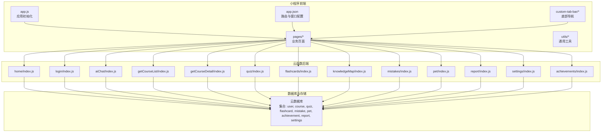
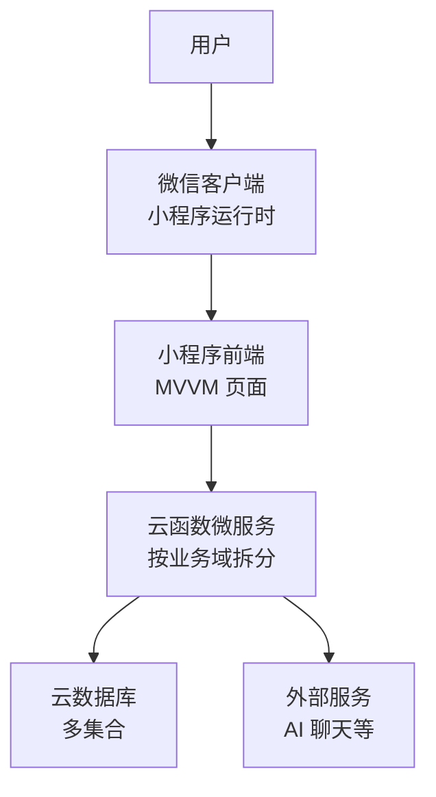
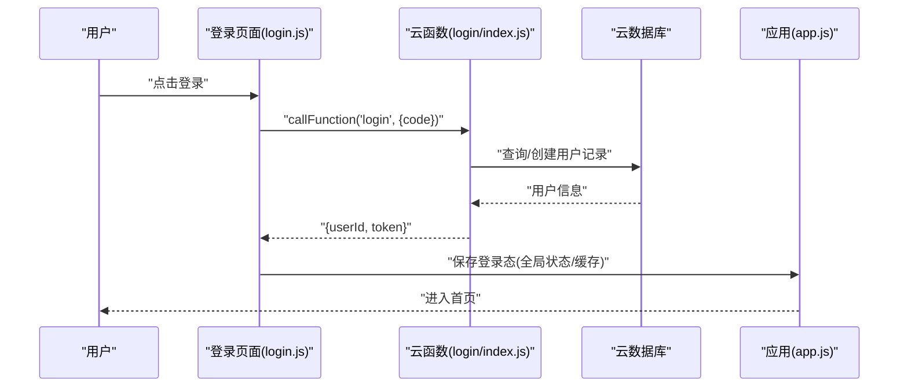
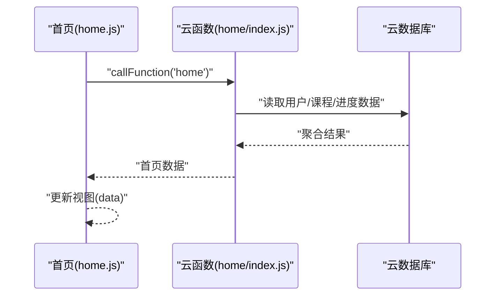
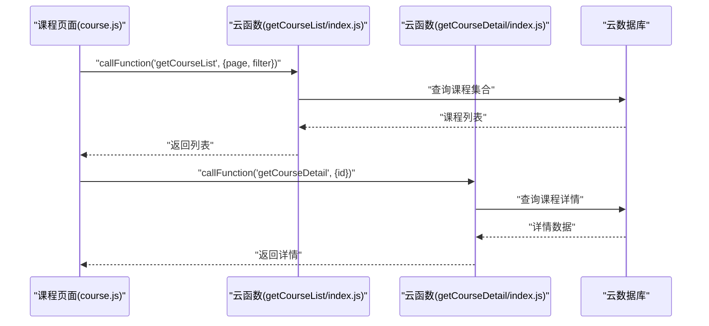
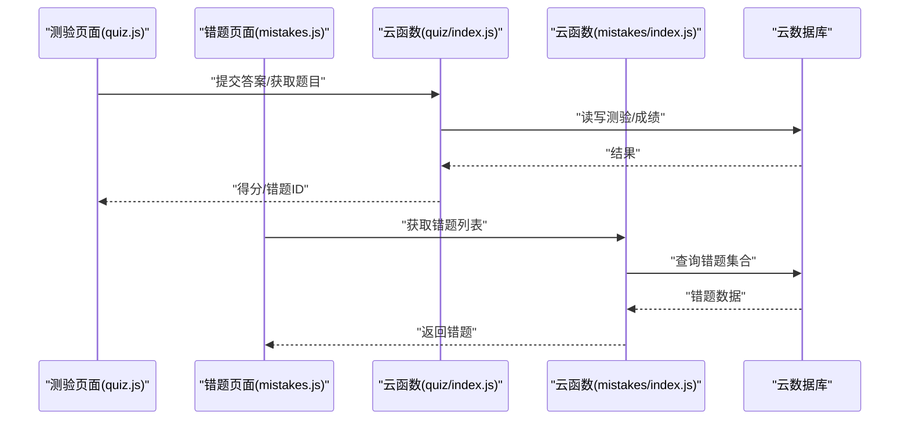
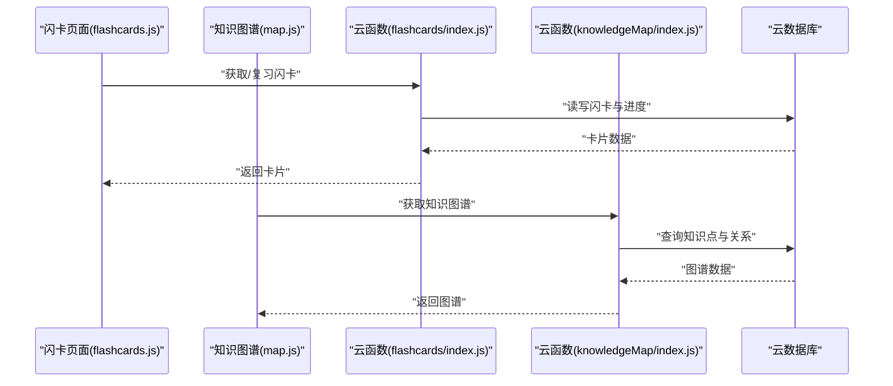
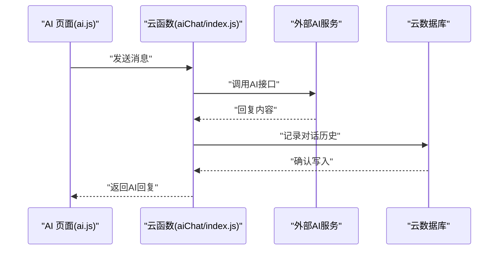
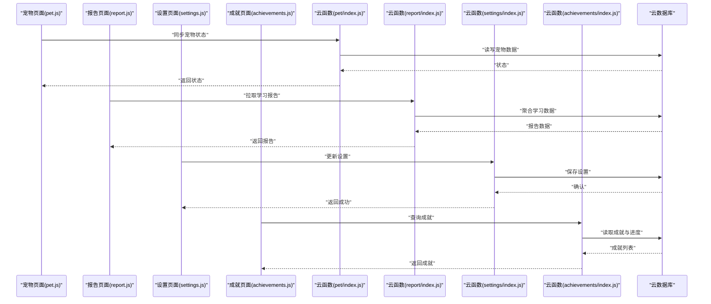
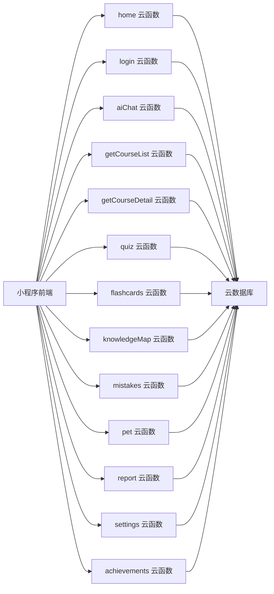

# 架构设计

<cite>
**本文引用的文件**   
- [project.config.json](file://project.config.json)
- [app.js](file://miniprogram/app.js)
- [app.json](file://miniprogram/app.json)
- [home/home.js](file://miniprogram/pages/home/home.js)
- [login/login.js](file://miniprogram/pages/login/login.js)
- [ai/ai.js](file://miniprogram/pages/ai/ai.js)
- [course/course.js](file://miniprogram/pages/course/course.js)
- [quiz/quiz.js](file://miniprogram/pages/quiz/quiz.js)
- [flashcards/flashcards.js](file://miniprogram/pages/flashcards/flashcards.js)
- [knowledge/knowledge.js](file://miniprogram/pages/knowledge/knowledge.js)
- [map/map.js](file://miniprogram/pages/map/map.js)
- [mistakes/mistakes.js](file://miniprogram/pages/mistakes/mistakes.js)
- [pet/pet.js](file://miniprogram/pages/pet/pet.js)
- [report/report.js](file://miniprogram/pages/report/report.js)
- [settings/settings.js](file://miniprogram/pages/settings/settings.js)
- [achievements/achievements.js](file://miniprogram/pages/achievements/achievements.js)
- [profile/profile.js](file://miniprogram/pages/profile/profile.js)
- [study/study.js](file://miniprogram/pages/study/study.js)
- [custom-tab-bar/index.js](file://miniprogram/custom-tab-bar/index.js)
- [cloudfunctions/home/index.js](file://cloudfunctions/home/index.js)
- [cloudfunctions/login/index.js](file://cloudfunctions/login/index.js)
- [cloudfunctions/aiChat/index.js](file://cloudfunctions/aiChat/index.js)
- [cloudfunctions/getCourseList/index.js](file://cloudfunctions/getCourseList/index.js)
- [cloudfunctions/getCourseDetail/index.js](file://cloudfunctions/getCourseDetail/index.js)
- [cloudfunctions/quiz/index.js](file://cloudfunctions/quiz/index.js)
- [cloudfunctions/flashcards/index.js](file://cloudfunctions/flashcards/index.js)
- [cloudfunctions/knowledgeMap/index.js](file://cloudfunctions/knowledgeMap/index.js)
- [cloudfunctions/mistakes/index.js](file://cloudfunctions/mistakes/index.js)
- [cloudfunctions/pet/index.js](file://cloudfunctions/pet/index.js)
- [cloudfunctions/report/index.js](file://cloudfunctions/report/index.js)
- [cloudfunctions/settings/index.js](file://cloudfunctions/settings/index.js)
- [cloudfunctions/achievements/index.js](file://cloudfunctions/achievements/index.js)
</cite>

## 目录
1. [引言](#引言)
2. [项目结构](#项目结构)
3. [核心组件](#核心组件)
4. [架构总览](#架构总览)
5. [详细组件分析](#详细组件分析)
6. [依赖关系分析](#依赖关系分析)
7. [性能考虑](#性能考虑)
8. [故障排查指南](#故障排查指南)
9. [结论](#结论)
10. [附录](#附录)

## 引言
本文件面向“生物学习小程序”的架构设计与二次开发，聚焦于前端小程序层、云函数后端层与数据库层的职责划分、数据流向、通信机制与安全策略。系统采用前后端分离与微服务化（按业务域拆分的云函数）模式，结合小程序原生 MVVM 的数据驱动视图更新，形成高内聚、低耦合、可扩展的整体架构。

## 项目结构
仓库由三大部分组成：
- 小程序前端：位于 miniprogram 目录，包含页面、自定义 TabBar、全局配置与工具模块。
- 云函数后端：位于 cloudfunctions 目录，每个子目录对应一个业务域的云函数（如 home、login、aiChat、getCourseList 等）。
- 工程配置：根目录 project.config.json 用于微信开发者工具与小程序工程配置。

图表来源
- [app.js](file://miniprogram/app.js)
- [app.json](file://miniprogram/app.json)
- [home/home.js](file://miniprogram/pages/home/home.js)
- [cloudfunctions/home/index.js](file://cloudfunctions/home/index.js)
- [cloudfunctions/login/index.js](file://cloudfunctions/login/index.js)
- [cloudfunctions/aiChat/index.js](file://cloudfunctions/aiChat/index.js)
- [cloudfunctions/getCourseList/index.js](file://cloudfunctions/getCourseList/index.js)
- [cloudfunctions/getCourseDetail/index.js](file://cloudfunctions/getCourseDetail/index.js)
- [cloudfunctions/quiz/index.js](file://cloudfunctions/quiz/index.js)
- [cloudfunctions/flashcards/index.js](file://cloudfunctions/flashcards/index.js)
- [cloudfunctions/knowledgeMap/index.js](file://cloudfunctions/knowledgeMap/index.js)
- [cloudfunctions/mistakes/index.js](file://cloudfunctions/mistakes/index.js)
- [cloudfunctions/pet/index.js](file://cloudfunctions/pet/index.js)
- [cloudfunctions/report/index.js](file://cloudfunctions/report/index.js)
- [cloudfunctions/settings/index.js](file://cloudfunctions/settings/index.js)
- [cloudfunctions/achievements/index.js](file://cloudfunctions/achievements/index.js)

章节来源
- [project.config.json](file://project.config.json)
- [app.js](file://miniprogram/app.js)
- [app.json](file://miniprogram/app.json)

## 核心组件
- 应用入口与生命周期
  - app.js：负责小程序启动、全局状态初始化、登录态校验与云环境初始化。
  - app.json：定义页面路由、窗口样式、TabBar 及分包策略（如有）。
- 页面与交互
  - pages/*：各业务页面（首页、课程、测验、闪卡、知识图谱、错题本、宠物、报告、设置、成就、AI 对话等），遵循 MVVM 模式，通过 data 与视图绑定，事件回调触发逻辑处理。
  - custom-tab-bar：自定义底部导航，统一入口与页面跳转。
- 云函数（微服务化）
  - 每个云函数对应一个业务域，提供 REST-like 调用接口（通过 wx.cloud.callFunction），内部访问云数据库或外部 API（如 AI 聊天）。
  - 典型云函数：home、login、aiChat、getCourseList、getCourseDetail、quiz、flashcards、knowledgeMap、mistakes、pet、report、settings、achievements。
- 数据存储
  - 云数据库：用户信息、课程、测验、闪卡、错题、宠物、成就、报告、设置等集合。
  - 本地缓存：临时会话、UI 偏好等（按需使用）。

章节来源
- [app.js](file://miniprogram/app.js)
- [app.json](file://miniprogram/app.json)
- [custom-tab-bar/index.js](file://miniprogram/custom-tab-bar/index.js)
- [home/home.js](file://miniprogram/pages/home/home.js)
- [login/login.js](file://miniprogram/pages/login/login.js)
- [ai/ai.js](file://miniprogram/pages/ai/ai.js)
- [course/course.js](file://miniprogram/pages/course/course.js)
- [quiz/quiz.js](file://miniprogram/pages/quiz/quiz.js)
- [flashcards/flashcards.js](file://miniprogram/pages/flashcards/flashcards.js)
- [knowledge/knowledge.js](file://miniprogram/pages/knowledge/knowledge.js)
- [map/map.js](file://miniprogram/pages/map/map.js)
- [mistakes/mistakes.js](file://miniprogram/pages/mistakes/mistakes.js)
- [pet/pet.js](file://miniprogram/pages/pet/pet.js)
- [report/report.js](file://miniprogram/pages/report/report.js)
- [settings/settings.js](file://miniprogram/pages/settings/settings.js)
- [achievements/achievements.js](file://miniprogram/pages/achievements/achievements.js)
- [profile/profile.js](file://miniprogram/pages/profile/profile.js)
- [study/study.js](file://miniprogram/pages/study/study.js)

## 架构总览
整体采用“前后端分离 + 微服务化（云函数）+ MVVM 视图驱动”的架构模式：
- 前端（小程序）：负责 UI 渲染、用户交互、表单校验、请求封装与错误提示。
- 后端（云函数）：按业务域拆分，提供领域能力（认证、内容检索、测验生成、错题统计、AI 对话等），并访问云数据库。
- 数据库（云数据库）：持久化用户、课程、测验、闪卡、错题、宠物、成就、报告、设置等数据。

图表来源
- [app.js](file://miniprogram/app.js)
- [home/home.js](file://miniprogram/pages/home/home.js)
- [cloudfunctions/home/index.js](file://cloudfunctions/home/index.js)
- [cloudfunctions/login/index.js](file://cloudfunctions/login/index.js)
- [cloudfunctions/aiChat/index.js](file://cloudfunctions/aiChat/index.js)

## 详细组件分析

### 登录流程（认证与会话）
- 前端在登录页发起登录请求，调用 login 云函数完成微信授权与用户信息获取，返回用户标识与会话令牌。
- 后续请求携带令牌进行鉴权，云函数校验令牌后执行业务逻辑。

图表来源
- [login/login.js](file://miniprogram/pages/login/login.js)
- [cloudfunctions/login/index.js](file://cloudfunctions/login/index.js)
- [app.js](file://miniprogram/app.js)

章节来源
- [login/login.js](file://miniprogram/pages/login/login.js)
- [cloudfunctions/login/index.js](file://cloudfunctions/login/index.js)
- [app.js](file://miniprogram/app.js)

### 首页数据加载（聚合展示）
- 首页调用 home 云函数，聚合用户信息、课程概览、学习进度等数据，返回给前端渲染。

图表来源
- [home/home.js](file://miniprogram/pages/home/home.js)
- [cloudfunctions/home/index.js](file://cloudfunctions/home/index.js)

章节来源
- [home/home.js](file://miniprogram/pages/home/home.js)
- [cloudfunctions/home/index.js](file://cloudfunctions/home/index.js)

### 课程列表与详情（内容检索）
- 课程列表：前端调用 getCourseList 云函数，分页或筛选返回课程条目。
- 课程详情：前端调用 getCourseDetail 云函数，根据课程 ID 返回详细内容。

图表来源
- [course/course.js](file://miniprogram/pages/course/course.js)
- [cloudfunctions/getCourseList/index.js](file://cloudfunctions/getCourseList/index.js)
- [cloudfunctions/getCourseDetail/index.js](file://cloudfunctions/getCourseDetail/index.js)

章节来源
- [course/course.js](file://miniprogram/pages/course/course.js)
- [cloudfunctions/getCourseList/index.js](file://cloudfunctions/getCourseList/index.js)
- [cloudfunctions/getCourseDetail/index.js](file://cloudfunctions/getCourseDetail/index.js)

### 测验与错题（学习与反馈）
- 测验：前端调用 quiz 云函数提交答题结果，云函数计算得分并写入错题集。
- 错题：前端调用 mistakes 云函数获取错题列表与解析，支持复习与巩固。

图表来源
- [quiz/quiz.js](file://miniprogram/pages/quiz/quiz.js)
- [mistakes/mistakes.js](file://miniprogram/pages/mistakes/mistakes.js)
- [cloudfunctions/quiz/index.js](file://cloudfunctions/quiz/index.js)
- [cloudfunctions/mistakes/index.js](file://cloudfunctions/mistakes/index.js)

章节来源
- [quiz/quiz.js](file://miniprogram/pages/quiz/quiz.js)
- [mistakes/mistakes.js](file://miniprogram/pages/mistakes/mistakes.js)
- [cloudfunctions/quiz/index.js](file://cloudfunctions/quiz/index.js)
- [cloudfunctions/mistakes/index.js](file://cloudfunctions/mistakes/index.js)

### 闪卡与知识图谱（记忆与结构化）
- 闪卡：前端调用 flashcards 云函数，实现卡片轮播、复习间隔与掌握度统计。
- 知识图谱：前端调用 knowledgeMap 云函数，返回知识点关联图数据，辅助系统化学习。

图表来源
- [flashcards/flashcards.js](file://miniprogram/pages/flashcards/flashcards.js)
- [map/map.js](file://miniprogram/pages/map/map.js)
- [cloudfunctions/flashcards/index.js](file://cloudfunctions/flashcards/index.js)
- [cloudfunctions/knowledgeMap/index.js](file://cloudfunctions/knowledgeMap/index.js)

章节来源
- [flashcards/flashcards.js](file://miniprogram/pages/flashcards/flashcards.js)
- [map/map.js](file://miniprogram/pages/map/map.js)
- [cloudfunctions/flashcards/index.js](file://cloudfunctions/flashcards/index.js)
- [cloudfunctions/knowledgeMap/index.js](file://cloudfunctions/knowledgeMap/index.js)

### AI 对话（智能辅导）
- 前端调用 aiChat 云函数，将用户问题转发至外部 AI 服务，返回解答与建议。

图表来源
- [ai/ai.js](file://miniprogram/pages/ai/ai.js)
- [cloudfunctions/aiChat/index.js](file://cloudfunctions/aiChat/index.js)

章节来源
- [ai/ai.js](file://miniprogram/pages/ai/ai.js)
- [cloudfunctions/aiChat/index.js](file://cloudfunctions/aiChat/index.js)

### 宠物、报告、设置与成就（个性化与激励）
- 宠物：pet 云函数管理虚拟宠物状态与成长，增强学习动机。
- 报告：report 云函数汇总学习数据，生成可视化报告。
- 设置：settings 云函数维护用户偏好与功能开关。
- 成就：achievements 云函数记录里程碑与解锁条件。

图表来源
- [pet/pet.js](file://miniprogram/pages/pet/pet.js)
- [report/report.js](file://miniprogram/pages/report/report.js)
- [settings/settings.js](file://miniprogram/pages/settings/settings.js)
- [achievements/achievements.js](file://miniprogram/pages/achievements/achievements.js)
- [cloudfunctions/pet/index.js](file://cloudfunctions/pet/index.js)
- [cloudfunctions/report/index.js](file://cloudfunctions/report/index.js)
- [cloudfunctions/settings/index.js](file://cloudfunctions/settings/index.js)
- [cloudfunctions/achievements/index.js](file://cloudfunctions/achievements/index.js)

章节来源
- [pet/pet.js](file://miniprogram/pages/pet/pet.js)
- [report/report.js](file://miniprogram/pages/report/report.js)
- [settings/settings.js](file://miniprogram/pages/settings/settings.js)
- [achievements/achievements.js](file://miniprogram/pages/achievements/achievements.js)
- [cloudfunctions/pet/index.js](file://cloudfunctions/pet/index.js)
- [cloudfunctions/report/index.js](file://cloudfunctions/report/index.js)
- [cloudfunctions/settings/index.js](file://cloudfunctions/settings/index.js)
- [cloudfunctions/achievements/index.js](file://cloudfunctions/achievements/index.js)

### 其他页面（资料、学习、个人中心）
- profile：用户资料与基本信息管理。
- study：学习路径与计划执行。
- knowledge：知识点浏览与搜索。

章节来源
- [profile/profile.js](file://miniprogram/pages/profile/profile.js)
- [study/study.js](file://miniprogram/pages/study/study.js)
- [knowledge/knowledge.js](file://miniprogram/pages/knowledge/knowledge.js)

## 依赖关系分析
- 前端到云函数：通过 wx.cloud.callFunction 调用，参数为云函数名与方法体；云函数名与业务域一一对应。
- 云函数到数据库：使用云数据库 SDK 进行读写操作，按集合组织数据。
- 云函数到外部服务：如 aiChat 云函数调用外部 AI 接口，需保证网络超时与重试策略。

图表来源
- [home/home.js](file://miniprogram/pages/home/home.js)
- [login/login.js](file://miniprogram/pages/login/login.js)
- [ai/ai.js](file://miniprogram/pages/ai/ai.js)
- [course/course.js](file://miniprogram/pages/course/course.js)
- [quiz/quiz.js](file://miniprogram/pages/quiz/quiz.js)
- [flashcards/flashcards.js](file://miniprogram/pages/flashcards/flashcards.js)
- [knowledge/knowledge.js](file://miniprogram/pages/knowledge/knowledge.js)
- [map/map.js](file://miniprogram/pages/map/map.js)
- [mistakes/mistakes.js](file://miniprogram/pages/mistakes/mistakes.js)
- [pet/pet.js](file://miniprogram/pages/pet/pet.js)
- [report/report.js](file://miniprogram/pages/report/report.js)
- [settings/settings.js](file://miniprogram/pages/settings/settings.js)
- [achievements/achievements.js](file://miniprogram/pages/achievements/achievements.js)
- [cloudfunctions/home/index.js](file://cloudfunctions/home/index.js)
- [cloudfunctions/login/index.js](file://cloudfunctions/login/index.js)
- [cloudfunctions/aiChat/index.js](file://cloudfunctions/aiChat/index.js)
- [cloudfunctions/getCourseList/index.js](file://cloudfunctions/getCourseList/index.js)
- [cloudfunctions/getCourseDetail/index.js](file://cloudfunctions/getCourseDetail/index.js)
- [cloudfunctions/quiz/index.js](file://cloudfunctions/quiz/index.js)
- [cloudfunctions/flashcards/index.js](file://cloudfunctions/flashcards/index.js)
- [cloudfunctions/knowledgeMap/index.js](file://cloudfunctions/knowledgeMap/index.js)
- [cloudfunctions/mistakes/index.js](file://cloudfunctions/mistakes/index.js)
- [cloudfunctions/pet/index.js](file://cloudfunctions/pet/index.js)
- [cloudfunctions/report/index.js](file://cloudfunctions/report/index.js)
- [cloudfunctions/settings/index.js](file://cloudfunctions/settings/index.js)
- [cloudfunctions/achievements/index.js](file://cloudfunctions/achievements/index.js)

章节来源
- [app.json](file://miniprogram/app.json)
- [custom-tab-bar/index.js](file://miniprogram/custom-tab-bar/index.js)

## 性能考虑
- 请求合并与分页：对课程列表、知识图谱等大数据量场景采用分页与增量加载，减少首屏压力。
- 缓存策略：对静态资源与低频变更数据使用本地缓存，降低重复请求。
- 云函数幂等：关键写操作（测验提交、设置更新）确保幂等，避免重复提交导致数据不一致。
- 错误重试与降级：网络异常时进行有限次重试；外部 AI 服务不可用时返回友好提示与离线内容。
- 视图优化：合理使用 wx:key、减少不必要的 setData 调用，提升渲染性能。

[本节为通用指导，不直接分析具体文件]

## 故障排查指南
- 登录失败
  - 检查微信授权码是否有效、用户是否存在、令牌是否过期。
  - 查看 login 云函数日志与数据库用户记录。
- 数据加载缓慢
  - 检查云函数响应时间与数据库索引；对高频查询字段建立索引。
  - 增加分页与缓存，减少单次返回数据量。
- AI 对话无响应
  - 检查外部 AI 服务可用性、网络超时与重试策略。
  - 在 aiChat 云函数中记录请求与响应日志以便定位。
- 权限与鉴权
  - 校验令牌签名与有效期；对敏感操作进行白名单与频率限制。
  - 在云函数中统一鉴权中间件，避免分散校验逻辑。

章节来源
- [login/login.js](file://miniprogram/pages/login/login.js)
- [cloudfunctions/login/index.js](file://cloudfunctions/login/index.js)
- [ai/ai.js](file://miniprogram/pages/ai/ai.js)
- [cloudfunctions/aiChat/index.js](file://cloudfunctions/aiChat/index.js)

## 结论
本架构以小程序前端为核心交互层，云函数作为微服务化的业务后端，云数据库作为统一数据持久化层。通过清晰的职责划分与模块化设计，系统在安全性、性能与扩展性方面具备良好基础。建议持续完善鉴权中间件、监控与日志体系，并在数据模型与接口契约上保持演进一致性，以支撑未来更多学习场景与功能的快速迭代。

[本节为总结性内容，不直接分析具体文件]

## 附录
- 安全策略
  - 身份认证：基于微信登录与令牌校验，云函数统一鉴权。
  - 数据安全：最小权限原则，仅开放必要字段；敏感数据加密存储。
  - 输入校验：前后端双重校验，防止注入与越权访问。
- 扩展性设计
  - 新增业务域：新增云函数与页面，保持命名与接口规范一致。
  - 数据模型演进：通过迁移脚本与版本控制，保障向后兼容。
  - 第三方集成：通过适配器模式封装外部服务，便于替换与升级。

[本节为概念性内容，不直接分析具体文件]