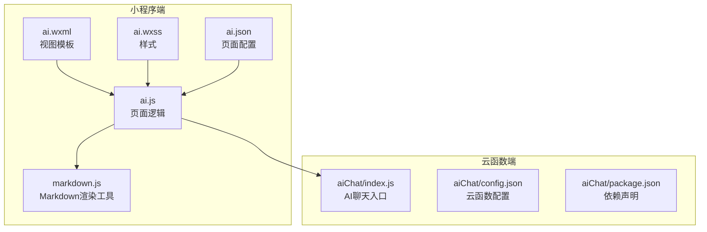
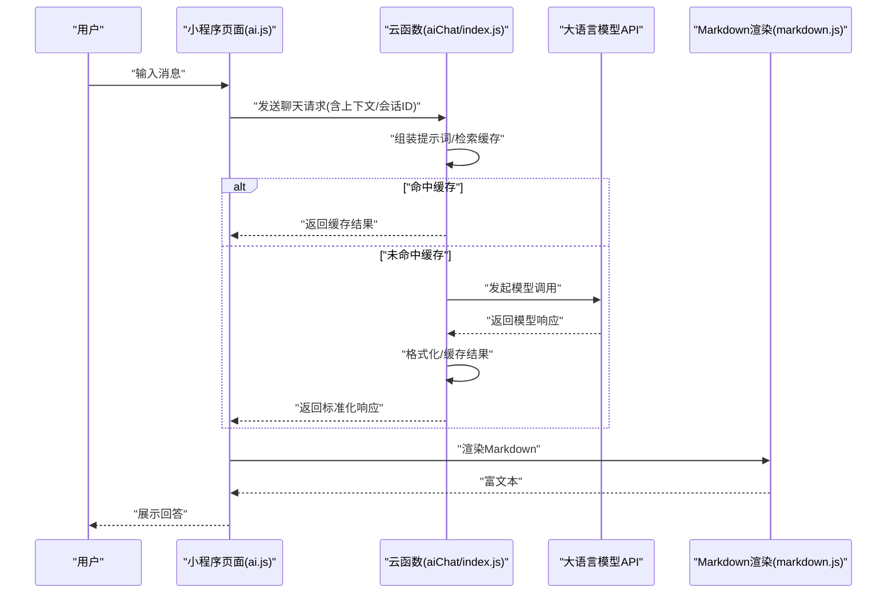
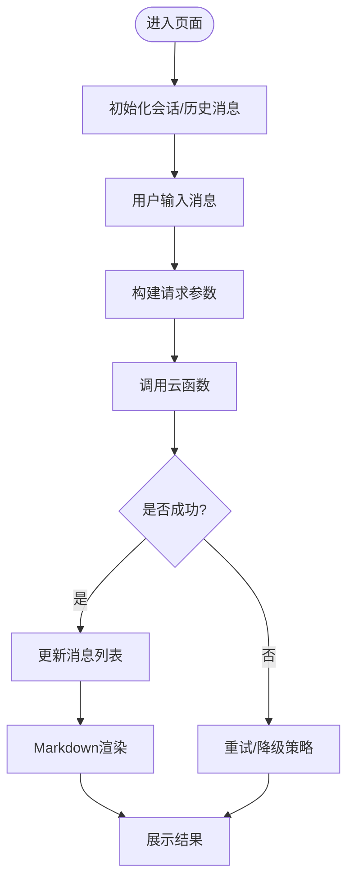
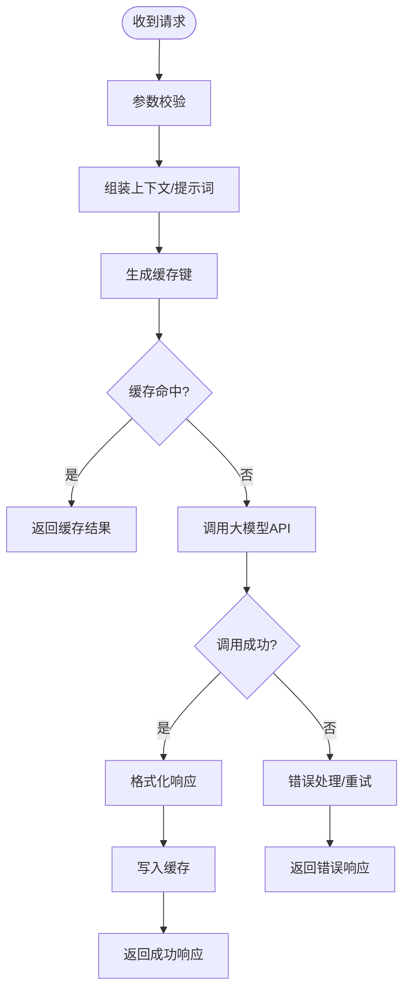
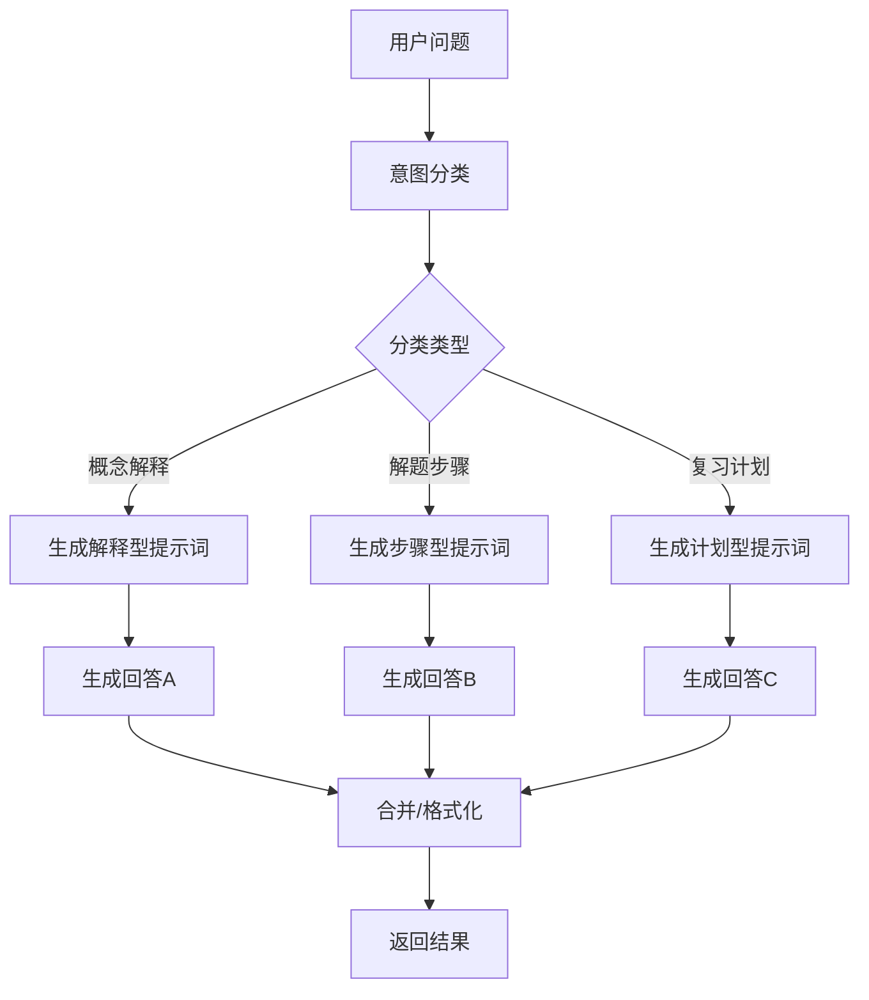
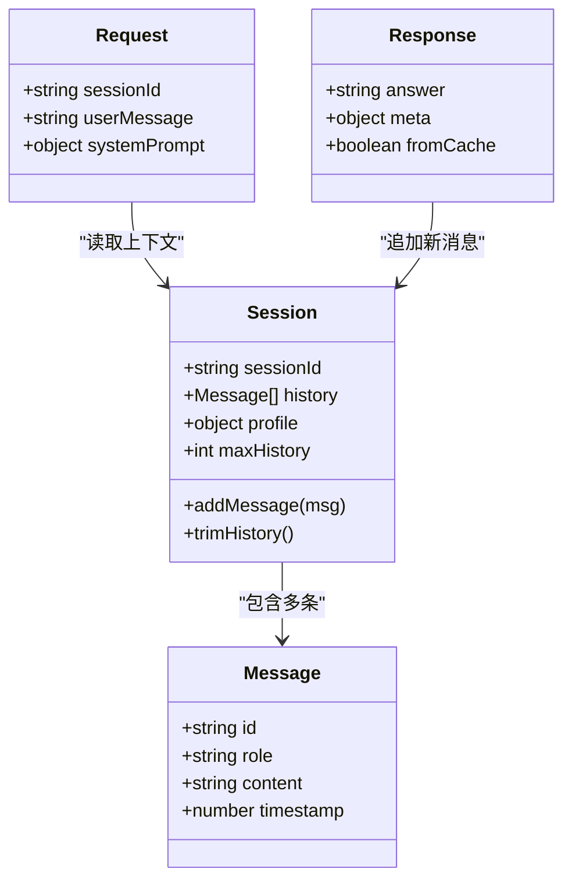
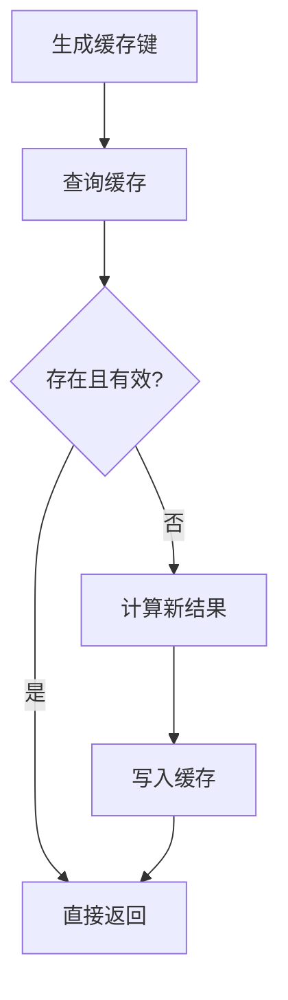
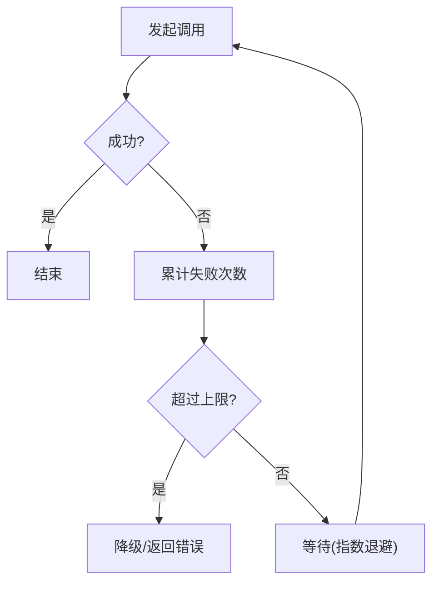
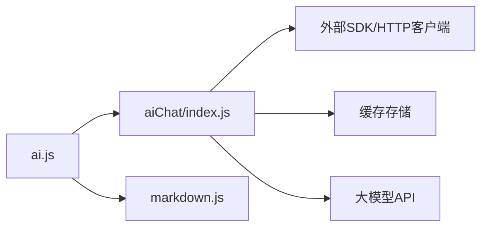

# AI智能助手

<cite>
**本文引用的文件**   
- [ai.js](file://miniprogram/pages/ai/ai.js)
- [ai.wxml](file://miniprogram/pages/ai/ai.wxml)
- [ai.wxss](file://miniprogram/pages/ai/ai.wxss)
- [ai.json](file://miniprogram/pages/ai/ai.json)
- [index.js](file://cloudfunctions/aiChat/index.js)
- [config.json](file://cloudfunctions/aiChat/config.json)
- [package.json](file://cloudfunctions/aiChat/package.json)
- [markdown.js](file://miniprogram/utils/markdown.js)
</cite>

## 目录
1. [简介](#简介)
2. [项目结构](#项目结构)
3. [核心组件](#核心组件)
4. [架构总览](#架构总览)
5. [详细组件分析](#详细组件分析)
6. [依赖分析](#依赖分析)
7. [性能考虑](#性能考虑)
8. [故障排查指南](#故障排查指南)
9. [结论](#结论)
10. [附录](#附录)

## 简介
本文件面向AI智能助手功能，系统性阐述以下方面：
- AI服务集成与云函数调用流程
- 对话管理与上下文维护策略
- 问题分类与学习建议生成机制
- 大语言模型API调用、消息格式处理、响应缓存
- 具体对话流实现、错误重试策略与性能优化技巧
- AI提示词工程指导与对话质量评估方法

## 项目结构
本项目为微信小程序+云开发架构。AI相关能力由前端页面与云端函数协同完成：
- 小程序端：负责用户交互、消息展示、本地状态与缓存、Markdown渲染等
- 云端函数：封装LLM API调用、提示词组装、上下文管理、结果缓存与返回

图表来源
- [ai.js](file://miniprogram/pages/ai/ai.js)
- [ai.wxml](file://miniprogram/pages/ai/ai.wxml)
- [ai.wxss](file://miniprogram/pages/ai/ai.wxss)
- [ai.json](file://miniprogram/pages/ai/ai.json)
- [index.js](file://cloudfunctions/aiChat/index.js)
- [config.json](file://cloudfunctions/aiChat/config.json)
- [package.json](file://cloudfunctions/aiChat/package.json)
- [markdown.js](file://miniprogram/utils/markdown.js)

章节来源
- [ai.js](file://miniprogram/pages/ai/ai.js)
- [ai.wxml](file://miniprogram/pages/ai/ai.wxml)
- [ai.wxss](file://miniprogram/pages/ai/ai.wxss)
- [ai.json](file://miniprogram/pages/ai/ai.json)
- [index.js](file://cloudfunctions/aiChat/index.js)
- [config.json](file://cloudfunctions/aiChat/config.json)
- [package.json](file://cloudfunctions/aiChat/package.json)
- [markdown.js](file://miniprogram/utils/markdown.js)

## 核心组件
- 小程序页面（ai）
  - 负责收集用户输入、维护会话列表、调用云函数、渲染结果
  - 使用Markdown工具将结构化文本渲染为富文本
- 云函数（aiChat）
  - 接收请求参数（如用户消息、会话ID、系统提示词等）
  - 组装提示词、调用大模型API、处理返回内容
  - 可选的缓存与重试逻辑，统一返回标准格式

章节来源
- [ai.js](file://miniprogram/pages/ai/ai.js)
- [index.js](file://cloudfunctions/aiChat/index.js)
- [markdown.js](file://miniprogram/utils/markdown.js)

## 架构总览
整体采用“前端轻量+云端智能”的分层设计：
- 前端仅做UI与状态管理，避免暴露敏感密钥
- 云端集中管理模型调用、提示词工程、缓存与限流

图表来源
- [ai.js](file://miniprogram/pages/ai/ai.js)
- [index.js](file://cloudfunctions/aiChat/index.js)
- [markdown.js](file://miniprogram/utils/markdown.js)

## 详细组件分析

### 小程序端：ai页面
职责
- 管理对话列表与当前会话上下文
- 处理用户输入、加载历史、分页与滚动
- 调用云函数并处理成功/失败分支
- 使用Markdown工具渲染结构化输出

关键流程
- 初始化会话与历史消息
- 发送消息时构建请求体（包含用户消息、会话标识、系统提示词等）
- 接收响应后更新UI，必要时触发缓存写入或失效
- 渲染Markdown内容

章节来源
- [ai.js](file://miniprogram/pages/ai/ai.js)
- [ai.wxml](file://miniprogram/pages/ai/ai.wxml)
- [ai.wxss](file://miniprogram/pages/ai/ai.wxss)
- [ai.json](file://miniprogram/pages/ai/ai.json)
- [markdown.js](file://miniprogram/utils/markdown.js)

### 云端函数：aiChat
职责
- 解析请求参数，校验必要字段
- 组合系统提示词与用户上下文
- 调用大模型API，处理流式或非流式响应
- 实现结果缓存与错误重试
- 返回统一JSON结构给前端

关键流程
- 参数校验与上下文拼装
- 缓存键生成与命中判断
- 模型调用与异常捕获
- 响应格式化与缓存写入
- 返回标准化数据

章节来源
- [index.js](file://cloudfunctions/aiChat/index.js)
- [config.json](file://cloudfunctions/aiChat/config.json)
- [package.json](file://cloudfunctions/aiChat/package.json)

### 问题分类与学习建议生成
目标
- 对用户问题进行意图识别与分类（如概念解释、解题步骤、复习计划等）
- 基于分类结果动态调整提示词，生成个性化学习建议

实现要点
- 在云端函数中根据会话上下文与用户画像选择分类器提示词
- 对分类结果进行二次校验与归一化
- 结合知识图谱或课程信息生成可执行的学习建议

章节来源
- [index.js](file://cloudfunctions/aiChat/index.js)

### 消息格式与上下文管理
- 消息格式
  - 前端发送：包含用户消息、会话ID、时间戳、可选的系统提示词
  - 云端返回：包含回答文本、元数据（如分类标签、来源）、缓存标记
- 上下文管理
  - 会话级上下文：按会话ID聚合最近N条消息
  - 全局上下文：用户画像、学习目标、偏好设置
  - 上下文裁剪：超长对话时保留摘要或滑动窗口

图表来源
- [ai.js](file://miniprogram/pages/ai/ai.js)
- [index.js](file://cloudfunctions/aiChat/index.js)

章节来源
- [ai.js](file://miniprogram/pages/ai/ai.js)
- [index.js](file://cloudfunctions/aiChat/index.js)

### 响应缓存机制
- 缓存键策略
  - 基于会话ID、用户消息哈希、系统提示词版本、模型参数等组合
- 缓存粒度
  - 会话级短缓存：用于快速重复问答
  - 全局热问缓存：跨会话共享高频答案
- 失效策略
  - 基于TTL过期
  - 提示词版本变更强制失效
  - 用户画像变化局部失效

章节来源
- [index.js](file://cloudfunctions/aiChat/index.js)

### 错误重试与降级策略
- 重试条件
  - 网络超时、临时性服务端错误、限流
- 退避策略
  - 指数退避+抖动，限制最大重试次数
- 降级方案
  - 切换备用模型或简化提示词
  - 返回离线预置答案或引导用户稍后再试

章节来源
- [index.js](file://cloudfunctions/aiChat/index.js)

## 依赖分析
- 前端依赖
  - 页面逻辑与视图绑定
  - Markdown渲染工具
- 云端依赖
  - 云函数运行时环境
  - 第三方SDK（如HTTP客户端、缓存存储）
  - 大模型API访问库

图表来源
- [ai.js](file://miniprogram/pages/ai/ai.js)
- [index.js](file://cloudfunctions/aiChat/index.js)
- [markdown.js](file://miniprogram/utils/markdown.js)

章节来源
- [ai.js](file://miniprogram/pages/ai/ai.js)
- [index.js](file://cloudfunctions/aiChat/index.js)
- [markdown.js](file://miniprogram/utils/markdown.js)

## 性能考虑
- 前端
  - 长列表虚拟滚动与分页加载
  - 图片与媒体资源懒加载
  - 减少不必要的重绘与布局抖动
- 云端
  - 合理设置缓存TTL与命中率监控
  - 批量请求合并与连接复用
  - 控制上下文长度，避免过长导致延迟与成本上升
- 传输
  - 压缩响应体
  - 使用CDN加速静态资源
  - 合理设置超时与重试阈值

[本节为通用性能建议，不直接分析具体文件]

## 故障排查指南
常见问题与定位思路
- 云函数调用失败
  - 检查网络连通性与鉴权配置
  - 查看错误码与日志，区分临时错误与业务错误
- 缓存未命中或脏数据
  - 核对缓存键生成规则与版本控制
  - 验证TTL与失效策略
- 渲染异常
  - 确认Markdown语法合法性
  - 检查前端渲染组件兼容性
- 上下文丢失
  - 核对会话ID传递与历史消息裁剪逻辑

章节来源
- [ai.js](file://miniprogram/pages/ai/ai.js)
- [index.js](file://cloudfunctions/aiChat/index.js)
- [markdown.js](file://miniprogram/utils/markdown.js)

## 结论
通过“前端轻量+云端智能”的架构，AI智能助手实现了稳定的对话体验与可扩展的智能能力。建议在后续迭代中持续完善：
- 更精细的上下文管理与记忆机制
- 更完善的缓存分层与一致性保障
- 更强的错误恢复与降级策略
- 更系统的提示词工程与质量评估体系

[本节为总结性内容，不直接分析具体文件]

## 附录

### AI提示词工程指导
- 角色设定
  - 明确助手身份、领域边界与语气风格
- 任务拆解
  - 将复杂问题拆分为子任务，逐步引导模型输出
- 约束与格式
  - 规定输出结构（如JSON、分点列表），便于前端解析与渲染
- 示例驱动
  - 提供少量高质量示例，稳定模型行为
- 安全与合规
  - 过滤敏感信息，避免泄露隐私与不当内容

[本节为方法论说明，不直接分析具体文件]

### 对话质量评估方法
- 自动化指标
  - 相关性、准确性、完整性、可读性
  - 响应时间与缓存命中率
- 人工评估
  - 专家打分与用户满意度调研
- 回归测试
  - 建立基准数据集，持续对比不同提示词与模型的效果
- 埋点与监控
  - 记录关键路径耗时、错误率与用户反馈

[本节为方法论说明，不直接分析具体文件]