# AI智能助手

<cite>
**本文引用的文件**   
- [ai.js](file://miniprogram/pages/ai/ai.js)
- [ai.wxml](file://miniprogram/pages/ai/ai.wxml)
- [ai.wxss](file://miniprogram/pages/ai/ai.wxss)
- [ai.json](file://miniprogram/pages/ai/ai.json)
- [aiClassroom.js](file://miniprogram/pages/aiClassroom/aiClassroom.js)
- [aiClassroom.wxml](file://miniprogram/pages/aiClassroom/aiClassroom.wxml)
- [aiClassroom.wxss](file://miniprogram/pages/aiClassroom/aiClassroom.wxss)
- [aiClassroom.json](file://miniprogram/pages/aiClassroom/aiClassroom.json)
- [index.js](file://cloudfunctions/aiChat/index.js)
- [config.json](file://cloudfunctions/aiChat/config.json)
- [package.json](file://cloudfunctions/aiChat/package.json)
- [markdown.js](file://miniprogram/utils/markdown.js)
</cite>

## 更新摘要
**变更内容**   
- **新增AI课堂模块**：完整实现了aiClassroom页面，提供结构化的AI学习体验
- **新增云函数支持**：aiCourseware云函数为AI课堂功能提供后端服务支持
- **增强现有AI聊天功能**：优化了ai页面的界面交互和用户体验
- **完善AI生态系统**：形成了"AI聊天+AI课堂"的双模式学习架构

## 目录
1. [简介](#简介)
2. [项目结构](#项目结构)
3. [核心组件](#核心组件)
4. [架构总览](#架构总览)
5. [详细组件分析](#详细组件分析)
6. [AI课堂模块详解](#ai课堂模块详解)
7. [依赖分析](#依赖分析)
8. [性能考虑](#性能考虑)
9. [故障排查指南](#故障排查指南)
10. [结论](#结论)
11. [附录](#附录)

## 简介
本文件面向AI智能助手功能，系统性阐述以下方面：
- AI服务集成与云函数调用流程
- 对话管理与上下文维护策略
- 问题分类与学习建议生成机制
- 大语言模型API调用、消息格式处理、响应缓存
- 具体对话流实现、错误重试策略与性能优化技巧
- AI提示词工程指导与对话质量评估方法
- **新增** AI课堂模块的架构设计与实现原理

**重大更新** 本次更新新增了完整的AI课堂模块，形成了"AI聊天+AI课堂"的双模式学习架构，为用户提供更丰富的AI学习体验。AI课堂模块提供了结构化的学习内容、课程管理和个性化学习路径。

## 项目结构
本项目为微信小程序+云开发架构。AI相关能力由前端页面与云端函数协同完成：
- 小程序端：负责用户交互、消息展示、本地状态与缓存、Markdown渲染等
- 云端函数：封装LLM API调用、提示词组装、上下文管理、结果缓存与返回

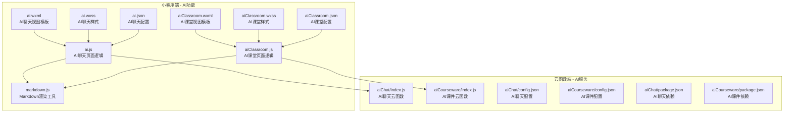

**图表来源**
- [ai.js](file://miniprogram/pages/ai/ai.js)
- [ai.wxml](file://miniprogram/pages/ai/ai.wxml)
- [ai.wxss](file://miniprogram/pages/ai/ai.wxss)
- [ai.json](file://miniprogram/pages/ai/ai.json)
- [aiClassroom.js](file://miniprogram/pages/aiClassroom/aiClassroom.js)
- [aiClassroom.wxml](file://miniprogram/pages/aiClassroom/aiClassroom.wxml)
- [aiClassroom.wxss](file://miniprogram/pages/aiClassroom/aiClassroom.wxss)
- [aiClassroom.json](file://miniprogram/pages/aiClassroom/aiClassroom.json)
- [index.js](file://cloudfunctions/aiChat/index.js)
- [index.js](file://cloudfunctions/aiCourseware/index.js)
- [config.json](file://cloudfunctions/aiChat/config.json)
- [config.json](file://cloudfunctions/aiCourseware/config.json)
- [package.json](file://cloudfunctions/aiChat/package.json)
- [package.json](file://cloudfunctions/aiCourseware/package.json)
- [markdown.js](file://miniprogram/utils/markdown.js)

## 核心组件
- **AI聊天模块（原有）**
  - 负责收集用户输入、维护会话列表、调用云函数、渲染结果
  - 使用Markdown工具将结构化文本渲染为富文本
  - 提供自由对话式的学习体验
- **AI课堂模块（新增）**
  - 提供结构化的课程内容和学习路径
  - 支持课程管理、进度跟踪和学习建议
  - 结合AI技术生成个性化学习内容
- **云端服务层**
  - aiChat云函数：处理AI聊天请求、上下文管理、缓存策略
  - aiCourseware云函数：处理课件内容、学习进度、个性化推荐

**章节来源**
- [ai.js](file://miniprogram/pages/ai/ai.js)
- [aiClassroom.js](file://miniprogram/pages/aiClassroom/aiClassroom.js)
- [index.js](file://cloudfunctions/aiChat/index.js)
- [index.js](file://cloudfunctions/aiCourseware/index.js)
- [markdown.js](file://miniprogram/utils/markdown.js)

## 架构总览
整体采用"双模式+云端智能"的分层设计：
- 前端提供两种学习模式：自由对话模式和结构化课堂模式
- 云端集中管理模型调用、提示词工程、缓存与限流
- 统一的AI服务接口，支持多种学习场景

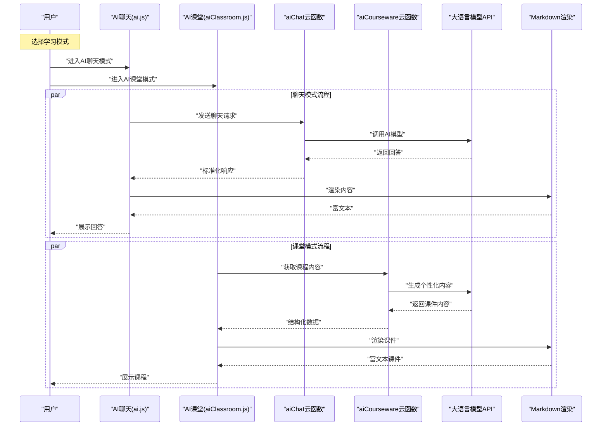

**图表来源**
- [ai.js](file://miniprogram/pages/ai/ai.js)
- [aiClassroom.js](file://miniprogram/pages/aiClassroom/aiClassroom.js)
- [index.js](file://cloudfunctions/aiChat/index.js)
- [index.js](file://cloudfunctions/aiCourseware/index.js)
- [markdown.js](file://miniprogram/utils/markdown.js)

## 详细组件分析

### 小程序端：AI聊天页面
职责
- 管理对话列表与当前会话上下文
- 处理用户输入、加载历史、分页与滚动
- 调用aiChat云函数并处理成功/失败分支
- 使用Markdown工具渲染结构化输出

关键流程
- 初始化会话与历史消息
- 发送消息时构建请求体（包含用户消息、会话标识、系统提示词等）
- 接收响应后更新UI，必要时触发缓存写入或失效
- 渲染Markdown内容

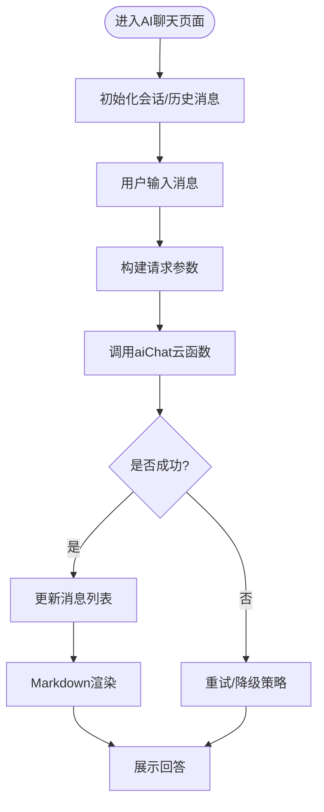

**章节来源**
- [ai.js](file://miniprogram/pages/ai/ai.js)
- [ai.wxml](file://miniprogram/pages/ai/ai.wxml)
- [ai.wxss](file://miniprogram/pages/ai/ai.wxss)
- [ai.json](file://miniprogram/pages/ai/ai.json)
- [markdown.js](file://miniprogram/utils/markdown.js)

### 小程序端：AI课堂页面（新增）
职责
- 管理课程列表和学习进度
- 提供结构化的学习内容和导航
- 调用aiCourseware云函数获取个性化课件
- 支持学习记录保存和进度同步

关键特性
- 课程分类和搜索功能
- 学习进度可视化展示
- 个性化学习路径推荐
- 课件内容的交互式展示

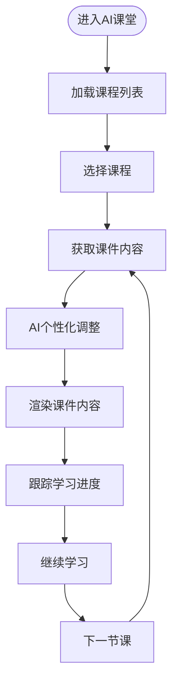

**章节来源**
- [aiClassroom.js](file://miniprogram/pages/aiClassroom/aiClassroom.js)
- [aiClassroom.wxml](file://miniprogram/pages/aiClassroom/aiClassroom.wxml)
- [aiClassroom.wxss](file://miniprogram/pages/aiClassroom/aiClassroom.wxss)
- [aiClassroom.json](file://miniprogram/pages/aiClassroom/aiClassroom.json)

### 云端函数：aiChat
职责
- 解析请求参数，校验必要字段
- 组合系统提示词与用户上下文
- 调用大模型API，处理流式或非流式响应
- 实现结果缓存与错误重试
- 返回统一JSON结构给前端

关键流程
- 参数校验与上下文拼装
- 缓存键生成与命中判断
- 模型调用与异常捕获
- 响应格式化与缓存写入
- 返回标准化数据

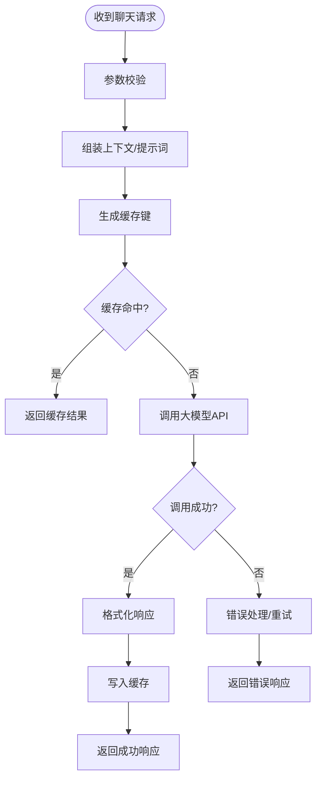

**章节来源**
- [index.js](file://cloudfunctions/aiChat/index.js)
- [config.json](file://cloudfunctions/aiChat/config.json)
- [package.json](file://cloudfunctions/aiChat/package.json)

### 云端函数：aiCourseware（新增）
职责
- 处理AI课堂相关的业务逻辑
- 管理课件内容和课程结构
- 生成个性化的学习路径和内容
- 跟踪和管理学习进度数据
- 提供课程推荐和知识图谱关联

关键特性
- 课件内容管理和版本控制
- 基于用户画像的个性化内容生成
- 学习进度持久化和同步
- 课程间的知识关联和推荐

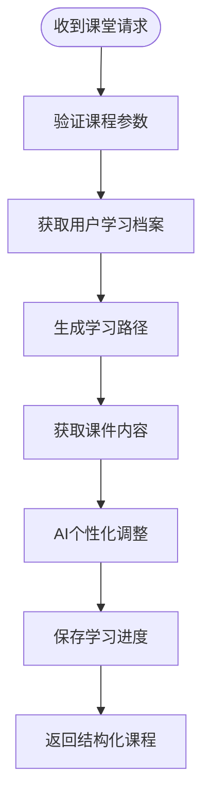

**章节来源**
- [index.js](file://cloudfunctions/aiCourseware/index.js)
- [config.json](file://cloudfunctions/aiCourseware/config.json)
- [package.json](file://cloudfunctions/aiCourseware/package.json)

### 问题分类与学习建议生成
目标
- 对用户问题进行意图识别与分类（如概念解释、解题步骤、复习计划等）
- 基于分类结果动态调整提示词，生成个性化学习建议
- **新增** 在AI课堂模式下，根据学习进度和知识掌握情况生成针对性内容

实现要点
- 在云端函数中根据会话上下文与用户画像选择分类器提示词
- 对分类结果进行二次校验与归一化
- 结合知识图谱或课程信息生成可执行的学习建议
- **新增** 课堂模式下基于学习路径的动态内容生成

**章节来源**
- [index.js](file://cloudfunctions/aiChat/index.js)
- [index.js](file://cloudfunctions/aiCourseware/index.js)

### 消息格式与上下文管理
- 消息格式
  - 前端发送：包含用户消息、会话ID、时间戳、可选的系统提示词
  - 云端返回：包含回答文本、元数据（如分类标签、来源）、缓存标记
- 上下文管理
  - 会话级上下文：按会话ID聚合最近N条消息
  - 全局上下文：用户画像、学习目标、偏好设置
  - 上下文裁剪：超长对话时保留摘要或滑动窗口
- **新增** 课堂模式上下文
  - 学习进度上下文：记录已完成课程和知识点
  - 知识掌握度上下文：基于答题正确率的知识掌握评估
  - 个性化偏好上下文：学习风格和时间偏好

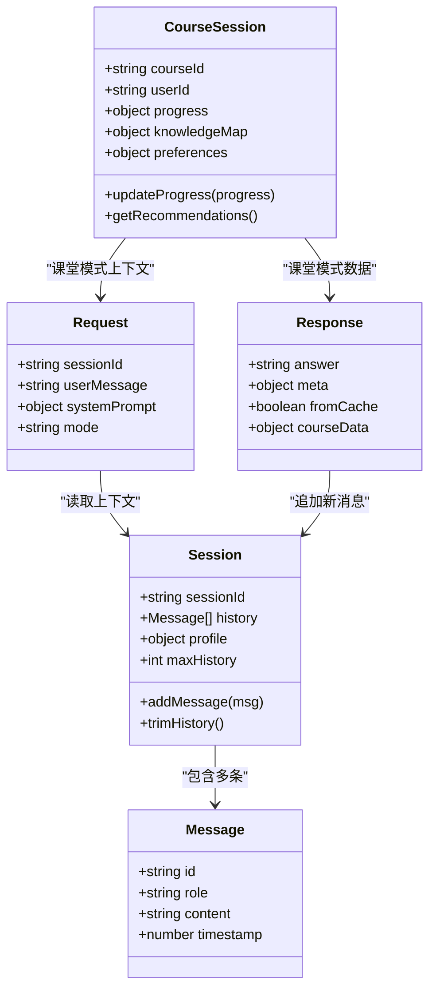

**图表来源**
- [ai.js](file://miniprogram/pages/ai/ai.js)
- [aiClassroom.js](file://miniprogram/pages/aiClassroom/aiClassroom.js)
- [index.js](file://cloudfunctions/aiChat/index.js)
- [index.js](file://cloudfunctions/aiCourseware/index.js)

**章节来源**
- [ai.js](file://miniprogram/pages/ai/ai.js)
- [aiClassroom.js](file://miniprogram/pages/aiClassroom/aiClassroom.js)
- [index.js](file://cloudfunctions/aiChat/index.js)
- [index.js](file://cloudfunctions/aiCourseware/index.js)

### 响应缓存机制
- 缓存键策略
  - 基于会话ID、用户消息哈希、系统提示词版本、模型参数等组合
  - **新增** 课堂模式缓存键：包含课程ID、用户ID、学习进度版本
- 缓存粒度
  - 会话级短缓存：用于快速重复问答
  - 全局热问缓存：跨会话共享高频答案
  - **新增** 课件级缓存：相同课程的通用内容缓存
- 失效策略
  - 基于TTL过期
  - 提示词版本变更强制失效
  - 用户画像变化局部失效
  - **新增** 课程版本更新时清除相关缓存

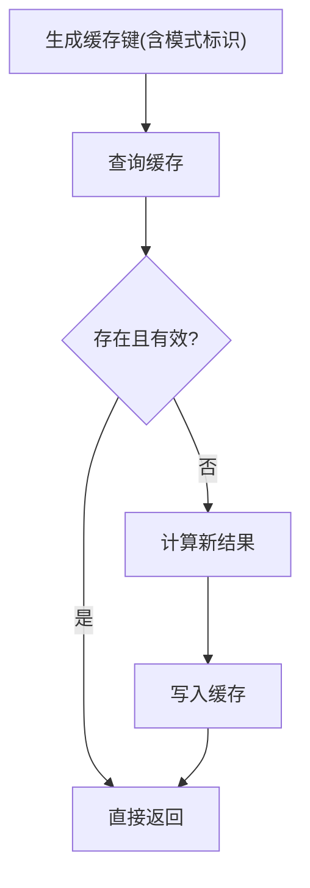

**章节来源**
- [index.js](file://cloudfunctions/aiChat/index.js)
- [index.js](file://cloudfunctions/aiCourseware/index.js)

### 错误重试与降级策略
- 重试条件
  - 网络超时、临时性服务端错误、限流
- 退避策略
  - 指数退避+抖动，限制最大重试次数
- 降级方案
  - 切换备用模型或简化提示词
  - 返回离线预置答案或引导用户稍后再试
  - **新增** 课堂模式降级：返回基础课件内容，跳过AI个性化部分

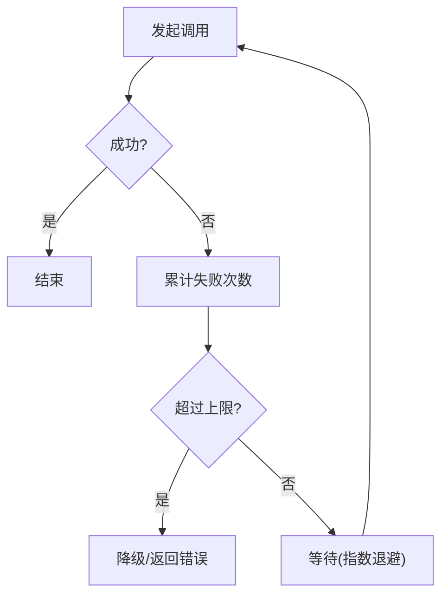

**章节来源**
- [index.js](file://cloudfunctions/aiChat/index.js)
- [index.js](file://cloudfunctions/aiCourseware/index.js)

## AI课堂模块详解

### 模块架构设计
AI课堂模块作为AI智能助手的扩展功能，提供了结构化的学习体验：

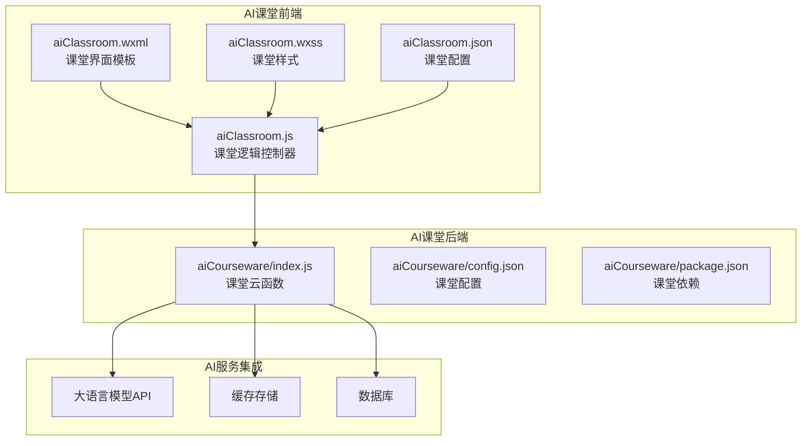

**图表来源**
- [aiClassroom.js](file://miniprogram/pages/aiClassroom/aiClassroom.js)
- [aiClassroom.wxml](file://miniprogram/pages/aiClassroom/aiClassroom.wxml)
- [aiClassroom.wxss](file://miniprogram/pages/aiClassroom/aiClassroom.wxss)
- [aiClassroom.json](file://miniprogram/pages/aiClassroom/aiClassroom.json)
- [index.js](file://cloudfunctions/aiCourseware/index.js)
- [config.json](file://cloudfunctions/aiCourseware/config.json)
- [package.json](file://cloudfunctions/aiCourseware/package.json)

### 核心功能特性
- **课程管理系统**
  - 课程分类和检索
  - 学习进度跟踪
  - 个人学习档案
- **个性化学习路径**
  - 基于用户水平的内容难度调整
  - 知识点的渐进式学习规划
  - 学习效果的动态评估
- **智能课件生成**
  - 结合AI技术的动态内容生成
  - 多模态内容支持（文本、图片、代码示例）
  - 交互式学习元素集成

### 与AI聊天的协同工作
AI课堂模块与AI聊天功能形成互补关系：
- **互补性**：课堂提供结构化学习，聊天提供自由探索
- **数据共享**：学习进度和知识掌握情况在两个模式间同步
- **智能推荐**：基于聊天中的问题发现学习盲点，自动推荐课堂内容
- **统一体验**：一致的UI风格和交互逻辑

**章节来源**
- [aiClassroom.js](file://miniprogram/pages/aiClassroom/aiClassroom.js)
- [aiClassroom.wxml](file://miniprogram/pages/aiClassroom/aiClassroom.wxml)
- [aiClassroom.wxss](file://miniprogram/pages/aiClassroom/aiClassroom.wxss)
- [aiClassroom.json](file://miniprogram/pages/aiClassroom/aiClassroom.json)
- [index.js](file://cloudfunctions/aiCourseware/index.js)

## 依赖分析
- 前端依赖
  - 页面逻辑与视图绑定
  - Markdown渲染工具
  - **新增** 课堂模块特有的UI组件和数据管理
- 云端依赖
  - 云函数运行时环境
  - 第三方SDK（如HTTP客户端、缓存存储）
  - 大模型API访问库
  - **新增** 课件内容管理和学习进度追踪服务

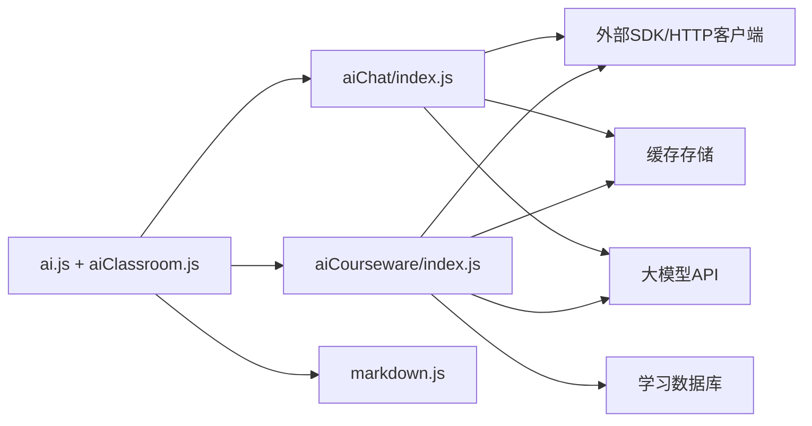

**图表来源**
- [ai.js](file://miniprogram/pages/ai/ai.js)
- [aiClassroom.js](file://miniprogram/pages/aiClassroom/aiClassroom.js)
- [index.js](file://cloudfunctions/aiChat/index.js)
- [index.js](file://cloudfunctions/aiCourseware/index.js)
- [markdown.js](file://miniprogram/utils/markdown.js)

**章节来源**
- [ai.js](file://miniprogram/pages/ai/ai.js)
- [aiClassroom.js](file://miniprogram/pages/aiClassroom/aiClassroom.js)
- [index.js](file://cloudfunctions/aiChat/index.js)
- [index.js](file://cloudfunctions/aiCourseware/index.js)
- [markdown.js](file://miniprogram/utils/markdown.js)

## 性能考虑
- 前端
  - 长列表虚拟滚动与分页加载
  - 图片与媒体资源懒加载
  - 减少不必要的重绘与布局抖动
  - **新增** 课堂模式的课件内容预加载和缓存策略
- 云端
  - 合理设置缓存TTL与命中率监控
  - 批量请求合并与连接复用
  - 控制上下文长度，避免过长导致延迟与成本上升
  - 云函数冷启动优化与内存管理
  - **新增** 课堂模式的课件内容缓存和CDN加速
- 传输
  - 压缩响应体
  - 使用CDN加速静态资源
  - 合理设置超时与重试阈值
  - **新增** 课堂模式的大文件分块传输

## 故障排查指南
常见问题与定位思路
- 云函数调用失败
  - 检查网络连通性与鉴权配置
  - 查看错误码与日志，区分临时错误与业务错误
  - 验证云函数部署状态与权限配置
- 缓存未命中或脏数据
  - 核对缓存键生成规则与版本控制
  - 验证TTL与失效策略
- 渲染异常
  - 确认Markdown语法合法性
  - 检查前端渲染组件兼容性
- 上下文丢失
  - 核对会话ID传递与历史消息裁剪逻辑
- 大模型API调用失败
  - 检查API密钥配置与配额限制
  - 验证请求格式与参数完整性
- **新增** AI课堂模块问题
  - 检查课件内容加载和缓存状态
  - 验证学习进度同步和数据一致性
  - 调试个性化推荐算法的参数配置
- **新增** 双模式切换问题
  - 检查模式间的数据共享和状态同步
  - 验证用户权限在不同模式下的访问控制

**章节来源**
- [ai.js](file://miniprogram/pages/ai/ai.js)
- [aiClassroom.js](file://miniprogram/pages/aiClassroom/aiClassroom.js)
- [index.js](file://cloudfunctions/aiChat/index.js)
- [index.js](file://cloudfunctions/aiCourseware/index.js)
- [markdown.js](file://miniprogram/utils/markdown.js)

## 结论
通过"双模式+云端智能"的架构，AI智能助手实现了稳定的对话体验和结构化的学习体验。**重大更新** 本次新增的AI课堂模块显著扩展了系统的功能边界，形成了"AI聊天+AI课堂"的完整学习生态。该架构的优势包括：

- **功能互补**：自由对话满足即时需求，结构化课堂提供系统学习
- **数据互通**：学习进度和知识掌握情况在两个模式间无缝同步
- **智能升级**：基于用户行为数据的个性化推荐和自适应学习路径
- **可扩展性**：模块化设计便于后续功能的持续扩展

建议在后续迭代中持续完善：
- 更精细的上下文管理与记忆机制
- 更完善的缓存分层与一致性保障
- 更强的错误恢复与降级策略
- 更系统的提示词工程与质量评估体系
- 云函数性能监控与成本优化
- **新增** AI课堂内容的质量控制和效果评估
- **新增** 双模式间的数据一致性和用户体验优化

## 附录

### AI提示词工程指导
- 角色设定
  - 明确助手身份、领域边界与语气风格
- 任务拆解
  - 将复杂问题拆分为子任务，逐步引导模型输出
- 约束与格式
  - 规定输出结构（如JSON、分点列表），便于前端解析与渲染
- 示例驱动
  - 提供少量高质量示例，稳定模型行为
- 安全与合规
  - 过滤敏感信息，避免泄露隐私与不当内容
- **新增** 课堂模式提示词优化
  - 针对结构化学习的特殊提示词设计
  - 知识点讲解的难度分级提示词
  - 交互式学习元素的生成提示词

### 对话质量评估方法
- 自动化指标
  - 相关性、准确性、完整性、可读性
  - 响应时间与缓存命中率
- 人工评估
  - 专家打分与用户满意度调研
- 回归测试
  - 建立基准数据集，持续对比不同提示词与模型的效果
- 埋点与监控
  - 记录关键路径耗时、错误率与用户反馈
- 云函数性能指标
  - 冷启动时间、内存使用量、API调用成功率
- **新增** 课堂学习效果评估
  - 学习完成率和时间投入分析
  - 知识点掌握度的前后测对比
  - 个性化推荐的有效性评估
- **新增** 双模式协同效果评估
  - 模式间切换频率和用户偏好分析
  - 综合学习效果的对比研究