# AI智能助手

<cite>
**本文引用的文件**   
- [aiClassroom.js](file://miniprogram/pages/aiClassroom/aiClassroom.js)
- [aiClassroom.wxml](file://miniprogram/pages/aiClassroom/aiClassroom.wxml)
- [aiClassroom.wxss](file://miniprogram/pages/aiClassroom/aiClassroom.wxss)
- [aiClassroom.json](file://miniprogram/pages/aiClassroom/aiClassroom.json)
- [aiHub.js](file://miniprogram/pages/aiHub/aiHub.js)
- [aiHub.wxml](file://miniprogram/pages/aiHub/aiHub.wxml)
- [aiHub.wxss](file://miniprogram/pages/aiHub/aiHub.wxss)
- [aiHub.json](file://miniprogram/pages/aiHub/aiHub.json)
- [knowledgeGraph.js](file://miniprogram/pages/knowledgeGraph/knowledgeGraph.js)
- [knowledgeGraph.wxml](file://miniprogram/pages/knowledgeGraph/knowledgeGraph.wxml)
- [knowledgeGraph.wxss](file://miniprogram/pages/knowledgeGraph/knowledgeGraph.wxss)
- [knowledgeGraph.json](file://miniprogram/pages/knowledgeGraph/knowledgeGraph.json)
- [index.js](file://cloudfunctions/aiChat/index.js)
- [config.json](file://cloudfunctions/aiChat/config.json)
- [package.json](file://cloudfunctions/aiChat/package.json)
- [index.js](file://cloudfunctions/aiCourseware/index.js)
- [config.json](file://cloudfunctions/aiCourseware/config.json)
- [package.json](file://cloudfunctions/aiCourseware/package.json)
- [markdown.js](file://miniprogram/utils/markdown.js)
</cite>

## 更新摘要
**变更内容**   
- **AI页面功能移除**：完全删除了小程序中的原始AI聊天页面（ai.js、ai.json、ai.wxml、ai.wxss共1532行代码）
- **架构重构**：AI功能已迁移至新的模块结构，包括AI课堂和AI Hub等替代方案
- **知识图谱集成**：新增了知识图谱功能作为AI能力的核心载体
- **云端服务保留**：保留了aiChat和aiCourseware云函数作为后端支持
- **文档架构调整**：重新组织文档结构以反映当前的AI功能分布

## 目录
1. [简介](#简介)
2. [项目结构](#项目结构)
3. [核心组件](#核心组件)
4. [架构总览](#架构总览)
5. [详细组件分析](#详细组件分析)
6. [AI课堂模块详解](#ai课堂模块详解)
7. [AI Hub功能](#ai-hub功能)
8. [知识图谱集成](#知识图谱集成)
9. [依赖分析](#依赖分析)
10. [性能考虑](#性能考虑)
11. [故障排查指南](#故障排查指南)
12. [结论](#结论)
13. [附录](#附录)

## 简介
本文件面向AI智能助手功能的当前架构状态，系统性阐述以下方面：
- AI功能从独立聊天页面向模块化架构的迁移过程
- AI课堂和AI Hub双模块的设计与实现
- 知识图谱作为AI能力载体的集成方案
- 云端AI服务的持续支持与优化
- 大语言模型API调用、消息格式处理、上下文管理和响应缓存机制
- 具体的对话流实现、错误重试策略与性能优化技巧
- AI提示词工程指导与对话质量评估方法

**重大更新** 本次更新反映了AI功能的重大架构调整：原始独立的AI聊天页面已被完全移除，AI能力现已整合到AI课堂、AI Hub和知识图谱等多个模块中，形成了更加结构化和功能丰富的AI学习生态系统。

## 项目结构
本项目为微信小程序+云开发架构。AI相关能力经过重构后由多个前端模块与云端函数协同完成：
- 小程序端：负责用户交互、消息展示、本地状态与缓存、Markdown渲染等
- 云端函数：封装LLM API调用、提示词组装、上下文管理、结果缓存与返回

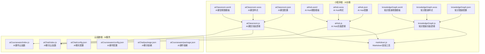

**图表来源**
- [aiClassroom.js](file://miniprogram/pages/aiClassroom/aiClassroom.js)
- [aiClassroom.wxml](file://miniprogram/pages/aiClassroom/aiClassroom.wxml)
- [aiClassroom.wxss](file://miniprogram/pages/aiClassroom/aiClassroom.wxss)
- [aiClassroom.json](file://miniprogram/pages/aiClassroom/aiClassroom.json)
- [aiHub.js](file://miniprogram/pages/aiHub/aiHub.js)
- [aiHub.wxml](file://miniprogram/pages/aiHub/aiHub.wxml)
- [aiHub.wxss](file://miniprogram/pages/aiHub/aiHub.wxss)
- [aiHub.json](file://miniprogram/pages/aiHub/aiHub.json)
- [knowledgeGraph.js](file://miniprogram/pages/knowledgeGraph/knowledgeGraph.js)
- [knowledgeGraph.wxml](file://miniprogram/pages/knowledgeGraph/knowledgeGraph.wxml)
- [knowledgeGraph.wxss](file://miniprogram/pages/knowledgeGraph/knowledgeGraph.wxss)
- [knowledgeGraph.json](file://miniprogram/pages/knowledgeGraph/knowledgeGraph.json)
- [index.js](file://cloudfunctions/aiChat/index.js)
- [index.js](file://cloudfunctions/aiCourseware/index.js)
- [config.json](file://cloudfunctions/aiChat/config.json)
- [config.json](file://cloudfunctions/aiCourseware/config.json)
- [package.json](file://cloudfunctions/aiChat/package.json)
- [package.json](file://cloudfunctions/aiCourseware/package.json)
- [markdown.js](file://miniprogram/utils/markdown.js)

## 核心组件
- **AI课堂模块（主要AI功能载体）**
  - 提供结构化的课程内容和学习路径
  - 支持课程管理、进度跟踪和学习建议
  - 结合AI技术生成个性化学习内容
  - 作为原AI聊天功能的主要替代方案
- **AI Hub模块（AI功能入口）**
  - 提供统一的AI功能入口和导航
  - 整合各种AI工具和资源
  - 支持多模态AI交互体验
- **知识图谱模块（AI能力可视化）**
  - 将AI生成的知识以图谱形式展示
  - 支持知识点关联和探索性学习
  - 提供可视化的学习路径规划
- **云端服务层**
  - aiChat云函数：处理AI聊天请求、上下文管理、缓存策略
  - aiCourseware云函数：处理课件内容、学习进度、个性化推荐

**章节来源**
- [aiClassroom.js](file://miniprogram/pages/aiClassroom/aiClassroom.js)
- [aiHub.js](file://miniprogram/pages/aiHub/aiHub.js)
- [knowledgeGraph.js](file://miniprogram/pages/knowledgeGraph/knowledgeGraph.js)
- [index.js](file://cloudfunctions/aiChat/index.js)
- [index.js](file://cloudfunctions/aiCourseware/index.js)
- [markdown.js](file://miniprogram/utils/markdown.js)

## 架构总览
整体采用"多模块+云端智能"的分层设计：
- 前端提供多种AI交互模式：结构化课堂模式、统一入口模式和知识图谱模式
- 云端集中管理模型调用、提示词工程、缓存与限流
- 统一的AI服务接口，支持多种学习场景

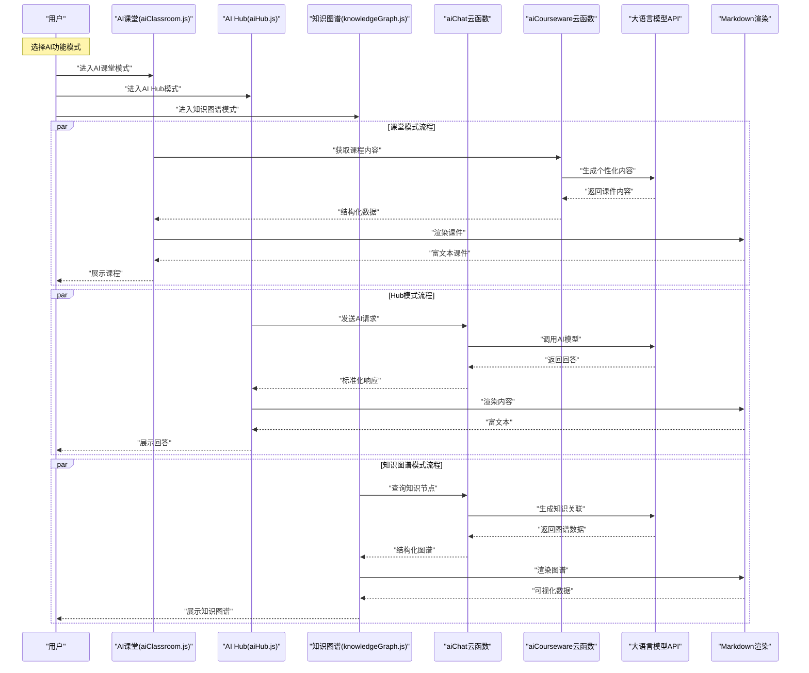

**图表来源**
- [aiClassroom.js](file://miniprogram/pages/aiClassroom/aiClassroom.js)
- [aiHub.js](file://miniprogram/pages/aiHub/aiHub.js)
- [knowledgeGraph.js](file://miniprogram/pages/knowledgeGraph/knowledgeGraph.js)
- [index.js](file://cloudfunctions/aiChat/index.js)
- [index.js](file://cloudfunctions/aiCourseware/index.js)
- [markdown.js](file://miniprogram/utils/markdown.js)

## 详细组件分析

### 小程序端：AI课堂页面（主要AI功能）
职责
- 管理课程列表和学习进度
- 提供结构化的学习内容和导航
- 调用aiCourseware云函数获取个性化课件
- 支持学习记录保存和进度同步
- 作为原AI聊天功能的主要替代方案

关键特性
- 课程分类和搜索功能
- 学习进度可视化展示
- 个性化学习路径推荐
- 课件内容的交互式展示

**章节来源**
- [aiClassroom.js](file://miniprogram/pages/aiClassroom/aiClassroom.js)
- [aiClassroom.wxml](file://miniprogram/pages/aiClassroom/aiClassroom.wxml)
- [aiClassroom.wxss](file://miniprogram/pages/aiClassroom/aiClassroom.wxss)
- [aiClassroom.json](file://miniprogram/pages/aiClassroom/aiClassroom.json)

### 小程序端：AI Hub页面（AI功能入口）
职责
- 提供统一的AI功能入口界面
- 整合各种AI工具和资源
- 支持多模态AI交互体验
- 管理AI会话历史和偏好设置

关键特性
- AI功能聚合和快速访问
- 多工具切换和统一管理
- 会话历史浏览和管理
- 个性化AI设置配置

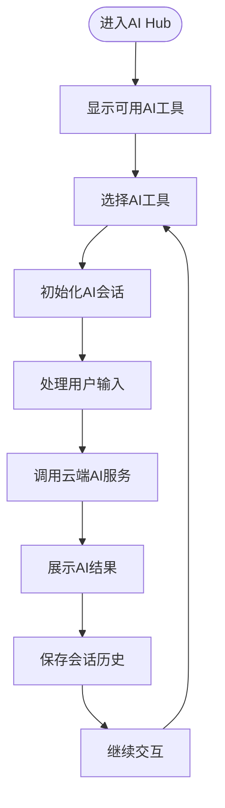

**章节来源**
- [aiHub.js](file://miniprogram/pages/aiHub/aiHub.js)
- [aiHub.wxml](file://miniprogram/pages/aiHub/aiHub.wxml)
- [aiHub.wxss](file://miniprogram/pages/aiHub/aiHub.wxss)
- [aiHub.json](file://miniprogram/pages/aiHub/aiHub.json)

### 小程序端：知识图谱页面（AI能力可视化）
职责
- 将AI生成的知识以图谱形式展示
- 支持知识点关联和探索性学习
- 提供可视化的学习路径规划
- 实现知识的交互式探索

关键特性
- 知识节点的可视化展示
- 知识点间的关联关系映射
- 交互式知识探索导航
- 学习路径的智能规划

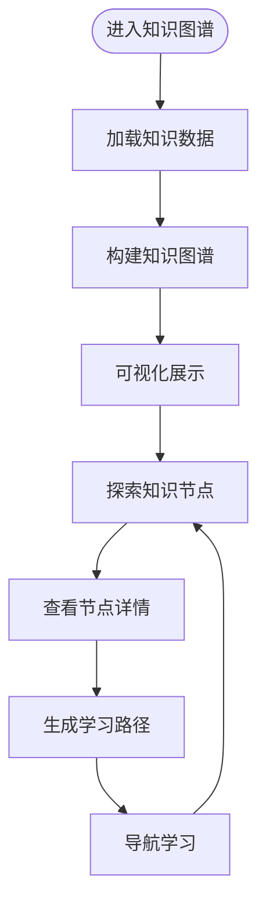

**章节来源**
- [knowledgeGraph.js](file://miniprogram/pages/knowledgeGraph/knowledgeGraph.js)
- [knowledgeGraph.wxml](file://miniprogram/pages/knowledgeGraph/knowledgeGraph.wxml)
- [knowledgeGraph.wxss](file://miniprogram/pages/knowledgeGraph/knowledgeGraph.wxss)
- [knowledgeGraph.json](file://miniprogram/pages/knowledgeGraph/knowledgeGraph.json)

### 云端函数：aiChat（保留的核心服务）
职责
- 解析请求参数，校验必要字段
- 组合系统提示词与用户上下文
- 调用大模型API，处理流式或非流式响应
- 实现结果缓存与错误重试
- 返回统一JSON结构给前端

关键流程
- 参数校验与上下文拼装
- 缓存键生成与命中判断
- 模型调用与异常捕获
- 响应格式化与缓存写入
- 返回标准化数据

**章节来源**
- [index.js](file://cloudfunctions/aiChat/index.js)
- [config.json](file://cloudfunctions/aiChat/config.json)
- [package.json](file://cloudfunctions/aiChat/package.json)

### 云端函数：aiCourseware（课件管理服务）
职责
- 处理AI课堂相关的业务逻辑
- 管理课件内容和课程结构
- 生成个性化的学习路径和内容
- 跟踪和管理学习进度数据
- 提供课程推荐和知识图谱关联

关键特性
- 课件内容管理和版本控制
- 基于用户画像的个性化内容生成
- 学习进度持久化和同步
- 课程间的知识关联和推荐

**章节来源**
- [index.js](file://cloudfunctions/aiCourseware/index.js)
- [config.json](file://cloudfunctions/aiCourseware/config.json)
- [package.json](file://cloudfunctions/aiCourseware/package.json)

### 问题分类与学习建议生成
目标
- 对用户问题进行意图识别与分类（如概念解释、解题步骤、复习计划等）
- 基于分类结果动态调整提示词，生成个性化学习建议
- 在AI课堂模式下，根据学习进度和知识掌握情况生成针对性内容

实现要点
- 在云端函数中根据会话上下文与用户画像选择分类器提示词
- 对分类结果进行二次校验与归一化
- 结合知识图谱或课程信息生成可执行的学习建议
- 课堂模式下基于学习路径的动态内容生成

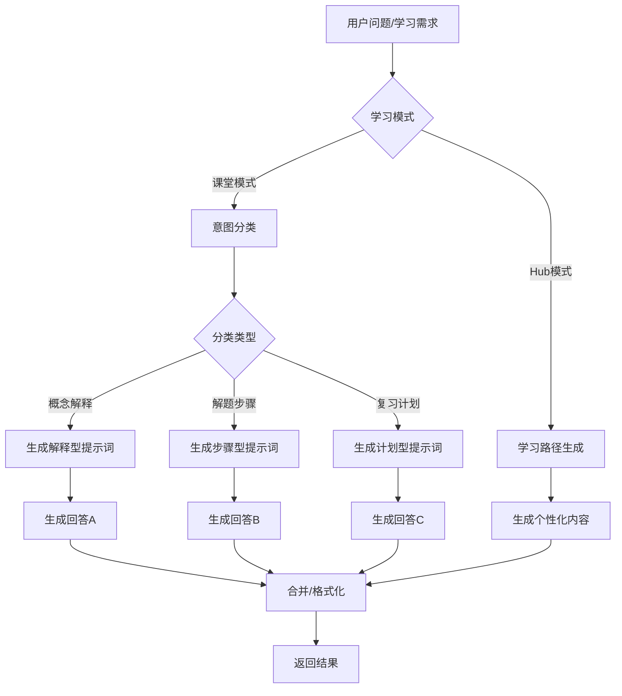

**章节来源**
- [index.js](file://cloudfunctions/aiChat/index.js)
- [index.js](file://cloudfunctions/aiCourseware/index.js)

### 消息格式与上下文管理
- 消息格式
  - 前端发送：包含用户消息、会话ID、时间戳、可选的系统提示词
  - 云端返回：包含回答文本、元数据（如分类标签、来源）、缓存标记
- 上下文管理
  - 会话级上下文：按会话ID聚合最近N条消息
  - 全局上下文：用户画像、学习目标、偏好设置
  - 上下文裁剪：超长对话时保留摘要或滑动窗口
- 课堂模式上下文
  - 学习进度上下文：记录已完成课程和知识点
  - 知识掌握度上下文：基于答题正确率的知识掌握评估
  - 个性化偏好上下文：学习风格和时间偏好

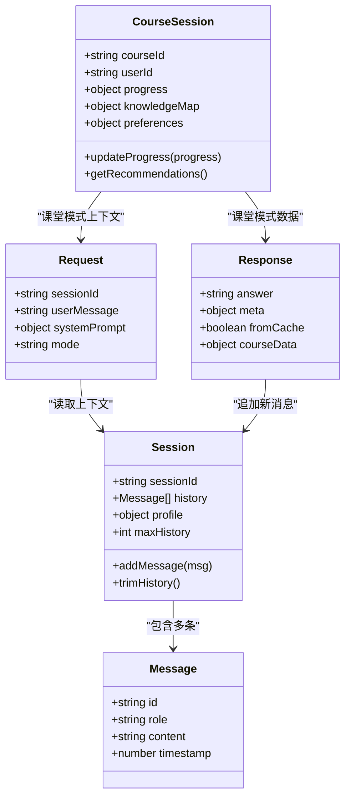

**图表来源**
- [aiClassroom.js](file://miniprogram/pages/aiClassroom/aiClassroom.js)
- [aiHub.js](file://miniprogram/pages/aiHub/aiHub.js)
- [knowledgeGraph.js](file://miniprogram/pages/knowledgeGraph/knowledgeGraph.js)
- [index.js](file://cloudfunctions/aiChat/index.js)
- [index.js](file://cloudfunctions/aiCourseware/index.js)

**章节来源**
- [aiClassroom.js](file://miniprogram/pages/aiClassroom/aiClassroom.js)
- [aiHub.js](file://miniprogram/pages/aiHub/aiHub.js)
- [knowledgeGraph.js](file://miniprogram/pages/knowledgeGraph/knowledgeGraph.js)
- [index.js](file://cloudfunctions/aiChat/index.js)
- [index.js](file://cloudfunctions/aiCourseware/index.js)

### 响应缓存机制
- 缓存键策略
  - 基于会话ID、用户消息哈希、系统提示词版本、模型参数等组合
  - 课堂模式缓存键：包含课程ID、用户ID、学习进度版本
- 缓存粒度
  - 会话级短缓存：用于快速重复问答
  - 全局热问缓存：跨会话共享高频答案
  - 课件级缓存：相同课程的通用内容缓存
- 失效策略
  - 基于TTL过期
  - 提示词版本变更强制失效
  - 用户画像变化局部失效
  - 课程版本更新时清除相关缓存

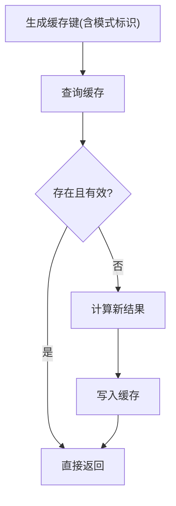

**章节来源**
- [index.js](file://cloudfunctions/aiChat/index.js)
- [index.js](file://cloudfunctions/aiCourseware/index.js)

### 错误重试与降级策略
- 重试条件
  - 网络超时、临时性服务端错误、限流
- 退避策略
  - 指数退避+抖动，限制最大重试次数
- 降级方案
  - 切换备用模型或简化提示词
  - 返回离线预置答案或引导用户稍后再试
  - 课堂模式降级：返回基础课件内容，跳过AI个性化部分

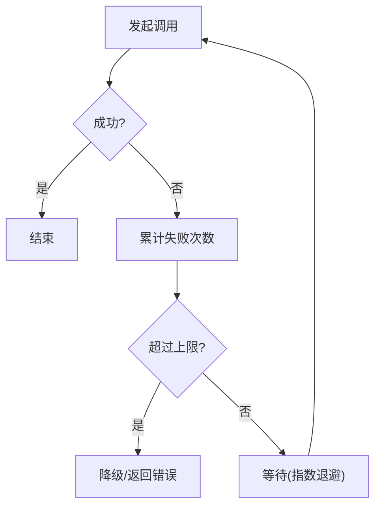

**章节来源**
- [index.js](file://cloudfunctions/aiChat/index.js)
- [index.js](file://cloudfunctions/aiCourseware/index.js)

## AI课堂模块详解

### 模块架构设计
AI课堂模块作为AI智能助手的主要功能载体，提供了结构化的学习体验：

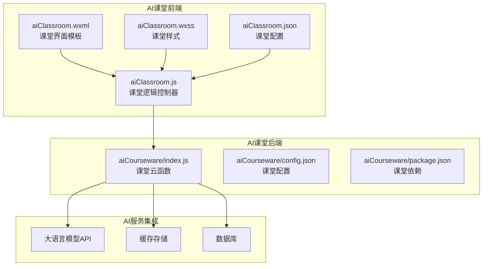

**图表来源**
- [aiClassroom.js](file://miniprogram/pages/aiClassroom/aiClassroom.js)
- [aiClassroom.wxml](file://miniprogram/pages/aiClassroom/aiClassroom.wxml)
- [aiClassroom.wxss](file://miniprogram/pages/aiClassroom/aiClassroom.wxss)
- [aiClassroom.json](file://miniprogram/pages/aiClassroom/aiClassroom.json)
- [index.js](file://cloudfunctions/aiCourseware/index.js)
- [config.json](file://cloudfunctions/aiCourseware/config.json)
- [package.json](file://cloudfunctions/aiCourseware/package.json)

### 核心功能特性
- **课程管理系统**
  - 课程分类和检索
  - 学习进度跟踪
  - 个人学习档案
- **个性化学习路径**
  - 基于用户水平的内容难度调整
  - 知识点的渐进式学习规划
  - 学习效果的动态评估
- **智能课件生成**
  - 结合AI技术的动态内容生成
  - 多模态内容支持（文本、图片、代码示例）
  - 交互式学习元素集成

## AI Hub功能

### 功能定位与设计
AI Hub作为AI功能的统一入口，提供了便捷的AI工具访问和管理：

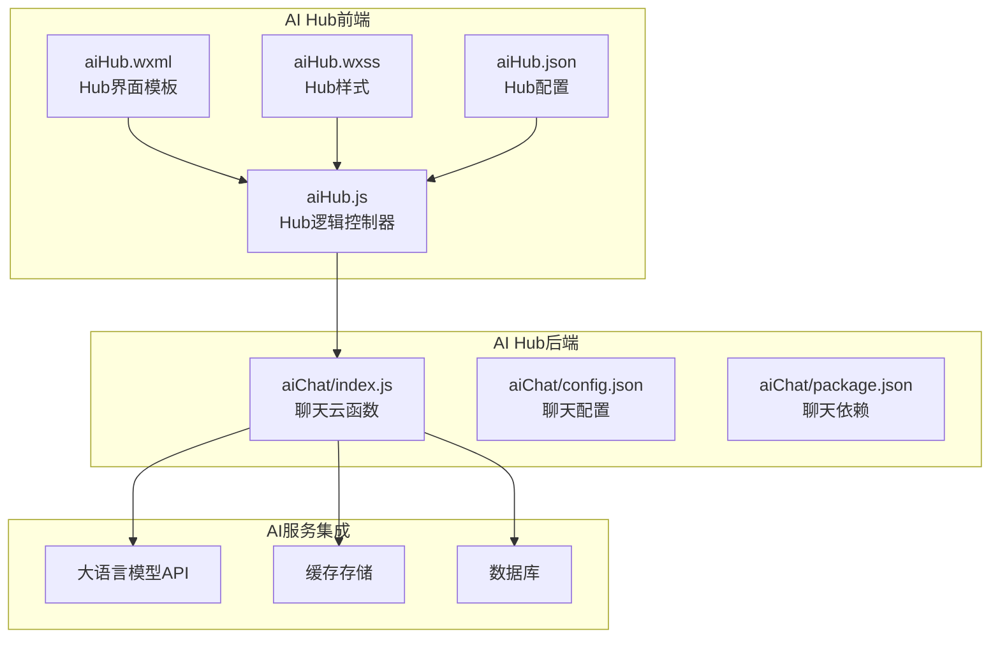

**图表来源**
- [aiHub.js](file://miniprogram/pages/aiHub/aiHub.js)
- [aiHub.wxml](file://miniprogram/pages/aiHub/aiHub.wxml)
- [aiHub.wxss](file://miniprogram/pages/aiHub/aiHub.wxss)
- [aiHub.json](file://miniprogram/pages/aiHub/aiHub.json)
- [index.js](file://cloudfunctions/aiChat/index.js)
- [config.json](file://cloudfunctions/aiChat/config.json)
- [package.json](file://cloudfunctions/aiChat/package.json)

### 核心功能特性
- **统一入口管理**
  - AI工具聚合和快速访问
  - 多模态交互支持
  - 会话历史统一管理
- **智能工具调度**
  - 基于用户需求的工具推荐
  - 多工具协作工作流
  - 任务自动分解和执行
- **用户体验优化**
  - 直观的界面设计
  - 流畅的交互流程
  - 个性化的设置管理

## 知识图谱集成

### 知识图谱架构
知识图谱作为AI能力的可视化载体，实现了知识的结构化展示和探索：

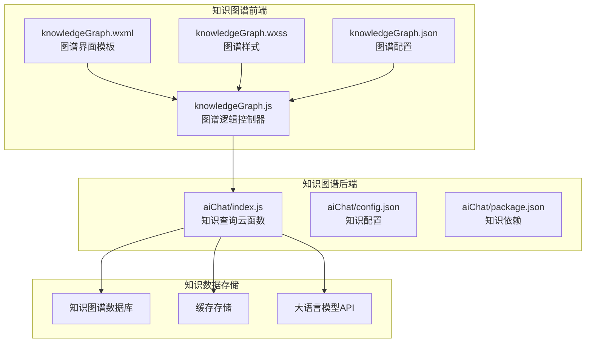

**图表来源**
- [knowledgeGraph.js](file://miniprogram/pages/knowledgeGraph/knowledgeGraph.js)
- [knowledgeGraph.wxml](file://miniprogram/pages/knowledgeGraph/knowledgeGraph.wxml)
- [knowledgeGraph.wxss](file://miniprogram/pages/knowledgeGraph/knowledgeGraph.wxss)
- [knowledgeGraph.json](file://miniprogram/pages/knowledgeGraph/knowledgeGraph.json)
- [index.js](file://cloudfunctions/aiChat/index.js)
- [config.json](file://cloudfunctions/aiChat/config.json)
- [package.json](file://cloudfunctions/aiChat/package.json)

### 核心功能特性
- **知识可视化展示**
  - 节点关系的图形化呈现
  - 交互式知识探索
  - 动态知识关联发现
- **智能学习路径**
  - 基于知识图谱的学习规划
  - 个性化学习路径推荐
  - 知识点掌握度评估
- **探索性学习支持**
  - 自由探索的知识导航
  - 关联知识的智能推荐
  - 学习进度的可视化跟踪

## 依赖分析
- 前端依赖
  - 页面逻辑与视图绑定
  - Markdown渲染工具
  - 各AI模块特有的UI组件和数据管理
- 云端依赖
  - 云函数运行时环境
  - 第三方SDK（如HTTP客户端、缓存存储）
  - 大模型API访问库
  - 课件内容管理和学习进度追踪服务

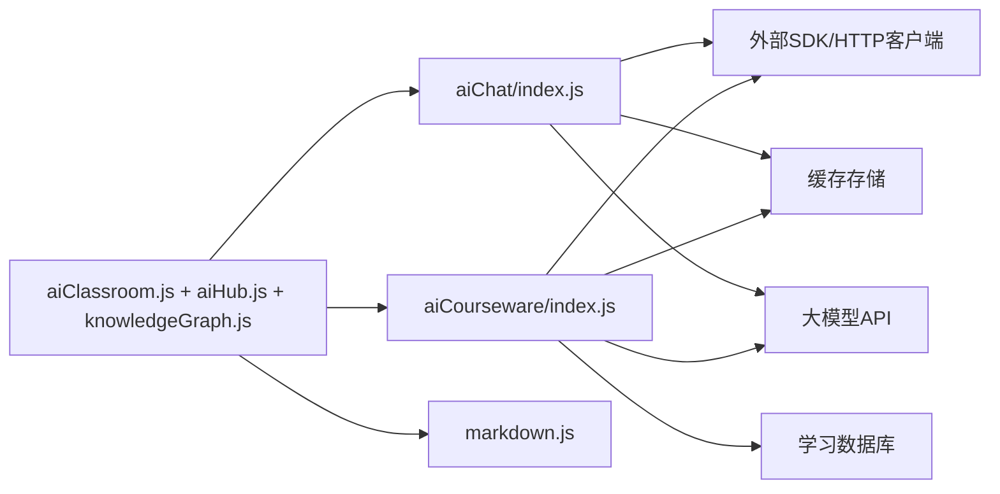

**图表来源**
- [aiClassroom.js](file://miniprogram/pages/aiClassroom/aiClassroom.js)
- [aiHub.js](file://miniprogram/pages/aiHub/aiHub.js)
- [knowledgeGraph.js](file://miniprogram/pages/knowledgeGraph/knowledgeGraph.js)
- [index.js](file://cloudfunctions/aiChat/index.js)
- [index.js](file://cloudfunctions/aiCourseware/index.js)
- [markdown.js](file://miniprogram/utils/markdown.js)

**章节来源**
- [aiClassroom.js](file://miniprogram/pages/aiClassroom/aiClassroom.js)
- [aiHub.js](file://miniprogram/pages/aiHub/aiHub.js)
- [knowledgeGraph.js](file://miniprogram/pages/knowledgeGraph/knowledgeGraph.js)
- [index.js](file://cloudfunctions/aiChat/index.js)
- [index.js](file://cloudfunctions/aiCourseware/index.js)
- [markdown.js](file://miniprogram/utils/markdown.js)

## 性能考虑
- 前端
  - 长列表虚拟滚动与分页加载
  - 图片与媒体资源懒加载
  - 减少不必要的重绘与布局抖动
  - 各AI模块的内容预加载和缓存策略
- 云端
  - 合理设置缓存TTL与命中率监控
  - 批量请求合并与连接复用
  - 控制上下文长度，避免过长导致延迟与成本上升
  - 云函数冷启动优化与内存管理
  - 课件内容的缓存和CDN加速
- 传输
  - 压缩响应体
  - 使用CDN加速静态资源
  - 合理设置超时与重试阈值
  - 大文件的分块传输

## 故障排查指南
常见问题与定位思路
- 云函数调用失败
  - 检查网络连通性与鉴权配置
  - 查看错误码与日志，区分临时错误与业务错误
  - 验证云函数部署状态与权限配置
- 缓存未命中或脏数据
  - 核对缓存键生成规则与版本控制
  - 验证TTL与失效策略
- 渲染异常
  - 确认Markdown语法合法性
  - 检查前端渲染组件兼容性
- 上下文丢失
  - 核对会话ID传递与历史消息裁剪逻辑
- 大模型API调用失败
  - 检查API密钥配置与配额限制
  - 验证请求格式与参数完整性
- AI课堂模块问题
  - 检查课件内容加载和缓存状态
  - 验证学习进度同步和数据一致性
  - 调试个性化推荐算法的参数配置
- AI Hub功能问题
  - 检查工具调度和会话管理
  - 验证多模态交互的兼容性
  - 调试工具间的数据流转
- 知识图谱模块问题
  - 检查图谱数据的完整性和准确性
  - 验证知识关联的计算逻辑
  - 调试可视化渲染的性能问题
- 模块间协同问题
  - 检查各AI模块间的数据共享和状态同步
  - 验证用户权限在不同模块下的访问控制
  - 调试模块切换时的用户体验问题

**章节来源**
- [aiClassroom.js](file://miniprogram/pages/aiClassroom/aiClassroom.js)
- [aiHub.js](file://miniprogram/pages/aiHub/aiHub.js)
- [knowledgeGraph.js](file://miniprogram/pages/knowledgeGraph/knowledgeGraph.js)
- [index.js](file://cloudfunctions/aiChat/index.js)
- [index.js](file://cloudfunctions/aiCourseware/index.js)
- [markdown.js](file://miniprogram/utils/markdown.js)

## 结论
通过"多模块+云端智能"的架构，AI智能助手实现了从单一聊天功能向综合性AI学习生态系统的转型。**重大更新** 本次架构调整将原有的独立AI聊天功能重新组织为AI课堂、AI Hub和知识图谱三个核心模块，形成了更加结构化和功能丰富的AI学习体系。该架构的优势包括：

- **功能专业化**：每个模块专注于特定的AI学习场景，提供更专业的用户体验
- **架构清晰化**：模块化的设计便于维护和扩展，降低了系统复杂度
- **数据互通化**：各模块间的数据共享和状态同步，形成完整的用户学习画像
- **智能升级**：基于用户行为数据的个性化推荐和自适应学习路径
- **可扩展性**：模块化设计便于后续功能的持续扩展
- **体验优化**：针对不同学习场景的专门优化，提升整体用户体验

建议在后续迭代中持续完善：
- 更精细的上下文管理与记忆机制
- 更完善的缓存分层与一致性保障
- 更强的错误恢复与降级策略
- 更系统的提示词工程与质量评估体系
- 云函数性能监控与成本优化
- AI课堂内容的质量控制和效果评估
- 多模块间的数据一致性和用户体验优化
- 知识图谱的深度挖掘和智能推荐
- AI Hub的工具生态建设和第三方集成

## 附录

### AI提示词工程指导
- 角色设定
  - 明确助手身份、领域边界与语气风格
- 任务拆解
  - 将复杂问题拆分为子任务，逐步引导模型输出
- 约束与格式
  - 规定输出结构（如JSON、分点列表），便于前端解析与渲染
- 示例驱动
  - 提供少量高质量示例，稳定模型行为
- 安全与合规
  - 过滤敏感信息，避免泄露隐私与不当内容
- 课堂模式提示词优化
  - 针对结构化学习的特殊提示词设计
  - 知识点讲解的难度分级提示词
  - 交互式学习元素的生成提示词
- Hub模式提示词优化
  - 多工具协作的提示词协调
  - 任务分解和执行的提示词设计
- 知识图谱提示词优化
  - 知识关联发现的提示词设计
  - 图谱结构的生成和优化提示词

### 对话质量评估方法
- 自动化指标
  - 相关性、准确性、完整性、可读性
  - 响应时间与缓存命中率
- 人工评估
  - 专家打分与用户满意度调研
- 回归测试
  - 建立基准数据集，持续对比不同提示词与模型的效果
- 埋点与监控
  - 记录关键路径耗时、错误率与用户反馈
- 云函数性能指标
  - 冷启动时间、内存使用量、API调用成功率
- AI课堂学习效果评估
  - 学习完成率和时间投入分析
  - 知识点掌握度的前后测对比
  - 个性化推荐的有效性评估
- 多模块协同效果评估
  - 模块间切换频率和用户偏好分析
  - 综合学习效果的对比研究
- 知识图谱学习效果评估
  - 知识探索深度和学习路径合理性
  - 知识关联理解度和迁移应用能力
- AI Hub使用效率评估
  - 工具使用频率和任务完成效率
  - 多工具协作的用户接受度