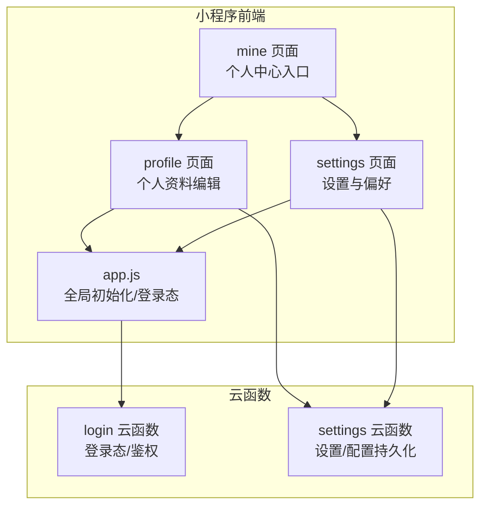
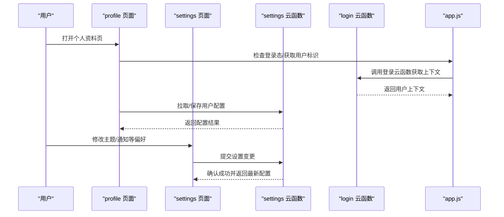
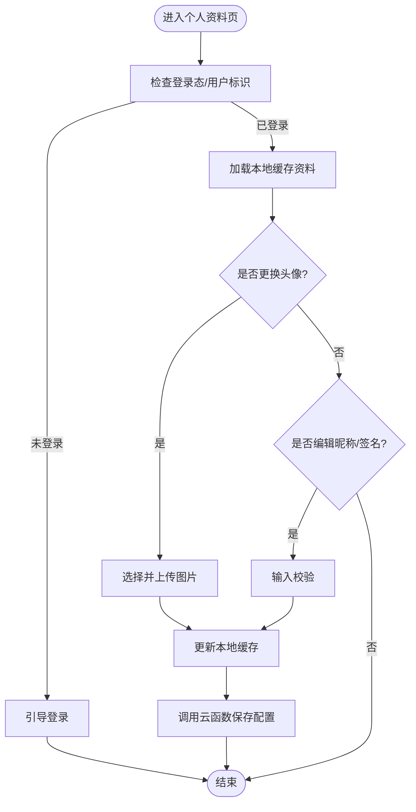
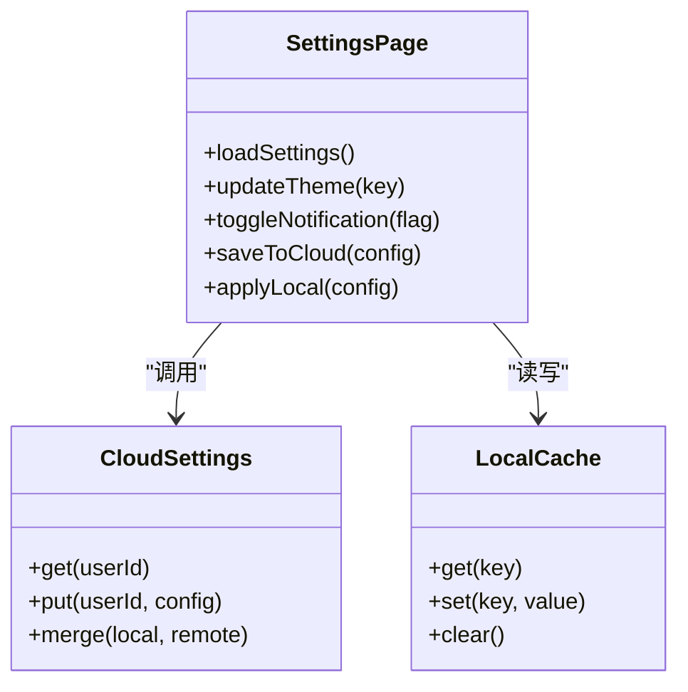
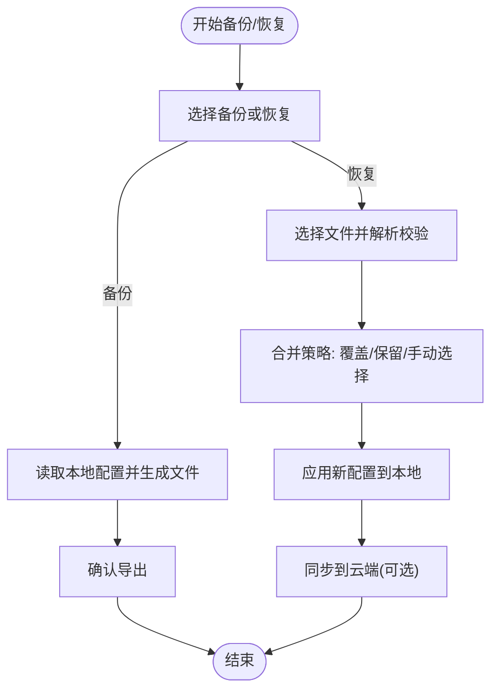
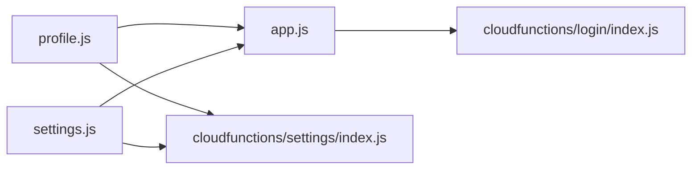

# 个人中心

<cite>
**本文引用的文件**   
- [miniprogram/pages/mine/mine.js](file://miniprogram/pages/mine/mine.js)
- [miniprogram/pages/mine/mine.wxml](file://miniprogram/pages/mine/mine.wxml)
- [miniprogram/pages/profile/profile.js](file://miniprogram/pages/profile/profile.js)
- [miniprogram/pages/profile/profile.wxml](file://miniprogram/pages/profile/profile.wxml)
- [miniprogram/pages/settings/settings.js](file://miniprogram/pages/settings/settings.js)
- [miniprogram/pages/settings/settings.wxml](file://miniprogram/pages/settings/settings.wxml)
- [cloudfunctions/settings/index.js](file://cloudfunctions/settings/index.js)
- [cloudfunctions/login/index.js](file://cloudfunctions/login/index.js)
- [miniprogram/app.js](file://miniprogram/app.js)
</cite>

## 目录
1. [简介](#简介)
2. [项目结构](#项目结构)
3. [核心组件](#核心组件)
4. [架构总览](#架构总览)
5. [详细组件分析](#详细组件分析)
6. [依赖分析](#依赖分析)
7. [性能考虑](#性能考虑)
8. [故障排查指南](#故障排查指南)
9. [结论](#结论)
10. [附录](#附录)

## 简介
本文件围绕“个人中心”能力，系统性梳理用户信息管理、设置偏好、数据同步与隐私保护等关键实现。重点覆盖：
- 用户资料编辑（头像、昵称、签名等）
- 主题切换与通知设置
- 本地缓存策略与云端同步逻辑
- 数据备份与恢复机制
- 个性化设置扩展点与隐私安全控制方案

## 项目结构
个人中心相关的前端页面位于小程序 pages 目录，云端配置与同步逻辑位于 cloudfunctions 目录。整体采用“前端页面 + 云函数”的解耦模式：
- 前端负责展示与交互、本地缓存与状态管理
- 云端负责持久化存储、跨设备同步与权限校验

图表来源
- [miniprogram/pages/mine/mine.js](file://miniprogram/pages/mine/mine.js)
- [miniprogram/pages/profile/profile.js](file://miniprogram/pages/profile/profile.js)
- [miniprogram/pages/settings/settings.js](file://miniprogram/pages/settings/settings.js)
- [miniprogram/app.js](file://miniprogram/app.js)
- [cloudfunctions/login/index.js](file://cloudfunctions/login/index.js)
- [cloudfunctions/settings/index.js](file://cloudfunctions/settings/index.js)

章节来源
- [miniprogram/pages/mine/mine.js](file://miniprogram/pages/mine/mine.js)
- [miniprogram/pages/profile/profile.js](file://miniprogram/pages/profile/profile.js)
- [miniprogram/pages/settings/settings.js](file://miniprogram/pages/settings/settings.js)
- [miniprogram/app.js](file://miniprogram/app.js)
- [cloudfunctions/login/index.js](file://cloudfunctions/login/index.js)
- [cloudfunctions/settings/index.js](file://cloudfunctions/settings/index.js)

## 核心组件
- 个人中心入口（mine）
  - 聚合跳转至“个人资料”和“设置”等子功能
  - 维护基础用户信息展示与快捷操作
- 个人资料（profile）
  - 支持头像上传、昵称/签名编辑
  - 触发本地缓存更新与云端同步
- 设置（settings）
  - 主题切换、通知开关、语言/字体等偏好
  - 数据备份与恢复入口
- 云函数（settings/login）
  - settings：读写用户配置、版本与冲突处理
  - login：登录态获取与鉴权上下文

章节来源
- [miniprogram/pages/mine/mine.js](file://miniprogram/pages/mine/mine.js)
- [miniprogram/pages/profile/profile.js](file://miniprogram/pages/profile/profile.js)
- [miniprogram/pages/settings/settings.js](file://miniprogram/pages/settings/settings.js)
- [cloudfunctions/settings/index.js](file://cloudfunctions/settings/index.js)
- [cloudfunctions/login/index.js](file://cloudfunctions/login/index.js)

## 架构总览
个人中心采用“前端页面 + 云函数”的分层架构。前端通过 wx.cloud 调用云函数完成配置的持久化与同步；同时使用本地存储进行快速读取与离线可用。

图表来源
- [miniprogram/pages/profile/profile.js](file://miniprogram/pages/profile/profile.js)
- [miniprogram/pages/settings/settings.js](file://miniprogram/pages/settings/settings.js)
- [miniprogram/app.js](file://miniprogram/app.js)
- [cloudfunctions/login/index.js](file://cloudfunctions/login/index.js)
- [cloudfunctions/settings/index.js](file://cloudfunctions/settings/index.js)

## 详细组件分析

### 用户信息管理（个人资料）
- 功能要点
  - 头像上传：选择图片 -> 压缩/裁剪（可选）-> 上传到云存储 -> 更新本地缓存 -> 同步云端
  - 昵称/签名编辑：输入校验 -> 写入本地缓存 -> 异步同步云端
  - 错误处理：网络异常、权限拒绝、格式不合法等
- 数据流
  - 本地优先：先写本地缓存保证即时反馈
  - 云端兜底：后台任务或事件驱动同步，失败重试
- 关键路径参考
  - 页面逻辑与模板：[miniprogram/pages/profile/profile.js](file://miniprogram/pages/profile/profile.js)、[miniprogram/pages/profile/profile.wxml](file://miniprogram/pages/profile/profile.wxml)
  - 登录态与用户标识：[miniprogram/app.js](file://miniprogram/app.js)、[cloudfunctions/login/index.js](file://cloudfunctions/login/index.js)

图表来源
- [miniprogram/pages/profile/profile.js](file://miniprogram/pages/profile/profile.js)
- [miniprogram/pages/profile/profile.wxml](file://miniprogram/pages/profile/profile.wxml)
- [miniprogram/app.js](file://miniprogram/app.js)
- [cloudfunctions/login/index.js](file://cloudfunctions/login/index.js)
- [cloudfunctions/settings/index.js](file://cloudfunctions/settings/index.js)

章节来源
- [miniprogram/pages/profile/profile.js](file://miniprogram/pages/profile/profile.js)
- [miniprogram/pages/profile/profile.wxml](file://miniprogram/pages/profile/profile.wxml)
- [miniprogram/app.js](file://miniprogram/app.js)
- [cloudfunctions/login/index.js](file://cloudfunctions/login/index.js)
- [cloudfunctions/settings/index.js](file://cloudfunctions/settings/index.js)

### 设置偏好（主题/通知/语言等）
- 功能要点
  - 主题切换：记录主题键值 -> 更新本地缓存 -> 刷新 UI -> 同步云端
  - 通知设置：开关项 -> 本地生效 -> 云端持久化
  - 其他偏好：可扩展为字体大小、深色模式、自动播放等
- 数据模型建议
  - 统一配置对象，包含 theme、notifications、language、fontSize 等字段
  - 增加 version 与 updatedAt 用于冲突检测与增量同步
- 关键路径参考
  - 页面逻辑与模板：[miniprogram/pages/settings/settings.js](file://miniprogram/pages/settings/settings.js)、[miniprogram/pages/settings/settings.wxml](file://miniprogram/pages/settings/settings.wxml)
  - 云端配置接口：[cloudfunctions/settings/index.js](file://cloudfunctions/settings/index.js)

图表来源
- [miniprogram/pages/settings/settings.js](file://miniprogram/pages/settings/settings.js)
- [cloudfunctions/settings/index.js](file://cloudfunctions/settings/index.js)

章节来源
- [miniprogram/pages/settings/settings.js](file://miniprogram/pages/settings/settings.js)
- [miniprogram/pages/settings/settings.wxml](file://miniprogram/pages/settings/settings.wxml)
- [cloudfunctions/settings/index.js](file://cloudfunctions/settings/index.js)

### 数据同步与备份恢复
- 同步策略
  - 本地优先：所有设置变更立即落盘，保证体验
  - 云端兜底：后台队列或事件触发同步，失败指数退避重试
  - 冲突解决：以时间戳或版本号为准，必要时提示用户合并
- 备份与恢复
  - 导出：将本地配置打包为 JSON，提供下载/分享
  - 导入：解析 JSON，校验 schema，合并到现有配置并提示覆盖范围
  - 审计：记录导入/导出时间与来源，便于回滚
- 关键路径参考
  - 设置页面中的备份/恢复入口与流程：[miniprogram/pages/settings/settings.js](file://miniprogram/pages/settings/settings.js)
  - 云端配置接口：[cloudfunctions/settings/index.js](file://cloudfunctions/settings/index.js)

图表来源
- [miniprogram/pages/settings/settings.js](file://miniprogram/pages/settings/settings.js)
- [cloudfunctions/settings/index.js](file://cloudfunctions/settings/index.js)

章节来源
- [miniprogram/pages/settings/settings.js](file://miniprogram/pages/settings/settings.js)
- [cloudfunctions/settings/index.js](file://cloudfunctions/settings/index.js)

### 隐私与安全控制
- 最小化采集：仅收集必要字段（如昵称、头像 URL），敏感信息默认关闭
- 权限提示：在首次访问相册/相机时明确说明用途
- 传输安全：全部通过 HTTPS 与云函数通信，避免明文暴露
- 本地加密：对敏感配置可考虑本地加密存储（如密钥派生后 AES）
- 审计与撤销：提供查看/删除历史记录的入口，支持一键清除本地数据
- 关键路径参考
  - 登录态与鉴权上下文：[miniprogram/app.js](file://miniprogram/app.js)、[cloudfunctions/login/index.js](file://cloudfunctions/login/index.js)
  - 设置与配置持久化：[cloudfunctions/settings/index.js](file://cloudfunctions/settings/index.js)

章节来源
- [miniprogram/app.js](file://miniprogram/app.js)
- [cloudfunctions/login/index.js](file://cloudfunctions/login/index.js)
- [cloudfunctions/settings/index.js](file://cloudfunctions/settings/index.js)

## 依赖分析
- 模块耦合
  - profile 与 settings 均依赖 app.js 的登录态与用户标识
  - 两者共同依赖 cloudfunctions/settings 进行配置持久化
- 外部依赖
  - 微信云开发 SDK（wx.cloud）
  - 云数据库/云存储（由云函数内部封装）
- 潜在循环依赖
  - 当前页面间无直接相互引用，依赖集中在 app.js 与云函数，耦合度低

图表来源
- [miniprogram/pages/profile/profile.js](file://miniprogram/pages/profile/profile.js)
- [miniprogram/pages/settings/settings.js](file://miniprogram/pages/settings/settings.js)
- [miniprogram/app.js](file://miniprogram/app.js)
- [cloudfunctions/login/index.js](file://cloudfunctions/login/index.js)
- [cloudfunctions/settings/index.js](file://cloudfunctions/settings/index.js)

章节来源
- [miniprogram/pages/profile/profile.js](file://miniprogram/pages/profile/profile.js)
- [miniprogram/pages/settings/settings.js](file://miniprogram/pages/settings/settings.js)
- [miniprogram/app.js](file://miniprogram/app.js)
- [cloudfunctions/login/index.js](file://cloudfunctions/login/index.js)
- [cloudfunctions/settings/index.js](file://cloudfunctions/settings/index.js)

## 性能考虑
- 本地缓存优先：减少不必要的网络请求，提升首屏与交互响应
- 批量同步：将多次设置变更合并为一次云端写入，降低请求频率
- 图片优化：上传前压缩与裁剪，减小体积与带宽消耗
- 懒加载：仅在需要时拉取云端配置，避免启动阻塞
- 错误重试：指数退避与最大重试次数，避免雪崩

## 故障排查指南
- 常见问题
  - 登录态丢失：检查 app.js 中登录流程与 token 有效期
  - 配置不同步：核对云函数返回码与本地缓存版本，确认重试策略
  - 头像上传失败：检查相册/相机权限与网络状态
- 定位步骤
  - 在 profile/settings 页面打印关键变量（用户标识、配置版本、错误码）
  - 在云函数日志中检索对应 userId 的操作记录
  - 对比本地缓存与云端配置差异，定位冲突点
- 关键路径参考
  - 登录与鉴权：[miniprogram/app.js](file://miniprogram/app.js)、[cloudfunctions/login/index.js](file://cloudfunctions/login/index.js)
  - 配置读写：[cloudfunctions/settings/index.js](file://cloudfunctions/settings/index.js)

章节来源
- [miniprogram/app.js](file://miniprogram/app.js)
- [cloudfunctions/login/index.js](file://cloudfunctions/login/index.js)
- [cloudfunctions/settings/index.js](file://cloudfunctions/settings/index.js)

## 结论
个人中心以“本地优先 + 云端兜底”的策略实现用户信息与设置的稳定可用。通过清晰的页面职责划分与云函数抽象，既保证了用户体验，又提供了跨设备同步与隐私可控的基础能力。后续可在配置模型扩展、冲突合并策略与本地加密方面持续增强。

## 附录
- 配置项建议清单
  - 通用：theme、language、fontSize、autoPlay
  - 通知：pushEnabled、soundEnabled、vibrationEnabled
  - 隐私：analyticsEnabled、crashReportEnabled、dataSharingEnabled
- 扩展建议
  - 引入配置 Schema 校验，确保新增字段向后兼容
  - 增加“重置为默认”与“选择性覆盖”的恢复选项
  - 为敏感字段提供独立开关与二次确认