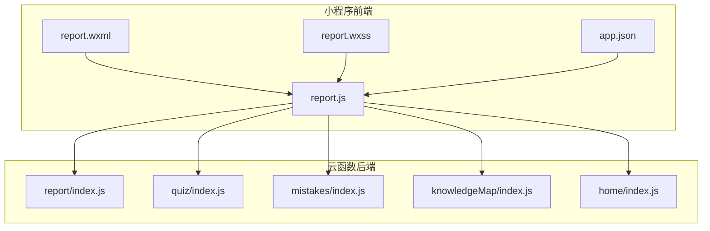
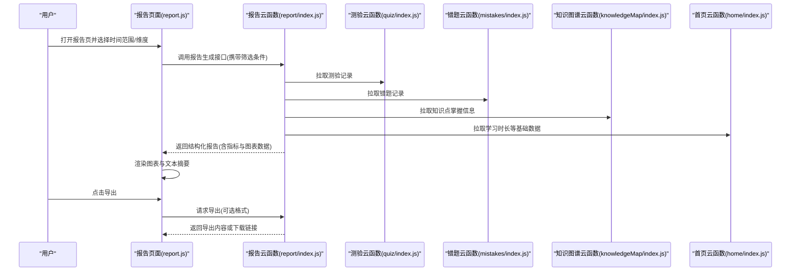
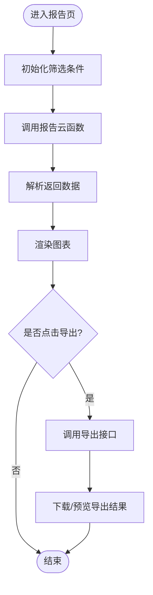
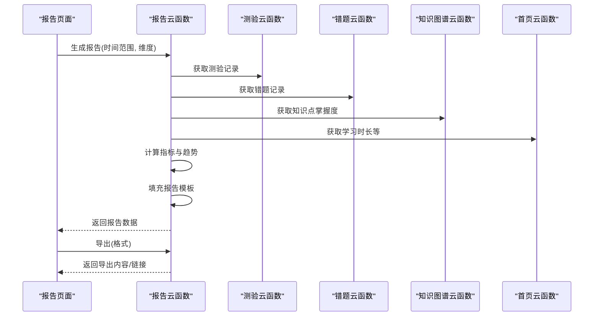
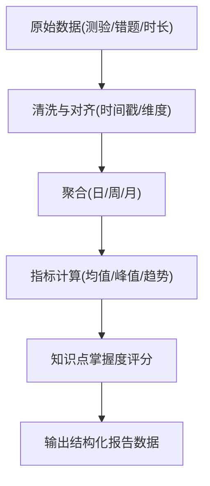
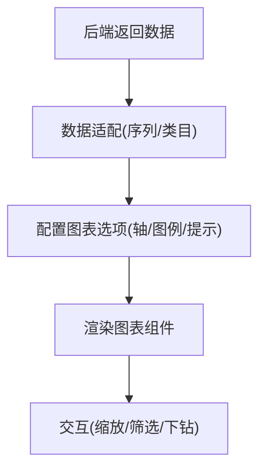
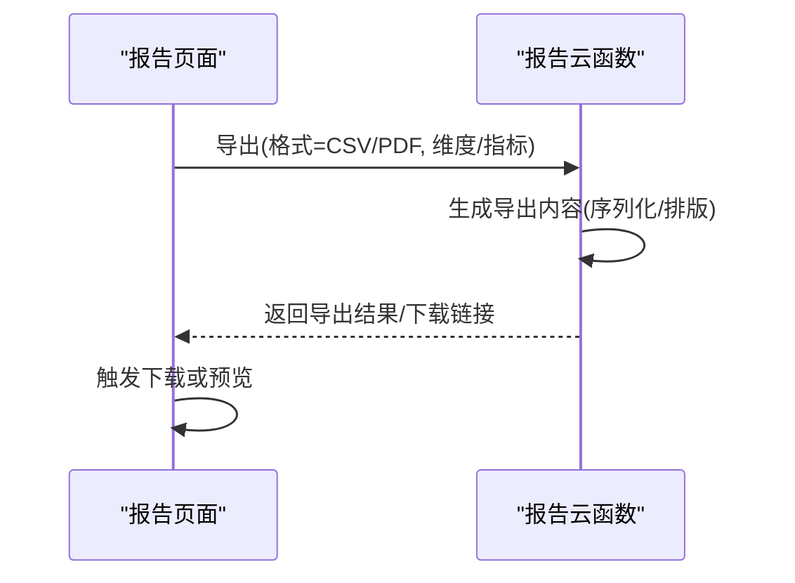
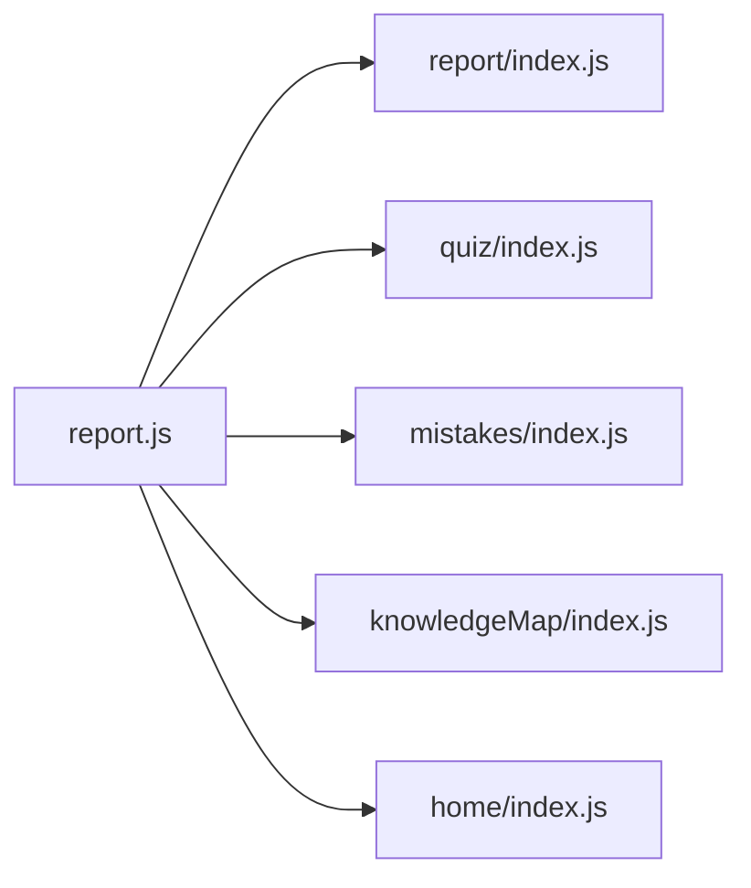

# 学习报告系统

<cite>
**本文引用的文件**   
- [miniprogram/pages/report/report.js](file://miniprogram/pages/report/report.js)
- [miniprogram/pages/report/report.wxml](file://miniprogram/pages/report/report.wxml)
- [miniprogram/pages/report/report.wxss](file://miniprogram/pages/report/report.wxss)
- [cloudfunctions/report/index.js](file://cloudfunctions/report/index.js)
- [cloudfunctions/quiz/index.js](file://cloudfunctions/quiz/index.js)
- [cloudfunctions/mistakes/index.js](file://cloudfunctions/mistakes/index.js)
- [cloudfunctions/knowledgeMap/index.js](file://cloudfunctions/knowledgeMap/index.js)
- [cloudfunctions/home/index.js](file://cloudfunctions/home/index.js)
- [miniprogram/app.json](file://miniprogram/app.json)
</cite>

## 目录
1. [简介](#简介)
2. [项目结构](#项目结构)
3. [核心组件](#核心组件)
4. [架构总览](#架构总览)
5. [详细组件分析](#详细组件分析)
6. [依赖关系分析](#依赖关系分析)
7. [性能考虑](#性能考虑)
8. [故障排查指南](#故障排查指南)
9. [结论](#结论)
10. [附录](#附录)

## 简介
本文件面向“学习报告系统”的文档与实现说明，聚焦以下目标：
- 数据采集：学习行为数据的采集、上报与存储路径
- 分析报告生成：指标计算、聚合策略与模板渲染
- 可视化图表：前端图表渲染流程与数据适配
- 导出功能：自定义报表生成与导出流程
- 数据分析维度示例：学习时间、正确率趋势、知识点掌握度
- 开发指南：如何扩展报表类型与导出格式

## 项目结构
学习报告系统由小程序前端与云函数后端组成。前端负责交互与可视化展示，后端负责数据聚合与报告生成。

图示来源
- [miniprogram/pages/report/report.js](file://miniprogram/pages/report/report.js)
- [miniprogram/pages/report/report.wxml](file://miniprogram/pages/report/report.wxml)
- [miniprogram/pages/report/report.wxss](file://miniprogram/pages/report/report.wxss)
- [cloudfunctions/report/index.js](file://cloudfunctions/report/index.js)
- [cloudfunctions/quiz/index.js](file://cloudfunctions/quiz/index.js)
- [cloudfunctions/mistakes/index.js](file://cloudfunctions/mistakes/index.js)
- [cloudfunctions/knowledgeMap/index.js](file://cloudfunctions/knowledgeMap/index.js)
- [cloudfunctions/home/index.js](file://cloudfunctions/home/index.js)
- [miniprogram/app.json](file://miniprogram/app.json)

章节来源
- [miniprogram/pages/report/report.js](file://miniprogram/pages/report/report.js)
- [miniprogram/pages/report/report.wxml](file://miniprogram/pages/report/report.wxml)
- [miniprogram/pages/report/report.wxss](file://miniprogram/pages/report/report.wxss)
- [cloudfunctions/report/index.js](file://cloudfunctions/report/index.js)
- [cloudfunctions/quiz/index.js](file://cloudfunctions/quiz/index.js)
- [cloudfunctions/mistakes/index.js](file://cloudfunctions/mistakes/index.js)
- [cloudfunctions/knowledgeMap/index.js](file://cloudfunctions/knowledgeMap/index.js)
- [cloudfunctions/home/index.js](file://cloudfunctions/home/index.js)
- [miniprogram/app.json](file://miniprogram/app.json)

## 核心组件
- 报告页面（前端）
  - 负责触发报告生成、接收云端返回的报告数据、渲染图表与文本摘要、提供导出入口
  - 关键职责：请求参数组装、结果解析、视图绑定、错误提示
- 报告服务（云函数）
  - 负责汇总学习行为数据、计算统计指标、生成结构化报告、支持导出
  - 关键职责：数据拉取、指标计算、模板填充、导出序列化

章节来源
- [miniprogram/pages/report/report.js](file://miniprogram/pages/report/report.js)
- [cloudfunctions/report/index.js](file://cloudfunctions/report/index.js)

## 架构总览
整体采用“前端调用云函数”的轻量服务端架构。报告页面通过云函数接口获取聚合后的报告数据，并在前端完成可视化渲染与导出。

图示来源
- [miniprogram/pages/report/report.js](file://miniprogram/pages/report/report.js)
- [cloudfunctions/report/index.js](file://cloudfunctions/report/index.js)
- [cloudfunctions/quiz/index.js](file://cloudfunctions/quiz/index.js)
- [cloudfunctions/mistakes/index.js](file://cloudfunctions/mistakes/index.js)
- [cloudfunctions/knowledgeMap/index.js](file://cloudfunctions/knowledgeMap/index.js)
- [cloudfunctions/home/index.js](file://cloudfunctions/home/index.js)

## 详细组件分析

### 报告页面（前端）
- 职责
  - 构建查询参数（时间范围、课程/知识点筛选、维度选择）
  - 调用报告云函数，解析返回的结构化数据
  - 将数据映射到图表组件所需的数据结构
  - 处理加载态、空数据态与错误态
  - 提供导出按钮，触发导出流程
- 关键流程
  - 初始化：读取本地配置与路由参数，设置默认筛选
  - 生成报告：发起云函数请求，更新状态并渲染
  - 渲染图表：根据返回的系列数据绘制折线/柱状/饼图等
  - 导出：按用户选择的格式（如 CSV/PDF）调用导出接口

图示来源
- [miniprogram/pages/report/report.js](file://miniprogram/pages/report/report.js)
- [miniprogram/pages/report/report.wxml](file://miniprogram/pages/report/report.wxml)
- [miniprogram/pages/report/report.wxss](file://miniprogram/pages/report/report.wxss)

章节来源
- [miniprogram/pages/report/report.js](file://miniprogram/pages/report/report.js)
- [miniprogram/pages/report/report.wxml](file://miniprogram/pages/report/report.wxml)
- [miniprogram/pages/report/report.wxss](file://miniprogram/pages/report/report.wxss)

### 报告服务（云函数）
- 职责
  - 聚合多源数据：测验、错题、知识图谱、学习时长等
  - 计算统计指标：学习时间、正确率趋势、知识点掌握度等
  - 生成报告：填充模板、组织图表数据、输出结构化结果
  - 导出：按格式序列化数据并提供下载
- 关键流程
  - 校验入参：时间范围、维度、过滤条件
  - 数据拉取：并发调用相关云函数获取原始数据
  - 指标计算：按日/周/月聚合，计算均值、峰值、趋势
  - 模板渲染：将指标与图表数据注入报告模板
  - 导出：生成CSV/PDF等格式并返回

图示来源
- [cloudfunctions/report/index.js](file://cloudfunctions/report/index.js)
- [cloudfunctions/quiz/index.js](file://cloudfunctions/quiz/index.js)
- [cloudfunctions/mistakes/index.js](file://cloudfunctions/mistakes/index.js)
- [cloudfunctions/knowledgeMap/index.js](file://cloudfunctions/knowledgeMap/index.js)
- [cloudfunctions/home/index.js](file://cloudfunctions/home/index.js)

章节来源
- [cloudfunctions/report/index.js](file://cloudfunctions/report/index.js)
- [cloudfunctions/quiz/index.js](file://cloudfunctions/quiz/index.js)
- [cloudfunctions/mistakes/index.js](file://cloudfunctions/mistakes/index.js)
- [cloudfunctions/knowledgeMap/index.js](file://cloudfunctions/knowledgeMap/index.js)
- [cloudfunctions/home/index.js](file://cloudfunctions/home/index.js)

### 数据采集与上报
- 数据来源
  - 测验记录：答题结果、耗时、题目ID、知识点标签
  - 错题记录：错误题目、错误原因、复习次数
  - 知识图谱：知识点层级、掌握度评分、关联题目
  - 学习时长：会话开始/结束时间、累计时长
- 采集策略
  - 前端在关键行为节点上报事件（开始答题、提交答案、结束学习）
  - 云函数定时或按需拉取最新数据，进行清洗与去重
  - 对缺失字段进行默认值填充与异常值过滤

章节来源
- [cloudfunctions/quiz/index.js](file://cloudfunctions/quiz/index.js)
- [cloudfunctions/mistakes/index.js](file://cloudfunctions/mistakes/index.js)
- [cloudfunctions/knowledgeMap/index.js](file://cloudfunctions/knowledgeMap/index.js)
- [cloudfunctions/home/index.js](file://cloudfunctions/home/index.js)

### 统计指标计算
- 学习时间
  - 按日/周/月聚合学习会话时长，计算平均值、最大值、趋势变化
- 正确率趋势
  - 基于测验记录计算每日正确率，平滑曲线以观察趋势
- 知识点掌握度
  - 结合错题与练习次数，为每个知识点计算掌握度评分
  - 按知识点树聚合，展示薄弱点与提升空间

章节来源
- [cloudfunctions/report/index.js](file://cloudfunctions/report/index.js)
- [cloudfunctions/quiz/index.js](file://cloudfunctions/quiz/index.js)
- [cloudfunctions/mistakes/index.js](file://cloudfunctions/mistakes/index.js)
- [cloudfunctions/knowledgeMap/index.js](file://cloudfunctions/knowledgeMap/index.js)

### 可视化图表与渲染算法
- 图表类型
  - 折线图：正确率趋势、学习时长趋势
  - 柱状图：各知识点掌握度对比
  - 饼图：题型分布、错误原因占比
- 渲染流程
  - 将后端返回的系列数据转换为图表库所需的数组结构
  - 设置坐标轴、图例、提示框等配置项
  - 响应式适配与懒加载大数据集

章节来源
- [miniprogram/pages/report/report.js](file://miniprogram/pages/report/report.js)
- [miniprogram/pages/report/report.wxml](file://miniprogram/pages/report/report.wxml)

### 报告模板设计与导出
- 模板设计
  - 文本摘要：总体表现、亮点与改进建议
  - 指标卡片：关键指标概览
  - 图表区域：趋势图、对比图、分布图
- 导出功能
  - 支持格式：CSV（表格）、PDF（图文报告）
  - 导出流程：前端选择格式 → 调用导出接口 → 返回内容或下载链接
  - 自定义报表：允许用户选择维度与指标组合，生成个性化报告

图示来源
- [cloudfunctions/report/index.js](file://cloudfunctions/report/index.js)
- [miniprogram/pages/report/report.js](file://miniprogram/pages/report/report.js)

章节来源
- [cloudfunctions/report/index.js](file://cloudfunctions/report/index.js)
- [miniprogram/pages/report/report.js](file://miniprogram/pages/report/report.js)

## 依赖关系分析
- 前端依赖
  - 报告页面依赖报告云函数与其他业务云函数获取数据
  - 页面结构与样式文件用于渲染与交互
- 后端依赖
  - 报告云函数依赖测验、错题、知识图谱、首页等云函数
  - 指标计算与模板渲染在报告云函数内完成

图示来源
- [miniprogram/pages/report/report.js](file://miniprogram/pages/report/report.js)
- [cloudfunctions/report/index.js](file://cloudfunctions/report/index.js)
- [cloudfunctions/quiz/index.js](file://cloudfunctions/quiz/index.js)
- [cloudfunctions/mistakes/index.js](file://cloudfunctions/mistakes/index.js)
- [cloudfunctions/knowledgeMap/index.js](file://cloudfunctions/knowledgeMap/index.js)
- [cloudfunctions/home/index.js](file://cloudfunctions/home/index.js)

章节来源
- [miniprogram/pages/report/report.js](file://miniprogram/pages/report/report.js)
- [cloudfunctions/report/index.js](file://cloudfunctions/report/index.js)
- [cloudfunctions/quiz/index.js](file://cloudfunctions/quiz/index.js)
- [cloudfunctions/mistakes/index.js](file://cloudfunctions/mistakes/index.js)
- [cloudfunctions/knowledgeMap/index.js](file://cloudfunctions/knowledgeMap/index.js)
- [cloudfunctions/home/index.js](file://cloudfunctions/home/index.js)

## 性能考虑
- 数据量控制
  - 分页与时间窗口限制，避免一次性拉取过多数据
  - 前端对大数据集进行采样或懒加载
- 计算优化
  - 后端缓存常用指标，减少重复计算
  - 使用增量更新策略，仅计算新增数据的影响
- 渲染优化
  - 图表数据降采样与虚拟滚动
  - 按需渲染图表，避免首屏阻塞

[本节为通用指导，不直接分析具体文件]

## 故障排查指南
- 常见问题
  - 报告为空：检查时间范围与筛选条件是否正确；确认数据源是否有记录
  - 图表不显示：确认数据结构是否符合图表库要求；检查配置项
  - 导出失败：确认导出格式与权限；查看返回的错误码与日志
- 定位方法
  - 前端：打印请求参数与返回数据，检查状态更新逻辑
  - 后端：查看云函数日志，确认数据拉取与计算步骤是否成功

章节来源
- [miniprogram/pages/report/report.js](file://miniprogram/pages/report/report.js)
- [cloudfunctions/report/index.js](file://cloudfunctions/report/index.js)

## 结论
学习报告系统通过前后端协作实现了从数据采集、指标计算、图表渲染到导出的完整闭环。前端负责交互与可视化，后端负责聚合与计算。通过模块化设计与清晰的职责划分，系统具备良好的可扩展性与可维护性。后续可在指标丰富度、导出格式多样性与性能优化方面持续迭代。

[本节为总结性内容，不直接分析具体文件]

## 附录
- 数据分析维度示例
  - 学习时间：按日/周/月聚合，计算均值与趋势
  - 正确率趋势：基于测验记录计算每日正确率并平滑
  - 知识点掌握度：结合错题与练习次数，为知识点打分
- 自定义报表开发指南
  - 定义新的维度与指标
  - 在后端增加计算逻辑与模板片段
  - 在前端增加选择器与渲染适配
  - 扩展导出格式与布局

[本节为概念性内容，不直接分析具体文件]