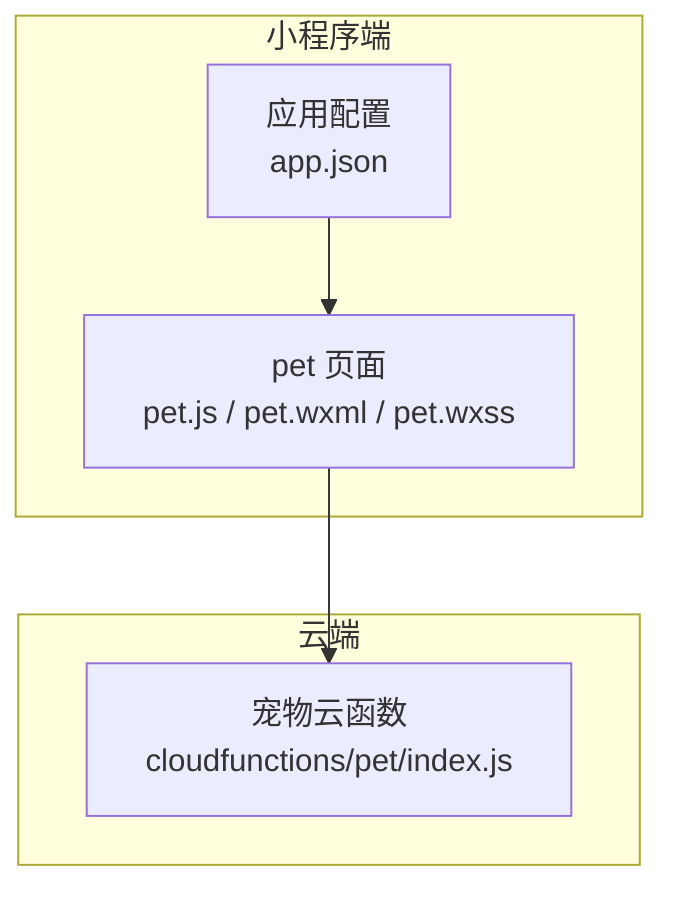
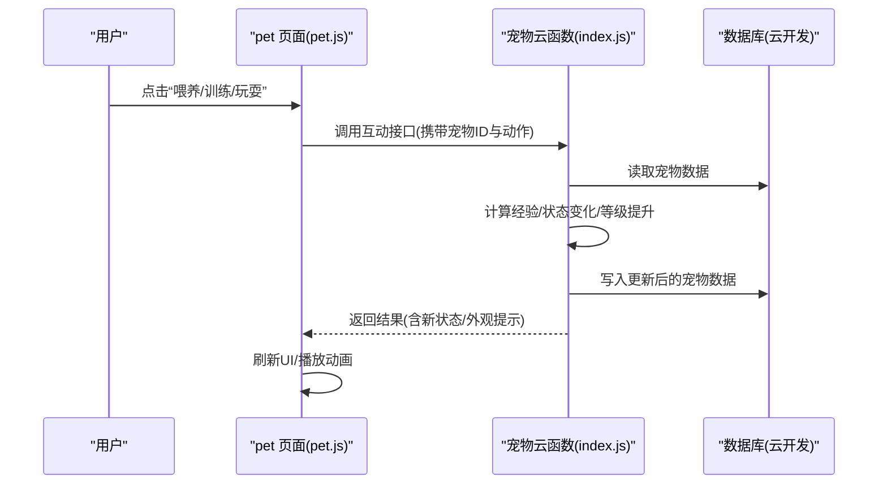
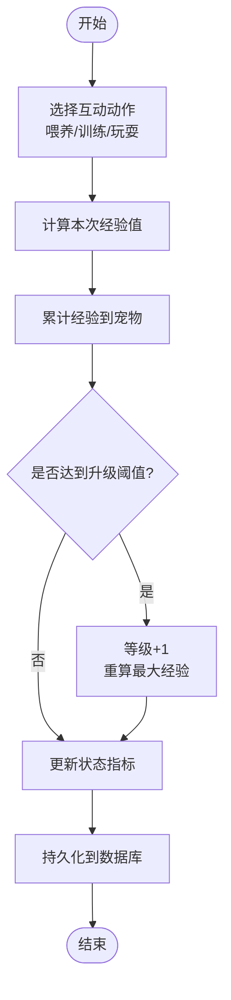
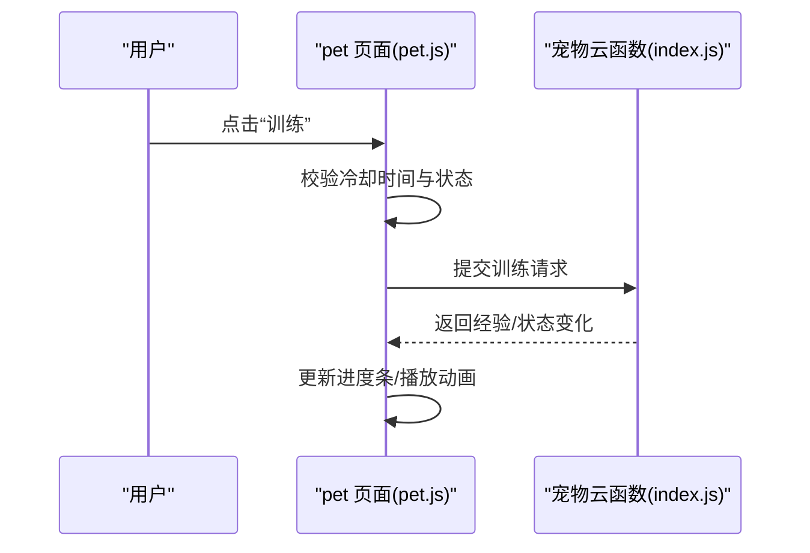
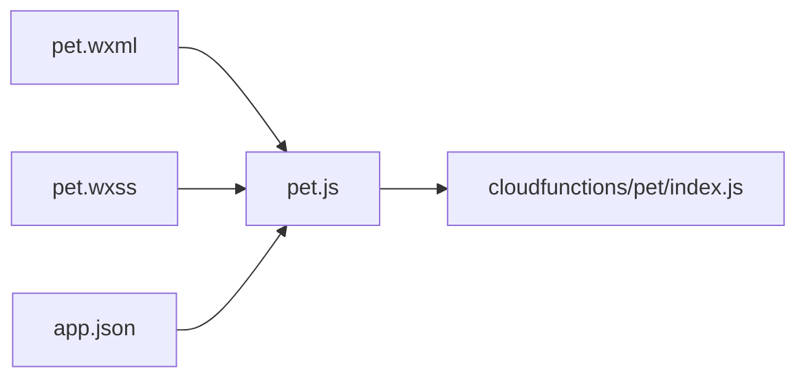

# 宠物养成系统

<cite>
**本文引用的文件**   
- [cloudfunctions/pet/index.js](file://cloudfunctions/pet/index.js)
- [miniprogram/pages/pet/pet.js](file://miniprogram/pages/pet/pet.js)
- [miniprogram/pages/pet/pet.wxml](file://miniprogram/pages/pet/pet.wxml)
- [miniprogram/pages/pet/pet.wxss](file://miniprogram/pages/pet/pet.wxss)
- [miniprogram/app.json](file://miniprogram/app.json)
</cite>

## 目录
1. [简介](#简介)
2. [项目结构](#项目结构)
3. [核心组件](#核心组件)
4. [架构总览](#架构总览)
5. [详细组件分析](#详细组件分析)
6. [依赖分析](#依赖分析)
7. [性能考虑](#性能考虑)
8. [故障排查指南](#故障排查指南)
9. [结论](#结论)
10. [附录：扩展与新增宠物类型指南](#附录扩展与新增宠物类型指南)

## 简介
本文件面向“宠物养成系统”的完整文档，覆盖以下关键主题：
- 宠物属性设计与数据模型
- 成长算法（经验值、等级提升）
- 互动机制（喂养、训练、玩耍等）
- 数据持久化（云函数与小程序端交互）
- 生命周期管理（创建、成长、休眠/死亡、重置）
- 外观变化逻辑（基于等级/状态的外观切换）
- 动画效果实现思路
- 用户交互处理流程
- 扩展与新宠物类型的开发指南

说明：由于当前仓库中仅包含小程序页面与云函数入口文件，未提供具体业务实现细节。本文在保持与现有代码结构一致的前提下，给出可落地的设计建议与参考路径，避免臆造具体实现。

## 项目结构
围绕宠物功能，本项目采用“小程序前端 + 云函数后端”的典型结构：
- 小程序端
  - 页面层：pages/pet 负责宠物主界面交互与展示
  - 应用配置：app.json 注册页面路由
- 云端
  - cloudfunctions/pet 提供宠物相关 API（增删改查、成长计算、互动结算等）

图表来源
- [miniprogram/pages/pet/pet.js](file://miniprogram/pages/pet/pet.js)
- [miniprogram/pages/pet/pet.wxml](file://miniprogram/pages/pet/pet.wxml)
- [miniprogram/pages/pet/pet.wxss](file://miniprogram/pages/pet/pet.wxss)
- [miniprogram/app.json](file://miniprogram/app.json)
- [cloudfunctions/pet/index.js](file://cloudfunctions/pet/index.js)

章节来源
- [miniprogram/pages/pet/pet.js](file://miniprogram/pages/pet/pet.js)
- [miniprogram/pages/pet/pet.wxml](file://miniprogram/pages/pet/pet.wxml)
- [miniprogram/pages/pet/pet.wxss](file://miniprogram/pages/pet/pet.wxss)
- [miniprogram/app.json](file://miniprogram/app.json)
- [cloudfunctions/pet/index.js](file://cloudfunctions/pet/index.js)

## 核心组件
- 宠物数据模型（建议）
  - 基础信息：id、name、type、avatar、level、exp、maxExp、status、createdAt、updatedAt
  - 状态指标：hunger、energy、mood、health（范围与衰减策略由后端统一计算）
  - 外观映射：根据 level、status、type 决定显示资源
- 云函数接口（建议）
  - createPet：初始化新宠物
  - getPet：获取宠物详情
  - updatePet：保存变更
  - feed/train/play：互动事件触发，返回经验/状态变化
  - evolve/checkLevelUp：等级检查与外观更新
- 小程序页面（pet）
  - 渲染宠物信息与状态条
  - 绑定互动按钮事件
  - 调用云函数并刷新 UI

章节来源
- [miniprogram/pages/pet/pet.js](file://miniprogram/pages/pet/pet.js)
- [cloudfunctions/pet/index.js](file://cloudfunctions/pet/index.js)

## 架构总览
整体采用前后端分离的轻量架构：小程序负责交互与展示，云函数负责业务规则与数据持久化。

图表来源
- [miniprogram/pages/pet/pet.js](file://miniprogram/pages/pet/pet.js)
- [cloudfunctions/pet/index.js](file://cloudfunctions/pet/index.js)

## 详细组件分析

### 宠物数据模型与生命周期
- 字段建议
  - id：唯一标识
  - type：宠物类型（用于外观与成长曲线差异化）
  - level：当前等级
  - exp/maxExp：经验值与升级阈值
  - status：状态枚举（如“活跃/饥饿/疲惫/生病/休眠/死亡”）
  - hunger/energy/mood/health：四维状态（0-100）
  - createdAt/updatedAt：时间戳
- 生命周期阶段
  - 创建：初始化默认属性与外观
  - 成长：通过互动累积经验，达到阈值后升级
  - 维护：周期性衰减状态（饥饿上升、精力下降等）
  - 异常：健康过低进入“生病”，长时间不互动进入“休眠”，极端情况“死亡”
  - 重置：允许付费或活动重置为初始状态（保留部分成就）

章节来源
- [cloudfunctions/pet/index.js](file://cloudfunctions/pet/index.js)

### 成长算法与等级提升
- 经验值计算（建议）
  - 基础经验 = f(动作类型, 难度系数, 随机波动)
  - 加成因素 = 连击/连续天数/道具加成
  - 最终经验 = 基础经验 × 加成因素
- 升级判定
  - 当 exp ≥ maxExp 时，level++，重新计算 maxExp（线性或分段递增）
  - 触发外观变化与特效提示
- 状态衰减（建议）
  - 按时间步长对 hunger/energy/mood/health 进行衰减
  - 健康低于阈值触发“生病”，需休息或治疗

图表来源
- [cloudfunctions/pet/index.js](file://cloudfunctions/pet/index.js)

### 互动机制与用户交互
- 动作类型
  - 喂养：降低饥饿，小幅提升心情与健康
  - 训练：消耗精力，提升经验，可能降低心情
  - 玩耍：提升心情，消耗精力，少量经验
- 交互流程
  - 前端校验输入与冷却时间
  - 调用云函数执行动作
  - 返回结果后更新 UI 与动画
- 防抖与幂等
  - 前端限制重复点击
  - 云函数对同一请求做幂等处理（基于时间窗口或操作ID）

图表来源
- [miniprogram/pages/pet/pet.js](file://miniprogram/pages/pet/pet.js)
- [cloudfunctions/pet/index.js](file://cloudfunctions/pet/index.js)

### 外观变化逻辑
- 依据维度
  - 类型：不同宠物拥有独立资源集
  - 等级：外观随等级变化（如服饰、体型）
  - 状态：饥饿/疲惫/生病/休眠对应不同表情或姿态
- 实现建议
  - 前端根据 level/status/type 动态切换图片/动画资源
  - 云函数返回外观版本或资源索引，减少前端判断复杂度

章节来源
- [miniprogram/pages/pet/pet.js](file://miniprogram/pages/pet/pet.js)
- [miniprogram/pages/pet/pet.wxml](file://miniprogram/pages/pet/pet.wxml)
- [miniprogram/pages/pet/pet.wxss](file://miniprogram/pages/pet/pet.wxss)

### 动画效果实现
- 推荐方案
  - 使用小程序原生动画 API 或 Lottie 动画
  - 将动画与状态/等级联动，例如升级时播放庆祝动画
- 性能优化
  - 预加载常用动画资源
  - 控制并发动画数量，避免卡顿

章节来源
- [miniprogram/pages/pet/pet.js](file://miniprogram/pages/pet/pet.js)
- [miniprogram/pages/pet/pet.wxss](file://miniprogram/pages/pet/pet.wxss)

### 数据持久化
- 云函数职责
  - 接收前端请求，执行业务规则
  - 读写数据库，保证一致性
- 前端职责
  - 发起请求、处理错误、刷新 UI
- 事务与一致性
  - 涉及多表更新时使用云开发事务
  - 失败回滚并返回明确错误码

章节来源
- [cloudfunctions/pet/index.js](file://cloudfunctions/pet/index.js)
- [miniprogram/pages/pet/pet.js](file://miniprogram/pages/pet/pet.js)

## 依赖分析
- 模块耦合
  - pet 页面依赖云函数提供的接口
  - 云函数依赖数据库与可能的缓存/消息队列（可扩展）
- 外部依赖
  - 小程序框架 API（导航、网络、本地存储）
  - 云开发 SDK（数据库、云函数调用）

图表来源
- [miniprogram/pages/pet/pet.js](file://miniprogram/pages/pet/pet.js)
- [miniprogram/pages/pet/pet.wxml](file://miniprogram/pages/pet/pet.wxml)
- [miniprogram/pages/pet/pet.wxss](file://miniprogram/pages/pet/pet.wxss)
- [miniprogram/app.json](file://miniprogram/app.json)
- [cloudfunctions/pet/index.js](file://cloudfunctions/pet/index.js)

章节来源
- [miniprogram/pages/pet/pet.js](file://miniprogram/pages/pet/pet.js)
- [miniprogram/pages/pet/pet.wxml](file://miniprogram/pages/pet/pet.wxml)
- [miniprogram/pages/pet/pet.wxss](file://miniprogram/pages/pet/pet.wxss)
- [miniprogram/app.json](file://miniprogram/app.json)
- [cloudfunctions/pet/index.js](file://cloudfunctions/pet/index.js)

## 性能考虑
- 前端
  - 节流/防抖：避免频繁触发云函数
  - 资源预加载：提前加载常见外观与动画
  - 列表与状态更新：最小化 setData 调用次数
- 云端
  - 批量更新：合并多次状态变更
  - 缓存热点数据：如等级阈值表、外观映射
  - 异步任务：离线收益结算、定时衰减

[本节为通用指导，无需源码引用]

## 故障排查指南
- 常见问题
  - 云函数调用失败：检查权限、网络、参数校验
  - 状态不同步：确认幂等性与事务回滚
  - 动画卡顿：检查资源大小与并发动画数量
- 定位方法
  - 查看云函数日志与错误码
  - 前端打印请求/响应体（脱敏）
  - 对比数据库前后快照

章节来源
- [cloudfunctions/pet/index.js](file://cloudfunctions/pet/index.js)
- [miniprogram/pages/pet/pet.js](file://miniprogram/pages/pet/pet.js)

## 结论
本系统以“小程序 + 云函数”的轻量架构为基础，围绕宠物属性、成长算法、互动机制与数据持久化形成闭环。通过清晰的职责划分与可扩展的数据模型，便于后续新增宠物类型与玩法扩展。建议在落地时完善错误处理、幂等与事务保障，并结合性能优化提升用户体验。

[本节为总结性内容，无需源码引用]

## 附录：扩展与新增宠物类型指南
- 新增宠物类型步骤
  - 定义类型常量与外观映射（前端资源与后端配置同步）
  - 在云函数中增加该类型的成长曲线与互动权重
  - 在 pet 页面增加对应的 UI 资源与动画
- 扩展点
  - 互动动作：新增动作需在云函数中定义计算规则与副作用
  - 外观系统：支持按等级/状态/类型组合的资源切换
  - 成就与任务：与宠物状态联动，解锁奖励
- 最佳实践
  - 配置驱动：将数值与资源路径外置，便于运营调整
  - 向后兼容：新增字段不影响旧客户端
  - 测试覆盖：针对边界条件（满级、低健康、频繁互动）编写用例

章节来源
- [cloudfunctions/pet/index.js](file://cloudfunctions/pet/index.js)
- [miniprogram/pages/pet/pet.js](file://miniprogram/pages/pet/pet.js)
- [miniprogram/pages/pet/pet.wxml](file://miniprogram/pages/pet/pet.wxml)
- [miniprogram/pages/pet/pet.wxss](file://miniprogram/pages/pet/pet.wxss)