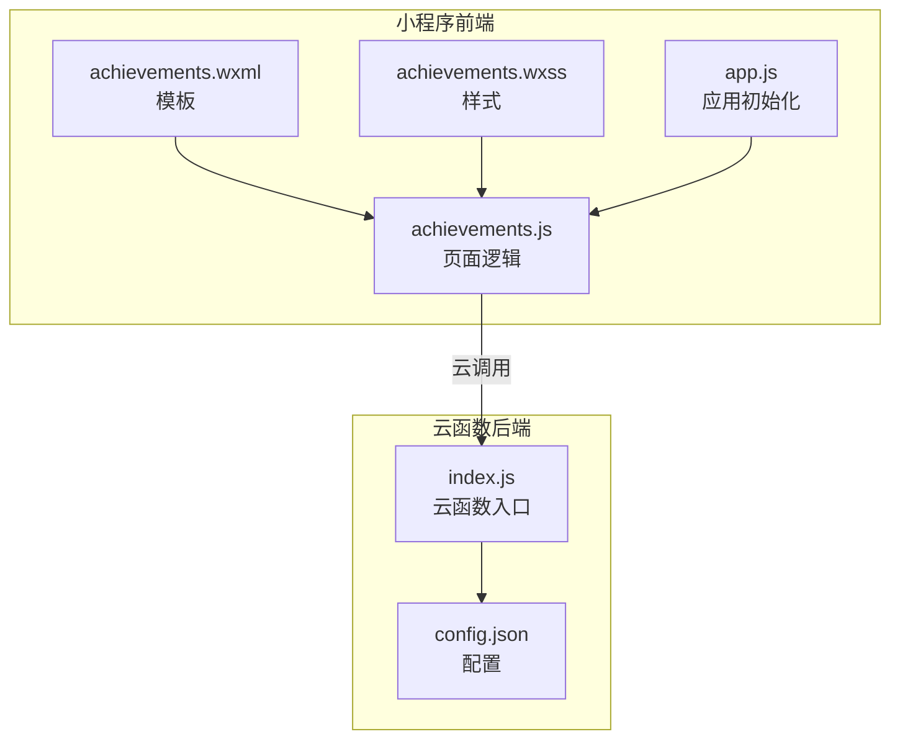
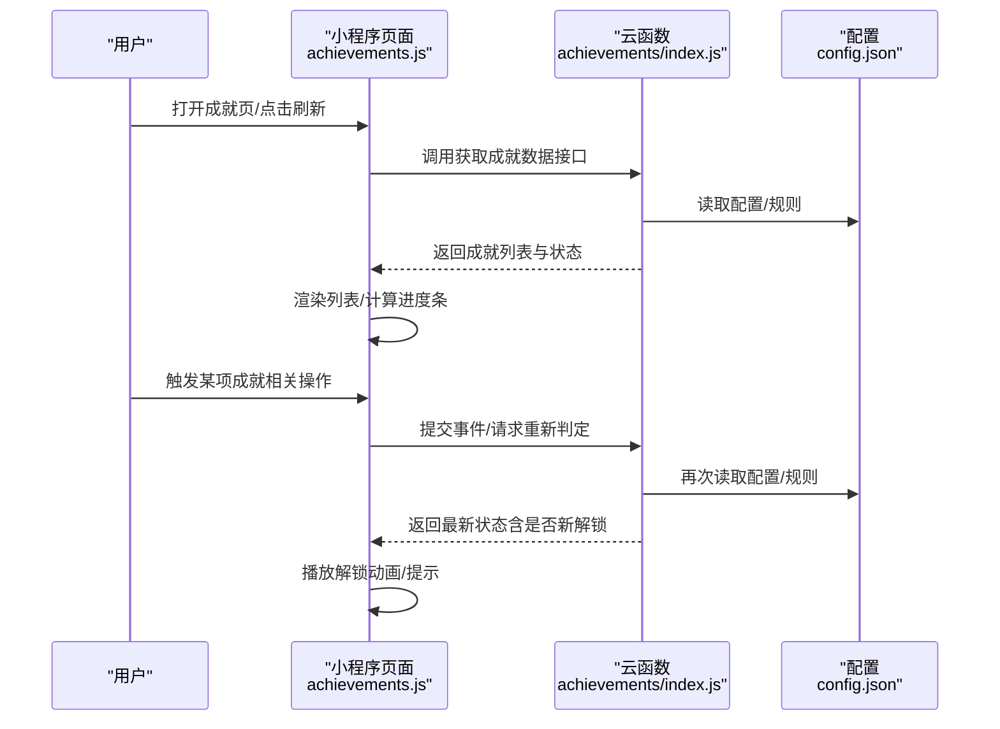
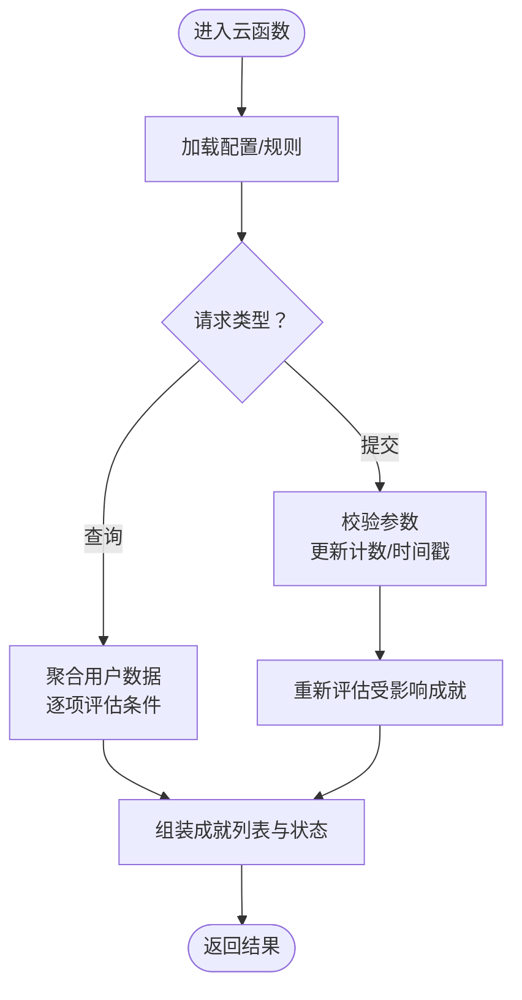
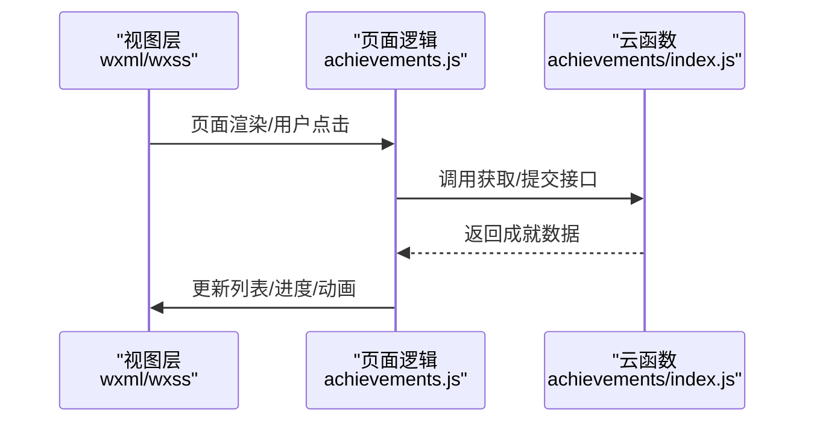
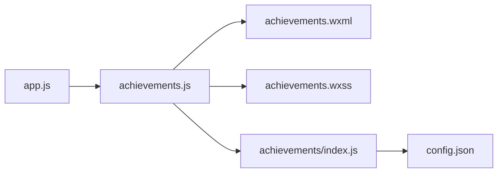

# 成就系统

<cite>
**本文引用的文件**   
- [cloudfunctions/achievements/index.js](file://cloudfunctions/achievements/index.js)
- [cloudfunctions/achievements/config.json](file://cloudfunctions/achievements/config.json)
- [miniprogram/pages/achievements/achievements.js](file://miniprogram/pages/achievements/achievements.js)
- [miniprogram/pages/achievements/achievements.wxml](file://miniprogram/pages/achievements/achievements.wxml)
- [miniprogram/pages/achievements/achievements.wxss](file://miniprogram/pages/achievements/achievements.wxss)
- [miniprogram/app.js](file://miniprogram/app.js)
</cite>

## 目录
1. [简介](#简介)
2. [项目结构](#项目结构)
3. [核心组件](#核心组件)
4. [架构总览](#架构总览)
5. [详细组件分析](#详细组件分析)
6. [依赖关系分析](#依赖关系分析)
7. [性能考虑](#性能考虑)
8. [故障排查指南](#故障排查指南)
9. [结论](#结论)
10. [附录](#附录)

## 简介
本文件为“成就系统”的技术与产品文档，围绕以下目标展开：
- 成就定义、解锁条件、奖励机制与进度追踪的实现原理
- 数据结构设计、条件判断逻辑、动画效果展示与用户激励策略
- 具体成就类型实现（学习时长、正确率、连续打卡等）的参考路径
- 成就系统的扩展方法与自定义成就开发指南

## 项目结构
成就系统由小程序前端页面与云函数后端组成，前后端通过云调用交互。关键文件如下：
- 云函数：cloudfunctions/achievements/index.js、config.json
- 小程序页面：miniprogram/pages/achievements/*
- 应用入口：miniprogram/app.js

图表来源
- [miniprogram/pages/achievements/achievements.js](file://miniprogram/pages/achievements/achievements.js)
- [miniprogram/pages/achievements/achievements.wxml](file://miniprogram/pages/achievements/achievements.wxml)
- [miniprogram/pages/achievements/achievements.wxss](file://miniprogram/pages/achievements/achievements.wxss)
- [miniprogram/app.js](file://miniprogram/app.js)
- [cloudfunctions/achievements/index.js](file://cloudfunctions/achievements/index.js)
- [cloudfunctions/achievements/config.json](file://cloudfunctions/achievements/config.json)

章节来源
- [cloudfunctions/achievements/index.js](file://cloudfunctions/achievements/index.js)
- [cloudfunctions/achievements/config.json](file://cloudfunctions/achievements/config.json)
- [miniprogram/pages/achievements/achievements.js](file://miniprogram/pages/achievements/achievements.js)
- [miniprogram/pages/achievements/achievements.wxml](file://miniprogram/pages/achievements/achievements.wxml)
- [miniprogram/pages/achievements/achievements.wxss](file://miniprogram/pages/achievements/achievements.wxss)
- [miniprogram/app.js](file://miniprogram/app.js)

## 核心组件
- 云函数层（achievements）
  - 负责读取/更新用户成就数据、计算解锁状态、返回渲染所需的数据结构
  - 提供统一的接口供小程序页面调用
- 小程序页面层（achievements）
  - 负责展示成就列表、触发刷新、播放解锁动画、处理用户交互
  - 将云函数返回的数据映射到视图模型并驱动 UI 更新

章节来源
- [cloudfunctions/achievements/index.js](file://cloudfunctions/achievements/index.js)
- [miniprogram/pages/achievements/achievements.js](file://miniprogram/pages/achievements/achievements.js)

## 架构总览
整体采用“前端轻量 + 云端集中式计算”的架构。前端仅做展示与交互，所有成就判定与持久化在云函数中完成，保证一致性与可维护性。

图表来源
- [miniprogram/pages/achievements/achievements.js](file://miniprogram/pages/achievements/achievements.js)
- [cloudfunctions/achievements/index.js](file://cloudfunctions/achievements/index.js)
- [cloudfunctions/achievements/config.json](file://cloudfunctions/achievements/config.json)

## 详细组件分析

### 云函数：成就服务（achievements/index.js）
职责
- 暴露统一接口：查询成就、提交事件、批量刷新
- 依据配置与用户行为记录，计算每项成就的当前进度与是否解锁
- 返回标准化的成就数据给前端渲染

关键流程
- 初始化：加载配置与必要常量
- 查询：按用户维度聚合历史数据，逐项评估达成条件
- 提交：接收业务事件（如完成测验、累计学习时长），更新计数或时间戳
- 返回：包含成就元信息、进度、是否已解锁、奖励信息等

图表来源
- [cloudfunctions/achievements/index.js](file://cloudfunctions/achievements/index.js)
- [cloudfunctions/achievements/config.json](file://cloudfunctions/achievements/config.json)

章节来源
- [cloudfunctions/achievements/index.js](file://cloudfunctions/achievements/index.js)
- [cloudfunctions/achievements/config.json](file://cloudfunctions/achievements/config.json)

### 小程序页面：成就展示（achievements.*）
职责
- 发起云函数调用，拉取成就数据
- 将数据映射为视图模型，驱动列表、进度条、徽章等展示
- 处理解锁动画与提示，反馈用户行为

关键流程
- 页面 onLoad/onShow：拉取成就数据
- 用户交互：触发特定成就相关的操作（如跳转学习/测验）
- 刷新：根据云函数返回的最新状态更新 UI 与动画

图表来源
- [miniprogram/pages/achievements/achievements.js](file://miniprogram/pages/achievements/achievements.js)
- [miniprogram/pages/achievements/achievements.wxml](file://miniprogram/pages/achievements/achievements.wxml)
- [miniprogram/pages/achievements/achievements.wxss](file://miniprogram/pages/achievements/achievements.wxss)
- [cloudfunctions/achievements/index.js](file://cloudfunctions/achievements/index.js)

章节来源
- [miniprogram/pages/achievements/achievements.js](file://miniprogram/pages/achievements/achievements.js)
- [miniprogram/pages/achievements/achievements.wxml](file://miniprogram/pages/achievements/achievements.wxml)
- [miniprogram/pages/achievements/achievements.wxss](file://miniprogram/pages/achievements/achievements.wxss)

### 数据结构设计（概念说明）
以下为成就系统常用的数据字段建议（用于指导实现与对接）：
- 成就基础信息
  - id：唯一标识
  - name：名称
  - description：描述
  - icon：图标资源
  - reward：奖励内容（如积分、徽章、道具等）
- 进度与状态
  - progress：当前进度数值
  - target：目标阈值
  - unlocked：是否已解锁
  - lastUpdate：最后更新时间
- 条件与类型
  - type：成就类型（如学习时长、正确率、连续打卡等）
  - conditions：条件表达式或规则集合
  - scope：作用域（全局/课程/专题等）
- 统计与审计
  - events：关联事件清单（便于回溯）
  - version：规则版本（便于灰度与回滚）

注意：以上字段为通用设计建议，实际字段以云函数与页面实现为准。

章节来源
- [cloudfunctions/achievements/index.js](file://cloudfunctions/achievements/index.js)
- [miniprogram/pages/achievements/achievements.js](file://miniprogram/pages/achievements/achievements.js)

### 条件判断逻辑（概念说明）
常见条件类型与判定思路：
- 累计型：统计类指标达到阈值（如学习时长、答题次数）
- 比率型：比例类指标达到阈值（如正确率、完成率）
- 连续型：连续天数/次数达标（如连续打卡）
- 里程碑型：首次达成某事件（如首次完成某课程）
- 组合型：多个条件同时满足（AND/OR 组合）

判定流程要点：
- 从用户历史数据聚合指标
- 按规则版本解析条件表达式
- 计算进度与是否解锁，标记变更以便前端动画

章节来源
- [cloudfunctions/achievements/index.js](file://cloudfunctions/achievements/index.js)

### 动画效果展示（概念说明）
- 解锁瞬间：弹出提示、播放动效、高亮徽章
- 进度推进：进度条平滑过渡、数字滚动
- 批量解锁：分步展示，避免一次性过多弹窗影响体验

章节来源
- [miniprogram/pages/achievements/achievements.js](file://miniprogram/pages/achievements/achievements.js)
- [miniprogram/pages/achievements/achievements.wxss](file://miniprogram/pages/achievements/achievements.wxss)

### 用户激励策略（概念说明）
- 即时反馈：每次提交后尽快返回最新状态
- 渐进目标：设置阶梯式目标，保持持续动力
- 可见进度：清晰展示进度条与剩余量
- 社交分享：支持分享成就卡片（可选）
- 提醒与召回：对接近解锁的成就进行温和提醒（可选）

[本节为通用策略说明，不直接分析具体文件]

### 具体成就类型实现（参考路径）
- 学习时长
  - 触发点：学习页面结束/定时上报
  - 云函数：累计时长、更新进度、判定解锁
  - 前端：展示时长进度与解锁提示
  - 参考路径
    - [cloudfunctions/achievements/index.js](file://cloudfunctions/achievements/index.js)
    - [miniprogram/pages/study/study.js](file://miniprogram/pages/study/study.js)
    - [miniprogram/pages/achievements/achievements.js](file://miniprogram/pages/achievements/achievements.js)
- 正确率
  - 触发点：测验提交后
  - 云函数：统计正确数/总数，计算比率，判定解锁
  - 前端：展示正确率进度与解锁提示
  - 参考路径
    - [cloudfunctions/achievements/index.js](file://cloudfunctions/achievements/index.js)
    - [miniprogram/pages/quizSummary/quizSummary.js](file://miniprogram/pages/quizSummary/quizSummary.js)
    - [miniprogram/pages/achievements/achievements.js](file://miniprogram/pages/achievements/achievements.js)
- 连续打卡
  - 触发点：每日学习/签到
  - 云函数：维护最近打卡日期序列，计算连续天数
  - 前端：展示连续天数与解锁提示
  - 参考路径
    - [cloudfunctions/achievements/index.js](file://cloudfunctions/achievements/index.js)
    - [miniprogram/pages/home/home.js](file://miniprogram/pages/home/home.js)
    - [miniprogram/pages/achievements/achievements.js](file://miniprogram/pages/achievements/achievements.js)

章节来源
- [cloudfunctions/achievements/index.js](file://cloudfunctions/achievements/index.js)
- [miniprogram/pages/achievements/achievements.js](file://miniprogram/pages/achievements/achievements.js)
- [miniprogram/pages/study/study.js](file://miniprogram/pages/study/study.js)
- [miniprogram/pages/quizSummary/quizSummary.js](file://miniprogram/pages/quizSummary/quizSummary.js)
- [miniprogram/pages/home/home.js](file://miniprogram/pages/home/home.js)

## 依赖关系分析
- 前端依赖
  - achievements.js 依赖 wxml/wxss 完成渲染
  - app.js 负责应用初始化与可能的全局配置注入
- 后端依赖
  - index.js 依赖 config.json 中的规则与常量
- 外部依赖
  - 小程序云调用能力（用于前后端通信）

图表来源
- [miniprogram/app.js](file://miniprogram/app.js)
- [miniprogram/pages/achievements/achievements.js](file://miniprogram/pages/achievements/achievements.js)
- [miniprogram/pages/achievements/achievements.wxml](file://miniprogram/pages/achievements/achievements.wxml)
- [miniprogram/pages/achievements/achievements.wxss](file://miniprogram/pages/achievements/achievements.wxss)
- [cloudfunctions/achievements/index.js](file://cloudfunctions/achievements/index.js)
- [cloudfunctions/achievements/config.json](file://cloudfunctions/achievements/config.json)

章节来源
- [miniprogram/app.js](file://miniprogram/app.js)
- [miniprogram/pages/achievements/achievements.js](file://miniprogram/pages/achievements/achievements.js)
- [cloudfunctions/achievements/index.js](file://cloudfunctions/achievements/index.js)
- [cloudfunctions/achievements/config.json](file://cloudfunctions/achievements/config.json)

## 性能考虑
- 减少不必要的刷新：仅在关键节点（提交、返回页面）触发重算
- 增量更新：只返回发生变化的成就项，降低传输体积
- 缓存策略：短期缓存上次拉取结果，避免频繁网络请求
- 批处理：合并多次提交事件，降低云函数调用频率
- 动画节流：避免大量并发动画导致掉帧

[本节为通用性能建议，不直接分析具体文件]

## 故障排查指南
常见问题与定位步骤：
- 云函数报错
  - 检查 config.json 配置是否正确
  - 查看云函数日志，确认入参与规则解析
- 前端无响应
  - 检查云调用权限与网络状态
  - 核对页面逻辑中对返回数据的处理分支
- 进度不一致
  - 确认事件上报时机与去重逻辑
  - 核对规则版本与历史数据兼容性

章节来源
- [cloudfunctions/achievements/config.json](file://cloudfunctions/achievements/config.json)
- [cloudfunctions/achievements/index.js](file://cloudfunctions/achievements/index.js)
- [miniprogram/pages/achievements/achievements.js](file://miniprogram/pages/achievements/achievements.js)

## 结论
成就系统通过“云端集中判定 + 前端轻渲染”的方式，实现了可扩展、易维护的成就体系。建议在后续迭代中完善规则版本管理、事件溯源与可视化调试工具，进一步提升可观测性与扩展性。

[本节为总结性内容，不直接分析具体文件]

## 附录

### 扩展方法与自定义成就开发指南
- 新增成就类型
  - 在云函数中添加对应类型的判定逻辑与数据处理
  - 在前端增加对应的展示与动画
- 新增条件类型
  - 在配置中声明新的条件表达式格式
  - 在云函数中实现解析与求值器
- 事件接入
  - 在各业务页面（学习、测验、打卡等）提交标准化事件
  - 云函数接收后进行增量更新与重评估
- 版本与灰度
  - 引入规则版本号，支持灰度发布与回滚
  - 保留历史数据兼容处理

章节来源
- [cloudfunctions/achievements/index.js](file://cloudfunctions/achievements/index.js)
- [cloudfunctions/achievements/config.json](file://cloudfunctions/achievements/config.json)
- [miniprogram/pages/achievements/achievements.js](file://miniprogram/pages/achievements/achievements.js)