# 核心功能模块

<cite>
**本文引用的文件**   
- [app.js](file://miniprogram/app.js)
- [app.json](file://miniprogram/app.json)
- [home.js](file://miniprogram/pages/home/home.js)
- [login.js](file://miniprogram/pages/login/login.js)
- [course.js](file://miniprogram/pages/course/course.js)
- [ai.js](file://miniprogram/pages/ai/ai.js)
- [knowledge.js](file://miniprogram/pages/knowledge/knowledge.js)
- [map.js](file://miniprogram/pages/map/map.js)
- [quiz.js](file://miniprogram/pages/quiz/quiz.js)
- [quizSummary.js](file://miniprogram/pages/quizSummary/quizSummary.js)
- [mistakes.js](file://miniprogram/pages/mistakes/mistakes.js)
- [achievements.js](file://miniprogram/pages/achievements/achievements.js)
- [pet.js](file://miniprogram/pages/pet/pet.js)
- [report.js](file://miniprogram/pages/report/report.js)
- [profile.js](file://miniprogram/pages/profile/profile.js)
- [settings.js](file://miniprogram/pages/settings/settings.js)
- [study.js](file://miniprogram/pages/study/study.js)
- [flashcards.js](file://miniprogram/pages/flashcards/flashcards.js)
- [cloudfunctions/login/index.js](file://cloudfunctions/login/index.js)
- [cloudfunctions/getCourseList/index.js](file://cloudfunctions/getCourseList/index.js)
- [cloudfunctions/getCourseDetail/index.js](file://cloudfunctions/getCourseDetail/index.js)
- [cloudfunctions/aiChat/index.js](file://cloudfunctions/aiChat/index.js)
- [cloudfunctions/knowledgeMap/index.js](file://cloudfunctions/knowledgeMap/index.js)
- [cloudfunctions/quiz/index.js](file://cloudfunctions/quiz/index.js)
- [cloudfunctions/mistakes/index.js](file://cloudfunctions/mistakes/index.js)
- [cloudfunctions/achievements/index.js](file://cloudfunctions/achievements/index.js)
- [cloudfunctions/pet/index.js](file://cloudfunctions/pet/index.js)
- [cloudfunctions/report/index.js](file://cloudfunctions/report/index.js)
- [cloudfunctions/home/index.js](file://cloudfunctions/home/index.js)
- [cloudfunctions/settings/index.js](file://cloudfunctions/settings/index.js)
- [cloudfunctions/flashcards/index.js](file://cloudfunctions/flashcards/index.js)
</cite>

## 目录
1. [简介](#简介)
2. [项目结构](#项目结构)
3. [核心组件](#核心组件)
4. [架构总览](#架构总览)
5. [详细组件分析](#详细组件分析)
6. [依赖分析](#依赖分析)
7. [性能考虑](#性能考虑)
8. [故障排查指南](#故障排查指南)
9. [结论](#结论)
10. [附录](#附录)

## 简介
本文件面向生物学习小程序的核心功能模块，覆盖用户认证、课程学习、AI助手、知识图谱、测验系统、错题管理、成就系统、宠物养成、学习报告与个人中心等模块。文档从设计理念、业务逻辑、用户交互流程、数据处理流程、模块间数据流转与集成方式入手，为产品、前端与后端开发者提供统一参考。

## 项目结构
本项目采用“小程序前端 + 云函数后端”的架构：
- 小程序端（miniprogram）：页面、自定义 TabBar、工具类与全局配置。
- 云端（cloudfunctions）：按能力拆分的云函数，承载认证、课程、AI、知识图谱、测验、错题、成就、宠物、报告、设置等能力。
- 文档与原型（docs、prototype）：设计说明与原型页面。

```mermaid
graph TB
subgraph "小程序前端"
APP["app.js<br/>全局初始化"]
HOME["pages/home/home.js"]
LOGIN["pages/login/login.js"]
COURSE["pages/course/course.js"]
AI["pages/ai/ai.js"]
KNOW["pages/knowledge/knowledge.js"]
MAP["pages/map/map.js"]
QUIZ["pages/quiz/quiz.js"]
QSUM["pages/quizSummary/quizSummary.js"]
MIST["pages/mistakes/mistakes.js"]
ACH["pages/achievements/achievements.js"]
PET["pages/pet/pet.js"]
RPT["pages/report/report.js"]
PROF["pages/profile/profile.js"]
SET["pages/settings/settings.js"]
STUDY["pages/study/study.js"]
FLASH["pages/flashcards/flashcards.js"]
end
subgraph "云函数后端"
CF_LOGIN["cloudfunctions/login/index.js"]
CF_HOME["cloudfunctions/home/index.js"]
CF_COURSE_LIST["cloudfunctions/getCourseList/index.js"]
CF_COURSE_DETAIL["cloudfunctions/getCourseDetail/index.js"]
CF_AI["cloudfunctions/aiChat/index.js"]
CF_KMAP["cloudfunctions/knowledgeMap/index.js"]
CF_QUIZ["cloudfunctions/quiz/index.js"]
CF_MIST["cloudfunctions/mistakes/index.js"]
CF_ACH["cloudfunctions/achievements/index.js"]
CF_PET["cloudfunctions/pet/index.js"]
CF_RPT["cloudfunctions/report/index.js"]
CF_SET["cloudfunctions/settings/index.js"]
CF_FLASH["cloudfunctions/flashcards/index.js"]
end
APP --> HOME
HOME --> CF_HOME
LOGIN --> CF_LOGIN
COURSE --> CF_COURSE_LIST
COURSE --> CF_COURSE_DETAIL
AI --> CF_AI
KNOW --> CF_KMAP
MAP --> CF_KMAP
QUIZ --> CF_QUIZ
QSUM --> CF_QUIZ
MIST --> CF_MIST
ACH --> CF_ACH
PET --> CF_PET
RPT --> CF_RPT
PROF --> CF_SET
SET --> CF_SET
STUDY --> CF_COURSE_DETAIL
FLASH --> CF_FLASH
```

图表来源
- [app.js](file://miniprogram/app.js)
- [home.js](file://miniprogram/pages/home/home.js)
- [login.js](file://miniprogram/pages/login/login.js)
- [course.js](file://miniprogram/pages/course/course.js)
- [ai.js](file://miniprogram/pages/ai/ai.js)
- [knowledge.js](file://miniprogram/pages/knowledge/knowledge.js)
- [map.js](file://miniprogram/pages/map/map.js)
- [quiz.js](file://miniprogram/pages/quiz/quiz.js)
- [quizSummary.js](file://miniprogram/pages/quizSummary/quizSummary.js)
- [mistakes.js](file://miniprogram/pages/mistakes/mistakes.js)
- [achievements.js](file://miniprogram/pages/achievements/achievements.js)
- [pet.js](file://miniprogram/pages/pet/pet.js)
- [report.js](file://miniprogram/pages/report/report.js)
- [profile.js](file://miniprogram/pages/profile/profile.js)
- [settings.js](file://miniprogram/pages/settings/settings.js)
- [study.js](file://miniprogram/pages/study/study.js)
- [flashcards.js](file://miniprogram/pages/flashcards/flashcards.js)
- [cloudfunctions/login/index.js](file://cloudfunctions/login/index.js)
- [cloudfunctions/home/index.js](file://cloudfunctions/home/index.js)
- [cloudfunctions/getCourseList/index.js](file://cloudfunctions/getCourseList/index.js)
- [cloudfunctions/getCourseDetail/index.js](file://cloudfunctions/getCourseDetail/index.js)
- [cloudfunctions/aiChat/index.js](file://cloudfunctions/aiChat/index.js)
- [cloudfunctions/knowledgeMap/index.js](file://cloudfunctions/knowledgeMap/index.js)
- [cloudfunctions/quiz/index.js](file://cloudfunctions/quiz/index.js)
- [cloudfunctions/mistakes/index.js](file://cloudfunctions/mistakes/index.js)
- [cloudfunctions/achievements/index.js](file://cloudfunctions/achievements/index.js)
- [cloudfunctions/pet/index.js](file://cloudfunctions/pet/index.js)
- [cloudfunctions/report/index.js](file://cloudfunctions/report/index.js)
- [cloudfunctions/settings/index.js](file://cloudfunctions/settings/index.js)
- [cloudfunctions/flashcards/index.js](file://cloudfunctions/flashcards/index.js)

章节来源
- [app.json](file://miniprogram/app.json)
- [app.js](file://miniprogram/app.js)

## 核心组件
本节概述各功能模块的设计理念与实现要点，聚焦业务目标、关键交互与数据流。

- 用户认证
  - 理念：基于微信登录态，通过云函数完成身份校验与会话建立，保证后续请求可识别用户。
  - 交互：进入登录页触发登录流程，成功后跳转首页并缓存必要信息。
  - 数据：调用认证云函数获取用户标识与基础信息，供其他模块使用。
  - 参考路径
    - [login.js](file://miniprogram/pages/login/login.js)
    - [cloudfunctions/login/index.js](file://cloudfunctions/login/index.js)

- 课程学习
  - 理念：以课程列表与详情为核心，支持视频/图文学习与进度记录。
  - 交互：首页入口进入课程列表，选择课程后进入学习页，记录学习进度。
  - 数据：拉取课程列表与详情，提交学习进度与观看记录。
  - 参考路径
    - [course.js](file://miniprogram/pages/course/course.js)
    - [study.js](file://miniprogram/pages/study/study.js)
    - [cloudfunctions/getCourseList/index.js](file://cloudfunctions/getCourseList/index.js)
    - [cloudfunctions/getCourseDetail/index.js](file://cloudfunctions/getCourseDetail/index.js)

- AI助手
  - 理念：围绕生物学问题提供智能问答，结合上下文记忆提升体验。
  - 交互：在聊天界面输入问题，实时返回答案；支持清空历史与快捷提示。
  - 数据：将用户消息与历史上下文发送至AI云函数，接收结构化回复。
  - 参考路径
    - [ai.js](file://miniprogram/pages/ai/ai.js)
    - [cloudfunctions/aiChat/index.js](file://cloudfunctions/aiChat/index.js)

- 知识图谱
  - 理念：以知识点为节点、关系为边，构建可视化知识网络，辅助系统性学习。
  - 交互：浏览图谱、点击节点查看关联内容与掌握度。
  - 数据：加载图谱结构与节点详情，更新掌握状态。
  - 参考路径
    - [knowledge.js](file://miniprogram/pages/knowledge/knowledge.js)
    - [map.js](file://miniprogram/pages/map/map.js)
    - [cloudfunctions/knowledgeMap/index.js](file://cloudfunctions/knowledgeMap/index.js)

- 测验系统
  - 理念：基于题库生成随堂测验，即时反馈与解析，沉淀错题。
  - 交互：选择主题或随机出题，答题完成后展示总结页。
  - 数据：拉取题目、提交答案、计算得分与错误项，写入错题集。
  - 参考路径
    - [quiz.js](file://miniprogram/pages/quiz/quiz.js)
    - [quizSummary.js](file://miniprogram/pages/quizSummary/quizSummary.js)
    - [cloudfunctions/quiz/index.js](file://cloudfunctions/quiz/index.js)

- 错题管理
  - 理念：自动收集错题，支持按知识点筛选与重练，形成闭环复习。
  - 交互：查看错题列表、查看详情、一键重练。
  - 数据：同步错题清单与解析，更新掌握度与练习次数。
  - 参考路径
    - [mistakes.js](file://miniprogram/pages/mistakes/mistakes.js)
    - [cloudfunctions/mistakes/index.js](file://cloudfunctions/mistakes/index.js)

- 成就系统
  - 理念：以徽章与里程碑激励持续学习，增强粘性。
  - 交互：查看已达成与未达成成就，了解条件与进度。
  - 数据：根据学习行为累计积分与事件，判定成就解锁。
  - 参考路径
    - [achievements.js](file://miniprogram/pages/achievements/achievements.js)
    - [cloudfunctions/achievements/index.js](file://cloudfunctions/achievements/index.js)

- 宠物养成
  - 理念：将学习行为转化为宠物成长资源，寓教于乐。
  - 交互：喂养、训练、升级宠物，查看属性与外观变化。
  - 数据：同步宠物状态、经验值与等级，联动成就与报告。
  - 参考路径
    - [pet.js](file://miniprogram/pages/pet/pet.js)
    - [cloudfunctions/pet/index.js](file://cloudfunctions/pet/index.js)

- 学习报告
  - 理念：汇总学习时长、正确率、薄弱点与趋势，指导个性化学习。
  - 交互：按日/周/月维度查看报告，导出或分享。
  - 数据：聚合测验、学习、错题等行为数据，生成统计指标。
  - 参考路径
    - [report.js](file://miniprogram/pages/report/report.js)
    - [cloudfunctions/report/index.js](file://cloudfunctions/report/index.js)

- 个人中心
  - 理念：统一管理个人信息、设置与入口导航。
  - 交互：编辑资料、切换主题、退出登录。
  - 数据：读写用户偏好与账户信息。
  - 参考路径
    - [profile.js](file://miniprogram/pages/profile/profile.js)
    - [settings.js](file://miniprogram/pages/settings/settings.js)
    - [cloudfunctions/settings/index.js](file://cloudfunctions/settings/index.js)

- 首页与全局
  - 理念：聚合常用入口、推荐内容与学习概览。
  - 交互：快速跳转课程、测验、AI、知识图谱等。
  - 数据：拉取个性化推荐与概览指标。
  - 参考路径
    - [home.js](file://miniprogram/pages/home/home.js)
    - [cloudfunctions/home/index.js](file://cloudfunctions/home/index.js)

- 闪卡复习
  - 理念：间隔重复记忆卡片，强化长期记忆。
  - 交互：翻牌回忆、标记掌握程度、安排下次复习。
  - 数据：维护卡片队列与复习计划。
  - 参考路径
    - [flashcards.js](file://miniprogram/pages/flashcards/flashcards.js)
    - [cloudfunctions/flashcards/index.js](file://cloudfunctions/flashcards/index.js)

章节来源
- [login.js](file://miniprogram/pages/login/login.js)
- [cloudfunctions/login/index.js](file://cloudfunctions/login/index.js)
- [course.js](file://miniprogram/pages/course/course.js)
- [study.js](file://miniprogram/pages/study/study.js)
- [cloudfunctions/getCourseList/index.js](file://cloudfunctions/getCourseList/index.js)
- [cloudfunctions/getCourseDetail/index.js](file://cloudfunctions/getCourseDetail/index.js)
- [ai.js](file://miniprogram/pages/ai/ai.js)
- [cloudfunctions/aiChat/index.js](file://cloudfunctions/aiChat/index.js)
- [knowledge.js](file://miniprogram/pages/knowledge/knowledge.js)
- [map.js](file://miniprogram/pages/map/map.js)
- [cloudfunctions/knowledgeMap/index.js](file://cloudfunctions/knowledgeMap/index.js)
- [quiz.js](file://miniprogram/pages/quiz/quiz.js)
- [quizSummary.js](file://miniprogram/pages/quizSummary/quizSummary.js)
- [cloudfunctions/quiz/index.js](file://cloudfunctions/quiz/index.js)
- [mistakes.js](file://miniprogram/pages/mistakes/mistakes.js)
- [cloudfunctions/mistakes/index.js](file://cloudfunctions/mistakes/index.js)
- [achievements.js](file://miniprogram/pages/achievements/achievements.js)
- [cloudfunctions/achievements/index.js](file://cloudfunctions/achievements/index.js)
- [pet.js](file://miniprogram/pages/pet/pet.js)
- [cloudfunctions/pet/index.js](file://cloudfunctions/pet/index.js)
- [report.js](file://miniprogram/pages/report/report.js)
- [cloudfunctions/report/index.js](file://cloudfunctions/report/index.js)
- [profile.js](file://miniprogram/pages/profile/profile.js)
- [settings.js](file://miniprogram/pages/settings/settings.js)
- [cloudfunctions/settings/index.js](file://cloudfunctions/settings/index.js)
- [home.js](file://miniprogram/pages/home/home.js)
- [cloudfunctions/home/index.js](file://cloudfunctions/home/index.js)
- [flashcards.js](file://miniprogram/pages/flashcards/flashcards.js)
- [cloudfunctions/flashcards/index.js](file://cloudfunctions/flashcards/index.js)

## 架构总览
整体采用前后端分离的云原生架构：小程序作为客户端，通过云函数访问数据与外部服务。各模块职责清晰，数据通过标准化接口在前后端之间流转。

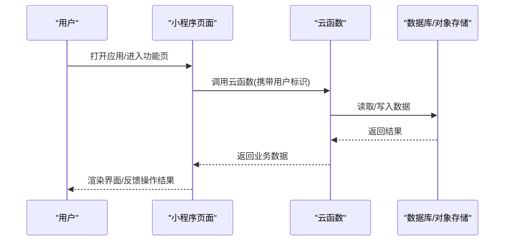

图表来源
- [app.js](file://miniprogram/app.js)
- [cloudfunctions/login/index.js](file://cloudfunctions/login/index.js)
- [cloudfunctions/getCourseList/index.js](file://cloudfunctions/getCourseList/index.js)
- [cloudfunctions/getCourseDetail/index.js](file://cloudfunctions/getCourseDetail/index.js)
- [cloudfunctions/aiChat/index.js](file://cloudfunctions/aiChat/index.js)
- [cloudfunctions/knowledgeMap/index.js](file://cloudfunctions/knowledgeMap/index.js)
- [cloudfunctions/quiz/index.js](file://cloudfunctions/quiz/index.js)
- [cloudfunctions/mistakes/index.js](file://cloudfunctions/mistakes/index.js)
- [cloudfunctions/achievements/index.js](file://cloudfunctions/achievements/index.js)
- [cloudfunctions/pet/index.js](file://cloudfunctions/pet/index.js)
- [cloudfunctions/report/index.js](file://cloudfunctions/report/index.js)
- [cloudfunctions/home/index.js](file://cloudfunctions/home/index.js)
- [cloudfunctions/settings/index.js](file://cloudfunctions/settings/index.js)
- [cloudfunctions/flashcards/index.js](file://cloudfunctions/flashcards/index.js)

## 详细组件分析

### 用户认证
- 业务逻辑
  - 触发登录：用户在登录页发起登录。
  - 会话建立：云函数验证微信登录态，返回用户标识与基础信息。
  - 权限控制：后续请求携带用户标识，用于数据隔离与个性化。
- 用户交互流程
  - 进入登录页 -> 授权登录 -> 成功跳转首页 -> 失败提示重试。
- 数据处理流程
  - 前端调用认证云函数 -> 云函数校验并返回用户信息 -> 前端缓存必要字段。
- 开发指导
  - 确保所有受保护云函数校验用户标识。
  - 对敏感操作增加二次确认与日志审计。
- 参考路径
  - [login.js](file://miniprogram/pages/login/login.js)
  - [cloudfunctions/login/index.js](file://cloudfunctions/login/index.js)

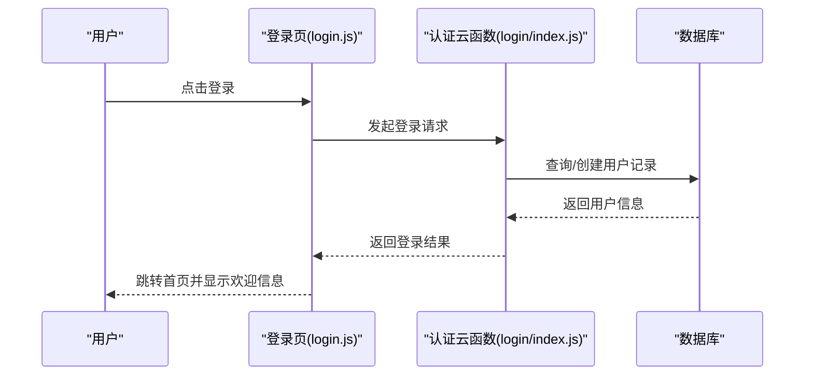

图表来源
- [login.js](file://miniprogram/pages/login/login.js)
- [cloudfunctions/login/index.js](file://cloudfunctions/login/index.js)

章节来源
- [login.js](file://miniprogram/pages/login/login.js)
- [cloudfunctions/login/index.js](file://cloudfunctions/login/index.js)

### 课程学习
- 业务逻辑
  - 课程列表：分页/筛选/搜索。
  - 课程详情：内容展示、学习进度、收藏与分享。
  - 学习记录：记录开始/结束时间、观看时长与完成状态。
- 用户交互流程
  - 首页进入课程 -> 列表浏览 -> 选择课程 -> 学习页播放/阅读 -> 返回更新进度。
- 数据处理流程
  - 前端拉取列表与详情 -> 提交学习进度 -> 云函数持久化。
- 开发指导
  - 列表接口需支持分页与缓存策略。
  - 学习进度建议增量上报，避免频繁写库。
- 参考路径
  - [course.js](file://miniprogram/pages/course/course.js)
  - [study.js](file://miniprogram/pages/study/study.js)
  - [cloudfunctions/getCourseList/index.js](file://cloudfunctions/getCourseList/index.js)
  - [cloudfunctions/getCourseDetail/index.js](file://cloudfunctions/getCourseDetail/index.js)

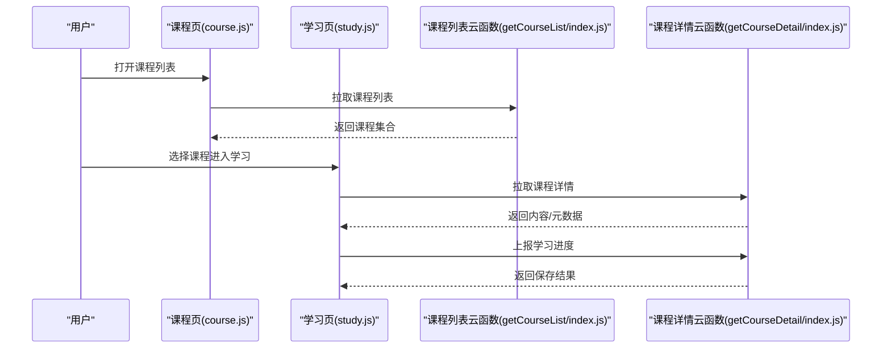

图表来源
- [course.js](file://miniprogram/pages/course/course.js)
- [study.js](file://miniprogram/pages/study/study.js)
- [cloudfunctions/getCourseList/index.js](file://cloudfunctions/getCourseList/index.js)
- [cloudfunctions/getCourseDetail/index.js](file://cloudfunctions/getCourseDetail/index.js)

章节来源
- [course.js](file://miniprogram/pages/course/course.js)
- [study.js](file://miniprogram/pages/study/study.js)
- [cloudfunctions/getCourseList/index.js](file://cloudfunctions/getCourseList/index.js)
- [cloudfunctions/getCourseDetail/index.js](file://cloudfunctions/getCourseDetail/index.js)

### AI助手
- 业务逻辑
  - 对话管理：维护上下文窗口，限制长度与轮次。
  - 安全过滤：对输入输出进行敏感词与越界检查。
  - 响应格式：结构化返回文本、引用来源与相关知识点。
- 用户交互流程
  - 输入问题 -> 发送消息 -> 流式/非流式返回 -> 展示答案与扩展链接。
- 数据处理流程
  - 前端组装消息与历史 -> 调用AI云函数 -> 云函数调用大模型/检索 -> 返回结果。
- 开发指导
  - 建议引入重试与超时处理。
  - 对长对话进行分段与摘要压缩，降低负载。
- 参考路径
  - [ai.js](file://miniprogram/pages/ai/ai.js)
  - [cloudfunctions/aiChat/index.js](file://cloudfunctions/aiChat/index.js)

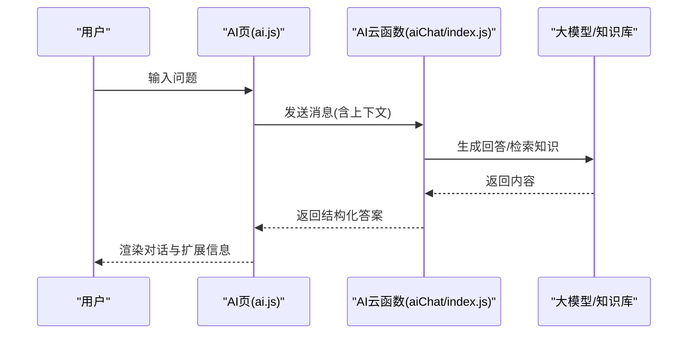

图表来源
- [ai.js](file://miniprogram/pages/ai/ai.js)
- [cloudfunctions/aiChat/index.js](file://cloudfunctions/aiChat/index.js)

章节来源
- [ai.js](file://miniprogram/pages/ai/ai.js)
- [cloudfunctions/aiChat/index.js](file://cloudfunctions/aiChat/index.js)

### 知识图谱
- 业务逻辑
  - 图谱结构：节点表示知识点，边表示先修/并列/包含关系。
  - 掌握度：基于测验与学习行为动态更新。
- 用户交互流程
  - 浏览图谱 -> 点击节点 -> 查看详情与关联内容 -> 标记掌握。
- 数据处理流程
  - 拉取图谱数据 -> 本地渲染 -> 提交掌握度变更。
- 开发指导
  - 大图场景下采用按需加载与懒渲染。
  - 掌握度更新建议批量合并上报。
- 参考路径
  - [knowledge.js](file://miniprogram/pages/knowledge/knowledge.js)
  - [map.js](file://miniprogram/pages/map/map.js)
  - [cloudfunctions/knowledgeMap/index.js](file://cloudfunctions/knowledgeMap/index.js)

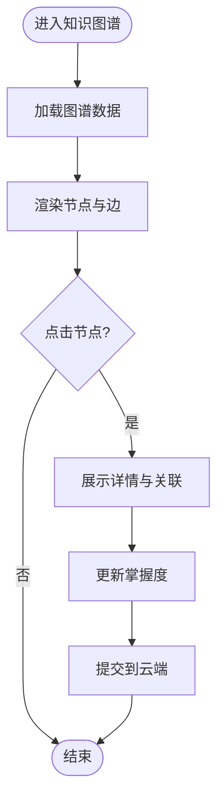

图表来源
- [knowledge.js](file://miniprogram/pages/knowledge/knowledge.js)
- [map.js](file://miniprogram/pages/map/map.js)
- [cloudfunctions/knowledgeMap/index.js](file://cloudfunctions/knowledgeMap/index.js)

章节来源
- [knowledge.js](file://miniprogram/pages/knowledge/knowledge.js)
- [map.js](file://miniprogram/pages/map/map.js)
- [cloudfunctions/knowledgeMap/index.js](file://cloudfunctions/knowledgeMap/index.js)

### 测验系统
- 业务逻辑
  - 题库组织：按知识点/难度/题型分类。
  - 评分规则：即时判分、部分正确计分、解析展示。
  - 错题沉淀：自动加入错题集，支持重练。
- 用户交互流程
  - 选择测验 -> 逐题作答 -> 提交 -> 查看总结与解析。
- 数据处理流程
  - 拉取题目 -> 提交答案 -> 计算得分与错误项 -> 写入错题集。
- 开发指导
  - 题目数据结构需稳定，便于版本演进。
  - 提交答案建议幂等，防止重复计分。
- 参考路径
  - [quiz.js](file://miniprogram/pages/quiz/quiz.js)
  - [quizSummary.js](file://miniprogram/pages/quizSummary/quizSummary.js)
  - [cloudfunctions/quiz/index.js](file://cloudfunctions/quiz/index.js)

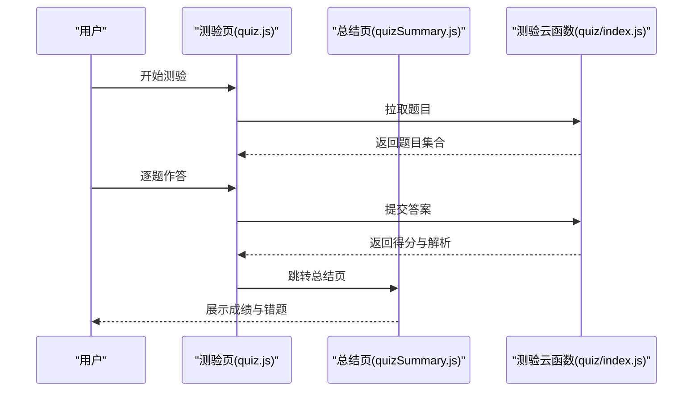

图表来源
- [quiz.js](file://miniprogram/pages/quiz/quiz.js)
- [quizSummary.js](file://miniprogram/pages/quizSummary/quizSummary.js)
- [cloudfunctions/quiz/index.js](file://cloudfunctions/quiz/index.js)

章节来源
- [quiz.js](file://miniprogram/pages/quiz/quiz.js)
- [quizSummary.js](file://miniprogram/pages/quizSummary/quizSummary.js)
- [cloudfunctions/quiz/index.js](file://cloudfunctions/quiz/index.js)

### 错题管理
- 业务逻辑
  - 错题入库：测验错误自动收录，支持手动添加。
  - 复习策略：按知识点聚合、间隔重复推荐。
- 用户交互流程
  - 查看错题列表 -> 查看详情与解析 -> 一键重练。
- 数据处理流程
  - 同步错题清单 -> 更新掌握度与练习次数。
- 开发指导
  - 错题去重策略需明确（按题目ID或哈希）。
  - 批量操作注意事务一致性。
- 参考路径
  - [mistakes.js](file://miniprogram/pages/mistakes/mistakes.js)
  - [cloudfunctions/mistakes/index.js](file://cloudfunctions/mistakes/index.js)

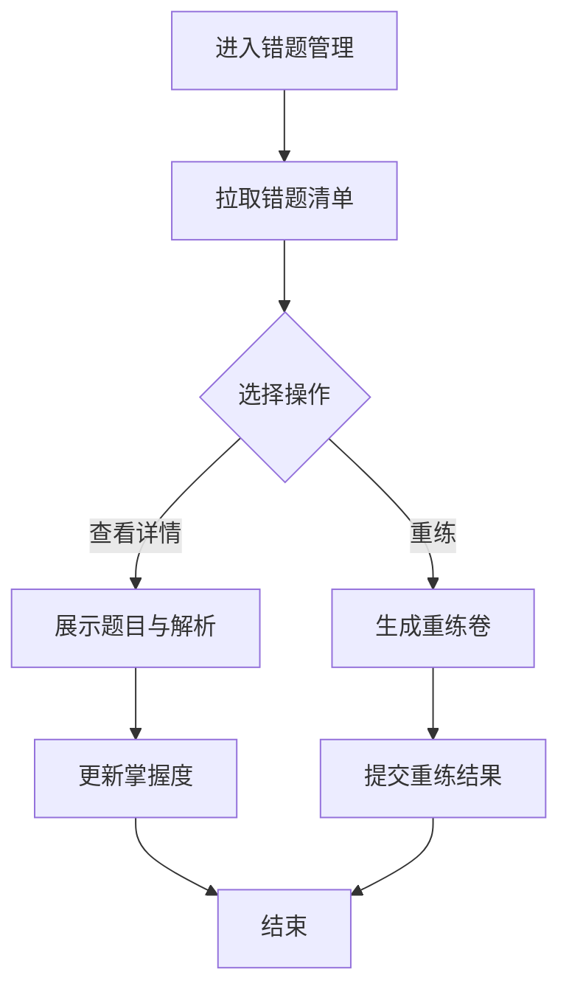

图表来源
- [mistakes.js](file://miniprogram/pages/mistakes/mistakes.js)
- [cloudfunctions/mistakes/index.js](file://cloudfunctions/mistakes/index.js)

章节来源
- [mistakes.js](file://miniprogram/pages/mistakes/mistakes.js)
- [cloudfunctions/mistakes/index.js](file://cloudfunctions/mistakes/index.js)

### 成就系统
- 业务逻辑
  - 成就定义：阈值型与里程碑型成就。
  - 行为映射：学习时长、测验正确率、连续打卡等。
- 用户交互流程
  - 查看成就面板 -> 了解条件与进度 -> 解锁通知。
- 数据处理流程
  - 累积行为事件 -> 判定解锁 -> 记录成就。
- 开发指导
  - 成就判定建议在云端集中执行，保证一致性与公平性。
- 参考路径
  - [achievements.js](file://miniprogram/pages/achievements/achievements.js)
  - [cloudfunctions/achievements/index.js](file://cloudfunctions/achievements/index.js)

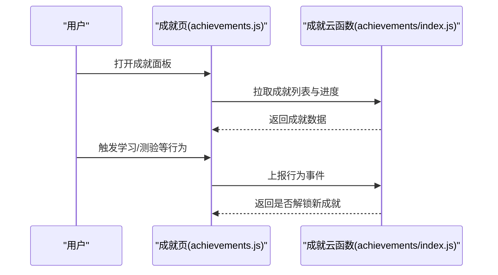

图表来源
- [achievements.js](file://miniprogram/pages/achievements/achievements.js)
- [cloudfunctions/achievements/index.js](file://cloudfunctions/achievements/index.js)

章节来源
- [achievements.js](file://miniprogram/pages/achievements/achievements.js)
- [cloudfunctions/achievements/index.js](file://cloudfunctions/achievements/index.js)

### 宠物养成
- 业务逻辑
  - 成长机制：经验值、等级、属性与外观。
  - 行为转化：学习、测验、打卡转化为资源。
- 用户交互流程
  - 进入宠物页 -> 喂养/训练 -> 查看成长与外观变化。
- 数据处理流程
  - 同步宠物状态 -> 更新经验与等级 -> 联动成就与报告。
- 开发指导
  - 宠物状态变更需幂等与防抖，避免并发导致不一致。
- 参考路径
  - [pet.js](file://miniprogram/pages/pet/pet.js)
  - [cloudfunctions/pet/index.js](file://cloudfunctions/pet/index.js)

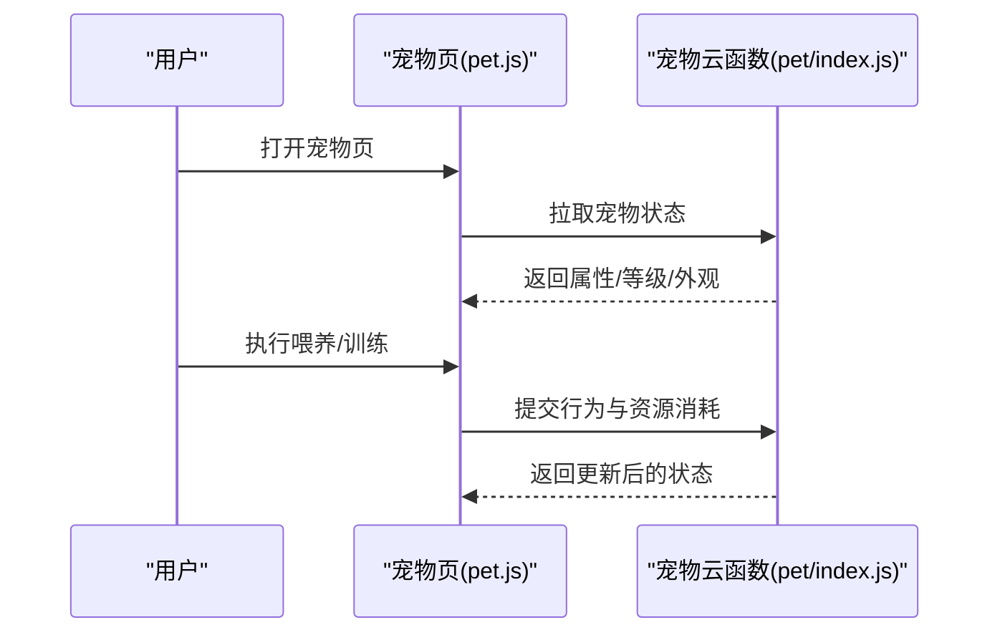

图表来源
- [pet.js](file://miniprogram/pages/pet/pet.js)
- [cloudfunctions/pet/index.js](file://cloudfunctions/pet/index.js)

章节来源
- [pet.js](file://miniprogram/pages/pet/pet.js)
- [cloudfunctions/pet/index.js](file://cloudfunctions/pet/index.js)

### 学习报告
- 业务逻辑
  - 指标体系：学习时长、正确率、薄弱知识点、趋势曲线。
  - 周期维度：日/周/月视图，支持对比与导出。
- 用户交互流程
  - 进入报告页 -> 选择周期 -> 查看图表与建议。
- 数据处理流程
  - 聚合测验、学习、错题等行为数据 -> 生成统计指标。
- 开发指导
  - 报表计算建议异步与缓存，减少冷启动延迟。
- 参考路径
  - [report.js](file://miniprogram/pages/report/report.js)
  - [cloudfunctions/report/index.js](file://cloudfunctions/report/index.js)

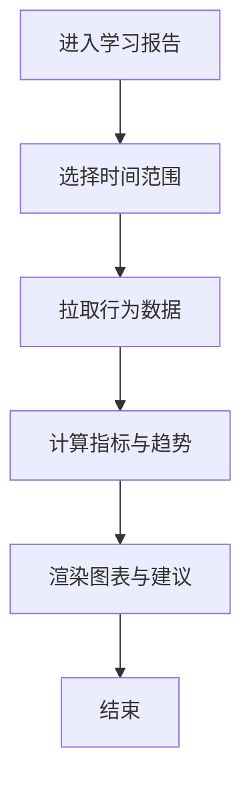

图表来源
- [report.js](file://miniprogram/pages/report/report.js)
- [cloudfunctions/report/index.js](file://cloudfunctions/report/index.js)

章节来源
- [report.js](file://miniprogram/pages/report/report.js)
- [cloudfunctions/report/index.js](file://cloudfunctions/report/index.js)

### 个人中心与设置
- 业务逻辑
  - 个人信息：头像、昵称、学习偏好。
  - 设置项：主题、通知、隐私与账号管理。
- 用户交互流程
  - 进入个人中心 -> 编辑资料/调整设置 -> 保存生效。
- 数据处理流程
  - 读写用户偏好与账户信息。
- 开发指导
  - 设置变更应即时生效并跨端同步。
- 参考路径
  - [profile.js](file://miniprogram/pages/profile/profile.js)
  - [settings.js](file://miniprogram/pages/settings/settings.js)
  - [cloudfunctions/settings/index.js](file://cloudfunctions/settings/index.js)

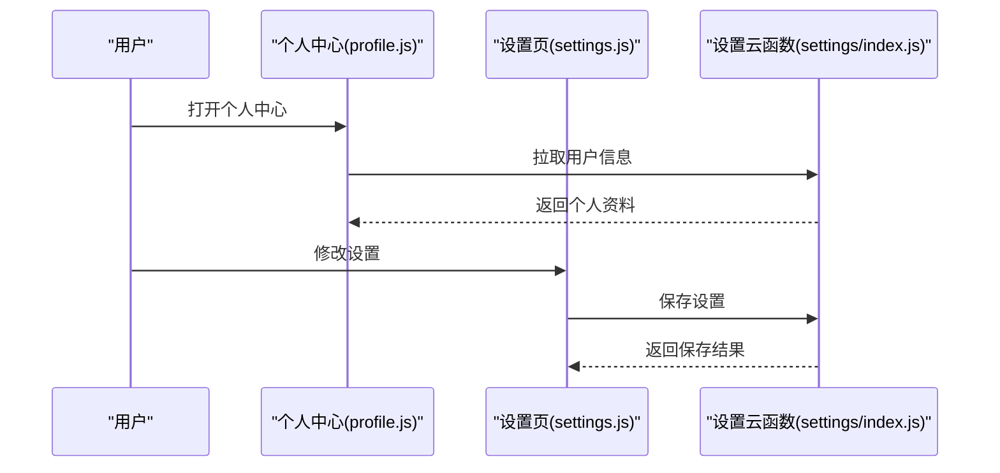

图表来源
- [profile.js](file://miniprogram/pages/profile/profile.js)
- [settings.js](file://miniprogram/pages/settings/settings.js)
- [cloudfunctions/settings/index.js](file://cloudfunctions/settings/index.js)

章节来源
- [profile.js](file://miniprogram/pages/profile/profile.js)
- [settings.js](file://miniprogram/pages/settings/settings.js)
- [cloudfunctions/settings/index.js](file://cloudfunctions/settings/index.js)

### 首页与全局
- 业务逻辑
  - 聚合入口：课程、测验、AI、知识图谱、错题、成就、宠物、报告。
  - 个性化推荐：基于用户画像与近期行为。
- 用户交互流程
  - 进入首页 -> 浏览推荐与入口 -> 跳转到对应功能。
- 数据处理流程
  - 拉取个性化数据与概览指标。
- 开发指导
  - 首页数据建议分层加载，优先展示关键入口。
- 参考路径
  - [home.js](file://miniprogram/pages/home/home.js)
  - [cloudfunctions/home/index.js](file://cloudfunctions/home/index.js)

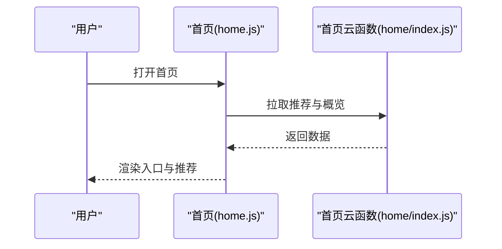

图表来源
- [home.js](file://miniprogram/pages/home/home.js)
- [cloudfunctions/home/index.js](file://cloudfunctions/home/index.js)

章节来源
- [home.js](file://miniprogram/pages/home/home.js)
- [cloudfunctions/home/index.js](file://cloudfunctions/home/index.js)

### 闪卡复习
- 业务逻辑
  - 间隔重复：根据掌握度安排复习间隔。
  - 卡片管理：增删改查、标签与难度。
- 用户交互流程
  - 进入闪卡页 -> 翻牌回忆 -> 标记掌握 -> 安排下次复习。
- 数据处理流程
  - 维护卡片队列与复习计划。
- 开发指导
  - 复习算法需可配置，便于A/B测试与调优。
- 参考路径
  - [flashcards.js](file://miniprogram/pages/flashcards/flashcards.js)
  - [cloudfunctions/flashcards/index.js](file://cloudfunctions/flashcards/index.js)

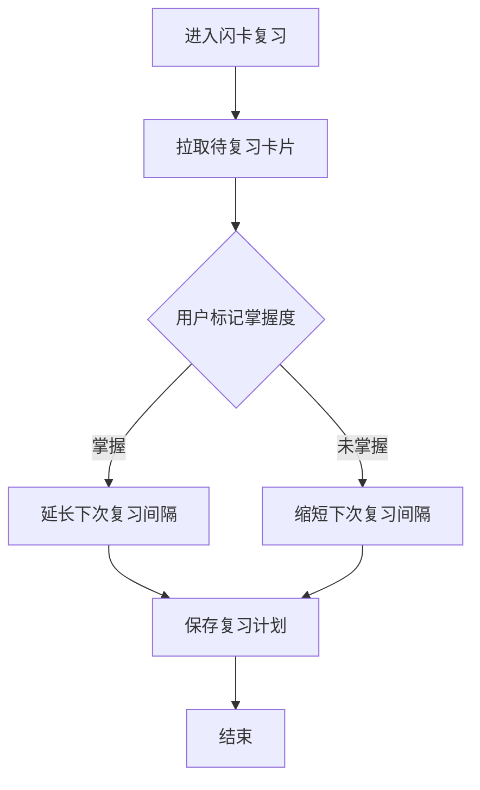

图表来源
- [flashcards.js](file://miniprogram/pages/flashcards/flashcards.js)
- [cloudfunctions/flashcards/index.js](file://cloudfunctions/flashcards/index.js)

章节来源
- [flashcards.js](file://miniprogram/pages/flashcards/flashcards.js)
- [cloudfunctions/flashcards/index.js](file://cloudfunctions/flashcards/index.js)

## 依赖分析
模块间耦合关系如下：
- 认证为所有受保护模块的基础依赖。
- 课程与测验驱动错题与报告的数据源。
- 成就与宠物由学习/测验行为共同驱动。
- 知识图谱与AI助手为学习提供辅助。
- 首页聚合多模块入口与推荐。

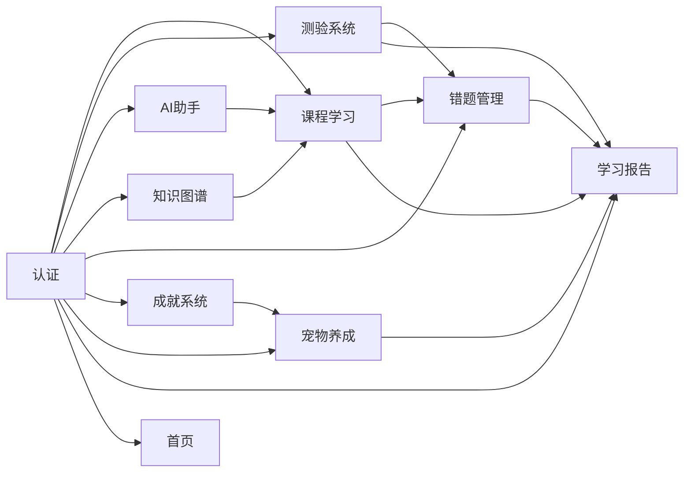

图表来源
- [cloudfunctions/login/index.js](file://cloudfunctions/login/index.js)
- [cloudfunctions/getCourseList/index.js](file://cloudfunctions/getCourseList/index.js)
- [cloudfunctions/getCourseDetail/index.js](file://cloudfunctions/getCourseDetail/index.js)
- [cloudfunctions/aiChat/index.js](file://cloudfunctions/aiChat/index.js)
- [cloudfunctions/knowledgeMap/index.js](file://cloudfunctions/knowledgeMap/index.js)
- [cloudfunctions/quiz/index.js](file://cloudfunctions/quiz/index.js)
- [cloudfunctions/mistakes/index.js](file://cloudfunctions/mistakes/index.js)
- [cloudfunctions/achievements/index.js](file://cloudfunctions/achievements/index.js)
- [cloudfunctions/pet/index.js](file://cloudfunctions/pet/index.js)
- [cloudfunctions/report/index.js](file://cloudfunctions/report/index.js)
- [cloudfunctions/home/index.js](file://cloudfunctions/home/index.js)

章节来源
- [cloudfunctions/login/index.js](file://cloudfunctions/login/index.js)
- [cloudfunctions/getCourseList/index.js](file://cloudfunctions/getCourseList/index.js)
- [cloudfunctions/getCourseDetail/index.js](file://cloudfunctions/getCourseDetail/index.js)
- [cloudfunctions/aiChat/index.js](file://cloudfunctions/aiChat/index.js)
- [cloudfunctions/knowledgeMap/index.js](file://cloudfunctions/knowledgeMap/index.js)
- [cloudfunctions/quiz/index.js](file://cloudfunctions/quiz/index.js)
- [cloudfunctions/mistakes/index.js](file://cloudfunctions/mistakes/index.js)
- [cloudfunctions/achievements/index.js](file://cloudfunctions/achievements/index.js)
- [cloudfunctions/pet/index.js](file://cloudfunctions/pet/index.js)
- [cloudfunctions/report/index.js](file://cloudfunctions/report/index.js)
- [cloudfunctions/home/index.js](file://cloudfunctions/home/index.js)

## 性能考虑
- 列表与详情：分页加载、按需渲染、图片与媒体资源优化。
- 云函数：批处理与缓存，避免热点键单点瓶颈。
- 前端：节流/防抖、骨架屏与降级策略。
- 大数据量：知识图谱与报告采用懒加载与离线缓存。
- 稳定性：重试、超时与熔断策略，保障用户体验。

## 故障排查指南
- 认证失败
  - 检查登录态是否有效、云函数鉴权逻辑是否正确。
  - 参考路径
    - [login.js](file://miniprogram/pages/login/login.js)
    - [cloudfunctions/login/index.js](file://cloudfunctions/login/index.js)
- 课程加载异常
  - 核对列表与详情接口参数、分页与缓存命中情况。
  - 参考路径
    - [course.js](file://miniprogram/pages/course/course.js)
    - [cloudfunctions/getCourseList/index.js](file://cloudfunctions/getCourseList/index.js)
    - [cloudfunctions/getCourseDetail/index.js](file://cloudfunctions/getCourseDetail/index.js)
- AI无响应或超时
  - 检查网络、重试策略与大模型服务可用性。
  - 参考路径
    - [ai.js](file://miniprogram/pages/ai/ai.js)
    - [cloudfunctions/aiChat/index.js](file://cloudfunctions/aiChat/index.js)
- 测验计分异常
  - 确认答案提交幂等、评分规则与错题入库一致性。
  - 参考路径
    - [quiz.js](file://miniprogram/pages/quiz/quiz.js)
    - [cloudfunctions/quiz/index.js](file://cloudfunctions/quiz/index.js)
- 错题不同步
  - 检查去重策略与批量写入事务。
  - 参考路径
    - [mistakes.js](file://miniprogram/pages/mistakes/mistakes.js)
    - [cloudfunctions/mistakes/index.js](file://cloudfunctions/mistakes/index.js)
- 成就未解锁
  - 核对行为事件上报与判定逻辑。
  - 参考路径
    - [achievements.js](file://miniprogram/pages/achievements/achievements.js)
    - [cloudfunctions/achievements/index.js](file://cloudfunctions/achievements/index.js)
- 宠物状态不一致
  - 检查并发更新与幂等处理。
  - 参考路径
    - [pet.js](file://miniprogram/pages/pet/pet.js)
    - [cloudfunctions/pet/index.js](file://cloudfunctions/pet/index.js)
- 报告数据缺失
  - 核对聚合任务与缓存失效策略。
  - 参考路径
    - [report.js](file://miniprogram/pages/report/report.js)
    - [cloudfunctions/report/index.js](file://cloudfunctions/report/index.js)

章节来源
- [login.js](file://miniprogram/pages/login/login.js)
- [cloudfunctions/login/index.js](file://cloudfunctions/login/index.js)
- [course.js](file://miniprogram/pages/course/course.js)
- [cloudfunctions/getCourseList/index.js](file://cloudfunctions/getCourseList/index.js)
- [cloudfunctions/getCourseDetail/index.js](file://cloudfunctions/getCourseDetail/index.js)
- [ai.js](file://miniprogram/pages/ai/ai.js)
- [cloudfunctions/aiChat/index.js](file://cloudfunctions/aiChat/index.js)
- [quiz.js](file://miniprogram/pages/quiz/quiz.js)
- [cloudfunctions/quiz/index.js](file://cloudfunctions/quiz/index.js)
- [mistakes.js](file://miniprogram/pages/mistakes/mistakes.js)
- [cloudfunctions/mistakes/index.js](file://cloudfunctions/mistakes/index.js)
- [achievements.js](file://miniprogram/pages/achievements/achievements.js)
- [cloudfunctions/achievements/index.js](file://cloudfunctions/achievements/index.js)
- [pet.js](file://miniprogram/pages/pet/pet.js)
- [cloudfunctions/pet/index.js](file://cloudfunctions/pet/index.js)
- [report.js](file://miniprogram/pages/report/report.js)
- [cloudfunctions/report/index.js](file://cloudfunctions/report/index.js)

## 结论
本方案以模块化与云原生为核心，构建了完整的生物学习生态。通过清晰的职责划分与标准化的数据流转，各模块既能独立演进，又能协同工作，为用户提供系统化、趣味化与个性化的学习体验。后续可在性能优化、算法调参与体验打磨方面持续迭代。

## 附录
- 术语表
  - 云函数：服务端无服务器函数，承载业务逻辑与数据访问。
  - 掌握度：用户对知识点的熟悉程度量化指标。
  - 间隔重复：基于遗忘曲线的复习策略。
- 最佳实践
  - 接口幂等、错误码规范、日志与监控完善。
  - 前端组件复用与状态管理规范化。
  - 数据安全与隐私合规。