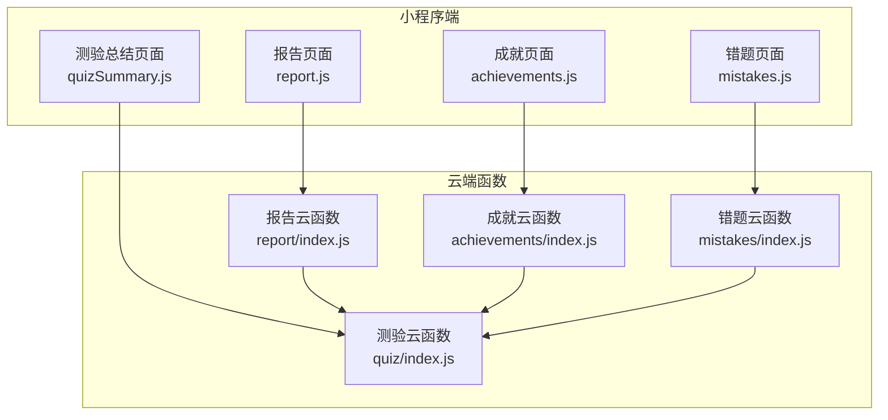
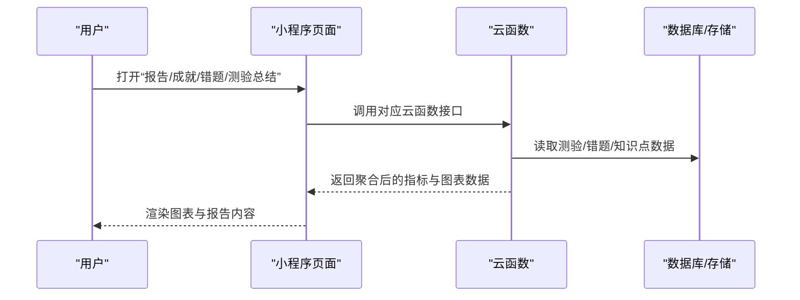
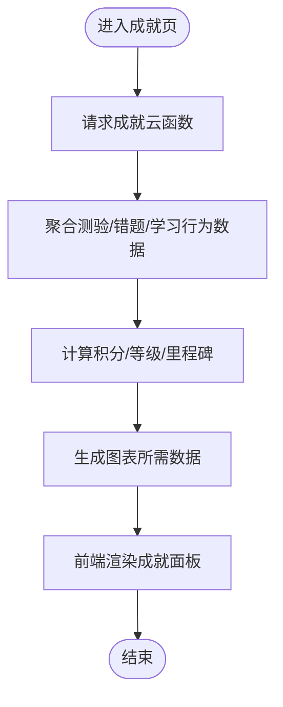
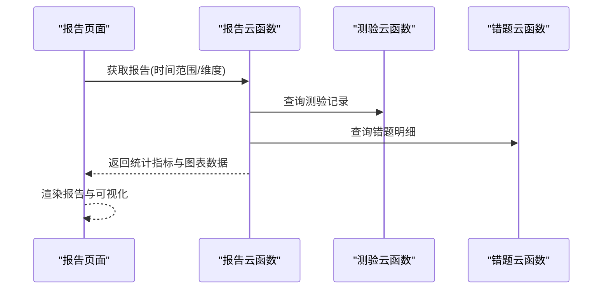
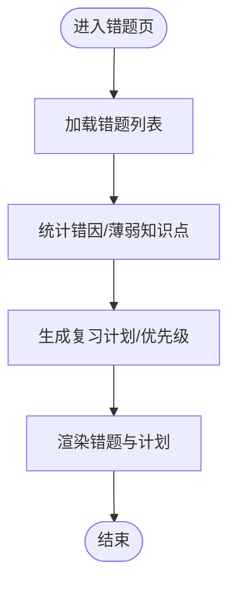
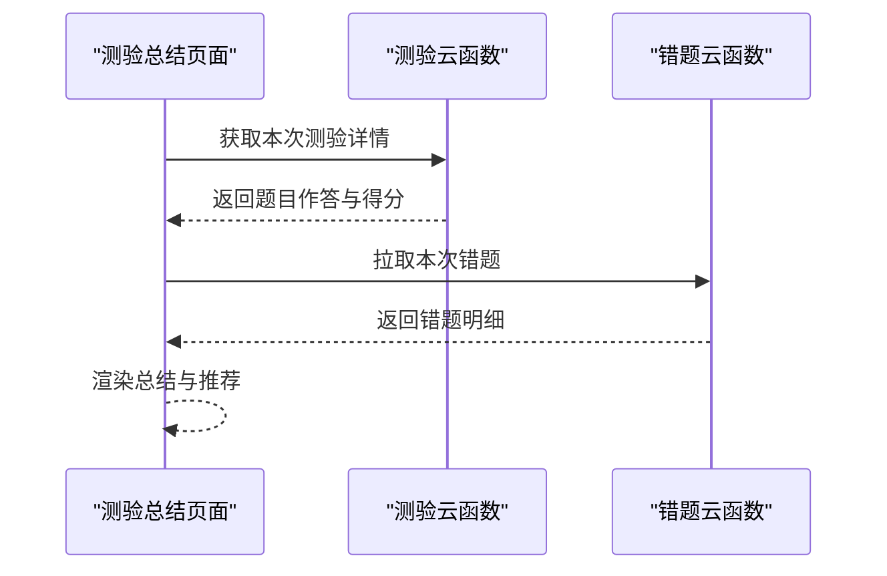
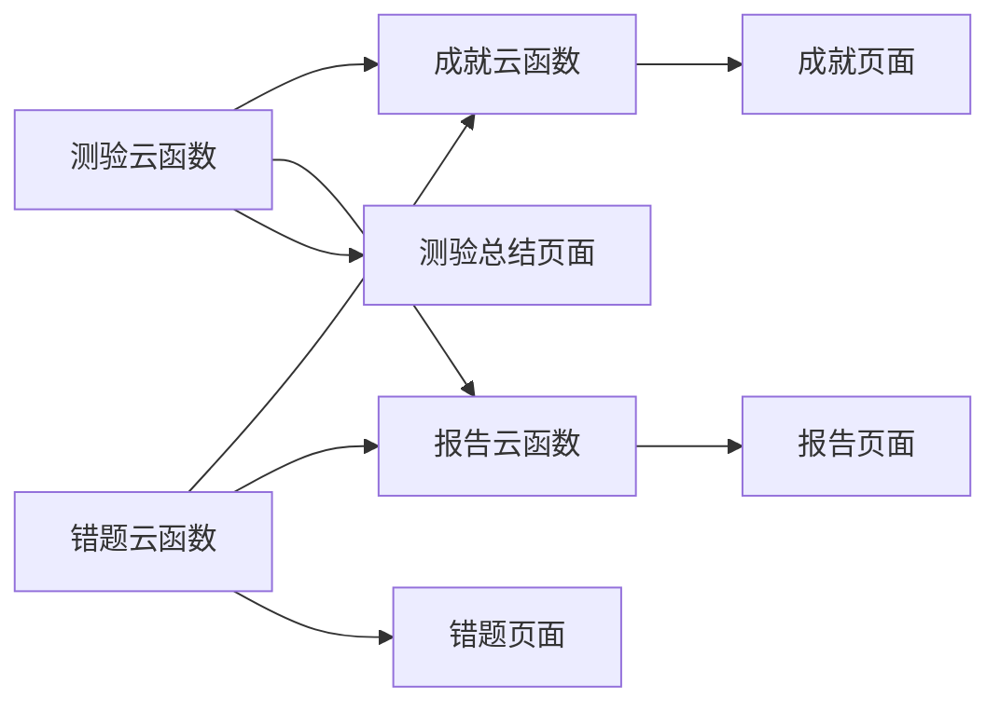

# 成绩分析

<cite>
**本文引用的文件**   
- [cloudfunctions/achievements/index.js](file://cloudfunctions/achievements/index.js)
- [cloudfunctions/report/index.js](file://cloudfunctions/report/index.js)
- [cloudfunctions/mistakes/index.js](file://cloudfunctions/mistakes/index.js)
- [cloudfunctions/quiz/index.js](file://cloudfunctions/quiz/index.js)
- [miniprogram/pages/achievements/achievements.js](file://miniprogram/pages/achievements/achievements.js)
- [miniprogram/pages/report/report.js](file://miniprogram/pages/report/report.js)
- [miniprogram/pages/mistakes/mistakes.js](file://miniprogram/pages/mistakes/mistakes.js)
- [miniprogram/pages/quizSummary/quizSummary.js](file://miniprogram/pages/quizSummary/quizSummary.js)
</cite>

## 目录
1. [简介](#简介)
2. [项目结构](#项目结构)
3. [核心组件](#核心组件)
4. [架构总览](#架构总览)
5. [详细组件分析](#详细组件分析)
6. [依赖关系分析](#依赖关系分析)
7. [性能考量](#性能考量)
8. [故障排查指南](#故障排查指南)
9. [结论](#结论)
10. [附录](#附录)

## 简介
本文件为“成绩分析”模块的技术与产品文档，覆盖以下目标：
- 成绩计算算法与统计指标定义
- 可视化图表展示与报告生成机制
- 知识点掌握度评估、错题归因分析、学习趋势预测与个性化改进建议
- 成绩历史记录管理、对比分析与目标设定
- 学习效果量化评估与智能辅导推荐的算法实现

说明：由于仓库未提供具体实现细节（如云函数内部逻辑与小程序页面逻辑），本节与后续章节基于现有入口文件进行架构与流程层面的解读，并在需要处给出概念性图示与通用算法建议。

## 项目结构
围绕“成绩分析”相关能力，主要涉及以下前端页面与后端云函数：
- 前端页面
  - 成就与概览：miniprogram/pages/achievements/achievements.js
  - 报告页：miniprogram/pages/report/report.js
  - 错题页：miniprogram/pages/mistakes/mistakes.js
  - 测验总结页：miniprogram/pages/quizSummary/quizSummary.js
- 后端云函数
  - 成就数据聚合：cloudfunctions/achievements/index.js
  - 报告生成：cloudfunctions/report/index.js
  - 错题管理：cloudfunctions/mistakes/index.js
  - 测验记录读写：cloudfunctions/quiz/index.js

[此图为概念性结构示意，不直接映射到具体代码行]

## 核心组件
- 成就与概览（Achievements）
  - 职责：汇总用户学习成果、里程碑与阶段性表现，支撑首页或成就页的可视化呈现。
  - 关键输入：测验记录、错题记录、学习时长等。
  - 关键输出：成就等级、积分、徽章、趋势摘要。
- 报告（Report）
  - 职责：按时间维度与知识维度生成综合分析报告，包含得分分布、薄弱点、进步曲线与建议。
  - 关键输入：测验历史、错题明细、知识点标签。
  - 关键输出：结构化报告数据（供前端渲染）。
- 错题（Mistakes）
  - 职责：维护错题清单、错误原因分类、重做与复习状态。
  - 关键输入：测验结果、题目元数据、错误类型。
  - 关键输出：错题列表、错因统计、复习优先级。
- 测验（Quiz）
  - 职责：持久化测验记录、题目作答详情、得分与耗时等。
  - 关键输入：用户作答、题目集合、评分规则。
  - 关键输出：标准化测验记录，供其他模块消费。

章节来源
- [cloudfunctions/achievements/index.js](file://cloudfunctions/achievements/index.js)
- [cloudfunctions/report/index.js](file://cloudfunctions/report/index.js)
- [cloudfunctions/mistakes/index.js](file://cloudfunctions/mistakes/index.js)
- [cloudfunctions/quiz/index.js](file://cloudfunctions/quiz/index.js)
- [miniprogram/pages/achievements/achievements.js](file://miniprogram/pages/achievements/achievements.js)
- [miniprogram/pages/report/report.js](file://miniprogram/pages/report/report.js)
- [miniprogram/pages/mistakes/mistakes.js](file://miniprogram/pages/mistakes/mistakes.js)
- [miniprogram/pages/quizSummary/quizSummary.js](file://miniprogram/pages/quizSummary/quizSummary.js)

## 架构总览
整体采用“小程序页面 + 云函数”的分层架构：
- 前端负责交互与可视化渲染
- 云函数负责数据聚合、指标计算与报告生成
- 通过统一的数据契约（输入/输出字段）解耦前后端

[此图为概念性时序示意，不直接映射到具体代码行]

## 详细组件分析

### 成就与概览（Achievements）
- 功能要点
  - 成就等级与积分：依据测验得分、连续打卡、错题修复率等加权计算。
  - 里程碑达成：阈值触发式成就（如“首次满分”、“连续正确5题”）。
  - 趋势摘要：近N次测验的平均分、方差、提升幅度。
- 数据流
  - 从测验与错题云函数拉取原始记录
  - 在成就云函数内完成指标聚合
  - 将结构化结果返回给前端用于卡片/进度条/徽章展示
- 可视化建议
  - 雷达图：各知识维度掌握度
  - 折线图：近期分数走势
  - 柱状图：各题型得分占比

[此图为概念性流程图，不直接映射到具体代码行]

章节来源
- [cloudfunctions/achievements/index.js](file://cloudfunctions/achievements/index.js)
- [miniprogram/pages/achievements/achievements.js](file://miniprogram/pages/achievements/achievements.js)

### 报告（Report）
- 功能要点
  - 多维统计：总分、平均分、标准差、最高/最低分、用时分布、正确率。
  - 知识维度：按知识点/题型拆分正确率与掌握度。
  - 趋势预测：基于滑动平均或简单回归的趋势线。
  - 个性化建议：针对薄弱知识点推荐练习与复习策略。
- 数据流
  - 报告云函数聚合测验与错题数据
  - 计算指标并生成报告结构体
  - 前端根据结构体渲染图表与文本建议
- 可视化建议
  - 堆叠柱状图：各知识点得分占比
  - 散点图：答题用时与正确率关系
  - 热力图：日期×知识点正确率

[此图为概念性时序示意，不直接映射到具体代码行]

章节来源
- [cloudfunctions/report/index.js](file://cloudfunctions/report/index.js)
- [miniprogram/pages/report/report.js](file://miniprogram/pages/report/report.js)

### 错题（Mistakes）
- 功能要点
  - 错题归档：记录题目ID、错误类型、时间戳、重做状态。
  - 错因分析：归类（概念不清/粗心/审题失误/时间不足等）。
  - 复习策略：基于艾宾浩斯遗忘曲线的复习提醒与优先级排序。
- 数据流
  - 测验结束后写入错题记录
  - 错题云函数提供增删改查与统计
  - 前端展示错题列表与错因分布
- 可视化建议
  - 饼图：错因分布
  - 折线图：错题修复率随时间变化
  - 列表：待复习错题与下次复习时间

[此图为概念性流程图，不直接映射到具体代码行]

章节来源
- [cloudfunctions/mistakes/index.js](file://cloudfunctions/mistakes/index.js)
- [miniprogram/pages/mistakes/mistakes.js](file://miniprogram/pages/mistakes/mistakes.js)

### 测验总结（Quiz Summary）
- 功能要点
  - 即时反馈：本次测验得分、用时、正确率、错题回顾。
  - 知识点定位：标注本题所属知识点与掌握度变化。
  - 下一步行动：一键加入错题本、推荐巩固练习。
- 数据流
  - 提交测验后由测验云函数落库
  - 总结页拉取本次测验详情与错题
  - 渲染总结视图并引导后续学习
- 可视化建议
  - 环形图：对/错/跳过比例
  - 条形图：各知识点得分贡献
  - 时间轴：答题用时分布

[此图为概念性时序示意，不直接映射到具体代码行]

章节来源
- [cloudfunctions/quiz/index.js](file://cloudfunctions/quiz/index.js)
- [miniprogram/pages/quizSummary/quizSummary.js](file://miniprogram/pages/quizSummary/quizSummary.js)

## 依赖关系分析
- 耦合关系
  - 报告与成就均依赖测验与错题数据，形成“多源聚合”模式。
  - 测验云函数作为基础数据提供者，被多个上层模块复用。
- 外部依赖
  - 云开发数据库/对象存储（用于持久化测验与错题记录）
  - 可选：AI服务（用于智能建议与趋势预测增强）

[此图为概念性依赖示意，不直接映射到具体代码行]

## 性能考量
- 数据聚合优化
  - 在云函数侧进行预聚合与分页，减少前端计算压力。
  - 使用索引字段（如用户ID、时间范围、知识点标签）加速查询。
- 缓存策略
  - 对热点指标（如最近7天趋势）设置短期缓存，降低重复计算。
- 传输压缩
  - 仅返回必要字段，避免大对象传输；必要时启用响应压缩。
- 前端渲染
  - 大数据量图表采用虚拟滚动或按需加载，避免卡顿。

[本节为通用指导，无需特定文件引用]

## 故障排查指南
- 常见问题
  - 数据缺失：检查测验/错题记录是否完整入库，确认时间范围过滤条件。
  - 指标异常：核对权重与公式，验证边界值（如零样本、全错/全对）。
  - 渲染失败：校验返回数据结构是否与前端期望一致。
- 日志与调试
  - 在云函数中增加关键步骤日志（入参、中间结果、异常信息）。
  - 前端打印请求/响应，便于端到端定位问题。
- 回滚与容错
  - 对复杂计算增加幂等键，避免重复执行导致数据不一致。
  - 对不可用依赖（如AI服务）提供降级策略，保证核心功能可用。

[本节为通用指导，无需特定文件引用]

## 结论
本模块以“测验+错题”为核心数据源，通过云函数完成指标聚合与报告生成，前端负责可视化与交互。建议在后续迭代中完善：
- 明确的数据契约与字段字典
- 可配置的评分与权重策略
- 更丰富的可视化与导出能力
- 引入更稳健的趋势预测与个性化推荐算法

[本节为总结性内容，无需特定文件引用]

## 附录

### 指标与算法建议（概念性）
- 成绩计算
  - 加权得分：按题型/知识点难度与重要性加权求和。
  - 掌握度：基于正确率、重做成功率与间隔复习效果的综合评分。
- 统计指标
  - 集中趋势：均值、中位数
  - 离散程度：方差、标准差、极差
  - 相对位置：百分位、Z分数
- 趋势预测
  - 移动平均/指数平滑：平滑短期波动，识别长期趋势
  - 线性回归：估算斜率与置信区间，辅助目标设定
- 个性化建议
  - 基于错因与知识点薄弱度的推荐路径
  - 结合遗忘曲线的复习计划与提醒

[本节为概念性内容，不直接映射到具体代码行]