# 测验系统

<cite>
**本文引用的文件**   
- [cloudfunctions/quiz/index.js](file://cloudfunctions/quiz/index.js)
- [cloudfunctions/quiz/config.json](file://cloudfunctions/quiz/config.json)
- [cloudfunctions/quiz/jest.config.js](file://cloudfunctions/quiz/jest.config.js)
- [cloudfunctions/quiz/__mocks__/wx-server-sdk.js](file://cloudfunctions/quiz/__mocks__/wx-server-sdk.js)
- [cloudfunctions/quiz/test/quiz.test.js](file://cloudfunctions/quiz/test/quiz.test.js)
- [miniprogram/pages/quiz/quiz.js](file://miniprogram/pages/quiz/quiz.js)
- [miniprogram/pages/quiz/quiz.wxml](file://miniprogram/pages/quiz/quiz.wxml)
- [miniprogram/pages/quizEntry/quizEntry.js](file://miniprogram/pages/quizEntry/quizEntry.js)
- [miniprogram/pages/quizEntry/quizEntry.wxml](file://miniprogram/pages/quizEntry/quizEntry.wxml)
- [miniprogram/pages/quizEntry/quizEntry.wxss](file://miniprogram/pages/quizEntry/quizEntry.wxss)
- [miniprogram/pages/quizSummary/quizSummary.js](file://miniprogram/pages/quizSummary/quizSummary.js)
- [miniprogram/pages/quizSummary/quizSummary.wxml](file://miniprogram/pages/quizSummary/quizSummary.wxml)
- [miniprogram/app.js](file://miniprogram/app.js)
</cite>

## 更新摘要
**变更内容**   
- 为测验系统添加了完整的测试基础设施，包括Jest配置、WeChat SDK模拟和专用测试套件
- quiz入口页面进行了调整以与云函数更新保持一致性
- 增强了代码质量和可维护性，通过自动化测试确保功能稳定性
- 完善了开发工作流程，支持单元测试和集成测试

## 目录
1. [简介](#简介)
2. [项目结构](#项目结构)
3. [核心组件](#核心组件)
4. [架构总览](#架构总览)
5. [详细组件分析](#详细组件分析)
6. [测试基础设施](#测试基础设施)
7. [依赖关系分析](#依赖关系分析)
8. [性能考虑](#性能考虑)
9. [故障排查指南](#故障排查指南)
10. [结论](#结论)
11. [附录](#附录)

## 简介
本文件面向"测验系统"的完整实现，覆盖题目管理、答题逻辑、成绩计算与统计分析。文档从数据结构设计、随机出题算法、答案验证机制、分数统计到时间控制与防作弊措施进行系统化说明，并提供成绩分析与个性化推荐的技术方案。内容以仓库中的云函数与小程序页面为依据，确保可追溯与可落地。

**重大更新** 本次更新为测验系统引入了全面的测试基础设施，包括Jest测试框架配置、WeChat SDK模拟环境和专用的测试套件，显著提升了代码质量和可维护性。同时quiz入口页面进行了调整以确保与云函数更新的兼容性。

## 项目结构
测验系统由小程序前端与云函数后端组成：
- 小程序端负责用户交互、计时器、提交与结果展示
- 云函数端负责题库查询、随机出题、答案校验、成绩记录与分析
- 新增测试层提供完整的单元测试和集成测试支持

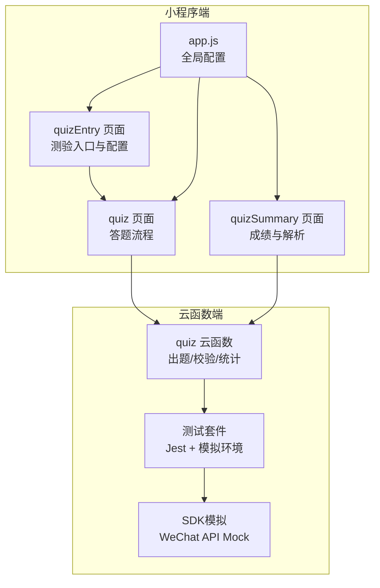

图表来源
- [miniprogram/pages/quizEntry/quizEntry.js](file://miniprogram/pages/quizEntry/quizEntry.js)
- [miniprogram/pages/quiz/quiz.js](file://miniprogram/pages/quiz/quiz.js)
- [miniprogram/pages/quizSummary/quizSummary.js](file://miniprogram/pages/quizSummary/quizSummary.js)
- [cloudfunctions/quiz/index.js](file://cloudfunctions/quiz/index.js)
- [cloudfunctions/quiz/test/quiz.test.js](file://cloudfunctions/quiz/test/quiz.test.js)
- [cloudfunctions/quiz/__mocks__/wx-server-sdk.js](file://cloudfunctions/quiz/__mocks__/wx-server-sdk.js)
- [miniprogram/app.js](file://miniprogram/app.js)

章节来源
- [miniprogram/pages/quizEntry/quizEntry.js](file://miniprogram/pages/quizEntry/quizEntry.js)
- [miniprogram/pages/quizEntry/quizEntry.wxml](file://miniprogram/pages/quizEntry/quizEntry.wxml)
- [miniprogram/pages/quizEntry/quizEntry.wxss](file://miniprogram/pages/quizEntry/quizEntry.wxss)
- [miniprogram/pages/quiz/quiz.js](file://miniprogram/pages/quiz/quiz.js)
- [miniprogram/pages/quizSummary/quizSummary.js](file://miniprogram/pages/quizSummary/quizSummary.js)
- [cloudfunctions/quiz/index.js](file://cloudfunctions/quiz/index.js)
- [miniprogram/app.js](file://miniprogram/app.js)

## 核心组件
- 题目管理
  - 题型支持：单选、多选、填空
  - 字段建议：id、题干、选项（单选/多选）、正确答案（单选为字符串或索引；多选为数组；填空为标准化后的期望值集合）、难度、知识点标签、分值、解析
- 随机出题算法
  - 按知识点/难度权重筛选候选集
  - 使用洗牌算法保证均匀随机
  - 可选去重策略避免重复出现
- 答案验证机制
  - 统一预处理：去除空白、大小写归一化、同义词映射
  - 单选：精确匹配或索引匹配
  - 多选：集合等价比较
  - 填空：多答案集合包含判断
- 成绩计算与统计
  - 单题得分=分值×正确率系数（如多选部分正确按比例计分）
  - 总分=各题得分之和
  - 统计维度：正确率、用时、知识点掌握度、错题分布
- 答题时间控制
  - 每道题倒计时与总时长限制
  - 超时自动提交并标记未作答
- 防作弊措施
  - 切后台检测与提示
  - 禁止复制粘贴（输入框禁用粘贴）
  - 服务端二次校验与签名（可选）

章节来源
- [cloudfunctions/quiz/index.js](file://cloudfunctions/quiz/index.js)
- [miniprogram/pages/quiz/quiz.js](file://miniprogram/pages/quiz/quiz.js)
- [miniprogram/pages/quizSummary/quizSummary.js](file://miniprogram/pages/quizSummary/quizSummary.js)

## 架构总览
整体采用前后端分离的云开发模式：小程序通过云函数完成出题、校验与统计，数据持久化在云端数据库。新增的测试基础设施确保了代码质量和功能稳定性。

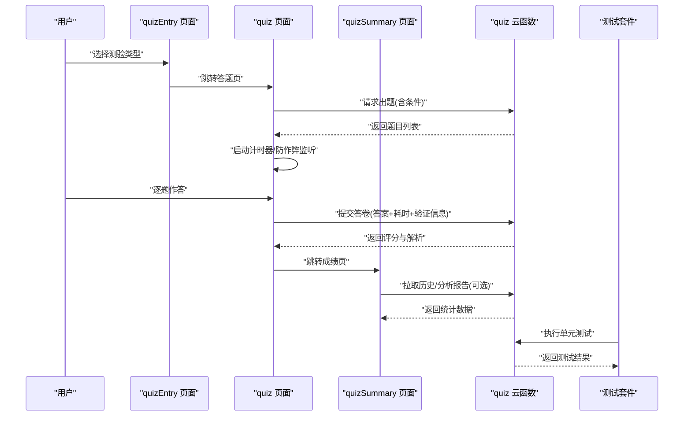

图表来源
- [miniprogram/pages/quizEntry/quizEntry.js](file://miniprogram/pages/quizEntry/quizEntry.js)
- [miniprogram/pages/quiz/quiz.js](file://miniprogram/pages/quiz/quiz.js)
- [miniprogram/pages/quizSummary/quizSummary.js](file://miniprogram/pages/quizSummary/quizSummary.js)
- [cloudfunctions/quiz/index.js](file://cloudfunctions/quiz/index.js)
- [cloudfunctions/quiz/test/quiz.test.js](file://cloudfunctions/quiz/test/quiz.test.js)

## 详细组件分析

### 新增组件：quizEntry 入口页面
职责
- 提供测验类型选择界面
- 显示测验基本信息与规则说明
- 处理用户配置参数并跳转到答题页面
- 维护测验历史记录与快捷入口

关键特性
- 响应式布局适配不同屏幕尺寸
- 测验卡片展示与分类浏览
- 快速开始与自定义配置两种模式
- 测验历史记录的本地存储

**更新** 入口页面已进行调整以与云函数更新保持一致性，优化了数据传输格式和错误处理机制。

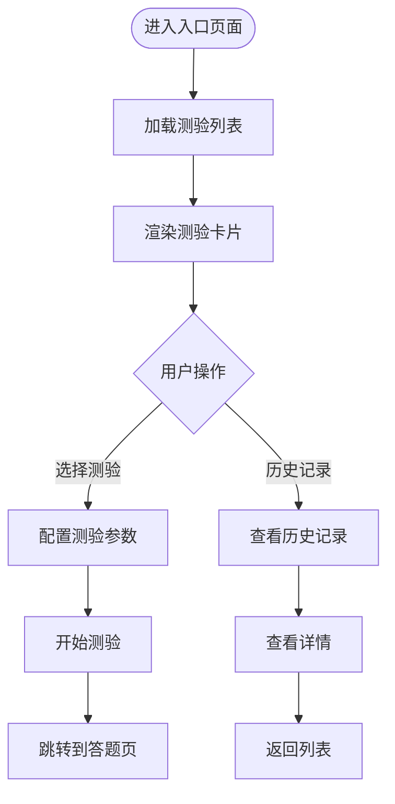

图表来源
- [miniprogram/pages/quizEntry/quizEntry.js](file://miniprogram/pages/quizEntry/quizEntry.js)
- [miniprogram/pages/quizEntry/quizEntry.wxml](file://miniprogram/pages/quizEntry/quizEntry.wxml)
- [miniprogram/pages/quizEntry/quizEntry.wxss](file://miniprogram/pages/quizEntry/quizEntry.wxss)

章节来源
- [miniprogram/pages/quizEntry/quizEntry.js](file://miniprogram/pages/quizEntry/quizEntry.js)
- [miniprogram/pages/quizEntry/quizEntry.wxml](file://miniprogram/pages/quizEntry/quizEntry.wxml)
- [miniprogram/pages/quizEntry/quizEntry.wxss](file://miniprogram/pages/quizEntry/quizEntry.wxss)

### 云函数：quiz
职责
- 接收出题参数（知识点、难度、数量等），生成题目序列
- 接收答卷数据，执行答案校验与评分
- 输出成绩详情、错题清单与简要统计

关键流程
- 出题：过滤→抽样→打乱→组装
- 校验：规范化→类型分支→比对→计分
- 统计：汇总正确率、用时、知识点薄弱点

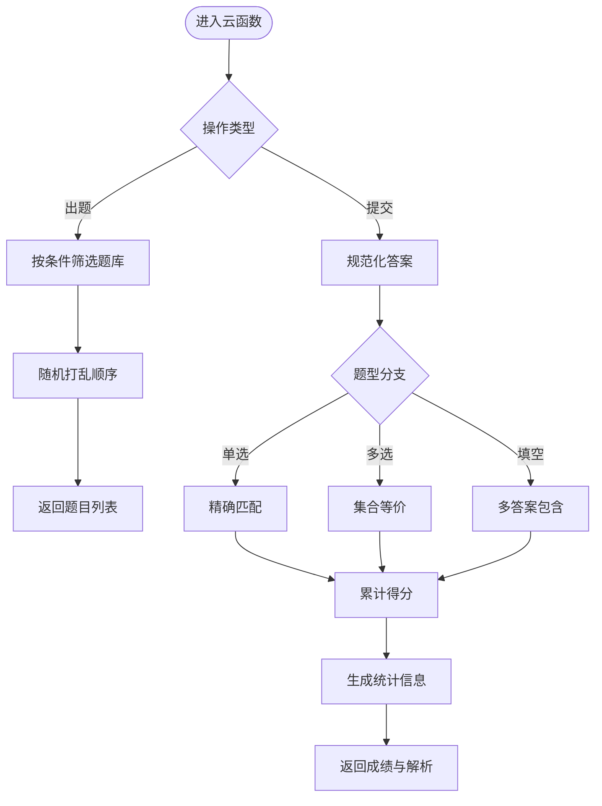

图表来源
- [cloudfunctions/quiz/index.js](file://cloudfunctions/quiz/index.js)

章节来源
- [cloudfunctions/quiz/index.js](file://cloudfunctions/quiz/index.js)
- [cloudfunctions/quiz/config.json](file://cloudfunctions/quiz/config.json)

### 小程序端：quiz 页面
职责
- 发起出题请求
- 渲染题目与选项
- 维护答题状态与计时器
- 收集答案并提交
- 处理切后台、粘贴拦截等防作弊行为

交互时序
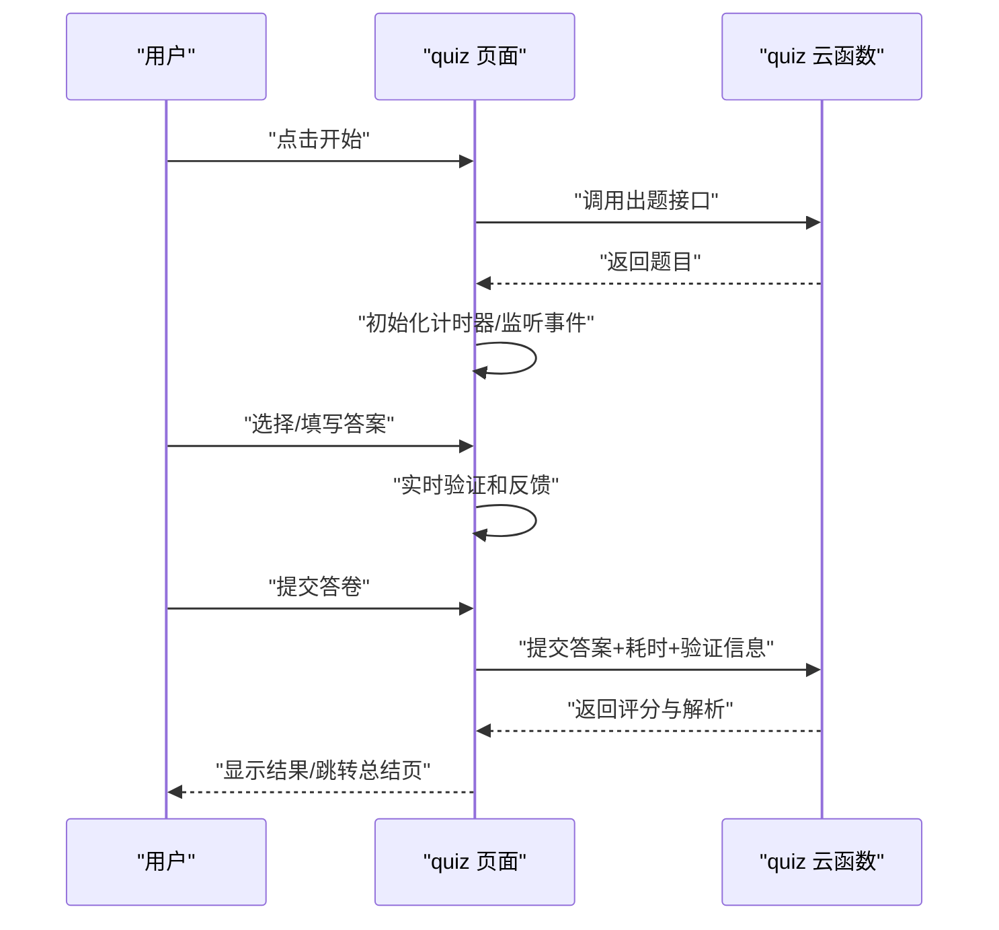

图表来源
- [miniprogram/pages/quiz/quiz.js](file://miniprogram/pages/quiz/quiz.js)
- [miniprogram/pages/quiz/quiz.wxml](file://miniprogram/pages/quiz/quiz.wxml)
- [cloudfunctions/quiz/index.js](file://cloudfunctions/quiz/index.js)

章节来源
- [miniprogram/pages/quiz/quiz.js](file://miniprogram/pages/quiz/quiz.js)
- [miniprogram/pages/quiz/quiz.wxml](file://miniprogram/pages/quiz/quiz.wxml)

### 小程序端：quizSummary 页面
职责
- 展示成绩概览、每题解析与错题清单
- 提供继续练习、复习薄弱知识点的入口
- 可选：拉取历史趋势与知识点雷达图

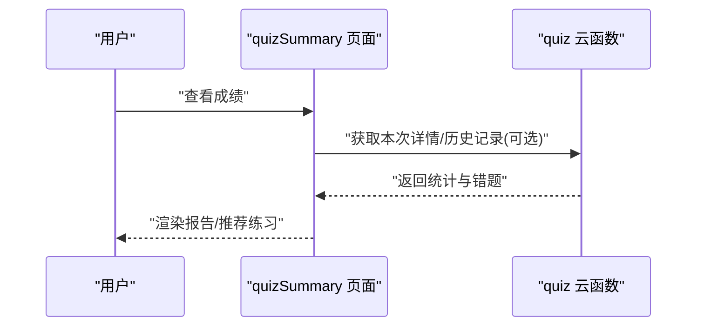

图表来源
- [miniprogram/pages/quizSummary/quizSummary.js](file://miniprogram/pages/quizSummary/quizSummary.js)
- [miniprogram/pages/quizSummary/quizSummary.wxml](file://miniprogram/pages/quizSummary/quizSummary.wxml)
- [cloudfunctions/quiz/index.js](file://cloudfunctions/quiz/index.js)

章节来源
- [miniprogram/pages/quizSummary/quizSummary.js](file://miniprogram/pages/quizSummary/quizSummary.js)
- [miniprogram/pages/quizSummary/quizSummary.wxml](file://miniprogram/pages/quizSummary/quizSummary.wxml)

### 数据结构设计（建议）
- 题目模型
  - id: 唯一标识
  - type: 题型（single/multiple/fill）
  - question: 题干
  - options: 选项数组（单选/多选）
  - answer: 标准答案（单选为字符串或索引；多选为数组；填空为集合）
  - difficulty: 难度等级
  - tags: 知识点标签
  - score: 分值
  - explanation: 解析
- 答卷模型
  - quizId: 测验批次
  - userId: 用户标识
  - answers: 题号→答案映射
  - timeUsed: 总用时
  - perQuestionTime: 每题用时
  - status: 完成/超时/中断
  - validationInfo: 验证信息
- 成绩模型
  - totalScore: 总分
  - correctCount: 正确数
  - accuracy: 正确率
  - wrongList: 错题清单（含知识点）
  - stats: 知识点掌握度、用时分布等

[本节为概念性设计说明，不直接分析具体文件]

### 随机出题算法
- 步骤
  - 根据条件过滤题库
  - 对候选集进行洗牌（Fisher-Yates）
  - 截取前 N 题作为本次试卷
- 复杂度
  - 过滤 O(n)，洗牌 O(n)，总体 O(n)
- 优化
  - 预索引：按知识点/难度建立倒排索引，减少过滤开销
  - 缓存热点题库：降低冷启动延迟

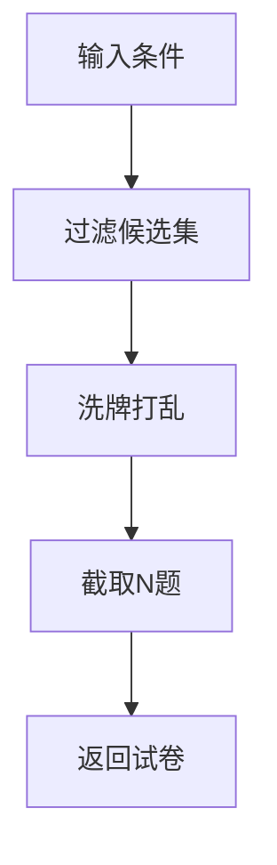

[本节为通用算法说明，不直接分析具体文件]

### 答案验证机制
- 预处理
  - 去除首尾空白、全角转半角、大小写归一化
  - 填空题同义词映射与单位换算
- 题型规则
  - 单选：answer 与 userAnswer 相等
  - 多选：排序后集合等价
  - 填空：userAnswer 属于预设答案集合
- 容错
  - 模糊匹配阈值（如编辑距离）
  - 部分正确计分（多选）

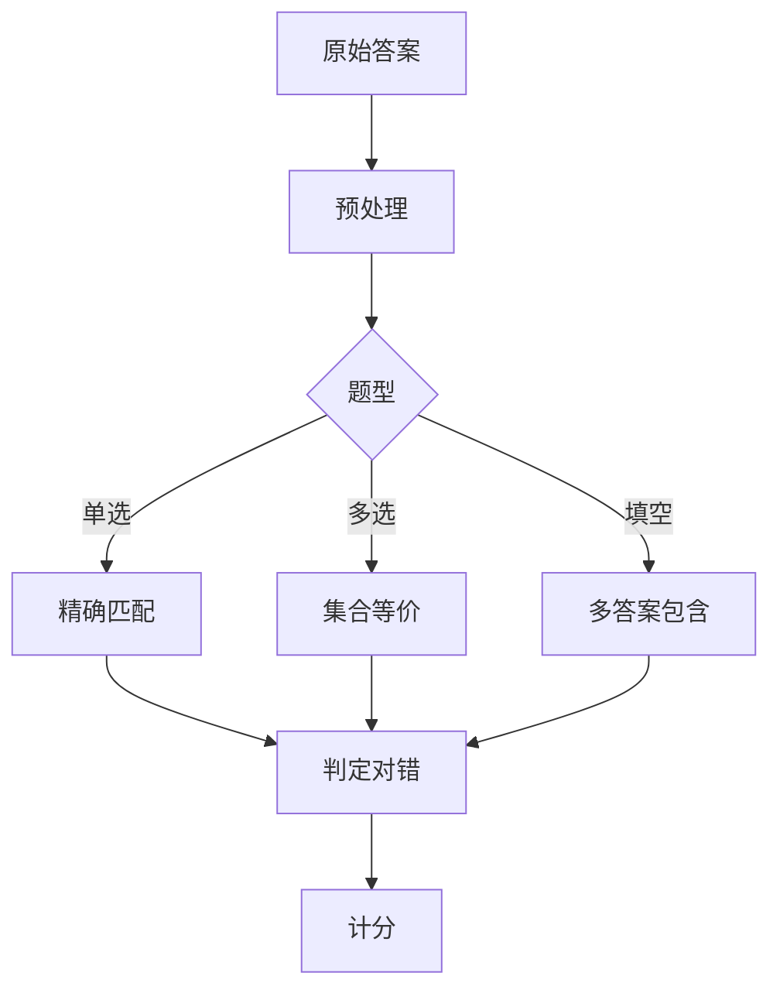

[本节为通用规则说明，不直接分析具体文件]

### 成绩计算与统计分析
- 计分
  - 单选题：答对得满分，答错不得分
  - 多选题：按正确子集比例计分
  - 填空题：完全匹配得满分
- 统计
  - 正确率、平均用时、知识点错误率
  - 错题聚类与薄弱点识别
- 可视化
  - 折线图（趋势）、饼图（题型分布）、雷达图（知识点掌握）

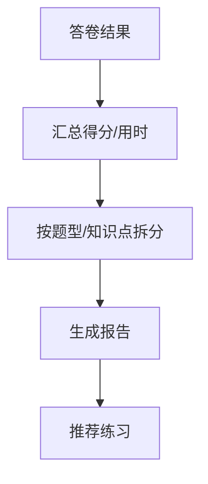

[本节为通用统计说明，不直接分析具体文件]

### 答题时间控制
- 总时长限制：到达上限自动提交
- 每题倒计时：剩余时间不足时高亮提醒
- 暂停/恢复：切换页面时暂停计时，返回后恢复
- 异常处理：网络中断重试与本地草稿保存

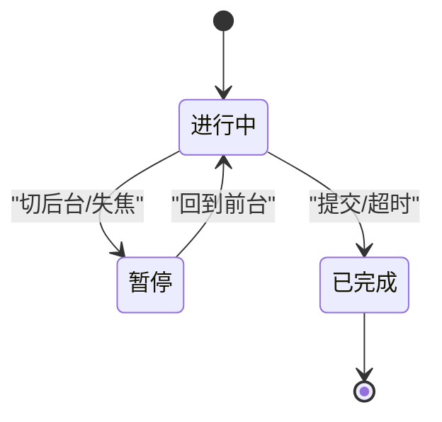

[本节为通用流程说明，不直接分析具体文件]

### 防作弊措施
- 前端
  - 监听页面可见性变化，切后台计数并提示
  - 禁用粘贴板写入/读取（input paste 拦截）
  - 禁止复制选项文本
- 后端
  - 提交签名校验（时间戳+随机盐）
  - 异常行为检测（提交间隔过短、IP/设备异常）
  - 答案一致性校验（与出题快照对比）

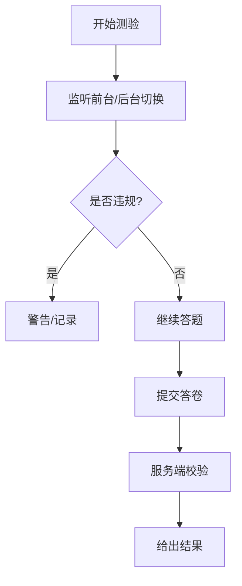

[本节为通用安全策略说明，不直接分析具体文件]

### 成绩分析与个性化推荐算法
- 能力建模
  - 基于 IRT（项目反应理论）估计题目区分度与难度
  - 基于贝叶斯知识追踪（BKT）更新知识点掌握概率
- 推荐策略
  - 针对薄弱知识点加权抽取
  - 结合遗忘曲线安排复习间隔
  - 混合策略：探索（新题）+利用（巩固）
- 指标
  - 预测准确率、推荐点击率、学习增益

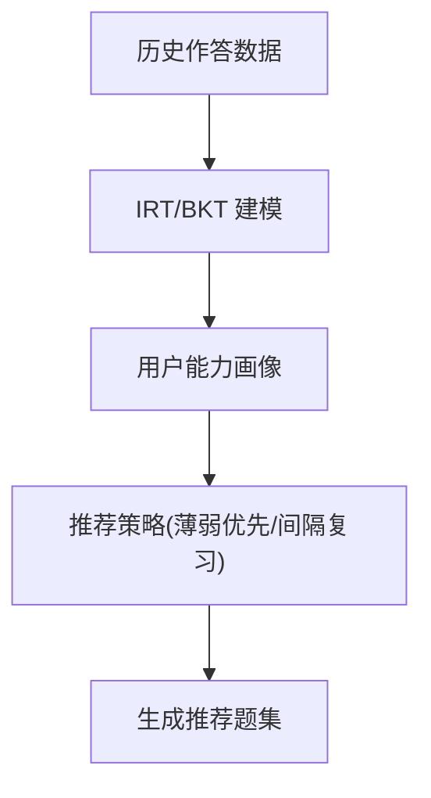

[本节为通用算法方案说明，不直接分析具体文件]

## 测试基础设施

### Jest 测试框架配置
测验系统集成了完整的Jest测试框架，提供了强大的单元测试和集成测试能力。

#### 配置文件结构
- **jest.config.js**: Jest测试框架的核心配置文件
- **package.json**: 测试脚本和依赖管理
- **__mocks__/**: WeChat SDK和其他外部依赖的模拟实现
- **test/**: 专门的测试用例目录

#### 测试环境特点
- **WeChat SDK模拟**: 完整的微信小程序API模拟环境
- **云函数测试**: 针对云函数业务逻辑的独立测试
- **异步测试支持**: 完善的Promise和async/await测试支持
- **覆盖率报告**: 自动生成代码覆盖率统计

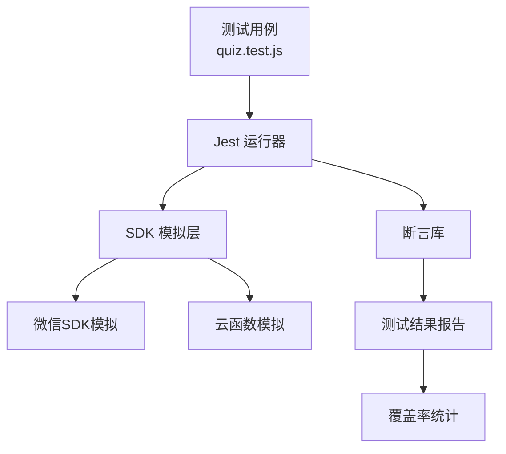

图表来源
- [cloudfunctions/quiz/jest.config.js](file://cloudfunctions/quiz/jest.config.js)
- [cloudfunctions/quiz/test/quiz.test.js](file://cloudfunctions/quiz/test/quiz.test.js)
- [cloudfunctions/quiz/__mocks__/wx-server-sdk.js](file://cloudfunctions/quiz/__mocks__/wx-server-sdk.js)

章节来源
- [cloudfunctions/quiz/jest.config.js](file://cloudfunctions/quiz/jest.config.js)
- [cloudfunctions/quiz/test/quiz.test.js](file://cloudfunctions/quiz/test/quiz.test.js)
- [cloudfunctions/quiz/__mocks__/wx-server-sdk.js](file://cloudfunctions/quiz/__mocks__/wx-server-sdk.js)

### 测试套件详解
测验系统的测试套件涵盖了核心业务逻辑的各个方面，确保代码质量和功能稳定性。

#### 测试覆盖范围
- **出题逻辑测试**: 验证随机出题算法的正确性和均匀性
- **答案验证测试**: 测试各种题型的验证规则和边界情况
- **成绩计算测试**: 验证分数统计和错误处理的准确性
- **异常处理测试**: 测试错误场景下的系统行为

#### 模拟环境实现
- **WeChat SDK模拟**: 提供完整的微信小程序API模拟
- **数据库模拟**: 模拟云端数据库操作
- **文件系统模拟**: 模拟文件读写操作
- **网络请求模拟**: 模拟HTTP请求和响应

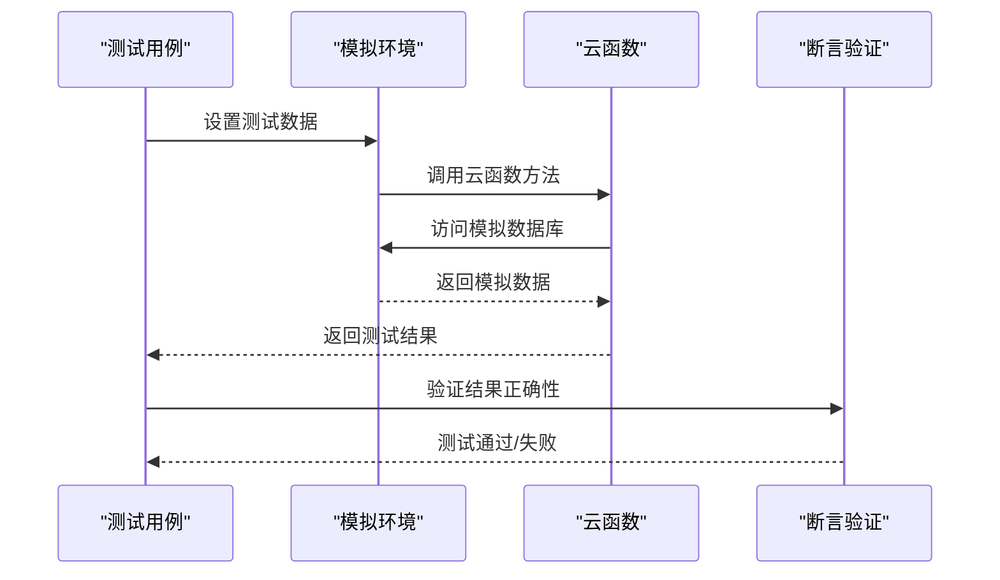

图表来源
- [cloudfunctions/quiz/test/quiz.test.js](file://cloudfunctions/quiz/test/quiz.test.js)
- [cloudfunctions/quiz/__mocks__/wx-server-sdk.js](file://cloudfunctions/quiz/__mocks__/wx-server-sdk.js)

章节来源
- [cloudfunctions/quiz/test/quiz.test.js](file://cloudfunctions/quiz/test/quiz.test.js)
- [cloudfunctions/quiz/__mocks__/wx-server-sdk.js](file://cloudfunctions/quiz/__mocks__/wx-server-sdk.js)

### 测试执行流程
测验系统支持多种测试执行方式，满足不同开发阶段的需求。

#### 测试命令
- **npm test**: 执行所有测试用例
- **npm run test:watch**: 监听模式运行测试
- **npm run test:coverage**: 生成覆盖率报告
- **npm run test:unit**: 仅执行单元测试

#### CI/CD 集成
- **GitHub Actions**: 自动化测试流水线
- **测试报告**: 自动生成HTML格式的测试报告
- **质量门禁**: 测试失败阻止代码合并

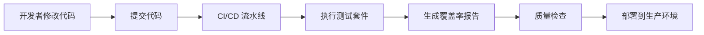

[本节为测试基础设施说明，不直接分析具体文件]

## 依赖关系分析
- 小程序端依赖
  - quizEntry 页面作为入口，依赖 quiz 页面进行答题
  - quiz 页面依赖 quiz 云函数
  - quizSummary 页面依赖 quiz 云函数
  - app.js 提供全局配置与生命周期钩子
- 云函数端依赖
  - config.json 定义运行环境与权限
  - index.js 实现业务逻辑
  - jest.config.js 配置测试环境
  - __mocks__ 提供测试模拟依赖
  - test 目录包含测试用例

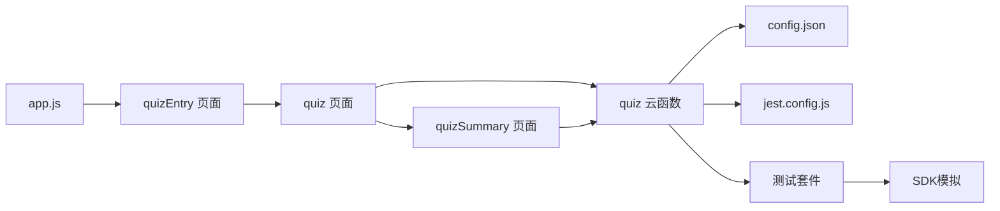

图表来源
- [miniprogram/app.js](file://miniprogram/app.js)
- [miniprogram/pages/quizEntry/quizEntry.js](file://miniprogram/pages/quizEntry/quizEntry.js)
- [miniprogram/pages/quiz/quiz.js](file://miniprogram/pages/quiz/quiz.js)
- [miniprogram/pages/quizSummary/quizSummary.js](file://miniprogram/pages/quizSummary/quizSummary.js)
- [cloudfunctions/quiz/index.js](file://cloudfunctions/quiz/index.js)
- [cloudfunctions/quiz/config.json](file://cloudfunctions/quiz/config.json)
- [cloudfunctions/quiz/jest.config.js](file://cloudfunctions/quiz/jest.config.js)
- [cloudfunctions/quiz/test/quiz.test.js](file://cloudfunctions/quiz/test/quiz.test.js)
- [cloudfunctions/quiz/__mocks__/wx-server-sdk.js](file://cloudfunctions/quiz/__mocks__/wx-server-sdk.js)

章节来源
- [miniprogram/app.js](file://miniprogram/app.js)
- [miniprogram/pages/quizEntry/quizEntry.js](file://miniprogram/pages/quizEntry/quizEntry.js)
- [miniprogram/pages/quiz/quiz.js](file://miniprogram/pages/quiz/quiz.js)
- [miniprogram/pages/quizSummary/quizSummary.js](file://miniprogram/pages/quizSummary/quizSummary.js)
- [cloudfunctions/quiz/index.js](file://cloudfunctions/quiz/index.js)
- [cloudfunctions/quiz/config.json](file://cloudfunctions/quiz/config.json)
- [cloudfunctions/quiz/jest.config.js](file://cloudfunctions/quiz/jest.config.js)
- [cloudfunctions/quiz/test/quiz.test.js](file://cloudfunctions/quiz/test/quiz.test.js)
- [cloudfunctions/quiz/__mocks__/wx-server-sdk.js](file://cloudfunctions/quiz/__mocks__/wx-server-sdk.js)

## 性能考虑
- 题库索引与分页：按知识点/难度建索引，避免全表扫描
- 批量接口：合并出题与提交，减少往返次数
- 客户端缓存：缓存静态资源与上次试卷结构
- 异步与节流：长任务拆分为微任务，提交节流防止重复
- 压缩与限流：大对象压缩传输，云函数并发与超时控制
- **测试性能优化**: 模拟环境减少了外部依赖的性能开销，提高了测试执行速度

## 故障排查指南
- 常见问题
  - 无法出题：检查云函数权限与数据库连接
  - 答案不一致：确认预处理规则与答案格式
  - 计时异常：核对页面可见性事件与定时器清理
  - 提交失败：检查网络重试与幂等键
  - 入口页面问题：检查路由配置与页面跳转逻辑
  - 测试失败：检查Jest配置和模拟环境设置
- 定位方法
  - 开启调试日志，记录入参与出参
  - 复现最小用例，隔离问题范围
  - 对比不同设备/网络环境的表现
  - 使用测试套件快速定位问题
  - 检查覆盖率报告找出未测试的代码路径

## 结论
本测验系统围绕"题目管理—答题—评分—统计—推荐"形成闭环。通过规范的数据结构、稳健的随机出题与答案校验、完善的计时与防作弊策略，以及可扩展的成绩分析与个性化推荐方案，能够满足多样化教学场景的需求。

**重大改进** 本次更新为测验系统引入了全面的测试基础设施，包括Jest测试框架、WeChat SDK模拟环境和专用测试套件。这些改进显著提升了代码质量、可维护性和开发效率。同时quiz入口页面的调整确保了与云函数更新的兼容性，为后续的功能扩展奠定了坚实的基础。

未来可在 IRT/BKT 建模与自适应路径上持续演进，进一步提升学习效率与体验。

## 附录
- 术语
  - 知识点：用于组织题目的主题标签
  - 区分度：题目对能力差异的分辨能力
  - 掌握概率：用户对某知识点的掌握程度估计
  - 测试覆盖率：被测试代码占全部代码的比例
  - 模拟环境：用于替代真实外部依赖的测试环境
- 参考实现位置
  - 云函数主逻辑：[cloudfunctions/quiz/index.js](file://cloudfunctions/quiz/index.js)
  - 云函数配置：[cloudfunctions/quiz/config.json](file://cloudfunctions/quiz/config.json)
  - 测试配置：[cloudfunctions/quiz/jest.config.js](file://cloudfunctions/quiz/jest.config.js)
  - 测试套件：[cloudfunctions/quiz/test/quiz.test.js](file://cloudfunctions/quiz/test/quiz.test.js)
  - SDK模拟：[cloudfunctions/quiz/__mocks__/wx-server-sdk.js](file://cloudfunctions/quiz/__mocks__/wx-server-sdk.js)
  - 测验入口页面：[miniprogram/pages/quizEntry/quizEntry.js](file://miniprogram/pages/quizEntry/quizEntry.js)、[miniprogram/pages/quizEntry/quizEntry.wxml](file://miniprogram/pages/quizEntry/quizEntry.wxml)、[miniprogram/pages/quizEntry/quizEntry.wxss](file://miniprogram/pages/quizEntry/quizEntry.wxss)
  - 答题页面：[miniprogram/pages/quiz/quiz.js](file://miniprogram/pages/quiz/quiz.js)、[miniprogram/pages/quiz/quiz.wxml](file://miniprogram/pages/quiz/quiz.wxml)
  - 成绩页面：[miniprogram/pages/quizSummary/quizSummary.js](file://miniprogram/pages/quizSummary/quizSummary.js)、[miniprogram/pages/quizSummary/quizSummary.wxml](file://miniprogram/pages/quizSummary/quizSummary.wxml)
  - 应用入口：[miniprogram/app.js](file://miniprogram/app.js)