# 答题逻辑

<cite>
**本文引用的文件**   
- [miniprogram/pages/quiz/quiz.js](file://miniprogram/pages/quiz/quiz.js)
- [miniprogram/pages/quiz/quiz.wxml](file://miniprogram/pages/quiz/quiz.wxml)
- [miniprogram/pages/quizSummary/quizSummary.js](file://miniprogram/pages/quizSummary/quizSummary.js)
- [cloudfunctions/quiz/index.js](file://cloudfunctions/quiz/index.js)
- [cloudfunctions/report/index.js](file://cloudfunctions/report/index.js)
- [miniprogram/app.json](file://miniprogram/app.json)
</cite>

## 目录
1. [简介](#简介)
2. [项目结构](#项目结构)
3. [核心组件](#核心组件)
4. [架构总览](#架构总览)
5. [详细组件分析](#详细组件分析)
6. [依赖分析](#依赖分析)
7. [性能考虑](#性能考虑)
8. [故障排查指南](#故障排查指南)
9. [结论](#结论)
10. [附录](#附录)

## 简介
本文件围绕“答题逻辑模块”进行系统化文档化，覆盖以下关键主题：
- 答题状态管理：题目加载、进度保存、断点续答、完成结算。
- 答案验证机制：前端校验与云端二次校验、题型适配的格式校验。
- 实时反馈系统：即时提示、错误高亮、解析展示。
- 防作弊措施：切屏检测、计时异常、提交一致性校验。
- 时间控制与进度持久化：倒计时、自动保存、恢复策略。
- 异常处理：网络失败、数据不一致、超时重试。
- 不同题型的交互实现：单选、多选、判断、填空等。
- 行为分析与学习路径优化：基于答题记录的数据上报与推荐策略。

## 项目结构
答题相关的前端页面位于小程序 pages 下，云端函数提供题库获取、提交判分与报告生成能力。

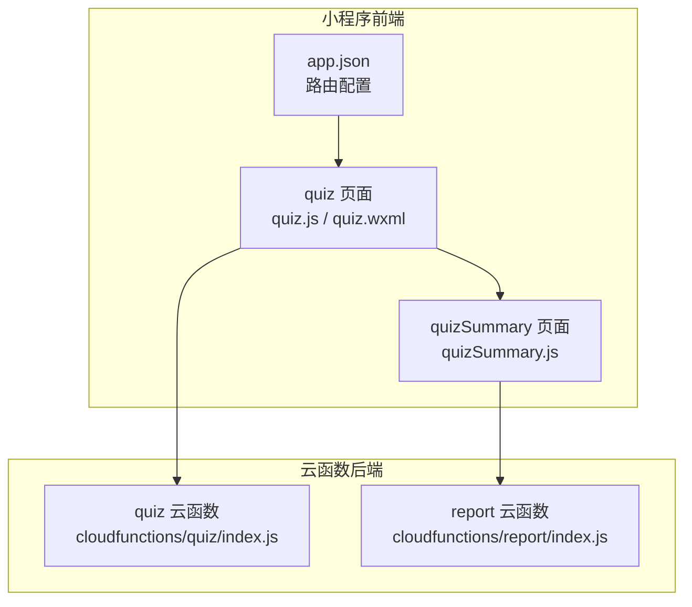

**图示来源**
- [miniprogram/pages/quiz/quiz.js](file://miniprogram/pages/quiz/quiz.js)
- [miniprogram/pages/quiz/quiz.wxml](file://miniprogram/pages/quiz/quiz.wxml)
- [miniprogram/pages/quizSummary/quizSummary.js](file://miniprogram/pages/quizSummary/quizSummary.js)
- [cloudfunctions/quiz/index.js](file://cloudfunctions/quiz/index.js)
- [cloudfunctions/report/index.js](file://cloudfunctions/report/index.js)
- [miniprogram/app.json](file://miniprogram/app.json)

**章节来源**
- [miniprogram/pages/quiz/quiz.js](file://miniprogram/pages/quiz/quiz.js)
- [miniprogram/pages/quiz/quiz.wxml](file://miniprogram/pages/quiz/quiz.wxml)
- [miniprogram/pages/quizSummary/quizSummary.js](file://miniprogram/pages/quizSummary/quizSummary.js)
- [cloudfunctions/quiz/index.js](file://cloudfunctions/quiz/index.js)
- [cloudfunctions/report/index.js](file://cloudfunctions/report/index.js)
- [miniprogram/app.json](file://miniprogram/app.json)

## 核心组件
- 答题页（quiz）
  - 负责题目渲染、用户交互、本地状态维护、倒计时、自动保存、提交前校验、结果跳转。
- 答题总结页（quizSummary）
  - 负责汇总得分、错题回顾、解析展示、行为上报入口。
- 云函数（quiz）
  - 负责接收提交、按规则判分、返回标准结果与解析。
- 报告云函数（report）
  - 负责聚合学习行为、生成报告或用于后续学习路径推荐。

**章节来源**
- [miniprogram/pages/quiz/quiz.js](file://miniprogram/pages/quiz/quiz.js)
- [miniprogram/pages/quizSummary/quizSummary.js](file://miniprogram/pages/quizSummary/quizSummary.js)
- [cloudfunctions/quiz/index.js](file://cloudfunctions/quiz/index.js)
- [cloudfunctions/report/index.js](file://cloudfunctions/report/index.js)

## 架构总览
答题流程从前端发起，经云函数完成权威判分，再回传前端展示并持久化。

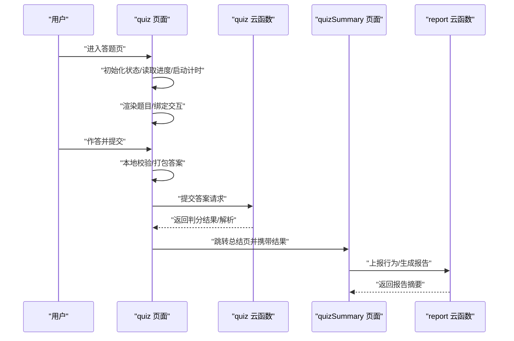

**图示来源**
- [miniprogram/pages/quiz/quiz.js](file://miniprogram/pages/quiz/quiz.js)
- [miniprogram/pages/quiz/quiz.wxml](file://miniprogram/pages/quiz/quiz.wxml)
- [miniprogram/pages/quizSummary/quizSummary.js](file://miniprogram/pages/quizSummary/quizSummary.js)
- [cloudfunctions/quiz/index.js](file://cloudfunctions/quiz/index.js)
- [cloudfunctions/report/index.js](file://cloudfunctions/report/index.js)

## 详细组件分析

### 答题状态管理
- 状态维度
  - 题目列表与当前索引
  - 用户答案映射（题号→答案）
  - 计时器与剩余时间
  - 是否已提交/锁定
  - 进度快照（自动保存）
- 生命周期
  - 进入页面：拉取题目、恢复进度、启动计时
  - 切换题目：更新当前索引、同步答案映射
  - 提交：触发校验、调用云函数、落盘结果
  - 离开/后台：保存进度、暂停计时
- 断点续答
  - 使用本地存储缓存进度快照（题号、答案、时间戳）
  - 重新进入时优先恢复最近一次快照
  - 若检测到服务端最新提交，以服务端为准合并差异

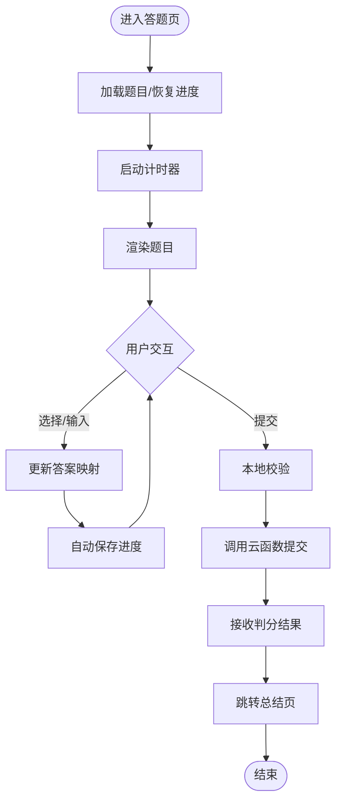

**图示来源**
- [miniprogram/pages/quiz/quiz.js](file://miniprogram/pages/quiz/quiz.js)
- [miniprogram/pages/quiz/quiz.wxml](file://miniprogram/pages/quiz/quiz.wxml)

**章节来源**
- [miniprogram/pages/quiz/quiz.js](file://miniprogram/pages/quiz/quiz.js)
- [miniprogram/pages/quiz/quiz.wxml](file://miniprogram/pages/quiz/quiz.wxml)

### 答案验证机制
- 前端校验
  - 必填检查、选项范围校验、填空题非空与长度限制
  - 多选型去重与顺序无关比较
- 云端二次校验
  - 依据题目类型与参考答案进行严格比对
  - 返回标准化结果：正确/错误、得分、解析
- 题型适配
  - 单选：唯一匹配
  - 多选：集合等价
  - 判断：布尔一致
  - 填空：忽略大小写与空白差异（可配置）

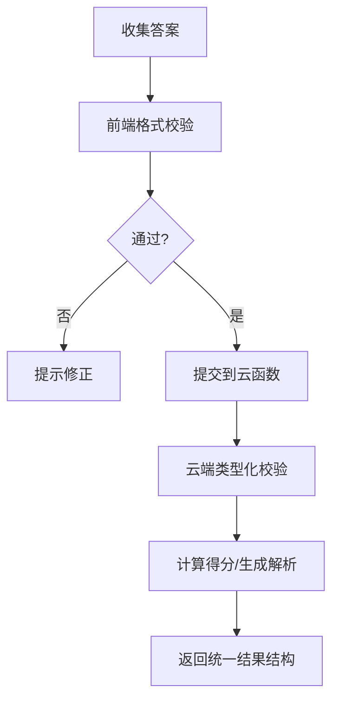

**图示来源**
- [miniprogram/pages/quiz/quiz.js](file://miniprogram/pages/quiz/quiz.js)
- [cloudfunctions/quiz/index.js](file://cloudfunctions/quiz/index.js)

**章节来源**
- [miniprogram/pages/quiz/quiz.js](file://miniprogram/pages/quiz/quiz.js)
- [cloudfunctions/quiz/index.js](file://cloudfunctions/quiz/index.js)

### 实时反馈系统
- 即时提示
  - 错误项高亮、禁用再次修改（提交后）
  - 填空题输入时给出最小/最大长度提示
- 解析展示
  - 总结页按题展示解析与知识点标签
- 交互约束
  - 提交后锁定界面，防止重复提交

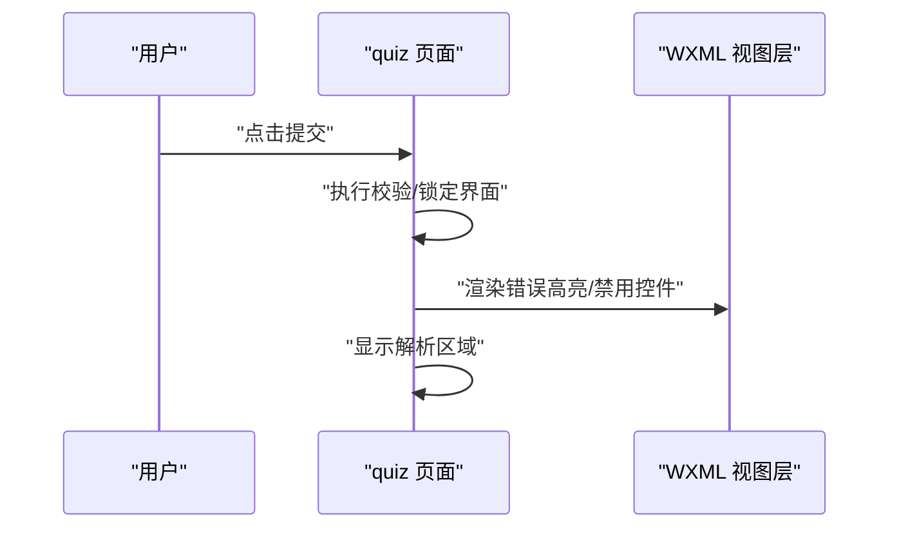

**图示来源**
- [miniprogram/pages/quiz/quiz.js](file://miniprogram/pages/quiz/quiz.js)
- [miniprogram/pages/quiz/quiz.wxml](file://miniprogram/pages/quiz/quiz.wxml)

**章节来源**
- [miniprogram/pages/quiz/quiz.js](file://miniprogram/pages/quiz/quiz.js)
- [miniprogram/pages/quiz/quiz.wxml](file://miniprogram/pages/quiz/quiz.wxml)

### 防作弊措施
- 切屏/后台检测
  - 监听页面隐藏事件，记录切屏次数与时长
  - 超过阈值则标记风险并在报告中体现
- 计时异常
  - 客户端与服务端时间差容错；提交时间戳由服务端校正
- 提交一致性
  - 提交包包含哈希签名（题号+答案），服务端校验完整性
- 随机化与乱序
  - 题目与选项乱序下发，降低共享答案有效性

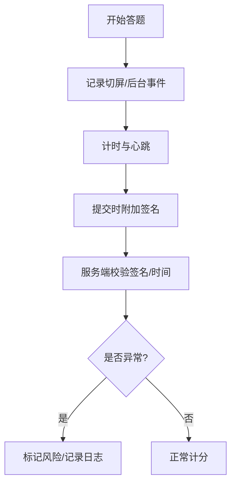

**图示来源**
- [miniprogram/pages/quiz/quiz.js](file://miniprogram/pages/quiz/quiz.js)
- [cloudfunctions/quiz/index.js](file://cloudfunctions/quiz/index.js)

**章节来源**
- [miniprogram/pages/quiz/quiz.js](file://miniprogram/pages/quiz/quiz.js)
- [cloudfunctions/quiz/index.js](file://cloudfunctions/quiz/index.js)

### 时间控制、进度保存与断点续答
- 时间控制
  - 全局倒计时与单题可选限时（可扩展）
  - 到达截止时间自动提交未作答题目
- 进度保存
  - 定时快照（如每 N 秒）与关键事件触发保存（切换题目、提交）
  - 本地存储键名建议包含用户标识与批次 ID
- 断点续答
  - 恢复策略：优先服务端最新提交；否则取本地最近快照
  - 冲突解决：以时间戳较新者为准，合并未提交答案

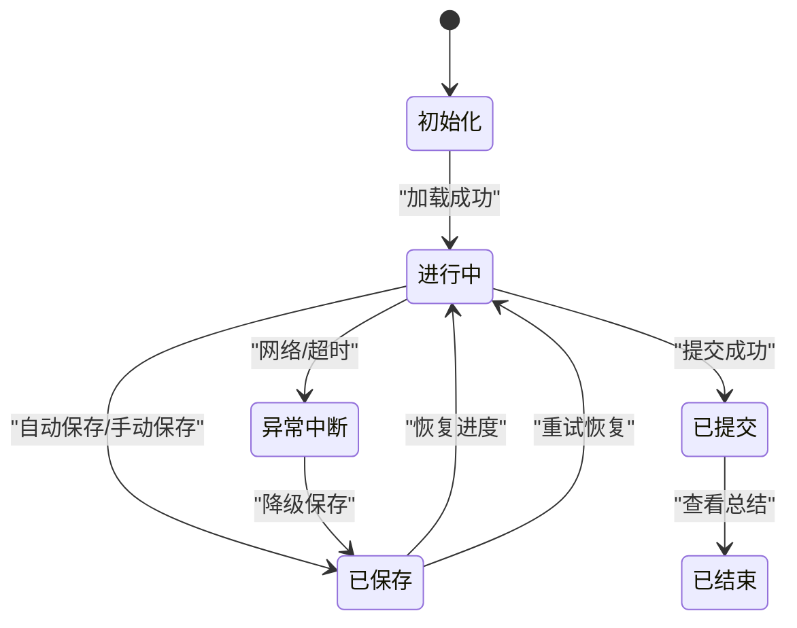

**图示来源**
- [miniprogram/pages/quiz/quiz.js](file://miniprogram/pages/quiz/quiz.js)

**章节来源**
- [miniprogram/pages/quiz/quiz.js](file://miniprogram/pages/quiz/quiz.js)

### 异常处理机制
- 网络异常
  - 重试策略（指数退避）、离线缓存待提交队列
- 数据不一致
  - 对比本地与云端进度，提示用户确认
- 超时处理
  - 设置请求超时，失败回退到本地草稿
- 幂等提交
  - 使用提交批次号保证重复提交不重复计分

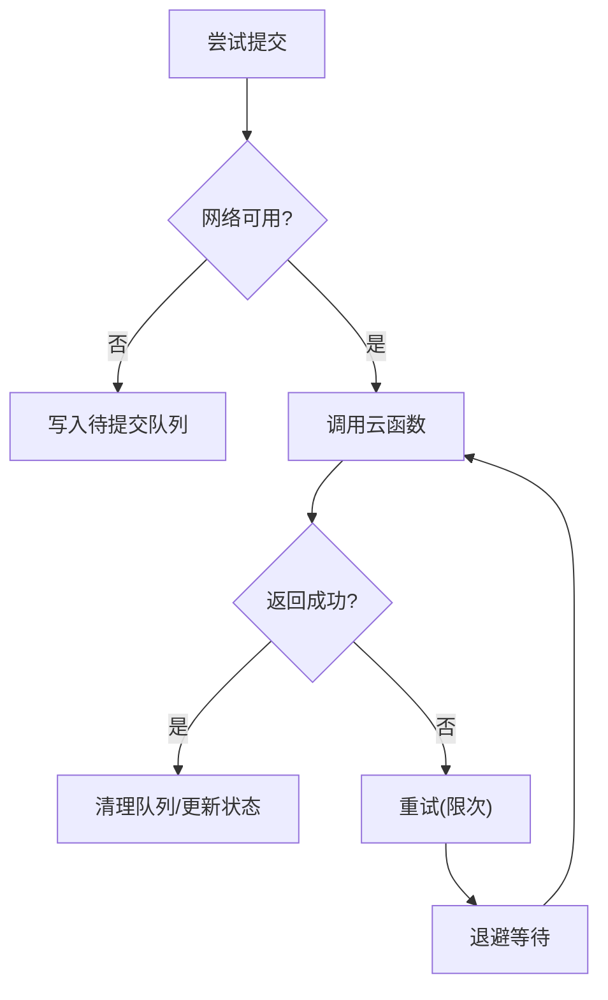

**图示来源**
- [miniprogram/pages/quiz/quiz.js](file://miniprogram/pages/quiz/quiz.js)
- [cloudfunctions/quiz/index.js](file://cloudfunctions/quiz/index.js)

**章节来源**
- [miniprogram/pages/quiz/quiz.js](file://miniprogram/pages/quiz/quiz.js)
- [cloudfunctions/quiz/index.js](file://cloudfunctions/quiz/index.js)

### 不同题型的答题交互实现
- 单选
  - 点击即选中，提交后锁定不可改
- 多选
  - 支持勾选/取消，提交前校验至少一项
- 判断
  - 二选一，快速切换
- 填空
  - 文本输入，支持占位符与长度提示
- 智能提示
  - 根据历史薄弱知识点在总结页给出复习建议

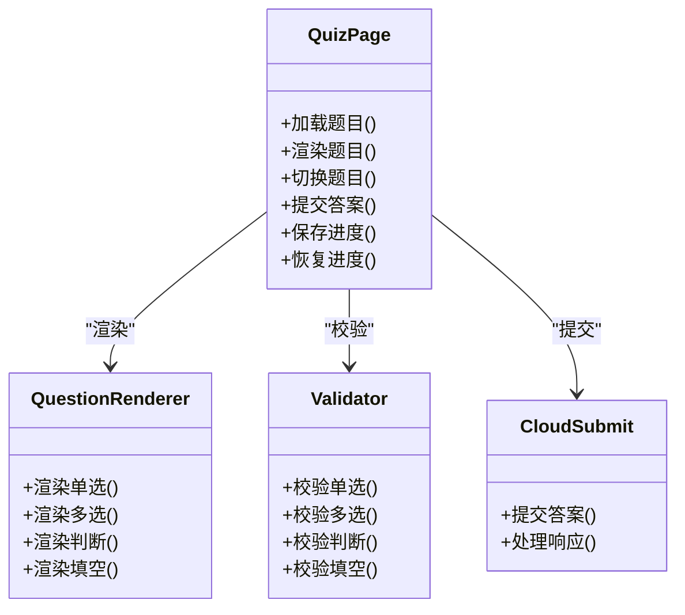

**图示来源**
- [miniprogram/pages/quiz/quiz.js](file://miniprogram/pages/quiz/quiz.js)
- [miniprogram/pages/quiz/quiz.wxml](file://miniprogram/pages/quiz/quiz.wxml)

**章节来源**
- [miniprogram/pages/quiz/quiz.js](file://miniprogram/pages/quiz/quiz.js)
- [miniprogram/pages/quiz/quiz.wxml](file://miniprogram/pages/quiz/quiz.wxml)

### 答题行为分析与学习路径优化
- 数据采集
  - 每题耗时、错误率、切屏次数、提交延迟
- 指标计算
  - 知识点掌握度、易错点分布、学习稳定性
- 推荐策略
  - 基于错题与薄弱知识点生成个性化练习清单
  - 结合间隔重复算法安排复习计划
- 报告输出
  - 通过 report 云函数聚合数据，返回可视化摘要

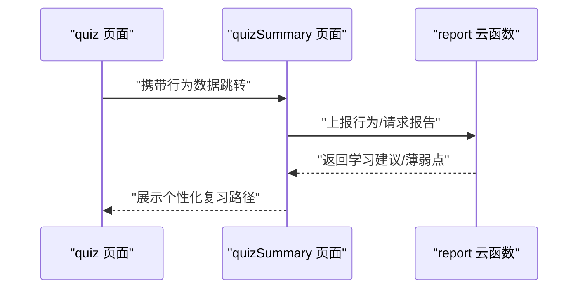

**图示来源**
- [miniprogram/pages/quizSummary/quizSummary.js](file://miniprogram/pages/quizSummary/quizSummary.js)
- [cloudfunctions/report/index.js](file://cloudfunctions/report/index.js)

**章节来源**
- [miniprogram/pages/quizSummary/quizSummary.js](file://miniprogram/pages/quizSummary/quizSummary.js)
- [cloudfunctions/report/index.js](file://cloudfunctions/report/index.js)

## 依赖分析
- 前端依赖
  - quiz 页面依赖 WXML 模板渲染与小程序 API（计时、存储、导航）
  - quizSummary 页面依赖 report 云函数生成报告
- 后端依赖
  - quiz 云函数依赖题库与评分规则
  - report 云函数依赖用户画像与历史数据

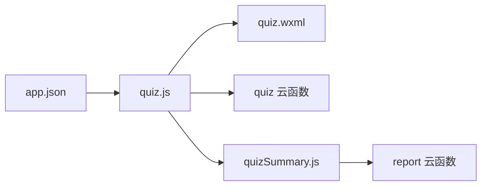

**图示来源**
- [miniprogram/pages/quiz/quiz.js](file://miniprogram/pages/quiz/quiz.js)
- [miniprogram/pages/quiz/quiz.wxml](file://miniprogram/pages/quiz/quiz.wxml)
- [miniprogram/pages/quizSummary/quizSummary.js](file://miniprogram/pages/quizSummary/quizSummary.js)
- [cloudfunctions/quiz/index.js](file://cloudfunctions/quiz/index.js)
- [cloudfunctions/report/index.js](file://cloudfunctions/report/index.js)
- [miniprogram/app.json](file://miniprogram/app.json)

**章节来源**
- [miniprogram/pages/quiz/quiz.js](file://miniprogram/pages/quiz/quiz.js)
- [miniprogram/pages/quiz/quiz.wxml](file://miniprogram/pages/quiz/quiz.wxml)
- [miniprogram/pages/quizSummary/quizSummary.js](file://miniprogram/pages/quizSummary/quizSummary.js)
- [cloudfunctions/quiz/index.js](file://cloudfunctions/quiz/index.js)
- [cloudfunctions/report/index.js](file://cloudfunctions/report/index.js)
- [miniprogram/app.json](file://miniprogram/app.json)

## 性能考虑
- 减少不必要的重渲染：仅对变更的题目区块更新
- 批量提交：将多次局部答案合并为一次提交
- 懒加载：长列表题目按需渲染
- 云函数侧缓存热点题目与解析，降低冷启动开销
- 前端节流：自动保存频率合理设置，避免频繁 I/O

[本节为通用指导，无需特定文件引用]

## 故障排查指南
- 常见问题
  - 提交无响应：检查网络状态与重试策略
  - 进度丢失：核对本地快照时间戳与服务端提交时间
  - 判分不一致：对比前端校验与云端规则差异
  - 计时异常：校准客户端时间，关注服务端时间戳
- 定位步骤
  - 打开总结页查看行为上报是否成功
  - 检查云函数日志中的签名校验与时间戳
  - 复现切屏场景，观察风险标记是否正确

**章节来源**
- [miniprogram/pages/quiz/quiz.js](file://miniprogram/pages/quiz/quiz.js)
- [miniprogram/pages/quizSummary/quizSummary.js](file://miniprogram/pages/quizSummary/quizSummary.js)
- [cloudfunctions/quiz/index.js](file://cloudfunctions/quiz/index.js)
- [cloudfunctions/report/index.js](file://cloudfunctions/report/index.js)

## 结论
本模块通过清晰的状态管理、严格的验证机制、完善的反馈与防作弊策略，以及健壮的时间控制与断点续答能力，构建了稳定可靠的答题体验。结合行为分析与学习路径优化，进一步提升了学习效果与个性化程度。

[本节为总结性内容，无需特定文件引用]

## 附录
- 术语
  - 进度快照：包含题号、答案、时间戳的序列化数据
  - 提交批次号：用于幂等提交的唯一标识
  - 风险标记：因切屏或计时异常产生的安全标记
- 扩展建议
  - 增加题型扩展点（如连线题、排序题）
  - 引入自适应难度调整
  - 增强可视化报告与导出功能

[本节为补充信息，无需特定文件引用]